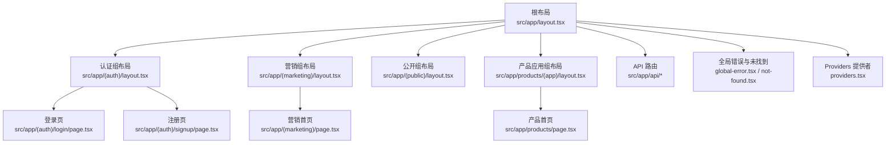
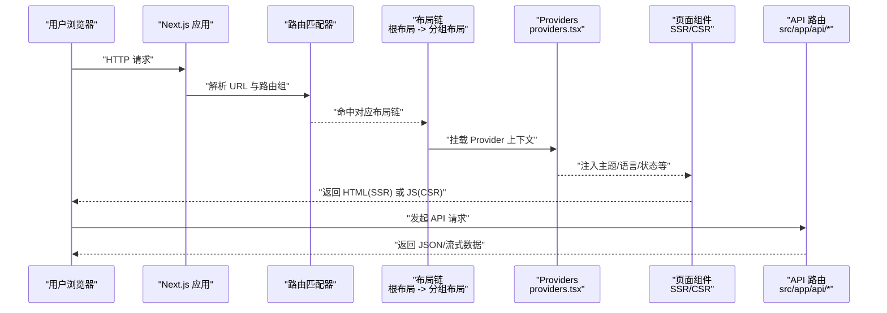
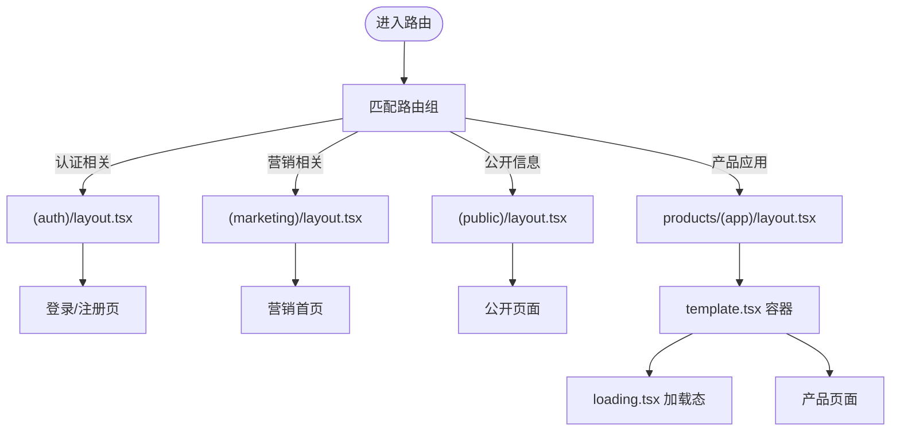
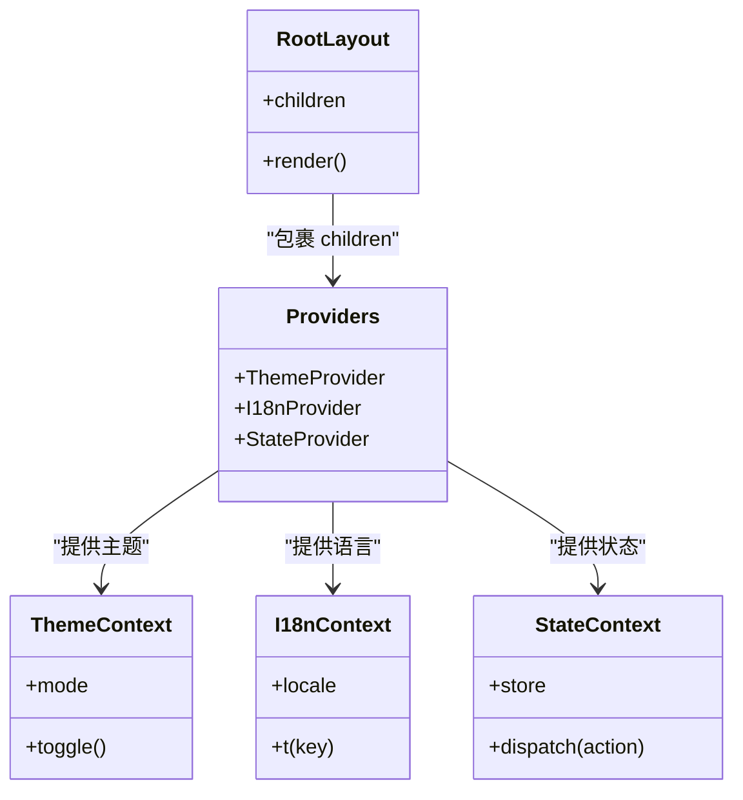
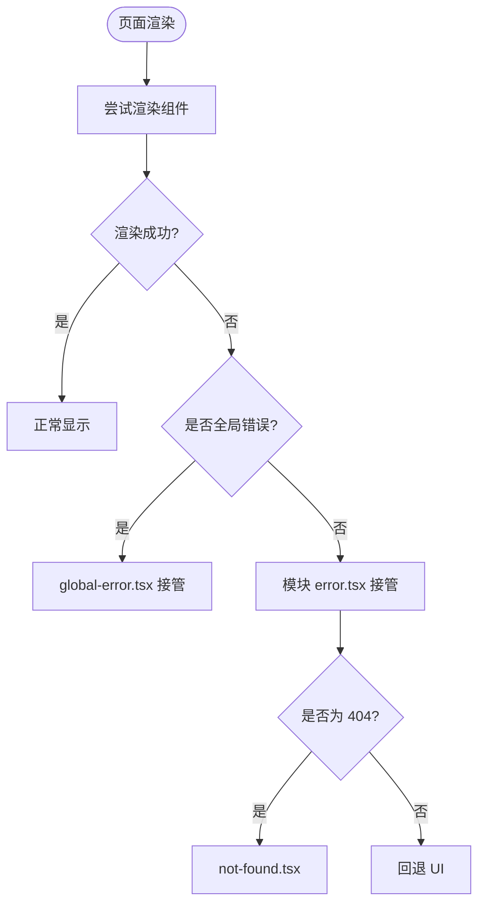
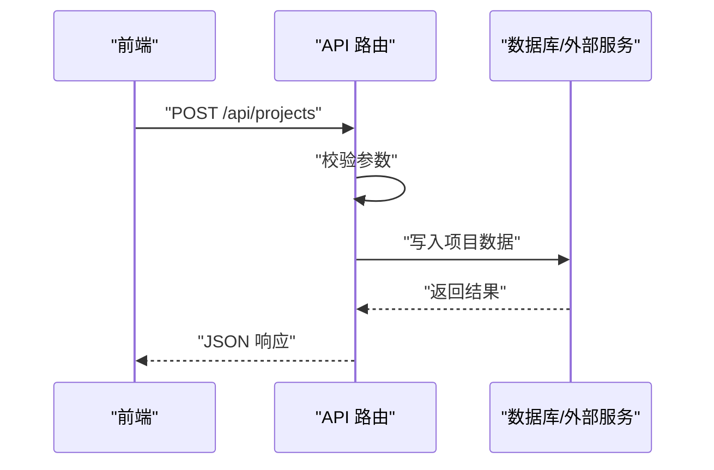
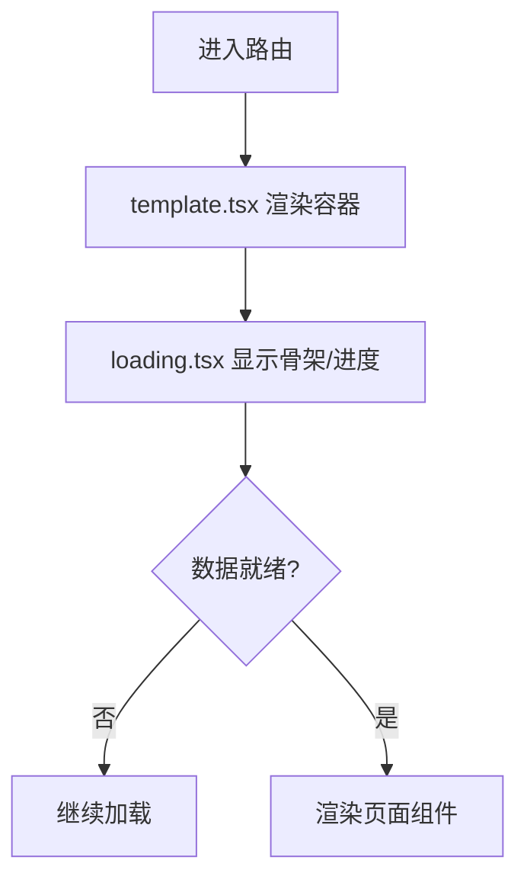
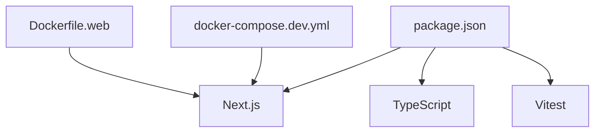

# Next.js 应用结构

<cite>
**本文引用的文件**   
- [src/app/layout.tsx](file://src/app/layout.tsx)
- [src/app/providers.tsx](file://src/app/providers.tsx)
- [src/app/global-error.tsx](file://src/app/global-error.tsx)
- [src/app/not-found.tsx](file://src/app/not-found.tsx)
- [src/app/(auth)/layout.tsx](file://src/app/(auth)/layout.tsx)
- [src/app/(marketing)/layout.tsx](file://src/app/(marketing)/layout.tsx)
- [src/app/(public)/layout.tsx](file://src/app/(public)/layout.tsx)
- [src/app/products/(app)/layout.tsx](file://src/app/products/(app)/layout.tsx)
- [src/app/products/(app)/loading.tsx](file://src/app/products/(app)/loading.tsx)
- [src/app/products/(app)/error.tsx](file://src/app/products/(app)/error.tsx)
- [src/app/products/(app)/not-found.tsx](file://src/app/products/(app)/not-found.tsx)
- [src/app/products/(app)/template.tsx](file://src/app/products/(app)/template.tsx)
- [src/app/products/page.tsx](file://src/app/products/page.tsx)
- [src/app/(auth)/login/page.tsx](file://src/app/(auth)/login/page.tsx)
- [src/app/(auth)/signup/page.tsx](file://src/app/(auth)/signup/page.tsx)
- [src/app/(marketing)/page.tsx](file://src/app/(marketing)/page.tsx)
- [src/app/api/ping/route.ts](file://src/app/api/ping/route.ts)
- [src/app/api/projects/route.ts](file://src/app/api/projects/route.ts)
- [src/app/api/render/route.ts](file://src/app/api/render/route.ts)
- [next.config.ts](file://next.config.ts)
- [package.json](file://package.json)
</cite>

## 目录
1. [简介](#简介)
2. [项目结构](#项目结构)
3. [核心组件](#核心组件)
4. [架构总览](#架构总览)
5. [详细组件分析](#详细组件分析)
6. [依赖分析](#依赖分析)
7. [性能考虑](#性能考虑)
8. [故障排查指南](#故障排查指南)
9. [结论](#结论)
10. [附录](#附录)

## 简介
本文件面向使用 Next.js App Router 的团队与个人开发者，系统化梳理该仓库的 Next.js 应用结构与最佳实践。内容涵盖：
- 基于 App Router 的路由策略、布局组织与中间件使用
- providers 模式在应用中的实现（全局状态、主题切换、国际化等上下文）
- SSR/CSR 混合渲染策略与性能优化技巧
- 错误边界处理、加载状态管理与响应式设计
- 结合具体代码路径的实践指导

## 项目结构
本项目采用 Next.js App Router 的标准目录约定，将页面、布局、API 路由与共享资源按功能域划分，便于扩展与维护。

**图表来源** 
- [src/app/layout.tsx](file://src/app/layout.tsx)
- [src/app/(auth)/layout.tsx](file://src/app/(auth)/layout.tsx)
- [src/app/(marketing)/layout.tsx](file://src/app/(marketing)/layout.tsx)
- [src/app/(public)/layout.tsx](file://src/app/(public)/layout.tsx)
- [src/app/products/(app)/layout.tsx](file://src/app/products/(app)/layout.tsx)
- [src/app/products/page.tsx](file://src/app/products/page.tsx)
- [src/app/(auth)/login/page.tsx](file://src/app/(auth)/login/page.tsx)
- [src/app/(auth)/signup/page.tsx](file://src/app/(auth)/signup/page.tsx)
- [src/app/(marketing)/page.tsx](file://src/app/(marketing)/page.tsx)
- [src/app/api/ping/route.ts](file://src/app/api/ping/route.ts)
- [src/app/api/projects/route.ts](file://src/app/api/projects/route.ts)
- [src/app/api/render/route.ts](file://src/app/api/render/route.ts)
- [src/app/global-error.tsx](file://src/app/global-error.tsx)
- [src/app/not-found.tsx](file://src/app/not-found.tsx)
- [src/app/providers.tsx](file://src/app/providers.tsx)

**章节来源**
- [src/app/layout.tsx](file://src/app/layout.tsx)
- [src/app/(auth)/layout.tsx](file://src/app/(auth)/layout.tsx)
- [src/app/(marketing)/layout.tsx](file://src/app/(marketing)/layout.tsx)
- [src/app/(public)/layout.tsx](file://src/app/(public)/layout.tsx)
- [src/app/products/(app)/layout.tsx](file://src/app/products/(app)/layout.tsx)
- [src/app/products/page.tsx](file://src/app/products/page.tsx)
- [src/app/(auth)/login/page.tsx](file://src/app/(auth)/login/page.tsx)
- [src/app/(auth)/signup/page.tsx](file://src/app/(auth)/signup/page.tsx)
- [src/app/(marketing)/page.tsx](file://src/app/(marketing)/page.tsx)
- [src/app/api/ping/route.ts](file://src/app/api/ping/route.ts)
- [src/app/api/projects/route.ts](file://src/app/api/projects/route.ts)
- [src/app/api/render/route.ts](file://src/app/api/render/route.ts)
- [src/app/global-error.tsx](file://src/app/global-error.tsx)
- [src/app/not-found.tsx](file://src/app/not-found.tsx)
- [src/app/providers.tsx](file://src/app/providers.tsx)

## 核心组件
- 根布局与分组布局：通过 (auth)、(marketing)、(public)、products/(app) 等路由组隔离不同业务域的 UI 与行为，复用公共样式与脚本。
- Providers 模式：在 src/app/providers.tsx 中集中提供全局上下文（如主题、国际化、状态管理），确保跨页面一致体验。
- 错误边界与未找到：全局错误 global-error.tsx 与模块级 error.tsx、not-found.tsx 协同，覆盖服务端与客户端异常。
- API 路由：位于 src/app/api/*，以 RESTful 风格暴露后端能力，供前端调用。

**章节来源**
- [src/app/providers.tsx](file://src/app/providers.tsx)
- [src/app/global-error.tsx](file://src/app/global-error.tsx)
- [src/app/not-found.tsx](file://src/app/not-found.tsx)
- [src/app/api/ping/route.ts](file://src/app/api/ping/route.ts)
- [src/app/api/projects/route.ts](file://src/app/api/projects/route.ts)
- [src/app/api/render/route.ts](file://src/app/api/render/route.ts)

## 架构总览
下图展示了请求从浏览器到 Next.js 应用的完整链路，包括路由解析、布局嵌套、Provider 注入、SSR/CSR 渲染与 API 调用。

**图表来源** 
- [src/app/layout.tsx](file://src/app/layout.tsx)
- [src/app/providers.tsx](file://src/app/providers.tsx)
- [src/app/(auth)/layout.tsx](file://src/app/(auth)/layout.tsx)
- [src/app/(marketing)/layout.tsx](file://src/app/(marketing)/layout.tsx)
- [src/app/(public)/layout.tsx](file://src/app/(public)/layout.tsx)
- [src/app/products/(app)/layout.tsx](file://src/app/products/(app)/layout.tsx)
- [src/app/api/ping/route.ts](file://src/app/api/ping/route.ts)

## 详细组件分析

### 路由与布局策略（App Router）
- 路由组：使用 (auth)、(marketing)、(public)、products/(app) 等目录进行逻辑分组，避免 URL 污染并复用布局。
- 布局嵌套：根布局负责全局样式与基础 Provider；各分组布局负责领域内导航、侧边栏与权限控制。
- 模板与加载：在 products/(app) 中使用 template.tsx 为子路由提供稳定容器，配合 loading.tsx 实现细粒度加载态。

**图表来源** 
- [src/app/(auth)/layout.tsx](file://src/app/(auth)/layout.tsx)
- [src/app/(marketing)/layout.tsx](file://src/app/(marketing)/layout.tsx)
- [src/app/(public)/layout.tsx](file://src/app/(public)/layout.tsx)
- [src/app/products/(app)/layout.tsx](file://src/app/products/(app)/layout.tsx)
- [src/app/products/(app)/template.tsx](file://src/app/products/(app)/template.tsx)
- [src/app/products/(app)/loading.tsx](file://src/app/products/(app)/loading.tsx)
- [src/app/(auth)/login/page.tsx](file://src/app/(auth)/login/page.tsx)
- [src/app/(auth)/signup/page.tsx](file://src/app/(auth)/signup/page.tsx)
- [src/app/(marketing)/page.tsx](file://src/app/(marketing)/page.tsx)
- [src/app/products/page.tsx](file://src/app/products/page.tsx)

**章节来源**
- [src/app/(auth)/layout.tsx](file://src/app/(auth)/layout.tsx)
- [src/app/(marketing)/layout.tsx](file://src/app/(marketing)/layout.tsx)
- [src/app/(public)/layout.tsx](file://src/app/(public)/layout.tsx)
- [src/app/products/(app)/layout.tsx](file://src/app/products/(app)/layout.tsx)
- [src/app/products/(app)/template.tsx](file://src/app/products/(app)/template.tsx)
- [src/app/products/(app)/loading.tsx](file://src/app/products/(app)/loading.tsx)
- [src/app/(auth)/login/page.tsx](file://src/app/(auth)/login/page.tsx)
- [src/app/(auth)/signup/page.tsx](file://src/app/(auth)/signup/page.tsx)
- [src/app/(marketing)/page.tsx](file://src/app/(marketing)/page.tsx)
- [src/app/products/page.tsx](file://src/app/products/page.tsx)

### Providers 模式（全局上下文）
- 职责：集中封装主题、国际化、状态管理等上下文，避免在各页面重复配置。
- 组合方式：在根布局或独立文件中引入多个 Provider，按需包裹页面组件树。
- 推荐实践：
  - 将易变上下文（如主题）放在靠近页面的层级，减少不必要的重渲染。
  - 对昂贵初始化逻辑使用惰性加载与缓存。
  - 通过类型化接口约束 Provider 的数据契约。

**图表来源** 
- [src/app/layout.tsx](file://src/app/layout.tsx)
- [src/app/providers.tsx](file://src/app/providers.tsx)

**章节来源**
- [src/app/providers.tsx](file://src/app/providers.tsx)

### 错误边界与未找到处理
- 全局错误：global-error.tsx 捕获整个应用崩溃，保证降级展示与上报。
- 模块错误：每个路由组可定义 error.tsx 处理局部异常，避免影响其他页面。
- 未找到：not-found.tsx 统一处理 404，提升用户体验。

**图表来源** 
- [src/app/global-error.tsx](file://src/app/global-error.tsx)
- [src/app/not-found.tsx](file://src/app/not-found.tsx)
- [src/app/products/(app)/error.tsx](file://src/app/products/(app)/error.tsx)

**章节来源**
- [src/app/global-error.tsx](file://src/app/global-error.tsx)
- [src/app/not-found.tsx](file://src/app/not-found.tsx)
- [src/app/products/(app)/error.tsx](file://src/app/products/(app)/error.tsx)

### API 路由与服务端能力
- 路由组织：按功能域划分，如 projects、render、ping 等，便于测试与维护。
- 典型流程：接收请求 -> 参数校验 -> 业务处理 -> 返回 JSON/流式响应。
- 建议：
  - 使用统一的错误包装与状态码规范。
  - 对耗时操作采用队列或流式输出，提升响应性。

**图表来源** 
- [src/app/api/projects/route.ts](file://src/app/api/projects/route.ts)
- [src/app/api/render/route.ts](file://src/app/api/render/route.ts)
- [src/app/api/ping/route.ts](file://src/app/api/ping/route.ts)

**章节来源**
- [src/app/api/projects/route.ts](file://src/app/api/projects/route.ts)
- [src/app/api/render/route.ts](file://src/app/api/render/route.ts)
- [src/app/api/ping/route.ts](file://src/app/api/ping/route.ts)

### 加载状态与模板容器
- 模板容器：template.tsx 为子路由提供稳定的外层容器，支持进度条与骨架屏。
- 加载态：loading.tsx 针对路由级别展示加载指示，避免闪烁。
- 最佳实践：
  - 将关键数据获取与 UI 骨架分离，优先呈现结构。
  - 使用 Suspense 与异步组件降低首屏阻塞。

**图表来源** 
- [src/app/products/(app)/template.tsx](file://src/app/products/(app)/template.tsx)
- [src/app/products/(app)/loading.tsx](file://src/app/products/(app)/loading.tsx)

**章节来源**
- [src/app/products/(app)/template.tsx](file://src/app/products/(app)/template.tsx)
- [src/app/products/(app)/loading.tsx](file://src/app/products/(app)/loading.tsx)

## 依赖分析
- 框架与运行时：Next.js 作为核心框架，配合 TypeScript、Vitest 进行测试。
- 构建与部署：Dockerfile.web、docker-compose.dev.yml 用于本地与生产环境编排。
- 包管理：pnpm-workspace.yaml 与 package.json 管理依赖与工作区。

**图表来源** 
- [package.json](file://package.json)
- [next.config.ts](file://next.config.ts)

**章节来源**
- [package.json](file://package.json)
- [next.config.ts](file://next.config.ts)

## 性能考虑
- 首屏优化：
  - 合理使用 SSR 与 CSR，关键页面启用 SSR，交互密集型区域使用 CSR。
  - 拆分大组件与第三方库，按需导入与懒加载。
- 缓存策略：
  - 对静态资源启用 CDN 与长期缓存。
  - 对 API 响应设置合适的 Cache-Control。
- 渲染优化：
  - 使用 React.memo、useMemo、useCallback 减少重渲染。
  - 列表渲染使用虚拟滚动与分页。
- 网络优化：
  - 合并请求、使用流式传输与增量更新。
  - 图片与媒体资源使用 WebP/AVIF 与懒加载。

[本节为通用指导，不直接分析具体文件]

## 故障排查指南
- 常见问题定位：
  - 全局错误：检查 global-error.tsx 的错误上报与降级 UI。
  - 模块错误：查看对应路由组的 error.tsx 日志与堆栈。
  - 未找到：确认 not-found.tsx 的跳转与文案。
- 调试建议：
  - 使用浏览器开发者工具的网络面板检查 API 响应。
  - 在 Provider 层打印上下文变化，定位状态同步问题。
  - 对异步数据加载添加超时与重试机制。

**章节来源**
- [src/app/global-error.tsx](file://src/app/global-error.tsx)
- [src/app/not-found.tsx](file://src/app/not-found.tsx)
- [src/app/products/(app)/error.tsx](file://src/app/products/(app)/error.tsx)

## 结论
本仓库基于 Next.js App Router 构建了清晰的分层架构与模块化路由组织，通过 providers 模式统一管理全局上下文，结合错误边界与加载态设计提升了用户体验。建议在后续迭代中持续完善 API 契约、缓存策略与性能监控，确保系统在高并发场景下的稳定性与可扩展性。

[本节为总结性内容，不直接分析具体文件]

## 附录
- 快速上手：
  - 安装依赖：参考 package.json 的脚本命令。
  - 启动开发服务器：使用 Next.js 提供的 dev 命令。
- 部署参考：
  - Docker 镜像构建与编排见 Dockerfile.web 与 docker-compose.dev.yml。
  - 环境变量与配置项见 next.config.ts 与项目文档。

[本节为补充信息，不直接分析具体文件]