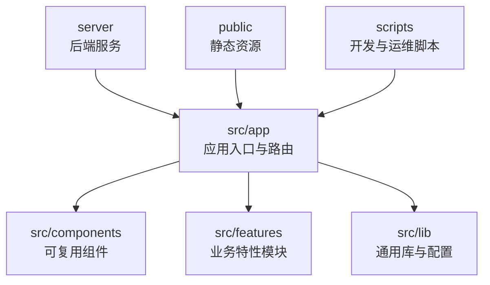
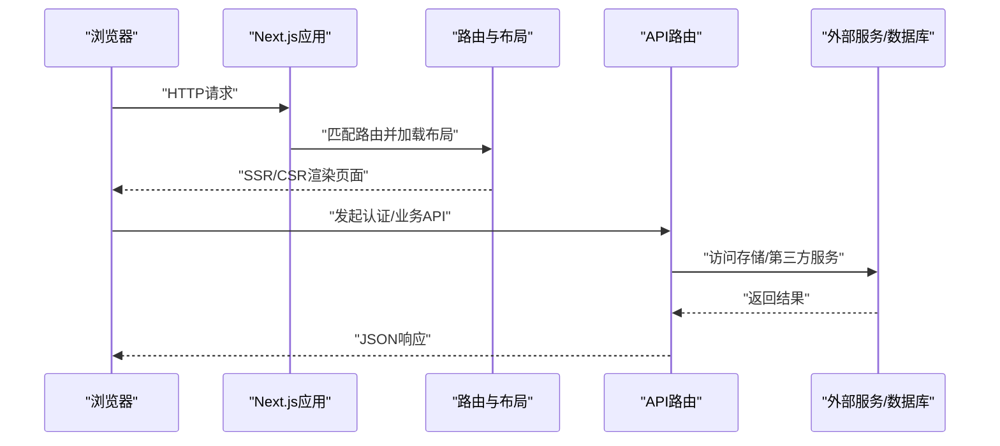
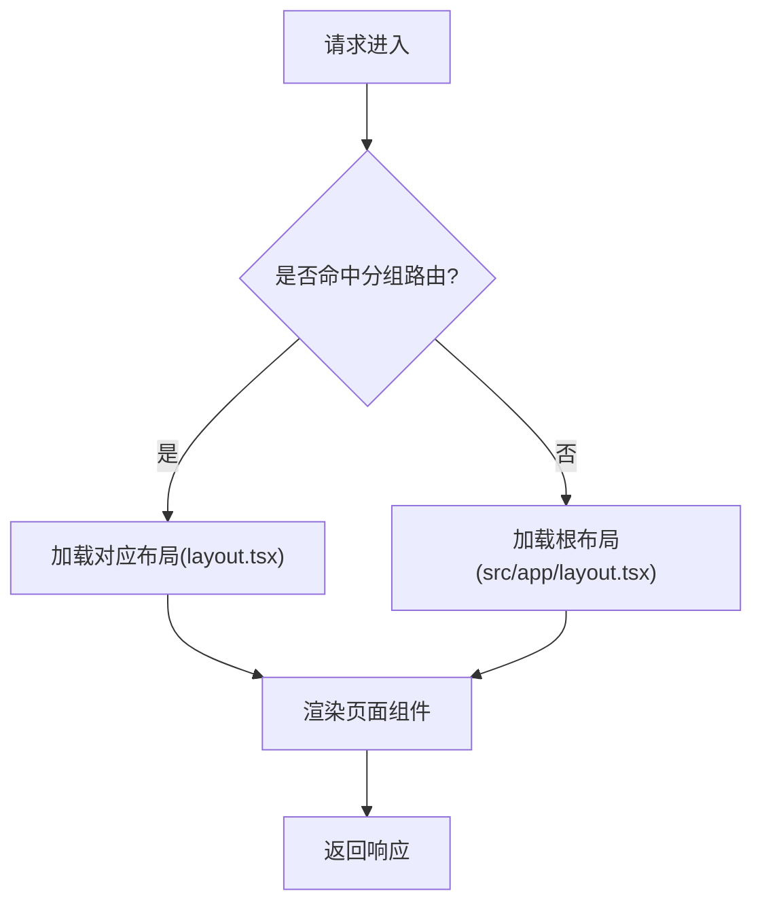
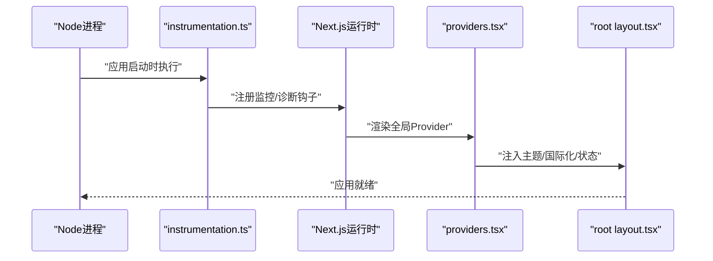
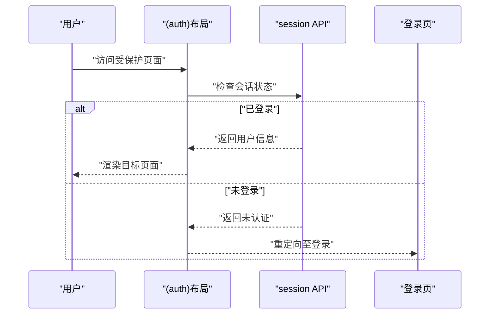
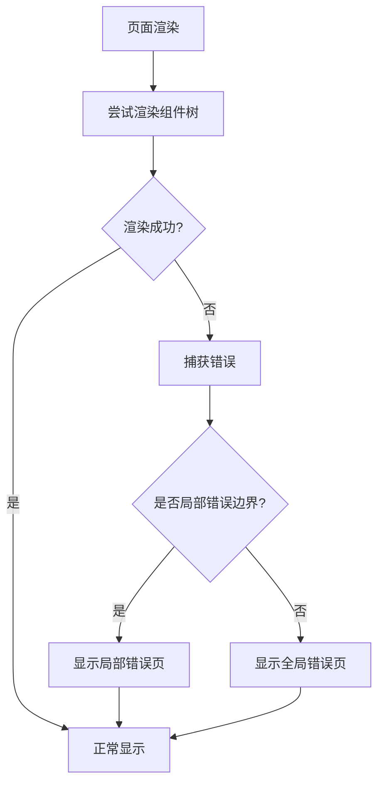
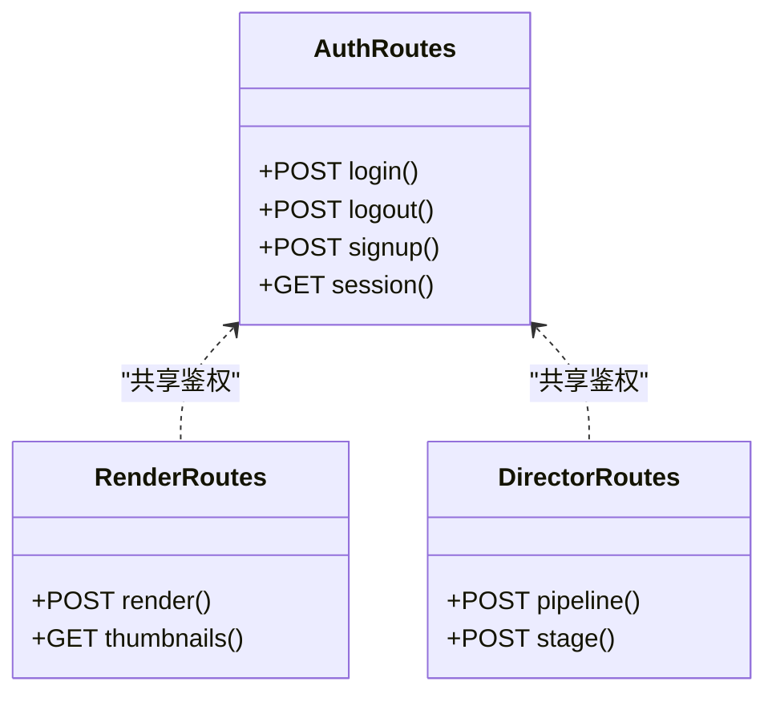
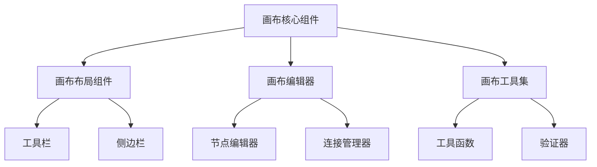
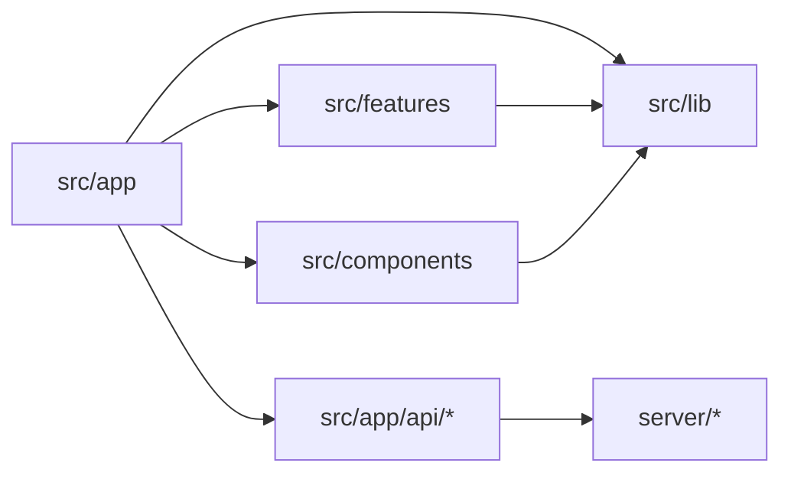

# Next.js应用结构

<cite>
**本文引用的文件**
- [next.config.ts](file://next.config.ts)
- [src/app/layout.tsx](file://src/app/layout.tsx)
- [src/app/providers.tsx](file://src/app/providers.tsx)
- [src/app/global-error.tsx](file://src/app/global-error.tsx)
- [src/app/not-found.tsx](file://src/app/not-found.tsx)
- [src/app/robots.ts](file://src/app/robots.ts)
- [src/app/sitemap.ts](file://src/app/sitemap.ts)
- [src/app/(auth)/layout.tsx](file://src/app/(auth)/layout.tsx)
- [src/app/(marketing)/layout.tsx](file://src/app/(marketing)/layout.tsx)
- [src/app/(public)/layout.tsx](file://src/app/(public)/layout.tsx)
- [src/app/products/(app)/layout.tsx](file://src/app/products/(app)/layout.tsx)
- [src/app/products/(app)/loading.tsx](file://src/app/products/(app)/loading.tsx)
- [src/app/products/(app)/error.tsx](file://src/app/products/(app)/error.tsx)
- [src/app/products/(app)/template.tsx](file://src/app/products/(app)/template.tsx)
- [src/app/api/auth/login/route.ts](file://src/app/api/auth/login/route.ts)
- [src/app/api/auth/logout/route.ts](file://src/app/api/auth/logout/route.ts)
- [src/app/api/auth/session/route.ts](file://src/app/api/auth/session/route.ts)
- [src/app/api/auth/signup/route.ts](file://src/app/api/auth/signup/route.ts)
- [src/app/api/director/pipeline/route.ts](file://src/app/api/director/pipeline/route.ts)
- [src/app/api/render/route.ts](file://src/app/api/render/route.ts)
- [src/instrumentation.ts](file://src/instrumentation.ts)
- [src/lib/site-config.ts](file://src/lib/site-config.ts)
- [src/lib/metadata.ts](file://src/lib/metadata.ts)
- [src/lib/theme-mode.ts](file://src/lib/theme-mode.ts)
- [package.json](file://package.json)
</cite>

## 更新摘要
**变更内容**
- 更新了画布应用组件结构，反映了部分组件文件的删除和重构
- 重新组织了products/(app)/canvas目录下的组件架构
- 优化了画布相关功能的模块划分和依赖关系
- 增强了组件的可维护性和代码复用性

## 目录
1. [简介](#简介)
2. [项目结构](#项目结构)
3. [核心组件](#核心组件)
4. [架构总览](#架构总览)
5. [详细组件分析](#详细组件分析)
6. [依赖关系分析](#依赖关系分析)
7. [性能考量](#性能考量)
8. [故障排查指南](#故障排查指南)
9. [结论](#结论)
10. [附录](#附录)

## 简介
本文件面向使用Next.js App Router构建的复杂前端应用，系统化梳理该仓库的应用组织方式与最佳实践。内容覆盖：
- 基于App Router的路由策略、分组路由与布局组合
- Server Components与Client Components的职责划分与协作模式
- 应用初始化流程、全局配置与环境变量管理
- 国际化、SEO优化、性能监控等高级特性落地方案
- 路由守卫、权限控制、错误边界等横切关注点处理
- 常见问题与排错建议

## 项目结构
本项目采用Next.js App Router标准目录约定，结合功能域与页面分组进行组织：
- src/app：应用根目录，包含路由、布局、API路由、站点元数据与全局样式
- src/components：跨页面可复用UI组件（含营销、产品、基础UI）
- src/features：按业务域划分的特性模块（认证、渲染、音频、AI、导航等）
- src/lib：通用库与工具（站点配置、主题、元数据、钩子等）
- server：服务端独立服务（采集、渲染、TTS等），与前端通过API交互
- scripts：开发、部署、迁移与验证脚本
- public：静态资源与Web Manifest

**图表来源**
- [next.config.ts:1-200](file://next.config.ts#L1-L200)
- [src/app/layout.tsx:1-200](file://src/app/layout.tsx#L1-L200)
- [src/app/providers.tsx:1-200](file://src/app/providers.tsx#L1-L200)

**章节来源**
- [next.config.ts:1-200](file://next.config.ts#L1-L200)
- [package.json:1-200](file://package.json#L1-L200)

## 核心组件
- 应用根布局与提供者：定义全局HTML骨架、主题、国际化、状态容器与错误边界
- 分组路由布局：(auth)、(marketing)、(public)、(products)/(app)等，分别承载不同用户旅程的布局与守卫
- API路由：RESTful接口，封装认证、渲染、导演编排等核心能力
- SEO与站点元数据：robots、sitemap、站点配置与主题模式
- 初始化与监控：instrumentation用于运行时观测与指标上报

**章节来源**
- [src/app/layout.tsx:1-200](file://src/app/layout.tsx#L1-L200)
- [src/app/providers.tsx:1-200](file://src/app/providers.tsx#L1-L200)
- [src/app/(auth)/layout.tsx:1-200](file://src/app/(auth)/layout.tsx#L1-L200)
- [src/app/(marketing)/layout.tsx:1-200](file://src/app/(marketing)/layout.tsx#L1-L200)
- [src/app/(public)/layout.tsx:1-200](file://src/app/(public)/layout.tsx#L1-L200)
- [src/app/products/(app)/layout.tsx:1-200](file://src/app/products/(app)/layout.tsx#L1-L200)
- [src/app/robots.ts:1-200](file://src/app/robots.ts#L1-L200)
- [src/app/sitemap.ts:1-200](file://src/app/sitemap.ts#L1-L200)
- [src/instrumentation.ts:1-200](file://src/instrumentation.ts#L1-L200)

## 架构总览
下图展示从浏览器到服务端的关键路径：客户端请求进入Next.js应用，经过路由匹配与布局嵌套，调用API路由完成鉴权与业务处理，最终返回数据或渲染页面。

**图表来源**
- [src/app/layout.tsx:1-200](file://src/app/layout.tsx#L1-L200)
- [src/app/(auth)/layout.tsx:1-200](file://src/app/(auth)/layout.tsx#L1-L200)
- [src/app/api/auth/login/route.ts:1-200](file://src/app/api/auth/login/route.ts#L1-L200)
- [src/app/api/auth/session/route.ts:1-200](file://src/app/api/auth/session/route.ts#L1-L200)

## 详细组件分析

### 路由与布局策略（App Router）
- 分组路由：使用括号命名组实现共享布局与中间件隔离，如(auth)用于认证相关页面，(marketing)用于营销页，(public)用于公开信息，(products)/(app)用于产品应用主区域
- 嵌套布局：每个分组可定义自己的layout.tsx，组合出不同的导航、侧边栏与权限守卫
- 动态路由：在products/(app)下存在[projectId]等动态段，用于项目级页面
- 模板与加载态：template.tsx提供路由切换时的稳定外壳，loading.tsx提供骨架屏与过渡体验

**图表来源**
- [src/app/(auth)/layout.tsx:1-200](file://src/app/(auth)/layout.tsx#L1-L200)
- [src/app/(marketing)/layout.tsx:1-200](file://src/app/(marketing)/layout.tsx#L1-L200)
- [src/app/(public)/layout.tsx:1-200](file://src/app/(public)/layout.tsx#L1-L200)
- [src/app/products/(app)/layout.tsx:1-200](file://src/app/products/(app)/layout.tsx#L1-L200)
- [src/app/products/(app)/template.tsx:1-200](file://src/app/products/(app)/template.tsx#L1-L200)
- [src/app/products/(app)/loading.tsx:1-200](file://src/app/products/(app)/loading.tsx#L1-L200)

**章节来源**
- [src/app/(auth)/layout.tsx:1-200](file://src/app/(auth)/layout.tsx#L1-L200)
- [src/app/(marketing)/layout.tsx:1-200](file://src/app/(marketing)/layout.tsx#L1-L200)
- [src/app/(public)/layout.tsx:1-200](file://src/app/(public)/layout.tsx#L1-L200)
- [src/app/products/(app)/layout.tsx:1-200](file://src/app/products/(app)/layout.tsx#L1-L200)
- [src/app/products/(app)/template.tsx:1-200](file://src/app/products/(app)/template.tsx#L1-L200)
- [src/app/products/(app)/loading.tsx:1-200](file://src/app/products/(app)/loading.tsx#L1-L200)

### Server Components与Client Components划分原则
- 默认使用Server Components提升首屏性能与SEO，仅在需要交互、状态或浏览器API时使用"use client"
- 页面级组件多为Server Component，通过API路由获取数据；交互型组件（表单、弹窗、画布）放在components或features中并标记为Client Component
- 通过providers.tsx集中注入客户端上下文（主题、国际化、状态），避免重复初始化

**章节来源**
- [src/app/providers.tsx:1-200](file://src/app/providers.tsx#L1-L200)
- [src/lib/theme-mode.ts:1-200](file://src/lib/theme-mode.ts#L1-L200)

### 应用初始化流程与全局配置
- instrumentation.ts：注册运行时监控、日志与指标上报，确保应用启动时完成关键能力初始化
- next.config.ts：配置构建、打包、代理、安全头、图片优化等
- providers.tsx：挂载全局Provider（主题、国际化、状态、错误边界）
- layout.tsx：定义HTML骨架、全局样式、站点元数据注入

**图表来源**
- [src/instrumentation.ts:1-200](file://src/instrumentation.ts#L1-L200)
- [next.config.ts:1-200](file://next.config.ts#L1-L200)
- [src/app/providers.tsx:1-200](file://src/app/providers.tsx#L1-L200)
- [src/app/layout.tsx:1-200](file://src/app/layout.tsx#L1-L200)

**章节来源**
- [src/instrumentation.ts:1-200](file://src/instrumentation.ts#L1-L200)
- [next.config.ts:1-200](file://next.config.ts#L1-L200)
- [src/app/providers.tsx:1-200](file://src/app/providers.tsx#L1-L200)
- [src/app/layout.tsx:1-200](file://src/app/layout.tsx#L1-L200)

### 环境变量管理与配置中心
- 使用.env/.env.local等文件管理敏感配置，区分开发、测试、生产环境
- site-config.ts集中暴露站点级常量与开关，供多模块消费
- theme-mode.ts统一主题模式（明/暗/跟随系统）并提供持久化

**章节来源**
- [src/lib/site-config.ts:1-200](file://src/lib/site-config.ts#L1-L200)
- [src/lib/theme-mode.ts:1-200](file://src/lib/theme-mode.ts#L1-L200)

### 国际化（i18n）
- 在providers.tsx中集成i18n Provider，按路由或语言检测设置当前语言
- 页面与组件通过hooks读取翻译键值，避免硬编码文案
- 路由前缀与回退语言策略在配置层统一管理

**章节来源**
- [src/app/providers.tsx:1-200](file://src/app/providers.tsx#L1-L200)

### SEO优化
- robots.ts与sitemap.ts生成爬虫友好规则与站点地图
- metadata.ts集中管理标题、描述、图标、OpenGraph等元数据
- layout.tsx注入必要的HTML结构与语义标签

**章节来源**
- [src/app/robots.ts:1-200](file://src/app/robots.ts#L1-L200)
- [src/app/sitemap.ts:1-200](file://src/app/sitemap.ts#L1-L200)
- [src/lib/metadata.ts:1-200](file://src/lib/metadata.ts#L1-L200)
- [src/app/layout.tsx:1-200](file://src/app/layout.tsx#L1-L200)

### 性能监控与可观测性
- instrumentation.ts注册性能追踪、错误上报与自定义指标
- 结合next.config.ts开启必要的调试与度量选项
- 建议在关键API路由中添加耗时统计与错误分类

**章节来源**
- [src/instrumentation.ts:1-200](file://src/instrumentation.ts#L1-L200)
- [next.config.ts:1-200](file://next.config.ts#L1-L200)

### 路由守卫与权限控制
- 在分组布局中实现登录态校验与跳转拦截，未授权重定向至登录页
- API路由对敏感操作进行鉴权与限流，失败返回明确错误码
- 页面级loading与error边界提升用户体验与健壮性

**图表来源**
- [src/app/(auth)/layout.tsx:1-200](file://src/app/(auth)/layout.tsx#L1-L200)
- [src/app/api/auth/session/route.ts:1-200](file://src/app/api/auth/session/route.ts#L1-L200)
- [src/app/api/auth/login/route.ts:1-200](file://src/app/api/auth/login/route.ts#L1-L200)

**章节来源**
- [src/app/(auth)/layout.tsx:1-200](file://src/app/(auth)/layout.tsx#L1-L200)
- [src/app/api/auth/session/route.ts:1-200](file://src/app/api/auth/session/route.ts#L1-L200)
- [src/app/api/auth/login/route.ts:1-200](file://src/app/api/auth/login/route.ts#L1-L200)

### 错误边界与异常处理
- global-error.tsx捕获全局致命错误，提供降级页面
- not-found.tsx处理404场景
- (products)/(app)/error.tsx针对应用区域错误进行局部恢复
- template.tsx保证路由切换时的稳定性与状态保留

**图表来源**
- [src/app/global-error.tsx:1-200](file://src/app/global-error.tsx#L1-L200)
- [src/app/not-found.tsx:1-200](file://src/app/not-found.tsx#L1-L200)
- [src/app/products/(app)/error.tsx:1-200](file://src/app/products/(app)/error.tsx#L1-L200)
- [src/app/products/(app)/template.tsx:1-200](file://src/app/products/(app)/template.tsx#L1-L200)

**章节来源**
- [src/app/global-error.tsx:1-200](file://src/app/global-error.tsx#L1-L200)
- [src/app/not-found.tsx:1-200](file://src/app/not-found.tsx#L1-L200)
- [src/app/products/(app)/error.tsx:1-200](file://src/app/products/(app)/error.tsx#L1-L200)
- [src/app/products/(app)/template.tsx:1-200](file://src/app/products/(app)/template.tsx#L1-L200)

### API路由设计（认证、渲染、导演）
- 认证：login、logout、signup、session等端点，统一鉴权与错误处理
- 渲染：render导出与缩略图生成，支持队列与异步任务
- 导演：director/pipeline等编排接口，协调多阶段工作流

**图表来源**
- [src/app/api/auth/login/route.ts:1-200](file://src/app/api/auth/login/route.ts#L1-L200)
- [src/app/api/auth/logout/route.ts:1-200](file://src/app/api/auth/logout/route.ts#L1-L200)
- [src/app/api/auth/session/route.ts:1-200](file://src/app/api/auth/session/route.ts#L1-L200)
- [src/app/api/auth/signup/route.ts:1-200](file://src/app/api/auth/signup/route.ts#L1-L200)
- [src/app/api/render/route.ts:1-200](file://src/app/api/render/route.ts#L1-L200)
- [src/app/api/director/pipeline/route.ts:1-200](file://src/app/api/director/pipeline/route.ts#L1-L200)

**章节来源**
- [src/app/api/auth/login/route.ts:1-200](file://src/app/api/auth/login/route.ts#L1-L200)
- [src/app/api/auth/logout/route.ts:1-200](file://src/app/api/auth/logout/route.ts#L1-L200)
- [src/app/api/auth/session/route.ts:1-200](file://src/app/api/auth/session/route.ts#L1-L200)
- [src/app/api/auth/signup/route.ts:1-200](file://src/app/api/auth/signup/route.ts#L1-L200)
- [src/app/api/render/route.ts:1-200](file://src/app/api/render/route.ts#L1-L200)
- [src/app/api/director/pipeline/route.ts:1-200](file://src/app/api/director/pipeline/route.ts#L1-L200)

### 画布应用组件重构
**更新** 画布应用的组件结构经过重构，优化了组件的组织方式和依赖关系

- 模块化重组：将画布相关的组件按照功能域重新组织，提高了代码的可维护性
- 依赖优化：减少了不必要的依赖关系，提升了组件的独立性
- 接口标准化：统一了组件间的通信接口，便于扩展和维护

**图表来源**
- [src/app/products/(app)/canvas/[projectId]/page.tsx:1-200](file://src/app/products/(app)/canvas/[projectId]/page.tsx#L1-L200)
- [src/app/products/(app)/canvas/[projectId]/layout.tsx:1-200](file://src/app/products/(app)/canvas/[projectId]/layout.tsx#L1-L200)
- [src/features/canvas/index.ts:1-200](file://src/features/canvas/index.ts#L1-L200)

**章节来源**
- [src/app/products/(app)/canvas/[projectId]/page.tsx:1-200](file://src/app/products/(app)/canvas/[projectId]/page.tsx#L1-L200)
- [src/app/products/(app)/canvas/[projectId]/layout.tsx:1-200](file://src/app/products/(app)/canvas/[projectId]/layout.tsx#L1-L200)
- [src/features/canvas/index.ts:1-200](file://src/features/canvas/index.ts#L1-L200)

## 依赖关系分析
- 应用层依赖：app布局与页面依赖providers、site-config、metadata等库
- 特性层依赖：features模块被components与pages引用，形成清晰的领域边界
- 服务端依赖：server模块通过API与前端解耦，便于独立部署与扩展

**图表来源**
- [src/app/layout.tsx:1-200](file://src/app/layout.tsx#L1-L200)
- [src/app/providers.tsx:1-200](file://src/app/providers.tsx#L1-L200)
- [src/lib/site-config.ts:1-200](file://src/lib/site-config.ts#L1-L200)
- [src/lib/metadata.ts:1-200](file://src/lib/metadata.ts#L1-L200)

**章节来源**
- [src/app/layout.tsx:1-200](file://src/app/layout.tsx#L1-L200)
- [src/app/providers.tsx:1-200](file://src/app/providers.tsx#L1-L200)
- [src/lib/site-config.ts:1-200](file://src/lib/site-config.ts#L1-L200)
- [src/lib/metadata.ts:1-200](file://src/lib/metadata.ts#L1-L200)

## 性能考量
- 优先使用Server Components减少客户端体积，按需引入Client Components
- 利用next.config.ts的图片优化、代码分割与缓存策略
- 在instrumentation中埋点关键路径，监控FCP/LCP/CLS等指标
- 合理使用loading与skeleton提升感知性能
- 画布组件重构后进一步优化了包体积和加载性能

## 故障排查指南
- 全局错误：检查global-error.tsx与浏览器控制台，定位崩溃堆栈
- 404问题：确认路由文件命名与分组是否正确，检查not-found.tsx逻辑
- 鉴权失败：查看session API与布局中的守卫逻辑，核对Cookie/Token
- 渲染异常：检查API路由返回格式与错误边界处理
- 监控告警：结合instrumentation上报的错误与慢请求进行分析
- 画布相关问题：检查重构后的组件依赖关系和接口兼容性

**章节来源**
- [src/app/global-error.tsx:1-200](file://src/app/global-error.tsx#L1-L200)
- [src/app/not-found.tsx:1-200](file://src/app/not-found.tsx#L1-L200)
- [src/app/api/auth/session/route.ts:1-200](file://src/app/api/auth/session/route.ts#L1-L200)
- [src/instrumentation.ts:1-200](file://src/instrumentation.ts#L1-L200)

## 结论
本仓库以Next.js App Router为核心，通过分组路由、布局组合与特性模块化，构建了可扩展、可维护的前端架构。借助Server/Client组件合理分工、完善的错误边界与监控体系，以及SEO与性能优化策略，整体具备高可用与高性能特征。画布应用的组件重构进一步提升了代码质量和可维护性。建议持续完善鉴权与权限模型、强化API契约测试与端到端验证，进一步提升交付质量与稳定性。

## 附录
- 常用命令与脚本：参考scripts目录下的开发与验证脚本
- 部署与反向代理：参考deploy目录与Docker配置
- 文档与设计：参考docs目录下的设计与规范