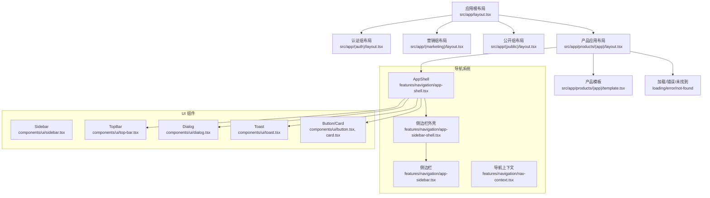
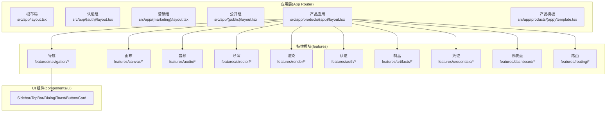
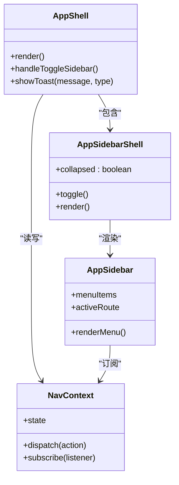
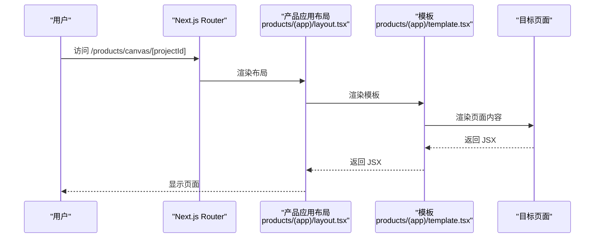
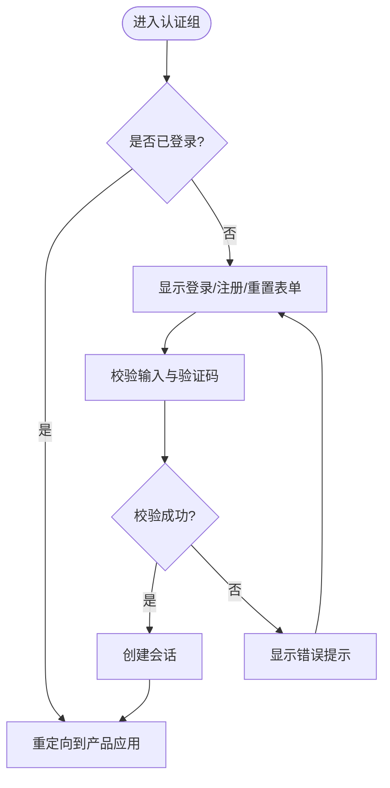
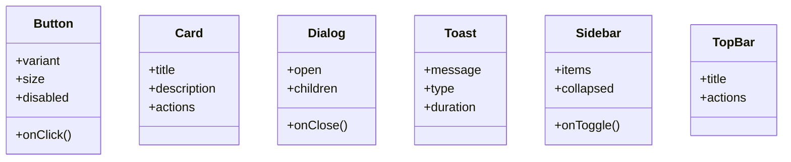
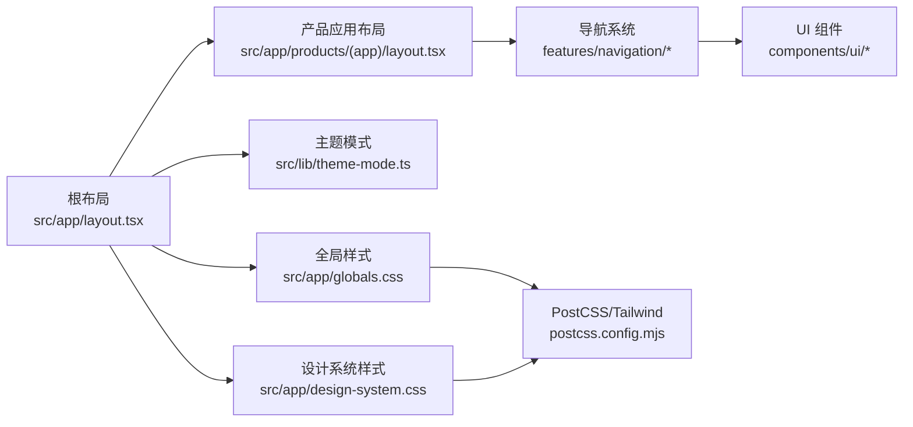

# 前端架构

<cite>
**本文引用的文件**   
- [src/app/layout.tsx](file://src/app/layout.tsx)
- [src/app/providers.tsx](file://src/app/providers.tsx)
- [src/app/globals.css](file://src/app/globals.css)
- [src/app/design-system.css](file://src/app/design-system.css)
- [src/app/(auth)/layout.tsx](file://src/app/(auth)/layout.tsx)
- [src/app/(marketing)/layout.tsx](file://src/app/(marketing)/layout.tsx)
- [src/app/(public)/layout.tsx](file://src/app/(public)/layout.tsx)
- [src/app/products/(app)/layout.tsx](file://src/app/products/(app)/layout.tsx)
- [src/app/products/(app)/template.tsx](file://src/app/products/(app)/template.tsx)
- [src/app/products/(app)/loading.tsx](file://src/app/products/(app)/loading.tsx)
- [src/app/products/(app)/error.tsx](file://src/app/products/(app)/error.tsx)
- [src/app/products/(app)/not-found.tsx](file://src/app/products/(app)/not-found.tsx)
- [src/app/playbook/registry.ts](file://src/app/playbook/registry.ts)
- [src/features/navigation/app-shell.tsx](file://src/features/navigation/app-shell.tsx)
- [src/features/navigation/app-sidebar-shell.tsx](file://src/features/navigation/app-sidebar-shell.tsx)
- [src/features/navigation/app-sidebar.tsx](file://src/features/navigation/app-sidebar.tsx)
- [src/features/navigation/nav-context.tsx](file://src/features/navigation/nav-context.tsx)
- [src/features/navigation/products-routes.ts](file://src/features/navigation/products-routes.ts)
- [src/components/ui/sidebar.tsx](file://src/components/ui/sidebar.tsx)
- [src/components/ui/top-bar.tsx](file://src/components/ui/top-bar.tsx)
- [src/components/ui/dialog.tsx](file://src/components/ui/dialog.tsx)
- [src/components/ui/toast.tsx](file://src/components/ui/toast.tsx)
- [src/components/ui/button.tsx](file://src/components/ui/button.tsx)
- [src/components/ui/card.tsx](file://src/components/ui/card.tsx)
- [src/lib/theme-mode.ts](file://src/lib/theme-mode.ts)
- [next.config.ts](file://next.config.ts)
- [postcss.config.mjs](file://postcss.config.mjs)
</cite>

## 目录
1. [简介](#简介)
2. [项目结构](#项目结构)
3. [核心组件](#核心组件)
4. [架构总览](#架构总览)
5. [详细组件分析](#详细组件分析)
6. [依赖关系分析](#依赖关系分析)
7. [性能考量](#性能考量)
8. [故障排查指南](#故障排查指南)
9. [结论](#结论)
10. [附录](#附录)

## 简介
本文件系统性梳理 PurpleInk 前端架构，围绕 Next.js App Router 的应用结构设计、页面组织与路由策略、布局组件设计、组件分层体系、状态管理策略、样式系统（Tailwind CSS）、导航与权限控制、错误处理等横切关注点，以及组件开发规范与最佳实践进行说明。目标是帮助读者快速理解并高效扩展该前端工程。

## 项目结构
PurpleInk 采用 Next.js App Router 的目录式路由组织方式，按功能域划分模块：
- app 层：应用入口、全局布局、分组路由（如 (auth)、(marketing)、(public)、products 等）
- features 层：按业务领域划分的特性模块（如 navigation、canvas、audio、director、render、auth、artifacts、credentials、dashboard、routing 等）
- components 层：UI 基础组件与图标资源
- lib 层：通用工具库（主题模式、配置、存储、队列、流媒体、TTS、工作流等）
- server 层：服务端逻辑（采集、编排、渲染、TTS、作业调度等）
- scripts 与 deploy：构建、迁移、部署脚本

**图示来源** 
- [src/app/layout.tsx](file://src/app/layout.tsx)
- [src/app/(auth)/layout.tsx](file://src/app/(auth)/layout.tsx)
- [src/app/(marketing)/layout.tsx](file://src/app/(marketing)/layout.tsx)
- [src/app/(public)/layout.tsx](file://src/app/(public)/layout.tsx)
- [src/app/products/(app)/layout.tsx](file://src/app/products/(app)/layout.tsx)
- [src/app/products/(app)/template.tsx](file://src/app/products/(app)/template.tsx)
- [src/features/navigation/app-shell.tsx](file://src/features/navigation/app-shell.tsx)
- [src/features/navigation/app-sidebar-shell.tsx](file://src/features/navigation/app-sidebar-shell.tsx)
- [src/features/navigation/app-sidebar.tsx](file://src/features/navigation/app-sidebar.tsx)
- [src/components/ui/sidebar.tsx](file://src/components/ui/sidebar.tsx)
- [src/components/ui/top-bar.tsx](file://src/components/ui/top-bar.tsx)
- [src/components/ui/dialog.tsx](file://src/components/ui/dialog.tsx)
- [src/components/ui/toast.tsx](file://src/components/ui/toast.tsx)
- [src/components/ui/button.tsx](file://src/components/ui/button.tsx)
- [src/components/ui/card.tsx](file://src/components/ui/card.tsx)

**章节来源**
- [src/app/layout.tsx](file://src/app/layout.tsx)
- [src/app/(auth)/layout.tsx](file://src/app/(auth)/layout.tsx)
- [src/app/(marketing)/layout.tsx](file://src/app/(marketing)/layout.tsx)
- [src/app/(public)/layout.tsx](file://src/app/(public)/layout.tsx)
- [src/app/products/(app)/layout.tsx](file://src/app/products/(app)/layout.tsx)
- [src/app/products/(app)/template.tsx](file://src/app/products/(app)/template.tsx)

## 核心组件
- 应用壳层（App Shell）：负责整体布局、导航容器、全局交互（顶部栏、侧边栏、弹窗、消息提示）。位于 features/navigation 中，由 products 应用布局引入。
- 侧边栏与导航上下文：提供可折叠面板、当前路由高亮、菜单项生成与权限过滤。通过 nav-context 暴露统一的状态与操作接口。
- UI 基础组件：按钮、卡片、对话框、Toast、侧边栏、顶部栏等，位于 components/ui，遵循原子化设计原则，便于复用与组合。
- Playbook 注册表：用于文档与示例页面的组件注册与展示，位于 src/app/playbook/registry.ts。

**章节来源**
- [src/features/navigation/app-shell.tsx](file://src/features/navigation/app-shell.tsx)
- [src/features/navigation/app-sidebar-shell.tsx](file://src/features/navigation/app-sidebar-shell.tsx)
- [src/features/navigation/app-sidebar.tsx](file://src/features/navigation/app-sidebar.tsx)
- [src/features/navigation/nav-context.tsx](file://src/features/navigation/nav-context.tsx)
- [src/components/ui/sidebar.tsx](file://src/components/ui/sidebar.tsx)
- [src/components/ui/top-bar.tsx](file://src/components/ui/top-bar.tsx)
- [src/components/ui/dialog.tsx](file://src/components/ui/dialog.tsx)
- [src/components/ui/toast.tsx](file://src/components/ui/toast.tsx)
- [src/components/ui/button.tsx](file://src/components/ui/button.tsx)
- [src/components/ui/card.tsx](file://src/components/ui/card.tsx)
- [src/app/playbook/registry.ts](file://src/app/playbook/registry.ts)

## 架构总览
PurpleInk 的前端采用“应用布局 + 特性模块 + 基础 UI”的分层架构：
- 应用布局层：Next.js App Router 的 layout.tsx 与分组路由布局，负责全局 Provider、主题、国际化、错误边界等。
- 特性模块层：按业务域拆分（navigation、canvas、audio、director、render、auth、artifacts、credentials、dashboard、routing），每个模块内包含类型定义、服务、组件、测试与工具函数。
- 基础 UI 层：原子化 UI 组件，基于 Tailwind CSS，提供一致的视觉与交互体验。
- 数据与状态：客户端状态使用 React Hooks/Context；服务器状态通过 API 路由与服务端渲染获取；实时状态通过流式接口或事件机制同步。

**图示来源** 
- [src/app/layout.tsx](file://src/app/layout.tsx)
- [src/app/(auth)/layout.tsx](file://src/app/(auth)/layout.tsx)
- [src/app/(marketing)/layout.tsx](file://src/app/(marketing)/layout.tsx)
- [src/app/(public)/layout.tsx](file://src/app/(public)/layout.tsx)
- [src/app/products/(app)/layout.tsx](file://src/app/products/(app)/layout.tsx)
- [src/app/products/(app)/template.tsx](file://src/app/products/(app)/template.tsx)
- [src/features/navigation/app-shell.tsx](file://src/features/navigation/app-shell.tsx)
- [src/components/ui/sidebar.tsx](file://src/components/ui/sidebar.tsx)

## 详细组件分析

### 导航系统与 App Shell
- App Shell 作为产品应用的容器，集成顶部栏、侧边栏、弹窗与 Toast，统一管理用户交互与全局状态。
- 侧边栏外壳与侧边栏组件提供菜单渲染、折叠状态、路由高亮与权限过滤。
- 导航上下文集中维护当前路由、展开状态、权限信息，供各子组件订阅与更新。

**图示来源** 
- [src/features/navigation/app-shell.tsx](file://src/features/navigation/app-shell.tsx)
- [src/features/navigation/app-sidebar-shell.tsx](file://src/features/navigation/app-sidebar-shell.tsx)
- [src/features/navigation/app-sidebar.tsx](file://src/features/navigation/app-sidebar.tsx)
- [src/features/navigation/nav-context.tsx](file://src/features/navigation/nav-context.tsx)

**章节来源**
- [src/features/navigation/app-shell.tsx](file://src/features/navigation/app-shell.tsx)
- [src/features/navigation/app-sidebar-shell.tsx](file://src/features/navigation/app-sidebar-shell.tsx)
- [src/features/navigation/app-sidebar.tsx](file://src/features/navigation/app-sidebar.tsx)
- [src/features/navigation/nav-context.tsx](file://src/features/navigation/nav-context.tsx)

### 产品应用布局与模板
- 产品应用布局负责挂载 App Shell、Provider、错误边界与加载状态。
- 模板组件为路由共享的包裹结构，确保页面切换时的过渡与一致性。
- loading、error、not-found 页面分别处理异步加载、异常捕获与未找到场景。

**图示来源** 
- [src/app/products/(app)/layout.tsx](file://src/app/products/(app)/layout.tsx)
- [src/app/products/(app)/template.tsx](file://src/app/products/(app)/template.tsx)

**章节来源**
- [src/app/products/(app)/layout.tsx](file://src/app/products/(app)/layout.tsx)
- [src/app/products/(app)/template.tsx](file://src/app/products/(app)/template.tsx)
- [src/app/products/(app)/loading.tsx](file://src/app/products/(app)/loading.tsx)
- [src/app/products/(app)/error.tsx](file://src/app/products/(app)/error.tsx)
- [src/app/products/(app)/not-found.tsx](file://src/app/products/(app)/not-found.tsx)

### 认证与营销布局
- 认证组布局统一处理登录、注册、密码重置等页面，提供表单外壳与验证流程。
- 营销组布局面向市场页，强调品牌展示与转化引导。
- 公开组布局用于无需鉴权的公开页面。

**图示来源** 
- [src/app/(auth)/layout.tsx](file://src/app/(auth)/layout.tsx)

**章节来源**
- [src/app/(auth)/layout.tsx](file://src/app/(auth)/layout.tsx)
- [src/app/(marketing)/layout.tsx](file://src/app/(marketing)/layout.tsx)
- [src/app/(public)/layout.tsx](file://src/app/(public)/layout.tsx)

### 基础 UI 组件
- Button、Card、Dialog、Toast、Sidebar、TopBar 等组件遵循统一的 API 与设计令牌，支持主题切换与响应式适配。
- 组件内部使用 Tailwind CSS 类名与语义化属性，保证一致性与可维护性。

**图示来源** 
- [src/components/ui/button.tsx](file://src/components/ui/button.tsx)
- [src/components/ui/card.tsx](file://src/components/ui/card.tsx)
- [src/components/ui/dialog.tsx](file://src/components/ui/dialog.tsx)
- [src/components/ui/toast.tsx](file://src/components/ui/toast.tsx)
- [src/components/ui/sidebar.tsx](file://src/components/ui/sidebar.tsx)
- [src/components/ui/top-bar.tsx](file://src/components/ui/top-bar.tsx)

**章节来源**
- [src/components/ui/button.tsx](file://src/components/ui/button.tsx)
- [src/components/ui/card.tsx](file://src/components/ui/card.tsx)
- [src/components/ui/dialog.tsx](file://src/components/ui/dialog.tsx)
- [src/components/ui/toast.tsx](file://src/components/ui/toast.tsx)
- [src/components/ui/sidebar.tsx](file://src/components/ui/sidebar.tsx)
- [src/components/ui/top-bar.tsx](file://src/components/ui/top-bar.tsx)

## 依赖关系分析
- 应用布局依赖特性模块中的导航系统，导航系统依赖 UI 组件。
- 产品应用布局依赖模板与加载/错误/未找到页面，形成稳定的渲染管线。
- 主题模式与样式系统通过全局 CSS 与 PostCSS/Tailwind 配置注入。

**图示来源** 
- [src/app/layout.tsx](file://src/app/layout.tsx)
- [src/app/products/(app)/layout.tsx](file://src/app/products/(app)/layout.tsx)
- [src/features/navigation/app-shell.tsx](file://src/features/navigation/app-shell.tsx)
- [src/components/ui/sidebar.tsx](file://src/components/ui/sidebar.tsx)
- [src/lib/theme-mode.ts](file://src/lib/theme-mode.ts)
- [src/app/globals.css](file://src/app/globals.css)
- [src/app/design-system.css](file://src/app/design-system.css)
- [postcss.config.mjs](file://postcss.config.mjs)

**章节来源**
- [src/app/layout.tsx](file://src/app/layout.tsx)
- [src/app/products/(app)/layout.tsx](file://src/app/products/(app)/layout.tsx)
- [src/features/navigation/app-shell.tsx](file://src/features/navigation/app-shell.tsx)
- [src/components/ui/sidebar.tsx](file://src/components/ui/sidebar.tsx)
- [src/lib/theme-mode.ts](file://src/lib/theme-mode.ts)
- [src/app/globals.css](file://src/app/globals.css)
- [src/app/design-system.css](file://src/app/design-system.css)
- [postcss.config.mjs](file://postcss.config.mjs)

## 性能考量
- 路由级代码分割：利用 Next.js App Router 的路由级懒加载，减少首屏体积。
- 组件级优化：避免不必要的重渲染，合理使用 memo/useMemo/useCallback。
- 数据获取：优先使用服务端渲染与缓存，减少客户端请求压力。
- 样式优化：按需引入 Tailwind 类，避免冗余样式；使用设计令牌提升一致性。
- 动画与交互：谨慎使用复杂动画，必要时降级到轻量方案。

[本节为通用指导，不直接分析具体文件]

## 故障排查指南
- 加载失败：检查 loading 页面与网络请求状态，确认 API 路由可用性。
- 错误边界：查看 error 页面与全局错误处理，定位异常来源。
- 未找到页面：核对路由路径与参数，确保 not-found 页面正确渲染。
- 主题问题：检查 theme-mode 与全局样式注入顺序。
- 导航异常：确认 nav-context 状态与权限过滤逻辑。

**章节来源**
- [src/app/products/(app)/loading.tsx](file://src/app/products/(app)/loading.tsx)
- [src/app/products/(app)/error.tsx](file://src/app/products/(app)/error.tsx)
- [src/app/products/(app)/not-found.tsx](file://src/app/products/(app)/not-found.tsx)
- [src/lib/theme-mode.ts](file://src/lib/theme-mode.ts)
- [src/features/navigation/nav-context.tsx](file://src/features/navigation/nav-context.tsx)

## 结论
PurpleInK 前端以 Next.js App Router 为核心，结合清晰的目录结构与特性模块化，实现了可扩展、可维护且高性能的应用架构。通过统一的导航系统、原子化 UI 组件与主题系统，保证了用户体验的一致性与开发效率。建议持续完善错误处理、性能监控与自动化测试，进一步提升稳定性与可观测性。

[本节为总结，不直接分析具体文件]

## 附录
- 样式系统：Tailwind CSS 通过 PostCSS 配置启用，全局样式与设计系统样式在根布局注入。
- 主题模式：通过 theme-mode 管理明暗主题切换，配合 CSS 变量实现动态主题。
- 路由策略：按功能域划分路由组，使用模板与布局组件统一页面结构。
- 组件规范：命名清晰、职责单一、API 稳定，优先使用 TypeScript 与单元测试。

**章节来源**
- [postcss.config.mjs](file://postcss.config.mjs)
- [src/app/globals.css](file://src/app/globals.css)
- [src/app/design-system.css](file://src/app/design-system.css)
- [src/lib/theme-mode.ts](file://src/lib/theme-mode.ts)
- [next.config.ts](file://next.config.ts)