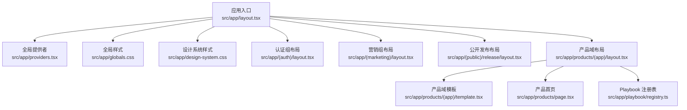
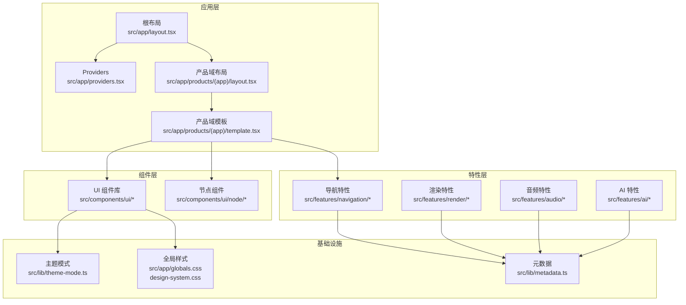
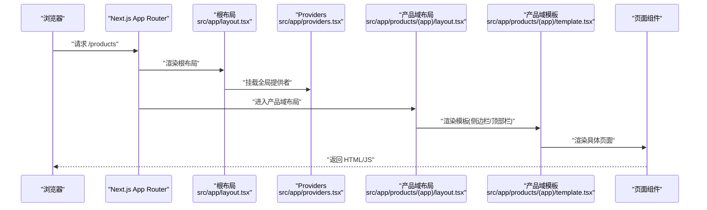
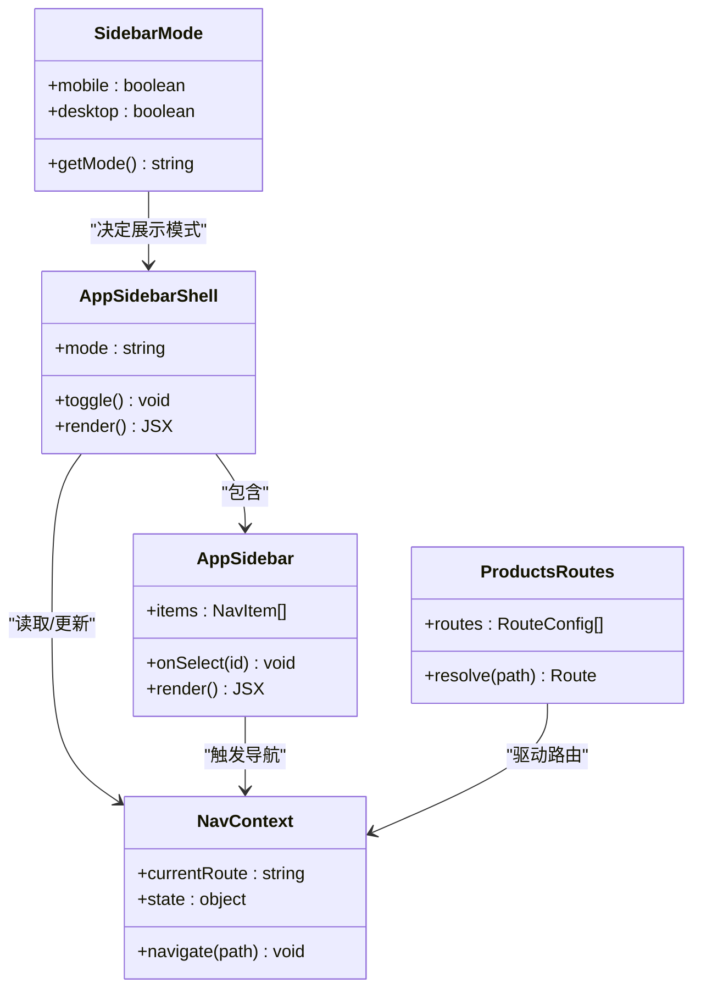
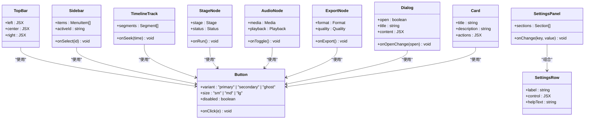
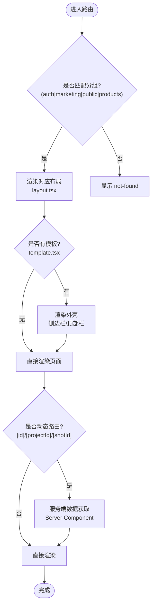
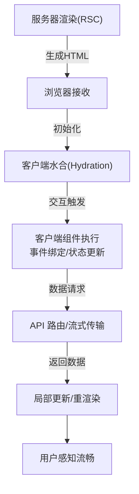
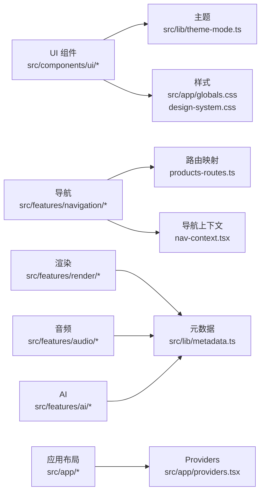

# 前端架构

<cite>
**本文引用的文件**   
- [src/app/layout.tsx](file://src/app/layout.tsx)
- [src/app/providers.tsx](file://src/app/providers.tsx)
- [src/app/globals.css](file://src/app/globals.css)
- [src/app/design-system.css](file://src/app/design-system.css)
- [src/app/(auth)/layout.tsx](file://src/app/(auth)/layout.tsx)
- [src/app/(marketing)/layout.tsx](file://src/app/(marketing)/layout.tsx)
- [src/app/(public)/release/layout.tsx](file://src/app/(public)/release/layout.tsx)
- [src/app/products/(app)/layout.tsx](file://src/app/products/(app)/layout.tsx)
- [src/app/products/(app)/template.tsx](file://src/app/products/(app)/template.tsx)
- [src/app/products/(app)/loading.tsx](file://src/app/products/(app)/loading.tsx)
- [src/app/products/(app)/error.tsx](file://src/app/products/(app)/error.tsx)
- [src/app/products/(app)/not-found.tsx](file://src/app/products/(app)/not-found.tsx)
- [src/app/products/page.tsx](file://src/app/products/page.tsx)
- [src/app/playbook/registry.ts](file://src/app/playbook/registry.ts)
- [src/app/_components/route-shell-page.tsx](file://src/app/_components/route-shell-page.tsx)
- [src/app/_components/route-status.tsx](file://src/app/_components/route-status.tsx)
- [src/components/ui/button.tsx](file://src/components/ui/button.tsx)
- [src/components/ui/dialog.tsx](file://src/components/ui/dialog.tsx)
- [src/components/ui/sidebar.tsx](file://src/components/ui/sidebar.tsx)
- [src/components/ui/top-bar.tsx](file://src/components/ui/top-bar.tsx)
- [src/components/ui/card.tsx](file://src/components/ui/card.tsx)
- [src/components/ui/skeleton.tsx](file://src/components/ui/skeleton.tsx)
- [src/components/ui/toast.tsx](file://src/components/ui/toast.tsx)
- [src/components/ui/settings-panel.tsx](file://src/components/ui/settings-panel.tsx)
- [src/components/ui/settings-row.tsx](file://src/components/ui/settings-row.tsx)
- [src/components/ui/search-field.tsx](file://src/components/ui/search-field.tsx)
- [src/components/ui/nav-item.tsx](file://src/components/ui/nav-item.tsx)
- [src/components/ui/timeline-track.tsx](file://src/components/ui/timeline-track.tsx)
- [src/components/ui/node/stage-node.tsx](file://src/components/ui/node/stage-node.tsx)
- [src/components/ui/node/audio-node.tsx](file://src/components/ui/node/audio-node.tsx)
- [src/components/ui/node/export-node.tsx](file://src/components/ui/node/export-node.tsx)
- [src/features/navigation/app-sidebar-shell.tsx](file://src/features/navigation/app-sidebar-shell.tsx)
- [src/features/navigation/app-sidebar.tsx](file://src/features/navigation/app-sidebar.tsx)
- [src/features/navigation/nav-context.tsx](file://src/features/navigation/nav-context.tsx)
- [src/features/navigation/products-routes.ts](file://src/features/navigation/products-routes.ts)
- [src/features/navigation/sidebar-mode.ts](file://src/features/navigation/sidebar-mode.ts)
- [src/lib/theme-mode.ts](file://src/lib/theme-mode.ts)
- [src/lib/metadata.ts](file://src/lib/metadata.ts)
- [next.config.ts](file://next.config.ts)
- [postcss.config.mjs](file://postcss.config.mjs)
</cite>

## 目录
1. [简介](#简介)
2. [项目结构](#项目结构)
3. [核心组件](#核心组件)
4. [架构总览](#架构总览)
5. [详细组件分析](#详细组件分析)
6. [依赖关系分析](#依赖关系分析)
7. [性能考量](#性能考量)
8. [故障排查指南](#故障排查指南)
9. [结论](#结论)
10. [附录](#附录)

## 简介
本文件面向 PurpleInk 前端工程，系统性阐述基于 Next.js App Router 的应用结构、React 组件设计模式与状态管理方案。文档覆盖 UI 组件系统架构、可复用组件组织方式、样式管理策略、路由系统与页面组织原则、服务端渲染(SSR)与客户端渲染(CSR)的混合使用策略、响应式设计与无障碍访问支持、以及性能优化技巧与开发规范。目标是帮助开发者快速理解并高效扩展该前端架构。

## 项目结构
PurpleInk 采用 Next.js App Router 的分层与分组路由组织：
- src/app：应用根路由与布局、全局样式、API 路由、产品域页面与共享组件
- src/components：UI 基础组件与业务相关组件（如节点、时间线等）
- src/features：按功能域划分的特性模块（导航、AI、音频、渲染、导演、路由等）
- src/lib：通用库（主题、元数据、工具函数等）
- public：静态资源
- server：后端服务与脚本（与本前端文档关联度较低）

图表来源 
- [src/app/layout.tsx](file://src/app/layout.tsx)
- [src/app/providers.tsx](file://src/app/providers.tsx)
- [src/app/globals.css](file://src/app/globals.css)
- [src/app/design-system.css](file://src/app/design-system.css)
- [src/app/(auth)/layout.tsx](file://src/app/(auth)/layout.tsx)
- [src/app/(marketing)/layout.tsx](file://src/app/(marketing)/layout.tsx)
- [src/app/(public)/release/layout.tsx](file://src/app/(public)/release/layout.tsx)
- [src/app/products/(app)/layout.tsx](file://src/app/products/(app)/layout.tsx)
- [src/app/products/(app)/template.tsx](file://src/app/products/(app)/template.tsx)
- [src/app/products/page.tsx](file://src/app/products/page.tsx)
- [src/app/playbook/registry.ts](file://src/app/playbook/registry.ts)

章节来源
- [src/app/layout.tsx](file://src/app/layout.tsx)
- [src/app/providers.tsx](file://src/app/providers.tsx)
- [src/app/globals.css](file://src/app/globals.css)
- [src/app/design-system.css](file://src/app/design-system.css)
- [src/app/(auth)/layout.tsx](file://src/app/(auth)/layout.tsx)
- [src/app/(marketing)/layout.tsx](file://src/app/(marketing)/layout.tsx)
- [src/app/(public)/release/layout.tsx](file://src/app/(public)/release/layout.tsx)
- [src/app/products/(app)/layout.tsx](file://src/app/products/(app)/layout.tsx)
- [src/app/products/(app)/template.tsx](file://src/app/products/(app)/template.tsx)
- [src/app/products/page.tsx](file://src/app/products/page.tsx)
- [src/app/playbook/registry.ts](file://src/app/playbook/registry.ts)

## 核心组件
- 应用壳与提供者
  - 根布局负责注入全局样式、字体、主题与国际化上下文；providers 集中挂载 UI 框架、状态容器与第三方 SDK。
- 产品域布局与模板
  - products/(app) 提供统一侧边栏、顶部栏、错误与加载边界，配合 template.tsx 实现跨页面共享 UI 外壳。
- 导航系统
  - features/navigation 提供侧边栏、导航上下文、路由映射与模式切换，支撑多端适配与权限控制。
- UI 组件库
  - components/ui 提供按钮、对话框、卡片、骨架屏、Toast、设置面板等原子与复合组件，遵循一致的 API 与设计令牌。

章节来源
- [src/app/layout.tsx](file://src/app/layout.tsx)
- [src/app/providers.tsx](file://src/app/providers.tsx)
- [src/app/products/(app)/layout.tsx](file://src/app/products/(app)/layout.tsx)
- [src/app/products/(app)/template.tsx](file://src/app/products/(app)/template.tsx)
- [src/features/navigation/app-sidebar-shell.tsx](file://src/features/navigation/app-sidebar-shell.tsx)
- [src/features/navigation/app-sidebar.tsx](file://src/features/navigation/app-sidebar.tsx)
- [src/features/navigation/nav-context.tsx](file://src/features/navigation/nav-context.tsx)
- [src/components/ui/button.tsx](file://src/components/ui/button.tsx)
- [src/components/ui/dialog.tsx](file://src/components/ui/dialog.tsx)
- [src/components/ui/card.tsx](file://src/components/ui/card.tsx)
- [src/components/ui/skeleton.tsx](file://src/components/ui/skeleton.tsx)
- [src/components/ui/toast.tsx](file://src/components/ui/toast.tsx)
- [src/components/ui/settings-panel.tsx](file://src/components/ui/settings-panel.tsx)

## 架构总览
PurpleInk 的前端以 App Router 为路由与渲染中枢，结合 React Server Components(RSC) 与 Client Components 的混合策略，实现首屏快速与交互流畅。整体分层如下：
- 表现层：页面与布局（App Router）
- 组件层：UI 基础组件与业务组件
- 特性层：按领域划分的功能模块（导航、渲染、音频、AI 等）
- 基础设施：主题、元数据、工具库、样式系统

图表来源 
- [src/app/layout.tsx](file://src/app/layout.tsx)
- [src/app/providers.tsx](file://src/app/providers.tsx)
- [src/app/products/(app)/layout.tsx](file://src/app/products/(app)/layout.tsx)
- [src/app/products/(app)/template.tsx](file://src/app/products/(app)/template.tsx)
- [src/components/ui/button.tsx](file://src/components/ui/button.tsx)
- [src/components/ui/node/stage-node.tsx](file://src/components/ui/node/stage-node.tsx)
- [src/features/navigation/app-sidebar-shell.tsx](file://src/features/navigation/app-sidebar-shell.tsx)
- [src/lib/theme-mode.ts](file://src/lib/theme-mode.ts)
- [src/lib/metadata.ts](file://src/lib/metadata.ts)
- [src/app/globals.css](file://src/app/globals.css)
- [src/app/design-system.css](file://src/app/design-system.css)

## 详细组件分析

### 应用布局与提供者
- 根布局负责注入全局样式、字体、主题与 Providers，确保所有页面共享一致的基础能力。
- providers 集中挂载 UI 框架、状态容器与第三方 SDK，避免在页面中重复配置。
- 产品域 layout/template 组合实现“外壳 + 内容”的解耦，便于在不同页面复用侧边栏、顶部栏与错误处理。

图表来源 
- [src/app/layout.tsx](file://src/app/layout.tsx)
- [src/app/providers.tsx](file://src/app/providers.tsx)
- [src/app/products/(app)/layout.tsx](file://src/app/products/(app)/layout.tsx)
- [src/app/products/(app)/template.tsx](file://src/app/products/(app)/template.tsx)

章节来源
- [src/app/layout.tsx](file://src/app/layout.tsx)
- [src/app/providers.tsx](file://src/app/providers.tsx)
- [src/app/products/(app)/layout.tsx](file://src/app/products/(app)/layout.tsx)
- [src/app/products/(app)/template.tsx](file://src/app/products/(app)/template.tsx)

### 导航系统
- 侧边栏外壳与内容分离：app-sidebar-shell 负责模式切换与响应式行为，app-sidebar 负责菜单项渲染。
- 导航上下文 nav-context 提供统一的导航状态与动作，减少组件间耦合。
- products-routes 维护路由映射与权限规则，sidebar-mode 定义不同设备下的展示模式。

图表来源 
- [src/features/navigation/app-sidebar-shell.tsx](file://src/features/navigation/app-sidebar-shell.tsx)
- [src/features/navigation/app-sidebar.tsx](file://src/features/navigation/app-sidebar.tsx)
- [src/features/navigation/nav-context.tsx](file://src/features/navigation/nav-context.tsx)
- [src/features/navigation/products-routes.ts](file://src/features/navigation/products-routes.ts)
- [src/features/navigation/sidebar-mode.ts](file://src/features/navigation/sidebar-mode.ts)

章节来源
- [src/features/navigation/app-sidebar-shell.tsx](file://src/features/navigation/app-sidebar-shell.tsx)
- [src/features/navigation/app-sidebar.tsx](file://src/features/navigation/app-sidebar.tsx)
- [src/features/navigation/nav-context.tsx](file://src/features/navigation/nav-context.tsx)
- [src/features/navigation/products-routes.ts](file://src/features/navigation/products-routes.ts)
- [src/features/navigation/sidebar-mode.ts](file://src/features/navigation/sidebar-mode.ts)

### UI 组件系统
- 原子组件：button、icon-button、text-field、search-field、toggle、tooltip、skeleton、toast 等，提供一致的 API 与样式。
- 复合组件：card、dialog、settings-panel、settings-row、top-bar、sidebar、timeline-track 等，组合原子组件形成业务场景。
- 节点组件：stage-node、audio-node、export-node 等，用于可视化工作流与媒体管线。

图表来源 
- [src/components/ui/button.tsx](file://src/components/ui/button.tsx)
- [src/components/ui/dialog.tsx](file://src/components/ui/dialog.tsx)
- [src/components/ui/card.tsx](file://src/components/ui/card.tsx)
- [src/components/ui/settings-panel.tsx](file://src/components/ui/settings-panel.tsx)
- [src/components/ui/settings-row.tsx](file://src/components/ui/settings-row.tsx)
- [src/components/ui/top-bar.tsx](file://src/components/ui/top-bar.tsx)
- [src/components/ui/sidebar.tsx](file://src/components/ui/sidebar.tsx)
- [src/components/ui/timeline-track.tsx](file://src/components/ui/timeline-track.tsx)
- [src/components/ui/node/stage-node.tsx](file://src/components/ui/node/stage-node.tsx)
- [src/components/ui/node/audio-node.tsx](file://src/components/ui/node/audio-node.tsx)
- [src/components/ui/node/export-node.tsx](file://src/components/ui/node/export-node.tsx)

章节来源
- [src/components/ui/button.tsx](file://src/components/ui/button.tsx)
- [src/components/ui/dialog.tsx](file://src/components/ui/dialog.tsx)
- [src/components/ui/card.tsx](file://src/components/ui/card.tsx)
- [src/components/ui/settings-panel.tsx](file://src/components/ui/settings-panel.tsx)
- [src/components/ui/settings-row.tsx](file://src/components/ui/settings-row.tsx)
- [src/components/ui/top-bar.tsx](file://src/components/ui/top-bar.tsx)
- [src/components/ui/sidebar.tsx](file://src/components/ui/sidebar.tsx)
- [src/components/ui/timeline-track.tsx](file://src/components/ui/timeline-track.tsx)
- [src/components/ui/node/stage-node.tsx](file://src/components/ui/node/stage-node.tsx)
- [src/components/ui/node/audio-node.tsx](file://src/components/ui/node/audio-node.tsx)
- [src/components/ui/node/export-node.tsx](file://src/components/ui/node/export-node.tsx)

### 路由系统与页面组织
- 分组路由：(auth)、(marketing)、(public)、products/(app) 等，隔离不同业务域的布局与权限。
- 页面与布局：每个路由目录包含 page.tsx 与可选的 layout.tsx，template.tsx 提供跨页面共享外壳。
- 动态路由：如 products/canvas/[projectId]、products/export/[projectId]、products/shots/[shotId] 等，通过参数驱动页面数据获取。
- 错误与加载：在 products/(app) 下提供 error.tsx、loading.tsx、not-found.tsx，统一异常与等待体验。

图表来源 
- [src/app/(auth)/layout.tsx](file://src/app/(auth)/layout.tsx)
- [src/app/(marketing)/layout.tsx](file://src/app/(marketing)/layout.tsx)
- [src/app/(public)/release/layout.tsx](file://src/app/(public)/release/layout.tsx)
- [src/app/products/(app)/layout.tsx](file://src/app/products/(app)/layout.tsx)
- [src/app/products/(app)/template.tsx](file://src/app/products/(app)/template.tsx)
- [src/app/products/(app)/error.tsx](file://src/app/products/(app)/error.tsx)
- [src/app/products/(app)/loading.tsx](file://src/app/products/(app)/loading.tsx)
- [src/app/products/(app)/not-found.tsx](file://src/app/products/(app)/not-found.tsx)
- [src/app/products/page.tsx](file://src/app/products/page.tsx)

章节来源
- [src/app/(auth)/layout.tsx](file://src/app/(auth)/layout.tsx)
- [src/app/(marketing)/layout.tsx](file://src/app/(marketing)/layout.tsx)
- [src/app/(public)/release/layout.tsx](file://src/app/(public)/release/layout.tsx)
- [src/app/products/(app)/layout.tsx](file://src/app/products/(app)/layout.tsx)
- [src/app/products/(app)/template.tsx](file://src/app/products/(app)/template.tsx)
- [src/app/products/(app)/error.tsx](file://src/app/products/(app)/error.tsx)
- [src/app/products/(app)/loading.tsx](file://src/app/products/(app)/loading.tsx)
- [src/app/products/(app)/not-found.tsx](file://src/app/products/(app)/not-found.tsx)
- [src/app/products/page.tsx](file://src/app/products/page.tsx)

### SSR 与 CSR 混合策略
- 默认使用 RSC 在服务端渲染页面与布局，提升首屏性能与 SEO。
- 对需要交互或浏览器 API 的部分，使用 'use client' 标记为客户端组件，按需加载。
- 数据获取优先在服务端进行，必要时通过 API 路由与流式传输（如 streaming-log-card）提升用户体验。
- 骨架屏与进度条用于过渡态，避免闪烁与空白。

章节来源
- [src/app/products/(app)/loading.tsx](file://src/app/products/(app)/loading.tsx)
- [src/app/_components/route-status.tsx](file://src/app/_components/route-status.tsx)
- [src/components/ui/skeleton.tsx](file://src/components/ui/skeleton.tsx)
- [src/components/ui/toast.tsx](file://src/components/ui/toast.tsx)

### 响应式设计与无障碍访问
- 响应式：通过 Tailwind 与 CSS 变量实现断点与主题切换；侧边栏在不同模式下自适应折叠与展开。
- 无障碍：为关键交互元素添加语义化标签与键盘操作支持；使用 skip-to-content、aria-* 属性提升可访问性。
- 主题：theme-mode 统一管理明暗主题，保证对比度与可读性。

章节来源
- [src/app/globals.css](file://src/app/globals.css)
- [src/app/design-system.css](file://src/app/design-system.css)
- [src/lib/theme-mode.ts](file://src/lib/theme-mode.ts)
- [src/components/ui/sidebar.tsx](file://src/components/ui/sidebar.tsx)

### 样式管理策略
- 全局样式集中在 globals.css 与 design-system.css，定义颜色、字体、间距与动画令牌。
- PostCSS 插件链统一处理 CSS 变量、自动前缀与压缩。
- 组件样式优先使用 Tailwind 原子类，复杂样式通过 CSS Modules 或 styled-components（如有）隔离。

章节来源
- [src/app/globals.css](file://src/app/globals.css)
- [src/app/design-system.css](file://src/app/design-system.css)
- [postcss.config.mjs](file://postcss.config.mjs)

## 依赖关系分析
- 组件内聚与耦合：UI 组件保持低耦合，通过 props 暴露最小接口；复合组件组合原子组件，避免重复逻辑。
- 特性模块边界：features 按领域划分，减少跨域依赖；导航、渲染、音频、AI 各自独立，通过 lib 工具函数协作。
- 外部依赖：Next.js、React、Tailwind、PostCSS、UI 框架（如 shadcn/ui）等。

图表来源 
- [src/components/ui/button.tsx](file://src/components/ui/button.tsx)
- [src/lib/theme-mode.ts](file://src/lib/theme-mode.ts)
- [src/app/globals.css](file://src/app/globals.css)
- [src/app/design-system.css](file://src/app/design-system.css)
- [src/features/navigation/app-sidebar.tsx](file://src/features/navigation/app-sidebar.tsx)
- [src/features/navigation/products-routes.ts](file://src/features/navigation/products-routes.ts)
- [src/features/navigation/nav-context.tsx](file://src/features/navigation/nav-context.tsx)
- [src/features/render/index.ts](file://src/features/render/index.ts)
- [src/lib/metadata.ts](file://src/lib/metadata.ts)
- [src/app/providers.tsx](file://src/app/providers.tsx)

章节来源
- [src/components/ui/button.tsx](file://src/components/ui/button.tsx)
- [src/lib/theme-mode.ts](file://src/lib/theme-mode.ts)
- [src/app/globals.css](file://src/app/globals.css)
- [src/app/design-system.css](file://src/app/design-system.css)
- [src/features/navigation/app-sidebar.tsx](file://src/features/navigation/app-sidebar.tsx)
- [src/features/navigation/products-routes.ts](file://src/features/navigation/products-routes.ts)
- [src/features/navigation/nav-context.tsx](file://src/features/navigation/nav-context.tsx)
- [src/features/render/index.ts](file://src/features/render/index.ts)
- [src/lib/metadata.ts](file://src/lib/metadata.ts)
- [src/app/providers.tsx](file://src/app/providers.tsx)

## 性能考量
- 首屏优化：启用 RSC 与服务端数据获取，减少客户端 JS 体积；使用骨架屏与渐进式加载。
- 代码分割：按路由与组件懒加载，避免一次性加载全部代码。
- 缓存策略：合理使用浏览器缓存与 CDN，静态资源版本化。
- 渲染优化：避免不必要的重渲染，使用 memo/useMemo/useCallback 合理优化。
- 网络优化：合并请求、分页与增量更新，流式传输长任务日志。

章节来源
- [src/app/products/(app)/loading.tsx](file://src/app/products/(app)/loading.tsx)
- [src/components/ui/skeleton.tsx](file://src/components/ui/skeleton.tsx)
- [next.config.ts](file://next.config.ts)

## 故障排查指南
- 常见错误页面：在 products/(app) 下提供 error.tsx、not-found.tsx，统一错误与缺失页面体验。
- 调试建议：检查路由匹配与动态参数是否正确；确认 Provider 挂载顺序；查看控制台与网络请求。
- 日志与反馈：使用 toast 提示用户操作结果；在关键路径添加日志输出以便定位问题。

章节来源
- [src/app/products/(app)/error.tsx](file://src/app/products/(app)/error.tsx)
- [src/app/products/(app)/not-found.tsx](file://src/app/products/(app)/not-found.tsx)
- [src/components/ui/toast.tsx](file://src/components/ui/toast.tsx)

## 结论
PurpleInk 前端基于 Next.js App Router 构建了清晰的分层架构与稳定的组件体系。通过 RSC 与 CSR 的混合策略、统一的样式与主题管理、完善的导航与错误处理机制，实现了高性能、可维护与可扩展的前端解决方案。建议在后续迭代中继续强化组件契约测试、性能监控与无障碍审计，以提升整体质量与用户体验。

## 附录
- 开发规范建议
  - 组件命名：使用 PascalCase，文件名与组件名保持一致。
  - Props 设计：明确类型与默认值，避免过多可选参数。
  - 样式约定：优先 Tailwind 原子类，复杂样式模块化隔离。
  - 状态管理：优先本地状态与上下文，必要时引入轻量状态库。
  - 测试策略：单元测试覆盖关键逻辑，集成测试验证页面流程。
  - 文档与示例：为重要组件提供 demo 与使用说明。