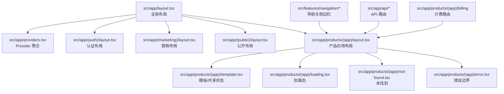
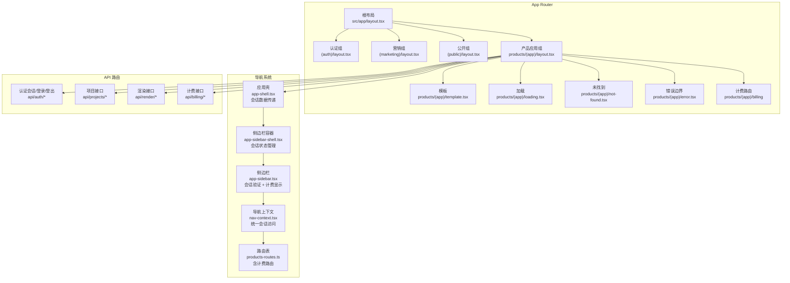
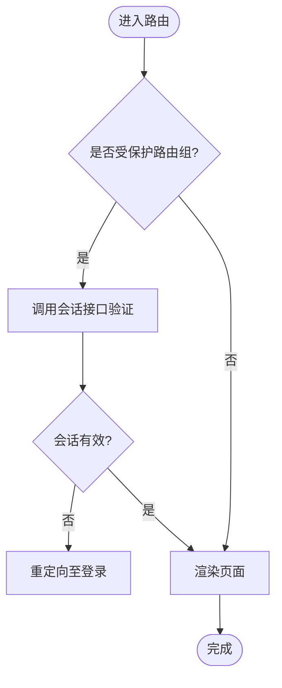
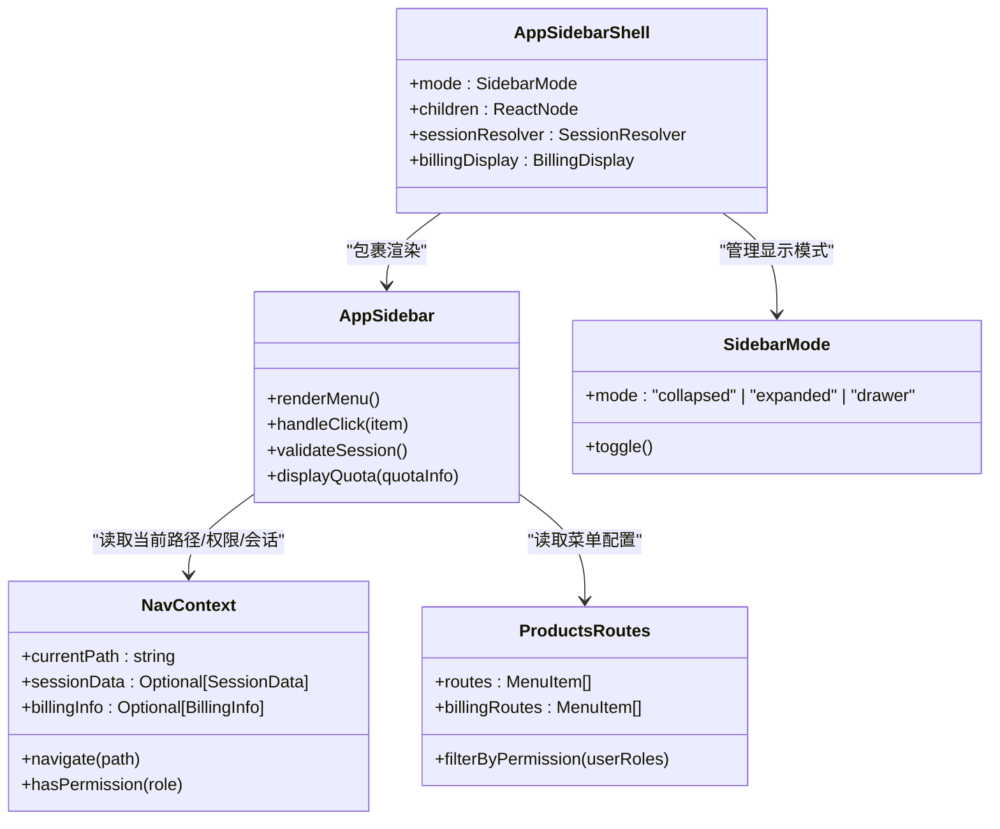
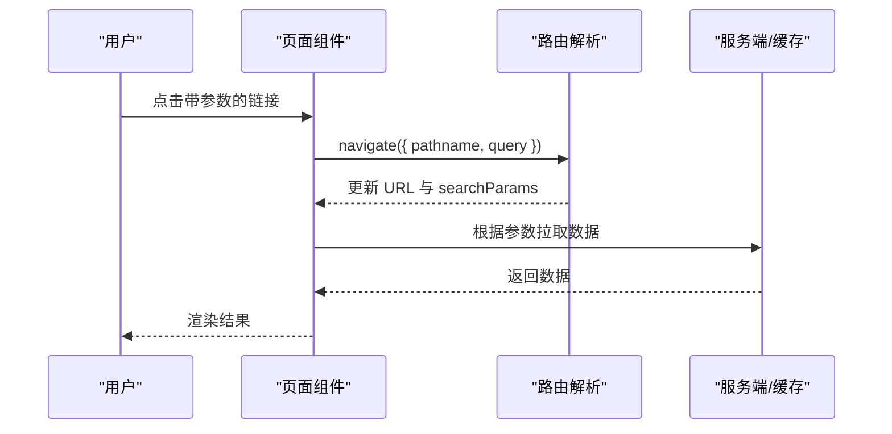
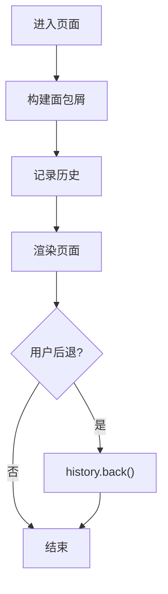
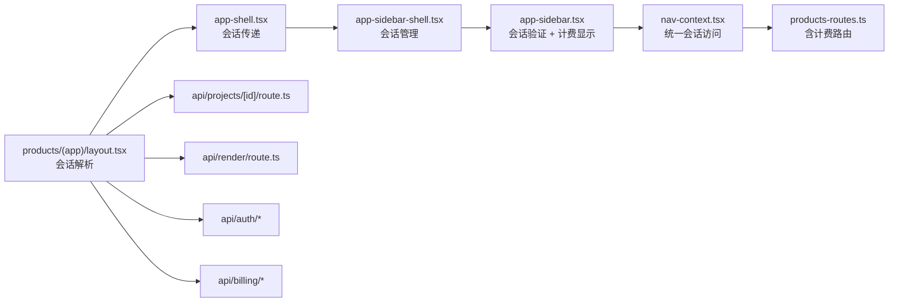

# 导航与路由

<cite>
**本文引用的文件**   
- [src/app/layout.tsx](file://src/app/layout.tsx)
- [src/app/providers.tsx](file://src/app/providers.tsx)
- [src/app/(auth)/layout.tsx](file://src/app/(auth)/layout.tsx)
- [src/app/(marketing)/layout.tsx](file://src/app/(marketing)/layout.tsx)
- [src/app/(public)/layout.tsx](file://src/app/(public)/layout.tsx)
- [src/app/products/(app)/layout.tsx](file://src/app/products/(app)/layout.tsx)
- [src/app/products/(app)/template.tsx](file://src/app/products/(app)/template.tsx)
- [src/app/products/(app)/loading.tsx](file://src/app/products/(app)/loading.tsx)
- [src/app/products/(app)/not-found.tsx](file://src/app/products/(app)/not-found.tsx)
- [src/app/products/(app)/error.tsx](file://src/app/products/(app)/error.tsx)
- [src/app/playbook/page.tsx](file://src/app/playbook/page.tsx)
- [src/app/playbook/registry.ts](file://src/app/playbook/registry.ts)
- [src/features/navigation/app-shell.tsx](file://src/features/navigation/app-shell.tsx)
- [src/features/navigation/app-sidebar-shell.tsx](file://src/features/navigation/app-sidebar-shell.tsx)
- [src/features/navigation/app-sidebar.tsx](file://src/features/navigation/app-sidebar.tsx)
- [src/features/navigation/nav-context.tsx](file://src/features/navigation/nav-context.tsx)
- [src/features/navigation/products-routes.ts](file://src/features/navigation/products-routes.ts)
- [src/features/navigation/sidebar-mode.ts](file://src/features/navigation/sidebar-mode.ts)
- [src/features/navigation/types.ts](file://src/features/navigation/types.ts)
- [src/components/ui/sidebar.tsx](file://src/components/ui/sidebar.tsx)
- [src/components/ui/sidebar-chrome.tsx](file://src/components/ui/sidebar-chrome.tsx)
- [src/components/ui/nav-item.tsx](file://src/components/ui/nav-item.tsx)
- [src/components/ui/section-nav.tsx](file://src/components/ui/section-nav.tsx)
- [src/lib/site-config.ts](file://src/lib/site-config.ts)
- [src/app/api/auth/session/route.ts](file://src/app/api/auth/session/route.ts)
- [src/app/api/auth/login/route.ts](file://src/app/api/auth/login/route.ts)
- [src/app/api/auth/logout/route.ts](file://src/app/api/auth/logout/route.ts)
- [src/app/api/projects/[id]/route.ts](file://src/app/api/projects/[id]/route.ts)
- [src/app/api/render/route.ts](file://src/app/api/render/route.ts)
- [src/app/global-error.tsx](file://src/app/global-error.tsx)
- [src/app/not-found.tsx](file://src/app/not-found.tsx)
- [next.config.ts](file://next.config.ts)
</cite>

## 更新摘要
**变更内容**   
- 在侧边栏导航中新增了计费相关的菜单项和配额显示功能
- 更新了导航系统以支持账单管理和用量统计的展示
- 增强了侧边栏的计费信息集成能力

## 目录
1. [简介](#简介)
2. [项目结构](#项目结构)
3. [核心组件](#核心组件)
4. [架构总览](#架构总览)
5. [详细组件分析](#详细组件分析)
6. [依赖关系分析](#依赖关系分析)
7. [性能考虑](#性能考虑)
8. [故障排查指南](#故障排查指南)
9. [结论](#结论)
10. [附录](#附录)

## 简介
本文件系统性梳理 Next.js App Router 在本项目中的导航与路由策略，覆盖：
- 路由分组、动态路由、嵌套路由与路由守卫（认证/权限）
- 侧边栏导航的实现：菜单生成、权限控制、路由高亮
- **新增** 计费相关菜单项和配额显示的集成
- 路由参数传递、查询字符串处理、URL 状态同步
- 面包屑导航、历史记录管理、深度链接
- 路由性能优化：懒加载、预取、缓存
- 路由测试与调试最佳实践

**更新** 本次更新重点增强了侧边栏导航的计费功能，包括账单管理入口和用量配额显示。

## 项目结构
本项目采用 Next.js App Router 的目录即路由模式，结合"路由组"实现多布局与权限隔离。关键要点：
- 根布局与全局 Provider：在 src/app 下定义全局布局与上下文提供者
- 路由组：(auth)、(marketing)、(public)、products/(app) 等，分别承载不同业务域与布局
- API 路由：src/app/api 下按资源划分 RESTful 接口
- 功能模块：features/navigation 集中管理应用壳、侧边栏、路由配置与上下文
- **新增** billing 相关的路由和组件集成到导航系统中

图表来源
- [src/app/layout.tsx](file://src/app/layout.tsx)
- [src/app/providers.tsx](file://src/app/providers.tsx)
- [src/app/(auth)/layout.tsx](file://src/app/(auth)/layout.tsx)
- [src/app/(marketing)/layout.tsx](file://src/app/(marketing)/layout.tsx)
- [src/app/(public)/layout.tsx](file://src/app/(public)/layout.tsx)
- [src/app/products/(app)/layout.tsx](file://src/app/products/(app)/layout.tsx)
- [src/app/products/(app)/template.tsx](file://src/app/products/(app)/template.tsx)
- [src/app/products/(app)/loading.tsx](file://src/app/products/(app)/loading.tsx)
- [src/app/products/(app)/not-found.tsx](file://src/app/products/(app)/not-found.tsx)
- [src/app/products/(app)/error.tsx](file://src/app/products/(app)/error.tsx)

章节来源
- [src/app/layout.tsx](file://src/app/layout.tsx)
- [src/app/providers.tsx](file://src/app/providers.tsx)
- [src/app/(auth)/layout.tsx](file://src/app/(auth)/layout.tsx)
- [src/app/(marketing)/layout.tsx](file://src/app/(marketing)/layout.tsx)
- [src/app/(public)/layout.tsx](file://src/app/(public)/layout.tsx)
- [src/app/products/(app)/layout.tsx](file://src/app/products/(app)/layout.tsx)

## 核心组件
- 应用壳与侧边栏
  - app-shell：应用级外壳，承载顶部栏、侧边栏与主内容区，支持会话数据传递
  - app-sidebar-shell：侧边栏容器，负责展开/收起、模式切换与会话状态管理
  - app-sidebar：侧边栏菜单渲染与交互，集成会话验证和**计费信息显示**
  - nav-context：导航上下文，统一当前路由、跳转、权限判断与会话信息
  - products-routes：产品域路由表，驱动菜单生成与权限过滤，**包含计费相关路由**
  - sidebar-mode：侧边栏显示模式（折叠/展开/抽屉）
- UI 组件
  - sidebar、sidebar-chrome、nav-item、section-nav：基础导航与展示组件

**更新** 侧边栏组件现在集成了计费相关的菜单项和配额显示功能，提供更好的用户体验。

章节来源
- [src/features/navigation/app-shell.tsx](file://src/features/navigation/app-shell.tsx)
- [src/features/navigation/app-sidebar-shell.tsx](file://src/features/navigation/app-sidebar-shell.tsx)
- [src/features/navigation/app-sidebar.tsx](file://src/features/navigation/app-sidebar.tsx)
- [src/features/navigation/nav-context.tsx](file://src/features/navigation/nav-context.tsx)
- [src/features/navigation/products-routes.ts](file://src/features/navigation/products-routes.ts)
- [src/features/navigation/sidebar-mode.ts](file://src/features/navigation/sidebar-mode.ts)
- [src/components/ui/sidebar.tsx](file://src/components/ui/sidebar.tsx)
- [src/components/ui/sidebar-chrome.tsx](file://src/components/ui/sidebar-chrome.tsx)
- [src/components/ui/nav-item.tsx](file://src/components/ui/nav-item.tsx)
- [src/components/ui/section-nav.tsx](file://src/components/ui/section-nav.tsx)

## 架构总览
Next.js App Router 以目录为路由，配合路由组与 layout/template/loading/error 等约定文件，形成清晰的层级与职责分离。导航层通过 features/navigation 提供统一的菜单、权限与高亮能力；API 路由提供数据获取与操作入口。**新增的计费功能已集成到导航系统中**。

图表来源
- [src/app/layout.tsx](file://src/app/layout.tsx)
- [src/app/(auth)/layout.tsx](file://src/app/(auth)/layout.tsx)
- [src/app/(marketing)/layout.tsx](file://src/app/(marketing)/layout.tsx)
- [src/app/(public)/layout.tsx](file://src/app/(public)/layout.tsx)
- [src/app/products/(app)/layout.tsx](file://src/app/products/(app)/layout.tsx)
- [src/app/products/(app)/template.tsx](file://src/app/products/(app)/template.tsx)
- [src/app/products/(app)/loading.tsx](file://src/app/products/(app)/loading.tsx)
- [src/app/products/(app)/not-found.tsx](file://src/app/products/(app)/not-found.tsx)
- [src/app/products/(app)/error.tsx](file://src/app/products/(app)/error.tsx)
- [src/features/navigation/app-shell.tsx](file://src/features/navigation/app-shell.tsx)
- [src/features/navigation/app-sidebar-shell.tsx](file://src/features/navigation/app-sidebar-shell.tsx)
- [src/features/navigation/app-sidebar.tsx](file://src/features/navigation/app-sidebar.tsx)
- [src/features/navigation/nav-context.tsx](file://src/features/navigation/nav-context.tsx)
- [src/features/navigation/products-routes.ts](file://src/features/navigation/products-routes.ts)
- [src/app/api/auth/session/route.ts](file://src/app/api/auth/session/route.ts)
- [src/app/api/auth/login/route.ts](file://src/app/api/auth/login/route.ts)
- [src/app/api/auth/logout/route.ts](file://src/app/api/auth/logout/route.ts)
- [src/app/api/projects/[id]/route.ts](file://src/app/api/projects/[id]/route.ts)
- [src/app/api/render/route.ts](file://src/app/api/render/route.ts)

## 详细组件分析

### App Router 路由策略
- 路由组与布局隔离
  - (auth)：登录、注册、密码重置等页面，强制鉴权或无状态布局
  - (marketing)：营销页，SEO 友好，静态化优先
  - (public)：公开信息页，如发布说明
  - products/(app)：产品应用主域，包含画布、导出、设置、镜头等子路由
  - **新增** billing：计费管理相关页面，包括账单查看、用量统计等
- 动态路由
  - 使用方括号命名，如 projects/[id]、render/thumbnails、director/stream/[nodeId] 等
- 嵌套路由
  - 通过目录层级组织，父 layout 提供共享 UI 与数据，子 page 渲染具体视图
- 路由守卫
  - 在 layout 或页面中根据 session/用户角色进行重定向或拦截
  - 结合 API 路由校验会话，前端基于上下文决定是否渲染

图表来源
- [src/app/(auth)/layout.tsx](file://src/app/(auth)/layout.tsx)
- [src/app/api/auth/session/route.ts](file://src/app/api/auth/session/route.ts)
- [src/app/api/auth/login/route.ts](file://src/app/api/auth/login/route.ts)
- [src/app/api/auth/logout/route.ts](file://src/app/api/auth/logout/route.ts)

章节来源
- [src/app/(auth)/layout.tsx](file://src/app/(auth)/layout.tsx)
- [src/app/(marketing)/layout.tsx](file://src/app/(marketing)/layout.tsx)
- [src/app/(public)/layout.tsx](file://src/app/(public)/layout.tsx)
- [src/app/products/(app)/layout.tsx](file://src/app/products/(app)/layout.tsx)
- [src/app/api/auth/session/route.ts](file://src/app/api/auth/session/route.ts)
- [src/app/api/auth/login/route.ts](file://src/app/api/auth/login/route.ts)
- [src/app/api/auth/logout/route.ts](file://src/app/api/auth/logout/route.ts)

### 侧边栏导航实现
- 菜单生成
  - 由 products-routes.ts 维护路由元数据（标题、图标、路径、权限标识），app-sidebar.tsx 读取并渲染
  - **新增** 计费相关菜单项，包括账单管理、用量统计等功能入口
- 权限控制
  - 结合用户角色/权限集合，过滤不可见菜单项
- 路由高亮
  - 基于当前 URL 与菜单路径匹配，自动高亮当前项
- 交互模式
  - sidebar-mode.ts 管理展开/收起/抽屉模式，app-sidebar-shell.tsx 协调行为
- **新增** 配额显示
  - 在侧边栏中实时显示用户的用量配额和使用情况

**更新** 侧边栏组件现在集成了计费相关的菜单项和配额显示功能，提供更好的用户体验。

图表来源
- [src/features/navigation/nav-context.tsx](file://src/features/navigation/nav-context.tsx)
- [src/features/navigation/products-routes.ts](file://src/features/navigation/products-routes.ts)
- [src/features/navigation/app-sidebar.tsx](file://src/features/navigation/app-sidebar.tsx)
- [src/features/navigation/sidebar-mode.ts](file://src/features/navigation/sidebar-mode.ts)
- [src/features/navigation/app-sidebar-shell.tsx](file://src/features/navigation/app-sidebar-shell.tsx)

章节来源
- [src/features/navigation/app-sidebar.tsx](file://src/features/navigation/app-sidebar.tsx)
- [src/features/navigation/app-sidebar-shell.tsx](file://src/features/navigation/app-sidebar-shell.tsx)
- [src/features/navigation/nav-context.tsx](file://src/features/navigation/nav-context.tsx)
- [src/features/navigation/products-routes.ts](file://src/features/navigation/products-routes.ts)
- [src/features/navigation/sidebar-mode.ts](file://src/features/navigation/sidebar-mode.ts)
- [src/components/ui/sidebar.tsx](file://src/components/ui/sidebar.tsx)
- [src/components/ui/sidebar-chrome.tsx](file://src/components/ui/sidebar-chrome.tsx)
- [src/components/ui/nav-item.tsx](file://src/components/ui/nav-item.tsx)

### 路由参数与查询字符串
- 动态路由参数
  - 使用 [id] 等命名捕获，页面通过 params 获取
- 查询字符串
  - 使用 searchParams 获取键值对，常用于筛选、分页、搜索
- URL 状态同步
  - 将关键 UI 状态（如展开面板、选中项）写入 URL，支持分享与刷新保持

图表来源
- [src/app/products/(app)/layout.tsx](file://src/app/products/(app)/layout.tsx)
- [src/app/products/(app)/template.tsx](file://src/app/products/(app)/template.tsx)
- [src/app/api/projects/[id]/route.ts](file://src/app/api/projects/[id]/route.ts)

章节来源
- [src/app/products/(app)/layout.tsx](file://src/app/products/(app)/layout.tsx)
- [src/app/products/(app)/template.tsx](file://src/app/products/(app)/template.tsx)
- [src/app/api/projects/[id]/route.ts](file://src/app/api/projects/[id]/route.ts)

### 面包屑导航与历史记录
- 面包屑
  - 基于路由层级与页面标题构建，支持自定义映射
- 历史记录
  - 使用浏览器 history API 管理前进后退，避免重复入栈
- 深度链接
  - 确保所有可分享页面具备稳定 URL，支持直接访问

图表来源
- [src/components/ui/section-nav.tsx](file://src/components/ui/section-nav.tsx)
- [src/app/products/(app)/layout.tsx](file://src/app/products/(app)/layout.tsx)

章节来源
- [src/components/ui/section-nav.tsx](file://src/components/ui/section-nav.tsx)
- [src/app/products/(app)/layout.tsx](file://src/app/products/(app)/layout.tsx)

### 路由性能优化
- 代码分割与懒加载
  - 使用 dynamic import 按需加载重型组件
- 预取与缓存
  - 利用 Next.js 内置缓存与 prefetch，减少首屏与后续请求延迟
- 骨架屏与加载态
  - 通过 loading.tsx 与 Suspense 提升感知性能

章节来源
- [src/app/products/(app)/loading.tsx](file://src/app/products/(app)/loading.tsx)
- [next.config.ts](file://next.config.ts)

### 路由测试与调试
- 单元测试
  - 针对路由表、权限过滤、导航逻辑编写用例
- 集成测试
  - 模拟用户导航流程，校验页面渲染与数据加载
- 调试技巧
  - 使用浏览器开发者工具观察 URL 变化、网络请求与组件渲染

章节来源
- [src/features/navigation/products-routes.test.ts](file://src/features/navigation/products-routes.test.ts)
- [src/features/navigation/app-sidebar-shell.test.ts](file://src/features/navigation/app-sidebar-shell.test.ts)
- [src/features/navigation/app-shell.test.ts](file://src/features/navigation/app-shell.test.ts)

## 依赖关系分析
导航系统与 App Router、API 路由之间的耦合关系如下：

图表来源
- [src/app/products/(app)/layout.tsx](file://src/app/products/(app)/layout.tsx)
- [src/features/navigation/app-shell.tsx](file://src/features/navigation/app-shell.tsx)
- [src/features/navigation/app-sidebar-shell.tsx](file://src/features/navigation/app-sidebar-shell.tsx)
- [src/features/navigation/app-sidebar.tsx](file://src/features/navigation/app-sidebar.tsx)
- [src/features/navigation/nav-context.tsx](file://src/features/navigation/nav-context.tsx)
- [src/features/navigation/products-routes.ts](file://src/features/navigation/products-routes.ts)
- [src/app/api/projects/[id]/route.ts](file://src/app/api/projects/[id]/route.ts)
- [src/app/api/render/route.ts](file://src/app/api/render/route.ts)
- [src/app/api/auth/session/route.ts](file://src/app/api/auth/session/route.ts)
- [src/app/api/auth/login/route.ts](file://src/app/api/auth/login/route.ts)
- [src/app/api/auth/logout/route.ts](file://src/app/api/auth/logout/route.ts)

章节来源
- [src/app/products/(app)/layout.tsx](file://src/app/products/(app)/layout.tsx)
- [src/features/navigation/app-shell.tsx](file://src/features/navigation/app-shell.tsx)
- [src/features/navigation/app-sidebar-shell.tsx](file://src/features/navigation/app-sidebar-shell.tsx)
- [src/features/navigation/app-sidebar.tsx](file://src/features/navigation/app-sidebar.tsx)
- [src/features/navigation/nav-context.tsx](file://src/features/navigation/nav-context.tsx)
- [src/features/navigation/products-routes.ts](file://src/features/navigation/products-routes.ts)
- [src/app/api/projects/[id]/route.ts](file://src/app/api/projects/[id]/route.ts)
- [src/app/api/render/route.ts](file://src/app/api/render/route.ts)
- [src/app/api/auth/session/route.ts](file://src/app/api/auth/session/route.ts)
- [src/app/api/auth/login/route.ts](file://src/app/api/auth/login/route.ts)
- [src/app/api/auth/logout/route.ts](file://src/app/api/auth/logout/route.ts)

## 性能考虑
- 路由级懒加载：对非首屏页面与重型组件使用动态导入
- 预取策略：对高频访问的路径启用预取，平衡带宽与体验
- 缓存与去重：服务端与客户端缓存结合，避免重复请求
- 骨架与占位：在数据加载期间提供骨架屏，提升感知速度
- 资源拆分：按路由拆分 JS/CSS，减小包体积

## 故障排查指南
- 常见问题
  - 路由未命中：检查目录结构与文件名是否符合约定
  - 权限拦截：确认会话状态与权限配置是否正确
  - 参数缺失：核对动态路由参数与查询字符串键名
  - 加载卡死：检查 loading.tsx 与 Suspense 的使用
  - **计费功能问题**：检查计费菜单项是否正确显示，配额数据是否正常加载
- 定位方法
  - 使用浏览器开发者工具查看 Network、Console、Router 面板
  - 在 API 路由中添加日志，确认请求与响应
  - 通过单元测试复现问题场景

章节来源
- [src/app/global-error.tsx](file://src/app/global-error.tsx)
- [src/app/not-found.tsx](file://src/app/not-found.tsx)
- [src/app/products/(app)/error.tsx](file://src/app/products/(app)/error.tsx)
- [src/app/products/(app)/not-found.tsx](file://src/app/products/(app)/not-found.tsx)

## 结论
本项目基于 Next.js App Router 构建了清晰、可扩展的导航与路由体系。通过路由组与布局隔离、集中式导航上下文与路由表、完善的错误与加载态处理，实现了良好的用户体验与可维护性。**最新的计费功能集成进一步丰富了导航系统的功能，为用户提供了完整的账单管理和用量监控能力**。建议在后续迭代中持续优化懒加载与预取策略，完善测试覆盖，确保路由行为的稳定性与性能。

## 附录
- 站点配置参考：site-config.ts 可用于统一站点元信息与导航文案
- Playbook 示例：playbook/page.tsx 与 registry.ts 展示了文档类页面的组织方式

章节来源
- [src/lib/site-config.ts](file://src/lib/site-config.ts)
- [src/app/playbook/page.tsx](file://src/app/playbook/page.tsx)
- [src/app/playbook/registry.ts](file://src/app/playbook/registry.ts)