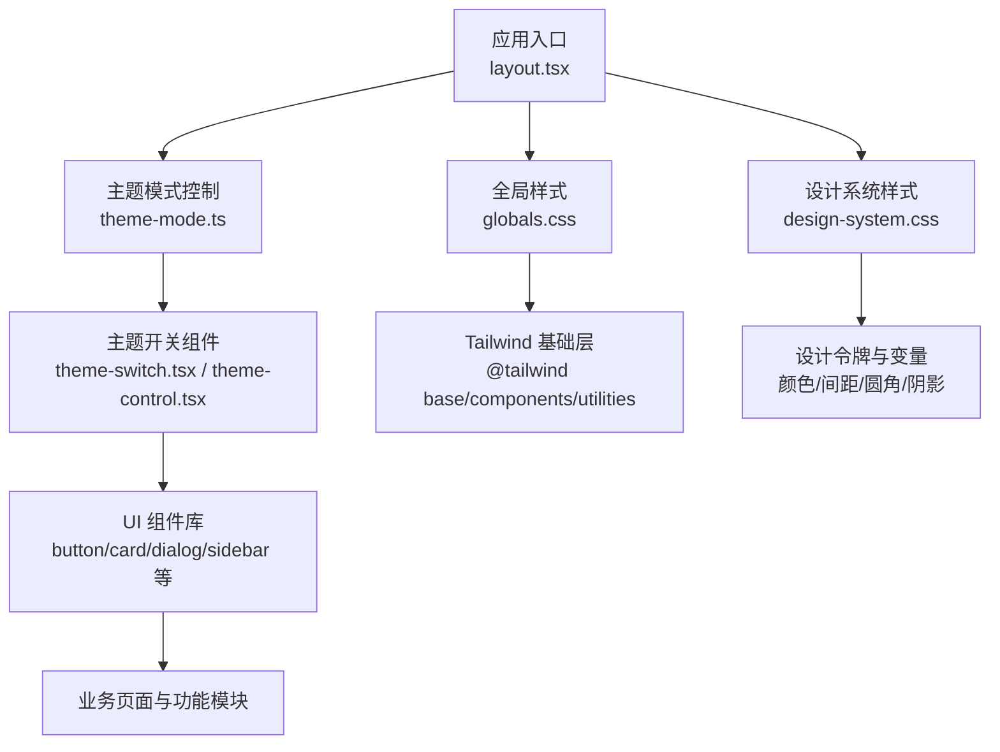
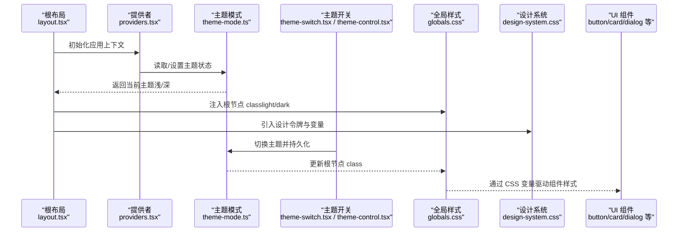
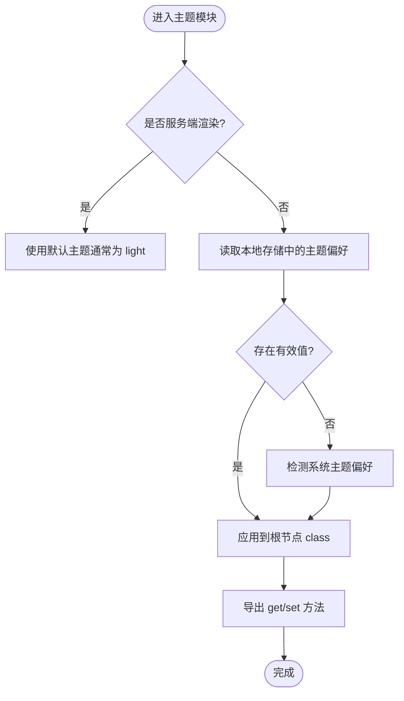
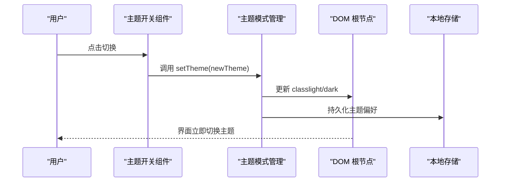
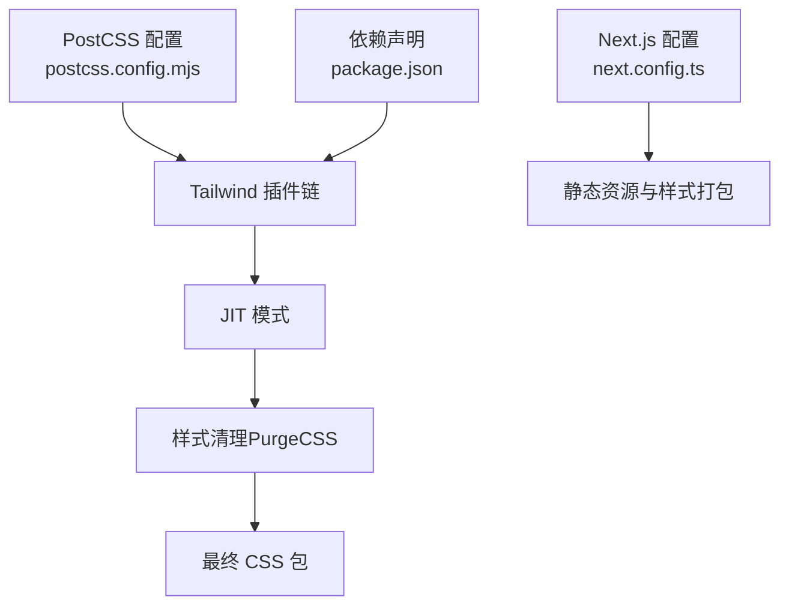
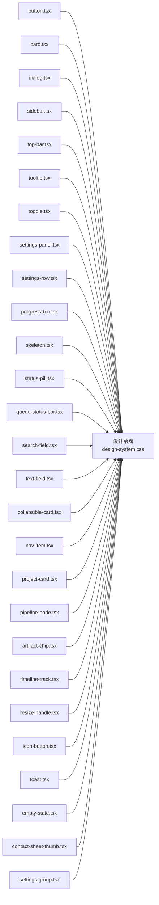
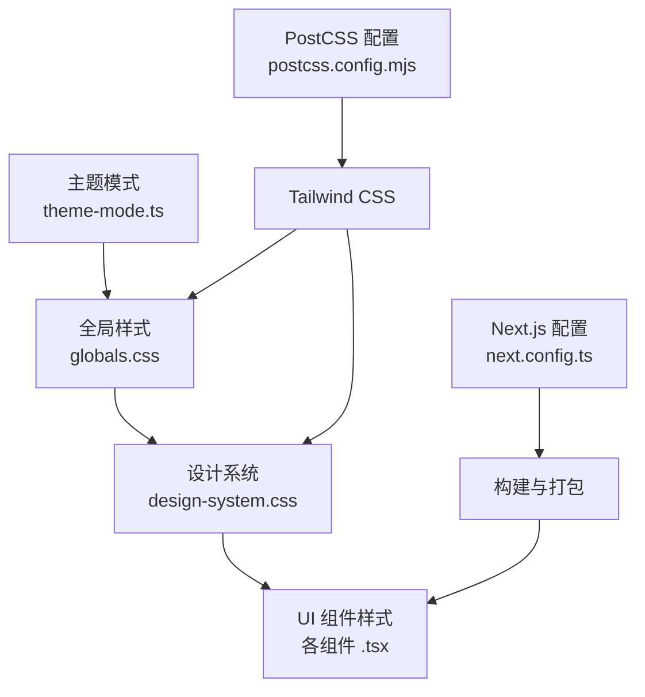

# 样式与主题

<cite>
**本文引用的文件**   
- [src/app/globals.css](file://src/app/globals.css)
- [src/app/design-system.css](file://src/app/design-system.css)
- [postcss.config.mjs](file://postcss.config.mjs)
- [next.config.ts](file://next.config.ts)
- [package.json](file://package.json)
- [src/lib/theme-mode.ts](file://src/lib/theme-mode.ts)
- [src/lib/theme-mode.test.ts](file://src/lib/theme-mode.test.ts)
- [src/components/marketing/theme-switch.tsx](file://src/components/marketing/theme-switch.tsx)
- [src/app/(products)/settings/theme-control.tsx](file://src/app/(products)/settings/theme-control.tsx)
- [src/app/(products)/settings/theme-control.test.ts](file://src/app/(products)/settings/theme-control.test.ts)
- [src/app/providers.tsx](file://src/app/providers.tsx)
- [src/app/layout.tsx](file://src/app/layout.tsx)
- [src/components/ui/button.tsx](file://src/components/ui/button.tsx)
- [src/components/ui/card.tsx](file://src/components/ui/card.tsx)
- [src/components/ui/dialog.tsx](file://src/components/ui/dialog.tsx)
- [src/components/ui/sidebar.tsx](file://src/components/ui/sidebar.tsx)
- [src/components/ui/top-bar.tsx](file://src/components/ui/top-bar.tsx)
- [src/components/ui/tooltip.tsx](file://src/components/ui/tooltip.tsx)
- [src/components/ui/toggle.tsx](file://src/components/ui/toggle.tsx)
- [src/components/ui/settings-panel.tsx](file://src/components/ui/settings-panel.tsx)
- [src/components/ui/settings-row.tsx](file://src/components/ui/settings-row.tsx)
- [src/components/ui/progress-bar.tsx](file://src/components/ui/progress-bar.tsx)
- [src/components/ui/skeleton.tsx](file://src/components/ui/skeleton.tsx)
- [src/components/ui/status-pill.tsx](file://src/components/ui/status-pill.tsx)
- [src/components/ui/queue-status-bar.tsx](file://src/components/ui/queue-status-bar.tsx)
- [src/components/ui/search-field.tsx](file://src/components/ui/search-field.tsx)
- [src/components/ui/text-field.tsx](file://src/components/ui/text-field.tsx)
- [src/components/ui/collapsible-card.tsx](file://src/components/ui/collapsible-card.tsx)
- [src/components/ui/nav-item.tsx](file://src/components/ui/nav-item.tsx)
- [src/components/ui/project-card.tsx](file://src/components/ui/project-card.tsx)
- [src/components/ui/pipeline-node.tsx](file://src/components/ui/pipeline-node.tsx)
- [src/components/ui/artifact-chip.tsx](file://src/components/ui/artifact-chip.tsx)
- [src/components/ui/timeline-track.tsx](file://src/components/ui/timeline-track.tsx)
- [src/components/ui/resize-handle.tsx](file://src/components/ui/resize-handle.tsx)
- [src/components/ui/icon-button.tsx](file://src/components/ui/icon-button.tsx)
- [src/components/ui/toast.tsx](file://src/components/ui/toast.tsx)
- [src/components/ui/empty-state.tsx](file://src/components/ui/empty-state.tsx)
- [src/components/ui/contact-sheet-thumb.tsx](file://src/components/ui/contact-sheet-thumb.tsx)
- [src/components/ui/settings-group.tsx](file://src/components/ui/settings-group.tsx)
</cite>

## 目录
1. [简介](#简介)
2. [项目结构](#项目结构)
3. [核心组件](#核心组件)
4. [架构总览](#架构总览)
5. [详细组件分析](#详细组件分析)
6. [依赖分析](#依赖分析)
7. [性能考虑](#性能考虑)
8. [故障排查指南](#故障排查指南)
9. [结论](#结论)
10. [附录](#附录)

## 简介
本文件系统性梳理 PurpleInk 的样式与主题体系，覆盖 CSS 架构、Tailwind 配置与使用模式、深色/浅色主题切换实现、样式性能优化、CSS-in-JS 策略以及无障碍访问支持。文档同时提供开发规范、命名约定与调试技巧，帮助团队在大型应用中保持一致的视觉与交互体验。

## 项目结构
PurpleInk 采用 Next.js + Tailwind CSS 的现代前端架构：
- 全局样式与主题变量集中在应用根级样式文件中，便于统一管理与按需加载。
- 组件样式以原子化类名为主，结合少量局部样式文件，确保高内聚低耦合。
- 主题切换通过运行时状态驱动，配合 HTML 根节点 class 切换实现深浅色模式。
- 动画与过渡由 Tailwind 插件或自定义 keyframes 管理，避免重复定义。



**图表来源** 
- [src/app/layout.tsx](file://src/app/layout.tsx)
- [src/app/globals.css](file://src/app/globals.css)
- [src/app/design-system.css](file://src/app/design-system.css)
- [src/lib/theme-mode.ts](file://src/lib/theme-mode.ts)
- [src/components/marketing/theme-switch.tsx](file://src/components/marketing/theme-switch.tsx)
- [src/app/(products)/settings/theme-control.tsx](file://src/app/(products)/settings/theme-control.tsx)

**章节来源**
- [src/app/layout.tsx](file://src/app/layout.tsx)
- [src/app/globals.css](file://src/app/globals.css)
- [src/app/design-system.css](file://src/app/design-system.css)
- [src/lib/theme-mode.ts](file://src/lib/theme-mode.ts)
- [src/components/marketing/theme-switch.tsx](file://src/components/marketing/theme-switch.tsx)
- [src/app/(products)/settings/theme-control.tsx](file://src/app/(products)/settings/theme-control.tsx)

## 核心组件
- 主题模式管理：集中式状态与持久化存储，提供获取/设置当前主题的方法，并在客户端初始化时恢复用户偏好。
- 主题切换 UI：营销页与产品设置页均提供主题切换入口，保证一致的用户体验。
- 设计系统样式：定义颜色、字体、间距、圆角、阴影等设计令牌，供全应用复用。
- UI 组件样式：基于 Tailwind 原子类构建，必要时辅以局部样式文件，保持可维护性。

**章节来源**
- [src/lib/theme-mode.ts](file://src/lib/theme-mode.ts)
- [src/lib/theme-mode.test.ts](file://src/lib/theme-mode.test.ts)
- [src/components/marketing/theme-switch.tsx](file://src/components/marketing/theme-switch.tsx)
- [src/app/(products)/settings/theme-control.tsx](file://src/app/(products)/settings/theme-control.tsx)
- [src/app/design-system.css](file://src/app/design-system.css)

## 架构总览
下图展示了从应用入口到样式渲染的主题数据流与控制流：



**图表来源** 
- [src/app/layout.tsx](file://src/app/layout.tsx)
- [src/app/providers.tsx](file://src/app/providers.tsx)
- [src/lib/theme-mode.ts](file://src/lib/theme-mode.ts)
- [src/components/marketing/theme-switch.tsx](file://src/components/marketing/theme-switch.tsx)
- [src/app/(products)/settings/theme-control.tsx](file://src/app/(products)/settings/theme-control.tsx)
- [src/app/globals.css](file://src/app/globals.css)
- [src/app/design-system.css](file://src/app/design-system.css)

## 详细组件分析

### 主题模式管理（theme-mode.ts）
- 职责：封装主题状态的获取、设置与持久化；处理服务端/客户端差异；暴露统一的 API。
- 关键点：
  - 在服务端避免直接访问浏览器 API，使用条件判断与默认值。
  - 在客户端初始化时同步 localStorage 与 DOM class。
  - 提供响应式更新机制，确保 UI 即时反映主题变化。



**图表来源** 
- [src/lib/theme-mode.ts](file://src/lib/theme-mode.ts)

**章节来源**
- [src/lib/theme-mode.ts](file://src/lib/theme-mode.ts)
- [src/lib/theme-mode.test.ts](file://src/lib/theme-mode.test.ts)

### 主题切换 UI（marketing/theme-switch.tsx 与 settings/theme-control.tsx）
- 职责：提供用户可见的主题切换入口，调用主题模式管理模块进行状态更新。
- 关键点：
  - 按钮/开关需具备键盘可达性与屏幕阅读器标签。
  - 切换过程应平滑过渡，避免闪烁。
  - 在设置页中，主题切换应与其它设置项保持一致的交互模式。



**图表来源** 
- [src/components/marketing/theme-switch.tsx](file://src/components/marketing/theme-switch.tsx)
- [src/app/(products)/settings/theme-control.tsx](file://src/app/(products)/settings/theme-control.tsx)
- [src/lib/theme-mode.ts](file://src/lib/theme-mode.ts)

**章节来源**
- [src/components/marketing/theme-switch.tsx](file://src/components/marketing/theme-switch.tsx)
- [src/app/(products)/settings/theme-control.tsx](file://src/app/(products)/settings/theme-control.tsx)
- [src/app/(products)/settings/theme-control.test.ts](file://src/app/(products)/settings/theme-control.test.ts)

### 全局样式与设计系统（globals.css 与 design-system.css）
- globals.css：
  - 引入 Tailwind 基础层与工具类。
  - 定义根级 CSS 变量（颜色、阴影、圆角等），为深浅色模式提供变量映射。
- design-system.css：
  - 集中设计令牌（颜色语义、字体族、字号阶梯、间距尺度）。
  - 提供通用组件基类（卡片、按钮、输入框等）的样式骨架。

```mermaid
classDiagram
class GlobalsCSS {
"+Tailwind 基础层导入"
"+根级 CSS 变量定义"
"+深浅色变量映射"
}
class DesignSystemCSS {
"+颜色语义令牌"
"+字体与字号阶梯"
"+间距与圆角尺度"
"+通用组件基类"
}
class ThemeMode {
"+getTheme()"
"+setTheme(theme)"
"+persistToStorage()"
}
GlobalsCSS <.. DesignSystemCSS : "共享变量"
ThemeMode --> GlobalsCSS : "更新根 class"
```

**图表来源** 
- [src/app/globals.css](file://src/app/globals.css)
- [src/app/design-system.css](file://src/app/design-system.css)
- [src/lib/theme-mode.ts](file://src/lib/theme-mode.ts)

**章节来源**
- [src/app/globals.css](file://src/app/globals.css)
- [src/app/design-system.css](file://src/app/design-system.css)

### Tailwind CSS 配置与使用模式（postcss.config.mjs, next.config.ts, package.json）
- PostCSS 配置：
  - 启用 Tailwind 插件链，支持 JIT 模式与自定义扩展。
  - 集成 PurgeCSS（或等效清理器）以减少生产包体积。
- Next.js 配置：
  - 确保静态资源与样式正确打包。
  - 可选启用实验特性（如 CSS 模块、路径别名等）。
- 使用模式：
  - 优先使用原子类组合，避免手写冗余样式。
  - 通过 design-system.css 暴露的设计令牌统一视觉风格。
  - 响应式断点遵循 Tailwind 默认断点或自定义扩展。



**图表来源** 
- [postcss.config.mjs](file://postcss.config.mjs)
- [next.config.ts](file://next.config.ts)
- [package.json](file://package.json)

**章节来源**
- [postcss.config.mjs](file://postcss.config.mjs)
- [next.config.ts](file://next.config.ts)
- [package.json](file://package.json)

### UI 组件样式组织（示例：button.tsx, card.tsx, dialog.tsx, sidebar.tsx 等）
- 组织原则：
  - 组件样式以 Tailwind 原子类为主，复杂交互或状态样式可放入同目录下的样式文件或 CSS-in-JS。
  - 通过 props 控制变体（尺寸、颜色、禁用态等），保持组件高内聚。
  - 使用设计系统令牌（颜色、间距、圆角）确保一致性。
- 示例组件：
  - 按钮、卡片、对话框、侧边栏、顶部栏、工具提示、开关、设置面板、进度条、骨架屏、状态徽章、队列状态栏、搜索字段、文本输入、折叠卡片、导航项、项目卡片、流水线节点、产物芯片、时间线轨道、拖拽手柄、图标按钮、消息提示、空状态、设置分组等。



**图表来源** 
- [src/components/ui/button.tsx](file://src/components/ui/button.tsx)
- [src/components/ui/card.tsx](file://src/components/ui/card.tsx)
- [src/components/ui/dialog.tsx](file://src/components/ui/dialog.tsx)
- [src/components/ui/sidebar.tsx](file://src/components/ui/sidebar.tsx)
- [src/components/ui/top-bar.tsx](file://src/components/ui/top-bar.tsx)
- [src/components/ui/tooltip.tsx](file://src/components/ui/tooltip.tsx)
- [src/components/ui/toggle.tsx](file://src/components/ui/toggle.tsx)
- [src/components/ui/settings-panel.tsx](file://src/components/ui/settings-panel.tsx)
- [src/components/ui/settings-row.tsx](file://src/components/ui/settings-row.tsx)
- [src/components/ui/progress-bar.tsx](file://src/components/ui/progress-bar.tsx)
- [src/components/ui/skeleton.tsx](file://src/components/ui/skeleton.tsx)
- [src/components/ui/status-pill.tsx](file://src/components/ui/status-pill.tsx)
- [src/components/ui/queue-status-bar.tsx](file://src/components/ui/queue-status-bar.tsx)
- [src/components/ui/search-field.tsx](file://src/components/ui/search-field.tsx)
- [src/components/ui/text-field.tsx](file://src/components/ui/text-field.tsx)
- [src/components/ui/collapsible-card.tsx](file://src/components/ui/collapsible-card.tsx)
- [src/components/ui/nav-item.tsx](file://src/components/ui/nav-item.tsx)
- [src/components/ui/project-card.tsx](file://src/components/ui/project-card.tsx)
- [src/components/ui/pipeline-node.tsx](file://src/components/ui/pipeline-node.tsx)
- [src/components/ui/artifact-chip.tsx](file://src/components/ui/artifact-chip.tsx)
- [src/components/ui/timeline-track.tsx](file://src/components/ui/timeline-track.tsx)
- [src/components/ui/resize-handle.tsx](file://src/components/ui/resize-handle.tsx)
- [src/components/ui/icon-button.tsx](file://src/components/ui/icon-button.tsx)
- [src/components/ui/toast.tsx](file://src/components/ui/toast.tsx)
- [src/components/ui/empty-state.tsx](file://src/components/ui/empty-state.tsx)
- [src/components/ui/contact-sheet-thumb.tsx](file://src/components/ui/contact-sheet-thumb.tsx)
- [src/components/ui/settings-group.tsx](file://src/components/ui/settings-group.tsx)
- [src/app/design-system.css](file://src/app/design-system.css)

**章节来源**
- [src/components/ui/button.tsx](file://src/components/ui/button.tsx)
- [src/components/ui/card.tsx](file://src/components/ui/card.tsx)
- [src/components/ui/dialog.tsx](file://src/components/ui/dialog.tsx)
- [src/components/ui/sidebar.tsx](file://src/components/ui/sidebar.tsx)
- [src/components/ui/top-bar.tsx](file://src/components/ui/top-bar.tsx)
- [src/components/ui/tooltip.tsx](file://src/components/ui/tooltip.tsx)
- [src/components/ui/toggle.tsx](file://src/components/ui/toggle.tsx)
- [src/components/ui/settings-panel.tsx](file://src/components/ui/settings-panel.tsx)
- [src/components/ui/settings-row.tsx](file://src/components/ui/settings-row.tsx)
- [src/components/ui/progress-bar.tsx](file://src/components/ui/progress-bar.tsx)
- [src/components/ui/skeleton.tsx](file://src/components/ui/skeleton.tsx)
- [src/components/ui/status-pill.tsx](file://src/components/ui/status-pill.tsx)
- [src/components/ui/queue-status-bar.tsx](file://src/components/ui/queue-status-bar.tsx)
- [src/components/ui/search-field.tsx](file://src/components/ui/search-field.tsx)
- [src/components/ui/text-field.tsx](file://src/components/ui/text-field.tsx)
- [src/components/ui/collapsible-card.tsx](file://src/components/ui/collapsible-card.tsx)
- [src/components/ui/nav-item.tsx](file://src/components/ui/nav-item.tsx)
- [src/components/ui/project-card.tsx](file://src/components/ui/project-card.tsx)
- [src/components/ui/pipeline-node.tsx](file://src/components/ui/pipeline-node.tsx)
- [src/components/ui/artifact-chip.tsx](file://src/components/ui/artifact-chip.tsx)
- [src/components/ui/timeline-track.tsx](file://src/components/ui/timeline-track.tsx)
- [src/components/ui/resize-handle.tsx](file://src/components/ui/resize-handle.tsx)
- [src/components/ui/icon-button.tsx](file://src/components/ui/icon-button.tsx)
- [src/components/ui/toast.tsx](file://src/components/ui/toast.tsx)
- [src/components/ui/empty-state.tsx](file://src/components/ui/empty-state.tsx)
- [src/components/ui/contact-sheet-thumb.tsx](file://src/components/ui/contact-sheet-thumb.tsx)
- [src/components/ui/settings-group.tsx](file://src/components/ui/settings-group.tsx)
- [src/app/design-system.css](file://src/app/design-system.css)

## 依赖分析
- 样式依赖关系：
  - 全局样式与设计系统为所有 UI 组件提供基础样式与变量。
  - 主题模式管理影响根节点 class，从而驱动 CSS 变量在不同主题下的取值。
- 外部依赖：
  - Tailwind CSS 作为原子化样式框架，减少手写 CSS 量。
  - PostCSS 与 Next.js 构建管线负责样式编译与优化。



**图表来源** 
- [src/lib/theme-mode.ts](file://src/lib/theme-mode.ts)
- [src/app/globals.css](file://src/app/globals.css)
- [src/app/design-system.css](file://src/app/design-system.css)
- [postcss.config.mjs](file://postcss.config.mjs)
- [next.config.ts](file://next.config.ts)

**章节来源**
- [src/lib/theme-mode.ts](file://src/lib/theme-mode.ts)
- [src/app/globals.css](file://src/app/globals.css)
- [src/app/design-system.css](file://src/app/design-system.css)
- [postcss.config.mjs](file://postcss.config.mjs)
- [next.config.ts](file://next.config.ts)

## 性能考虑
- 样式体积优化：
  - 启用 Tailwind 的 JIT 模式与样式清理，移除未使用的类名。
  - 将公共样式抽离至设计系统文件，避免重复定义。
- 渲染性能：
  - 主题切换仅更新根节点 class，避免大规模重排。
  - 组件样式尽量使用原子类，减少样式计算复杂度。
- 构建优化：
  - 使用 PostCSS 插件链优化 CSS 输出。
  - 在生产环境启用压缩与缓存策略。

[本节为通用指导，不直接分析具体文件]

## 故障排查指南
- 主题切换无效：
  - 检查根节点 class 是否正确切换（light/dark）。
  - 确认主题模式管理模块在服务端/客户端的差异处理。
  - 验证本地存储中是否存在异常值。
- 样式未生效：
  - 检查 Tailwind 配置是否正确引入设计系统文件。
  - 确认 PostCSS 与 Next.js 构建流程正常。
  - 使用浏览器开发者工具检查 CSS 变量取值。
- 无障碍问题：
  - 确保主题切换按钮具备 aria-label 与键盘可达性。
  - 检查对比度是否符合 WCAG 标准。

**章节来源**
- [src/lib/theme-mode.ts](file://src/lib/theme-mode.ts)
- [src/components/marketing/theme-switch.tsx](file://src/components/marketing/theme-switch.tsx)
- [src/app/(products)/settings/theme-control.tsx](file://src/app/(products)/settings/theme-control.tsx)
- [postcss.config.mjs](file://postcss.config.mjs)
- [next.config.ts](file://next.config.ts)

## 结论
PurpleInk 的样式与主题系统以 Tailwind CSS 为核心，结合全局样式与设计系统，实现了高度可维护与可扩展的视觉体系。主题切换通过集中式状态管理，确保一致的用户体验。遵循本文档的开发规范与最佳实践，团队可在大型项目中高效协作，保障样式质量与性能。

[本节为总结性内容，不直接分析具体文件]

## 附录
- 样式开发规范：
  - 优先使用 Tailwind 原子类，避免手写冗余样式。
  - 通过设计系统令牌统一管理颜色、字体、间距等。
  - 组件样式与逻辑分离，保持高内聚低耦合。
- 命名约定：
  - 组件文件采用小写短横线命名（如 button.tsx）。
  - CSS 变量使用语义化命名（如 --color-primary）。
- 调试技巧：
  - 使用浏览器开发者工具检查 CSS 变量与 computed styles。
  - 通过控制台日志验证主题状态切换流程。
  - 利用 Tailwind 的 JIT 模式快速迭代样式。

[本节为补充信息，不直接分析具体文件]