# 样式系统

<cite>
**本文引用的文件**   
- [next.config.ts](file://next.config.ts)
- [postcss.config.mjs](file://postcss.config.mjs)
- [package.json](file://package.json)
- [src/app/globals.css](file://src/app/globals.css)
- [src/app/design-system.css](file://src/app/design-system.css)
- [src/lib/theme-mode.ts](file://src/lib/theme-mode.ts)
- [src/components/marketing/theme-switch.tsx](file://src/components/marketing/theme-switch.tsx)
- [src/components/ui/button.tsx](file://src/components/ui/button.tsx)
- [src/components/ui/dialog.tsx](file://src/components/ui/dialog.tsx)
- [src/components/ui/popover.tsx](file://src/components/ui/popover.tsx)
- [src/components/ui/tooltip.tsx](file://src/components/ui/tooltip.tsx)
- [src/components/ui/skeleton.tsx](file://src/components/ui/skeleton.tsx)
- [src/components/ui/toggle.tsx](file://src/components/ui/toggle.tsx)
- [src/components/ui/card.tsx](file://src/components/ui/card.tsx)
- [src/components/ui/sidebar.tsx](file://src/components/ui/sidebar.tsx)
- [src/components/ui/top-bar.tsx](file://src/components/ui/top-bar.tsx)
- [src/components/ui/progress-bar.tsx](file://src/components/ui/progress-bar.tsx)
- [src/components/ui/toast.tsx](file://src/components/ui/toast.tsx)
- [src/components/ui/search-field.tsx](file://src/components/ui/search-field.tsx)
- [src/components/ui/text-field.tsx](file://src/components/ui/text-field.tsx)
- [src/components/ui/media-viewport.tsx](file://src/components/ui/media-viewport.tsx)
- [src/components/ui/hover-preview.tsx](file://src/components/ui/hover-preview.tsx)
- [src/components/ui/queue-status-bar.tsx](file://src/components/ui/queue-status-bar.tsx)
- [src/components/ui/settings-panel.tsx](file://src/components/ui/settings-panel.tsx)
- [src/components/ui/project-card.tsx](file://src/components/ui/project-card.tsx)
- [src/components/ui/artifact-chip.tsx](file://src/components/ui/artifact-chip.tsx)
- [src/components/ui/stage-colors.ts](file://src/components/ui/node/stage-colors.ts)
- [src/lib/motion/index.ts](file://src/lib/motion/index.ts)
- [src/lib/marketing-motion.tsx](file://src/lib/marketing-motion.tsx)
</cite>

## 目录
1. [简介](#简介)
2. [项目结构](#项目结构)
3. [核心组件](#核心组件)
4. [架构总览](#架构总览)
5. [详细组件分析](#详细组件分析)
6. [依赖关系分析](#依赖关系分析)
7. [性能考量](#性能考量)
8. [故障排查指南](#故障排查指南)
9. [结论](#结论)
10. [附录](#附录)

## 简介
本文件系统化梳理该项目的样式体系，重点覆盖：
- Tailwind CSS 的配置与使用模式（自定义主题、响应式、暗色模式）
- CSS 架构设计（模块化组织、样式隔离、性能优化）
- 组件样式策略（内联样式、CSS Modules、styled-components 等方案的取舍与实践）
- 动画系统与过渡效果实现
- 无障碍访问（a11y）相关样式实践
- 样式调试工具链、自动化测试与构建优化

本项目基于 Next.js + Tailwind CSS，采用原子化 CSS 为主、少量全局样式为辅的架构，配合运行时主题切换与统一的 UI 组件库，形成可维护、可扩展且高性能的样式系统。

## 项目结构
样式相关文件主要分布在以下位置：
- 构建与工具链配置：postcss.config.mjs、next.config.ts、package.json
- 全局样式入口：src/app/globals.css、src/app/design-system.css
- 主题与模式：src/lib/theme-mode.ts、src/components/marketing/theme-switch.tsx
- UI 组件样式：src/components/ui/*（大量组件以 Tailwind 类名驱动样式）
- 动画与动效：src/lib/motion/*、src/lib/marketing-motion.tsx

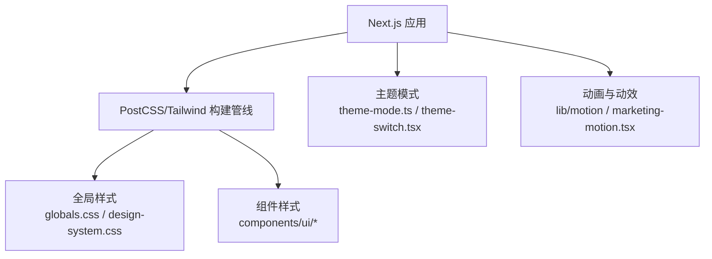

图表来源
- [postcss.config.mjs](file://postcss.config.mjs)
- [next.config.ts](file://next.config.ts)
- [package.json](file://package.json)
- [src/app/globals.css](file://src/app/globals.css)
- [src/app/design-system.css](file://src/app/design-system.css)
- [src/lib/theme-mode.ts](file://src/lib/theme-mode.ts)
- [src/components/marketing/theme-switch.tsx](file://src/components/marketing/theme-switch.tsx)
- [src/lib/motion/index.ts](file://src/lib/motion/index.ts)
- [src/lib/marketing-motion.tsx](file://src/lib/marketing-motion.tsx)

章节来源
- [postcss.config.mjs](file://postcss.config.mjs)
- [next.config.ts](file://next.config.ts)
- [package.json](file://package.json)
- [src/app/globals.css](file://src/app/globals.css)
- [src/app/design-system.css](file://src/app/design-system.css)

## 核心组件
UI 组件层广泛采用 Tailwind 原子类进行样式定义，辅以少量运行时逻辑（如主题切换、状态控制）。典型组件包括：
- 基础控件：button、text-field、search-field、toggle、skeleton、card、dialog、popover、tooltip
- 布局与导航：sidebar、top-bar
- 业务反馈：toast、progress-bar、queue-status-bar
- 媒体与交互：media-viewport、hover-preview
- 领域组件：artifact-chip、project-card、stage-colors（节点颜色系统）

这些组件遵循“样式即代码”的原则，通过 props 控制变体与状态，保持高内聚与低耦合。

章节来源
- [src/components/ui/button.tsx](file://src/components/ui/button.tsx)
- [src/components/ui/dialog.tsx](file://src/components/ui/dialog.tsx)
- [src/components/ui/popover.tsx](file://src/components/ui/popover.tsx)
- [src/components/ui/tooltip.tsx](file://src/components/ui/tooltip.tsx)
- [src/components/ui/skeleton.tsx](file://src/components/ui/skeleton.tsx)
- [src/components/ui/toggle.tsx](file://src/components/ui/toggle.tsx)
- [src/components/ui/card.tsx](file://src/components/ui/card.tsx)
- [src/components/ui/sidebar.tsx](file://src/components/ui/sidebar.tsx)
- [src/components/ui/top-bar.tsx](file://src/components/ui/top-bar.tsx)
- [src/components/ui/progress-bar.tsx](file://src/components/ui/progress-bar.tsx)
- [src/components/ui/toast.tsx](file://src/components/ui/toast.tsx)
- [src/components/ui/search-field.tsx](file://src/components/ui/search-field.tsx)
- [src/components/ui/text-field.tsx](file://src/components/ui/text-field.tsx)
- [src/components/ui/media-viewport.tsx](file://src/components/ui/media-viewport.tsx)
- [src/components/ui/hover-preview.tsx](file://src/components/ui/hover-preview.tsx)
- [src/components/ui/queue-status-bar.tsx](file://src/components/ui/queue-status-bar.tsx)
- [src/components/ui/settings-panel.tsx](file://src/components/ui/settings-panel.tsx)
- [src/components/ui/project-card.tsx](file://src/components/ui/project-card.tsx)
- [src/components/ui/artifact-chip.tsx](file://src/components/ui/artifact-chip.tsx)
- [src/components/ui/node/stage-colors.ts](file://src/components/ui/node/stage-colors.ts)

## 架构总览
样式系统的整体架构围绕“Tailwind 原子化 + 全局主题 + 组件封装”展开：
- 构建层：PostCSS + Tailwind 负责扫描、生成与优化 CSS
- 主题层：全局变量与模式（明/暗）由 globals.css 与运行时主题管理
- 组件层：各 UI 组件通过 Tailwind 类名组合出一致的视觉语言
- 动效层：统一在 lib/motion 与 marketing-motion 中提供动画能力

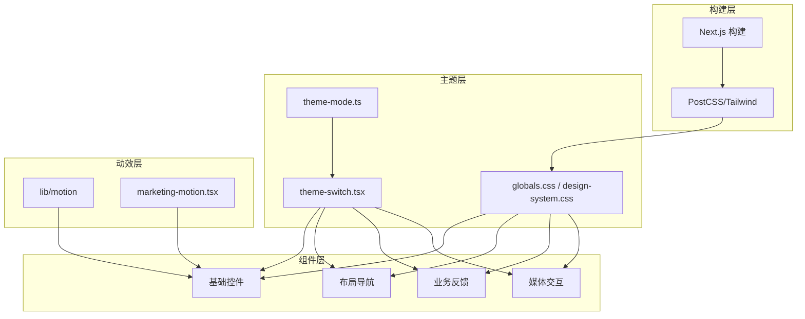

图表来源
- [postcss.config.mjs](file://postcss.config.mjs)
- [next.config.ts](file://next.config.ts)
- [src/app/globals.css](file://src/app/globals.css)
- [src/app/design-system.css](file://src/app/design-system.css)
- [src/lib/theme-mode.ts](file://src/lib/theme-mode.ts)
- [src/components/marketing/theme-switch.tsx](file://src/components/marketing/theme-switch.tsx)
- [src/lib/motion/index.ts](file://src/lib/motion/index.ts)
- [src/lib/marketing-motion.tsx](file://src/lib/marketing-motion.tsx)

## 详细组件分析

### 主题与暗色模式
- 主题模式管理：通过运行时状态切换明/暗主题，并在根元素或容器上设置对应 class
- 主题开关：用户交互触发主题切换，确保持久化与平滑过渡
- 全局样式：在 globals.css 中定义主题变量与默认样式，design-system.css 承载设计令牌与通用规则

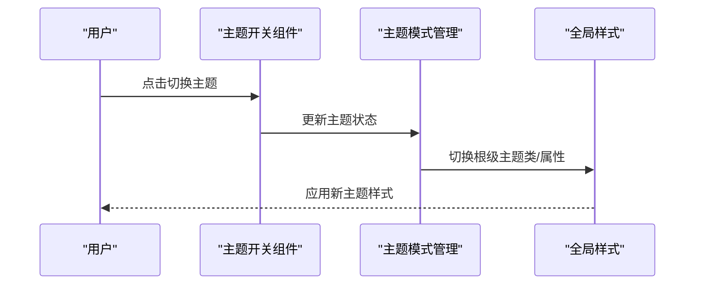

图表来源
- [src/lib/theme-mode.ts](file://src/lib/theme-mode.ts)
- [src/components/marketing/theme-switch.tsx](file://src/components/marketing/theme-switch.tsx)
- [src/app/globals.css](file://src/app/globals.css)
- [src/app/design-system.css](file://src/app/design-system.css)

章节来源
- [src/lib/theme-mode.ts](file://src/lib/theme-mode.ts)
- [src/components/marketing/theme-switch.tsx](file://src/components/marketing/theme-switch.tsx)
- [src/app/globals.css](file://src/app/globals.css)
- [src/app/design-system.css](file://src/app/design-system.css)

### 按钮组件（Button）
- 样式策略：使用 Tailwind 原子类组合，支持多种变体（主/次/危险）、尺寸与禁用态
- 可访问性：语义化标签、焦点样式、键盘导航支持
- 扩展点：通过 props 注入额外类名或样式覆盖

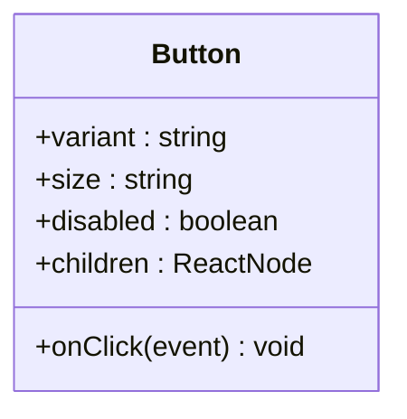

图表来源
- [src/components/ui/button.tsx](file://src/components/ui/button.tsx)

章节来源
- [src/components/ui/button.tsx](file://src/components/ui/button.tsx)

### 对话框（Dialog）
- 样式策略：模态遮罩、层级管理、焦点陷阱
- 响应式：移动端全屏、桌面端居中弹窗
- 可访问性：ARIA 属性、Esc 关闭、Tab 循环

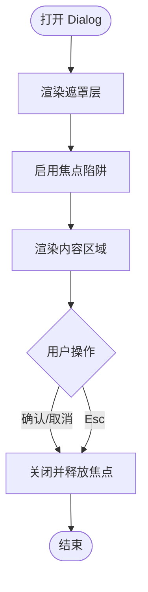

图表来源
- [src/components/ui/dialog.tsx](file://src/components/ui/dialog.tsx)

章节来源
- [src/components/ui/dialog.tsx](file://src/components/ui/dialog.tsx)

### Popover 与 Tooltip
- 样式策略：定位计算、溢出处理、跟随光标或锚点
- 可访问性：aria-describedby、键盘导航、屏幕阅读器提示
- 性能：按需渲染与延迟显示

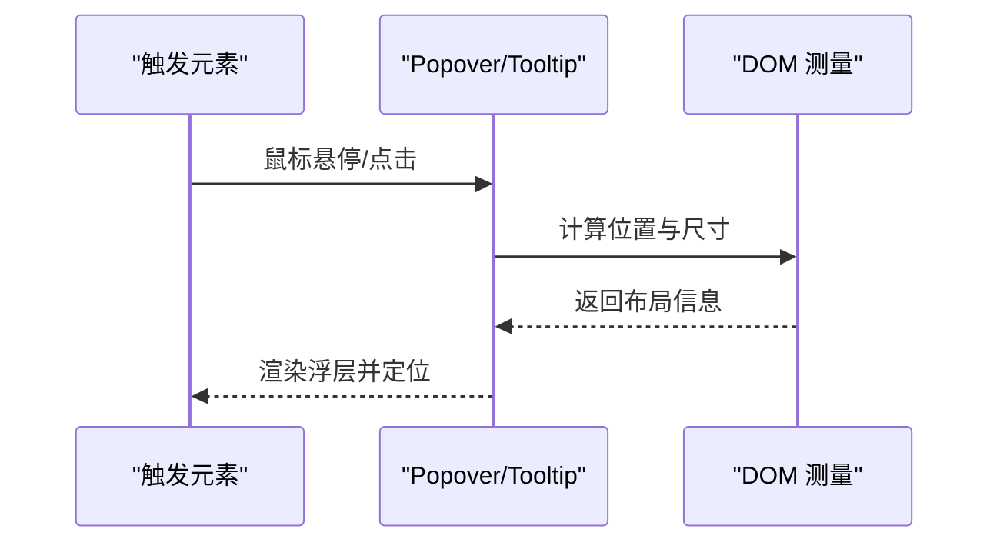

图表来源
- [src/components/ui/popover.tsx](file://src/components/ui/popover.tsx)
- [src/components/ui/tooltip.tsx](file://src/components/ui/tooltip.tsx)

章节来源
- [src/components/ui/popover.tsx](file://src/components/ui/popover.tsx)
- [src/components/ui/tooltip.tsx](file://src/components/ui/tooltip.tsx)

### 骨架屏（Skeleton）
- 样式策略：占位动画、灰阶背景、渐变闪烁
- 场景：列表加载、卡片占位、首屏骨架

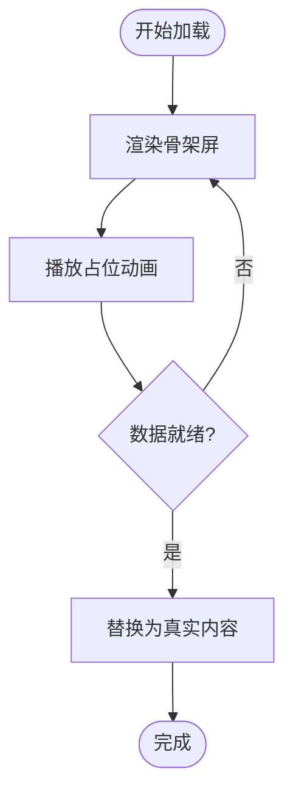

图表来源
- [src/components/ui/skeleton.tsx](file://src/components/ui/skeleton.tsx)

章节来源
- [src/components/ui/skeleton.tsx](file://src/components/ui/skeleton.tsx)

### 进度条与队列状态
- 样式策略：线性进度、百分比展示、颜色语义
- 场景：任务执行、导出进度、队列消费

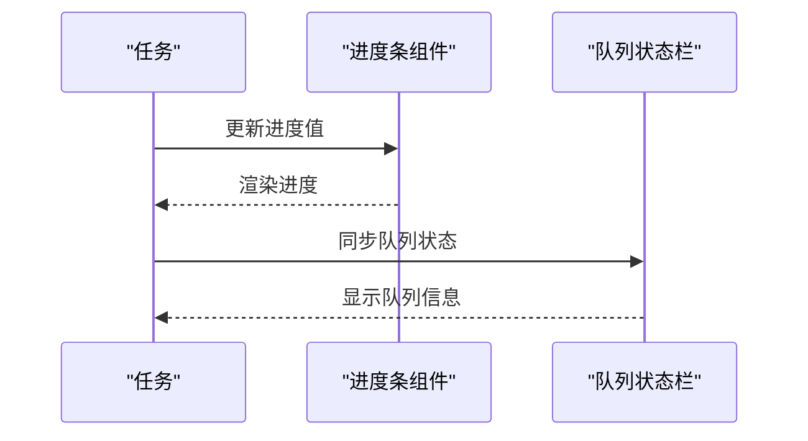

图表来源
- [src/components/ui/progress-bar.tsx](file://src/components/ui/progress-bar.tsx)
- [src/components/ui/queue-status-bar.tsx](file://src/components/ui/queue-status-bar.tsx)

章节来源
- [src/components/ui/progress-bar.tsx](file://src/components/ui/progress-bar.tsx)
- [src/components/ui/queue-status-bar.tsx](file://src/components/ui/queue-status-bar.tsx)

### 搜索与文本输入
- 样式策略：聚焦态、前缀图标、清除按钮、错误提示
- 可访问性：label 关联、错误描述、键盘操作

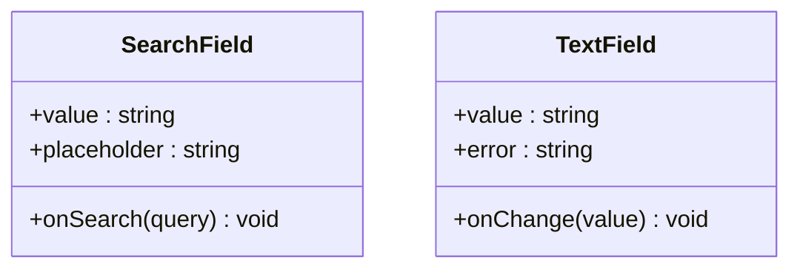

图表来源
- [src/components/ui/search-field.tsx](file://src/components/ui/search-field.tsx)
- [src/components/ui/text-field.tsx](file://src/components/ui/text-field.tsx)

章节来源
- [src/components/ui/search-field.tsx](file://src/components/ui/search-field.tsx)
- [src/components/ui/text-field.tsx](file://src/components/ui/text-field.tsx)

### 媒体视口与悬停预览
- 样式策略：缩放适配、裁剪、懒加载、悬停放大
- 性能：图片优化、占位图、防抖

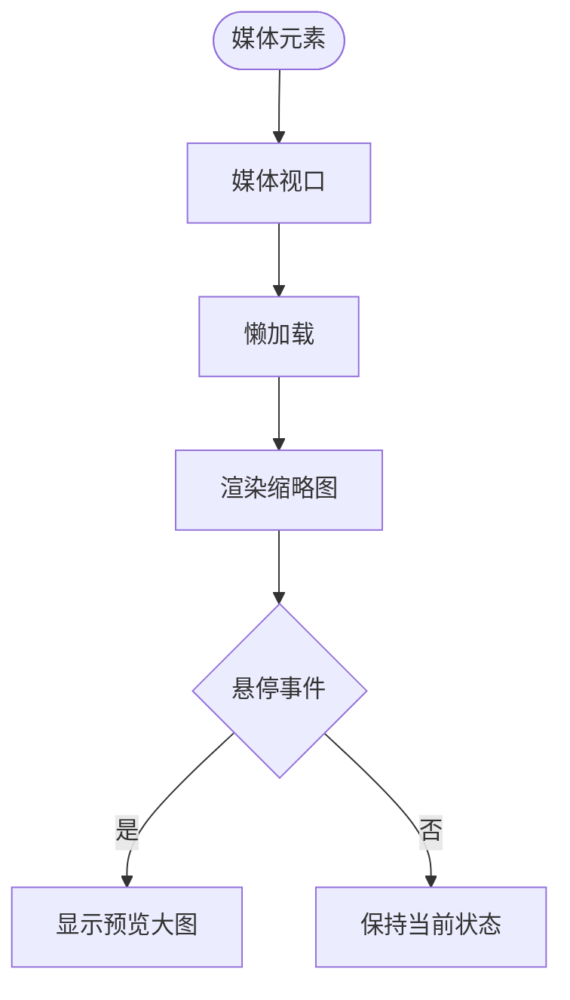

图表来源
- [src/components/ui/media-viewport.tsx](file://src/components/ui/media-viewport.tsx)
- [src/components/ui/hover-preview.tsx](file://src/components/ui/hover-preview.tsx)

章节来源
- [src/components/ui/media-viewport.tsx](file://src/components/ui/media-viewport.tsx)
- [src/components/ui/hover-preview.tsx](file://src/components/ui/hover-preview.tsx)

### 侧边栏与顶部栏
- 样式策略：固定定位、折叠展开、响应式布局
- 可访问性：导航语义、焦点顺序、快捷键

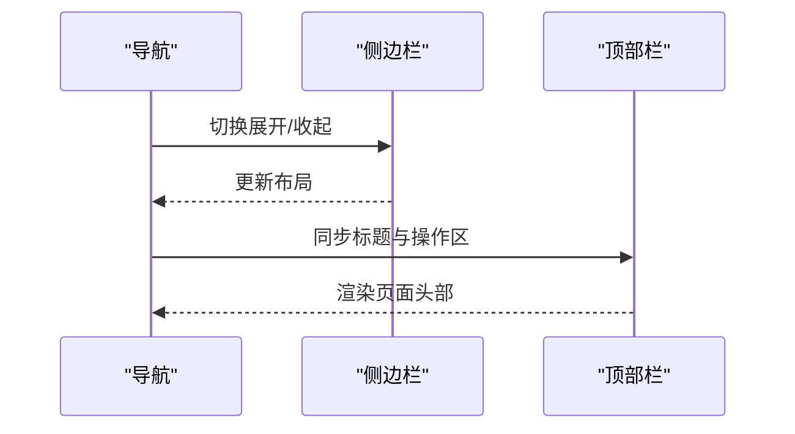

图表来源
- [src/components/ui/sidebar.tsx](file://src/components/ui/sidebar.tsx)
- [src/components/ui/top-bar.tsx](file://src/components/ui/top-bar.tsx)

章节来源
- [src/components/ui/sidebar.tsx](file://src/components/ui/sidebar.tsx)
- [src/components/ui/top-bar.tsx](file://src/components/ui/top-bar.tsx)

### 设置面板与项目卡片
- 样式策略：分组布局、行项对齐、状态指示
- 场景：应用设置、项目概览

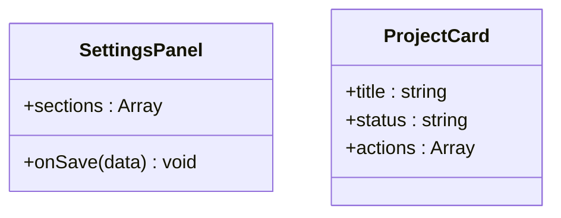

图表来源
- [src/components/ui/settings-panel.tsx](file://src/components/ui/settings-panel.tsx)
- [src/components/ui/project-card.tsx](file://src/components/ui/project-card.tsx)

章节来源
- [src/components/ui/settings-panel.tsx](file://src/components/ui/settings-panel.tsx)
- [src/components/ui/project-card.tsx](file://src/components/ui/project-card.tsx)

### 节点颜色系统（Stage Colors）
- 样式策略：按阶段分配颜色，保证对比度与一致性
- 场景：流程图节点、状态标识

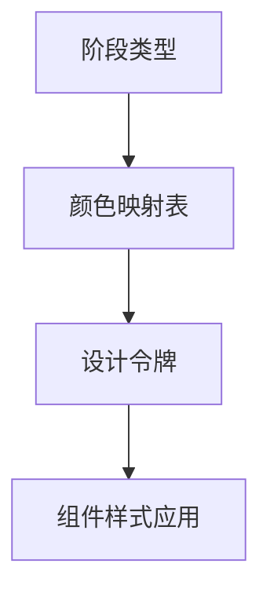

图表来源
- [src/components/ui/node/stage-colors.ts](file://src/components/ui/node/stage-colors.ts)

章节来源
- [src/components/ui/node/stage-colors.ts](file://src/components/ui/node/stage-colors.ts)

### 动画系统与过渡效果
- 统一入口：lib/motion 提供动画钩子与工具函数
- 营销动效：marketing-motion.tsx 封装页面级动效
- 组件集成：在 UI 组件中按需引入，避免全局污染

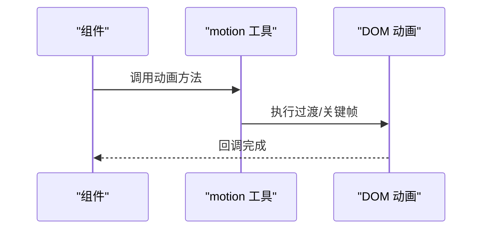

图表来源
- [src/lib/motion/index.ts](file://src/lib/motion/index.ts)
- [src/lib/marketing-motion.tsx](file://src/lib/marketing-motion.tsx)

章节来源
- [src/lib/motion/index.ts](file://src/lib/motion/index.ts)
- [src/lib/marketing-motion.tsx](file://src/lib/marketing-motion.tsx)

## 依赖关系分析
样式系统的依赖关系主要体现在构建管线与模块导入：
- PostCSS/Tailwind 作为构建插件，扫描源码中的类名并生成 CSS
- Next.js 构建流程整合 Tailwind，输出最终样式资源
- 组件通过 props 与 Tailwind 类名组合，减少 CSS 文件体积
- 主题与动效模块被组件按需引用，避免循环依赖

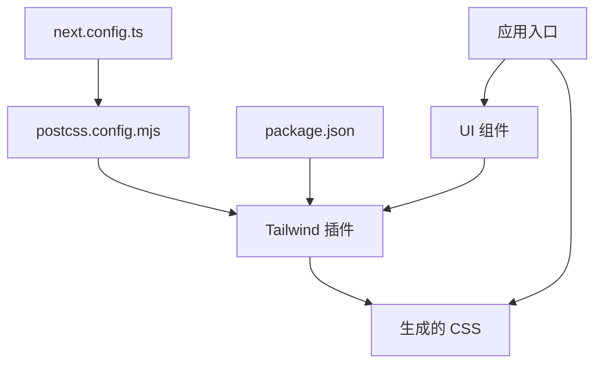

图表来源
- [postcss.config.mjs](file://postcss.config.mjs)
- [next.config.ts](file://next.config.ts)
- [package.json](file://package.json)

章节来源
- [postcss.config.mjs](file://postcss.config.mjs)
- [next.config.ts](file://next.config.ts)
- [package.json](file://package.json)

## 性能考量
- 原子化 CSS：Tailwind 仅生成使用的类名，显著减小包体
- 按需加载：组件样式随组件加载，避免全局样式膨胀
- 主题切换：通过 class 切换而非重新渲染整页，提升体验
- 动画优化：合理使用 requestAnimationFrame 与 GPU 加速属性
- 图片与媒体：懒加载、占位图、WebP/AVIF 格式优化
- 构建优化：Tree Shaking、CSS 压缩、缓存策略

[本节为通用指导，不直接分析具体文件]

## 故障排查指南
- 主题未生效：检查根级主题类是否正确设置，确认 globals.css 变量是否加载
- 样式冲突：审查 Tailwind 优先级与自定义样式覆盖，必要时使用更具体的选择器
- 动画卡顿：检查是否触发布局抖动，优先使用 transform/opacity 属性
- 可访问性问题：验证 ARIA 属性、焦点顺序、键盘导航是否符合规范
- 构建失败：确认 postcss.config.mjs 与 package.json 依赖版本一致

章节来源
- [src/app/globals.css](file://src/app/globals.css)
- [src/app/design-system.css](file://src/app/design-system.css)
- [postcss.config.mjs](file://postcss.config.mjs)
- [package.json](file://package.json)

## 结论
本项目采用 Tailwind 原子化 CSS 为核心，结合全局主题管理与组件化样式封装，形成了清晰、高效且易维护的样式系统。通过统一的 UI 组件库与动画工具，确保了跨页面的一致性与良好的用户体验。未来可进一步探索 CSS-in-JS 方案（如 styled-components）在复杂交互场景下的价值，同时持续优化构建与运行时性能。

[本节为总结，不直接分析具体文件]

## 附录
- 开发工具链建议：
  - 样式调试：浏览器开发者工具、Tailwind 插件、CSS 覆盖率
  - 自动化测试：组件快照测试、视觉回归测试（如 Percy、Chromatic）
  - 构建优化：Webpack/Vite 插件、CSS 压缩、CDN 缓存
- 最佳实践：
  - 组件样式优先使用 Tailwind 类名，避免内联样式滥用
  - 主题变量集中管理，确保明/暗模式一致性
  - 动画与过渡统一封装，便于复用与维护

[本节为补充说明，不直接分析具体文件]