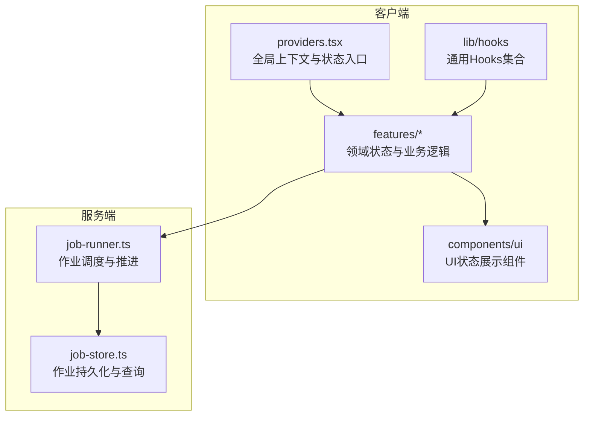
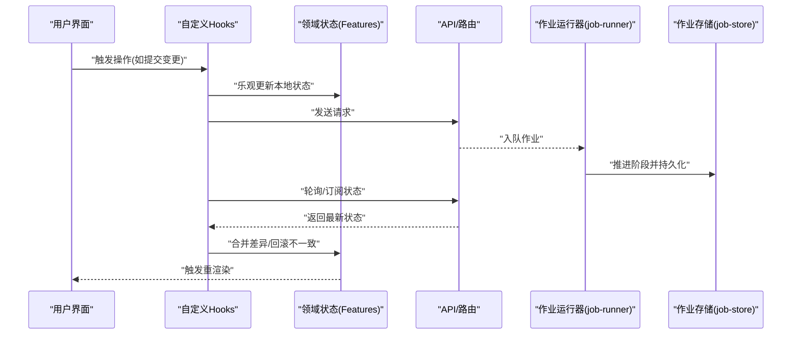
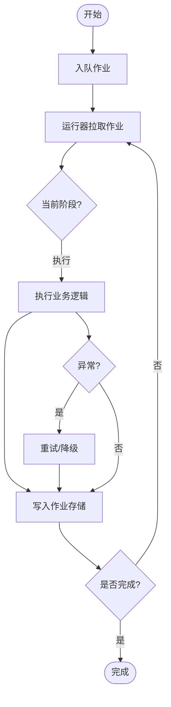
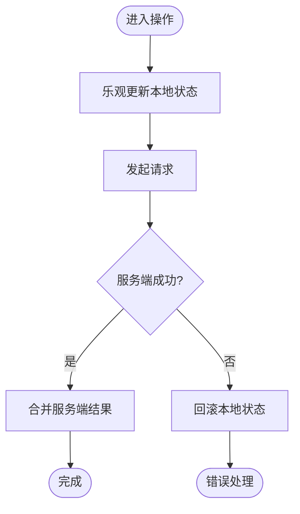
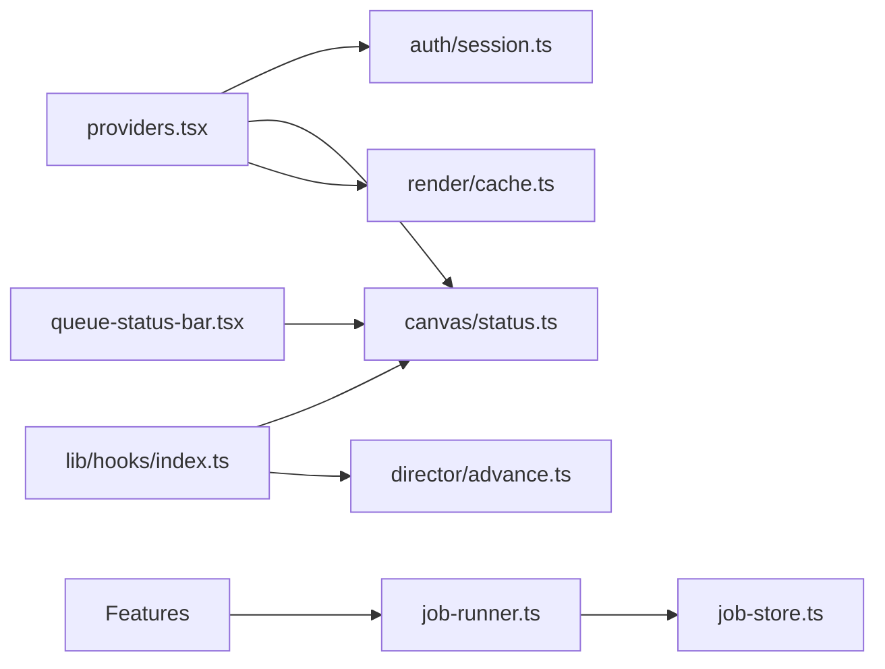

# 状态管理

<cite>
**本文引用的文件**   
- [src/app/providers.tsx](file://src/app/providers.tsx)
- [src/lib/hooks/index.ts](file://src/lib/hooks/index.ts)
- [src/features/canvas/status.ts](file://src/features/canvas/status.ts)
- [src/features/director/advance.ts](file://src/features/director/advance.ts)
- [src/features/render/cache.ts](file://src/features/render/cache.ts)
- [src/features/auth/session.ts](file://src/features/auth/session.ts)
- [src/app/(auth)/_components/use-verification-code.ts](file://src/app/(auth)/_components/use-verification-code.ts)
- [src/components/ui/queue-status-bar.tsx](file://src/components/ui/queue-status-bar.tsx)
- [src/app/products/(app)/canvas/[projectId]/live-status.test.ts](file://src/app/products/(app)/canvas/[projectId]/live-status.test.ts)
- [server/src/server/job-runner.ts](file://server/src/server/job-runner.ts)
- [server/src/server/job-store.ts](file://server/src/server/job-store.ts)
</cite>

## 目录
1. [简介](#简介)
2. [项目结构](#项目结构)
3. [核心组件](#核心组件)
4. [架构总览](#架构总览)
5. [详细组件分析](#详细组件分析)
6. [依赖关系分析](#依赖关系分析)
7. [性能考虑](#性能考虑)
8. [故障排查指南](#故障排查指南)
9. [结论](#结论)
10. [附录](#附录)

## 简介
本文件面向 PurpleInk 项目的状态管理，覆盖客户端状态、服务器状态与实时状态的统一策略；阐述 React Hooks 的使用模式与自定义 Hooks 设计原则；说明状态同步机制（乐观更新、冲突解决、一致性保证）；给出缓存、持久化与性能优化要点；并提供调试工具、错误处理与单元测试实践。文档同时包含复杂状态场景的解决方案与代码示例路径，帮助读者快速定位实现细节。

## 项目结构
本项目采用“功能域 + 共享库”的组织方式：
- 客户端应用位于 src/app 与 src/components，使用 Next.js App Router 与 React Hooks 组织 UI 与交互状态。
- 领域能力集中在 src/features，按业务域划分（如 canvas、director、render、auth 等），每个域内封装状态、数据访问与副作用逻辑。
- 通用能力在 src/lib，包括 hooks、存储、流式处理、队列等。
- 服务端位于 server/src，提供作业运行器与作业存储，支撑渲染、导出等异步任务的状态管理与推进。

图表来源
- [src/app/providers.tsx](file://src/app/providers.tsx)
- [src/lib/hooks/index.ts](file://src/lib/hooks/index.ts)
- [src/features/canvas/status.ts](file://src/features/canvas/status.ts)
- [src/features/director/advance.ts](file://src/features/director/advance.ts)
- [src/features/render/cache.ts](file://src/features/render/cache.ts)
- [src/components/ui/queue-status-bar.tsx](file://src/components/ui/queue-status-bar.tsx)
- [server/src/server/job-runner.ts](file://server/src/server/job-runner.ts)
- [server/src/server/job-store.ts](file://server/src/server/job-store.ts)

章节来源
- [src/app/providers.tsx](file://src/app/providers.tsx)
- [src/lib/hooks/index.ts](file://src/lib/hooks/index.ts)

## 核心组件
- 全局状态入口与提供者：通过 providers 集中挂载认证会话、主题、导航等上下文，确保跨页面状态一致。
- 领域状态模块：以 features 为边界，封装各自的状态模型、变更方法与副作用（如 canvas 的工作流状态、director 的阶段推进、render 的缓存与结果）。
- 通用 Hooks：在 lib/hooks 中沉淀可复用的状态订阅、请求生命周期、本地存储桥接等模式。
- UI 状态组件：将领域状态映射到 UI 层，负责展示与用户交互，保持无副作用或最小副作用。

章节来源
- [src/app/providers.tsx](file://src/app/providers.tsx)
- [src/lib/hooks/index.ts](file://src/lib/hooks/index.ts)
- [src/features/canvas/status.ts](file://src/features/canvas/status.ts)
- [src/features/director/advance.ts](file://src/features/director/advance.ts)
- [src/features/render/cache.ts](file://src/features/render/cache.ts)
- [src/components/ui/queue-status-bar.tsx](file://src/components/ui/queue-status-bar.tsx)

## 架构总览
整体状态流遵循“客户端驱动 + 服务端推进”的双端协作模式：
- 客户端发起操作（如创建任务、提交变更），立即进行乐观更新以提升响应性。
- 服务端接收请求后进入作业队列，由 job-runner 推进阶段并写入 job-store。
- 客户端通过轮询或事件通道获取最新状态，合并差异并回滚不一致的乐观更新。
- 渲染与导出等耗时操作通过缓存与增量更新降低重复计算成本。

图表来源
- [src/lib/hooks/index.ts](file://src/lib/hooks/index.ts)
- [src/features/canvas/status.ts](file://src/features/canvas/status.ts)
- [src/features/director/advance.ts](file://src/features/director/advance.ts)
- [server/src/server/job-runner.ts](file://server/src/server/job-runner.ts)
- [server/src/server/job-store.ts](file://server/src/server/job-store.ts)

## 详细组件分析

### 客户端状态与React Hooks模式
- 状态分层：UI 层仅持有展示态，领域层持有业务态，持久层负责本地存储与网络同步。
- 自定义 Hooks 设计原则：
  - 单一职责：一个 Hook 只负责一种关注点（如请求生命周期、本地存储桥接、状态订阅）。
  - 幂等与可组合：Hook 内部状态变更应幂等，便于组合复用。
  - 副作用隔离：尽量将副作用放在 Hook 内部，对外暴露纯函数式接口。
  - 错误与加载态：统一封装 loading/error/success 三态，避免分散判断。
- 最佳实践：
  - 使用不可变更新，减少不必要的重渲染。
  - 对昂贵计算使用记忆化（如 useMemo/useCallback）。
  - 将网络请求与重试、取消逻辑封装在 Hook 中，避免组件内散落。

章节来源
- [src/lib/hooks/index.ts](file://src/lib/hooks/index.ts)
- [src/app/(auth)/_components/use-verification-code.ts](file://src/app/(auth)/_components/use-verification-code.ts)

### 服务器状态与作业推进
- 作业模型：每个长任务抽象为作业，包含阶段、进度、错误信息、产物引用等。
- 推进流程：job-runner 读取待执行作业，按阶段执行并更新 job-store；失败时支持重试与恢复。
- 一致性保证：作业状态变更需原子写入，客户端合并时需基于版本或时间戳比较。

图表来源
- [server/src/server/job-runner.ts](file://server/src/server/job-runner.ts)
- [server/src/server/job-store.ts](file://server/src/server/job-store.ts)
- [src/features/director/advance.ts](file://src/features/director/advance.ts)

章节来源
- [server/src/server/job-runner.ts](file://server/src/server/job-runner.ts)
- [server/src/server/job-store.ts](file://server/src/server/job-store.ts)
- [src/features/director/advance.ts](file://src/features/director/advance.ts)

### 实时状态与流式更新
- 实时状态来源：作业进度、渲染帧、TTS 播放状态等。
- 更新策略：优先使用事件推送（如 SSE/WebSocket），若不可用则退化为短轮询。
- 合并策略：客户端维护本地快照与增量补丁，冲突时以服务端为准进行回滚或补偿。

章节来源
- [src/app/products/(app)/canvas/[projectId]/live-status.test.ts](file://src/app/products/(app)/canvas/[projectId]/live-status.test.ts)
- [src/components/ui/queue-status-bar.tsx](file://src/components/ui/queue-status-bar.tsx)

### 状态同步机制：乐观更新、冲突解决与一致性
- 乐观更新：用户操作后立即更新本地状态，提升交互体验。
- 冲突解决：当服务端返回不一致时，依据版本号/时间戳进行差异合并，必要时回滚。
- 一致性保证：关键路径使用事务或幂等键，避免重复提交导致的状态漂移。

图表来源
- [src/lib/hooks/index.ts](file://src/lib/hooks/index.ts)
- [src/features/canvas/status.ts](file://src/features/canvas/status.ts)

章节来源
- [src/lib/hooks/index.ts](file://src/lib/hooks/index.ts)
- [src/features/canvas/status.ts](file://src/features/canvas/status.ts)

### 缓存策略与状态持久化
- 缓存层级：内存缓存（短期）、IndexedDB/LocalStorage（中长期）、服务端缓存（CDN/对象存储）。
- 失效策略：基于版本哈希、时间戳或显式失效键；对热点数据设置 TTL。
- 持久化：用户偏好、草稿等落盘，启动时懒加载并合并差异。

章节来源
- [src/features/render/cache.ts](file://src/features/render/cache.ts)

### 认证与会话状态
- 会话模型：登录态、权限、过期时间、刷新令牌。
- 安全策略：敏感信息不存前端明文，使用 HttpOnly Cookie 或加密存储。
- 自动续期：在即将过期前静默刷新，避免中断用户体验。

章节来源
- [src/features/auth/session.ts](file://src/features/auth/session.ts)

### 复杂状态场景与示例
- 多步骤工作流：使用有限状态机描述阶段转换，避免分支爆炸。
- 并发编辑：引入操作日志与合并策略（如 OT/CRDT）处理冲突。
- 批量任务：队列化任务，限制并发度，支持暂停/恢复。

章节来源
- [src/features/canvas/status.ts](file://src/features/canvas/status.ts)
- [src/features/director/advance.ts](file://src/features/director/advance.ts)

## 依赖关系分析
- 低耦合高内聚：各 features 独立管理自身状态，通过 lib/hooks 与 API 层解耦。
- 外部依赖：Next.js 路由、数据库驱动、第三方服务（如 TTS、AI 提供商）。
- 潜在循环依赖：避免在 hooks 中直接导入组件，应在组件层组合。

图表来源
- [src/app/providers.tsx](file://src/app/providers.tsx)
- [src/lib/hooks/index.ts](file://src/lib/hooks/index.ts)
- [src/features/canvas/status.ts](file://src/features/canvas/status.ts)
- [src/features/director/advance.ts](file://src/features/director/advance.ts)
- [src/features/render/cache.ts](file://src/features/render/cache.ts)
- [src/components/ui/queue-status-bar.tsx](file://src/components/ui/queue-status-bar.tsx)
- [server/src/server/job-runner.ts](file://server/src/server/job-runner.ts)
- [server/src/server/job-store.ts](file://server/src/server/job-store.ts)

章节来源
- [src/app/providers.tsx](file://src/app/providers.tsx)
- [src/lib/hooks/index.ts](file://src/lib/hooks/index.ts)
- [src/features/canvas/status.ts](file://src/features/canvas/status.ts)
- [src/features/director/advance.ts](file://src/features/director/advance.ts)
- [src/features/render/cache.ts](file://src/features/render/cache.ts)
- [src/components/ui/queue-status-bar.tsx](file://src/components/ui/queue-status-bar.tsx)
- [server/src/server/job-runner.ts](file://server/src/server/job-runner.ts)
- [server/src/server/job-store.ts](file://server/src/server/job-store.ts)

## 性能考虑
- 渲染优化：拆分组件、使用 memo 与 lazy 加载，避免大对象频繁重建。
- 状态粒度：细粒度状态切片，减少无关重渲染。
- 网络优化：请求去重、分页与增量更新，合理设置缓存头。
- 计算优化：惰性求值、Web Worker 处理重型计算。

## 故障排查指南
- 常见问题：
  - 状态不同步：检查乐观更新回滚逻辑与服务端返回的一致性。
  - 作业卡住：查看 job-store 中的阶段与错误信息，确认重试策略。
  - 缓存污染：核对缓存键与失效策略，清理脏数据。
- 调试工具：
  - 浏览器 DevTools 的 Network/Performance/Storage 面板。
  - 自定义 Hook 的日志输出与断点。
  - 服务端日志与作业追踪 ID。

章节来源
- [server/src/server/job-runner.ts](file://server/src/server/job-runner.ts)
- [server/src/server/job-store.ts](file://server/src/server/job-store.ts)
- [src/lib/hooks/index.ts](file://src/lib/hooks/index.ts)

## 结论
本项目通过清晰的层次划分与领域边界，结合 React Hooks 的最佳实践，实现了稳定高效的状态管理。客户端乐观更新与服务端作业推进协同，配合缓存与持久化策略，保障了用户体验与数据一致性。未来可进一步引入更完善的冲突解决机制与可视化调试工具，提升复杂场景下的可观测性与可维护性。

## 附录
- 术语表：
  - 乐观更新：先更新本地状态再等待服务端确认的策略。
  - 作业：表示一个可分阶段的异步任务。
  - 缓存键：用于标识缓存条目的唯一键。
- 参考实现路径：
  - 自定义 Hooks 示例：[use-verification-code.ts](file://src/app/(auth)/_components/use-verification-code.ts)
  - 队列状态展示：[queue-status-bar.tsx](file://src/components/ui/queue-status-bar.tsx)
  - 实时状态测试：[live-status.test.ts](file://src/app/products/(app)/canvas/[projectId]/live-status.test.ts)