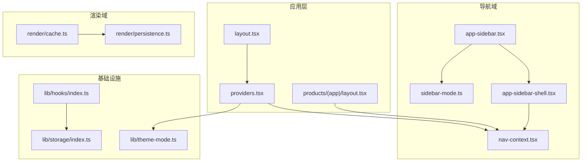
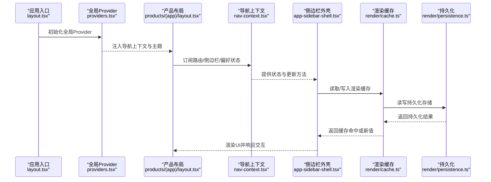
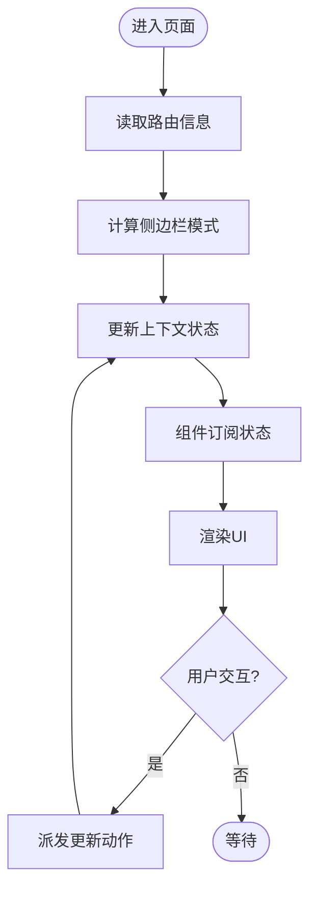
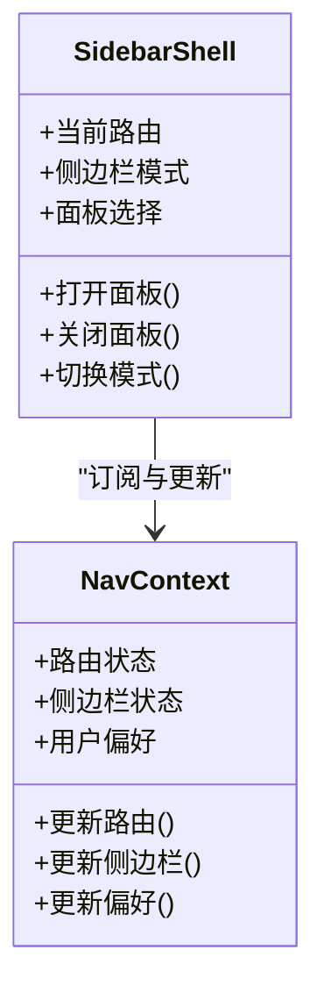
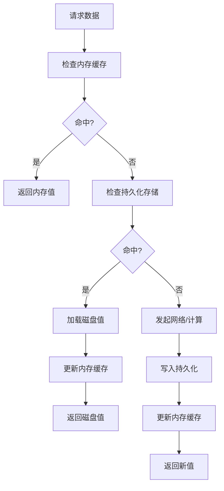
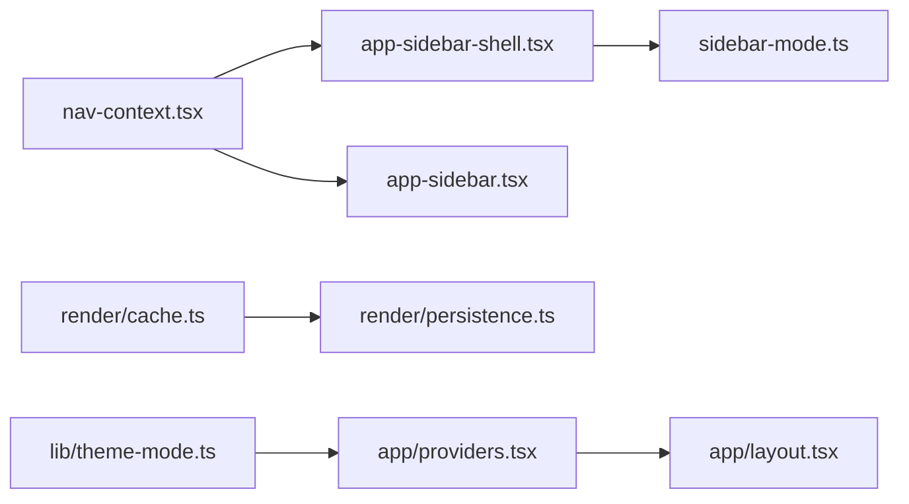

# 状态管理

<cite>
**本文引用的文件**   
- [src/features/navigation/nav-context.tsx](file://src/features/navigation/nav-context.tsx)
- [src/features/navigation/app-sidebar-shell.tsx](file://src/features/navigation/app-sidebar-shell.tsx)
- [src/features/navigation/app-sidebar.tsx](file://src/features/navigation/app-sidebar.tsx)
- [src/features/navigation/sidebar-mode.ts](file://src/features/navigation/sidebar-mode.ts)
- [src/lib/hooks/index.ts](file://src/lib/hooks/index.ts)
- [src/lib/storage/index.ts](file://src/lib/storage/index.ts)
- [src/app/providers.tsx](file://src/app/providers.tsx)
- [src/app/layout.tsx](file://src/app/layout.tsx)
- [src/features/render/cache.ts](file://src/features/render/cache.ts)
- [src/features/render/persistence.ts](file://src/features/render/persistence.ts)
- [src/lib/theme-mode.ts](file://src/lib/theme-mode.ts)
- [src/app/products/(app)/layout.tsx](file://src/app/products/(app)/layout.tsx)
</cite>

## 目录
1. [简介](#简介)
2. [项目结构](#项目结构)
3. [核心组件](#核心组件)
4. [架构总览](#架构总览)
5. [详细组件分析](#详细组件分析)
6. [依赖分析](#依赖分析)
7. [性能考虑](#性能考虑)
8. [故障排查指南](#故障排查指南)
9. [结论](#结论)
10. [附录](#附录)

## 简介
本文件系统性梳理 PurpleInk 前端的状态管理方案，重点覆盖：
- React Hooks 使用模式与自定义 Hook 设计
- 导航上下文（路由、侧边栏、用户偏好）的状态管理与提升策略
- 服务端状态与客户端状态的同步机制
- 状态持久化、缓存策略与性能优化
- 最佳实践、调试技巧与常见问题解决方案

目标是帮助开发者快速理解并高效扩展 PurpleInk 的状态体系。

## 项目结构
PurpleInk 采用“按功能域组织”的目录结构，状态相关代码主要分布在 features 与 lib 两个层次：
- features/navigation：导航上下文、侧边栏、路由模式等
- features/render：渲染相关的缓存与持久化
- lib/hooks：通用 Hook 集合
- lib/storage：存储抽象（本地/会话/内存）
- app/providers 与 app/layout：应用级 Provider 与根布局，负责全局状态装配

图表来源
- [src/app/providers.tsx](file://src/app/providers.tsx)
- [src/app/layout.tsx](file://src/app/layout.tsx)
- [src/app/products/(app)/layout.tsx](file://src/app/products/(app)/layout.tsx)
- [src/features/navigation/nav-context.tsx](file://src/features/navigation/nav-context.tsx)
- [src/features/navigation/app-sidebar-shell.tsx](file://src/features/navigation/app-sidebar-shell.tsx)
- [src/features/navigation/app-sidebar.tsx](file://src/features/navigation/app-sidebar.tsx)
- [src/features/navigation/sidebar-mode.ts](file://src/features/navigation/sidebar-mode.ts)
- [src/features/render/cache.ts](file://src/features/render/cache.ts)
- [src/features/render/persistence.ts](file://src/features/render/persistence.ts)
- [src/lib/hooks/index.ts](file://src/lib/hooks/index.ts)
- [src/lib/storage/index.ts](file://src/lib/storage/index.ts)
- [src/lib/theme-mode.ts](file://src/lib/theme-mode.ts)

章节来源
- [src/app/providers.tsx](file://src/app/providers.tsx)
- [src/app/layout.tsx](file://src/app/layout.tsx)
- [src/app/products/(app)/layout.tsx](file://src/app/products/(app)/layout.tsx)
- [src/features/navigation/nav-context.tsx](file://src/features/navigation/nav-context.tsx)
- [src/features/navigation/app-sidebar-shell.tsx](file://src/features/navigation/app-sidebar-shell.tsx)
- [src/features/navigation/app-sidebar.tsx](file://src/features/navigation/app-sidebar.tsx)
- [src/features/navigation/sidebar-mode.ts](file://src/features/navigation/sidebar-mode.ts)
- [src/features/render/cache.ts](file://src/features/render/cache.ts)
- [src/features/render/persistence.ts](file://src/features/render/persistence.ts)
- [src/lib/hooks/index.ts](file://src/lib/hooks/index.ts)
- [src/lib/storage/index.ts](file://src/lib/storage/index.ts)
- [src/lib/theme-mode.ts](file://src/lib/theme-mode.ts)

## 核心组件
- 导航上下文（NavContext）
  - 职责：集中管理路由状态、侧边栏展开/收起、面板切换、用户偏好（如主题）等跨页面共享状态
  - 模式：React Context + useReducer/useMemo 组合，提供稳定的状态与更新函数
- 侧边栏外壳（Sidebar Shell）
  - 职责：根据当前路由与用户交互决定侧边栏显示模式与内容区域
  - 模式：基于导航上下文派生 UI 行为，避免在子组件中重复计算
- 渲染缓存与持久化
  - 职责：对渲染产物进行缓存与持久化，减少重复计算与网络请求
  - 模式：内存缓存 + 持久化存储（localStorage/sessionStorage），结合失效策略

章节来源
- [src/features/navigation/nav-context.tsx](file://src/features/navigation/nav-context.tsx)
- [src/features/navigation/app-sidebar-shell.tsx](file://src/features/navigation/app-sidebar-shell.tsx)
- [src/features/navigation/app-sidebar.tsx](file://src/features/navigation/app-sidebar.tsx)
- [src/features/navigation/sidebar-mode.ts](file://src/features/navigation/sidebar-mode.ts)
- [src/features/render/cache.ts](file://src/features/render/cache.ts)
- [src/features/render/persistence.ts](file://src/features/render/persistence.ts)

## 架构总览
下图展示了从应用入口到导航上下文、再到侧边栏与渲染缓存的整体数据流与控制流。

图表来源
- [src/app/layout.tsx](file://src/app/layout.tsx)
- [src/app/providers.tsx](file://src/app/providers.tsx)
- [src/app/products/(app)/layout.tsx](file://src/app/products/(app)/layout.tsx)
- [src/features/navigation/nav-context.tsx](file://src/features/navigation/nav-context.tsx)
- [src/features/navigation/app-sidebar-shell.tsx](file://src/features/navigation/app-sidebar-shell.tsx)
- [src/features/render/cache.ts](file://src/features/render/cache.ts)
- [src/features/render/persistence.ts](file://src/features/render/persistence.ts)

## 详细组件分析

### 导航上下文（NavContext）
- 设计要点
  - 将路由状态、侧边栏状态、用户偏好统一纳入一个上下文，避免分散状态导致的不一致
  - 通过自定义 Hook 暴露稳定接口，组件仅消费必要字段，降低重渲染
  - 使用状态提升策略，将高频更新的局部状态提升到上下文，保证跨组件一致性
- 关键能力
  - 路由状态：当前路径、查询参数、历史栈（由 Next.js 路由驱动）
  - 侧边栏状态：展开/收起、模式（默认/全屏/抽屉）、面板选择
  - 用户偏好：主题、语言、面板尺寸等
- 典型调用流程

图表来源
- [src/features/navigation/nav-context.tsx](file://src/features/navigation/nav-context.tsx)
- [src/features/navigation/app-sidebar-shell.tsx](file://src/features/navigation/app-sidebar-shell.tsx)
- [src/features/navigation/sidebar-mode.ts](file://src/features/navigation/sidebar-mode.ts)

章节来源
- [src/features/navigation/nav-context.tsx](file://src/features/navigation/nav-context.tsx)
- [src/features/navigation/app-sidebar-shell.tsx](file://src/features/navigation/app-sidebar-shell.tsx)
- [src/features/navigation/sidebar-mode.ts](file://src/features/navigation/sidebar-mode.ts)

### 侧边栏外壳（Sidebar Shell）
- 职责
  - 根据当前路由与上下文状态决定侧边栏展示模式与内容区域
  - 处理用户交互（点击、拖拽）并触发上下文更新
- 实现要点
  - 使用导航上下文提供的状态与更新方法，避免内部维护冗余状态
  - 对复杂布局逻辑进行封装，保持子组件简洁
  - 与路由守卫配合，确保在不同页面下侧边栏行为一致

图表来源
- [src/features/navigation/app-sidebar-shell.tsx](file://src/features/navigation/app-sidebar-shell.tsx)
- [src/features/navigation/nav-context.tsx](file://src/features/navigation/nav-context.tsx)

章节来源
- [src/features/navigation/app-sidebar-shell.tsx](file://src/features/navigation/app-sidebar-shell.tsx)
- [src/features/navigation/nav-context.tsx](file://src/features/navigation/nav-context.tsx)

### 渲染缓存与持久化
- 缓存策略
  - 内存缓存：短期高频访问的数据，减少重复计算
  - 持久化存储：长期保存用户配置与中间结果，支持离线与快速恢复
- 失效与更新
  - 基于键值与时间戳的失效策略，避免脏读
  - 写操作先落盘再更新内存，保证一致性
- 与导航上下文的协作
  - 侧边栏与面板切换时，按需加载/释放缓存，控制内存占用

图表来源
- [src/features/render/cache.ts](file://src/features/render/cache.ts)
- [src/features/render/persistence.ts](file://src/features/render/persistence.ts)

章节来源
- [src/features/render/cache.ts](file://src/features/render/cache.ts)
- [src/features/render/persistence.ts](file://src/features/render/persistence.ts)

### 主题与用户偏好
- 主题模式
  - 通过独立模块管理主题状态，并与导航上下文解耦
  - 支持系统主题跟随与手动切换，状态持久化到本地存储
- 偏好设置
  - 将用户偏好（如面板尺寸、语言）纳入上下文统一管理
  - 提供默认值与回退策略，确保首次体验流畅

章节来源
- [src/lib/theme-mode.ts](file://src/lib/theme-mode.ts)
- [src/features/navigation/nav-context.tsx](file://src/features/navigation/nav-context.tsx)

## 依赖分析
- 组件耦合
  - 导航上下文为多个页面与组件提供共享状态，形成中心化的依赖关系
  - 侧边栏外壳依赖导航上下文，但不直接依赖具体路由实现
- 外部依赖
  - Next.js 路由与页面生命周期
  - 浏览器存储 API（localStorage/sessionStorage）
- 潜在循环依赖
  - 通过分层与接口隔离避免循环引用
  - 将业务逻辑与 UI 逻辑分离，降低耦合度

图表来源
- [src/features/navigation/nav-context.tsx](file://src/features/navigation/nav-context.tsx)
- [src/features/navigation/app-sidebar-shell.tsx](file://src/features/navigation/app-sidebar-shell.tsx)
- [src/features/navigation/app-sidebar.tsx](file://src/features/navigation/app-sidebar.tsx)
- [src/features/navigation/sidebar-mode.ts](file://src/features/navigation/sidebar-mode.ts)
- [src/features/render/cache.ts](file://src/features/render/cache.ts)
- [src/features/render/persistence.ts](file://src/features/render/persistence.ts)
- [src/lib/theme-mode.ts](file://src/lib/theme-mode.ts)
- [src/app/providers.tsx](file://src/app/providers.tsx)
- [src/app/layout.tsx](file://src/app/layout.tsx)

章节来源
- [src/features/navigation/nav-context.tsx](file://src/features/navigation/nav-context.tsx)
- [src/features/navigation/app-sidebar-shell.tsx](file://src/features/navigation/app-sidebar-shell.tsx)
- [src/features/navigation/app-sidebar.tsx](file://src/features/navigation/app-sidebar.tsx)
- [src/features/navigation/sidebar-mode.ts](file://src/features/navigation/sidebar-mode.ts)
- [src/features/render/cache.ts](file://src/features/render/cache.ts)
- [src/features/render/persistence.ts](file://src/features/render/persistence.ts)
- [src/lib/theme-mode.ts](file://src/lib/theme-mode.ts)
- [src/app/providers.tsx](file://src/app/providers.tsx)
- [src/app/layout.tsx](file://src/app/layout.tsx)

## 性能考虑
- 状态粒度
  - 将高频更新的状态拆分为独立字段，避免整棵组件树重渲染
  - 使用 useMemo/useCallback 稳定引用，减少不必要的依赖变化
- 缓存与持久化
  - 合理设置缓存过期时间与容量上限，防止内存泄漏
  - 批量写入持久化存储，减少 I/O 次数
- 渲染优化
  - 仅在必要时重新计算侧边栏模式与面板内容
  - 使用虚拟滚动与懒加载处理大数据集

[本节为通用指导，不直接分析具体文件]

## 故障排查指南
- 常见问题
  - 侧边栏状态不同步：检查上下文是否被多次实例化，确保单例 Provider
  - 缓存未命中：确认缓存键生成规则与失效策略是否一致
  - 主题切换无效：验证本地存储读写权限与默认值回退逻辑
- 调试技巧
  - 在导航上下文中添加日志输出，追踪状态变更链路
  - 使用浏览器开发者工具监控 localStorage/sessionStorage 的变化
  - 对缓存层增加命中率统计，定位热点数据

章节来源
- [src/features/navigation/nav-context.tsx](file://src/features/navigation/nav-context.tsx)
- [src/features/render/cache.ts](file://src/features/render/cache.ts)
- [src/features/render/persistence.ts](file://src/features/render/persistence.ts)
- [src/lib/theme-mode.ts](file://src/lib/theme-mode.ts)

## 结论
PurpleInk 的状态管理以导航上下文为核心，结合渲染缓存与持久化机制，实现了清晰、可维护且高性能的前端状态体系。通过合理的 Hook 设计与状态提升策略，确保了跨组件状态的一致性与可预测性。建议在实际开发中遵循本文的最佳实践，持续优化状态粒度与缓存策略，以提升用户体验与开发效率。

[本节为总结性内容，不直接分析具体文件]

## 附录
- 最佳实践清单
  - 将共享状态集中在上下文，避免分散管理
  - 使用自定义 Hook 封装复杂逻辑，提高复用性
  - 对缓存与持久化设置明确的失效策略
  - 通过单元测试验证状态变更的正确性
- 调试工具推荐
  - React DevTools：检查组件状态与重渲染
  - 浏览器存储面板：查看本地存储内容
  - 网络面板：监控与服务端的状态同步

[本节为补充信息，不直接分析具体文件]