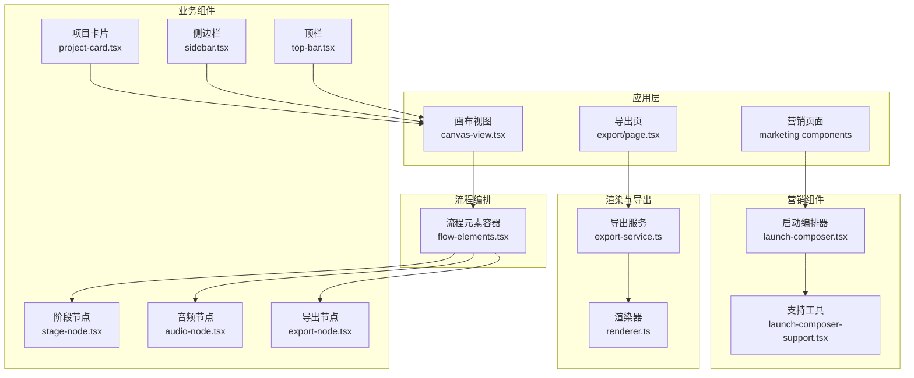
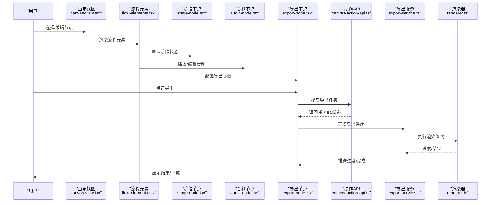
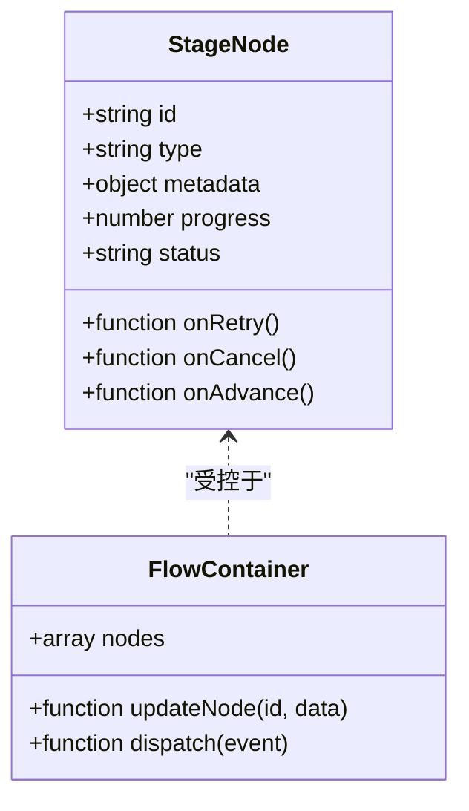
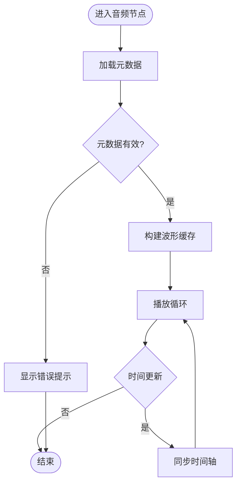
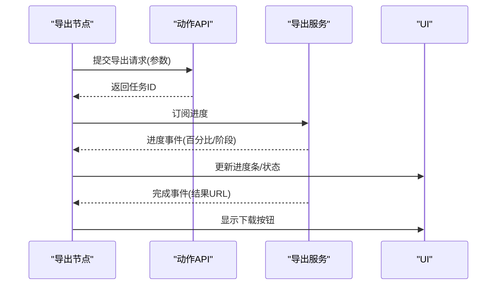
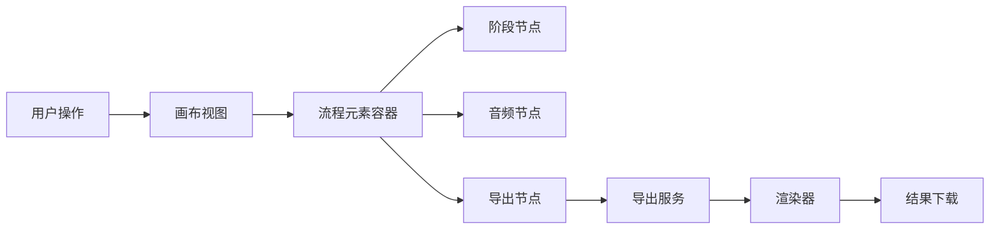
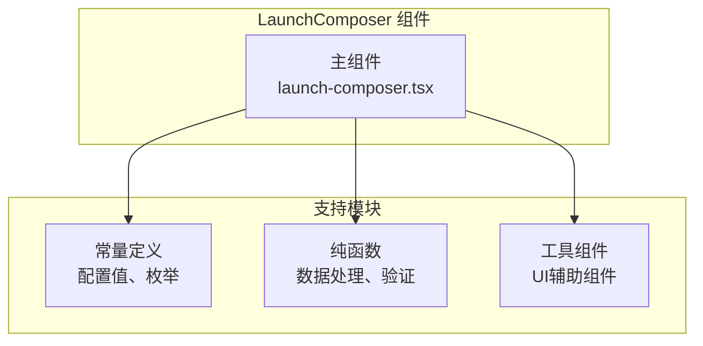
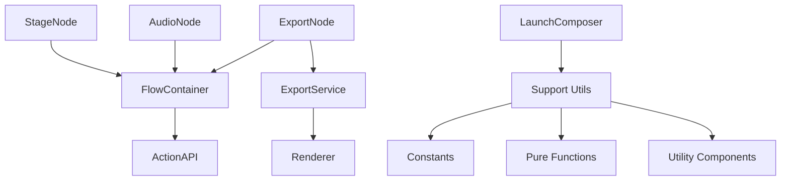

# 业务组件

<cite>
**本文引用的文件**   
- [stage-node.tsx](file://src/components/ui/node/stage-node.tsx)
- [audio-node.tsx](file://src/components/ui/node/audio-node.tsx)
- [export-node.tsx](file://src/components/ui/node/export-node.tsx)
- [project-card.tsx](file://src/components/ui/project-card.tsx)
- [sidebar.tsx](file://src/components/ui/sidebar.tsx)
- [top-bar.tsx](file://src/components/ui/top-bar.tsx)
- [canvas-view.tsx](file://src/app/products/(app)/canvas/[projectId]/canvas-view.tsx)
- [flow-elements.tsx](file://src/app/products/(app)/canvas/[projectId]/flow-elements.tsx)
- [canvas-action-api.ts](file://src/app/products/(app)/canvas/[projectId]/canvas-action-api.ts)
- [export-page.tsx](file://src/app/products/(app)/export/[projectId]/page.tsx)
- [export-service.ts](file://src/features/render/export-service.ts)
- [render.ts](file://src/features/render/renderer.ts)
- [types.ts](file://src/components/ui/node/types.ts)
- [launch-composer.tsx](file://src/components/marketing/launch-composer.tsx)
- [launch-composer-support.tsx](file://src/components/marketing/launch-composer-support.tsx)
</cite>

## 更新摘要
**所做更改**   
- 新增营销组件重构章节，说明 launch-composer.tsx 的拆分优化
- 添加 launch-composer-support.tsx 支持文件的详细说明
- 更新组件架构部分以反映新的模块化结构
- 增强可维护性和测试性相关的最佳实践指导

## 目录
1. [简介](#简介)
2. [项目结构](#项目结构)
3. [核心组件](#核心组件)
4. [架构总览](#架构总览)
5. [详细组件分析](#详细组件分析)
6. [营销组件重构](#营销组件重构)
7. [依赖关系分析](#依赖关系分析)
8. [性能考量](#性能考量)
9. [故障排查指南](#故障排查指南)
10. [结论](#结论)
11. [附录](#附录)

## 简介
本文件面向视频编辑应用中的"业务组件"，重点覆盖以下两类：
- 视频编辑相关节点组件：StageNode、AudioNode、ExportNode
- 应用级界面组件：ProjectCard、Sidebar、TopBar

文档将解释这些组件如何封装复杂的业务逻辑，与状态管理集成，以及与API层的交互模式；并补充生命周期管理、错误处理、性能优化等高级特性。同时提供实际使用场景与集成示例，帮助读者快速上手与扩展。

**更新** 新增了营销组件重构的最佳实践，展示了如何通过代码拆分提升可维护性和测试性。

## 项目结构
本项目采用按功能域划分的目录组织方式：
- src/components/ui：通用UI与业务组件（含节点组件与应用级组件）
- src/components/marketing：营销页面组件（包含重构后的启动编排器）
- src/app/products/(app)/canvas：画布编辑器页面与流程元素
- src/app/products/(app)/export：导出页面
- src/features/render：渲染与导出服务
- src/lib：跨领域工具库（如API封装、队列、流式通信等）

**图表来源**
- [canvas-view.tsx](file://src/app/products/(app)/canvas/[projectId]/canvas-view.tsx)
- [flow-elements.tsx](file://src/app/products/(app)/canvas/[projectId]/flow-elements.tsx)
- [stage-node.tsx](file://src/components/ui/node/stage-node.tsx)
- [audio-node.tsx](file://src/components/ui/node/audio-node.tsx)
- [export-node.tsx](file://src/components/ui/node/export-node.tsx)
- [project-card.tsx](file://src/components/ui/project-card.tsx)
- [sidebar.tsx](file://src/components/ui/sidebar.tsx)
- [top-bar.tsx](file://src/components/ui/top-bar.tsx)
- [export-service.ts](file://src/features/render/export-service.ts)
- [render.ts](file://src/features/render/renderer.ts)
- [launch-composer.tsx](file://src/components/marketing/launch-composer.tsx)
- [launch-composer-support.tsx](file://src/components/marketing/launch-composer-support.tsx)

## 核心组件
本节聚焦三类节点组件与三类应用级组件的职责边界与协作方式。

- StageNode（阶段节点）
  - 职责：表示工作流中的一个处理阶段（如素材导入、转码、合成等），承载阶段元数据、状态与操作入口。
  - 关键能力：状态展示（进行中/成功/失败）、错误提示、重试/回退入口、与画布交互（选中、连线）。
  - 典型属性：阶段标识、阶段类型、输入输出引用、进度、错误信息、可操作项。

- AudioNode（音频节点）
  - 职责：封装音频相关的编辑与播放控制，包括时长测量、字幕对齐、音效叠加等。
  - 关键能力：媒体加载与预览、时间轴同步、音量/淡入淡出、字幕轨道联动。
  - 典型属性：音频资源ID、时长、采样率、波形快照、字幕关联、播放状态。

- ExportNode（导出节点）
  - 职责：触发并监控导出任务，聚合渲染结果与下载入口。
  - 关键能力：导出参数配置、任务队列接入、进度上报、结果下载、失败重试。
  - 典型属性：导出格式、分辨率、码率、目标路径、任务ID、状态。

- ProjectCard（项目卡片）
  - 职责：展示项目概览信息（名称、缩略图、最近修改时间、状态），支持打开/删除等操作。
  - 关键能力：懒加载缩略图、状态徽章、快捷操作菜单。
  - 典型属性：项目ID、标题、封面URL、更新时间、状态。

- Sidebar（侧边栏）
  - 职责：导航与面板容器，承载项目列表、资源库、设置等模块。
  - 关键能力：折叠/展开、路由跳转、面板切换、搜索过滤。
  - 典型属性：当前激活项、面板集合、收起状态。

- TopBar（顶栏）
  - 职责：全局操作区，包含项目标题、操作按钮、用户信息、通知等。
  - 关键能力：面包屑导航、全局搜索、主题切换、退出登录。
  - 典型属性：标题、操作项、用户上下文、通知计数。

**章节来源**
- [stage-node.tsx](file://src/components/ui/node/stage-node.tsx)
- [audio-node.tsx](file://src/components/ui/node/audio-node.tsx)
- [export-node.tsx](file://src/components/ui/node/export-node.tsx)
- [project-card.tsx](file://src/components/ui/project-card.tsx)
- [sidebar.tsx](file://src/components/ui/sidebar.tsx)
- [top-bar.tsx](file://src/components/ui/top-bar.tsx)

## 架构总览
下图展示了从画布到渲染导出的整体调用链，以及各组件在其中的角色。

**图表来源**
- [canvas-view.tsx](file://src/app/products/(app)/canvas/[projectId]/canvas-view.tsx)
- [flow-elements.tsx](file://src/app/products/(app)/canvas/[projectId]/flow-elements.tsx)
- [stage-node.tsx](file://src/components/ui/node/stage-node.tsx)
- [audio-node.tsx](file://src/components/ui/node/audio-node.tsx)
- [export-node.tsx](file://src/components/ui/node/export-node.tsx)
- [canvas-action-api.ts](file://src/app/products/(app)/canvas/[projectId]/canvas-action-api.ts)
- [export-service.ts](file://src/features/render/export-service.ts)
- [render.ts](file://src/features/render/renderer.ts)

## 详细组件分析

### StageNode（阶段节点）
- 设计要点
  - 以"阶段"为抽象，统一展示状态与操作，屏蔽底层流程差异。
  - 通过事件回调与父级流程容器通信，避免直接耦合具体业务。
- 生命周期
  - 挂载：初始化阶段元数据与默认状态。
  - 更新：响应外部状态变化（如进度、错误）。
  - 卸载：清理定时器与监听器。
- 错误处理
  - 区分网络错误、服务端校验错误、运行时异常，分别给出不同提示与恢复建议。
- 性能优化
  - 仅对可见区域进行重渲染；大对象变更时使用不可变更新策略。
- 与状态管理集成
  - 通过受控组件模式接收状态与回调，由上层流程容器集中管理状态。
- 与API交互
  - 通过动作API发起阶段推进或重试，异步结果通过回调或事件下发。

**图表来源**
- [stage-node.tsx](file://src/components/ui/node/stage-node.tsx)
- [flow-elements.tsx](file://src/app/products/(app)/canvas/[projectId]/flow-elements.tsx)

**章节来源**
- [stage-node.tsx](file://src/components/ui/node/stage-node.tsx)
- [flow-elements.tsx](file://src/app/products/(app)/canvas/[projectId]/flow-elements.tsx)

### AudioNode（音频节点）
- 设计要点
  - 封装音频媒体加载、播放控制、波形生成与字幕对齐。
  - 与时间轴组件协同，实现帧级同步。
- 生命周期
  - 挂载：预加载音频元数据与波形缓存。
  - 播放：按需加载片段，节流重绘。
  - 暂停/停止：释放解码缓冲，避免内存泄漏。
- 错误处理
  - 捕获解码失败、格式不支持、跨域限制等，提供降级方案（如文本提示）。
- 性能优化
  - 使用虚拟滚动与分块加载；波形数据按需计算与缓存。
- 与状态管理集成
  - 暴露播放状态、当前时间、音量等受控属性，由上层播放器或时间轴驱动。
- 与API交互
  - 通过媒体服务获取音频资源与字幕，必要时上传编辑结果。

**图表来源**
- [audio-node.tsx](file://src/components/ui/node/audio-node.tsx)

**章节来源**
- [audio-node.tsx](file://src/components/ui/node/audio-node.tsx)

### ExportNode（导出节点）
- 设计要点
  - 封装导出参数、任务创建、进度订阅与结果下载。
  - 与导出服务对接，支持断点续传与失败重试。
- 生命周期
  - 挂载：读取导出配置与历史任务。
  - 运行：轮询或订阅进度，更新UI状态。
  - 完成/失败：提供下载入口或重试按钮。
- 错误处理
  - 区分网络超时、配额不足、编码失败等，给出明确指引。
- 性能优化
  - 使用增量更新与防抖；大文件下载采用分片与断点续传。
- 与状态管理集成
  - 通过受控属性绑定任务状态、进度百分比、错误消息。
- 与API交互
  - 调用导出服务接口创建任务，订阅进度事件，完成后拉取结果。

**图表来源**
- [export-node.tsx](file://src/components/ui/node/export-node.tsx)
- [canvas-action-api.ts](file://src/app/products/(app)/canvas/[projectId]/canvas-action-api.ts)
- [export-service.ts](file://src/features/render/export-service.ts)

**章节来源**
- [export-node.tsx](file://src/components/ui/node/export-node.tsx)
- [canvas-action-api.ts](file://src/app/products/(app)/canvas/[projectId]/canvas-action-api.ts)
- [export-service.ts](file://src/features/render/export-service.ts)

### ProjectCard（项目卡片）
- 设计要点
  - 展示项目基本信息与状态，支持打开、删除、收藏等快捷操作。
  - 缩略图懒加载与占位骨架屏。
- 生命周期
  - 挂载：加载缩略图与统计信息。
  - 交互：响应点击与右键菜单。
  - 卸载：取消未完成的请求。
- 错误处理
  - 图片加载失败时显示默认占位；删除失败时提示重试。
- 性能优化
  - 图片懒加载与缓存；列表虚拟化。
- 与状态管理集成
  - 受控展示项目状态（如是否正在渲染）。
- 与API交互
  - 读取项目详情、触发删除或收藏等动作。

**章节来源**
- [project-card.tsx](file://src/components/ui/project-card.tsx)

### Sidebar（侧边栏）
- 设计要点
  - 作为导航与面板容器，支持多面板切换与折叠。
  - 内置搜索与过滤，提升资源定位效率。
- 生命周期
  - 挂载：初始化路由与面板状态。
  - 切换：按需加载面板内容。
  - 收起：保存布局偏好。
- 错误处理
  - 面板加载失败时显示错误态与重试入口。
- 性能优化
  - 面板懒加载与缓存；路由级代码分割。
- 与状态管理集成
  - 维护当前激活面板、收起状态、搜索关键词。
- 与API交互
  - 按需拉取面板所需数据（如项目列表、资源清单）。

**章节来源**
- [sidebar.tsx](file://src/components/ui/sidebar.tsx)

### TopBar（顶栏）
- 设计要点
  - 全局操作区，包含项目标题、操作按钮、用户信息与通知。
  - 支持主题切换与全局搜索。
- 生命周期
  - 挂载：读取用户上下文与通知计数。
  - 交互：响应操作按钮点击。
  - 卸载：清理全局监听。
- 错误处理
  - 用户信息加载失败时显示匿名态；通知拉取失败时静默降级。
- 性能优化
  - 下拉菜单延迟渲染；图标按需加载。
- 与状态管理集成
  - 维护用户会话、主题、通知状态。
- 与API交互
  - 拉取用户信息、发送通知、切换主题等。

**章节来源**
- [top-bar.tsx](file://src/components/ui/top-bar.tsx)

### 概念性总览
下图为不绑定具体文件的业务流程示意，便于理解组件间的协作关系。

## 营销组件重构

**新增** 营销组件的模块化重构展示了现代前端开发的最佳实践，通过将复杂组件拆分为更小的、可测试的单元来提升代码质量。

### LaunchComposer 组件拆分

启动编排器组件（LaunchComposer）经过重构，将常量、纯函数和工具组件提取到独立的支持文件中：

- **主组件（launch-composer.tsx）**：专注于组件结构和用户交互逻辑
- **支持文件（launch-composer-support.tsx）**：包含126行的常量定义、纯函数和工具组件

### 重构优势

1. **可维护性提升**
   - 单一职责原则：每个文件专注于特定功能
   - 代码组织清晰，便于查找和修改
   - 减少主组件复杂度，提高可读性

2. **可测试性增强**
   - 纯函数易于单元测试
   - 工具组件可独立测试
   - 常量集中管理，便于模拟

3. **代码复用性**
   - 工具函数可在其他组件中复用
   - 常量定义统一管理，避免重复
   - 支持组件可被多个地方使用

### 重构后的架构

**图表来源**
- [launch-composer.tsx](file://src/components/marketing/launch-composer.tsx)
- [launch-composer-support.tsx](file://src/components/marketing/launch-composer-support.tsx)

### 最佳实践指导

1. **组件拆分原则**
   - 当组件超过200行时考虑拆分
   - 将纯函数与UI逻辑分离
   - 常量集中管理，避免硬编码

2. **文件组织策略**
   - 主组件保持简洁，专注于用户交互
   - 支持文件包含所有辅助逻辑
   - 清晰的命名约定和文件结构

3. **测试策略**
   - 为纯函数编写单元测试
   - 工具组件进行隔离测试
   - 主组件进行集成测试

**章节来源**
- [launch-composer.tsx](file://src/components/marketing/launch-composer.tsx)
- [launch-composer-support.tsx](file://src/components/marketing/launch-composer-support.tsx)

## 依赖关系分析
- 组件内聚与耦合
  - 节点组件高内聚：每个节点封装自身状态与行为，通过回调与父级容器通信，降低耦合。
  - 应用级组件低耦合：Sidebar与TopBar通过路由与上下文共享状态，避免直接依赖业务细节。
  - 营销组件模块化：LaunchComposer通过支持文件解耦常量和工具逻辑。
- 外部依赖
  - 渲染与导出服务：ExportNode与导出服务解耦，通过事件与回调通信。
  - 媒体与字幕：AudioNode依赖媒体服务与字幕解析模块。
  - 支持模块：营销组件通过独立文件管理常量和工具函数。
- 潜在循环依赖
  - 通过事件总线或回调避免组件间直接相互引用。

**图表来源**
- [stage-node.tsx](file://src/components/ui/node/stage-node.tsx)
- [audio-node.tsx](file://src/components/ui/node/audio-node.tsx)
- [export-node.tsx](file://src/components/ui/node/export-node.tsx)
- [flow-elements.tsx](file://src/app/products/(app)/canvas/[projectId]/flow-elements.tsx)
- [canvas-action-api.ts](file://src/app/products/(app)/canvas/[projectId]/canvas-action-api.ts)
- [export-service.ts](file://src/features/render/export-service.ts)
- [render.ts](file://src/features/render/renderer.ts)
- [launch-composer.tsx](file://src/components/marketing/launch-composer.tsx)
- [launch-composer-support.tsx](file://src/components/marketing/launch-composer-support.tsx)

**章节来源**
- [flow-elements.tsx](file://src/app/products/(app)/canvas/[projectId]/flow-elements.tsx)
- [canvas-action-api.ts](file://src/app/products/(app)/canvas/[projectId]/canvas-action-api.ts)
- [export-service.ts](file://src/features/render/export-service.ts)
- [render.ts](file://src/features/render/renderer.ts)

## 性能考量
- 渲染优化
  - 节点组件采用受控模式，减少不必要的重渲染；对大对象变更使用不可变更新。
  - 列表与面板懒加载，结合虚拟化技术提升长列表性能。
  - 营销组件通过模块化减少主组件体积，提升加载性能。
- 媒体处理
  - 音频波形按需计算与缓存；视频缩略图延迟加载与压缩。
- 网络请求
  - 请求去重与缓存；失败重试与指数退避；大文件分片下载。
- 内存管理
  - 及时释放解码缓冲与监听器；避免闭包持有大对象引用。
- 代码分割
  - 营销组件支持文件独立加载，按需引入减少主包大小。

## 故障排查指南
- 常见问题
  - 节点状态卡住：检查事件订阅是否正确清理；确认上游状态更新是否触发。
  - 音频播放失败：验证媒体格式与跨域策略；查看控制台错误日志。
  - 导出失败：核对导出参数合法性；检查服务端配额与编码资源。
  - 营销组件问题：检查支持文件导入路径；验证常量定义完整性。
- 调试技巧
  - 启用节点级日志，记录状态变更与事件流。
  - 使用浏览器开发者工具观察网络请求与WebSocket事件。
  - 对重构后的组件进行单元测试验证。
- 恢复策略
  - 提供重试与回退入口；对不可恢复错误给出明确提示与替代方案。
  - 营销组件提供降级显示，确保基础功能可用。

**章节来源**
- [stage-node.tsx](file://src/components/ui/node/stage-node.tsx)
- [audio-node.tsx](file://src/components/ui/node/audio-node.tsx)
- [export-node.tsx](file://src/components/ui/node/export-node.tsx)

## 结论
StageNode、AudioNode、ExportNode等节点组件通过受控模式与事件机制，将复杂业务逻辑封装在组件内部，保持与上层流程容器的松耦合。ProjectCard、Sidebar、TopBar等应用级组件则负责导航、展示与全局操作，共同构成完整的视频编辑体验。通过清晰的依赖关系、完善的错误处理与性能优化策略，系统具备良好的可维护性与可扩展性。

**更新** 营销组件的重构展示了现代前端开发的最佳实践，通过代码拆分提升了可维护性和测试性，为其他组件的优化提供了参考模式。

## 附录
- 使用场景与集成示例
  - 在画布中拖拽新增阶段节点，配置输入输出后点击推进，节点状态自动更新并触发下一步。
  - 在音频节点中选择音轨，调整音量与淡入淡出，时间轴同步播放位置。
  - 在导出节点中设置格式与分辨率，提交任务后实时查看进度，完成后下载结果。
  - 在项目卡片中打开项目，侧边栏切换到对应资源面板，顶栏显示当前项目标题与操作按钮。
  - 营销页面通过重构后的启动编排器提供更流畅的用户体验，支持更好的可测试性和维护性。

- 重构最佳实践
  - 组件拆分时机：当组件超过200行或职责过多时考虑拆分
  - 文件组织：主组件保持简洁，支持文件包含所有辅助逻辑
  - 测试策略：为纯函数和工具组件编写独立的单元测试
  - 代码复用：提取通用的常量和函数供其他组件使用