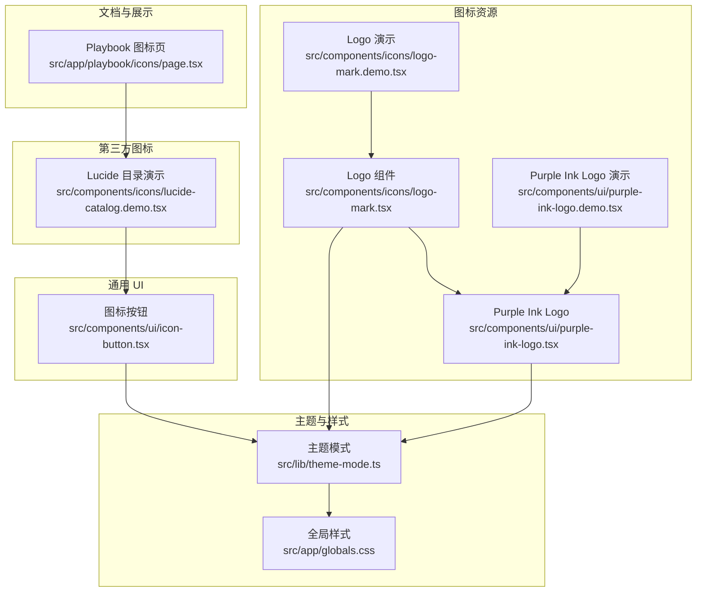
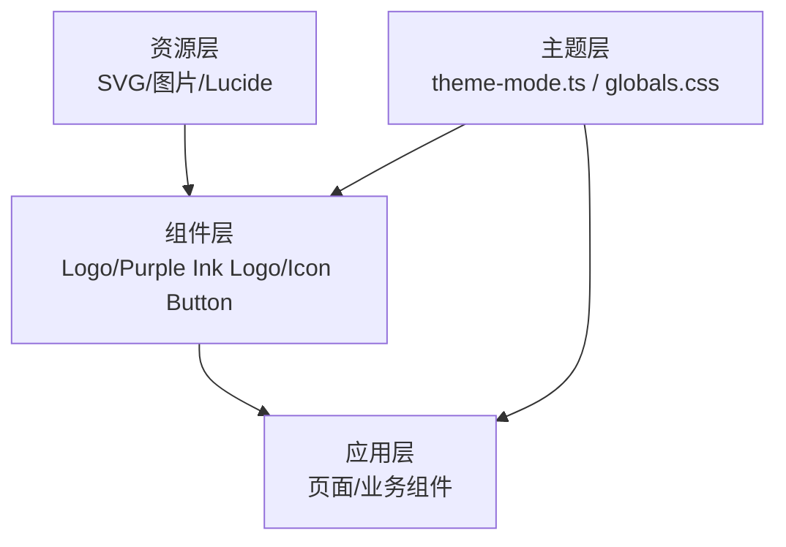
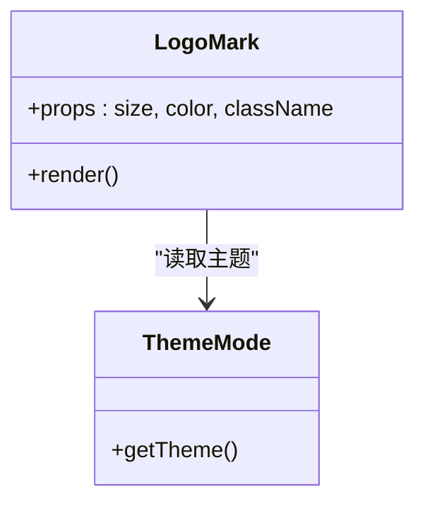
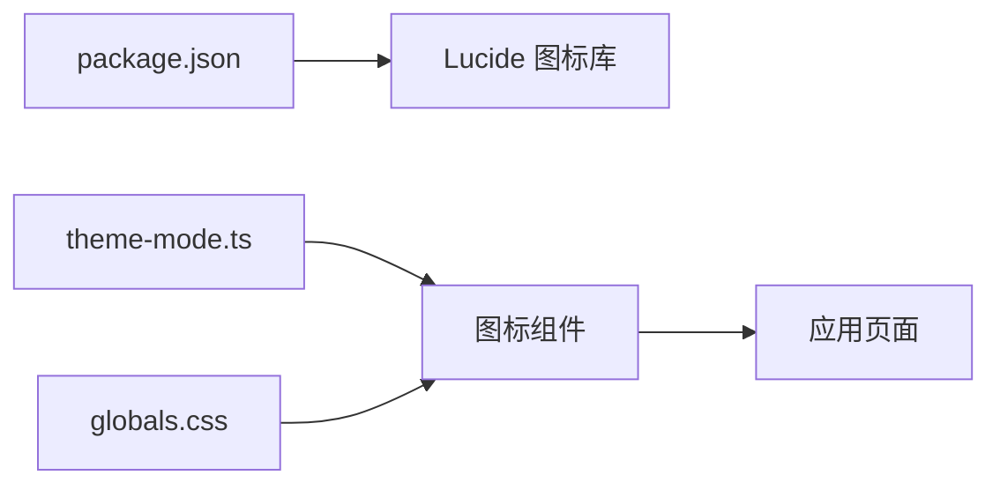

# 图标系统

<cite>
**本文引用的文件**   
- [src/components/icons/logo-mark.tsx](file://src/components/icons/logo-mark.tsx)
- [src/components/icons/logo-mark.demo.tsx](file://src/components/icons/logo-mark.demo.tsx)
- [src/components/icons/lucide-catalog.demo.tsx](file://src/components/icons/lucide-catalog.demo.tsx)
- [src/components/ui/purple-ink-logo.tsx](file://src/components/ui/purple-ink-logo.tsx)
- [src/components/ui/purple-ink-logo.demo.tsx](file://src/components/ui/purple-ink-logo.demo.tsx)
- [src/components/ui/icon-button.tsx](file://src/components/ui/icon-button.tsx)
- [src/app/playbook/icons/page.tsx](file://src/app/playbook/icons/page.tsx)
- [src/lib/theme-mode.ts](file://src/lib/theme-mode.ts)
- [src/app/globals.css](file://src/app/globals.css)
- [package.json](file://package.json)
</cite>

## 目录
1. [简介](#简介)
2. [项目结构](#项目结构)
3. [核心组件](#核心组件)
4. [架构总览](#架构总览)
5. [详细组件分析](#详细组件分析)
6. [依赖关系分析](#依赖关系分析)
7. [性能考虑](#性能考虑)
8. [故障排查指南](#故障排查指南)
9. [结论](#结论)
10. [附录](#附录)

## 简介
本文件系统化说明本项目中的图标体系与使用规范，涵盖：
- Logo 图标与第三方图标库（如 Lucide）的集成方式
- 命名约定、尺寸规范、颜色适配等设计原则
- 如何添加新图标与自定义图标组件的最佳实践
- 在不同主题下的显示效果与性能优化建议

目标是让开发者与设计者都能快速上手并保持一致的视觉与交互体验。

## 项目结构
图标相关代码主要分布在以下位置：
- 品牌 Logo 与演示：src/components/icons、src/components/ui
- 图标展示与文档页：src/app/playbook/icons
- 主题与样式：src/lib/theme-mode.ts、src/app/globals.css
- 第三方图标库依赖：package.json

图表来源 
- [src/components/icons/logo-mark.tsx](file://src/components/icons/logo-mark.tsx)
- [src/components/icons/logo-mark.demo.tsx](file://src/components/icons/logo-mark.demo.tsx)
- [src/components/ui/purple-ink-logo.tsx](file://src/components/ui/purple-ink-logo.tsx)
- [src/components/ui/purple-ink-logo.demo.tsx](file://src/components/ui/purple-ink-logo.demo.tsx)
- [src/components/icons/lucide-catalog.demo.tsx](file://src/components/icons/lucide-catalog.demo.tsx)
- [src/components/ui/icon-button.tsx](file://src/components/ui/icon-button.tsx)
- [src/app/playbook/icons/page.tsx](file://src/app/playbook/icons/page.tsx)
- [src/lib/theme-mode.ts](file://src/lib/theme-mode.ts)
- [src/app/globals.css](file://src/app/globals.css)

章节来源
- [src/components/icons/logo-mark.tsx](file://src/components/icons/logo-mark.tsx)
- [src/components/icons/logo-mark.demo.tsx](file://src/components/icons/logo-mark.demo.tsx)
- [src/components/ui/purple-ink-logo.tsx](file://src/components/ui/purple-ink-logo.tsx)
- [src/components/ui/purple-ink-logo.demo.tsx](file://src/components/ui/purple-ink-logo.demo.tsx)
- [src/components/icons/lucide-catalog.demo.tsx](file://src/components/icons/lucide-catalog.demo.tsx)
- [src/components/ui/icon-button.tsx](file://src/components/ui/icon-button.tsx)
- [src/app/playbook/icons/page.tsx](file://src/app/playbook/icons/page.tsx)
- [src/lib/theme-mode.ts](file://src/lib/theme-mode.ts)
- [src/app/globals.css](file://src/app/globals.css)

## 核心组件
- Logo 图标组件：提供品牌标识的统一渲染入口，支持尺寸与颜色控制，适配明暗主题。
- Purple Ink Logo 组件：产品级 Logo 封装，常用于头部导航、加载页等关键位置。
- 图标按钮组件：将任意图标与按钮语义结合，统一交互与可访问性。
- Lucide 目录演示：集中展示第三方图标的使用方式与示例。
- Playbook 图标页：作为图标的“设计系统”页面，用于预览、检索与引用。

章节来源
- [src/components/icons/logo-mark.tsx](file://src/components/icons/logo-mark.tsx)
- [src/components/ui/purple-ink-logo.tsx](file://src/components/ui/purple-ink-logo.tsx)
- [src/components/ui/icon-button.tsx](file://src/components/ui/icon-button.tsx)
- [src/components/icons/lucide-catalog.demo.tsx](file://src/components/icons/lucide-catalog.demo.tsx)
- [src/app/playbook/icons/page.tsx](file://src/app/playbook/icons/page.tsx)

## 架构总览
图标系统的整体架构分为三层：
- 资源层：SVG/图片资源与第三方图标库（如 Lucide）
- 组件层：Logo 组件、Purple Ink Logo、图标按钮等
- 应用层：页面与业务组件通过组件层消费图标，受主题与样式约束

图表来源 
- [src/components/icons/logo-mark.tsx](file://src/components/icons/logo-mark.tsx)
- [src/components/ui/purple-ink-logo.tsx](file://src/components/ui/purple-ink-logo.tsx)
- [src/components/ui/icon-button.tsx](file://src/components/ui/icon-button.tsx)
- [src/lib/theme-mode.ts](file://src/lib/theme-mode.ts)
- [src/app/globals.css](file://src/app/globals.css)

## 详细组件分析

### Logo 图标组件（logo-mark）
职责与特性：
- 统一渲染品牌 Logo，支持传入尺寸与颜色参数
- 根据主题自动切换颜色或保持指定色值
- 提供演示页面便于在开发环境预览

最佳实践：
- 在导航栏、登录页等品牌曝光处优先使用该组件
- 避免直接内联 SVG，确保一致性

图表来源 
- [src/components/icons/logo-mark.tsx](file://src/components/icons/logo-mark.tsx)
- [src/lib/theme-mode.ts](file://src/lib/theme-mode.ts)

章节来源
- [src/components/icons/logo-mark.tsx](file://src/components/icons/logo-mark.tsx)
- [src/components/icons/logo-mark.demo.tsx](file://src/components/icons/logo-mark.demo.tsx)
- [src/lib/theme-mode.ts](file://src/lib/theme-mode.ts)

### Purple Ink Logo 组件
职责与特性：
- 产品级 Logo 封装，常用于顶部导航、空状态、加载页等
- 与主题联动，保证明暗模式下对比度与可读性

使用建议：
- 在需要强品牌识别的位置使用
- 若需更细粒度控制，回退到 logo-mark 组件

章节来源
- [src/components/ui/purple-ink-logo.tsx](file://src/components/ui/purple-ink-logo.tsx)
- [src/components/ui/purple-ink-logo.demo.tsx](file://src/components/ui/purple-ink-logo.demo.tsx)

### 图标按钮组件（icon-button）
职责与特性：
- 将图标与按钮语义结合，提供一致的交互与可访问性
- 支持大小、颜色、禁用态等常见属性

使用建议：
- 所有纯图标操作都应通过该组件包裹，确保键盘可达性与屏幕阅读器友好

章节来源
- [src/components/ui/icon-button.tsx](file://src/components/ui/icon-button.tsx)

### Lucide 第三方图标集成
职责与特性：
- 通过目录演示集中展示如何使用 Lucide 图标
- 与主题联动，确保颜色与背景对比度符合规范

使用建议：
- 优先从 Lucide 中选择语义明确的图标
- 在业务组件中按需引入，避免全量打包

章节来源
- [src/components/icons/lucide-catalog.demo.tsx](file://src/components/icons/lucide-catalog.demo.tsx)

### Playbook 图标页
职责与特性：
- 作为图标的设计系统页面，集中展示与检索可用图标
- 为开发者提供直观的预览与复制入口

使用建议：
- 新增图标后，务必更新此页面以便团队共享

章节来源
- [src/app/playbook/icons/page.tsx](file://src/app/playbook/icons/page.tsx)

## 依赖关系分析
- 主题依赖：图标组件通过主题模式获取当前主题，从而决定颜色与对比度策略
- 样式依赖：全局样式定义基础变量与类名，影响图标渲染外观
- 第三方依赖：Lucide 图标库由包管理工具引入，按需使用

图表来源 
- [package.json](file://package.json)
- [src/lib/theme-mode.ts](file://src/lib/theme-mode.ts)
- [src/app/globals.css](file://src/app/globals.css)
- [src/components/icons/logo-mark.tsx](file://src/components/icons/logo-mark.tsx)
- [src/components/ui/purple-ink-logo.tsx](file://src/components/ui/purple-ink-logo.tsx)
- [src/components/ui/icon-button.tsx](file://src/components/ui/icon-button.tsx)

章节来源
- [package.json](file://package.json)
- [src/lib/theme-mode.ts](file://src/lib/theme-mode.ts)
- [src/app/globals.css](file://src/app/globals.css)

## 性能考虑
- 按需引入：对第三方图标库采用按需导入，减少包体积
- 缓存策略：静态 SVG 与图片资源启用浏览器缓存
- 主题切换：避免频繁重绘，尽量复用样式变量
- 懒加载：非首屏图标可采用懒加载或虚拟列表渲染

[本节为通用指导，不直接分析具体文件]

## 故障排查指南
常见问题与解决思路：
- 图标颜色异常：检查主题模式是否正确传递，确认颜色变量是否被覆盖
- 尺寸不一致：统一通过 props 设置尺寸，避免硬编码 CSS
- 第三方图标缺失：确认包已安装且路径正确，必要时清理缓存重装
- 可访问性问题：确保图标按钮具备 aria-label 与键盘焦点

章节来源
- [src/lib/theme-mode.ts](file://src/lib/theme-mode.ts)
- [src/app/globals.css](file://src/app/globals.css)
- [src/components/ui/icon-button.tsx](file://src/components/ui/icon-button.tsx)

## 结论
本项目的图标系统以组件化为核心，结合主题与样式实现一致的品牌与交互体验。通过规范的命名、尺寸与颜色策略，以及清晰的依赖与性能优化手段，团队可以高效扩展与维护图标资产。建议在新增图标时遵循本文档的实践，并在 Playbook 中同步更新，确保全员可见与复用。

[本节为总结性内容，不直接分析具体文件]

## 附录
- 命名约定：组件以功能命名（如 logo-mark、purple-ink-logo），演示文件以 .demo.tsx 结尾
- 尺寸规范：优先使用统一的比例单位（如 rem/em），避免像素硬编码
- 颜色适配：优先使用主题变量，确保明暗模式下的对比度达标
- 添加新图标流程：
  1) 准备 SVG 或选择 Lucide 图标
  2) 创建组件并接入主题
  3) 在 Playbook 中添加演示
  4) 在业务组件中按需引入并使用

[本节为通用指导，不直接分析具体文件]