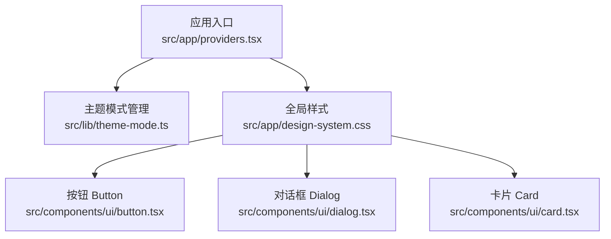
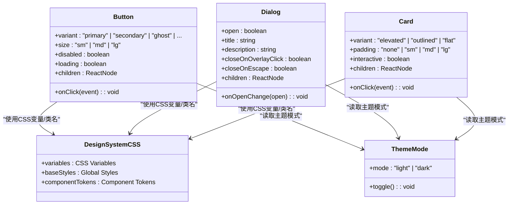
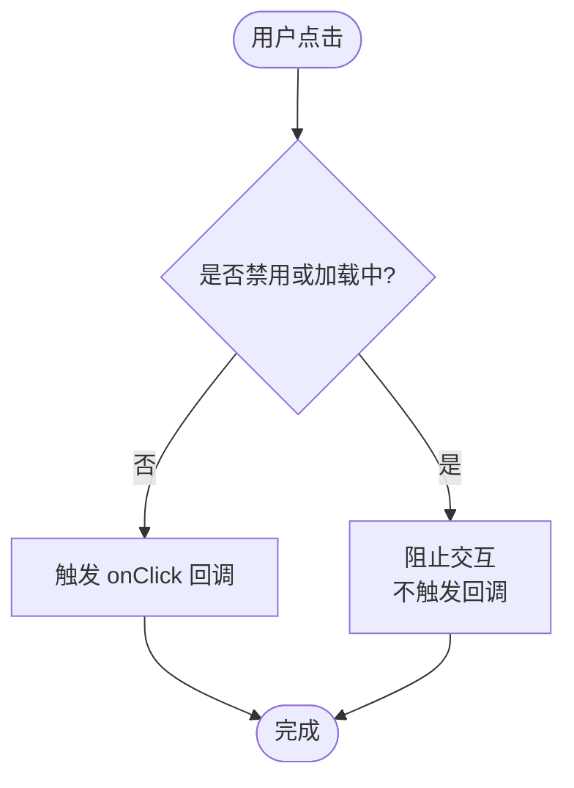
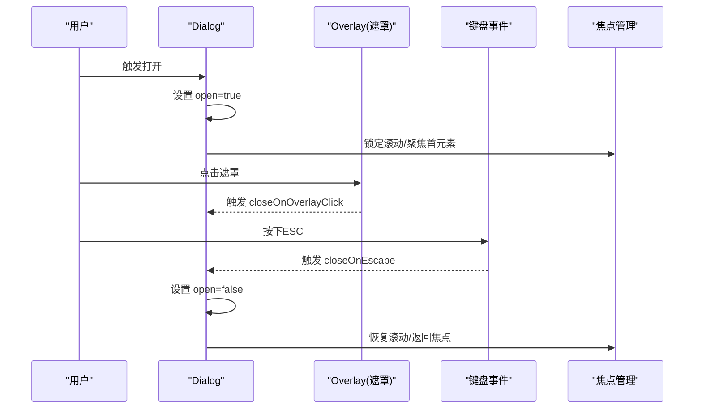
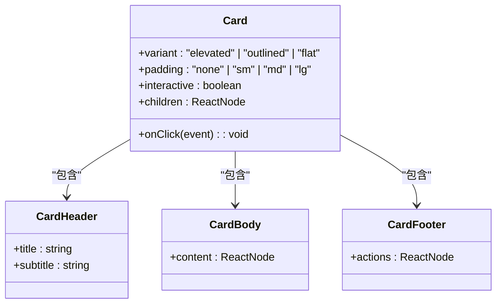
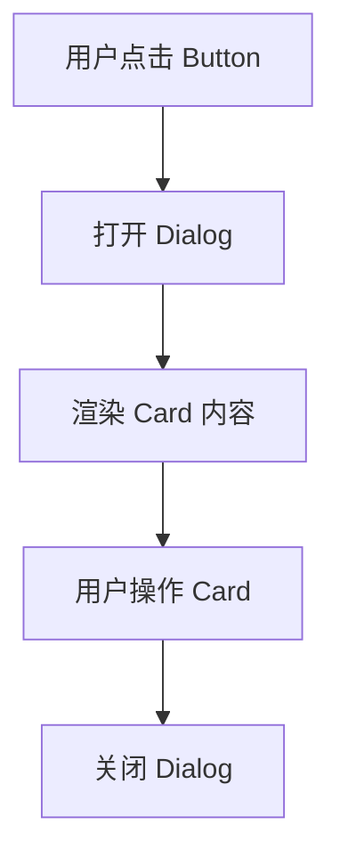
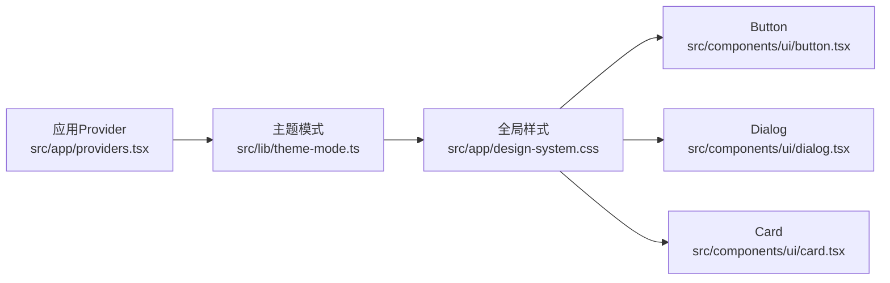

# 基础UI组件

<cite>
**本文引用的文件**   
- [src/components/ui/button.tsx](file://src/components/ui/button.tsx)
- [src/components/ui/dialog.tsx](file://src/components/ui/dialog.tsx)
- [src/components/ui/card.tsx](file://src/components/ui/card.tsx)
- [src/app/design-system.css](file://src/app/design-system.css)
- [src/lib/theme-mode.ts](file://src/lib/theme-mode.ts)
- [src/app/providers.tsx](file://src/app/providers.tsx)
</cite>

## 目录
1. [简介](#简介)
2. [项目结构](#项目结构)
3. [核心组件](#核心组件)
4. [架构总览](#架构总览)
5. [详细组件分析](#详细组件分析)
6. [依赖关系分析](#依赖关系分析)
7. [性能考量](#性能考量)
8. [故障排查指南](#故障排查指南)
9. [结论](#结论)
10. [附录](#附录)

## 简介
本文件面向开发者与产品/设计人员，系统化梳理本项目中基础UI组件（Button、Dialog、Card）的设计与实现。内容涵盖：
- Props接口定义与类型契约
- 事件处理机制与可组合性模式
- 样式定制选项与主题适配
- 无障碍访问支持（a11y）
- 响应式行为与最佳实践
- 常见问题与解决方案

## 项目结构
基础UI组件位于 src/components/ui 目录下，采用“按功能拆分”的组织方式，每个组件独立文件并配套演示与测试文件。主题与全局样式集中在 src/app/design-system.css，运行时主题切换由 src/lib/theme-mode.ts 提供，应用级Provider在 src/app/providers.tsx 中注入。

图表来源 
- [src/app/providers.tsx](file://src/app/providers.tsx)
- [src/lib/theme-mode.ts](file://src/lib/theme-mode.ts)
- [src/app/design-system.css](file://src/app/design-system.css)
- [src/components/ui/button.tsx](file://src/components/ui/button.tsx)
- [src/components/ui/dialog.tsx](file://src/components/ui/dialog.tsx)
- [src/components/ui/card.tsx](file://src/components/ui/card.tsx)

章节来源
- [src/app/design-system.css](file://src/app/design-system.css)
- [src/lib/theme-mode.ts](file://src/lib/theme-mode.ts)
- [src/app/providers.tsx](file://src/app/providers.tsx)

## 核心组件
本节对 Button、Dialog、Card 三个核心组件进行统一说明，包括：
- 设计目标与职责边界
- 关键Props与类型契约
- 事件模型与回调约定
- 样式与主题扩展点
- 无障碍特性
- 响应式策略
- 可组合性与扩展方法

章节来源
- [src/components/ui/button.tsx](file://src/components/ui/button.tsx)
- [src/components/ui/dialog.tsx](file://src/components/ui/dialog.tsx)
- [src/components/ui/card.tsx](file://src/components/ui/card.tsx)
- [src/app/design-system.css](file://src/app/design-system.css)
- [src/lib/theme-mode.ts](file://src/lib/theme-mode.ts)

## 架构总览
基础UI组件遵循“样式与主题解耦 + 语义化标签 + 无障碍优先”的架构原则：
- 样式层：通过CSS变量与类名组合实现主题与变体
- 交互层：基于原生事件与React状态管理，避免过度封装
- 可访问性：使用语义化HTML与ARIA属性，确保键盘与屏幕阅读器可用
- 主题层：通过Provider与CSS变量驱动明暗主题与品牌色

图表来源 
- [src/components/ui/button.tsx](file://src/components/ui/button.tsx)
- [src/components/ui/dialog.tsx](file://src/components/ui/dialog.tsx)
- [src/components/ui/card.tsx](file://src/components/ui/card.tsx)
- [src/app/design-system.css](file://src/app/design-system.css)
- [src/lib/theme-mode.ts](file://src/lib/theme-mode.ts)

## 详细组件分析

### Button 组件
- 设计目标：提供一致的点击触发控件，支持多种视觉变体与尺寸，具备加载态与禁用态。
- Props接口要点：
  - variant：控制外观风格（如 primary、secondary、ghost 等）
  - size：控制尺寸（sm、md、lg）
  - disabled：禁用交互
  - loading：显示加载指示器，同时禁用交互
  - onClick：点击回调，接收原生事件对象
  - children：按钮内容（文本或图标）
- 事件处理机制：
  - 基于原生 click 事件，内部阻止默认行为与冒泡（如需）
  - 在 loading/disabled 状态下屏蔽交互
- 样式定制选项：
  - 通过CSS变量覆盖颜色、圆角、阴影、字号等
  - 通过className叠加自定义样式
- 无障碍访问支持：
  - 使用 button 语义标签，自动获得键盘焦点
  - disabled/loading 时设置 aria-disabled
  - 为图标按钮提供 aria-label
- 响应式行为：
  - 在小屏下可通过size或样式媒体查询调整内边距与字号
- 可组合性与扩展：
  - 与图标组件组合使用
  - 通过wrapper组件封装业务按钮（如提交、确认）

图表来源 
- [src/components/ui/button.tsx](file://src/components/ui/button.tsx)

章节来源
- [src/components/ui/button.tsx](file://src/components/ui/button.tsx)
- [src/app/design-system.css](file://src/app/design-system.css)
- [src/lib/theme-mode.ts](file://src/lib/theme-mode.ts)

### Dialog 组件
- 设计目标：提供模态对话框，用于重要操作确认、表单输入或信息展示。
- Props接口要点：
  - open：控制显隐
  - onOpenChange：显隐变化回调
  - title/description：标题与描述
  - closeOnOverlayClick/closeOnEscape：遮罩点击与ESC关闭
  - children：对话框内容
- 事件处理机制：
  - 监听键盘 ESC 与遮罩点击事件
  - 打开时锁定滚动，关闭时恢复
  - 焦点管理：打开时聚焦到标题或首个可聚焦元素，关闭后返回触发元素
- 样式定制选项：
  - 通过CSS变量覆盖背景、边框、阴影、动画过渡
  - 通过className覆盖布局与间距
- 无障碍访问支持：
  - 使用 dialog/role="dialog" 语义
  - 设置 aria-modal、aria-labelledby、aria-describedby
  - 焦点陷阱与返回焦点
- 响应式行为：
  - 小屏全屏显示，大屏居中弹窗
- 可组合性与扩展：
  - 与表单、列表、通知等组件组合
  - 提供ConfirmDialog、FormDialog等业务封装

图表来源 
- [src/components/ui/dialog.tsx](file://src/components/ui/dialog.tsx)

章节来源
- [src/components/ui/dialog.tsx](file://src/components/ui/dialog.tsx)
- [src/app/design-system.css](file://src/app/design-system.css)
- [src/lib/theme-mode.ts](file://src/lib/theme-mode.ts)

### Card 组件
- 设计目标：承载一组相关内容与操作，提供清晰的视觉层次与可选交互。
- Props接口要点：
  - variant：外观风格（elevated、outlined、flat）
  - padding：内边距（none、sm、md、lg）
  - interactive：是否作为可点击容器
  - onClick：点击回调（当interactive为true）
  - children：卡片内容
- 事件处理机制：
  - 当interactive为true时，将click事件委托给容器
  - 保持子元素可点击时的焦点顺序合理
- 样式定制选项：
  - 通过CSS变量覆盖背景、边框、阴影、圆角
  - 通过className覆盖布局与间距
- 无障碍访问支持：
  - 非交互态使用 article/div；交互态使用button或a，确保键盘可达
  - 为可点击卡片添加aria-label
- 响应式行为：
  - 网格布局下的自适应宽度与间距
- 可组合性与扩展：
  - 与图片、标题、描述、操作按钮组合
  - 提供ProductCard、ProjectCard等业务封装

图表来源 
- [src/components/ui/card.tsx](file://src/components/ui/card.tsx)

章节来源
- [src/components/ui/card.tsx](file://src/components/ui/card.tsx)
- [src/app/design-system.css](file://src/app/design-system.css)
- [src/lib/theme-mode.ts](file://src/lib/theme-mode.ts)

### 概念总览
以下流程图展示了三个组件在典型页面中的协作关系：用户通过Button触发Dialog，Dialog内嵌Card展示内容。

[此图为概念流程，不直接映射具体源码文件]

## 依赖关系分析
- 组件与样式：所有组件均依赖 design-system.css 提供的CSS变量与基础样式，保证主题一致性与可定制性。
- 组件与主题：通过 theme-mode.ts 暴露的主题模式，组件根据当前模式动态调整颜色与对比度。
- 组件与应用：providers.tsx 注入主题上下文，确保组件能正确读取与应用主题。

图表来源 
- [src/app/providers.tsx](file://src/app/providers.tsx)
- [src/lib/theme-mode.ts](file://src/lib/theme-mode.ts)
- [src/app/design-system.css](file://src/app/design-system.css)
- [src/components/ui/button.tsx](file://src/components/ui/button.tsx)
- [src/components/ui/dialog.tsx](file://src/components/ui/dialog.tsx)
- [src/components/ui/card.tsx](file://src/components/ui/card.tsx)

章节来源
- [src/app/providers.tsx](file://src/app/providers.tsx)
- [src/lib/theme-mode.ts](file://src/lib/theme-mode.ts)
- [src/app/design-system.css](file://src/app/design-system.css)

## 性能考量
- 事件最小化：避免在高频事件中执行重计算，必要时使用防抖/节流。
- 渲染优化：Dialog打开时按需渲染内容，减少初始渲染开销。
- 样式合并：尽量复用CSS变量与类名，避免重复样式计算。
- 无障碍与可访问性：正确使用语义标签可减少额外Aria维护成本。

[本节为通用指导，无需特定文件引用]

## 故障排查指南
- 主题未生效
  - 检查 providers.tsx 是否正确注入主题上下文
  - 确认 design-system.css 已引入且变量未被覆盖
- 对话框无法关闭
  - 检查 closeOnOverlayClick/closeOnEscape 配置
  - 确认焦点管理与键盘事件绑定正常
- 按钮无响应
  - 检查 disabled/loading 状态
  - 确认 onClick 回调未被阻止
- 卡片不可点击
  - 检查 interactive 标志
  - 确认子元素未拦截事件冒泡

章节来源
- [src/app/providers.tsx](file://src/app/providers.tsx)
- [src/app/design-system.css](file://src/app/design-system.css)
- [src/components/ui/dialog.tsx](file://src/components/ui/dialog.tsx)
- [src/components/ui/button.tsx](file://src/components/ui/button.tsx)
- [src/components/ui/card.tsx](file://src/components/ui/card.tsx)

## 结论
Button、Dialog、Card 三个基础组件在本项目中以“语义化 + 可访问性 + 主题化”为核心设计原则，通过CSS变量与Provider实现灵活的样式与主题定制。建议在实际使用中：
- 优先使用语义化标签与ARIA属性保障无障碍体验
- 通过CSS变量与className进行样式定制，避免内联样式
- 结合业务场景封装可复用的组合组件（如ConfirmDialog、ProductCard）

[本节为总结，无需特定文件引用]

## 附录
- 使用示例与最佳实践
  - Button：为图标按钮提供aria-label；在异步操作中启用loading状态
  - Dialog：在打开时聚焦到标题或首个可聚焦元素；关闭后返回触发焦点
  - Card：交互态使用button或a；非交互态使用article/div
- 常见问题解决方案
  - 主题不一致：检查CSS变量覆盖范围与优先级
  - 键盘导航异常：确保焦点顺序与tabindex合理
  - 移动端适配：通过媒体查询调整尺寸与布局

[本节为补充信息，无需特定文件引用]