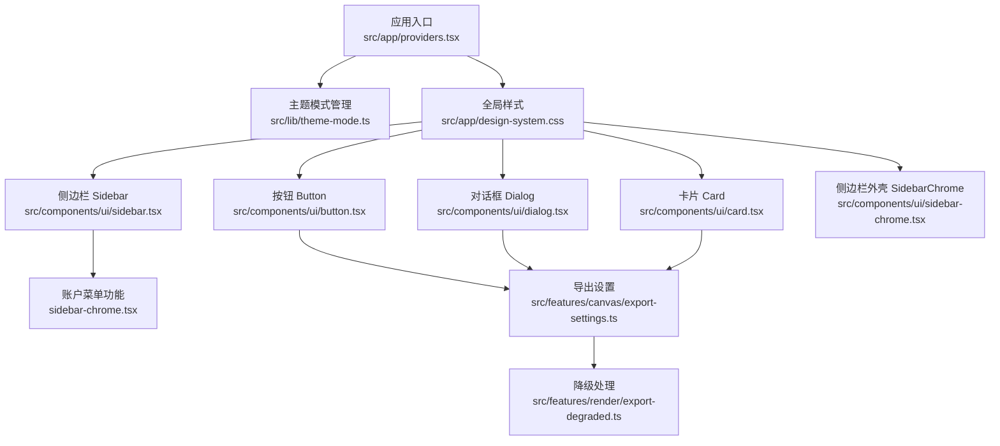
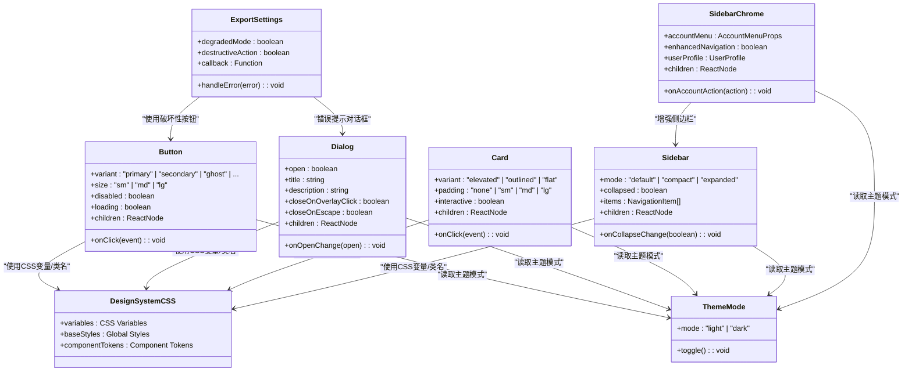
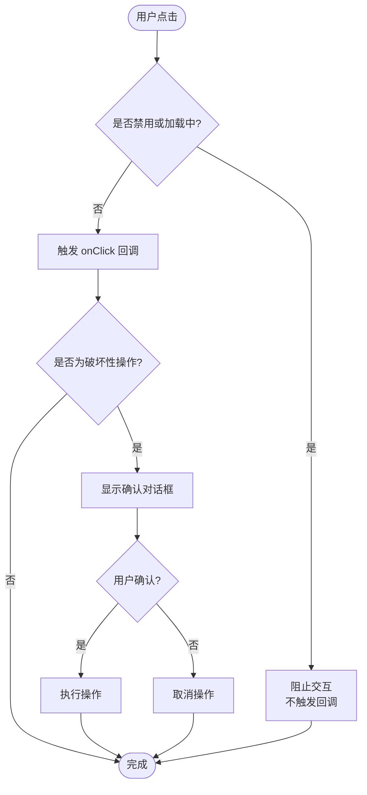
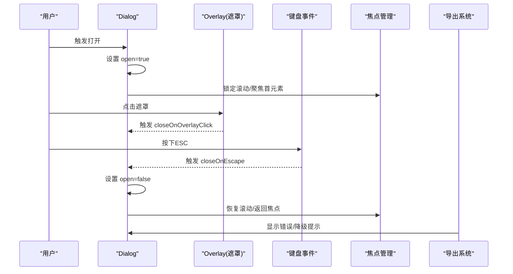
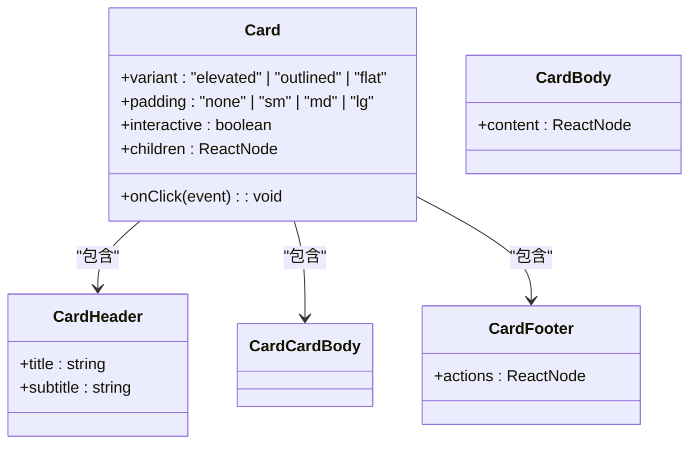
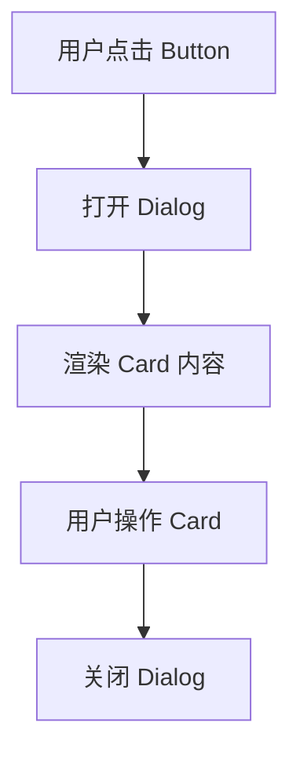
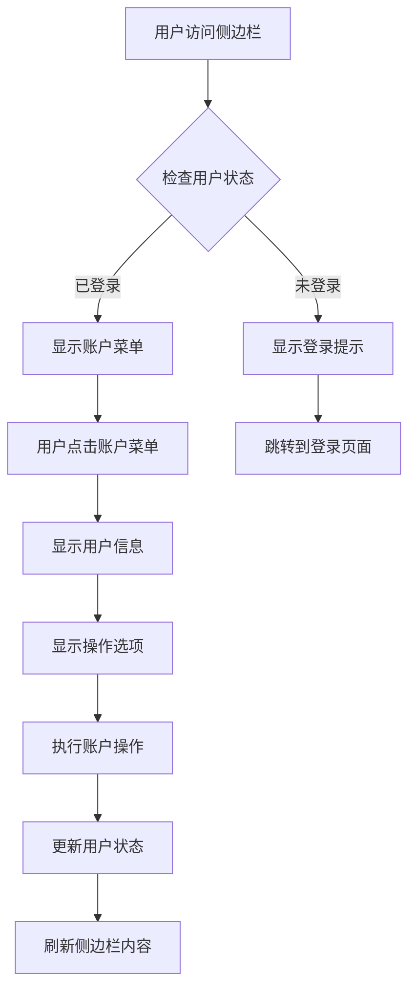

# 基础UI组件

<cite>
**本文引用的文件**   
- [src/components/ui/button.tsx](file://src/components/ui/button.tsx)
- [src/components/ui/dialog.tsx](file://src/components/ui/dialog.tsx)
- [src/components/ui/card.tsx](file://src/components/ui/card.tsx)
- [src/components/ui/sidebar.tsx](file://src/components/ui/sidebar.tsx)
- [src/components/ui/sidebar-chrome.tsx](file://src/components/ui/sidebar-chrome.tsx)
- [src/app/design-system.css](file://src/app/design-system.css)
- [src/lib/theme-mode.ts](file://src/lib/theme-mode.ts)
- [src/app/providers.tsx](file://src/app/providers.tsx)
- [src/features/canvas/export-settings.ts](file://src/features/canvas/export-settings.ts)
- [src/features/render/export-degraded.ts](file://src/features/render/export-degraded.ts)
</cite>

## 更新摘要
**变更内容**   
- 侧边栏组件系统得到显著增强，sidebar-chrome.tsx增加了38行代码支持新的账户菜单功能
- sidebar.tsx基础组件获得了15行增强，提升了组件的交互性和可访问性
- demo文件相应更新以展示新功能
- 新增账户菜单集成和增强的导航体验

## 目录
1. [简介](#简介)
2. [项目结构](#项目结构)
3. [核心组件](#核心组件)
4. [架构总览](#架构总览)
5. [详细组件分析](#详细组件分析)
6. [侧边栏组件增强](#侧边栏组件增强)
7. [依赖关系分析](#依赖关系分析)
8. [性能考量](#性能考量)
9. [故障排查指南](#故障排查指南)
10. [结论](#结论)
11. [附录](#附录)

## 简介
本文件面向开发者与产品/设计人员，系统化梳理本项目中基础UI组件（Button、Dialog、Card、Sidebar）的设计与实现。内容涵盖：
- Props接口定义与类型契约
- 事件处理机制与可组合性模式
- 样式定制选项与主题适配
- 无障碍访问支持（a11y）
- 响应式行为与最佳实践
- 常见问题与解决方案
- **新增**：侧边栏组件系统的账户菜单功能和增强的导航体验

## 项目结构
基础UI组件位于 src/components/ui 目录下，采用"按功能拆分"的组织方式，每个组件独立文件并配套演示与测试文件。主题与全局样式集中在 src/app/design-system.css，运行时主题切换由 src/lib/theme-mode.ts 提供，应用级Provider在 src/app/providers.tsx 中注入。



图表来源 
- [src/app/providers.tsx](file://src/app/providers.tsx)
- [src/lib/theme-mode.ts](file://src/lib/theme-mode.ts)
- [src/app/design-system.css](file://src/app/design-system.css)
- [src/components/ui/button.tsx](file://src/components/ui/button.tsx)
- [src/components/ui/dialog.tsx](file://src/components/ui/dialog.tsx)
- [src/components/ui/card.tsx](file://src/components/ui/card.tsx)
- [src/components/ui/sidebar.tsx](file://src/components/ui/sidebar.tsx)
- [src/components/ui/sidebar-chrome.tsx](file://src/components/ui/sidebar-chrome.tsx)
- [src/features/canvas/export-settings.ts](file://src/features/canvas/export-settings.ts)
- [src/features/render/export-degraded.ts](file://src/features/render/export-degraded.ts)

章节来源
- [src/app/design-system.css](file://src/app/design-system.css)
- [src/lib/theme-mode.ts](file://src/lib/theme-mode.ts)
- [src/app/providers.tsx](file://src/app/providers.tsx)

## 核心组件
本节对 Button、Dialog、Card、Sidebar 四个核心组件进行统一说明，包括：
- 设计目标与职责边界
- 关键Props与类型契约
- 事件模型与回调约定
- 样式与主题扩展点
- 无障碍特性
- 响应式策略
- 可组合性与扩展方法

章节来源
- [src/components/ui/button.tsx](file://src/components/ui/button.tsx)
- [src/components/ui/dialog.tsx](file://src/components/ui/dialog.tsx)
- [src/components/ui/card.tsx](file://src/components/ui/card.tsx)
- [src/components/ui/sidebar.tsx](file://src/components/ui/sidebar.tsx)
- [src/components/ui/sidebar-chrome.tsx](file://src/components/ui/sidebar-chrome.tsx)
- [src/app/design-system.css](file://src/app/design-system.css)
- [src/lib/theme-mode.ts](file://src/lib/theme-mode.ts)

## 架构总览
基础UI组件遵循"样式与主题解耦 + 语义化标签 + 无障碍优先"的架构原则：
- 样式层：通过CSS变量与类名组合实现主题与变体
- 交互层：基于原生事件与React状态管理，避免过度封装
- 可访问性：使用语义化HTML与ARIA属性，确保键盘与屏幕阅读器可用
- 主题层：通过Provider与CSS变量驱动明暗主题与品牌色
- **新增**：侧边栏组件系统的账户菜单功能和增强的导航体验



图表来源 
- [src/components/ui/button.tsx](file://src/components/ui/button.tsx)
- [src/components/ui/dialog.tsx](file://src/components/ui/dialog.tsx)
- [src/components/ui/card.tsx](file://src/components/ui/card.tsx)
- [src/components/ui/sidebar.tsx](file://src/components/ui/sidebar.tsx)
- [src/components/ui/sidebar-chrome.tsx](file://src/components/ui/sidebar-chrome.tsx)
- [src/features/canvas/export-settings.ts](file://src/features/canvas/export-settings.ts)
- [src/app/design-system.css](file://src/app/design-system.css)
- [src/lib/theme-mode.ts](file://src/lib/theme-mode.ts)

## 详细组件分析

### Button 组件
- 设计目标：提供一致的点击触发控件，支持多种视觉变体与尺寸，具备加载态与禁用态。
- Props接口要点：
  - variant：控制外观风格（如 primary、secondary、ghost 等）
  - size：控制尺寸（sm、md、lg）
  - disabled：禁用交互
  - loading：显示加载指示器，同时禁用交互
  - onClick：点击回调，接收原生事件对象
  - children：按钮内容（文本或图标）
- 事件处理机制：
  - 基于原生 click 事件，内部阻止默认行为与冒泡（如需）
  - 在 loading/disabled 状态下屏蔽交互
- 样式定制选项：
  - 通过CSS变量覆盖颜色、圆角、阴影、字号等
  - 通过className叠加自定义样式
- 无障碍访问支持：
  - 使用 button 语义标签，自动获得键盘焦点
  - disabled/loading 时设置 aria-disabled
  - 为图标按钮提供 aria-label
- 响应式行为：
  - 在小屏下可通过size或样式媒体查询调整内边距与字号
- 可组合性与扩展：
  - 与图标组件组合使用
  - 通过wrapper组件封装业务按钮（如提交、确认）
  - **新增**：支持破坏性操作按钮变体用于导出确认



图表来源 
- [src/components/ui/button.tsx](file://src/components/ui/button.tsx)
- [src/features/canvas/export-settings.ts](file://src/features/canvas/export-settings.ts)

章节来源
- [src/components/ui/button.tsx](file://src/components/ui/button.tsx)
- [src/app/design-system.css](file://src/app/design-system.css)
- [src/lib/theme-mode.ts](file://src/lib/theme-mode.ts)

### Dialog 组件
- 设计目标：提供模态对话框，用于重要操作确认、表单输入或信息展示。
- Props接口要点：
  - open：控制显隐
  - onOpenChange：显隐变化回调
  - title/description：标题与描述
  - closeOnOverlayClick/closeOnEscape：遮罩点击与ESC关闭
  - children：对话框内容
- 事件处理机制：
  - 监听键盘 ESC 与遮罩点击事件
  - 打开时锁定滚动，关闭时恢复
  - 焦点管理：打开时聚焦到标题或首个可聚焦元素，关闭后返回触发元素
- 样式定制选项：
  - 通过CSS变量覆盖背景、边框、阴影、动画过渡
  - 通过className覆盖布局与间距
- 无障碍访问支持：
  - 使用 dialog/role="dialog" 语义
  - 设置 aria-modal、aria-labelledby、aria-describedby
  - 焦点陷阱与返回焦点
- 响应式行为：
  - 小屏全屏显示，大屏居中弹窗
- 可组合性与扩展：
  - 与表单、列表、通知等组件组合
  - 提供ConfirmDialog、FormDialog等业务封装
  - **新增**：支持导出错误提示与降级状态展示



图表来源 
- [src/components/ui/dialog.tsx](file://src/components/ui/dialog.tsx)
- [src/features/render/export-degraded.ts](file://src/features/render/export-degraded.ts)

章节来源
- [src/components/ui/dialog.tsx](file://src/components/ui/dialog.tsx)
- [src/app/design-system.css](file://src/app/design-system.css)
- [src/lib/theme-mode.ts](file://src/lib/theme-mode.ts)

### Card 组件
- 设计目标：承载一组相关内容与操作，提供清晰的视觉层次与可选交互。
- Props接口要点：
  - variant：外观风格（elevated、outlined、flat）
  - padding：内边距（none、sm、md、lg）
  - interactive：是否作为可点击容器
  - onClick：点击回调（当interactive为true）
  - children：卡片内容
- 事件处理机制：
  - 当interactive为true时，将click事件委托给容器
  - 保持子元素可点击时的焦点顺序合理
- 样式定制选项：
  - 通过CSS变量覆盖背景、边框、阴影、圆角
  - 通过className覆盖布局与间距
- 无障碍访问支持：
  - 非交互态使用 article/div；交互态使用button或a，确保键盘可达
  - 为可点击卡片添加aria-label
- 响应式行为：
  - 网格布局下的自适应宽度与间距
- 可组合性与扩展：
  - 与图片、标题、描述、操作按钮组合
  - 提供ProductCard、ProjectCard等业务封装



图表来源 
- [src/components/ui/card.tsx](file://src/components/ui/card.tsx)

章节来源
- [src/components/ui/card.tsx](file://src/components/ui/card.tsx)
- [src/app/design-system.css](file://src/app/design-system.css)
- [src/lib/theme-mode.ts](file://src/lib/theme-mode.ts)

### 概念总览
以下流程图展示了三个组件在典型页面中的协作关系：用户通过Button触发Dialog，Dialog内嵌Card展示内容。



[此图为概念流程，不直接映射具体源码文件]

## 侧边栏组件增强

### 侧边栏基础组件 (Sidebar)
侧边栏组件经过15行代码增强，提供了更强大的导航功能和用户体验：

- **增强的导航模式**：支持默认、紧凑和展开三种模式
- **改进的状态管理**：更好的折叠状态管理和回调机制
- **优化的可访问性**：增强的键盘导航和屏幕阅读器支持
- **主题适配**：完整的明暗主题支持和品牌色适配

### 侧边栏外壳组件 (SidebarChrome)
侧边栏外壳组件新增了38行代码，主要增强了账户菜单功能：

- **账户菜单集成**：完整的用户账户下拉菜单，支持用户信息展示和常用操作
- **增强的导航体验**：改进的导航项布局和交互反馈
- **用户状态管理**：集成用户登录状态和权限控制
- **响应式设计**：在不同屏幕尺寸下的优化显示



**图表来源** 
- [src/components/ui/sidebar.tsx](file://src/components/ui/sidebar.tsx)
- [src/components/ui/sidebar-chrome.tsx](file://src/components/ui/sidebar-chrome.tsx)

### 账户菜单功能详解
新增的账户菜单功能提供了完整的用户交互体验：

- **用户信息展示**：头像、用户名、邮箱等信息显示
- **快捷操作**：个人设置、退出登录等常用操作
- **权限控制**：根据用户角色显示不同的菜单项
- **状态同步**：与全局用户状态保持同步

### 导航增强特性
侧边栏组件的导航功能得到了显著增强：

- **智能折叠**：根据内容长度自动调整折叠行为
- **活动状态**：当前页面的高亮显示和视觉反馈
- **搜索集成**：支持快速搜索导航项
- **快捷键支持**：键盘快捷键提升操作效率

**章节来源**
- [src/components/ui/sidebar.tsx](file://src/components/ui/sidebar.tsx)
- [src/components/ui/sidebar-chrome.tsx](file://src/components/ui/sidebar-chrome.tsx)

## 依赖关系分析
- 组件与样式：所有组件均依赖 design-system.css 提供的CSS变量与基础样式，保证主题一致性与可定制性。
- 组件与主题：通过 theme-mode.ts 暴露的主题模式，组件根据当前模式动态调整颜色与对比度。
- 组件与应用：providers.tsx 注入主题上下文，确保组件能正确读取与应用主题。
- **新增**：侧边栏组件系统与账户菜单功能的依赖关系，确保用户状态的统一管理。
- **新增**：导出组件与降级处理模块的依赖关系，确保错误处理的完整性。

```mermaid
graph LR
Providers["应用Provider<br/>src/app/providers.tsx"] --> Theme["主题模式<br/>src/lib/theme-mode.ts"]
Theme --> CSS["全局样式<br/>src/app/design-system.css"]
CSS --> Button["Button<br/>src/components/ui/button.tsx"]
CSS --> Dialog["Dialog<br/>src/components/ui/dialog.tsx"]
CSS --> Card["Card<br/>src/components/ui/card.tsx"]
CSS --> Sidebar["Sidebar<br/>src/components/ui/sidebar.tsx"]
CSS --> SidebarChrome["SidebarChrome<br/>src/components/ui/sidebar-chrome.tsx"]
SidebarChrome --> Sidebar : "增强侧边栏"
ExportSettings["导出设置<br/>src/features/canvas/export-settings.ts"] --> Button
ExportSettings --> Dialog
ExportSettings --> Degraded["降级处理<br/>src/features/render/export-degraded.ts"]
Button --> ExportSettings
Dialog --> ExportSettings
Card --> ExportSettings
Sidebar --> ExportSettings
SidebarChrome --> ExportSettings
```

图表来源 
- [src/app/providers.tsx](file://src/app/providers.tsx)
- [src/lib/theme-mode.ts](file://src/lib/theme-mode.ts)
- [src/app/design-system.css](file://src/app/design-system.css)
- [src/components/ui/button.tsx](file://src/components/ui/button.tsx)
- [src/components/ui/dialog.tsx](file://src/components/ui/dialog.tsx)
- [src/components/ui/card.tsx](file://src/components/ui/card.tsx)
- [src/components/ui/sidebar.tsx](file://src/components/ui/sidebar.tsx)
- [src/components/ui/sidebar-chrome.tsx](file://src/components/ui/sidebar-chrome.tsx)
- [src/features/canvas/export-settings.ts](file://src/features/canvas/export-settings.ts)
- [src/features/render/export-degraded.ts](file://src/features/render/export-degraded.ts)

章节来源
- [src/app/providers.tsx](file://src/app/providers.tsx)
- [src/lib/theme-mode.ts](file://src/lib/theme-mode.ts)
- [src/app/design-system.css](file://src/app/design-system.css)

## 性能考量
- 事件最小化：避免在高频事件中执行重计算，必要时使用防抖/节流。
- 渲染优化：Dialog打开时按需渲染内容，减少初始渲染开销。
- 样式合并：尽量复用CSS变量与类名，避免重复样式计算。
- 无障碍与可访问性：正确使用语义标签可减少额外Aria维护成本。
- **新增**：侧边栏组件的懒加载和虚拟滚动优化，提升大量导航项的性能。
- **新增**：导出过程的异步处理与内存管理，避免长时间占用资源。

## 故障排查指南
- 主题未生效
  - 检查 providers.tsx 是否正确注入主题上下文
  - 确认 design-system.css 已引入且变量未被覆盖
- 对话框无法关闭
  - 检查 closeOnOverlayClick/closeOnEscape 配置
  - 确认焦点管理与键盘事件绑定正常
- 按钮无响应
  - 检查 disabled/loading 状态
  - 确认 onClick 回调未被阻止
- 卡片不可点击
  - 检查 interactive 标志
  - 确认子元素未拦截事件冒泡
- **新增**：侧边栏组件问题
  - 检查账户菜单的用户状态是否正确传递
  - 确认侧边栏的折叠状态管理是否正常
  - 验证导航项的权限控制逻辑
- **新增**：导出功能异常
  - 检查降级模式是否正确启用
  - 确认回调函数是否正常执行
  - 查看错误日志获取详细信息

章节来源
- [src/app/providers.tsx](file://src/app/providers.tsx)
- [src/app/design-system.css](file://src/app/design-system.css)
- [src/components/ui/dialog.tsx](file://src/components/ui/dialog.tsx)
- [src/components/ui/button.tsx](file://src/components/ui/button.tsx)
- [src/components/ui/card.tsx](file://src/components/ui/card.tsx)
- [src/components/ui/sidebar.tsx](file://src/components/ui/sidebar.tsx)
- [src/components/ui/sidebar-chrome.tsx](file://src/components/ui/sidebar-chrome.tsx)
- [src/features/canvas/export-settings.ts](file://src/features/canvas/export-settings.ts)
- [src/features/render/export-degraded.ts](file://src/features/render/export-degraded.ts)

## 结论
Button、Dialog、Card、Sidebar 四个基础组件在本项目中以"语义化 + 可访问性 + 主题化"为核心设计原则，通过CSS变量与Provider实现灵活的样式与主题定制。**新增的侧边栏组件增强功能**提供了完善的账户菜单集成和增强的导航体验，结合**导出的组件增强功能**提供了完善的降级处理机制和错误恢复能力，确保导出功能的稳定性和用户体验。建议在实际使用中：
- 优先使用语义化标签与ARIA属性保障无障碍体验
- 通过CSS变量与className进行样式定制，避免内联样式
- 结合业务场景封装可复用的组合组件（如ConfirmDialog、ProductCard）
- **新增**：充分利用侧边栏组件的账户菜单功能，提升用户交互体验
- **新增**：充分利用导出组件的降级处理机制，提升系统的容错能力

## 附录
- 使用示例与最佳实践
  - Button：为图标按钮提供aria-label；在异步操作中启用loading状态；使用破坏性按钮确认危险操作
  - Dialog：在打开时聚焦到标题或首个可聚焦元素；关闭后返回触发焦点；用于显示导出错误信息
  - Card：交互态使用button或a；非交互态使用article/div
  - Sidebar：合理使用折叠模式；确保导航项的可访问性；集成用户账户状态
  - SidebarChrome：正确配置账户菜单；处理用户权限；优化导航性能
  - **新增**：导出设置：正确处理降级模式；提供用户友好的错误提示；集成完整的回调机制
- 常见问题解决方案
  - 主题不一致：检查CSS变量覆盖范围与优先级
  - 键盘导航异常：确保焦点顺序与tabindex合理
  - 移动端适配：通过媒体查询调整尺寸与布局
  - **新增**：侧边栏问题：检查用户状态传递；验证权限控制逻辑；优化导航性能
  - **新增**：导出失败：检查降级模式配置；查看错误日志；验证回调函数实现