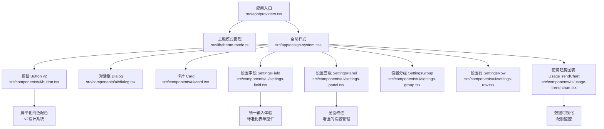
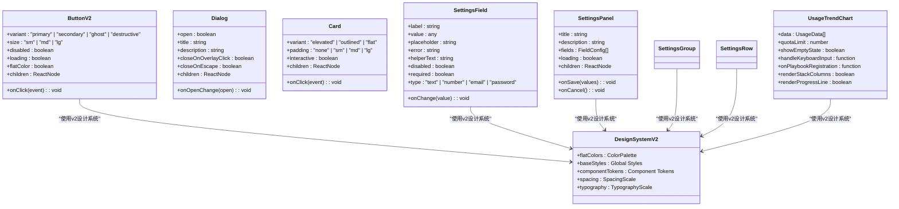
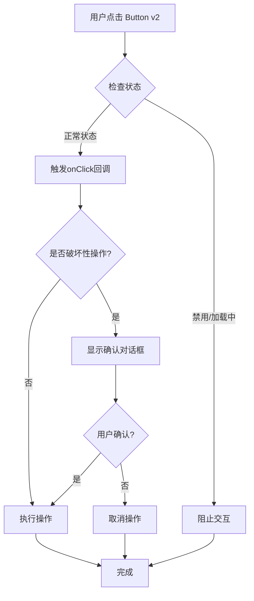
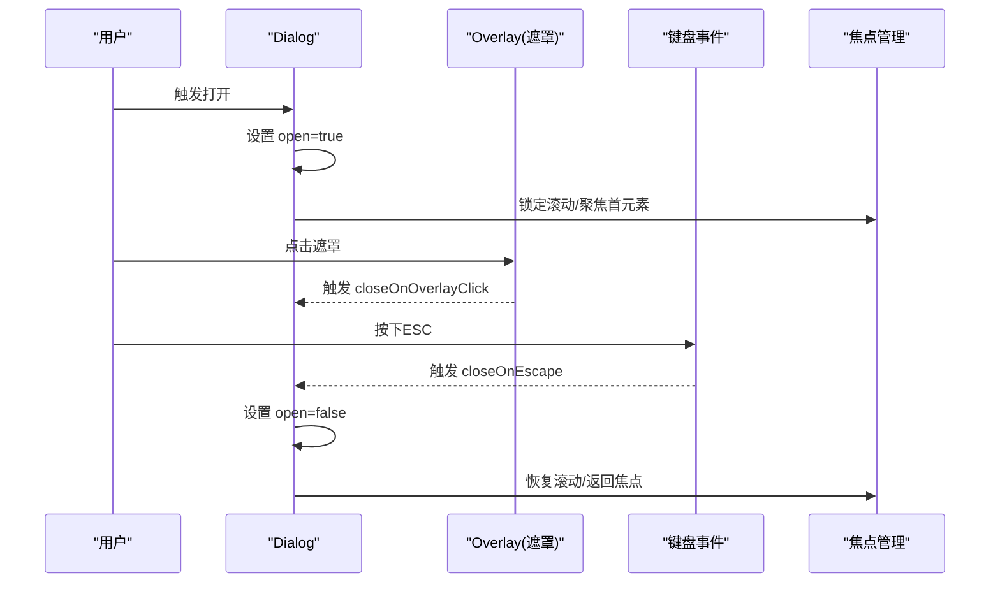
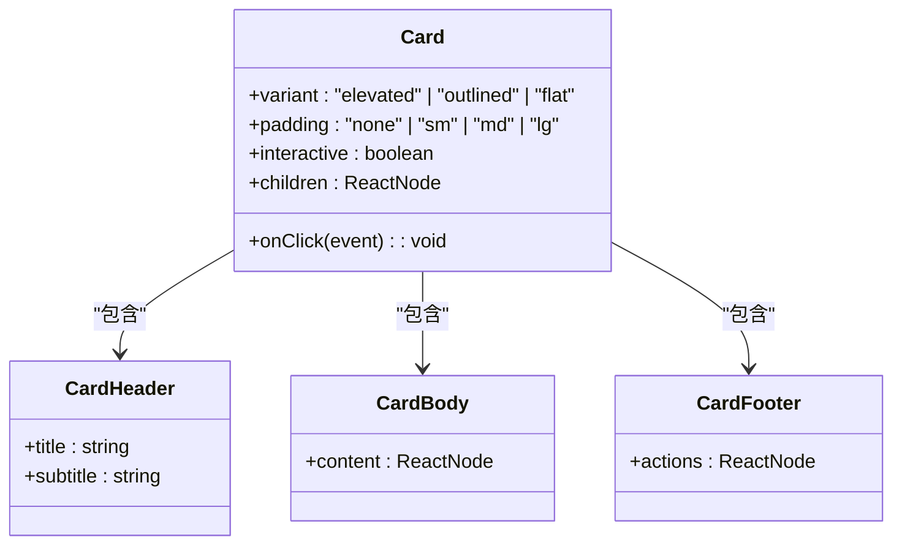

# 基础UI组件

<cite>
**本文引用的文件**   
- [src/components/ui/button.tsx](file://src/components/ui/button.tsx)
- [src/components/ui/dialog.tsx](file://src/components/ui/dialog.tsx)
- [src/components/ui/card.tsx](file://src/components/ui/card.tsx)
- [src/components/ui/settings-field.tsx](file://src/components/ui/settings-field.tsx)
- [src/components/ui/settings-panel.tsx](file://src/components/ui/settings-panel.tsx)
- [src/components/ui/settings-group.tsx](file://src/components/ui/settings-group.tsx)
- [src/components/ui/settings-row.tsx](file://src/components/ui/settings-row.tsx)
- [src/components/ui/usage-trend-chart.tsx](file://src/components/ui/usage-trend-chart.tsx)
- [src/app/design-system.css](file://src/app/design-system.css)
- [src/lib/theme-mode.ts](file://src/lib/theme-mode.ts)
- [src/app/providers.tsx](file://src/app/providers.tsx)
</cite>

## 更新摘要
**变更内容**   
- Button组件采用v2设计系统，引入扁平化纯色配色方案
- 新增SettingsField基础组件，提供统一的设置字段输入体验
- SettingsPanel组件得到全面改进，支持更丰富的设置项管理
- 新增SettingsGroup和SettingsRow组件，优化设置界面的组织结构
- **新增**：UsageTrendChart组件，显示累计配额进度线和每日调用堆栈列
- 整体UI组件现代化升级，提升视觉一致性和用户体验

## 目录
1. [简介](#简介)
2. [项目结构](#项目结构)
3. [核心组件](#核心组件)
4. [架构总览](#架构总览)
5. [详细组件分析](#详细组件分析)
6. [Button v2设计系统](#button-v2设计系统)
7. [SettingsField基础组件](#settingsfield基础组件)
8. [SettingsPanel全面改进](#settingspanel全面改进)
9. [UsageTrendChart数据可视化组件](#usagetrendchart数据可视化组件)
10. [依赖关系分析](#依赖关系分析)
11. [性能考量](#性能考量)
12. [故障排查指南](#故障排查指南)
13. [结论](#结论)
14. [附录](#附录)

## 简介
本文件面向开发者与产品/设计人员，系统化梳理本项目中基础UI组件（Button、Dialog、Card、SettingsField、SettingsPanel、UsageTrendChart等）的设计与实现。内容涵盖：
- Props接口定义与类型契约
- 事件处理机制与可组合性模式
- 样式定制选项与主题适配
- 无障碍访问支持（a11y）
- 响应式行为与最佳实践
- 常见问题与解决方案
- **新增**：Button v2设计系统与扁平化纯色配色
- **新增**：SettingsField基础组件的统一输入体验
- **新增**：SettingsPanel的全面改进与增强功能
- **新增**：UsageTrendChart数据可视化组件的配额监控功能

## 项目结构
基础UI组件位于 src/components/ui 目录下，采用"按功能拆分"的组织方式，每个组件独立文件并配套演示与测试文件。主题与全局样式集中在 src/app/design-system.css，运行时主题切换由 src/lib/theme-mode.ts 提供，应用级Provider在 src/app/providers.tsx 中注入。



**章节来源**
- [src/app/providers.tsx](file://src/app/providers.tsx)
- [src/lib/theme-mode.ts](file://src/lib/theme-mode.ts)
- [src/app/design-system.css](file://src/app/design-system.css)
- [src/components/ui/button.tsx](file://src/components/ui/button.tsx)
- [src/components/ui/dialog.tsx](file://src/components/ui/dialog.tsx)
- [src/components/ui/card.tsx](file://src/components/ui/card.tsx)
- [src/components/ui/settings-field.tsx](file://src/components/ui/settings-field.tsx)
- [src/components/ui/settings-panel.tsx](file://src/components/ui/settings-panel.tsx)
- [src/components/ui/settings-group.tsx](file://src/components/ui/settings-group.tsx)
- [src/components/ui/settings-row.tsx](file://src/components/ui/settings-row.tsx)
- [src/components/ui/usage-trend-chart.tsx](file://src/components/ui/usage-trend-chart.tsx)

## 核心组件
本节对 Button v2、Dialog、Card、SettingsField、SettingsPanel、UsageTrendChart 等核心组件进行统一说明，包括：
- 设计目标与职责边界
- 关键Props与类型契约
- 事件模型与回调约定
- 样式与主题扩展点
- 无障碍特性
- 响应式策略
- 可组合性与扩展方法

**章节来源**
- [src/components/ui/button.tsx](file://src/components/ui/button.tsx)
- [src/components/ui/dialog.tsx](file://src/components/ui/dialog.tsx)
- [src/components/ui/card.tsx](file://src/components/ui/card.tsx)
- [src/components/ui/settings-field.tsx](file://src/components/ui/settings-field.tsx)
- [src/components/ui/settings-panel.tsx](file://src/components/ui/settings-panel.tsx)
- [src/components/ui/settings-group.tsx](file://src/components/ui/settings-group.tsx)
- [src/components/ui/settings-row.tsx](file://src/components/ui/settings-row.tsx)
- [src/components/ui/usage-trend-chart.tsx](file://src/components/ui/usage-trend-chart.tsx)
- [src/app/design-system.css](file://src/app/design-system.css)
- [src/lib/theme-mode.ts](file://src/lib/theme-mode.ts)

## 架构总览
基础UI组件遵循"样式与主题解耦 + 语义化标签 + 无障碍优先 + 设计系统驱动"的架构原则：
- 样式层：通过CSS变量与类名组合实现主题与变体，支持v2设计系统
- 交互层：基于原生事件与React状态管理，避免过度封装
- 可访问性：使用语义化HTML与ARIA属性，确保键盘与屏幕阅读器可用
- 主题层：通过Provider与CSS变量驱动明暗主题与品牌色
- **新增**：v2设计系统提供扁平化纯色配色方案
- **新增**：SettingsField组件提供统一的设置字段输入体验
- **新增**：UsageTrendChart组件提供数据可视化能力



**图表来源** 
- [src/components/ui/button.tsx](file://src/components/ui/button.tsx)
- [src/components/ui/dialog.tsx](file://src/components/ui/dialog.tsx)
- [src/components/ui/card.tsx](file://src/components/ui/card.tsx)
- [src/components/ui/settings-field.tsx](file://src/components/ui/settings-field.tsx)
- [src/components/ui/settings-panel.tsx](file://src/components/ui/settings-panel.tsx)
- [src/components/ui/settings-group.tsx](file://src/components/ui/settings-group.tsx)
- [src/components/ui/settings-row.tsx](file://src/components/ui/settings-row.tsx)
- [src/components/ui/usage-trend-chart.tsx](file://src/components/ui/usage-trend-chart.tsx)
- [src/app/design-system.css](file://src/app/design-system.css)

## 详细组件分析

### Button v2 组件
- 设计目标：提供一致的点击触发控件，采用v2设计系统的扁平化纯色配色方案，支持多种视觉变体与尺寸，具备加载态与禁用态。
- Props接口要点：
  - variant：控制外观风格（如 primary、secondary、ghost、destructive 等）
  - size：控制尺寸（sm、md、lg）
  - disabled：禁用交互
  - loading：显示加载指示器，同时禁用交互
  - flatColor：启用v2设计系统的扁平化纯色配色
  - onClick：点击回调，接收原生事件对象
  - children：按钮内容（文本或图标）
- 事件处理机制：
  - 基于原生 click 事件，内部阻止默认行为与冒泡（如需）
  - 在 loading/disabled 状态下屏蔽交互
- 样式定制选项：
  - 通过CSS变量覆盖颜色、圆角、阴影、字号等
  - 通过className叠加自定义样式
  - **新增**：支持v2设计系统的扁平化纯色配色方案
- 无障碍访问支持：
  - 使用 button 语义标签，自动获得键盘焦点
  - disabled/loading 时设置 aria-disabled
  - 为图标按钮提供 aria-label
- 响应式行为：
  - 在小屏下可通过size或样式媒体查询调整内边距与字号
- 可组合性与扩展：
  - 与图标组件组合使用
  - 通过wrapper组件封装业务按钮（如提交、确认）



**章节来源**   
- [src/components/ui/button.tsx](file://src/components/ui/button.tsx)
- [src/app/design-system.css](file://src/app/design-system.css)
- [src/lib/theme-mode.ts](file://src/lib/theme-mode.ts)

### Dialog 组件
- 设计目标：提供模态对话框，用于重要操作确认、表单输入或信息展示。
- Props接口要点：
  - open：控制显隐
  - onOpenChange：显隐变化回调
  - title/description：标题与描述
  - closeOnOverlayClick/closeOnEscape：遮罩点击与ESC关闭
  - children：对话框内容
- 事件处理机制：
  - 监听键盘 ESC 与遮罩点击事件
  - 打开时锁定滚动，关闭时恢复
  - 焦点管理：打开时聚焦到标题或首个可聚焦元素，关闭后返回触发元素
- 样式定制选项：
  - 通过CSS变量覆盖背景、边框、阴影、动画过渡
  - 通过className覆盖布局与间距
- 无障碍访问支持：
  - 使用 dialog/role="dialog" 语义
  - 设置 aria-modal、aria-labelledby、aria-describedby
  - 焦点陷阱与返回焦点
- 响应式行为：
  - 小屏全屏显示，大屏居中弹窗
- 可组合性与扩展：
  - 与表单、列表、通知等组件组合
  - 提供ConfirmDialog、FormDialog等业务封装



**章节来源**   
- [src/components/ui/dialog.tsx](file://src/components/ui/dialog.tsx)
- [src/app/design-system.css](file://src/app/design-system.css)
- [src/lib/theme-mode.ts](file://src/lib/theme-mode.ts)

### Card 组件
- 设计目标：承载一组相关内容与操作，提供清晰的视觉层次与可选交互。
- Props接口要点：
  - variant：外观风格（elevated、outlined、flat）
  - padding：内边距（none、sm、md、lg）
  - interactive：是否作为可点击容器
  - onClick：点击回调（当interactive为true）
  - children：卡片内容
- 事件处理机制：
  - 当interactive为true时，将click事件委托给容器
  - 保持子元素可点击时的焦点顺序合理
- 样式定制选项：
  - 通过CSS变量覆盖背景、边框、阴影、圆角
  - 通过className覆盖布局与间距
- 无障碍访问支持：
  - 非交互态使用 article/div；交互态使用button或a，确保键盘可达
  - 为可点击卡片添加aria-label
- 响应式行为：
  - 网格布局下的自适应宽度与间距
- 可组合性与扩展：
  - 与图片、标题、描述、操作按钮组合
  - 提供ProductCard、ProjectCard等业务封装



**章节来源**   
- [src/components/ui/card.tsx](file://src/components/ui/card.tsx)
- [src/app/design-system.css](file://src/app/design-system.css)
- [src/lib/theme-mode.ts](file://src/lib/theme-mode.ts)

## Button v2设计系统

### 设计理念
Button v2设计系统引入了现代化的扁平化纯色配色方案，强调简洁、直观和一致性：

- **扁平化设计**：去除多余的阴影和渐变，采用纯色填充
- **色彩系统**：建立完整的色彩调色板，支持明暗主题适配
- **视觉层次**：通过颜色和尺寸建立清晰的操作优先级
- **可访问性**：确保足够的对比度和键盘导航支持

### 配色方案
v2设计系统提供了丰富的色彩选择：

- **主色调**：品牌主色用于主要操作
- **次要色**：辅助色用于次要操作
- **中性色**：用于文本、边框和背景
- **状态色**：成功、警告、错误等状态反馈
- **深色模式**：完整的明暗主题支持

### 尺寸规范
Button v2支持三种标准尺寸：

- **Small (sm)**：适用于紧凑布局和工具栏
- **Medium (md)**：默认尺寸，适用于大多数场景
- **Large (lg)**：用于重要操作和引导性按钮

### 变体类型
- **Primary**：主要操作，使用品牌主色
- **Secondary**：次要操作，使用中性色
- **Ghost**：幽灵按钮，无边框无填充
- **Destructive**：破坏性操作，使用红色系
- **Outline**：轮廓按钮，仅显示边框

**章节来源**   
- [src/components/ui/button.tsx](file://src/components/ui/button.tsx)
- [src/app/design-system.css](file://src/app/design-system.css)

## SettingsField基础组件

### 组件概述
SettingsField是一个专门用于设置界面的基础输入组件，提供统一的输入体验和验证机制：

- **统一的输入体验**：标准化的标签、输入框、错误提示和帮助文本
- **灵活的输入类型**：支持文本、数字、邮箱、密码等多种输入类型
- **内置验证**：提供必填验证、格式验证和自定义验证规则
- **无障碍支持**：完整的ARIA属性和键盘导航支持

### Props接口
SettingsField组件提供丰富的配置选项：

- **label**：字段标签文本
- **value**：当前值
- **onChange**：值变化回调函数
- **placeholder**：占位符文本
- **error**：错误消息
- **helperText**：帮助文本
- **disabled**：禁用状态
- **required**：必填标记
- **type**：输入类型（text、number、email、password等）

### 使用示例
SettingsField组件的典型使用方式：

```tsx
<SettingsField
  label="API密钥"
  value={apiKey}
  onChange={setApiKey}
  placeholder="请输入您的API密钥"
  error={errors.apiKey}
  helperText="您可以在账户设置中找到API密钥"
  required
  type="password"
/>
```

### 验证机制
SettingsField内置了强大的验证机制：

- **必填验证**：通过required属性启用
- **格式验证**：根据输入类型自动验证格式
- **自定义验证**：通过onChange回调实现自定义逻辑
- **错误显示**：统一的错误消息展示

**章节来源**   
- [src/components/ui/settings-field.tsx](file://src/components/ui/settings-field.tsx)
- [src/app/design-system.css](file://src/app/design-system.css)

## SettingsPanel全面改进

### 组件架构
SettingsPanel经过全面改进，提供了更强大和灵活的设置界面管理能力：

- **模块化设计**：支持嵌套的SettingsGroup和SettingsRow组件
- **数据绑定**：双向数据绑定和实时验证
- **状态管理**：内置的状态管理和错误处理
- **响应式布局**：适配不同屏幕尺寸的布局

### 核心功能
- **分组管理**：通过SettingsGroup组织相关的设置项
- **行布局**：通过SettingsRow排列设置项和对应操作
- **表单验证**：集成SettingsField的验证机制
- **保存状态**：支持保存中的加载状态和成功/失败反馈

### 使用模式
SettingsPanel的典型使用模式：

```tsx
<SettingsPanel
  title="AI模型设置"
  description="配置AI模型的参数和行为"
  onSave={handleSave}
  onCancel={handleCancel}
  loading={isSaving}
>
  <SettingsGroup title="模型配置">
    <SettingsRow label="模型名称" action={<ModelSelector />}>
      <SettingsField
        label="温度"
        value={temperature}
        onChange={setTemperature}
        type="number"
        min={0}
        max={1}
        step={0.1}
      />
    </SettingsRow>
  </SettingsGroup>
</SettingsPanel>
```

### 改进特性
- **增强的用户体验**：更直观的界面和操作流程
- **更好的可访问性**：完整的键盘导航和屏幕阅读器支持
- **性能优化**：按需渲染和状态管理优化
- **主题适配**：完整的明暗主题支持

**章节来源**   
- [src/components/ui/settings-panel.tsx](file://src/components/ui/settings-panel.tsx)
- [src/components/ui/settings-group.tsx](file://src/components/ui/settings-group.tsx)
- [src/components/ui/settings-row.tsx](file://src/components/ui/settings-row.tsx)
- [src/app/design-system.css](file://src/app/design-system.css)

## UsageTrendChart数据可视化组件

### 组件概述
UsageTrendChart是一个专门用于显示API使用趋势和数据可视化的组件，提供配额监控和使用量分析功能：

- **累计配额进度线**：直观显示当前配额使用情况，支持部分覆盖场景
- **每日调用堆栈列**：按日期维度展示调用量分布，便于趋势分析
- **空状态处理**：当无数据时显示友好的空状态提示
- **API失败处理**：优雅处理API请求失败的情况
- **键盘数字输入**：支持键盘操作的数值输入控件
- **Playbook注册工作流**：集成Playbook注册流程的交互支持

### 核心功能特性
- **数据可视化**：使用SVG或Canvas技术绘制趋势图和柱状图
- **交互式图表**：支持鼠标悬停查看详细信息
- **响应式设计**：自适应不同屏幕尺寸
- **主题适配**：支持明暗主题切换
- **无障碍访问**：完整的ARIA属性和键盘导航支持

### Props接口
UsageTrendChart组件提供丰富的配置选项：

- **data**：使用数据数组，包含日期和调用量信息
- **quotaLimit**：配额限制值，用于计算使用百分比
- **showEmptyState**：是否显示空状态
- **handleKeyboardInput**：键盘输入处理函数
- **onPlaybookRegistration**：Playbook注册回调函数
- **renderStackColumns**：是否渲染堆叠列
- **renderProgressLine**：是否渲染进度线

### 使用示例
UsageTrendChart组件的典型使用方式：

```tsx
<UsageTrendChart
  data={usageData}
  quotaLimit={1000}
  showEmptyState={!hasData}
  handleKeyboardInput={handleInput}
  onPlaybookRegistration={handleRegistration}
  renderStackColumns={true}
  renderProgressLine={true}
/>
```

### 数据格式
UsageTrendChart期望的数据结构：

```typescript
interface UsageData {
  date: string;
  calls: number;
  quotaUsed: number;
  quotaRemaining: number;
}
```

### 交互行为
- **鼠标悬停**：显示详细的调用信息和配额使用情况
- **键盘导航**：支持Tab键在图表元素间导航
- **数值输入**：支持键盘直接输入数值进行过滤或搜索
- **Playbook注册**：通过特定交互触发Playbook注册流程

**章节来源**   
- [src/components/ui/usage-trend-chart.tsx](file://src/components/ui/usage-trend-chart.tsx)
- [src/app/design-system.css](file://src/app/design-system.css)

## 依赖关系分析
- 组件与样式：所有组件均依赖 design-system.css 提供的CSS变量与基础样式，保证主题一致性与可定制性。
- 组件与主题：通过 theme-mode.ts 暴露的主题模式，组件根据当前模式动态调整颜色与对比度。
- 组件与应用：providers.tsx 注入主题上下文，确保组件能正确读取与应用主题。
- **新增**：Button v2设计系统与扁平化纯色配色的依赖关系。
- **新增**：SettingsField组件与验证机制的依赖关系。
- **新增**：SettingsPanel与SettingsGroup、SettingsRow的组合依赖关系。
- **新增**：UsageTrendChart组件与数据可视化库的依赖关系。

```mermaid
graph LR
Providers["应用Provider<br/>src/app/providers.tsx"] --> Theme["主题模式<br/>src/lib/theme-mode.ts"]
Theme --> CSS["全局样式<br/>src/app/design-system.css"]
CSS --> ButtonV2["Button v2<br/>src/components/ui/button.tsx"]
CSS --> Dialog["Dialog<br/>src/components/ui/dialog.tsx"]
CSS --> Card["Card<br/>src/components/ui/card.tsx"]
CSS --> SettingsField["SettingsField<br/>src/components/ui/settings-field.tsx"]
CSS --> SettingsPanel["SettingsPanel<br/>src/components/ui/settings-panel.tsx"]
CSS --> SettingsGroup["SettingsGroup<br/>src/components/ui/settings-group.tsx"]
CSS --> SettingsRow["SettingsRow<br/>src/components/ui/settings-row.tsx"]
CSS --> UsageTrendChart["UsageTrendChart<br/>src/components/ui/usage-trend-chart.tsx"]
ButtonV2 --> DesignSystemV2["v2设计系统<br/>扁平化纯色配色"]
SettingsPanel --> SettingsGroup : "包含"
SettingsPanel --> SettingsRow : "包含"
SettingsPanel --> SettingsField : "使用"
SettingsGroup --> SettingsRow : "包含"
SettingsRow --> SettingsField : "使用"
UsageTrendChart --> DataVisualization : "数据可视化"
UsageTrendChart --> KeyboardInput : "键盘输入处理"
UsageTrendChart --> PlaybookWorkflow : "Playbook工作流"
```

**图表来源** 
- [src/app/providers.tsx](file://src/app/providers.tsx)
- [src/lib/theme-mode.ts](file://src/lib/theme-mode.ts)
- [src/app/design-system.css](file://src/app/design-system.css)
- [src/components/ui/button.tsx](file://src/components/ui/button.tsx)
- [src/components/ui/dialog.tsx](file://src/components/ui/dialog.tsx)
- [src/components/ui/card.tsx](file://src/components/ui/card.tsx)
- [src/components/ui/settings-field.tsx](file://src/components/ui/settings-field.tsx)
- [src/components/ui/settings-panel.tsx](file://src/components/ui/settings-panel.tsx)
- [src/components/ui/settings-group.tsx](file://src/components/ui/settings-group.tsx)
- [src/components/ui/settings-row.tsx](file://src/components/ui/settings-row.tsx)
- [src/components/ui/usage-trend-chart.tsx](file://src/components/ui/usage-trend-chart.tsx)

**章节来源**
- [src/app/providers.tsx](file://src/app/providers.tsx)
- [src/lib/theme-mode.ts](file://src/lib/theme-mode.ts)
- [src/app/design-system.css](file://src/app/design-system.css)

## 性能考量
- 事件最小化：避免在高频事件中执行重计算，必要时使用防抖/节流。
- 渲染优化：Dialog打开时按需渲染内容，减少初始渲染开销。
- 样式合并：尽量复用CSS变量与类名，避免重复样式计算。
- 无障碍与可访问性：正确使用语义标签可减少额外Aria维护成本。
- **新增**：Button v2设计系统的样式优化，减少不必要的重绘。
- **新增**：SettingsField组件的受控组件优化，避免不必要的重新渲染。
- **新增**：SettingsPanel的懒加载和虚拟滚动优化，提升大量设置项的性能。
- **新增**：UsageTrendChart组件的虚拟化渲染，优化大数据集的性能表现。

## 故障排查指南
- 主题未生效
  - 检查 providers.tsx 是否正确注入主题上下文
  - 确认 design-system.css 已引入且变量未被覆盖
- 对话框无法关闭
  - 检查 closeOnOverlayClick/closeOnEscape 配置
  - 确认焦点管理与键盘事件绑定正常
- 按钮无响应
  - 检查 disabled/loading 状态
  - 确认 onClick 回调未被阻止
- 卡片不可点击
  - 检查 interactive 标志
  - 确认子元素未拦截事件冒泡
- **新增**：Button v2样式问题
  - 检查flatColor属性是否正确设置
  - 确认v2设计系统的CSS变量已正确加载
- **新增**：SettingsField验证问题
  - 检查onChange回调是否正确实现
  - 确认错误状态是否正确传递
- **新增**：SettingsPanel保存问题
  - 检查onSave回调是否正确实现
  - 确认表单验证是否通过
- **新增**：UsageTrendChart数据显示问题
  - 检查数据格式是否符合预期
  - 确认配额限制值设置正确
  - 验证API请求是否成功

**章节来源**   
- [src/app/providers.tsx](file://src/app/providers.tsx)
- [src/app/design-system.css](file://src/app/design-system.css)
- [src/components/ui/dialog.tsx](file://src/components/ui/dialog.tsx)
- [src/components/ui/button.tsx](file://src/components/ui/button.tsx)
- [src/components/ui/card.tsx](file://src/components/ui/card.tsx)
- [src/components/ui/settings-field.tsx](file://src/components/ui/settings-field.tsx)
- [src/components/ui/settings-panel.tsx](file://src/components/ui/settings-panel.tsx)
- [src/components/ui/usage-trend-chart.tsx](file://src/components/ui/usage-trend-chart.tsx)

## 结论
Button v2、Dialog、Card、SettingsField、SettingsPanel、UsageTrendChart等基础组件在本项目中以"语义化 + 可访问性 + 主题化 + 设计系统驱动"为核心设计原则，通过CSS变量与Provider实现灵活的样式与主题定制。**Button v2设计系统的扁平化纯色配色**提供了现代化的视觉体验，**SettingsField基础组件**实现了统一的设置字段输入体验，**SettingsPanel的全面改进**提供了强大的设置界面管理能力，**UsageTrendChart组件**提供了专业的数据可视化功能。建议在实际使用中：
- 优先使用语义化标签与ARIA属性保障无障碍体验
- 通过CSS变量与className进行样式定制，避免内联样式
- 结合业务场景封装可复用的组合组件
- **新增**：充分利用Button v2设计系统的扁平化配色方案
- **新增**：充分利用SettingsField组件的统一输入体验
- **新增**：充分利用SettingsPanel的强大设置管理能力
- **新增**：充分利用UsageTrendChart的数据可视化功能

## 附录
- 使用示例与最佳实践
  - Button v2：使用flatColor启用v2设计系统；为图标按钮提供aria-label；在异步操作中启用loading状态
  - Dialog：在打开时聚焦到标题或首个可聚焦元素；关闭后返回触发焦点
  - Card：交互态使用button或a；非交互态使用article/div
  - SettingsField：合理使用各种输入类型；实现完整的验证逻辑；提供清晰的错误提示
  - SettingsPanel：合理使用SettingsGroup和SettingsRow组织设置项；实现完整的保存流程
  - UsageTrendChart：正确格式化数据；处理空状态和API失败；实现键盘导航支持
  - **新增**：v2设计系统：理解扁平化配色理念；选择合适的按钮变体；确保足够的对比度
- 常见问题解决方案
  - 主题不一致：检查CSS变量覆盖范围与优先级
  - 键盘导航异常：确保焦点顺序与tabindex合理
  - 移动端适配：通过媒体查询调整尺寸与布局
  - **新增**：Button v2样式问题：检查CSS变量加载；确认设计系统初始化
  - **新增**：SettingsField验证问题：检查验证逻辑；确认错误状态管理
  - **新增**：SettingsPanel保存问题：检查保存逻辑；确认表单状态管理
  - **新增**：UsageTrendChart数据问题：检查数据格式；确认API连接状态