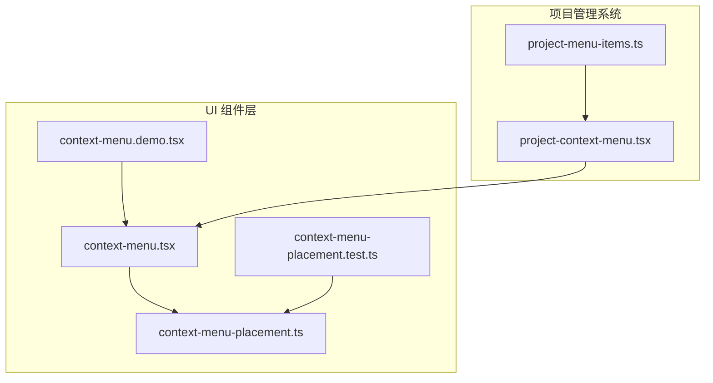
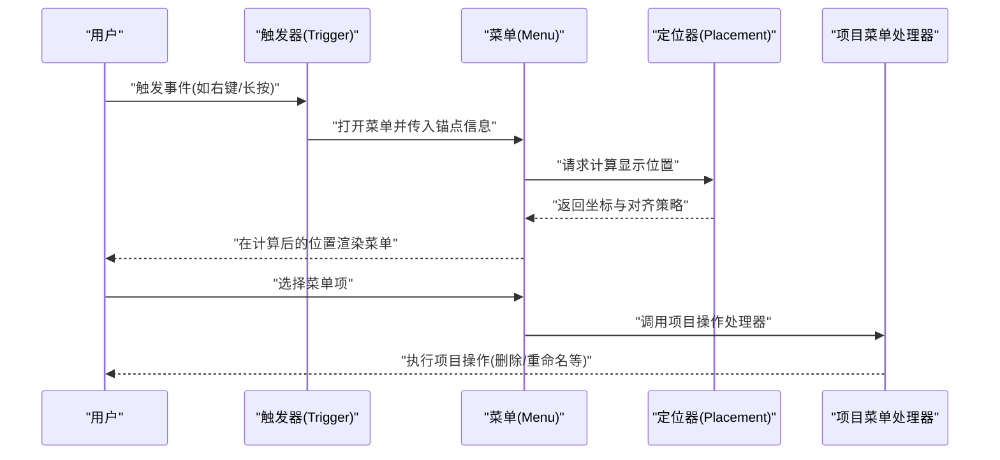
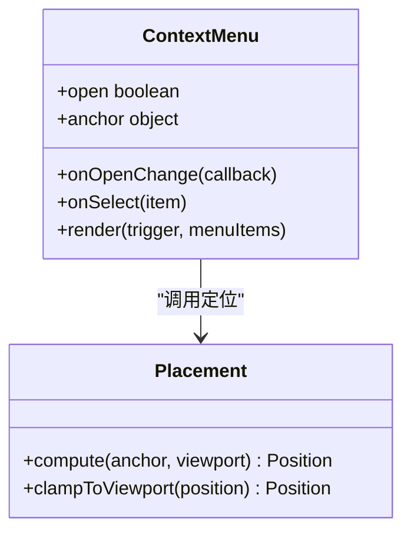
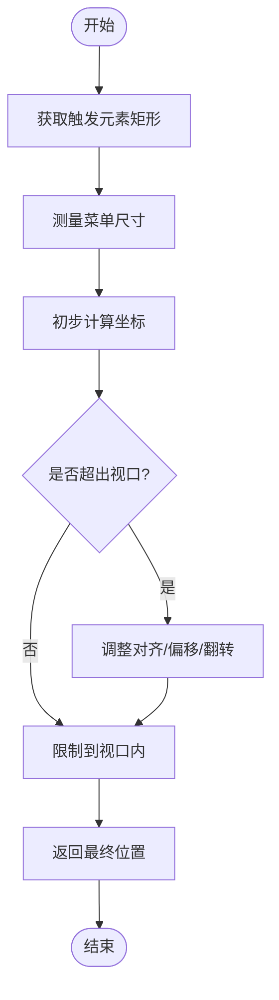
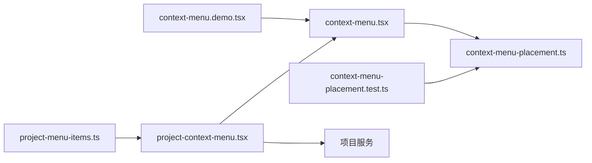

# 上下文菜单 UI 原语组件

<cite>
**本文引用的文件**   
- [context-menu.tsx](file://src/components/ui/context-menu.tsx)
- [context-menu-placement.ts](file://src/components/ui/context-menu-placement.ts)
- [context-menu.demo.tsx](file://src/components/ui/context-menu.demo.tsx)
- [context-menu-placement.test.ts](file://src/components/ui/context-menu-placement.test.ts)
- [project-context-menu.tsx](file://src/features/projects/project-context-menu.tsx)
- [project-menu-items.ts](file://src/features/projects/project-menu-items.ts)
</cite>

## 更新摘要
**所做更改**   
- 新增项目管理系统中ContextMenu的实际使用案例
- 添加项目上下文菜单的具体实现分析
- 更新架构总览以反映实际应用场景
- 增强依赖关系分析，包含项目模块的集成

## 目录
1. [简介](#简介)
2. [项目结构](#项目结构)
3. [核心组件](#核心组件)
4. [架构总览](#架构总览)
5. [详细组件分析](#详细组件分析)
6. [项目管理系统集成](#项目管理系统集成)
7. [依赖关系分析](#依赖关系分析)
8. [性能考量](#性能考量)
9. [故障排查指南](#故障排查指南)
10. [结论](#结论)
11. [附录](#附录)

## 简介
本文件面向"上下文菜单（ContextMenu）"这一 UI 原语，系统性梳理其在代码库中的实现与使用方式。内容涵盖组件职责、定位策略、交互流程、可配置项、错误处理与性能优化建议，帮助开发者快速理解并正确集成该组件。**最新更新**：文档现已包含在项目管理系统中的实际应用案例，展示ContextMenu如何被用于项目卡片和项目管理界面。

## 项目结构
上下文菜单相关代码位于前端 UI 组件目录中，主要包含：
- 组件实现：提供弹出面板、触发区域、菜单项渲染等能力
- 定位策略：根据视口边界自动计算最佳显示位置，避免溢出
- 演示用例：展示常见用法与交互行为
- 测试用例：覆盖定位算法与边界场景
- **新增**：项目管理系统中的具体应用实现

**图表来源** 
- [context-menu.tsx](file://src/components/ui/context-menu.tsx)
- [context-menu-placement.ts](file://src/components/ui/context-menu-placement.ts)
- [context-menu.demo.tsx](file://src/components/ui/context-menu.demo.tsx)
- [context-menu-placement.test.ts](file://src/components/ui/context-menu-placement.test.ts)
- [project-context-menu.tsx](file://src/features/projects/project-context-menu.tsx)
- [project-menu-items.ts](file://src/features/projects/project-menu-items.ts)

**章节来源**
- [context-menu.tsx](file://src/components/ui/context-menu.tsx)
- [context-menu-placement.ts](file://src/components/ui/context-menu-placement.ts)
- [context-menu.demo.tsx](file://src/components/ui/context-menu.demo.tsx)
- [context-menu-placement.test.ts](file://src/components/ui/context-menu-placement.test.ts)
- [project-context-menu.tsx](file://src/features/projects/project-context-menu.tsx)
- [project-menu-items.ts](file://src/features/projects/project-menu-items.ts)

## 核心组件
- 上下文菜单组件
  - 负责管理菜单的显隐状态、事件绑定、焦点管理与键盘导航
  - 提供受控与非受控两种使用模式，便于在不同业务场景中灵活接入
  - 支持自定义菜单内容、分隔符、禁用态与图标等
- 定位策略模块
  - 基于触发元素与视口尺寸，计算菜单的最佳坐标与对齐方式
  - 自动处理边界碰撞，确保菜单始终可见且不遮挡关键操作
  - 支持多种对齐策略与偏移量配置

**章节来源**
- [context-menu.tsx](file://src/components/ui/context-menu.tsx)
- [context-menu-placement.ts](file://src/components/ui/context-menu-placement.ts)

## 架构总览
上下文菜单由"触发器 + 弹出面板 + 定位器"三部分协作完成。触发器捕获用户操作（如右键点击），弹出面板承载菜单项，定位器根据当前布局动态计算显示位置。

**图表来源** 
- [context-menu.tsx](file://src/components/ui/context-menu.tsx)
- [context-menu-placement.ts](file://src/components/ui/context-menu-placement.ts)
- [project-context-menu.tsx](file://src/features/projects/project-context-menu.tsx)

## 详细组件分析

### 上下文菜单组件（context-menu.tsx）
- 职责划分
  - 状态管理：维护菜单开合、激活项、键盘焦点等
  - 事件处理：统一拦截默认行为，防止滚动穿透或页面抖动
  - 渲染控制：按需挂载/卸载菜单 DOM，减少不必要的重排
- 交互特性
  - 支持 ESC 关闭、方向键导航、回车确认
  - 支持点击外部区域关闭与聚焦恢复
- 扩展点
  - 通过插槽或子组件注入菜单项
  - 暴露回调以对接业务逻辑（如删除、复制、分享等）

**图表来源** 
- [context-menu.tsx](file://src/components/ui/context-menu.tsx)
- [context-menu-placement.ts](file://src/components/ui/context-menu-placement.ts)

**章节来源**
- [context-menu.tsx](file://src/components/ui/context-menu.tsx)

### 定位策略（context-menu-placement.ts）
- 算法要点
  - 输入：触发元素矩形、菜单尺寸、视口尺寸、边距与对齐偏好
  - 输出：最终坐标、对齐方式、是否发生翻转
  - 约束：保证菜单完全可见，必要时进行翻转或重新对齐
- 边界处理
  - 检测与视口边缘的碰撞，自动调整偏移
  - 处理滚动容器与固定定位的差异
- 可配置项
  - 对齐策略（左/右/上/下/居中）
  - 偏移量（像素或百分比）
  - 碰撞检测阈值与回退策略

**图表来源** 
- [context-menu-placement.ts](file://src/components/ui/context-menu-placement.ts)

**章节来源**
- [context-menu-placement.ts](file://src/components/ui/context-menu-placement.ts)

### 演示用例（context-menu.demo.tsx）
- 展示典型用法：右键触发、菜单项分组、禁用态、图标与快捷键提示
- 演示定位效果：不同屏幕尺寸下的自适应显示
- 提供交互反馈：选中后回调、关闭时机、焦点管理

**章节来源**
- [context-menu.demo.tsx](file://src/components/ui/context-menu.demo.tsx)

### 测试用例（context-menu-placement.test.ts）
- 覆盖场景
  - 正常显示：菜单完全在视口内
  - 边界碰撞：左右/上下翻转与偏移
  - 极端情况：小视口、嵌套滚动容器、固定定位
- 断言重点
  - 坐标计算准确性
  - 对齐策略生效
  - 无越界渲染

**章节来源**
- [context-menu-placement.test.ts](file://src/components/ui/context-menu-placement.test.ts)

## 项目管理系统集成

### 项目上下文菜单（project-context-menu.tsx）
项目管理系统中的上下文菜单专门用于项目卡片的交互操作，提供以下功能：
- 项目操作：删除、重命名、复制、导出等
- 状态管理：集成项目状态变更和权限验证
- 数据绑定：与项目数据模型紧密关联
- 用户体验：流畅的动画效果和即时反馈

**图表来源** 
- [project-context-menu.tsx](file://src/features/projects/project-context-menu.tsx)
- [project-menu-items.ts](file://src/features/projects/project-menu-items.ts)

**章节来源**
- [project-context-menu.tsx](file://src/features/projects/project-context-menu.tsx)
- [project-menu-items.ts](file://src/features/projects/project-menu-items.ts)

### 项目菜单项（project-menu-items.ts）
项目菜单项定义了具体的操作选项和行为：
- 基础操作：查看、编辑、删除项目
- 高级操作：导出、导入、迁移项目
- 批量操作：多选项目的批量处理
- 权限控制：基于用户角色的操作限制

**章节来源**
- [project-menu-items.ts](file://src/features/projects/project-menu-items.ts)

## 依赖关系分析
上下文菜单组件依赖定位策略模块，演示与测试分别验证其功能与稳定性。项目管理系统中的上下文菜单进一步依赖于项目服务和数据模型。整体耦合度低，便于替换或扩展定位算法。

**图表来源** 
- [context-menu.tsx](file://src/components/ui/context-menu.tsx)
- [context-menu-placement.ts](file://src/components/ui/context-menu-placement.ts)
- [context-menu.demo.tsx](file://src/components/ui/context-menu.demo.tsx)
- [context-menu-placement.test.ts](file://src/components/ui/context-menu-placement.test.ts)
- [project-context-menu.tsx](file://src/features/projects/project-context-menu.tsx)
- [project-menu-items.ts](file://src/features/projects/project-menu-items.ts)

**章节来源**
- [context-menu.tsx](file://src/components/ui/context-menu.tsx)
- [context-menu-placement.ts](file://src/components/ui/context-menu-placement.ts)
- [context-menu.demo.tsx](file://src/components/ui/context-menu.demo.tsx)
- [context-menu-placement.test.ts](file://src/components/ui/context-menu-placement.test.ts)
- [project-context-menu.tsx](file://src/features/projects/project-context-menu.tsx)
- [project-menu-items.ts](file://src/features/projects/project-menu-items.ts)

## 性能考量
- 按需渲染：仅在菜单打开时挂载 DOM，关闭后及时卸载
- 防抖与节流：对频繁触发的定位计算进行节流，避免重复计算
- 虚拟列表：当菜单项数量较大时，考虑虚拟化渲染以提升滚动性能
- 事件委托：为菜单项绑定事件时使用事件委托，减少监听器数量
- **项目优化**：项目上下文菜单采用懒加载策略，仅在需要时加载项目数据

## 故障排查指南
- 菜单显示位置异常
  - 检查触发元素是否在可视区域内
  - 确认视口尺寸与滚动容器是否正确传递
  - 查看定位日志，确认是否发生翻转或偏移
- 无法关闭或焦点丢失
  - 检查外部点击监听是否被阻止冒泡
  - 确认 ESC 键事件未被其他组件拦截
- 性能问题
  - 观察菜单项数量，必要时启用虚拟化
  - 检查是否存在大量同步重排操作
- **项目相关问题**
  - 验证项目权限是否正确传递
  - 检查项目数据状态是否同步
  - 确认项目操作的成功反馈机制

**章节来源**
- [context-menu-placement.test.ts](file://src/components/ui/context-menu-placement.test.ts)

## 结论
上下文菜单组件通过清晰的职责划分与灵活的定位策略，提供了稳定且易用的弹出菜单能力。结合演示与测试用例，开发者可以快速集成并根据业务需求进行扩展。**最新更新**：在项目管理系统中的成功应用证明了该组件的可靠性和可扩展性。建议在复杂场景中关注性能优化与边界情况的处理，以确保良好的用户体验。

## 附录
- 常用配置项说明
  - 对齐策略：left/right/top/bottom/center
  - 偏移量：水平与垂直方向的像素偏移
  - 碰撞检测：是否启用视口边界检测与自动翻转
- 最佳实践
  - 为菜单项提供明确的语义化标签与键盘可达性
  - 在移动端适配触摸手势与长按触发
  - 避免在菜单中执行耗时操作，必要时提供加载反馈
  - **项目集成**：为项目操作提供适当的权限验证和数据一致性保证