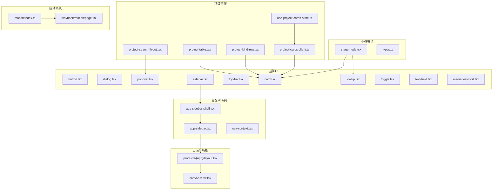
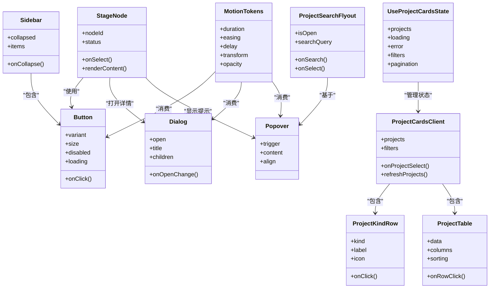
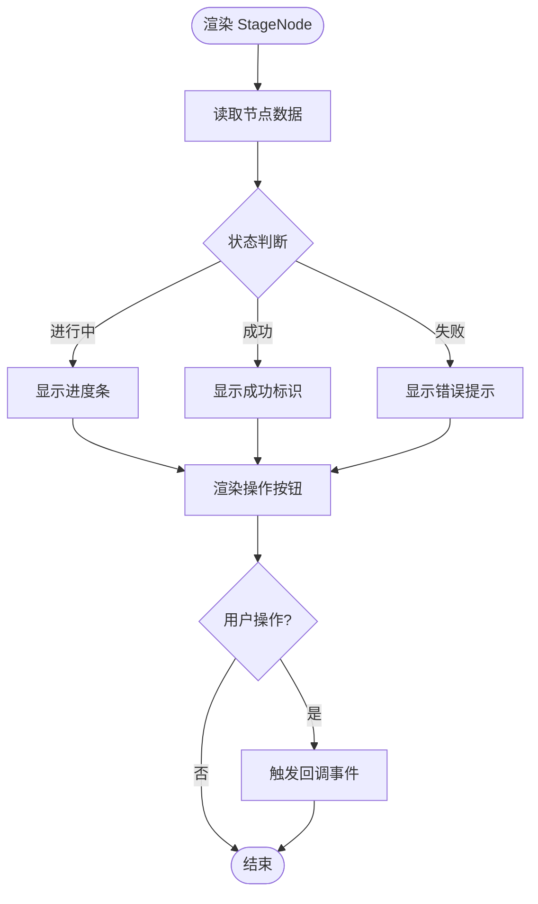
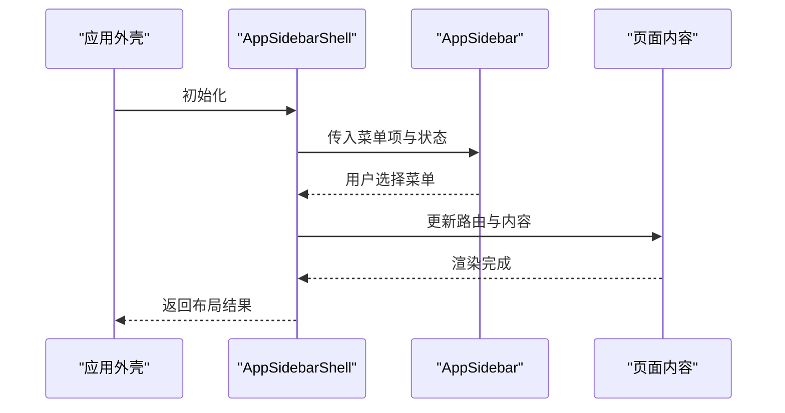
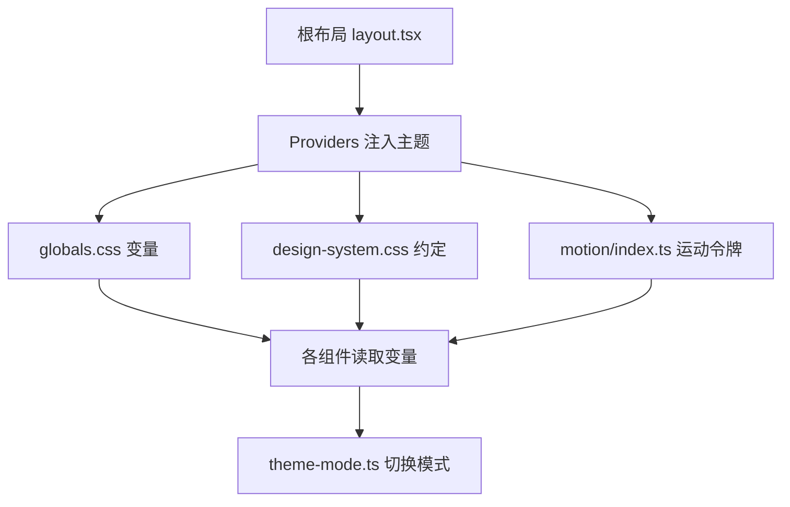
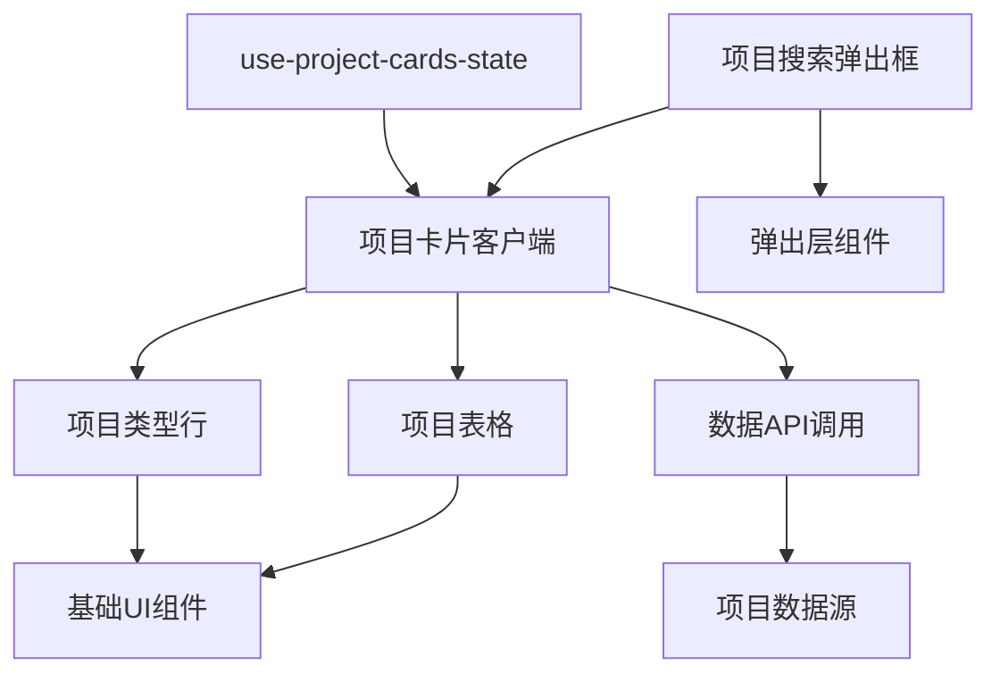
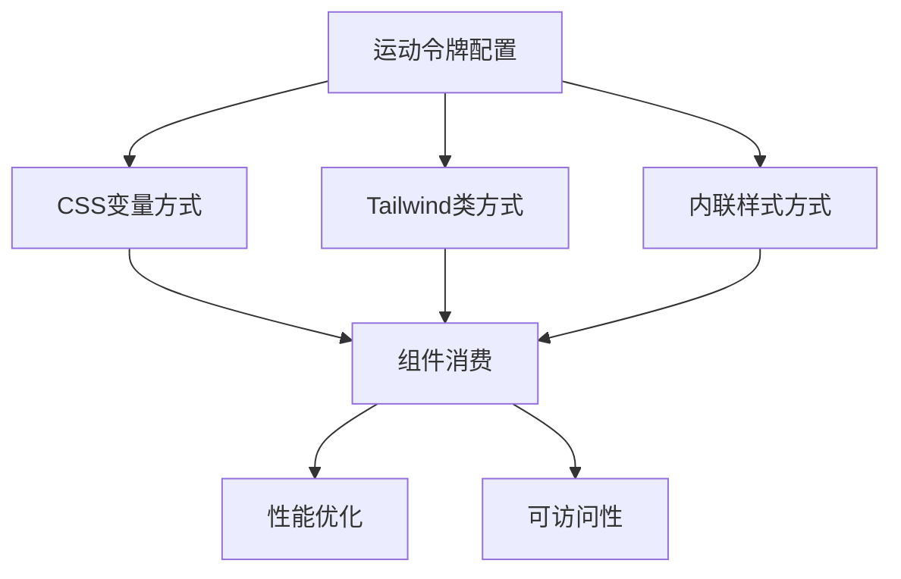
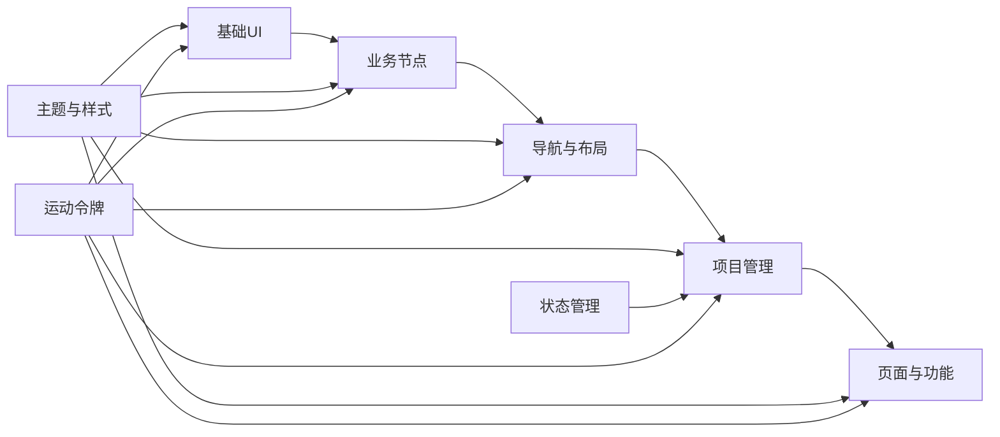

# 组件系统

<cite>
**本文引用的文件**   
- [src/components/ui/button.tsx](file://src/components/ui/button.tsx)
- [src/components/ui/dialog.tsx](file://src/components/ui/dialog.tsx)
- [src/components/ui/popover.tsx](file://src/components/ui/popover.tsx)
- [src/components/ui/sidebar.tsx](file://src/components/ui/sidebar.tsx)
- [src/components/ui/top-bar.tsx](file://src/components/ui/top-bar.tsx)
- [src/components/ui/card.tsx](file://src/components/ui/card.tsx)
- [src/components/ui/tooltip.tsx](file://src/components/ui/tooltip.tsx)
- [src/components/ui/toggle.tsx](file://src/components/ui/toggle.tsx)
- [src/components/ui/text-field.tsx](file://src/components/ui/text-field.tsx)
- [src/components/ui/media-viewport.tsx](file://src/components/ui/media-viewport.tsx)
- [src/components/ui/project-card.tsx](file://src/components/ui/project-card.tsx)
- [src/components/ui/settings-panel.tsx](file://src/components/ui/settings-panel.tsx)
- [src/components/ui/node/stage-node.tsx](file://src/components/ui/node/stage-node.tsx)
- [src/components/ui/node/types.ts](file://src/components/ui/node/types.ts)
- [src/components/icons/logo-mark.tsx](file://src/components/icons/logo-mark.tsx)
- [src/app/playbook/registry.ts](file://src/app/playbook/registry.ts)
- [src/app/design-system.css](file://src/app/design-system.css)
- [src/app/globals.css](file://src/app/globals.css)
- [src/lib/theme-mode.ts](file://src/lib/theme-mode.ts)
- [src/app/providers.tsx](file://src/app/providers.tsx)
- [src/app/layout.tsx](file://src/app/layout.tsx)
- [src/features/navigation/app-sidebar-shell.tsx](file://src/features/navigation/app-sidebar-shell.tsx)
- [src/features/navigation/app-sidebar.tsx](file://src/features/navigation/app-sidebar.tsx)
- [src/features/navigation/nav-context.tsx](file://src/features/navigation/nav-context.tsx)
- [src/app/products/(app)/layout.tsx](file://src/app/products/(app)/layout.tsx)
- [src/app/products/(app)/canvas/[projectId]/canvas-view.tsx](file://src/app/products/(app)/canvas/[projectId]/canvas-view.tsx)
- [src/features/projects/project-cards-client.ts](file://src/features/projects/project-cards-client.ts)
- [src/features/projects/project-kind-row.tsx](file://src/features/projects/project-kind-row.tsx)
- [src/features/projects/project-table.tsx](file://src/features/projects/project-table.tsx)
- [src/features/projects/project-search-flyout.tsx](file://src/features/projects/project-search-flyout.tsx)
- [src/features/projects/use-project-cards-state.ts](file://src/features/projects/use-project-cards-state.ts)
- [src/lib/motion/index.ts](file://src/lib/motion/index.ts)
- [src/app/playbook/motion/page.tsx](file://src/app/playbook/motion/page.tsx)
</cite>

## 更新摘要
**所做更改**   
- 新增运动令牌集成章节，详细说明Tailwind类与内联样式的对比使用
- 更新了playbook组件的运动令牌消费模式示例
- 扩展了样式系统的说明，包含Tailwind类与CSS变量的结合使用
- 完善了组件动画和过渡效果的实现指南

## 目录
1. [简介](#简介)
2. [项目结构](#项目结构)
3. [核心组件](#核心组件)
4. [架构总览](#架构总览)
5. [详细组件分析](#详细组件分析)
6. [项目管理组件](#项目管理组件)
7. [运动令牌系统](#运动令牌系统)
8. [依赖关系分析](#依赖关系分析)
9. [性能考量](#性能考量)
10. [故障排查指南](#故障排查指南)
11. [结论](#结论)
12. [附录](#附录)

## 简介
本文件系统化梳理 PurpleInk 前端组件体系，覆盖从基础 UI 到业务组件的分层设计、命名与接口规范、可复用开发模式（Props、事件、插槽）、图标系统、主题适配、响应式策略，以及测试、文档生成与版本管理流程。目标是让不同技术背景的读者都能理解并高效使用、扩展组件。

**更新** 新增了运动令牌集成系统，展示了如何使用Tailwind类而非内联样式来消费运动令牌，为组件的动画和过渡效果提供了更优雅的实现方式。

## 项目结构
组件按"基础 UI → 领域/业务 → 页面/功能"分层组织：
- 基础 UI：位于 src/components/ui，提供原子化控件（按钮、对话框、侧边栏等）
- 图标：位于 src/components/icons，集中管理品牌与通用图标
- 业务节点：位于 src/components/ui/node，面向画布工作流的可视化节点
- 导航与布局：位于 src/features/navigation，组合基础 UI 形成应用壳层
- 项目管理：位于 src/features/projects，提供项目管理的专用组件和状态管理
- 运动系统：位于 src/lib/motion，统一管理运动令牌和动画配置
- 页面与功能：位于 src/app 与 src/app/products，基于组件拼装页面

**图表来源**
- [src/components/ui/sidebar.tsx](file://src/components/ui/sidebar.tsx)
- [src/features/navigation/app-sidebar-shell.tsx](file://src/features/navigation/app-sidebar-shell.tsx)
- [src/features/navigation/app-sidebar.tsx](file://src/features/navigation/app-sidebar.tsx)
- [src/app/products/(app)/layout.tsx](file://src/app/products/(app)/layout.tsx)
- [src/app/products/(app)/canvas/[projectId]/canvas-view.tsx](file://src/app/products/(app)/canvas/[projectId]/canvas-view.tsx)
- [src/components/ui/node/stage-node.tsx](file://src/components/ui/node/stage-node.tsx)
- [src/components/ui/node/types.ts](file://src/components/ui/node/types.ts)
- [src/features/projects/project-cards-client.ts](file://src/features/projects/project-cards-client.ts)
- [src/features/projects/project-kind-row.tsx](file://src/features/projects/project-kind-row.tsx)
- [src/features/projects/project-table.tsx](file://src/features/projects/project-table.tsx)
- [src/features/projects/project-search-flyout.tsx](file://src/features/projects/project-search-flyout.tsx)
- [src/features/projects/use-project-cards-state.ts](file://src/features/projects/use-project-cards-state.ts)
- [src/lib/motion/index.ts](file://src/lib/motion/index.ts)
- [src/app/playbook/motion/page.tsx](file://src/app/playbook/motion/page.tsx)

## 核心组件
- 按钮 Button：统一样式与交互，支持尺寸、变体、禁用态、加载态
- 对话框 Dialog：模态容器，聚焦管理与遮罩行为
- 弹出层 Popover：轻量提示与内容承载
- 侧边栏 Sidebar：应用级导航容器，支持折叠与层级
- 顶部栏 TopBar：全局操作入口与面包屑
- 卡片 Card：信息块封装
- 工具提示 Tooltip：上下文说明
- 开关 Toggle：布尔状态切换
- 文本输入 Text Field：表单输入控件
- 媒体视口 Media Viewport：图片/视频预览与缩放
- 项目卡片 Project Card：项目概览与操作
- 设置面板 Settings Panel：配置项分组展示
- 阶段节点 Stage Node：画布工作流中的可视化节点
- **新增** 项目卡片客户端 Project Cards Client：项目卡片的客户端逻辑管理
- **新增** 项目类型行 Project Kind Row：项目类型的行展示组件
- **新增** 项目表格 Project Table：项目数据的表格展示
- **新增** 项目搜索弹出框 Project Search Flyout：项目搜索功能的弹出界面
- **新增** 项目卡片状态钩子 use-project-cards-state：项目卡片的状态管理Hook
- **新增** 运动令牌 Motion Tokens：统一的动画和过渡配置系统

## 架构总览
组件体系遵循"低耦合、高内聚"的层次化设计：
- 基础 UI 不依赖业务逻辑，仅通过 Props、事件回调和插槽暴露能力
- 业务节点在基础 UI 之上组合出领域语义
- 导航与布局将基础 UI 装配为应用壳层
- 项目管理组件提供专门的项目管理功能，使用状态管理Hook进行数据协调
- 运动系统提供统一的动画配置，通过Tailwind类或内联样式消费
- 页面与功能以业务组件为核心，串联数据流与用户交互

**图表来源**
- [src/components/ui/button.tsx](file://src/components/ui/button.tsx)
- [src/components/ui/dialog.tsx](file://src/components/ui/dialog.tsx)
- [src/components/ui/popover.tsx](file://src/components/ui/popover.tsx)
- [src/components/ui/sidebar.tsx](file://src/components/ui/sidebar.tsx)
- [src/components/ui/node/stage-node.tsx](file://src/components/ui/node/stage-node.tsx)
- [src/features/projects/project-cards-client.ts](file://src/features/projects/project-cards-client.ts)
- [src/features/projects/project-kind-row.tsx](file://src/features/projects/project-kind-row.tsx)
- [src/features/projects/project-table.tsx](file://src/features/projects/project-table.tsx)
- [src/features/projects/project-search-flyout.tsx](file://src/features/projects/project-search-flyout.tsx)
- [src/features/projects/use-project-cards-state.ts](file://src/features/projects/use-project-cards-state.ts)
- [src/lib/motion/index.ts](file://src/lib/motion/index.ts)

## 详细组件分析

### 基础 UI 组件设计与实现要点
- 命名规范：采用 PascalCase 文件名与组件名，单一职责，避免复合词
- Props 设计：最小必要属性集，默认值明确，类型约束严格；对可选内容进行 children 或具名插槽
- 事件处理：以 onXxx 形式暴露回调，参数标准化，避免泄露内部状态
- 插槽机制：通过 children 或具名字段注入内容，保持组件边界清晰
- 可访问性：键盘导航、焦点管理、ARIA 属性完善
- 主题适配：基于 CSS 变量与主题模式，支持明暗色与品牌色定制
- 响应式：移动端优先，使用断点与弹性布局
- **更新** 运动令牌集成：支持通过Tailwind类或内联样式消费统一的动画配置

**Section sources**   
- [src/components/ui/button.tsx](file://src/components/ui/button.tsx)
- [src/components/ui/dialog.tsx](file://src/components/ui/dialog.tsx)
- [src/components/ui/popover.tsx](file://src/components/ui/popover.tsx)
- [src/components/ui/sidebar.tsx](file://src/components/ui/sidebar.tsx)
- [src/components/ui/top-bar.tsx](file://src/components/ui/top-bar.tsx)
- [src/components/ui/card.tsx](file://src/components/ui/card.tsx)
- [src/components/ui/tooltip.tsx](file://src/components/ui/tooltip.tsx)
- [src/components/ui/toggle.tsx](file://src/components/ui/toggle.tsx)
- [src/components/ui/text-field.tsx](file://src/components/ui/text-field.tsx)
- [src/components/ui/media-viewport.tsx](file://src/components/ui/media-viewport.tsx)

### 业务节点组件（Stage Node）
- 职责：表达工作流阶段的可视化与交互，如选中、状态指示、操作入口
- 数据结构：节点 ID、状态、标题、描述、操作按钮等
- 交互：点击选择、右键菜单、拖拽连接（由上层编排）
- 与基础 UI 的关系：复用卡片、工具提示、按钮等

**图表来源**
- [src/components/ui/node/stage-node.tsx](file://src/components/ui/node/stage-node.tsx)
- [src/components/ui/node/types.ts](file://src/components/ui/node/types.ts)

**Section sources**   
- [src/components/ui/node/stage-node.tsx](file://src/components/ui/node/stage-node.tsx)
- [src/components/ui/node/types.ts](file://src/components/ui/node/types.ts)

### 导航与布局（Sidebar Shell）
- 目标：将侧边栏与页面主体组合，提供统一的导航体验
- 关键点：侧边栏折叠状态、路由联动、内容区自适应
- 与基础 UI 协作：使用 Sidebar、TopBar、Button 等

**图表来源**
- [src/features/navigation/app-sidebar-shell.tsx](file://src/features/navigation/app-sidebar-shell.tsx)
- [src/features/navigation/app-sidebar.tsx](file://src/features/navigation/app-sidebar.tsx)
- [src/features/navigation/nav-context.tsx](file://src/features/navigation/nav-context.tsx)

**Section sources**   
- [src/features/navigation/app-sidebar-shell.tsx](file://src/features/navigation/app-sidebar-shell.tsx)
- [src/features/navigation/app-sidebar.tsx](file://src/features/navigation/app-sidebar.tsx)
- [src/features/navigation/nav-context.tsx](file://src/features/navigation/nav-context.tsx)

### 图标系统与品牌
- 图标集中管理，便于替换与主题化
- 品牌 Logo 作为独立组件，保证一致性
- 建议：SVG 内联以提升性能，统一 viewBox 与尺寸

**Section sources**   
- [src/components/icons/logo-mark.tsx](file://src/components/icons/logo-mark.tsx)

### 主题适配与响应式设计
- 主题模式：通过主题模式库与 CSS 变量驱动明暗色与品牌色
- 全局样式：在 globals.css 中定义基础变量与重置
- 设计系统：design-system.css 集中样式约定与断点
- 提供者：providers.tsx 注入主题上下文，确保全应用一致
- **更新** 运动令牌集成：通过CSS变量和Tailwind类统一管理动画配置

**图表来源**
- [src/app/layout.tsx](file://src/app/layout.tsx)
- [src/app/providers.tsx](file://src/app/providers.tsx)
- [src/app/globals.css](file://src/app/globals.css)
- [src/app/design-system.css](file://src/app/design-system.css)
- [src/lib/theme-mode.ts](file://src/lib/theme-mode.ts)
- [src/lib/motion/index.ts](file://src/lib/motion/index.ts)

**Section sources**   
- [src/app/globals.css](file://src/app/globals.css)
- [src/app/design-system.css](file://src/app/design-system.css)
- [src/lib/theme-mode.ts](file://src/lib/theme-mode.ts)
- [src/app/providers.tsx](file://src/app/providers.tsx)
- [src/app/layout.tsx](file://src/app/layout.tsx)

### 可复用组件开发模式
- Props 设计原则：最小化、强类型、默认值合理、可扩展（children/插槽）
- 事件处理：回调命名统一（onXxx），参数稳定，避免副作用
- 插槽机制：children 用于默认插槽，具名插槽用于复杂布局
- 可访问性：键盘可达、屏幕阅读器友好、焦点顺序正确
- 主题与响应式：通过 CSS 变量与断点控制外观与布局
- **更新** 运动令牌消费：推荐使用Tailwind类而非内联样式，提供更好的可维护性和主题支持

**Section sources**   
- [src/components/ui/button.tsx](file://src/components/ui/button.tsx)
- [src/components/ui/dialog.tsx](file://src/components/ui/dialog.tsx)
- [src/components/ui/popover.tsx](file://src/components/ui/popover.tsx)
- [src/components/ui/sidebar.tsx](file://src/components/ui/sidebar.tsx)
- [src/components/ui/top-bar.tsx](file://src/components/ui/top-bar.tsx)
- [src/components/ui/card.tsx](file://src/components/ui/card.tsx)
- [src/components/ui/tooltip.tsx](file://src/components/ui/tooltip.tsx)
- [src/components/ui/toggle.tsx](file://src/components/ui/toggle.tsx)
- [src/components/ui/text-field.tsx](file://src/components/ui/text-field.tsx)
- [src/components/ui/media-viewport.tsx](file://src/components/ui/media-viewport.tsx)
- [src/components/ui/project-card.tsx](file://src/components/ui/project-card.tsx)
- [src/components/ui/settings-panel.tsx](file://src/components/ui/settings-panel.tsx)

### 组件注册与文档示例
- Playbook 注册表：集中展示组件用法与示例，便于查阅与回归
- 建议：每个组件配套 demo 与用例，自动纳入文档站点
- **更新** 运动令牌示例：在playbook中展示Tailwind类与内联样式的对比使用

**Section sources**   
- [src/app/playbook/registry.ts](file://src/app/playbook/registry.ts)

## 项目管理组件

### 项目卡片客户端（Project Cards Client）
- 职责：管理项目卡片的客户端逻辑，包括数据获取、过滤、排序等操作
- 核心功能：项目列表管理、筛选条件处理、分页控制、刷新机制
- 状态管理：与 use-project-cards-state Hook 集成，提供统一的状态管理
- 事件处理：项目选择、删除、编辑等操作的事件回调

### 项目类型行（Project Kind Row）
- 职责：展示项目类型的行组件，支持图标、标签和点击交互
- 设计特点：简洁的行布局，支持自定义图标和标签文本
- 交互行为：点击触发类型切换，支持键盘导航
- 样式适配：支持主题切换和响应式布局

### 项目表格（Project Table）
- 职责：以表格形式展示项目数据，支持列排序、筛选和分页
- 数据绑定：与项目数据源双向绑定，支持实时更新
- 交互功能：行选择、批量操作、导出功能
- 性能优化：虚拟滚动支持大数据量展示

### 项目搜索弹出框（Project Search Flyout）
- 职责：提供项目搜索功能的弹出界面，支持关键词搜索和高级筛选
- 搜索功能：实时搜索、模糊匹配、搜索结果高亮
- 交互设计：弹出式界面，不影响主页面操作
- 结果展示：搜索结果列表，支持快速选择和导航

### 项目卡片状态管理（use-project-cards-state）
- 职责：为项目卡片提供统一的状态管理Hook
- 状态结构：项目列表、加载状态、错误处理、筛选条件、分页信息
- 生命周期：组件挂载时自动加载数据，支持手动刷新
- 错误处理：网络错误、数据格式错误的统一处理

**图表来源**
- [src/features/projects/project-cards-client.ts](file://src/features/projects/project-cards-client.ts)
- [src/features/projects/project-kind-row.tsx](file://src/features/projects/project-kind-row.tsx)
- [src/features/projects/project-table.tsx](file://src/features/projects/project-table.tsx)
- [src/features/projects/project-search-flyout.tsx](file://src/features/projects/project-search-flyout.tsx)
- [src/features/projects/use-project-cards-state.ts](file://src/features/projects/use-project-cards-state.ts)

**Section sources**   
- [src/features/projects/project-cards-client.ts](file://src/features/projects/project-cards-client.ts)
- [src/features/projects/project-kind-row.tsx](file://src/features/projects/project-kind-row.tsx)
- [src/features/projects/project-table.tsx](file://src/features/projects/project-table.tsx)
- [src/features/projects/project-search-flyout.tsx](file://src/features/projects/project-search-flyout.tsx)
- [src/features/projects/use-project-cards-state.ts](file://src/features/projects/use-project-cards-state.ts)

## 运动令牌系统

### 运动令牌设计原则
- 统一性：所有组件共享相同的动画时长、缓动函数和延迟配置
- 可配置性：支持通过CSS变量和Tailwind类进行主题化配置
- 性能优化：使用CSS transitions和transforms提升动画性能
- 可访问性：尊重用户的减少动画偏好设置

### Tailwind类与内联样式对比
- **推荐方式**：使用Tailwind类消费运动令牌，提供更好的可维护性和主题支持
- **备选方式**：内联样式适用于动态计算的场景，但缺乏主题一致性
- **最佳实践**：静态动画使用Tailwind类，动态动画使用内联样式

### 运动令牌消费模式
- CSS变量方式：通过`var(--motion-duration)`等变量引用
- Tailwind类方式：使用`transition-all duration-300 ease-in-out`等类
- 混合方式：基础动画使用Tailwind类，动态效果使用内联样式

**图表来源**
- [src/lib/motion/index.ts](file://src/lib/motion/index.ts)
- [src/app/playbook/motion/page.tsx](file://src/app/playbook/motion/page.tsx)

**Section sources**   
- [src/lib/motion/index.ts](file://src/lib/motion/index.ts)
- [src/app/playbook/motion/page.tsx](file://src/app/playbook/motion/page.tsx)

## 依赖关系分析
- 组件间依赖方向自下而上：基础 UI → 业务节点 → 导航与布局 → 项目管理 → 页面与功能
- 主题与样式依赖集中在顶层，组件通过变量消费
- 导航上下文贯穿应用壳层，避免重复状态
- 项目管理组件通过状态管理Hook协调各个子组件的状态
- **更新** 运动令牌系统为所有组件提供统一的动画配置，通过CSS变量和Tailwind类消费

**图表来源**
- [src/components/ui/button.tsx](file://src/components/ui/button.tsx)
- [src/components/ui/node/stage-node.tsx](file://src/components/ui/node/stage-node.tsx)
- [src/features/navigation/app-sidebar-shell.tsx](file://src/features/navigation/app-sidebar-shell.tsx)
- [src/features/projects/project-cards-client.ts](file://src/features/projects/project-cards-client.ts)
- [src/app/products/(app)/layout.tsx](file://src/app/products/(app)/layout.tsx)
- [src/app/globals.css](file://src/app/globals.css)
- [src/app/design-system.css](file://src/app/design-system.css)
- [src/lib/motion/index.ts](file://src/lib/motion/index.ts)

**Section sources**   
- [src/app/products/(app)/layout.tsx](file://src/app/products/(app)/layout.tsx)
- [src/app/products/(app)/canvas/[projectId]/canvas-view.tsx](file://src/app/products/(app)/canvas/[projectId]/canvas-view.tsx)

## 性能考量
- 组件粒度：基础 UI 尽量无状态，减少重渲染
- 懒加载：大组件按需引入，首屏优化
- 事件节流：频繁交互（滚动、拖拽）进行节流/防抖
- 资源优化：图标 SVG 内联，图片懒加载与占位
- 主题切换：CSS 变量切换避免全量重绘
- **新增** 项目管理组件的性能优化：虚拟滚动、分页加载、缓存策略
- **新增** 运动令牌的性能优化：使用CSS transforms和opacity提升动画性能，避免强制同步布局

## 故障排查指南
- 主题不一致：检查 providers 是否包裹根布局，CSS 变量是否正确覆盖
- 侧边栏异常：确认导航上下文与路由联动是否正常
- 对话框遮挡：检查 z-index 与层级管理
- 表单输入问题：校验规则与受控/非受控状态是否一致
- 节点渲染错误：核对节点数据类型与状态机
- **新增** 项目管理组件问题：检查状态管理Hook的使用、API调用错误处理、数据格式验证
- **新增** 运动令牌问题：检查CSS变量是否正确定义、Tailwind类是否生效、动画性能是否优化

**Section sources**   
- [src/app/providers.tsx](file://src/app/providers.tsx)
- [src/features/navigation/nav-context.tsx](file://src/features/navigation/nav-context.tsx)
- [src/components/ui/dialog.tsx](file://src/components/ui/dialog.tsx)
- [src/components/ui/text-field.tsx](file://src/components/ui/text-field.tsx)
- [src/components/ui/node/stage-node.tsx](file://src/components/ui/node/stage-node.tsx)

## 结论
PurpleInk 组件体系以清晰的层次划分、严格的接口约定与良好的主题/响应式支持为基础，结合导航与布局的组合能力，形成了可扩展、可维护的前端组件生态。**新增的项目管理组件系统**进一步完善了项目的管理能力，提供了完整的项目卡片展示、搜索、表格管理等功能。**新增的运动令牌系统**为组件动画提供了统一的配置和消费方式，推荐使用Tailwind类而非内联样式来获得更好的可维护性和主题支持。遵循本文的设计原则与开发模式，可在保证质量的前提下快速迭代与复用。

## 附录
- 使用示例：参考 Playbook 注册表中的组件演示
- 扩展指南：新增组件时遵循命名、Props、事件、插槽与可访问性规范，并在注册表中补充示例
- 版本管理：建议为组件建立变更日志与兼容性矩阵，配合自动化测试与文档生成
- **新增** 运动令牌使用指南：优先使用Tailwind类消费运动令牌，动态场景可使用内联样式

**Section sources**   
- [src/app/playbook/registry.ts](file://src/app/playbook/registry.ts)