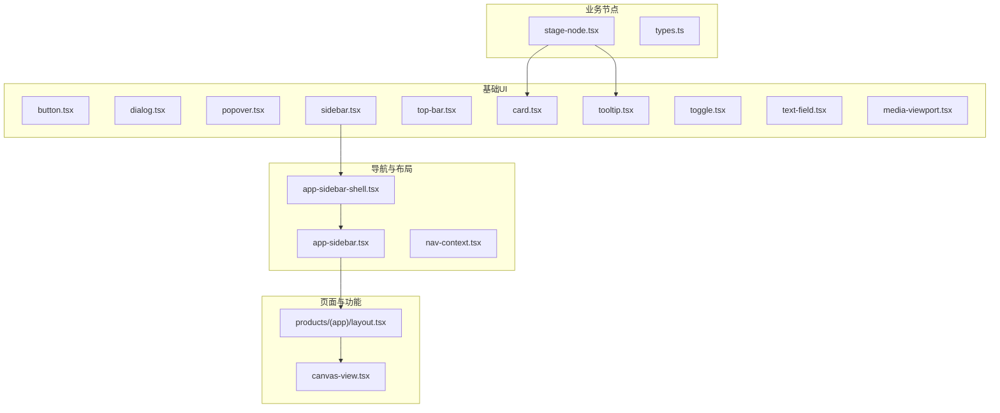
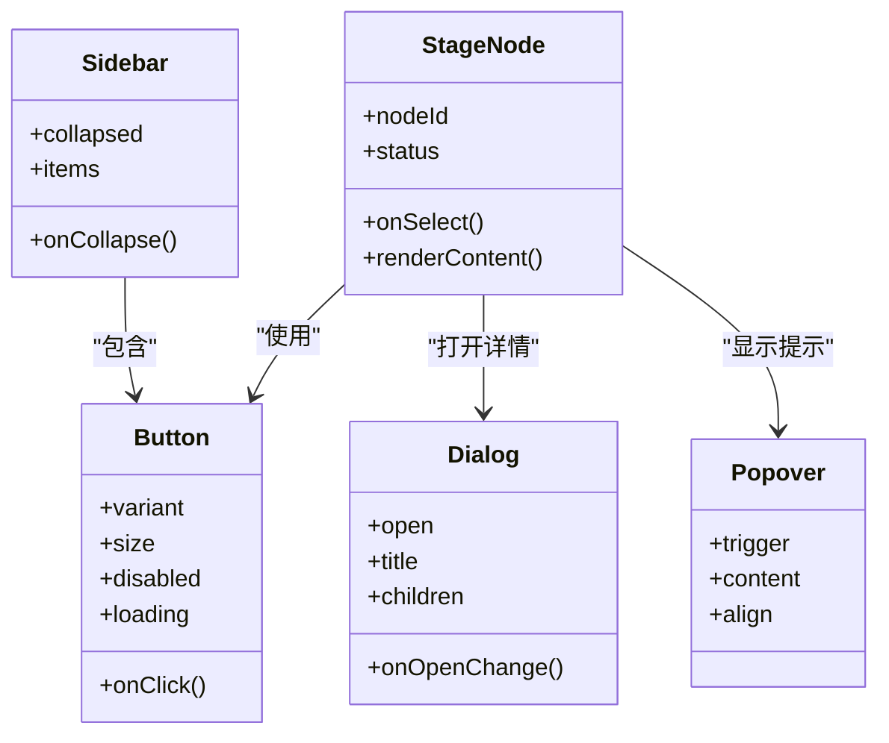
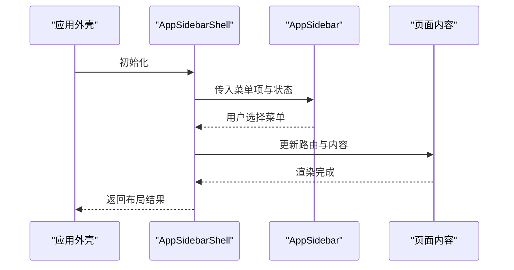
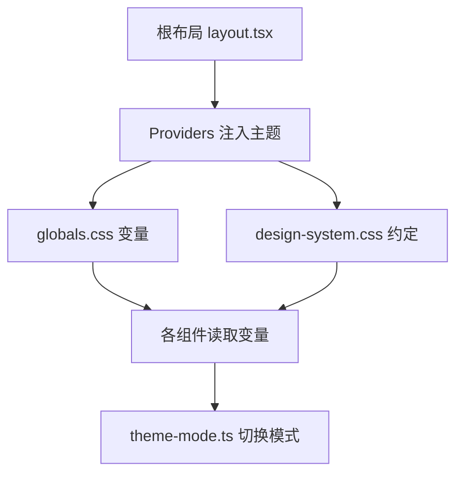
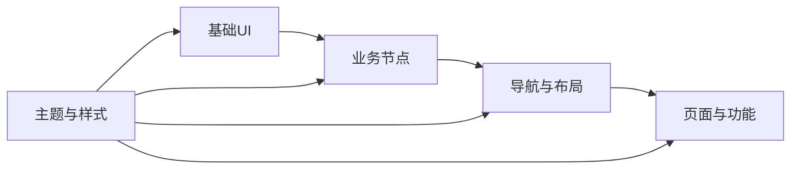

# 组件系统

<cite>
**本文引用的文件**   
- [src/components/ui/button.tsx](file://src/components/ui/button.tsx)
- [src/components/ui/dialog.tsx](file://src/components/ui/dialog.tsx)
- [src/components/ui/popover.tsx](file://src/components/ui/popover.tsx)
- [src/components/ui/sidebar.tsx](file://src/components/ui/sidebar.tsx)
- [src/components/ui/top-bar.tsx](file://src/components/ui/top-bar.tsx)
- [src/components/ui/card.tsx](file://src/components/ui/card.tsx)
- [src/components/ui/tooltip.tsx](file://src/components/ui/tooltip.tsx)
- [src/components/ui/toggle.tsx](file://src/components/ui/toggle.tsx)
- [src/components/ui/text-field.tsx](file://src/components/ui/text-field.tsx)
- [src/components/ui/media-viewport.tsx](file://src/components/ui/media-viewport.tsx)
- [src/components/ui/project-card.tsx](file://src/components/ui/project-card.tsx)
- [src/components/ui/settings-panel.tsx](file://src/components/ui/settings-panel.tsx)
- [src/components/ui/node/stage-node.tsx](file://src/components/ui/node/stage-node.tsx)
- [src/components/ui/node/types.ts](file://src/components/ui/node/types.ts)
- [src/components/icons/logo-mark.tsx](file://src/components/icons/logo-mark.tsx)
- [src/app/playbook/registry.ts](file://src/app/playbook/registry.ts)
- [src/app/design-system.css](file://src/app/design-system.css)
- [src/app/globals.css](file://src/app/globals.css)
- [src/lib/theme-mode.ts](file://src/lib/theme-mode.ts)
- [src/app/providers.tsx](file://src/app/providers.tsx)
- [src/app/layout.tsx](file://src/app/layout.tsx)
- [src/features/navigation/app-sidebar-shell.tsx](file://src/features/navigation/app-sidebar-shell.tsx)
- [src/features/navigation/app-sidebar.tsx](file://src/features/navigation/app-sidebar.tsx)
- [src/features/navigation/nav-context.tsx](file://src/features/navigation/nav-context.tsx)
- [src/app/products/(app)/layout.tsx](file://src/app/products/(app)/layout.tsx)
- [src/app/products/(app)/canvas/[projectId]/canvas-view.tsx](file://src/app/products/(app)/canvas/[projectId]/canvas-view.tsx)
</cite>

## 目录
1. [简介](#简介)
2. [项目结构](#项目结构)
3. [核心组件](#核心组件)
4. [架构总览](#架构总览)
5. [详细组件分析](#详细组件分析)
6. [依赖关系分析](#依赖关系分析)
7. [性能考量](#性能考量)
8. [故障排查指南](#故障排查指南)
9. [结论](#结论)
10. [附录](#附录)

## 简介
本文件系统化梳理 PurpleInk 前端组件体系，覆盖从基础 UI 到业务组件的分层设计、命名与接口规范、可复用开发模式（Props、事件、插槽）、图标系统、主题适配、响应式策略，以及测试、文档生成与版本管理流程。目标是让不同技术背景的读者都能理解并高效使用、扩展组件。

## 项目结构
组件按“基础 UI → 领域/业务 → 页面/功能”分层组织：
- 基础 UI：位于 src/components/ui，提供原子化控件（按钮、对话框、侧边栏等）
- 图标：位于 src/components/icons，集中管理品牌与通用图标
- 业务节点：位于 src/components/ui/node，面向画布工作流的可视化节点
- 导航与布局：位于 src/features/navigation，组合基础 UI 形成应用壳层
- 页面与功能：位于 src/app 与 src/app/products，基于组件拼装页面

图表来源
- [src/components/ui/sidebar.tsx](file://src/components/ui/sidebar.tsx)
- [src/features/navigation/app-sidebar-shell.tsx](file://src/features/navigation/app-sidebar-shell.tsx)
- [src/features/navigation/app-sidebar.tsx](file://src/features/navigation/app-sidebar.tsx)
- [src/app/products/(app)/layout.tsx](file://src/app/products/(app)/layout.tsx)
- [src/app/products/(app)/canvas/[projectId]/canvas-view.tsx](file://src/app/products/(app)/canvas/[projectId]/canvas-view.tsx)
- [src/components/ui/node/stage-node.tsx](file://src/components/ui/node/stage-node.tsx)
- [src/components/ui/node/types.ts](file://src/components/ui/node/types.ts)

章节来源
- [src/app/layout.tsx](file://src/app/layout.tsx)
- [src/app/providers.tsx](file://src/app/providers.tsx)

## 核心组件
- 按钮 Button：统一样式与交互，支持尺寸、变体、禁用态、加载态
- 对话框 Dialog：模态容器，聚焦管理与遮罩行为
- 弹出层 Popover：轻量提示与内容承载
- 侧边栏 Sidebar：应用级导航容器，支持折叠与层级
- 顶部栏 TopBar：全局操作入口与面包屑
- 卡片 Card：信息块封装
- 工具提示 Tooltip：上下文说明
- 开关 Toggle：布尔状态切换
- 文本输入 Text Field：表单输入控件
- 媒体视口 Media Viewport：图片/视频预览与缩放
- 项目卡片 Project Card：项目概览与操作
- 设置面板 Settings Panel：配置项分组展示
- 阶段节点 Stage Node：画布工作流中的可视化节点

章节来源
- [src/components/ui/button.tsx](file://src/components/ui/button.tsx)
- [src/components/ui/dialog.tsx](file://src/components/ui/dialog.tsx)
- [src/components/ui/popover.tsx](file://src/components/ui/popover.tsx)
- [src/components/ui/sidebar.tsx](file://src/components/ui/sidebar.tsx)
- [src/components/ui/top-bar.tsx](file://src/components/ui/top-bar.tsx)
- [src/components/ui/card.tsx](file://src/components/ui/card.tsx)
- [src/components/ui/tooltip.tsx](file://src/components/ui/tooltip.tsx)
- [src/components/ui/toggle.tsx](file://src/components/ui/toggle.tsx)
- [src/components/ui/text-field.tsx](file://src/components/ui/text-field.tsx)
- [src/components/ui/media-viewport.tsx](file://src/components/ui/media-viewport.tsx)
- [src/components/ui/project-card.tsx](file://src/components/ui/project-card.tsx)
- [src/components/ui/settings-panel.tsx](file://src/components/ui/settings-panel.tsx)
- [src/components/ui/node/stage-node.tsx](file://src/components/ui/node/stage-node.tsx)
- [src/components/ui/node/types.ts](file://src/components/ui/node/types.ts)

## 架构总览
组件体系遵循“低耦合、高内聚”的层次化设计：
- 基础 UI 不依赖业务逻辑，仅通过 Props、事件回调和插槽暴露能力
- 业务节点在基础 UI 之上组合出领域语义
- 导航与布局将基础 UI 装配为应用壳层
- 页面与功能以业务组件为核心，串联数据流与用户交互

图表来源
- [src/components/ui/button.tsx](file://src/components/ui/button.tsx)
- [src/components/ui/dialog.tsx](file://src/components/ui/dialog.tsx)
- [src/components/ui/popover.tsx](file://src/components/ui/popover.tsx)
- [src/components/ui/sidebar.tsx](file://src/components/ui/sidebar.tsx)
- [src/components/ui/node/stage-node.tsx](file://src/components/ui/node/stage-node.tsx)

## 详细组件分析

### 基础 UI 组件设计与实现要点
- 命名规范：采用 PascalCase 文件名与组件名，单一职责，避免复合词
- Props 设计：最小必要属性集，默认值明确，类型约束严格；对可选内容进行 children 或具名插槽
- 事件处理：以 onXxx 形式暴露回调，参数标准化，避免泄露内部状态
- 插槽机制：通过 children 或具名字段注入内容，保持组件边界清晰
- 可访问性：键盘导航、焦点管理、ARIA 属性完善
- 主题适配：基于 CSS 变量与主题模式，支持明暗色与品牌色定制
- 响应式：移动端优先，使用断点与弹性布局

章节来源
- [src/components/ui/button.tsx](file://src/components/ui/button.tsx)
- [src/components/ui/dialog.tsx](file://src/components/ui/dialog.tsx)
- [src/components/ui/popover.tsx](file://src/components/ui/popover.tsx)
- [src/components/ui/sidebar.tsx](file://src/components/ui/sidebar.tsx)
- [src/components/ui/top-bar.tsx](file://src/components/ui/top-bar.tsx)
- [src/components/ui/card.tsx](file://src/components/ui/card.tsx)
- [src/components/ui/tooltip.tsx](file://src/components/ui/tooltip.tsx)
- [src/components/ui/toggle.tsx](file://src/components/ui/toggle.tsx)
- [src/components/ui/text-field.tsx](file://src/components/ui/text-field.tsx)
- [src/components/ui/media-viewport.tsx](file://src/components/ui/media-viewport.tsx)

### 业务节点组件（Stage Node）
- 职责：表达工作流阶段的可视化与交互，如选中、状态指示、操作入口
- 数据结构：节点 ID、状态、标题、描述、操作按钮等
- 交互：点击选择、右键菜单、拖拽连接（由上层编排）
- 与基础 UI 的关系：复用卡片、工具提示、按钮等

图表来源
- [src/components/ui/node/stage-node.tsx](file://src/components/ui/node/stage-node.tsx)
- [src/components/ui/node/types.ts](file://src/components/ui/node/types.ts)

章节来源
- [src/components/ui/node/stage-node.tsx](file://src/components/ui/node/stage-node.tsx)
- [src/components/ui/node/types.ts](file://src/components/ui/node/types.ts)

### 导航与布局（Sidebar Shell）
- 目标：将侧边栏与页面主体组合，提供统一的导航体验
- 关键点：侧边栏折叠状态、路由联动、内容区自适应
- 与基础 UI 协作：使用 Sidebar、TopBar、Button 等

图表来源
- [src/features/navigation/app-sidebar-shell.tsx](file://src/features/navigation/app-sidebar-shell.tsx)
- [src/features/navigation/app-sidebar.tsx](file://src/features/navigation/app-sidebar.tsx)
- [src/features/navigation/nav-context.tsx](file://src/features/navigation/nav-context.tsx)

章节来源
- [src/features/navigation/app-sidebar-shell.tsx](file://src/features/navigation/app-sidebar-shell.tsx)
- [src/features/navigation/app-sidebar.tsx](file://src/features/navigation/app-sidebar.tsx)
- [src/features/navigation/nav-context.tsx](file://src/features/navigation/nav-context.tsx)

### 图标系统与品牌
- 图标集中管理，便于替换与主题化
- 品牌 Logo 作为独立组件，保证一致性
- 建议：SVG 内联以提升性能，统一 viewBox 与尺寸

章节来源
- [src/components/icons/logo-mark.tsx](file://src/components/icons/logo-mark.tsx)

### 主题适配与响应式设计
- 主题模式：通过主题模式库与 CSS 变量驱动明暗色与品牌色
- 全局样式：在 globals.css 中定义基础变量与重置
- 设计系统：design-system.css 集中样式约定与断点
- 提供者：providers.tsx 注入主题上下文，确保全应用一致

图表来源
- [src/app/layout.tsx](file://src/app/layout.tsx)
- [src/app/providers.tsx](file://src/app/providers.tsx)
- [src/app/globals.css](file://src/app/globals.css)
- [src/app/design-system.css](file://src/app/design-system.css)
- [src/lib/theme-mode.ts](file://src/lib/theme-mode.ts)

章节来源
- [src/app/globals.css](file://src/app/globals.css)
- [src/app/design-system.css](file://src/app/design-system.css)
- [src/lib/theme-mode.ts](file://src/lib/theme-mode.ts)
- [src/app/providers.tsx](file://src/app/providers.tsx)
- [src/app/layout.tsx](file://src/app/layout.tsx)

### 可复用组件开发模式
- Props 设计原则：最小化、强类型、默认值合理、可扩展（children/插槽）
- 事件处理：回调命名统一（onXxx），参数稳定，避免副作用
- 插槽机制：children 用于默认插槽，具名插槽用于复杂布局
- 可访问性：键盘可达、屏幕阅读器友好、焦点顺序正确
- 主题与响应式：通过 CSS 变量与断点控制外观与布局

章节来源
- [src/components/ui/button.tsx](file://src/components/ui/button.tsx)
- [src/components/ui/dialog.tsx](file://src/components/ui/dialog.tsx)
- [src/components/ui/popover.tsx](file://src/components/ui/popover.tsx)
- [src/components/ui/sidebar.tsx](file://src/components/ui/sidebar.tsx)
- [src/components/ui/top-bar.tsx](file://src/components/ui/top-bar.tsx)
- [src/components/ui/card.tsx](file://src/components/ui/card.tsx)
- [src/components/ui/tooltip.tsx](file://src/components/ui/tooltip.tsx)
- [src/components/ui/toggle.tsx](file://src/components/ui/toggle.tsx)
- [src/components/ui/text-field.tsx](file://src/components/ui/text-field.tsx)
- [src/components/ui/media-viewport.tsx](file://src/components/ui/media-viewport.tsx)
- [src/components/ui/project-card.tsx](file://src/components/ui/project-card.tsx)
- [src/components/ui/settings-panel.tsx](file://src/components/ui/settings-panel.tsx)

### 组件注册与文档示例
- Playbook 注册表：集中展示组件用法与示例，便于查阅与回归
- 建议：每个组件配套 demo 与用例，自动纳入文档站点

章节来源
- [src/app/playbook/registry.ts](file://src/app/playbook/registry.ts)

## 依赖关系分析
- 组件间依赖方向自下而上：基础 UI → 业务节点 → 导航与布局 → 页面与功能
- 主题与样式依赖集中在顶层，组件通过变量消费
- 导航上下文贯穿应用壳层，避免重复状态

图表来源
- [src/components/ui/button.tsx](file://src/components/ui/button.tsx)
- [src/components/ui/node/stage-node.tsx](file://src/components/ui/node/stage-node.tsx)
- [src/features/navigation/app-sidebar-shell.tsx](file://src/features/navigation/app-sidebar-shell.tsx)
- [src/app/products/(app)/layout.tsx](file://src/app/products/(app)/layout.tsx)
- [src/app/globals.css](file://src/app/globals.css)
- [src/app/design-system.css](file://src/app/design-system.css)

章节来源
- [src/app/products/(app)/layout.tsx](file://src/app/products/(app)/layout.tsx)
- [src/app/products/(app)/canvas/[projectId]/canvas-view.tsx](file://src/app/products/(app)/canvas/[projectId]/canvas-view.tsx)

## 性能考量
- 组件粒度：基础 UI 尽量无状态，减少重渲染
- 懒加载：大组件按需引入，首屏优化
- 事件节流：频繁交互（滚动、拖拽）进行节流/防抖
- 资源优化：图标 SVG 内联，图片懒加载与占位
- 主题切换：CSS 变量切换避免全量重绘

[本节为通用指导，无需特定文件引用]

## 故障排查指南
- 主题不一致：检查 providers 是否包裹根布局，CSS 变量是否正确覆盖
- 侧边栏异常：确认导航上下文与路由联动是否正常
- 对话框遮挡：检查 z-index 与层级管理
- 表单输入问题：校验规则与受控/非受控状态是否一致
- 节点渲染错误：核对节点数据类型与状态机

章节来源
- [src/app/providers.tsx](file://src/app/providers.tsx)
- [src/features/navigation/nav-context.tsx](file://src/features/navigation/nav-context.tsx)
- [src/components/ui/dialog.tsx](file://src/components/ui/dialog.tsx)
- [src/components/ui/text-field.tsx](file://src/components/ui/text-field.tsx)
- [src/components/ui/node/stage-node.tsx](file://src/components/ui/node/stage-node.tsx)

## 结论
PurpleInk 组件体系以清晰的层次划分、严格的接口约定与良好的主题/响应式支持为基础，结合导航与布局的组合能力，形成了可扩展、可维护的前端组件生态。遵循本文的设计原则与开发模式，可在保证质量的前提下快速迭代与复用。

[本节为总结，无需特定文件引用]

## 附录
- 使用示例：参考 Playbook 注册表中的组件演示
- 扩展指南：新增组件时遵循命名、Props、事件、插槽与可访问性规范，并在注册表中补充示例
- 版本管理：建议为组件建立变更日志与兼容性矩阵，配合自动化测试与文档生成

章节来源
- [src/app/playbook/registry.ts](file://src/app/playbook/registry.ts)