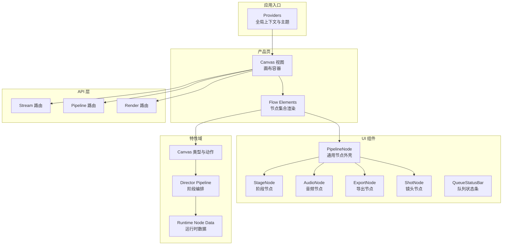
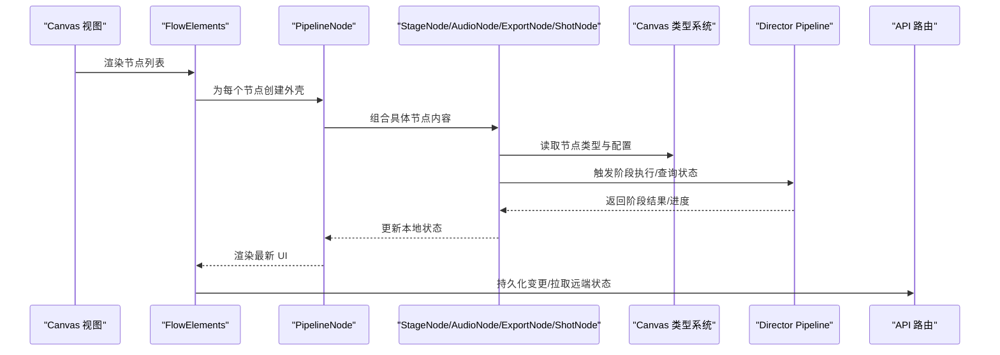
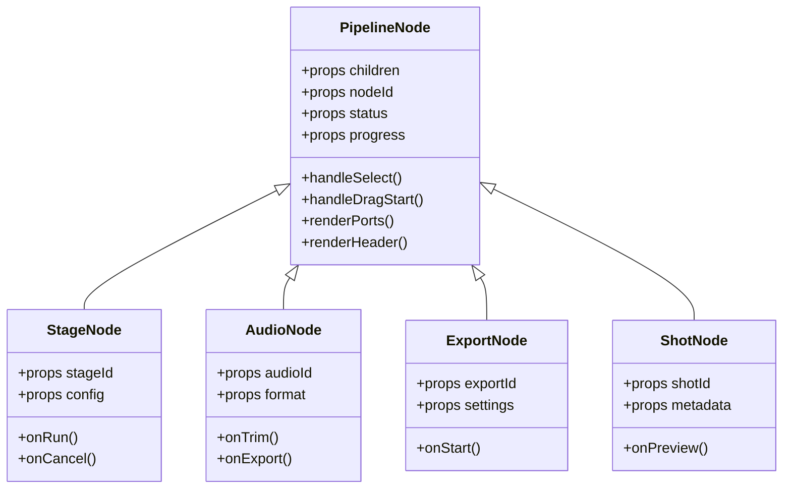
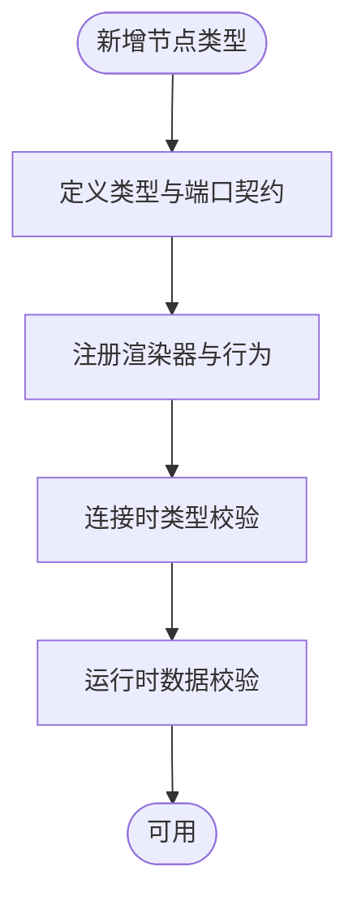
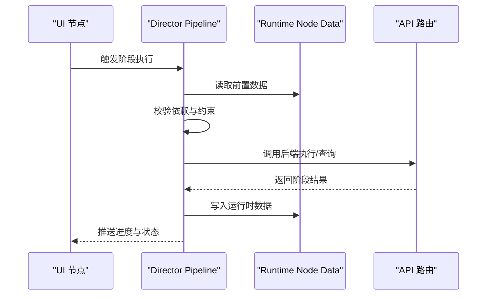
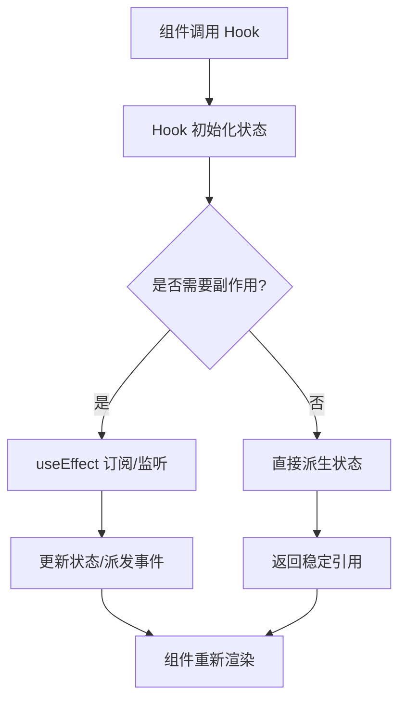
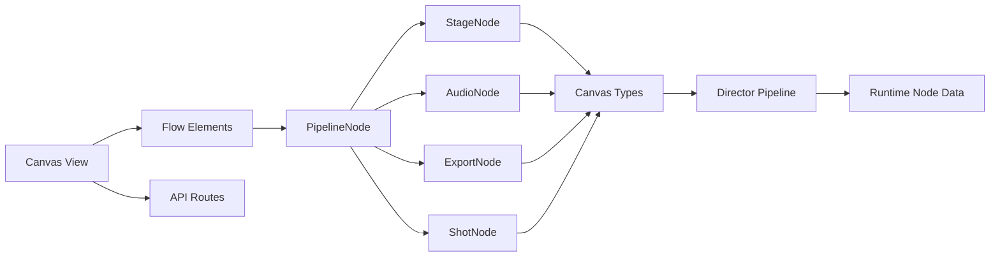

# 组件设计模式

<cite>
**本文档引用的文件**   
- [src/components/ui/pipeline-node.tsx](file://src/components/ui/pipeline-node.tsx)
- [src/components/ui/node/types.ts](file://src/components/ui/node/types.ts)
- [src/components/ui/node/stage-node.tsx](file://src/components/ui/node/stage-node.tsx)
- [src/components/ui/node/audio-node.tsx](file://src/components/ui/node/audio-node.tsx)
- [src/components/ui/node/export-node.tsx](file://src/components/ui/node/export-node.tsx)
- [src/components/ui/node/shot-node.tsx](file://src/components/ui/node/shot-node.tsx)
- [src/features/canvas/types.ts](file://src/features/canvas/types.ts)
- [src/features/canvas/actions.ts](file://src/features/canvas/actions.ts)
- [src/features/canvas/layout.ts](file://src/features/canvas/layout.ts)
- [src/features/director/pipeline.ts](file://src/features/director/pipeline.ts)
- [src/features/director/stage-runner.ts](file://src/features/director/stage-runner.ts)
- [src/features/director/runtime-node-data.ts](file://src/features/director/runtime-node-data.ts)
- [src/lib/hooks/index.ts](file://src/lib/hooks/index.ts)
- [src/app/providers.tsx](file://src/app/providers.tsx)
- [src/components/ui/queue-status-bar.tsx](file://src/components/ui/queue-status-bar.tsx)
- [src/components/ui/project-statistics-panel.tsx](file://src/components/ui/project-statistics-panel.tsx)
- [src/app/products/(app)/canvas/[projectId]/canvas-view.tsx](file://src/app/products/(app)/canvas/[projectId]/canvas-view.tsx)
- [src/app/products/(app)/canvas/[projectId]/flow-elements.tsx](file://src/app/products/(app)/canvas/[projectId]/flow-elements.tsx)
- [src/app/products/(app)/canvas/[projectId]/canvas-action-api.ts](file://src/app/products/(app)/canvas/[projectId]/canvas-action-api.ts)
- [src/app/api/director/stream/route.ts](file://src/app/api/director/stream/route.ts)
- [src/app/api/director/pipeline/route.ts](file://src/app/api/director/pipeline/route.ts)
- [src/app/api/render/route.ts](file://src/app/api/render/route.ts)
- [vitest.config.ts](file://vitest.config.ts)
- [tests/tts-pipeline-integration.test.ts](file://tests/tts-pipeline-integration.test.ts)
</cite>

## 目录
1. [简介](#简介)
2. [项目结构](#项目结构)
3. [核心组件](#核心组件)
4. [架构总览](#架构总览)
5. [详细组件分析](#详细组件分析)
6. [依赖关系分析](#依赖关系分析)
7. [性能考量](#性能考量)
8. [故障排查指南](#故障排查指南)
9. [结论](#结论)
10. [附录](#附录)

## 简介
本文件系统性梳理 PurpleInk 前端与部分后端在“组件设计模式”上的实践，重点覆盖：
- 组合模式、高阶组件（HOC）、渲染属性（Render Props）等 React 模式在项目中的使用方式
- Canvas 节点类型系统的设计原理与扩展点
- Pipeline 节点的通用实现模式与运行时数据流
- 自定义 Hooks 的开发模式与状态管理在组件中的应用
- 组件测试策略、文档生成流程与版本管理最佳实践

## 项目结构
本项目采用按功能域组织的前端代码结构，UI 组件集中在 src/components/ui，业务特性集中在 src/features，应用路由与页面位于 src/app。Canvas 相关能力由 features/canvas 提供类型、布局与动作；Director 模块负责 Pipeline 编排与阶段执行；API 层通过 Next.js Route Handlers 暴露管道与渲染能力。

图表来源
- [src/app/providers.tsx](file://src/app/providers.tsx)
- [src/app/products/(app)/canvas/[projectId]/canvas-view.tsx](file://src/app/products/(app)/canvas/[projectId]/canvas-view.tsx)
- [src/app/products/(app)/canvas/[projectId]/flow-elements.tsx](file://src/app/products/(app)/canvas/[projectId]/flow-elements.tsx)
- [src/components/ui/pipeline-node.tsx](file://src/components/ui/pipeline-node.tsx)
- [src/components/ui/node/stage-node.tsx](file://src/components/ui/node/stage-node.tsx)
- [src/components/ui/node/audio-node.tsx](file://src/components/ui/node/audio-node.tsx)
- [src/components/ui/node/export-node.tsx](file://src/components/ui/node/export-node.tsx)
- [src/components/ui/node/shot-node.tsx](file://src/components/ui/node/shot-node.tsx)
- [src/features/canvas/types.ts](file://src/features/canvas/types.ts)
- [src/features/director/pipeline.ts](file://src/features/director/pipeline.ts)
- [src/features/director/runtime-node-data.ts](file://src/features/director/runtime-node-data.ts)
- [src/app/api/director/stream/route.ts](file://src/app/api/director/stream/route.ts)
- [src/app/api/director/pipeline/route.ts](file://src/app/api/director/pipeline/route.ts)
- [src/app/api/render/route.ts](file://src/app/api/render/route.ts)

章节来源
- [src/app/providers.tsx](file://src/app/providers.tsx)
- [src/app/products/(app)/canvas/[projectId]/canvas-view.tsx](file://src/app/products/(app)/canvas/[projectId]/canvas-view.tsx)
- [src/app/products/(app)/canvas/[projectId]/flow-elements.tsx](file://src/app/products/(app)/canvas/[projectId]/flow-elements.tsx)
- [src/components/ui/pipeline-node.tsx](file://src/components/ui/pipeline-node.tsx)
- [src/features/canvas/types.ts](file://src/features/canvas/types.ts)
- [src/features/director/pipeline.ts](file://src/features/director/pipeline.ts)

## 核心组件
- PipelineNode：作为所有 Pipeline 节点的通用外壳，封装拖拽、选中态、错误提示、进度展示、输入输出端口等横切关注点，并通过组合模式将具体节点内容注入到统一布局中。
- StageNode/AudioNode/ExportNode/ShotNode：基于 PipelineNode 的具体节点实现，分别承载不同业务语义的可视化与交互。
- Canvas 类型系统：集中定义节点类型、连接关系、状态机与校验规则，确保节点图的一致性与可演进性。
- Director Pipeline：描述阶段的执行顺序、依赖关系与运行时数据传递，驱动节点从“待运行”到“完成/失败”的状态流转。

章节来源
- [src/components/ui/pipeline-node.tsx](file://src/components/ui/pipeline-node.tsx)
- [src/components/ui/node/stage-node.tsx](file://src/components/ui/node/stage-node.tsx)
- [src/components/ui/node/audio-node.tsx](file://src/components/ui/node/audio-node.tsx)
- [src/components/ui/node/export-node.tsx](file://src/components/ui/node/export-node.tsx)
- [src/components/ui/node/shot-node.tsx](file://src/components/ui/node/shot-node.tsx)
- [src/features/canvas/types.ts](file://src/features/canvas/types.ts)
- [src/features/director/pipeline.ts](file://src/features/director/pipeline.ts)

## 架构总览
下图展示了从 UI 到业务逻辑再到 API 的整体调用链，体现组合模式与渲染属性的协作：Canvas 视图聚合 FlowElements，后者根据节点类型选择具体节点组件；节点内部通过组合模式复用 PipelineNode 的能力；运行时数据由 Director 模块维护并经由 API 同步。

图表来源
- [src/app/products/(app)/canvas/[projectId]/canvas-view.tsx](file://src/app/products/(app)/canvas/[projectId]/canvas-view.tsx)
- [src/app/products/(app)/canvas/[projectId]/flow-elements.tsx](file://src/app/products/(app)/canvas/[projectId]/flow-elements.tsx)
- [src/components/ui/pipeline-node.tsx](file://src/components/ui/pipeline-node.tsx)
- [src/components/ui/node/stage-node.tsx](file://src/components/ui/node/stage-node.tsx)
- [src/components/ui/node/audio-node.tsx](file://src/components/ui/node/audio-node.tsx)
- [src/components/ui/node/export-node.tsx](file://src/components/ui/node/export-node.tsx)
- [src/components/ui/node/shot-node.tsx](file://src/components/ui/node/shot-node.tsx)
- [src/features/canvas/types.ts](file://src/features/canvas/types.ts)
- [src/features/director/pipeline.ts](file://src/features/director/pipeline.ts)
- [src/app/api/director/stream/route.ts](file://src/app/api/director/stream/route.ts)
- [src/app/api/director/pipeline/route.ts](file://src/app/api/director/pipeline/route.ts)

## 详细组件分析

### PipelineNode 通用外壳（组合模式 + 渲染属性）
- 职责边界：统一处理节点边框、标题栏、端口区域、错误与进度、快捷键与拖拽行为。
- 组合模式：通过 props.children 或 render prop 注入具体节点内容，保持外壳稳定、内容可变。
- 渲染属性：对需要跨节点复用的行为（如高亮、禁用、只读）以回调形式暴露给子节点，避免深层 props 透传。
- 状态管理：内部维护选中态、错误态、进度等局部状态，并通过事件向上冒泡，便于上层编排。

图表来源
- [src/components/ui/pipeline-node.tsx](file://src/components/ui/pipeline-node.tsx)
- [src/components/ui/node/stage-node.tsx](file://src/components/ui/node/stage-node.tsx)
- [src/components/ui/node/audio-node.tsx](file://src/components/ui/node/audio-node.tsx)
- [src/components/ui/node/export-node.tsx](file://src/components/ui/node/export-node.tsx)
- [src/components/ui/node/shot-node.tsx](file://src/components/ui/node/shot-node.tsx)

章节来源
- [src/components/ui/pipeline-node.tsx](file://src/components/ui/pipeline-node.tsx)
- [src/components/ui/node/stage-node.tsx](file://src/components/ui/node/stage-node.tsx)
- [src/components/ui/node/audio-node.tsx](file://src/components/ui/node/audio-node.tsx)
- [src/components/ui/node/export-node.tsx](file://src/components/ui/node/export-node.tsx)
- [src/components/ui/node/shot-node.tsx](file://src/components/ui/node/shot-node.tsx)

### Canvas 节点类型系统（类型安全与可扩展）
- 类型定义：集中声明节点类型枚举、输入输出端口契约、状态机与校验规则，保证节点图的结构一致性。
- 扩展机制：新增节点类型时只需注册类型映射与渲染器，无需修改现有渲染逻辑，符合开闭原则。
- 数据流：节点间通过端口进行数据绑定，类型系统在连接建立时进行静态检查与运行时校验。

图表来源
- [src/features/canvas/types.ts](file://src/features/canvas/types.ts)
- [src/features/canvas/actions.ts](file://src/features/canvas/actions.ts)
- [src/features/canvas/layout.ts](file://src/features/canvas/layout.ts)

章节来源
- [src/features/canvas/types.ts](file://src/features/canvas/types.ts)
- [src/features/canvas/actions.ts](file://src/features/canvas/actions.ts)
- [src/features/canvas/layout.ts](file://src/features/canvas/layout.ts)

### Director Pipeline 节点编排（阶段执行与状态机）
- 阶段模型：每个阶段包含前置依赖、输入输出、执行函数与错误恢复策略。
- 执行引擎：按拓扑顺序调度阶段，支持并发控制、重试与回滚。
- 运行时数据：节点级运行时数据集中管理，供 UI 与 API 共享。

图表来源
- [src/features/director/pipeline.ts](file://src/features/director/pipeline.ts)
- [src/features/director/stage-runner.ts](file://src/features/director/stage-runner.ts)
- [src/features/director/runtime-node-data.ts](file://src/features/director/runtime-node-data.ts)
- [src/app/api/director/stream/route.ts](file://src/app/api/director/stream/route.ts)
- [src/app/api/director/pipeline/route.ts](file://src/app/api/director/pipeline/route.ts)

章节来源
- [src/features/director/pipeline.ts](file://src/features/director/pipeline.ts)
- [src/features/director/stage-runner.ts](file://src/features/director/stage-runner.ts)
- [src/features/director/runtime-node-data.ts](file://src/features/director/runtime-node-data.ts)
- [src/app/api/director/stream/route.ts](file://src/app/api/director/stream/route.ts)
- [src/app/api/director/pipeline/route.ts](file://src/app/api/director/pipeline/route.ts)

### 自定义 Hooks 开发模式与状态管理
- 设计原则：将副作用、网络请求、状态派生封装为可复用的 Hook，组件仅关注渲染与交互。
- 常见模式：useEffect 用于订阅外部事件；useMemo/useCallback 优化计算与引用稳定性；自定义 Hook 组合多个基础 Hook 形成领域能力。
- 状态管理：在组件内使用 useState/useReducer 管理局部状态；跨组件状态通过 Context 或上层状态库管理。

章节来源
- [src/lib/hooks/index.ts](file://src/lib/hooks/index.ts)
- [src/app/providers.tsx](file://src/app/providers.tsx)
- [src/components/ui/queue-status-bar.tsx](file://src/components/ui/queue-status-bar.tsx)
- [src/components/ui/project-statistics-panel.tsx](file://src/components/ui/project-statistics-panel.tsx)

## 依赖关系分析
- 组件耦合：PipelineNode 作为基类被多种节点继承，降低重复代码；具体节点仅依赖 Canvas 类型系统与 Director 运行时接口。
- 外部依赖：Next.js Route Handlers 提供 API 能力；Vitest 用于单元测试与集成测试。
- 潜在循环：确保 UI 不直接依赖 API 路由实现，而是通过抽象的服务层或 Hook 调用，避免循环依赖。

图表来源
- [src/components/ui/pipeline-node.tsx](file://src/components/ui/pipeline-node.tsx)
- [src/components/ui/node/stage-node.tsx](file://src/components/ui/node/stage-node.tsx)
- [src/components/ui/node/audio-node.tsx](file://src/components/ui/node/audio-node.tsx)
- [src/components/ui/node/export-node.tsx](file://src/components/ui/node/export-node.tsx)
- [src/components/ui/node/shot-node.tsx](file://src/components/ui/node/shot-node.tsx)
- [src/features/canvas/types.ts](file://src/features/canvas/types.ts)
- [src/features/director/pipeline.ts](file://src/features/director/pipeline.ts)
- [src/features/director/runtime-node-data.ts](file://src/features/director/runtime-node-data.ts)
- [src/app/products/(app)/canvas/[projectId]/canvas-view.tsx](file://src/app/products/(app)/canvas/[projectId]/canvas-view.tsx)
- [src/app/products/(app)/canvas/[projectId]/flow-elements.tsx](file://src/app/products/(app)/canvas/[projectId]/flow-elements.tsx)
- [src/app/api/director/stream/route.ts](file://src/app/api/director/stream/route.ts)
- [src/app/api/director/pipeline/route.ts](file://src/app/api/director/pipeline/route.ts)

章节来源
- [src/components/ui/pipeline-node.tsx](file://src/components/ui/pipeline-node.tsx)
- [src/features/canvas/types.ts](file://src/features/canvas/types.ts)
- [src/features/director/pipeline.ts](file://src/features/director/pipeline.ts)
- [src/app/products/(app)/canvas/[projectId]/canvas-view.tsx](file://src/app/products/(app)/canvas/[projectId]/canvas-view.tsx)
- [src/app/products/(app)/canvas/[projectId]/flow-elements.tsx](file://src/app/products/(app)/canvas/[projectId]/flow-elements.tsx)

## 性能考量
- 渲染优化：使用 React.memo、useMemo、useCallback 减少不必要的重渲染；对大列表采用虚拟滚动与懒加载。
- 状态更新：批量更新状态，避免频繁 setState；对复杂派生状态使用 selector 模式。
- 网络请求：合并请求、缓存响应、增量更新；长任务通过 Web Worker 或后端异步任务处理。
- 资源管理：及时清理副作用（定时器、事件监听），防止内存泄漏。

## 故障排查指南
- 常见问题定位：
  - 节点状态不一致：检查运行时数据写入路径与 UI 同步逻辑。
  - 阶段执行失败：查看阶段日志、错误恢复策略与重试次数。
  - 连接校验失败：确认端口类型契约与连接时的类型检查。
- 调试建议：
  - 启用严格模式与开发者工具，观察组件树与状态变化。
  - 使用断言测试验证关键路径，确保回归安全。
  - 对 API 调用增加超时与重试保护，记录错误上下文。

章节来源
- [src/features/director/stage-runner.ts](file://src/features/director/stage-runner.ts)
- [src/features/director/runtime-node-data.ts](file://src/features/director/runtime-node-data.ts)
- [src/features/canvas/types.ts](file://src/features/canvas/types.ts)

## 结论
本项目通过组合模式与渲染属性实现了高度可复用的节点外壳，结合类型安全的 Canvas 节点系统与强大的 Director Pipeline 编排引擎，构建了可扩展、可维护的可视化工作流。自定义 Hooks 与清晰的状态管理模式进一步提升了组件的可读性与可测试性。配合完善的测试策略与文档流程，项目在持续演进中保持了高质量与稳定性。

## 附录

### 组件测试策略
- 单元与集成测试：使用 Vitest 对组件、Hooks 与业务逻辑进行测试，确保行为正确与回归安全。
- 快照测试：对 UI 快照进行比对，快速发现意外变更。
- 端到端测试：模拟用户操作，验证关键业务流程。

章节来源
- [vitest.config.ts](file://vitest.config.ts)
- [tests/tts-pipeline-integration.test.ts](file://tests/tts-pipeline-integration.test.ts)

### 文档生成流程
- 自动文档：基于源码注释与类型定义生成 API 文档，确保文档与代码一致。
- 示例与用例：为关键组件提供 Demo 与使用示例，帮助开发者快速上手。
- 版本管理：遵循语义化版本控制，发布前进行回归测试与兼容性检查。

### 版本管理最佳实践
- 分支策略：主分支保持稳定，功能分支独立开发，合并前进行代码审查与自动化测试。
- 提交规范：使用约定式提交信息，便于自动生成变更日志。
- 发布流程：自动化构建、打包与部署，确保环境一致性与可追溯性。