# 反馈和状态组件

<cite>
**本文引用的文件**   
- [toast.tsx](file://src/components/ui/toast.tsx)
- [progress-bar.tsx](file://src/components/ui/progress-bar.tsx)
- [status-pill.tsx](file://src/components/ui/status-pill.tsx)
- [queue-status-bar.tsx](file://src/components/ui/queue-status-bar.tsx)
- [empty-state.tsx](file://src/components/ui/empty-state.tsx)
- [skeleton.tsx](file://src/components/ui/skeleton.tsx)
- [pipeline-feedback.ts](file://src/app/products/(app)/canvas/[projectId]/pipeline-feedback.ts)
- [live-status.ts](file://src/app/products/(app)/canvas/[projectId]/live-status.ts)
- [streaming-log-card.tsx](file://src/app/products/(app)/canvas/[projectId]/streaming-log-card.tsx)
- [stage-error-dialog.tsx](file://src/app/products/(app)/canvas/[projectId]/stage-error-dialog.tsx)
- [providers.tsx](file://src/app/providers.tsx)
- [theme-control.tsx](file://src/app/products/(app)/settings/theme-control.tsx)
</cite>

## 目录
1. [简介](#简介)
2. [项目结构](#项目结构)
3. [核心组件](#核心组件)
4. [架构总览](#架构总览)
5. [详细组件分析](#详细组件分析)
6. [依赖关系分析](#依赖关系分析)
7. [性能考量](#性能考量)
8. [故障排查指南](#故障排查指南)
9. [结论](#结论)
10. [附录](#附录)

## 简介
本文件聚焦 PurpleInk 前端中的“反馈与状态”体系，系统梳理 Toast 通知、进度条、状态指示器、队列状态栏、空状态与骨架屏等组件的设计模式与交互逻辑。文档覆盖加载/空/错误状态的视觉表现与处理流程，消息队列管理、优先级排序与自动消失机制，以及与业务逻辑的解耦设计与事件通信模式。同时给出多语言支持、无障碍访问（a11y）与国际化配置建议，以及状态管理的最佳实践与用户体验优化要点。

## 项目结构
反馈与状态相关代码主要分布在：
- UI 基础组件层：Toast、进度条、状态胶囊、队列状态栏、空状态、骨架屏等
- 产品页面层：画布工作区内的管道反馈、实时状态、流式日志、阶段错误弹窗等
- 应用提供者层：主题与全局上下文（如 i18n、通知中心）的挂载点

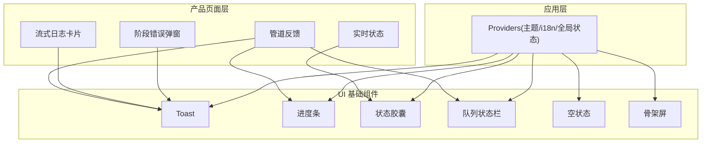

图表来源
- [toast.tsx:1-200](file://src/components/ui/toast.tsx#L1-L200)
- [progress-bar.tsx:1-200](file://src/components/ui/progress-bar.tsx#L1-L200)
- [status-pill.tsx:1-200](file://src/components/ui/status-pill.tsx#L1-L200)
- [queue-status-bar.tsx:1-200](file://src/components/ui/queue-status-bar.tsx#L1-L200)
- [empty-state.tsx:1-200](file://src/components/ui/empty-state.tsx#L1-L200)
- [skeleton.tsx:1-200](file://src/components/ui/skeleton.tsx#L1-L200)
- [pipeline-feedback.ts:1-200](file://src/app/products/(app)/canvas/[projectId]/pipeline-feedback.ts#L1-L200)
- [live-status.ts:1-200](file://src/app/products/(app)/canvas/[projectId]/live-status.ts#L1-L200)
- [streaming-log-card.tsx:1-200](file://src/app/products/(app)/canvas/[projectId]/streaming-log-card.tsx#L1-L200)
- [stage-error-dialog.tsx:1-200](file://src/app/products/(app)/canvas/[projectId]/stage-error-dialog.tsx#L1-L200)
- [providers.tsx:1-200](file://src/app/providers.tsx#L1-L200)

章节来源
- [toast.tsx:1-200](file://src/components/ui/toast.tsx#L1-L200)
- [progress-bar.tsx:1-200](file://src/components/ui/progress-bar.tsx#L1-L200)
- [status-pill.tsx:1-200](file://src/components/ui/status-pill.tsx#L1-L200)
- [queue-status-bar.tsx:1-200](file://src/components/ui/queue-status-bar.tsx#L1-L200)
- [empty-state.tsx:1-200](file://src/components/ui/empty-state.tsx#L1-L200)
- [skeleton.tsx:1-200](file://src/components/ui/skeleton.tsx#L1-L200)
- [pipeline-feedback.ts:1-200](file://src/app/products/(app)/canvas/[projectId]/pipeline-feedback.ts#L1-L200)
- [live-status.ts:1-200](file://src/app/products/(app)/canvas/[projectId]/live-status.ts#L1-L200)
- [streaming-log-card.tsx:1-200](file://src/app/products/(app)/canvas/[projectId]/streaming-log-card.tsx#L1-L200)
- [stage-error-dialog.tsx:1-200](file://src/app/products/(app)/canvas/[projectId]/stage-error-dialog.tsx#L1-L200)
- [providers.tsx:1-200](file://src/app/providers.tsx#L1-L200)

## 核心组件
- Toast 通知：用于即时反馈（成功、失败、警告、信息），支持消息队列、优先级、自动消失与手动操作。
- 进度条：展示任务执行进度，支持确定性/不确定性进度、分段与可取消。
- 状态胶囊：轻量状态标签（进行中、完成、失败、等待等），常用于节点或步骤级状态。
- 队列状态栏：聚合显示队列长度、吞吐、延迟等运行态指标。
- 空状态：无数据时的引导与操作入口。
- 骨架屏：占位动画，提升感知性能。

章节来源
- [toast.tsx:1-200](file://src/components/ui/toast.tsx#L1-L200)
- [progress-bar.tsx:1-200](file://src/components/ui/progress-bar.tsx#L1-L200)
- [status-pill.tsx:1-200](file://src/components/ui/status-pill.tsx#L1-L200)
- [queue-status-bar.tsx:1-200](file://src/components/ui/queue-status-bar.tsx#L1-L200)
- [empty-state.tsx:1-200](file://src/components/ui/empty-state.tsx#L1-L200)
- [skeleton.tsx:1-200](file://src/components/ui/skeleton.tsx#L1-L200)

## 架构总览
反馈与状态体系采用“组件 + 状态提供者”的解耦设计：
- 组件只负责渲染与用户交互
- 状态通过集中式提供者（Provider）或事件总线进行分发
- 业务侧通过 API 触发通知、更新进度、切换状态，不直接操作 DOM

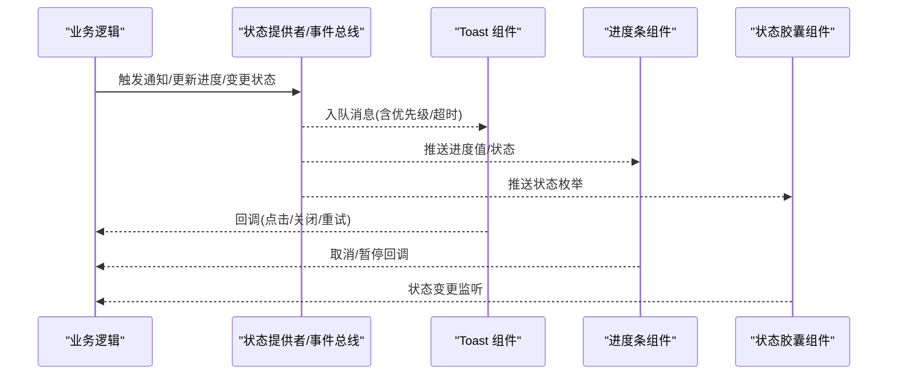

图表来源
- [pipeline-feedback.ts:1-200](file://src/app/products/(app)/canvas/[projectId]/pipeline-feedback.ts#L1-L200)
- [live-status.ts:1-200](file://src/app/products/(app)/canvas/[projectId]/live-status.ts#L1-L200)
- [streaming-log-card.tsx:1-200](file://src/app/products/(app)/canvas/[projectId]/streaming-log-card.tsx#L1-L200)
- [stage-error-dialog.tsx:1-200](file://src/app/products/(app)/canvas/[projectId]/stage-error-dialog.tsx#L1-L200)
- [providers.tsx:1-200](file://src/app/providers.tsx#L1-L200)

## 详细组件分析

### Toast 通知
- 功能要点
  - 消息类型：成功、失败、警告、信息
  - 行为：自动消失、手动关闭、重试/跳转等操作按钮
  - 队列：先进先出，支持优先级插队与去重
  - 生命周期：创建→显示→倒计时→销毁
- 交互流程
  - 业务调用通知 API → 入队并渲染 → 用户交互或超时 → 移除
- 无障碍与国际化
  - aria-live 区域播报关键状态
  - 文案通过 i18n key 注入，支持动态切换语言

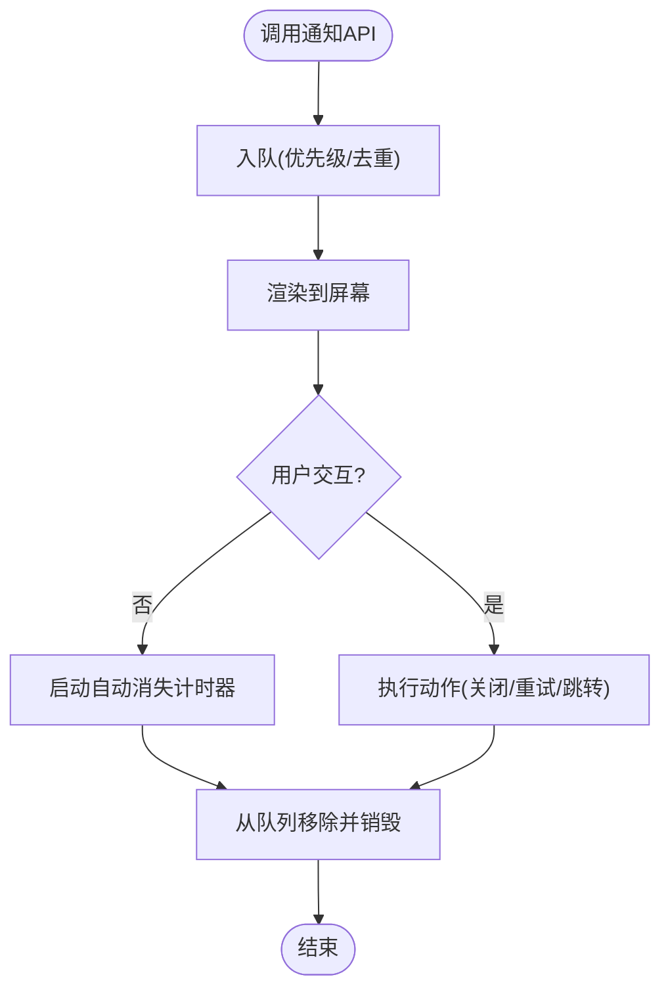

图表来源
- [toast.tsx:1-200](file://src/components/ui/toast.tsx#L1-L200)

章节来源
- [toast.tsx:1-200](file://src/components/ui/toast.tsx#L1-L200)

### 进度条
- 功能要点
  - 确定进度：百分比驱动；不确定进度：脉冲/滚动动画
  - 分段进度：按阶段显示已完成比例
  - 可取消：提供中止信号
- 使用场景
  - 导出、渲染、上传等大任务
- 与业务解耦
  - 通过事件或状态订阅更新，避免强耦合

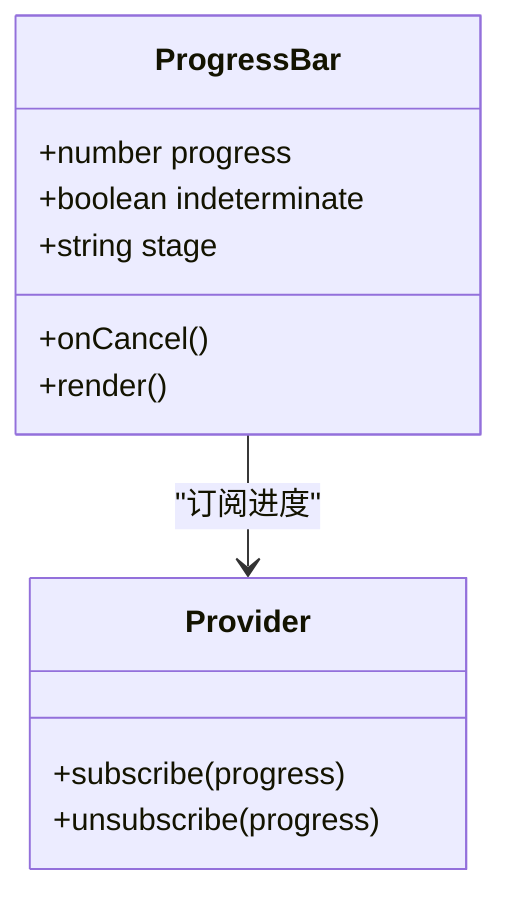

图表来源
- [progress-bar.tsx:1-200](file://src/components/ui/progress-bar.tsx#L1-L200)

章节来源
- [progress-bar.tsx:1-200](file://src/components/ui/progress-bar.tsx#L1-L200)

### 状态胶囊（Status Pill）
- 功能要点
  - 状态枚举：进行中、完成、失败、等待、跳过等
  - 颜色与图标映射，语义化文本
- 使用场景
  - 节点、步骤、任务行内状态展示
- 无障碍
  - role="status"，aria-label 描述当前状态

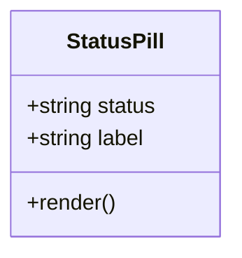

图表来源
- [status-pill.tsx:1-200](file://src/components/ui/status-pill.tsx#L1-L200)

章节来源
- [status-pill.tsx:1-200](file://src/components/ui/status-pill.tsx#L1-L200)

### 队列状态栏（Queue Status Bar）
- 功能要点
  - 显示队列长度、平均耗时、吞吐、错误率
  - 实时更新，支持折叠与详情面板
- 数据来源
  - 来自后端指标或本地统计汇总

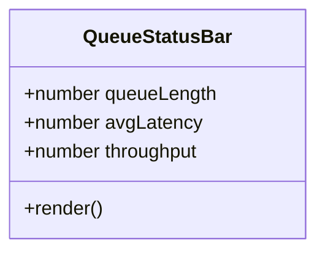

图表来源
- [queue-status-bar.tsx:1-200](file://src/components/ui/queue-status-bar.tsx#L1-L200)

章节来源
- [queue-status-bar.tsx:1-200](file://src/components/ui/queue-status-bar.tsx#L1-L200)

### 空状态（Empty State）
- 功能要点
  - 无数据时展示引导文案与操作入口
  - 支持自定义插图与按钮
- 使用场景
  - 列表为空、搜索无结果、权限不足等

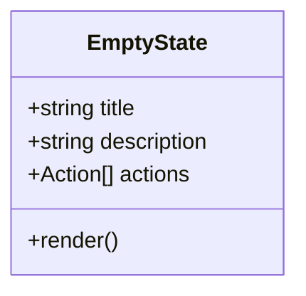

图表来源
- [empty-state.tsx:1-200](file://src/components/ui/empty-state.tsx#L1-L200)

章节来源
- [empty-state.tsx:1-200](file://src/components/ui/empty-state.tsx#L1-L200)

### 骨架屏（Skeleton）
- 功能要点
  - 占位动画，降低首屏空白感
  - 可按布局自适应尺寸
- 使用场景
  - 列表项、卡片、表格行等

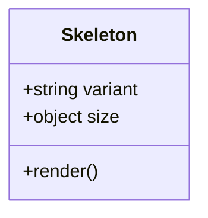

图表来源
- [skeleton.tsx:1-200](file://src/components/ui/skeleton.tsx#L1-L200)

章节来源
- [skeleton.tsx:1-200](file://src/components/ui/skeleton.tsx#L1-L200)

### 管道反馈（Pipeline Feedback）
- 职责
  - 聚合任务各阶段的进度、状态与错误信息
  - 将底层事件转换为上层可读的反馈
- 与 Toast/进度条/状态胶囊协作
  - 通过事件总线分发，组件仅消费

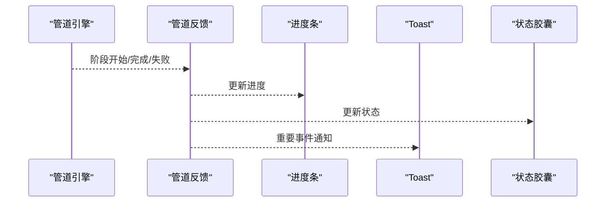

图表来源
- [pipeline-feedback.ts:1-200](file://src/app/products/(app)/canvas/[projectId]/pipeline-feedback.ts#L1-L200)

章节来源
- [pipeline-feedback.ts:1-200](file://src/app/products/(app)/canvas/[projectId]/pipeline-feedback.ts#L1-L200)

### 实时状态（Live Status）
- 职责
  - 订阅运行时状态变化，驱动 UI 刷新
- 与状态胶囊联动
  - 根据状态枚举切换颜色与文案

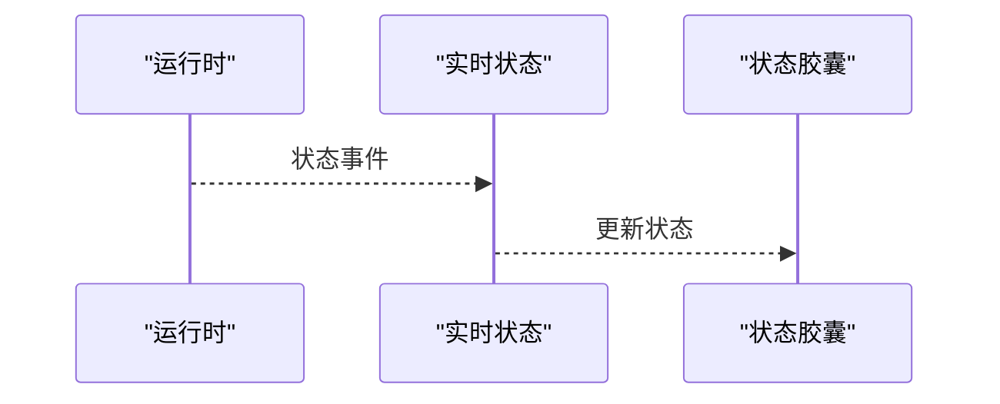

图表来源
- [live-status.ts:1-200](file://src/app/products/(app)/canvas/[projectId]/live-status.ts#L1-L200)

章节来源
- [live-status.ts:1-200](file://src/app/products/(app)/canvas/[projectId]/live-status.ts#L1-L200)

### 流式日志卡片（Streaming Log Card）
- 职责
  - 增量渲染日志，支持高亮、过滤与复制
- 与 Toast 联动
  - 异常日志触发错误 Toast

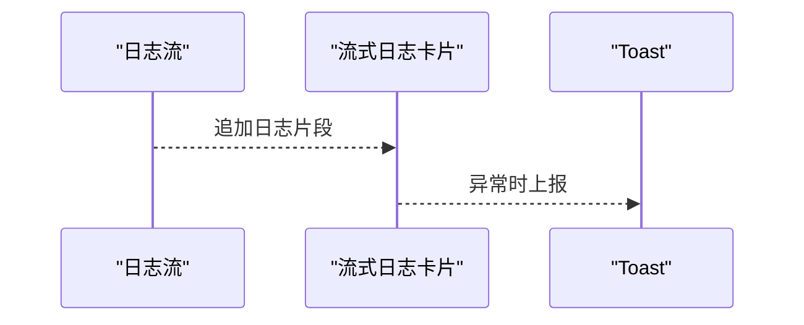

图表来源
- [streaming-log-card.tsx:1-200](file://src/app/products/(app)/canvas/[projectId]/streaming-log-card.tsx#L1-L200)

章节来源
- [streaming-log-card.tsx:1-200](file://src/app/products/(app)/canvas/[projectId]/streaming-log-card.tsx#L1-L200)

### 阶段错误弹窗（Stage Error Dialog）
- 职责
  - 捕获阶段错误，提供重试、跳过、查看详情等操作
- 与 Toast 联动
  - 操作结果以 Toast 反馈

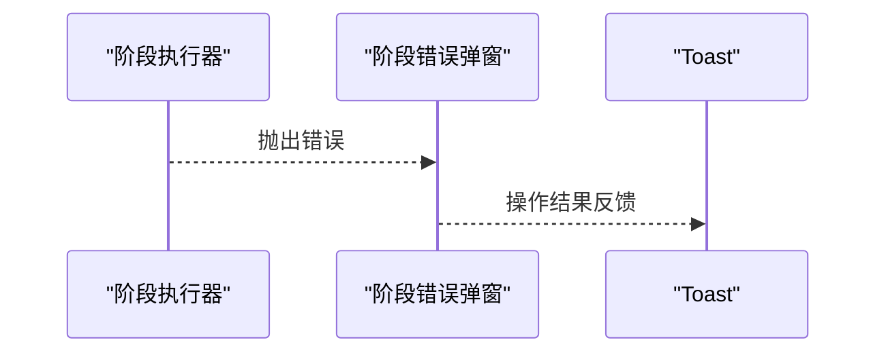

图表来源
- [stage-error-dialog.tsx:1-200](file://src/app/products/(app)/canvas/[projectId]/stage-error-dialog.tsx#L1-L200)

章节来源
- [stage-error-dialog.tsx:1-200](file://src/app/products/(app)/canvas/[projectId]/stage-error-dialog.tsx#L1-L200)

## 依赖关系分析
- 组件间低耦合：通过事件/状态订阅通信，避免直接引用
- 提供者层统一：主题、i18n、通知中心等能力由 Providers 注入
- 外部依赖：样式主题、动画库、网络请求封装等

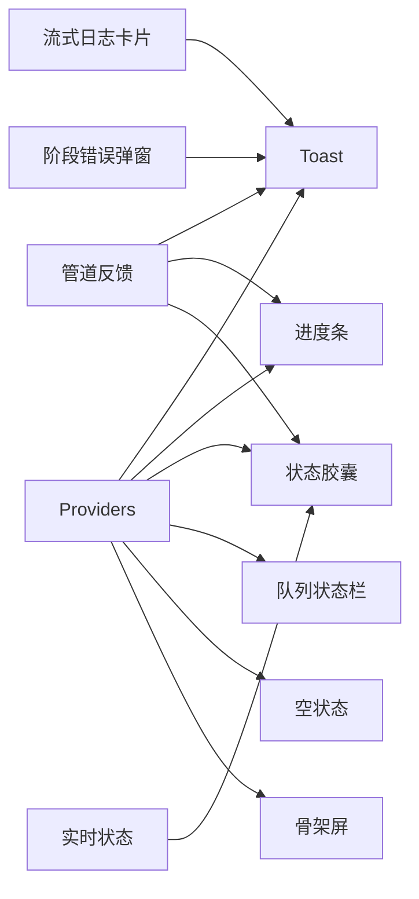

图表来源
- [providers.tsx:1-200](file://src/app/providers.tsx#L1-L200)
- [toast.tsx:1-200](file://src/components/ui/toast.tsx#L1-L200)
- [progress-bar.tsx:1-200](file://src/components/ui/progress-bar.tsx#L1-L200)
- [status-pill.tsx:1-200](file://src/components/ui/status-pill.tsx#L1-L200)
- [queue-status-bar.tsx:1-200](file://src/components/ui/queue-status-bar.tsx#L1-L200)
- [empty-state.tsx:1-200](file://src/components/ui/empty-state.tsx#L1-L200)
- [skeleton.tsx:1-200](file://src/components/ui/skeleton.tsx#L1-L200)
- [pipeline-feedback.ts:1-200](file://src/app/products/(app)/canvas/[projectId]/pipeline-feedback.ts#L1-L200)
- [live-status.ts:1-200](file://src/app/products/(app)/canvas/[projectId]/live-status.ts#L1-L200)
- [streaming-log-card.tsx:1-200](file://src/app/products/(app)/canvas/[projectId]/streaming-log-card.tsx#L1-L200)
- [stage-error-dialog.tsx:1-200](file://src/app/products/(app)/canvas/[projectId]/stage-error-dialog.tsx#L1-L200)

章节来源
- [providers.tsx:1-200](file://src/app/providers.tsx#L1-L200)

## 性能考量
- 渲染优化
  - 列表与日志增量更新，避免全量重绘
  - 骨架屏替代长耗时加载的首屏空白
- 内存与定时器
  - Toast 自动消失需严格清理定时器与事件监听
  - 大日志流分页与虚拟滚动
- 网络与并发
  - 进度与状态更新节流，避免高频抖动
  - 错误重试退避策略

[本节为通用指导，无需源码引用]

## 故障排查指南
- Toast 未出现
  - 检查是否被其他组件遮挡或层级问题
  - 确认消息入队与渲染链路是否完整
- 进度条不更新
  - 检查事件订阅是否正确绑定与释放
  - 确认进度值范围与边界处理
- 状态胶囊颜色异常
  - 核对状态枚举与颜色映射表
  - 检查主题变量是否生效
- 队列状态栏数据不刷新
  - 检查数据源连接与轮询间隔
  - 确认错误计数与异常上报路径

章节来源
- [toast.tsx:1-200](file://src/components/ui/toast.tsx#L1-L200)
- [progress-bar.tsx:1-200](file://src/components/ui/progress-bar.tsx#L1-L200)
- [status-pill.tsx:1-200](file://src/components/ui/status-pill.tsx#L1-L200)
- [queue-status-bar.tsx:1-200](file://src/components/ui/queue-status-bar.tsx#L1-L200)

## 结论
PurpleInk 的反馈与状态体系以“组件 + 提供者”为核心，实现了高内聚、低耦合的可复用 UI 能力。通过事件与状态订阅，业务逻辑与 UI 呈现解耦；借助 Toast 队列、进度条与状态胶囊的组合，覆盖加载、空、错误等多类状态场景。配合无障碍与国际化配置，可构建一致、友好且可维护的用户体验。

[本节为总结性内容，无需源码引用]

## 附录

### 多语言支持与国际化配置
- 文案来源
  - 所有用户可见文案应通过 i18n key 获取，避免硬编码
- 动态切换
  - 在 Providers 中注入语言包，组件按需订阅语言变更
- 推荐实践
  - 为 Toast、状态胶囊、空状态等统一文案键名规范
  - 对长文案提供截断与换行策略

章节来源
- [providers.tsx:1-200](file://src/app/providers.tsx#L1-L200)
- [theme-control.tsx:1-200](file://src/app/products/(app)/settings/theme-control.tsx#L1-L200)

### 无障碍访问（a11y）
- 语义化标签
  - 使用 role 与 aria-* 属性表达状态与意图
- 键盘可达
  - 确保所有交互可通过键盘完成
- 屏幕阅读器
  - 关键状态变更通过 aria-live 区域播报

章节来源
- [toast.tsx:1-200](file://src/components/ui/toast.tsx#L1-L200)
- [status-pill.tsx:1-200](file://src/components/ui/status-pill.tsx#L1-L200)
- [empty-state.tsx:1-200](file://src/components/ui/empty-state.tsx#L1-L200)

### 状态管理最佳实践
- 单一事实来源
  - 状态集中在提供者或 store，组件仅消费
- 不可变更新
  - 使用不可变数据结构，便于调试与时间旅行
- 事件驱动
  - 通过事件总线或发布订阅模式解耦模块
- 错误边界
  - 对异步与渲染异常设置兜底与恢复策略

[本节为通用指导，无需源码引用]

### 用户体验优化建议
- 即时反馈
  - 操作后尽快给出 Toast 或进度提示
- 渐进增强
  - 骨架屏 → 部分数据 → 完整数据
- 容错与回退
  - 失败时提供重试、降级与帮助入口
- 一致性
  - 统一的色彩、动效与文案风格

[本节为通用指导，无需源码引用]