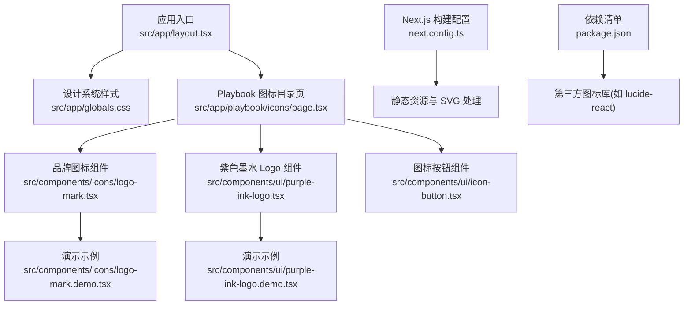
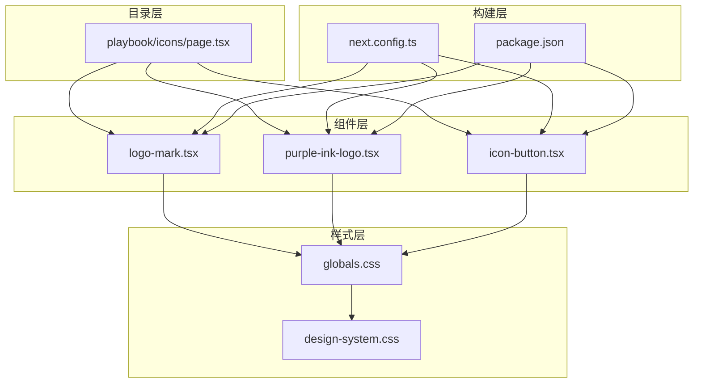
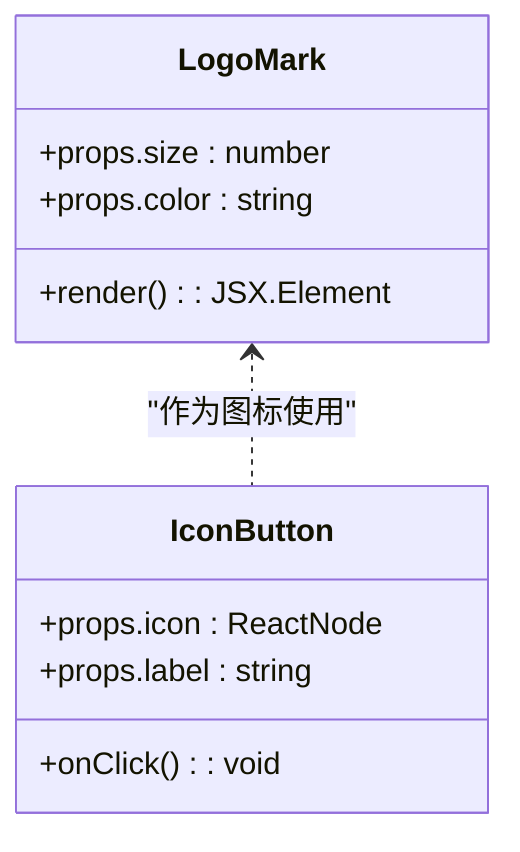
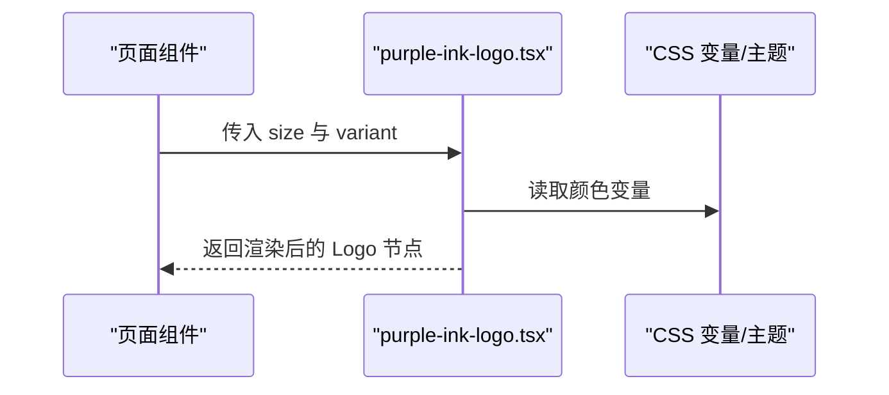
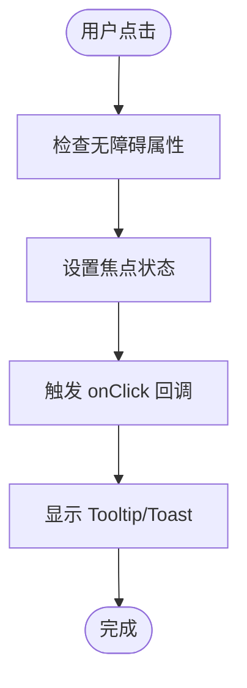
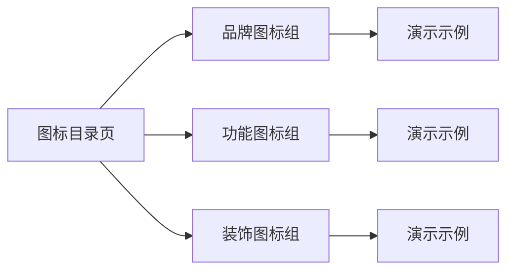
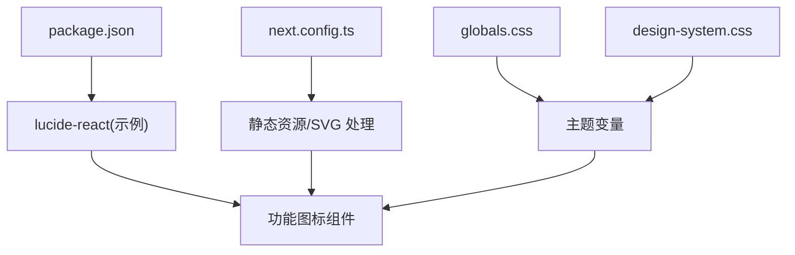

# 图标系统

<cite>
**本文引用的文件**   
- [src/components/icons/logo-mark.tsx](file://src/components/icons/logo-mark.tsx)
- [src/components/icons/logo-mark.demo.tsx](file://src/components/icons/logo-mark.demo.tsx)
- [src/components/icons/lucide-catalog.demo.tsx](file://src/components/icons/lucide-catalog.demo.tsx)
- [src/components/ui/purple-ink-logo.tsx](file://src/components/ui/purple-ink-logo.tsx)
- [src/components/ui/purple-ink-logo.demo.tsx](file://src/components/ui/purple-ink-logo.demo.tsx)
- [src/components/ui/icon-button.tsx](file://src/components/ui/icon-button.tsx)
- [src/app/playbook/icons/page.tsx](file://src/app/playbook/icons/page.tsx)
- [src/app/design-system.css](file://src/app/design-system.css)
- [src/app/globals.css](file://src/app/globals.css)
- [next.config.ts](file://next.config.ts)
- [package.json](file://package.json)
</cite>

## 目录
1. [简介](#简介)
2. [项目结构](#项目结构)
3. [核心组件](#核心组件)
4. [架构总览](#架构总览)
5. [详细组件分析](#详细组件分析)
6. [依赖分析](#依赖分析)
7. [性能考虑](#性能考虑)
8. [故障排查指南](#故障排查指南)
9. [结论](#结论)
10. [附录](#附录)

## 简介
本文件为 PurpleInk 项目的图标系统文档，覆盖品牌图标、功能图标与装饰图标的组织结构与命名规范；阐述 SVG 图标优化策略、字体图标使用场景与动态图标实现方式；说明大小适配、颜色主题与动画效果；解释图标与 UI 组件的集成方式和样式继承机制；并提供资源管理、版本控制与性能优化策略，以及自定义图标开发与最佳实践指导。

## 项目结构
图标相关代码主要分布在以下位置：
- 品牌与产品图标：src/components/icons、src/components/ui/purple-ink-logo.*
- 图标演示与目录页：src/components/icons/*.demo.tsx、src/app/playbook/icons/page.tsx
- 全局样式与主题变量：src/app/globals.css、src/app/design-system.css
- Next.js 构建配置（静态资源处理）：next.config.ts
- 依赖声明（第三方图标库等）：package.json

图表来源
- [src/app/playbook/icons/page.tsx](file://src/app/playbook/icons/page.tsx)
- [src/components/icons/logo-mark.tsx](file://src/components/icons/logo-mark.tsx)
- [src/components/ui/purple-ink-logo.tsx](file://src/components/ui/purple-ink-logo.tsx)
- [src/components/ui/icon-button.tsx](file://src/components/ui/icon-button.tsx)
- [next.config.ts](file://next.config.ts)
- [package.json](file://package.json)

章节来源
- [src/app/playbook/icons/page.tsx](file://src/app/playbook/icons/page.tsx)
- [src/components/icons/logo-mark.tsx](file://src/components/icons/logo-mark.tsx)
- [src/components/ui/purple-ink-logo.tsx](file://src/components/ui/purple-ink-logo.tsx)
- [src/components/ui/icon-button.tsx](file://src/components/ui/icon-button.tsx)
- [next.config.ts](file://next.config.ts)
- [package.json](file://package.json)

## 核心组件
- 品牌图标组件：用于展示产品主视觉标识，支持尺寸与颜色受控，便于在不同页面与组件中复用。
- 紫色墨水 Logo 组件：封装品牌 Logo 的渲染逻辑，统一圆角、描边与填充规则，提供多尺寸变体。
- 图标按钮组件：将任意图标与按钮语义结合，确保可访问性与交互一致性。
- Playbook 图标目录页：集中展示与检索可用图标，作为开发者的“图标资产目录”。

章节来源
- [src/components/icons/logo-mark.tsx](file://src/components/icons/logo-mark.tsx)
- [src/components/ui/purple-ink-logo.tsx](file://src/components/ui/purple-ink-logo.tsx)
- [src/components/ui/icon-button.tsx](file://src/components/ui/icon-button.tsx)
- [src/app/playbook/icons/page.tsx](file://src/app/playbook/icons/page.tsx)

## 架构总览
PurpleInk 的图标系统采用“组件化 + 目录页”的组织方式：
- 组件层：以 React 组件形式封装 SVG/字体图标，暴露统一的 props（尺寸、颜色、无障碍文本等）。
- 目录层：通过 Playbook 页面聚合所有图标，提供预览与使用说明。
- 样式层：通过 CSS 变量与主题模式控制颜色与对比度，保证明暗主题一致体验。
- 构建层：由 Next.js 配置管理静态资源与 SVG 导入，确保打包体积与加载性能。

图表来源
- [src/app/playbook/icons/page.tsx](file://src/app/playbook/icons/page.tsx)
- [src/components/icons/logo-mark.tsx](file://src/components/icons/logo-mark.tsx)
- [src/components/ui/purple-ink-logo.tsx](file://src/components/ui/purple-ink-logo.tsx)
- [src/components/ui/icon-button.tsx](file://src/components/ui/icon-button.tsx)
- [src/app/globals.css](file://src/app/globals.css)
- [src/app/design-system.css](file://src/app/design-system.css)
- [next.config.ts](file://next.config.ts)
- [package.json](file://package.json)

## 详细组件分析

### 品牌图标组件（logo-mark.tsx）
- 职责：渲染产品主标识，支持尺寸缩放、颜色继承与无障碍描述。
- 数据流：组件接收尺寸与颜色 props，内部基于 SVG 路径绘制，遵循品牌色板。
- 可访问性：提供 aria-label 或 title，确保屏幕阅读器可读。
- 主题适配：通过 CSS 变量或父级 color 属性继承，自动适配明暗主题。

图表来源
- [src/components/icons/logo-mark.tsx](file://src/components/icons/logo-mark.tsx)
- [src/components/ui/icon-button.tsx](file://src/components/ui/icon-button.tsx)

章节来源
- [src/components/icons/logo-mark.tsx](file://src/components/icons/logo-mark.tsx)
- [src/components/icons/logo-mark.demo.tsx](file://src/components/icons/logo-mark.demo.tsx)

### 紫色墨水 Logo 组件（purple-ink-logo.tsx）
- 职责：封装品牌 Logo 的完整渲染逻辑，包括比例、圆角、描边与填充的统一处理。
- 尺寸变体：提供小号、中号、大号等预设尺寸，同时支持自定义尺寸。
- 主题与颜色：遵循设计系统的颜色变量，确保在深色/浅色模式下保持一致对比度。
- 集成方式：可在导航栏、页眉、登录页等关键位置直接引用。

图表来源
- [src/components/ui/purple-ink-logo.tsx](file://src/components/ui/purple-ink-logo.tsx)
- [src/app/globals.css](file://src/app/globals.css)
- [src/app/design-system.css](file://src/app/design-system.css)

章节来源
- [src/components/ui/purple-ink-logo.tsx](file://src/components/ui/purple-ink-logo.tsx)
- [src/components/ui/purple-ink-logo.demo.tsx](file://src/components/ui/purple-ink-logo.demo.tsx)

### 图标按钮组件（icon-button.tsx）
- 职责：将图标与按钮语义结合，提供一致的点击区域、焦点管理与提示工具。
- 图标注入：接受任意 ReactNode 作为图标，支持 SVG、字体图标或组合图形。
- 可访问性：包含 aria-label、role="button"、键盘事件处理，符合 WCAG 标准。
- 样式继承：继承父级 color、font-size，确保与整体 UI 风格一致。

图表来源
- [src/components/ui/icon-button.tsx](file://src/components/ui/icon-button.tsx)

章节来源
- [src/components/ui/icon-button.tsx](file://src/components/ui/icon-button.tsx)

### Playbook 图标目录页（playbook/icons/page.tsx）
- 职责：集中展示所有可用图标，提供搜索、分类与使用说明。
- 组织方式：按品牌、功能、装饰三类分组，便于开发者快速定位。
- 演示能力：每个图标附带最小化示例，帮助理解 props 用法。

图表来源
- [src/app/playbook/icons/page.tsx](file://src/app/playbook/icons/page.tsx)

章节来源
- [src/app/playbook/icons/page.tsx](file://src/app/playbook/icons/page.tsx)

## 依赖分析
- 第三方图标库：通过 package.json 引入（例如 lucide-react），用于功能图标与通用符号。
- Next.js 构建：next.config.ts 管理静态资源与 SVG 导入，确保按需加载与压缩。
- 样式依赖：globals.css 与 design-system.css 定义颜色变量、字号与间距，供图标组件继承。

图表来源
- [package.json](file://package.json)
- [next.config.ts](file://next.config.ts)
- [src/app/globals.css](file://src/app/globals.css)
- [src/app/design-system.css](file://src/app/design-system.css)

章节来源
- [package.json](file://package.json)
- [next.config.ts](file://next.config.ts)
- [src/app/globals.css](file://src/app/globals.css)
- [src/app/design-system.css](file://src/app/design-system.css)

## 性能考虑
- SVG 优化：
  - 使用矢量路径而非位图，减少文件大小与缩放失真。
  - 移除冗余节点与属性，合并路径，启用 tree-shaking。
- 字体图标：
  - 仅引入必要字形，避免全量字体包。
  - 与 SVG 图标混合使用时，注意字重与对齐差异。
- 动态图标：
  - 使用 CSS 动画或轻量 JS 驱动，避免重型动画库。
  - 对频繁更新的图标进行防抖与节流。
- 主题与颜色：
  - 通过 CSS 变量统一颜色，减少重复计算与样式冲突。
  - 确保明暗主题下的对比度达标。
- 构建与缓存：
  - 利用 Next.js 静态导出与 CDN 缓存，提升首屏加载速度。
  - 对图标目录页进行懒加载与分页展示。

[本节为通用性能建议，不直接分析具体文件]

## 故障排查指南
- 图标不显示：
  - 检查 SVG 路径是否正确，是否存在被裁剪的路径。
  - 确认 next.config.ts 中静态资源路径配置无误。
- 颜色异常：
  - 验证 CSS 变量是否生效，父子组件 color 继承链是否中断。
  - 检查主题切换时变量更新是否及时。
- 可访问性问题：
  - 确保所有图标按钮具备 aria-label 与键盘事件。
  - 使用浏览器无障碍检测工具验证。
- 性能问题：
  - 使用浏览器性能面板分析渲染耗时，定位重绘与回流。
  - 对大型图标目录页实施虚拟滚动与懒加载。

章节来源
- [next.config.ts](file://next.config.ts)
- [src/app/globals.css](file://src/app/globals.css)
- [src/app/design-system.css](file://src/app/design-system.css)
- [src/components/ui/icon-button.tsx](file://src/components/ui/icon-button.tsx)

## 结论
PurpleInk 的图标系统以组件化为核心，结合目录页与主题变量，实现了品牌、功能与装饰图标的统一管理。通过 SVG 优化、字体图标合理使用与动态图标轻量化，确保了良好的性能与可维护性。建议在后续迭代中持续完善图标命名规范、自动化测试与可视化目录，进一步提升开发效率与用户体验。

[本节为总结性内容，不直接分析具体文件]

## 附录
- 命名规范：
  - 品牌图标：以品牌名开头，如 logo-mark、purple-ink-logo。
  - 功能图标：以动词或名词描述用途，如 search、download、settings。
  - 装饰图标：以形态或用途命名，如 divider、badge、dot。
- 大小适配：
  - 提供 S/M/L 三种预设尺寸，同时支持自定义像素值。
  - 使用 em/rem 单位确保与字体大小联动。
- 颜色主题：
  - 通过 CSS 变量定义 primary、secondary、accent 等色板。
  - 明暗主题下自动切换，确保对比度符合 WCAG AA。
- 动画效果：
  - 使用 CSS transition 与 keyframes 实现轻量动画。
  - 复杂动画建议使用 requestAnimationFrame 或 Web Animations API。
- 集成方式：
  - 在 UI 组件中通过 props 注入图标，保持样式继承。
  - 在 Playbook 中注册新图标，提供演示与文档。
- 资源管理：
  - 使用 Git 版本控制图标文件，提交前进行 lint 与格式检查。
  - 定期清理未使用的图标，减少包体积。
- 最佳实践：
  - 优先使用 SVG 图标，其次考虑字体图标。
  - 避免在高频渲染路径中创建新实例，尽量复用组件。
  - 对图标进行单元测试与快照测试，确保回归稳定性。

[本节为通用指导，不直接分析具体文件]