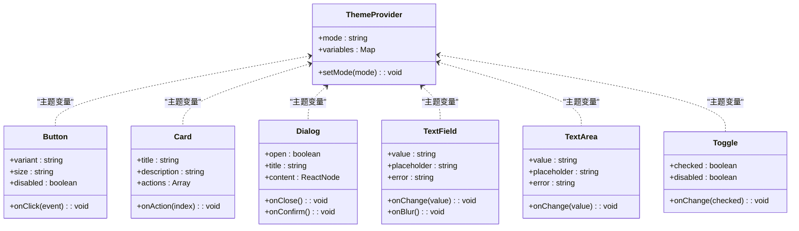
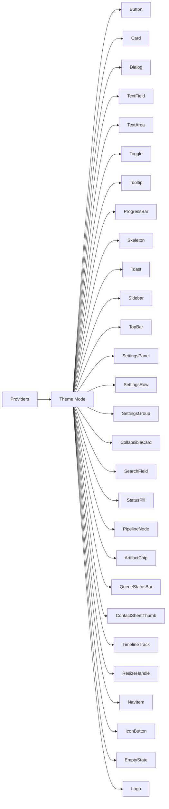

# 基础 UI 组件库

<cite>
**本文引用的文件**   
- [button.tsx](file://src/components/ui/button.tsx)
- [card.tsx](file://src/components/ui/card.tsx)
- [dialog.tsx](file://src/components/ui/dialog.tsx)
- [text-field.tsx](file://src/components/ui/text-field.tsx)
- [text-area.tsx](file://src/components/ui/text-area.tsx)
- [toggle.tsx](file://src/components/ui/toggle.tsx)
- [tooltip.tsx](file://src/components/ui/tooltip.tsx)
- [progress-bar.tsx](file://src/components/ui/progress-bar.tsx)
- [skeleton.tsx](file://src/components/ui/skeleton.tsx)
- [toast.tsx](file://src/components/ui/toast.tsx)
- [sidebar.tsx](file://src/components/ui/sidebar.tsx)
- [top-bar.tsx](file://src/components/ui/top-bar.tsx)
- [settings-panel.tsx](file://src/components/ui/settings-panel.tsx)
- [settings-row.tsx](file://src/components/ui/settings-row.tsx)
- [settings-group.tsx](file://src/components/ui/settings-group.tsx)
- [collapsible-card.tsx](file://src/components/ui/collapsible-card.tsx)
- [search-field.tsx](file://src/components/ui/search-field.tsx)
- [status-pill.tsx](file://src/components/ui/status-pill.tsx)
- [pipeline-node.tsx](file://src/components/ui/pipeline-node.tsx)
- [artifact-chip.tsx](file://src/components/ui/artifact-chip.tsx)
- [queue-status-bar.tsx](file://src/components/ui/queue-status-bar.tsx)
- [contact-sheet-thumb.tsx](file://src/components/ui/contact-sheet-thumb.tsx)
- [timeline-track.tsx](file://src/components/ui/timeline-track.tsx)
- [resize-handle.tsx](file://src/components/ui/resize-handle.tsx)
- [nav-item.tsx](file://src/components/ui/nav-item.tsx)
- [icon-button.tsx](file://src/components/ui/icon-button.tsx)
- [empty-state.tsx](file://src/components/ui/empty-state.tsx)
- [purple-ink-logo.tsx](file://src/components/ui/purple-ink-logo.tsx)
- [providers.tsx](file://src/app/providers.tsx)
- [theme-mode.ts](file://src/lib/theme-mode.ts)
- [design-system.css](file://src/app/design-system.css)
- [globals.css](file://src/app/globals.css)
</cite>

## 目录
1. [简介](#简介)
2. [项目结构](#项目结构)
3. [核心组件](#核心组件)
4. [架构总览](#架构总览)
5. [详细组件分析](#详细组件分析)
6. [依赖关系分析](#依赖关系分析)
7. [性能考虑](#性能考虑)
8. [故障排查指南](#故障排查指南)
9. [结论](#结论)
10. [附录](#附录)

## 简介
本文件为 PurpleInk 基础 UI 组件库的权威文档，聚焦按钮、卡片、对话框、表单等核心组件的设计模式与实现细节。内容涵盖：
- 组件 Props 接口约定、事件处理、状态管理与样式定制选项
- 可访问性（a11y）支持、响应式设计与主题适配
- 使用示例、最佳实践与性能优化建议
- 组件间的组合模式与复用策略
- 测试方法与调试技巧

该组件库基于 React/Next.js 生态构建，采用原子化设计思想，通过 CSS 变量与主题系统实现一致的视觉语言与多主题切换能力。

## 项目结构
UI 组件集中于 src/components/ui 目录，按功能拆分为独立模块，每个组件通常包含：
- 组件实现（.tsx）
- 演示用例（*.demo.tsx）
- 单元测试（*.test.ts / *.test.tsx）

全局样式与主题定义位于 src/app 下的 CSS 文件，提供设计令牌与设计系统常量。应用级 Provider 在 src/app/providers.tsx 中注入主题与上下文。

```mermaid
graph TB
subgraph "应用层"
Providers["Providers<br/>主题与上下文"]
AppCSS["全局样式<br/>globals.css"]
DesignSystem["设计系统<br/>design-system.css"]
end
subgraph "UI 组件层"
Button["Button"]
Card["Card"]
Dialog["Dialog"]
TextField["TextField"]
TextArea["TextArea"]
Toggle["Toggle"]
Tooltip["Tooltip"]
ProgressBar["ProgressBar"]
Skeleton["Skeleton"]
Toast["Toast"]
Sidebar["Sidebar"]
TopBar["TopBar"]
SettingsPanel["SettingsPanel"]
SettingsRow["SettingsRow"]
SettingsGroup["SettingsGroup"]
CollapsibleCard["CollapsibleCard"]
SearchField["SearchField"]
StatusPill["StatusPill"]
PipelineNode["PipelineNode"]
ArtifactChip["ArtifactChip"]
QueueStatusBar["QueueStatusBar"]
ContactSheetThumb["ContactSheetThumb"]
TimelineTrack["TimelineTrack"]
ResizeHandle["ResizeHandle"]
NavItem["NavItem"]
IconButton["IconButton"]
EmptyState["EmptyState"]
Logo["PurpleInkLogo"]
end
Providers --> Button
Providers --> Card
Providers --> Dialog
Providers --> TextField
Providers --> TextArea
Providers --> Toggle
Providers --> Tooltip
Providers --> ProgressBar
Providers --> Skeleton
Providers --> Toast
Providers --> Sidebar
Providers --> TopBar
Providers --> SettingsPanel
Providers --> SettingsRow
Providers --> SettingsGroup
Providers --> CollapsibleCard
Providers --> SearchField
Providers --> StatusPill
Providers --> PipelineNode
Providers --> ArtifactChip
Providers --> QueueStatusBar
Providers --> ContactSheetThumb
Providers --> TimelineTrack
Providers --> ResizeHandle
Providers --> NavItem
Providers --> IconButton
Providers --> EmptyState
Providers --> Logo
AppCSS --> DesignSystem
DesignSystem --> Button
DesignSystem --> Card
DesignSystem --> Dialog
```

图表来源
- [providers.tsx](file://src/app/providers.tsx)
- [globals.css](file://src/app/globals.css)
- [design-system.css](file://src/app/design-system.css)

章节来源
- [providers.tsx](file://src/app/providers.tsx)
- [globals.css](file://src/app/globals.css)
- [design-system.css](file://src/app/design-system.css)

## 核心组件
本节概述按钮、卡片、对话框、表单等核心组件的职责与通用设计模式。

- 按钮（Button）
  - 职责：触发操作或导航，支持多种尺寸、变体与禁用态
  - 设计模式：受控与非受控结合，事件透传，键盘可达
  - 关键属性：类型、尺寸、颜色变体、是否禁用、加载态、图标位置
  - 事件：点击、焦点、鼠标进入/离开
  - 可访问性：role、aria-*、tabIndex、键盘导航
  - 主题：通过 CSS 变量控制颜色、圆角、阴影

- 卡片（Card）
  - 职责：承载一组相关内容与操作
  - 设计模式：容器型组件，内部插槽（头部、主体、底部）
  - 关键属性：标题、描述、动作区、是否可点击、悬停效果
  - 可访问性：语义化标签、焦点管理
  - 主题：背景、边框、阴影、间距

- 对话框（Dialog）
  - 职责：模态交互，确认或输入信息
  - 设计模式：焦点陷阱、ESC 关闭、点击外部关闭、层级管理
  - 关键属性：打开状态、标题、内容、动作按钮、是否可关闭
  - 事件：打开/关闭、确认/取消
  - 可访问性：ARIA 模态、焦点恢复、屏幕阅读器提示
  - 主题：遮罩、容器样式、动画

- 表单（TextField/TextArea/Toggle）
  - 职责：数据输入与校验
  - 设计模式：受控组件、错误提示、占位符、前缀/后缀
  - 关键属性：值、占位符、错误消息、禁用、只读、必填
  - 事件：输入、失焦、提交
  - 可访问性：label 关联、错误提示、键盘可达
  - 主题：边框、高亮、错误色、字体

章节来源
- [button.tsx](file://src/components/ui/button.tsx)
- [card.tsx](file://src/components/ui/card.tsx)
- [dialog.tsx](file://src/components/ui/dialog.tsx)
- [text-field.tsx](file://src/components/ui/text-field.tsx)
- [text-area.tsx](file://src/components/ui/text-area.tsx)
- [toggle.tsx](file://src/components/ui/toggle.tsx)

## 架构总览
组件库采用“Provider + 原子组件 + 业务组件”的分层架构：
- Provider 层：注入主题、国际化、全局状态
- 原子组件层：按钮、输入、开关、提示等基础元素
- 业务组件层：设置面板、时间轴轨道、流水线节点等复合组件

图表来源
- [providers.tsx](file://src/app/providers.tsx)
- [button.tsx](file://src/components/ui/button.tsx)
- [card.tsx](file://src/components/ui/card.tsx)
- [dialog.tsx](file://src/components/ui/dialog.tsx)
- [text-field.tsx](file://src/components/ui/text-field.tsx)
- [text-area.tsx](file://src/components/ui/text-area.tsx)
- [toggle.tsx](file://src/components/ui/toggle.tsx)

章节来源
- [providers.tsx](file://src/app/providers.tsx)

## 详细组件分析

### 按钮（Button）
- 设计模式
  - 受控/非受控：支持传入 onClick 与 disabled 控制行为
  - 事件透传：将原生 DOM 事件透传给父组件
  - 可访问性：role="button"、tabIndex、键盘 Enter/Space 触发
- 关键属性
  - variant：主按钮、次按钮、危险等
  - size：小、中、大
  - disabled：禁用态
  - loading：加载态显示
  - iconPosition：图标位置（左/右）
- 事件
  - onClick、onFocus、onBlur、onMouseEnter、onMouseLeave
- 样式定制
  - 通过 CSS 变量覆盖颜色、圆角、阴影、过渡
- 使用示例
  - 基本用法、带图标、禁用态、加载态
- 最佳实践
  - 避免嵌套可点击元素；确保键盘可达；为图标按钮添加 aria-label

章节来源
- [button.tsx](file://src/components/ui/button.tsx)

### 卡片（Card）
- 设计模式
  - 容器型组件，支持头部、主体、底部插槽
  - 可选点击行为与悬停反馈
- 关键属性
  - title、description、actions、clickable、hoverable
- 事件
  - onAction、onClick
- 可访问性
  - 语义化标签、焦点顺序
- 样式定制
  - 背景、边框、阴影、间距、圆角

章节来源
- [card.tsx](file://src/components/ui/card.tsx)

### 对话框（Dialog）
- 设计模式
  - 模态窗口，焦点陷阱、ESC 关闭、点击外部关闭
  - 层级管理，确保置顶显示
- 关键属性
  - open、title、content、closeable、actions
- 事件
  - onClose、onConfirm
- 可访问性
  - ARIA 模态、焦点恢复、屏幕阅读器提示
- 样式定制
  - 遮罩透明度、容器样式、动画时长

章节来源
- [dialog.tsx](file://src/components/ui/dialog.tsx)

### 文本输入（TextField）
- 设计模式
  - 受控组件，支持占位符、错误提示、前缀/后缀
  - 与 Label 关联，确保可访问性
- 关键属性
  - value、placeholder、error、disabled、readOnly、required
- 事件
  - onChange、onBlur、onFocus
- 可访问性
  - label 关联、错误提示、键盘可达
- 样式定制
  - 边框、高亮、错误色、字体大小

章节来源
- [text-field.tsx](file://src/components/ui/text-field.tsx)

### 文本域（TextArea）
- 设计模式
  - 多行输入，支持自动高度调整
  - 错误提示与占位符
- 关键属性
  - value、placeholder、error、disabled、rows
- 事件
  - onChange、onBlur
- 可访问性
  - label 关联、错误提示
- 样式定制
  - 边框、高亮、错误色、行高

章节来源
- [text-area.tsx](file://src/components/ui/text-area.tsx)

### 开关（Toggle）
- 设计模式
  - 布尔状态切换，支持禁用态
- 关键属性
  - checked、disabled、onChange
- 事件
  - onChange
- 可访问性
  - role="switch"、aria-checked、键盘可达
- 样式定制
  - 轨道颜色、滑块颜色、动画

章节来源
- [toggle.tsx](file://src/components/ui/toggle.tsx)

### 提示（Tooltip）
- 设计模式
  - 悬浮提示，支持定位与延迟显示
- 关键属性
  - content、position、delay、trigger
- 事件
  - onOpen、onClose
- 可访问性
  - aria-describedby、键盘可达
- 样式定制
  - 背景、文字颜色、圆角、阴影

章节来源
- [tooltip.tsx](file://src/components/ui/tooltip.tsx)

### 进度条（ProgressBar）
- 设计模式
  - 线性进度指示，支持不确定态
- 关键属性
  - value、max、indeterminate
- 事件
  - 无（纯展示）
- 可访问性
  - role="progressbar"、aria-valuenow、aria-valuemax
- 样式定制
  - 轨道颜色、进度颜色、动画

章节来源
- [progress-bar.tsx](file://src/components/ui/progress-bar.tsx)

### 骨架屏（Skeleton）
- 设计模式
  - 占位动画，模拟内容加载
- 关键属性
  - shape、width、height、animate
- 事件
  - 无
- 可访问性
  - aria-busy、aria-live
- 样式定制
  - 背景色、动画时长

章节来源
- [skeleton.tsx](file://src/components/ui/skeleton.tsx)

### 通知（Toast）
- 设计模式
  - 短暂提示，支持成功、警告、错误等类型
- 关键属性
  - message、type、duration、onDismiss
- 事件
  - onDismiss
- 可访问性
  - aria-live、自动消失
- 样式定制
  - 背景、文字颜色、圆角、阴影

章节来源
- [toast.tsx](file://src/components/ui/toast.tsx)

### 侧边栏（Sidebar）
- 设计模式
  - 可折叠侧边栏，支持多级菜单
- 关键属性
  - items、collapsed、onCollapse
- 事件
  - onCollapse、onSelect
- 可访问性
  - 导航列表语义、键盘可达
- 样式定制
  - 宽度、背景、分隔线

章节来源
- [sidebar.tsx](file://src/components/ui/sidebar.tsx)

### 顶部栏（TopBar）
- 设计模式
  - 应用顶部导航与信息展示
- 关键属性
  - title、actions、rightContent
- 事件
  - onAction
- 可访问性
  - 导航语义、焦点管理
- 样式定制
  - 背景、高度、阴影

章节来源
- [top-bar.tsx](file://src/components/ui/top-bar.tsx)

### 设置面板（SettingsPanel）
- 设计模式
  - 分组展示设置项，支持搜索与过滤
- 关键属性
  - groups、searchable、onSearch
- 事件
  - onSearch、onSave
- 可访问性
  - 表单语义、错误提示
- 样式定制
  - 布局、间距、边框

章节来源
- [settings-panel.tsx](file://src/components/ui/settings-panel.tsx)

### 设置行（SettingsRow）
- 设计模式
  - 单行设置项，支持标签、控件、说明
- 关键属性
  - label、control、description、error
- 事件
  - 由 control 触发
- 可访问性
  - label 关联、错误提示
- 样式定制
  - 对齐方式、间距

章节来源
- [settings-row.tsx](file://src/components/ui/settings-row.tsx)

### 设置组（SettingsGroup）
- 设计模式
  - 分组容器，支持标题与分隔线
- 关键属性
  - title、children
- 事件
  - 无
- 可访问性
  - 分组语义
- 样式定制
  - 标题样式、分隔线

章节来源
- [settings-group.tsx](file://src/components/ui/settings-group.tsx)

### 可折叠卡片（CollapsibleCard）
- 设计模式
  - 可展开/收起的内容卡片
- 关键属性
  - title、defaultOpen、children
- 事件
  - onToggle
- 可访问性
  - 折叠区域语义、键盘可达
- 样式定制
  - 展开动画、边框

章节来源
- [collapsible-card.tsx](file://src/components/ui/collapsible-card.tsx)

### 搜索框（SearchField）
- 设计模式
  - 带清除按钮的搜索输入
- 关键属性
  - value、placeholder、onClear
- 事件
  - onChange、onClear
- 可访问性
  - label 关联、清除按钮 aria-label
- 样式定制
  - 边框、图标、占位符

章节来源
- [search-field.tsx](file://src/components/ui/search-field.tsx)

### 状态徽标（StatusPill）
- 设计模式
  - 小型状态指示器，支持多种状态色
- 关键属性
  - status、label
- 事件
  - 无
- 可访问性
  - aria-label、语义化
- 样式定制
  - 颜色、形状、大小

章节来源
- [status-pill.tsx](file://src/components/ui/status-pill.tsx)

### 流水线节点（PipelineNode）
- 设计模式
  - 可视化流程节点，支持连接点与状态
- 关键属性
  - id、label、status、ports
- 事件
  - onSelect、onConnect
- 可访问性
  - 节点语义、焦点管理
- 样式定制
  - 节点样式、连接点样式

章节来源
- [pipeline-node.tsx](file://src/components/ui/pipeline-node.tsx)

### 制品芯片（ArtifactChip）
- 设计模式
  - 小型制品标识，支持类型与操作
- 关键属性
  - name、type、actions
- 事件
  - onAction
- 可访问性
  - 标签语义、操作按钮 aria-label
- 样式定制
  - 背景、边框、图标

章节来源
- [artifact-chip.tsx](file://src/components/ui/artifact-chip.tsx)

### 队列状态栏（QueueStatusBar）
- 设计模式
  - 显示队列任务状态与进度
- 关键属性
  - tasks、onTaskAction
- 事件
  - onTaskAction
- 可访问性
  - 列表语义、状态更新 aria-live
- 样式定制
  - 背景、分隔线、进度条

章节来源
- [queue-status-bar.tsx](file://src/components/ui/queue-status-bar.tsx)

### 缩略图（ContactSheetThumb）
- 设计模式
  - 媒体缩略图，支持预览与选择
- 关键属性
  - src、alt、selected、onSelect
- 事件
  - onSelect
- 可访问性
  - 图片 alt、选中状态 aria-selected
- 样式定制
  - 边框、选中高亮、圆角

章节来源
- [contact-sheet-thumb.tsx](file://src/components/ui/contact-sheet-thumb.tsx)

### 时间轴轨道（TimelineTrack）
- 设计模式
  - 时间轴上的轨道容器，支持片段与标记
- 关键属性
  - segments、markers、onSegmentAction
- 事件
  - onSegmentAction
- 可访问性
  - 时间轴语义、片段 aria-label
- 样式定制
  - 轨道背景、片段样式、标记样式

章节来源
- [timeline-track.tsx](file://src/components/ui/timeline-track.tsx)

### 拖拽手柄（ResizeHandle）
- 设计模式
  - 拖拽调整尺寸的手柄
- 关键属性
  - direction、minSize、onResize
- 事件
  - onResize
- 可访问性
  - 拖拽语义、键盘调整
- 样式定制
  - 手柄样式、拖拽反馈

章节来源
- [resize-handle.tsx](file://src/components/ui/resize-handle.tsx)

### 导航项（NavItem）
- 设计模式
  - 导航菜单项，支持激活态与图标
- 关键属性
  - label、icon、active、onClick
- 事件
  - onClick
- 可访问性
  - 导航语义、激活状态 aria-current
- 样式定制
  - 激活样式、图标颜色

章节来源
- [nav-item.tsx](file://src/components/ui/nav-item.tsx)

### 图标按钮（IconButton）
- 设计模式
  - 仅图标按钮，适合工具栏与操作区
- 关键属性
  - icon、aria-label、onClick
- 事件
  - onClick
- 可访问性
  - aria-label、键盘可达
- 样式定制
  - 图标大小、悬停效果

章节来源
- [icon-button.tsx](file://src/components/ui/icon-button.tsx)

### 空状态（EmptyState）
- 设计模式
  - 无数据时的占位界面，支持引导操作
- 关键属性
  - title、description、action
- 事件
  - onAction
- 可访问性
  - 语义化标题与描述
- 样式定制
  - 图标、文字颜色、按钮样式

章节来源
- [empty-state.tsx](file://src/components/ui/empty-state.tsx)

### 品牌标志（PurpleInkLogo）
- 设计模式
  - 品牌标志组件，支持尺寸与主题适配
- 关键属性
  - size、theme
- 事件
  - 无
- 可访问性
  - alt 文本
- 样式定制
  - 尺寸、颜色

章节来源
- [purple-ink-logo.tsx](file://src/components/ui/purple-ink-logo.tsx)

## 依赖关系分析
组件间通过 Provider 共享主题与上下文，原子组件之间低耦合，业务组件组合原子组件形成复杂界面。

图表来源
- [providers.tsx](file://src/app/providers.tsx)
- [theme-mode.ts](file://src/lib/theme-mode.ts)

章节来源
- [providers.tsx](file://src/app/providers.tsx)
- [theme-mode.ts](file://src/lib/theme-mode.ts)

## 性能考虑
- 组件渲染
  - 使用 React.memo 包裹纯展示组件，减少重渲染
  - 避免在 render 中创建新对象或函数，使用 useMemo/useCallback
- 事件处理
  - 合并频繁事件（如滚动、输入）使用防抖/节流
  - 事件委托降低监听器数量
- 样式与主题
  - 通过 CSS 变量切换主题，避免 JS 计算样式
  - 使用 will-change 与 transform 提升动画性能
- 列表与大数据
  - 虚拟滚动长列表，按需渲染可见项
  - 分页与懒加载媒体资源
- 可访问性与无障碍
  - 合理使用 aria-* 属性，避免过度标注
  - 确保键盘导航与屏幕阅读器兼容

[本节为通用指导，不直接分析具体文件]

## 故障排查指南
- 常见问题
  - 主题未生效：检查 Provider 是否正确注入，CSS 变量是否覆盖
  - 对话框焦点丢失：确认焦点陷阱与 ESC 关闭逻辑
  - 表单校验失败：检查受控值与错误提示绑定
  - 组件不可达：验证 tabIndex 与键盘事件处理
- 调试技巧
  - 使用 React DevTools 检查组件树与状态
  - 控制台打印 props 与事件参数
  - 使用浏览器开发者工具检查样式与布局
- 测试方法
  - 单元测试：验证组件渲染与事件处理
  - 集成测试：模拟用户交互与状态变化
  - 可访问性测试：使用 axe-core 检测 a11y 问题

章节来源
- [dialog.tsx](file://src/components/ui/dialog.tsx)
- [text-field.tsx](file://src/components/ui/text-field.tsx)
- [text-area.tsx](file://src/components/ui/text-area.tsx)
- [toggle.tsx](file://src/components/ui/toggle.tsx)

## 结论
PurpleInk 基础 UI 组件库以原子化设计与主题系统为核心，提供一致、可访问、可定制的组件集合。通过清晰的 Props 接口、事件处理与状态管理，组件易于组合与复用。遵循最佳实践与性能优化建议，可在复杂应用中构建高质量的用户界面。

[本节为总结，不直接分析具体文件]

## 附录
- 使用示例
  - 按钮：基本用法、带图标、禁用态、加载态
  - 卡片：标题、描述、动作区、点击行为
  - 对话框：打开/关闭、确认/取消、焦点管理
  - 表单：受控输入、错误提示、键盘可达
- 最佳实践
  - 保持组件单一职责，组合复杂界面
  - 优先使用语义化标签与 ARIA 属性
  - 通过 CSS 变量实现主题与样式定制
- 性能优化
  - 使用 React.memo、useMemo、useCallback
  - 防抖/节流高频事件
  - 虚拟滚动与懒加载大数据

[本节为补充信息，不直接分析具体文件]