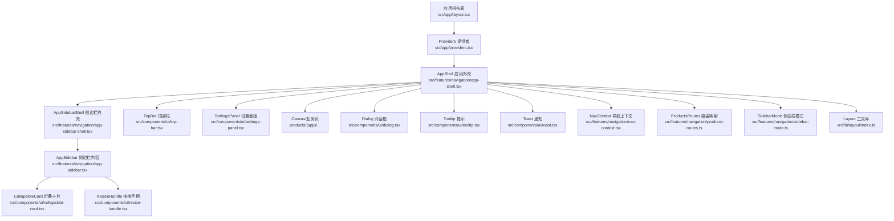
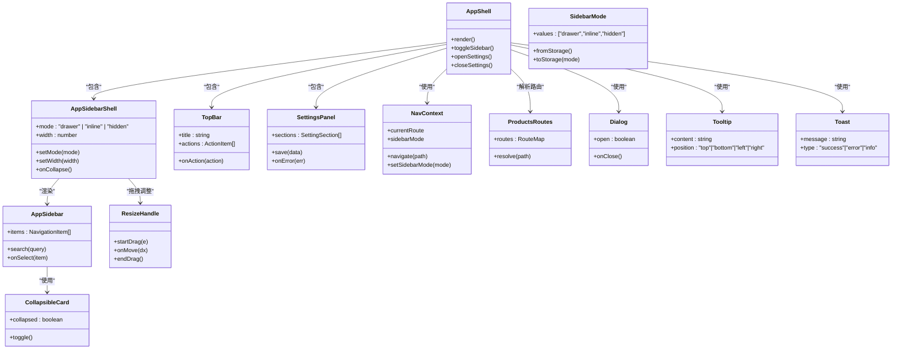
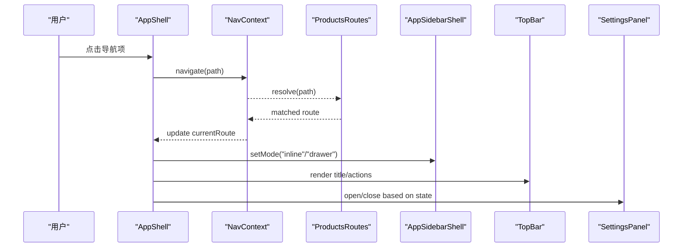
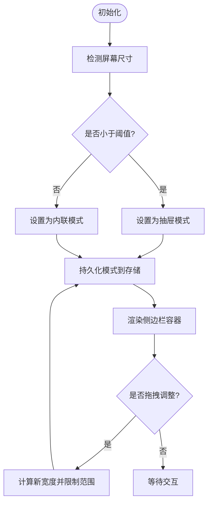
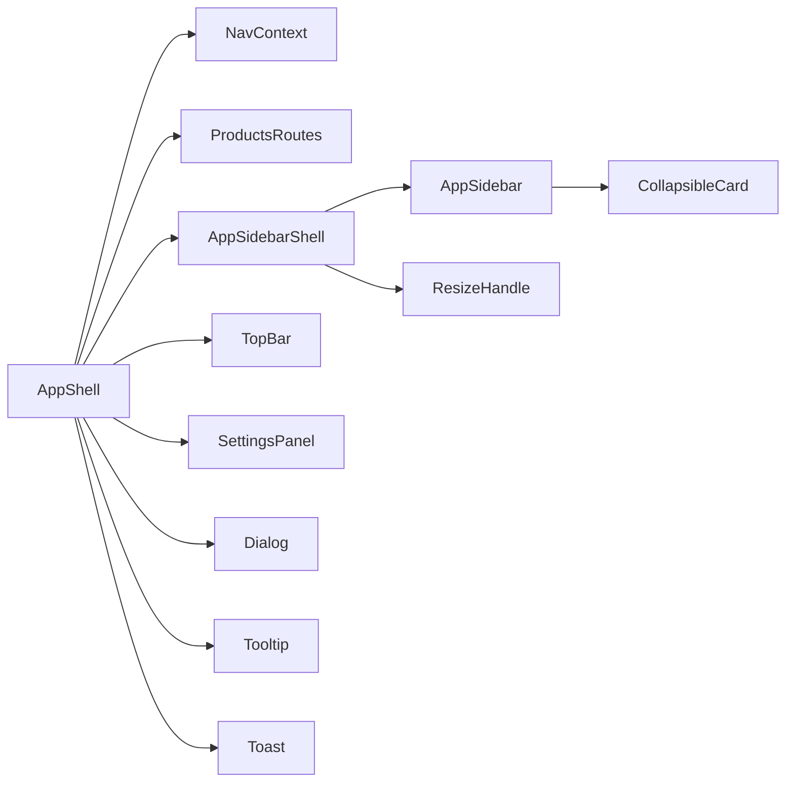

# 布局组件系统

<cite>
**本文档引用的文件**   
- [src/app/layout.tsx](file://src/app/layout.tsx)
- [src/app/providers.tsx](file://src/app/providers.tsx)
- [src/features/navigation/app-shell.tsx](file://src/features/navigation/app-shell.tsx)
- [src/features/navigation/app-sidebar-shell.tsx](file://src/features/navigation/app-sidebar-shell.tsx)
- [src/features/navigation/app-sidebar.tsx](file://src/features/navigation/app-sidebar.tsx)
- [src/features/navigation/nav-context.tsx](file://src/features/navigation/nav-context.tsx)
- [src/features/navigation/products-routes.ts](file://src/features/navigation/products-routes.ts)
- [src/features/navigation/sidebar-mode.ts](file://src/features/navigation/sidebar-mode.ts)
- [src/components/ui/top-bar.tsx](file://src/components/ui/top-bar.tsx)
- [src/components/ui/sidebar.tsx](file://src/components/ui/sidebar.tsx)
- [src/components/ui/settings-panel.tsx](file://src/components/ui/settings-panel.tsx)
- [src/components/ui/collapsible-card.tsx](file://src/components/ui/collapsible-card.tsx)
- [src/components/ui/resize-handle.tsx](file://src/components/ui/resize-handle.tsx)
- [src/components/ui/dialog.tsx](file://src/components/ui/dialog.tsx)
- [src/components/ui/tooltip.tsx](file://src/components/ui/tooltip.tsx)
- [src/components/ui/toast.tsx](file://src/components/ui/toast.tsx)
- [src/lib/layout/index.ts](file://src/lib/layout/index.ts)
</cite>

## 目录
1. [简介](#简介)
2. [项目结构](#项目结构)
3. [核心组件](#核心组件)
4. [架构总览](#架构总览)
5. [详细组件分析](#详细组件分析)
6. [依赖关系分析](#依赖关系分析)
7. [性能考虑](#性能考虑)
8. [故障排查指南](#故障排查指南)
9. [结论](#结论)
10. [附录](#附录)

## 简介
本文件系统性梳理 PurpleInk 的布局组件体系，覆盖侧边栏、顶部栏、设置面板等关键布局模块的结构设计、响应式行为与交互机制。重点说明：
- 组件嵌套关系与层级管理策略
- 空间分配与尺寸适配（移动端/平板/桌面）
- 折叠面板、上下文菜单等交互实现与用户反馈
- 布局与页面路由集成及导航状态同步
- 调试技巧与常见问题解决方案

## 项目结构
布局相关代码主要分布在以下位置：
- 应用壳与提供者：顶层布局与全局状态提供者
- 导航子系统：应用外壳、侧边栏容器、模式切换、路由映射
- UI 基础组件：顶部栏、侧边栏、设置面板、折叠卡片、拖拽调整手柄、对话框、提示、通知
- 布局工具库：通用布局能力封装

图表来源
- [src/app/layout.tsx](file://src/app/layout.tsx)
- [src/app/providers.tsx](file://src/app/providers.tsx)
- [src/features/navigation/app-shell.tsx](file://src/features/navigation/app-shell.tsx)
- [src/features/navigation/app-sidebar-shell.tsx](file://src/features/navigation/app-sidebar-shell.tsx)
- [src/features/navigation/app-sidebar.tsx](file://src/features/navigation/app-sidebar.tsx)
- [src/components/ui/top-bar.tsx](file://src/components/ui/top-bar.tsx)
- [src/components/ui/settings-panel.tsx](file://src/components/ui/settings-panel.tsx)
- [src/components/ui/collapsible-card.tsx](file://src/components/ui/collapsible-card.tsx)
- [src/components/ui/resize-handle.tsx](file://src/components/ui/resize-handle.tsx)
- [src/components/ui/dialog.tsx](file://src/components/ui/dialog.tsx)
- [src/components/ui/tooltip.tsx](file://src/components/ui/tooltip.tsx)
- [src/components/ui/toast.tsx](file://src/components/ui/toast.tsx)
- [src/features/navigation/nav-context.tsx](file://src/features/navigation/nav-context.tsx)
- [src/features/navigation/products-routes.ts](file://src/features/navigation/products-routes.ts)
- [src/features/navigation/sidebar-mode.ts](file://src/features/navigation/sidebar-mode.ts)
- [src/lib/layout/index.ts](file://src/lib/layout/index.ts)

章节来源
- [src/app/layout.tsx](file://src/app/layout.tsx)
- [src/app/providers.tsx](file://src/app/providers.tsx)
- [src/features/navigation/app-shell.tsx](file://src/features/navigation/app-shell.tsx)
- [src/features/navigation/app-sidebar-shell.tsx](file://src/features/navigation/app-sidebar-shell.tsx)
- [src/features/navigation/app-sidebar.tsx](file://src/features/navigation/app-sidebar.tsx)
- [src/components/ui/top-bar.tsx](file://src/components/ui/top-bar.tsx)
- [src/components/ui/settings-panel.tsx](file://src/components/ui/settings-panel.tsx)
- [src/components/ui/collapsible-card.tsx](file://src/components/ui/collapsible-card.tsx)
- [src/components/ui/resize-handle.tsx](file://src/components/ui/resize-handle.tsx)
- [src/components/ui/dialog.tsx](file://src/components/ui/dialog.tsx)
- [src/components/ui/tooltip.tsx](file://src/components/ui/tooltip.tsx)
- [src/components/ui/toast.tsx](file://src/components/ui/toast.tsx)
- [src/features/navigation/nav-context.tsx](file://src/features/navigation/nav-context.tsx)
- [src/features/navigation/products-routes.ts](file://src/features/navigation/products-routes.ts)
- [src/features/navigation/sidebar-mode.ts](file://src/features/navigation/sidebar-mode.ts)
- [src/lib/layout/index.ts](file://src/lib/layout/index.ts)

## 核心组件
- AppShell：应用级外壳，负责整体布局骨架、顶部栏与主内容区组织、侧边栏与设置面板的挂载点、以及全局导航上下文注入。
- AppSidebarShell：侧边栏容器，管理侧边栏展开/收起、宽度控制、模式切换（如全屏/抽屉），并与导航上下文联动。
- AppSidebar：侧边栏内容，包含导航项、分组、折叠面板入口、搜索与快捷操作。
- TopBar：顶部栏，承载标题、面包屑、全局操作按钮、用户信息、通知入口等。
- SettingsPanel：设置面板，支持多组配置、表单校验、保存反馈与错误提示。
- CollapsibleCard：可折叠卡片，用于侧边栏或面板中的分组内容折叠/展开。
- ResizeHandle：拖拽调整手柄，用于侧边栏/面板宽度动态调整。
- Dialog/Tooltip/Toast：通用交互组件，提供模态确认、悬浮提示与轻量通知。

章节来源
- [src/features/navigation/app-shell.tsx](file://src/features/navigation/app-shell.tsx)
- [src/features/navigation/app-sidebar-shell.tsx](file://src/features/navigation/app-sidebar-shell.tsx)
- [src/features/navigation/app-sidebar.tsx](file://src/features/navigation/app-sidebar.tsx)
- [src/components/ui/top-bar.tsx](file://src/components/ui/top-bar.tsx)
- [src/components/ui/settings-panel.tsx](file://src/components/ui/settings-panel.tsx)
- [src/components/ui/collapsible-card.tsx](file://src/components/ui/collapsible-card.tsx)
- [src/components/ui/resize-handle.tsx](file://src/components/ui/resize-handle.tsx)
- [src/components/ui/dialog.tsx](file://src/components/ui/dialog.tsx)
- [src/components/ui/tooltip.tsx](file://src/components/ui/tooltip.tsx)
- [src/components/ui/toast.tsx](file://src/components/ui/toast.tsx)

## 架构总览
布局系统采用“外壳 + 面板 + 内容”的分层设计：
- 外壳层（AppShell/AppSidebarShell）负责布局容器、响应式断点、侧边栏/设置面板可见性与尺寸。
- 导航层（NavContext、ProductsRoutes、SidebarMode）统一维护当前路由、侧边栏模式与导航状态。
- 内容层（TopBar、SettingsPanel、业务页面）在固定槽位渲染，通过上下文与外壳通信。
- 交互层（Dialog/Tooltip/Toast/CollapsibleCard/ResizeHandle）提供一致的交互体验与反馈。

图表来源
- [src/features/navigation/app-shell.tsx](file://src/features/navigation/app-shell.tsx)
- [src/features/navigation/app-sidebar-shell.tsx](file://src/features/navigation/app-sidebar-shell.tsx)
- [src/features/navigation/app-sidebar.tsx](file://src/features/navigation/app-sidebar.tsx)
- [src/components/ui/top-bar.tsx](file://src/components/ui/top-bar.tsx)
- [src/components/ui/settings-panel.tsx](file://src/components/ui/settings-panel.tsx)
- [src/components/ui/collapsible-card.tsx](file://src/components/ui/collapsible-card.tsx)
- [src/components/ui/resize-handle.tsx](file://src/components/ui/resize-handle.tsx)
- [src/components/ui/dialog.tsx](file://src/components/ui/dialog.tsx)
- [src/components/ui/tooltip.tsx](file://src/components/ui/tooltip.tsx)
- [src/components/ui/toast.tsx](file://src/components/ui/toast.tsx)
- [src/features/navigation/nav-context.tsx](file://src/features/navigation/nav-context.tsx)
- [src/features/navigation/products-routes.ts](file://src/features/navigation/products-routes.ts)
- [src/features/navigation/sidebar-mode.ts](file://src/features/navigation/sidebar-mode.ts)

## 详细组件分析

### AppShell 应用外壳
职责与行为：
- 构建应用主布局：顶部栏、主内容区、侧边栏与设置面板的挂载点。
- 管理侧边栏与设置面板的可见性、宽度与动画过渡。
- 注入导航上下文，使子组件共享当前路由与侧边栏模式。
- 处理全局键盘快捷键（如打开/关闭侧边栏、设置面板）。

响应式策略：
- 小屏默认隐藏侧边栏，以抽屉模式呈现；中屏及以上可内联显示。
- 设置面板在小屏以全屏覆盖，在大屏以右侧面板形式出现。

图表来源
- [src/features/navigation/app-shell.tsx](file://src/features/navigation/app-shell.tsx)
- [src/features/navigation/nav-context.tsx](file://src/features/navigation/nav-context.tsx)
- [src/features/navigation/products-routes.ts](file://src/features/navigation/products-routes.ts)
- [src/components/ui/top-bar.tsx](file://src/components/ui/top-bar.tsx)
- [src/components/ui/settings-panel.tsx](file://src/components/ui/settings-panel.tsx)

章节来源
- [src/features/navigation/app-shell.tsx](file://src/features/navigation/app-shell.tsx)
- [src/features/navigation/nav-context.tsx](file://src/features/navigation/nav-context.tsx)
- [src/features/navigation/products-routes.ts](file://src/features/navigation/products-routes.ts)

### AppSidebarShell 侧边栏外壳
职责与行为：
- 管理侧边栏模式（抽屉/内联/隐藏）、宽度与折返逻辑。
- 监听窗口尺寸变化，自动切换模式并持久化偏好。
- 暴露拖拽调整接口，与 ResizeHandle 协作更新宽度。

响应式策略：
- 根据断点决定初始模式与最小/最大宽度。
- 在抽屉模式下，点击遮罩层关闭侧边栏。

图表来源
- [src/features/navigation/app-sidebar-shell.tsx](file://src/features/navigation/app-sidebar-shell.tsx)
- [src/components/ui/resize-handle.tsx](file://src/components/ui/resize-handle.tsx)
- [src/features/navigation/sidebar-mode.ts](file://src/features/navigation/sidebar-mode.ts)

章节来源
- [src/features/navigation/app-sidebar-shell.tsx](file://src/features/navigation/app-sidebar-shell.tsx)
- [src/components/ui/resize-handle.tsx](file://src/components/ui/resize-handle.tsx)
- [src/features/navigation/sidebar-mode.ts](file://src/features/navigation/sidebar-mode.ts)

### AppSidebar 侧边栏内容
职责与行为：
- 渲染导航项列表、分组与搜索过滤。
- 与 AppSidebarShell 协作，支持折叠面板展示分组内容。
- 触发导航跳转，更新 NavContext 的当前路由。

交互细节：
- 折叠面板使用 CollapsibleCard 管理展开/收起状态。
- 搜索输入实时过滤导航项，提升查找效率。

章节来源
- [src/features/navigation/app-sidebar.tsx](file://src/features/navigation/app-sidebar.tsx)
- [src/components/ui/collapsible-card.tsx](file://src/components/ui/collapsible-card.tsx)

### TopBar 顶部栏
职责与行为：
- 显示页面标题、面包屑与全局操作按钮（如刷新、导出、帮助）。
- 与 AppShell 联动，响应侧边栏切换与设置面板开关。
- 在小屏下简化为图标按钮，避免拥挤。

章节来源
- [src/components/ui/top-bar.tsx](file://src/components/ui/top-bar.tsx)

### SettingsPanel 设置面板
职责与行为：
- 按分组展示设置项，支持表单校验与保存。
- 保存成功时通过 Toast 提示，失败时显示错误信息。
- 支持键盘导航与无障碍标签。

章节来源
- [src/components/ui/settings-panel.tsx](file://src/components/ui/settings-panel.tsx)
- [src/components/ui/toast.tsx](file://src/components/ui/toast.tsx)

### CollapsibleCard 折叠卡片
职责与行为：
- 管理折叠/展开状态，提供平滑过渡动画。
- 支持键盘 Enter/Space 切换状态。
- 作为侧边栏分组或面板内容的容器。

章节来源
- [src/components/ui/collapsible-card.tsx](file://src/components/ui/collapsible-card.tsx)

### ResizeHandle 拖拽调整手柄
职责与行为：
- 监听鼠标/触摸事件，计算位移并更新目标宽度。
- 限制最小/最大宽度，防止布局崩溃。
- 在拖拽过程中禁用文本选择与滚动冲突。

章节来源
- [src/components/ui/resize-handle.tsx](file://src/components/ui/resize-handle.tsx)

### Dialog/Tooltip/Toast 通用交互
- Dialog：模态确认与重要提示，阻止背景交互，聚焦管理。
- Tooltip：悬浮提示，定位策略支持上下左右，延迟显示。
- Toast：轻量通知，自动消失与手动关闭，队列管理。

章节来源
- [src/components/ui/dialog.tsx](file://src/components/ui/dialog.tsx)
- [src/components/ui/tooltip.tsx](file://src/components/ui/tooltip.tsx)
- [src/components/ui/toast.tsx](file://src/components/ui/toast.tsx)

## 依赖关系分析
布局组件之间的依赖关系清晰且低耦合：
- AppShell 依赖 NavContext、ProductsRoutes、SidebarMode，协调各面板与内容。
- AppSidebarShell 依赖 ResizeHandle 与 SidebarMode，管理宽度与模式。
- AppSidebar 依赖 CollapsibleCard 进行分组折叠。
- TopBar、SettingsPanel、Dialog、Tooltip、Toast 被 AppShell 组合使用，不反向依赖。

图表来源
- [src/features/navigation/app-shell.tsx](file://src/features/navigation/app-shell.tsx)
- [src/features/navigation/nav-context.tsx](file://src/features/navigation/nav-context.tsx)
- [src/features/navigation/products-routes.ts](file://src/features/navigation/products-routes.ts)
- [src/features/navigation/app-sidebar-shell.tsx](file://src/features/navigation/app-sidebar-shell.tsx)
- [src/features/navigation/app-sidebar.tsx](file://src/features/navigation/app-sidebar.tsx)
- [src/components/ui/resize-handle.tsx](file://src/components/ui/resize-handle.tsx)
- [src/components/ui/collapsible-card.tsx](file://src/components/ui/collapsible-card.tsx)
- [src/components/ui/top-bar.tsx](file://src/components/ui/top-bar.tsx)
- [src/components/ui/settings-panel.tsx](file://src/components/ui/settings-panel.tsx)
- [src/components/ui/dialog.tsx](file://src/components/ui/dialog.tsx)
- [src/components/ui/tooltip.tsx](file://src/components/ui/tooltip.tsx)
- [src/components/ui/toast.tsx](file://src/components/ui/toast.tsx)

章节来源
- [src/features/navigation/app-shell.tsx](file://src/features/navigation/app-shell.tsx)
- [src/features/navigation/app-sidebar-shell.tsx](file://src/features/navigation/app-sidebar-shell.tsx)
- [src/features/navigation/app-sidebar.tsx](file://src/features/navigation/app-sidebar.tsx)
- [src/components/ui/top-bar.tsx](file://src/components/ui/top-bar.tsx)
- [src/components/ui/settings-panel.tsx](file://src/components/ui/settings-panel.tsx)
- [src/components/ui/collapsible-card.tsx](file://src/components/ui/collapsible-card.tsx)
- [src/components/ui/resize-handle.tsx](file://src/components/ui/resize-handle.tsx)
- [src/components/ui/dialog.tsx](file://src/components/ui/dialog.tsx)
- [src/components/ui/tooltip.tsx](file://src/components/ui/tooltip.tsx)
- [src/components/ui/toast.tsx](file://src/components/ui/toast.tsx)

## 性能考虑
- 减少重排与重绘：侧边栏与设置面板的显隐使用 CSS transform/opacity 过渡，避免频繁改变布局属性。
- 事件节流与防抖：ResizeHandle 的拖拽更新应节流，避免高频状态更新导致卡顿。
- 条件渲染：仅在需要时渲染复杂面板（如设置面板），降低初始渲染成本。
- 虚拟滚动：若侧边栏导航项较多，考虑虚拟化列表以减少 DOM 节点数量。
- 内存管理：及时解绑事件监听器与订阅，避免泄漏。

[本节为通用指导，无需特定文件引用]

## 故障排查指南
常见问题与解决思路：
- 侧边栏无法展开/收起：检查 AppSidebarShell 的模式状态与断点判断逻辑；确认 ResizeHandle 的事件绑定是否正确。
- 设置面板保存无反馈：确认 Toast 调用路径与错误处理分支；检查表单校验返回值。
- 导航跳转未生效：验证 NavContext 的 navigate 调用与 ProductsRoutes 的路由匹配；确保路由参数正确。
- 小屏布局错乱：检查响应式断点与样式类名；确认 TopBar 在小屏下的简化逻辑。
- 拖拽调整异常：检查最小/最大宽度限制与边界事件处理；确认指针事件类型兼容。

章节来源
- [src/features/navigation/app-sidebar-shell.tsx](file://src/features/navigation/app-sidebar-shell.tsx)
- [src/components/ui/resize-handle.tsx](file://src/components/ui/resize-handle.tsx)
- [src/components/ui/settings-panel.tsx](file://src/components/ui/settings-panel.tsx)
- [src/components/ui/toast.tsx](file://src/components/ui/toast.tsx)
- [src/features/navigation/nav-context.tsx](file://src/features/navigation/nav-context.tsx)
- [src/features/navigation/products-routes.ts](file://src/features/navigation/products-routes.ts)
- [src/components/ui/top-bar.tsx](file://src/components/ui/top-bar.tsx)

## 结论
PurpleInk 的布局组件系统以 AppShell 为核心，结合 AppSidebarShell、TopBar、SettingsPanel 与一系列交互组件，形成高内聚、低耦合的布局体系。通过统一的导航上下文与路由映射，实现了良好的状态同步与响应式适配。遵循本文档的实践建议，可在不同屏幕尺寸下获得一致的用户体验，并通过调试技巧快速定位问题。

[本节为总结性内容，无需特定文件引用]

## 附录
- 最佳实践清单：
  - 使用统一的断点常量，避免硬编码数值。
  - 将侧边栏模式与宽度持久化到本地存储，提升用户体验。
  - 为所有交互组件添加键盘支持与无障碍标签。
  - 对长列表与复杂面板进行懒加载与虚拟化。
  - 在拖拽与动画中使用 requestAnimationFrame 优化性能。

[本节为补充建议，无需特定文件引用]