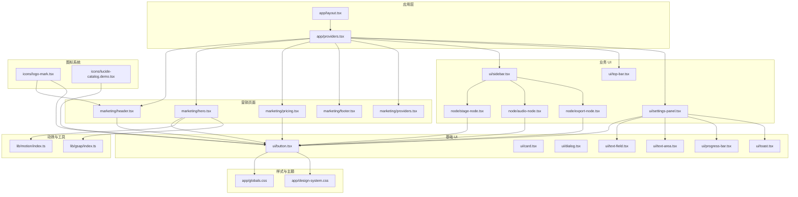
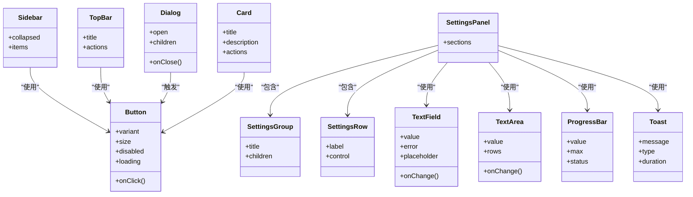
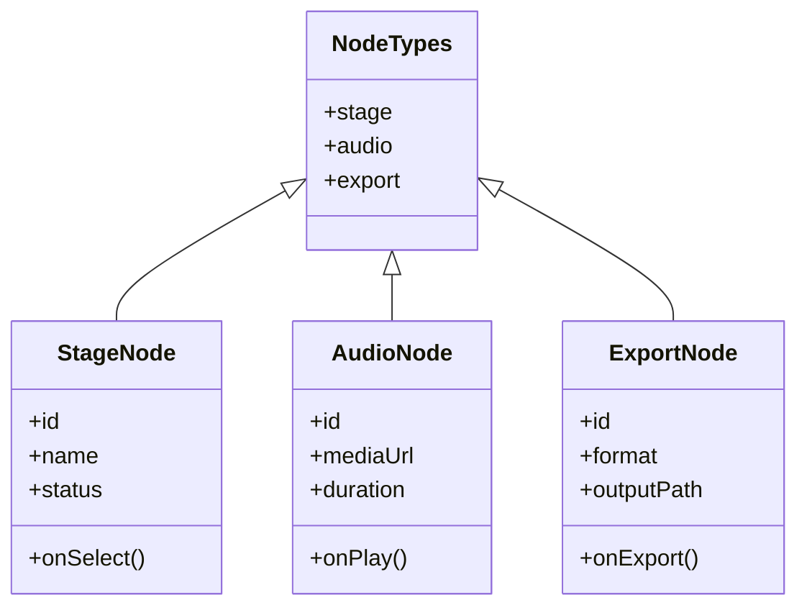
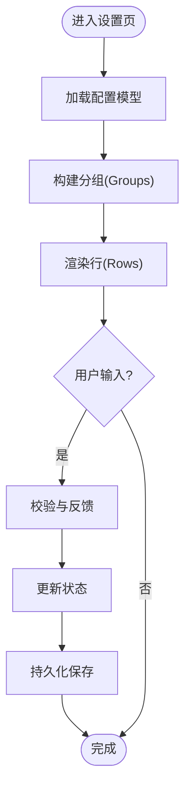
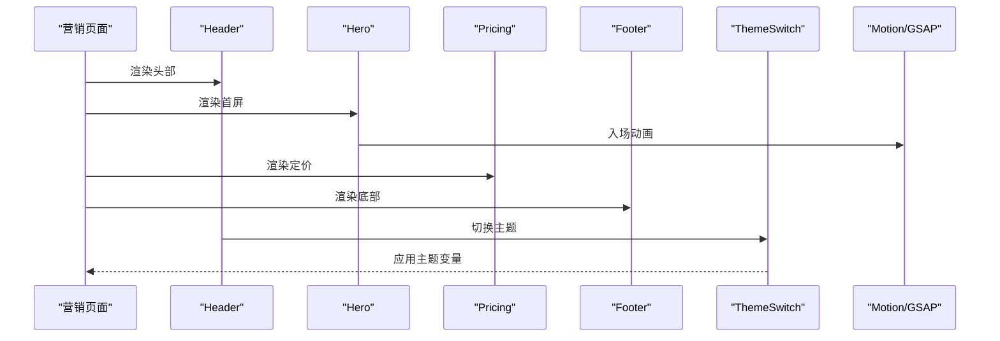
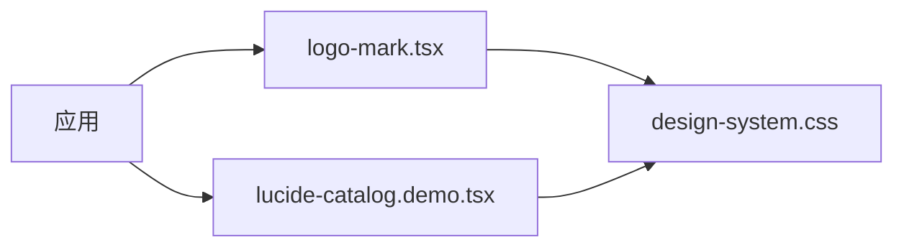
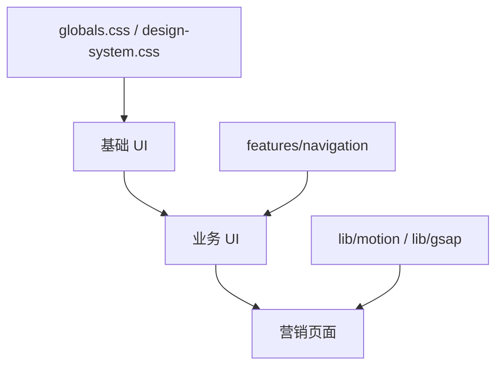

# 组件系统设计

<cite>
**本文引用的文件**   
- [src/components/ui/button.tsx](file://src/components/ui/button.tsx)
- [src/components/ui/card.tsx](file://src/components/ui/card.tsx)
- [src/components/ui/dialog.tsx](file://src/components/ui/dialog.tsx)
- [src/components/ui/text-field.tsx](file://src/components/ui/text-field.tsx)
- [src/components/ui/text-area.tsx](file://src/components/ui/text-area.tsx)
- [src/components/ui/progress-bar.tsx](file://src/components/ui/progress-bar.tsx)
- [src/components/ui/toast.tsx](file://src/components/ui/toast.tsx)
- [src/components/ui/sidebar.tsx](file://src/components/ui/sidebar.tsx)
- [src/components/ui/top-bar.tsx](file://src/components/ui/top-bar.tsx)
- [src/components/ui/settings-panel.tsx](file://src/components/ui/settings-panel.tsx)
- [src/components/ui/settings-row.tsx](file://src/components/ui/settings-row.tsx)
- [src/components/ui/settings-group.tsx](file://src/components/ui/settings-group.tsx)
- [src/components/ui/pipeline-node.tsx](file://src/components/ui/pipeline-node.tsx)
- [src/components/ui/node/stage-node.tsx](file://src/components/ui/node/stage-node.tsx)
- [src/components/ui/node/audio-node.tsx](file://src/components/ui/node/audio-node.tsx)
- [src/components/ui/node/export-node.tsx](file://src/components/ui/node/export-node.tsx)
- [src/components/ui/node/types.ts](file://src/components/ui/node/types.ts)
- [src/components/marketing/hero.tsx](file://src/components/marketing/hero.tsx)
- [src/components/marketing/pricing.tsx](file://src/components/marketing/pricing.tsx)
- [src/components/marketing/footer.tsx](file://src/components/marketing/footer.tsx)
- [src/components/marketing/header.tsx](file://src/components/marketing/header.tsx)
- [src/components/marketing/theme-switch.tsx](file://src/components/marketing/theme-switch.tsx)
- [src/components/marketing/image-reveal.tsx](file://src/components/marketing/image-reveal.tsx)
- [src/components/marketing/text-reveal.tsx](file://src/components/marketing/text-reveal.tsx)
- [src/components/marketing/fluid-cursor.tsx](file://src/components/marketing/fluid-cursor.tsx)
- [src/components/marketing/smooth-scroll.tsx](file://src/components/marketing/smooth-scroll.tsx)
- [src/components/marketing/providers.tsx](file://src/components/marketing/providers.tsx)
- [src/lib/motion/index.ts](file://src/lib/motion/index.ts)
- [src/lib/gsap/index.ts](file://src/lib/gsap/index.ts)
- [src/app/playbook/registry.ts](file://src/app/playbook/registry.ts)
- [src/app/playbook/page.tsx](file://src/app/playbook/page.tsx)
- [src/app/design-system.css](file://src/app/design-system.css)
- [src/app/globals.css](file://src/app/globals.css)
- [src/components/icons/logo-mark.tsx](file://src/components/icons/logo-mark.tsx)
- [src/components/icons/lucide-catalog.demo.tsx](file://src/components/icons/lucide-catalog.demo.tsx)
- [src/features/navigation/app-sidebar.tsx](file://src/features/navigation/app-sidebar.tsx)
- [src/features/navigation/app-shell.tsx](file://src/features/navigation/app-shell.tsx)
- [src/features/navigation/products-routes.ts](file://src/features/navigation/products-routes.ts)
- [src/features/dashboard/products-dashboard-view-model.ts](file://src/features/dashboard/products-dashboard-view-model.ts)
- [tests/cvc-ui-smoke.test.tsx](file://tests/cvc-ui-smoke.test.tsx)
- [tests/providers-theme.test.tsx](file://tests/providers-theme.test.tsx)
- [vitest.config.ts](file://vitest.config.ts)
</cite>

## 目录
1. [简介](#简介)
2. [项目结构](#项目结构)
3. [核心组件](#核心组件)
4. [架构总览](#架构总览)
5. [详细组件分析](#详细组件分析)
6. [依赖关系分析](#依赖关系分析)
7. [性能考量](#性能考量)
8. [故障排查指南](#故障排查指南)
9. [结论](#结论)
10. [附录](#附录)

## 简介
本文件系统性阐述 PurpleInk 组件系统的设计原则、分层架构与可复用性设计，覆盖基础 UI 组件（按钮、卡片、表单等）、图标组织与使用方式、营销页面专用组件与动画实现，以及测试策略、文档生成与版本管理。目标是帮助开发者快速理解并高效扩展该组件库，同时保证一致性与高质量交付。

## 项目结构
PurpleInk 的组件系统采用“基础 UI → 业务 UI → 营销页面”的分层组织：
- 基础 UI：原子化、无业务语义的通用控件，位于 src/components/ui
- 业务 UI：面向产品功能（画布、节点、设置面板等），位于 src/components/ui/node 及 features 下的导航与仪表盘相关组件
- 营销页面：面向市场展示与转化，位于 src/components/marketing
- 图标系统：位于 src/components/icons
- 样式与主题：全局样式在 src/app/globals.css，设计系统变量与主题在 src/app/design-system.css
- 动效与工具：src/lib/motion、src/lib/gsap 提供统一的动画能力
- 文档与示例：src/app/playbook 提供组件注册与演示入口

图表来源
- [src/app/layout.tsx](file://src/app/layout.tsx)
- [src/app/providers.tsx](file://src/app/providers.tsx)
- [src/components/marketing/header.tsx](file://src/components/marketing/header.tsx)
- [src/components/marketing/hero.tsx](file://src/components/marketing/hero.tsx)
- [src/components/marketing/pricing.tsx](file://src/components/marketing/pricing.tsx)
- [src/components/marketing/footer.tsx](file://src/components/marketing/footer.tsx)
- [src/components/marketing/providers.tsx](file://src/components/marketing/providers.tsx)
- [src/components/ui/sidebar.tsx](file://src/components/ui/sidebar.tsx)
- [src/components/ui/top-bar.tsx](file://src/components/ui/top-bar.tsx)
- [src/components/ui/settings-panel.tsx](file://src/components/ui/settings-panel.tsx)
- [src/components/ui/node/stage-node.tsx](file://src/components/ui/node/stage-node.tsx)
- [src/components/ui/node/audio-node.tsx](file://src/components/ui/node/audio-node.tsx)
- [src/components/ui/node/export-node.tsx](file://src/components/ui/node/export-node.tsx)
- [src/components/ui/button.tsx](file://src/components/ui/button.tsx)
- [src/components/ui/card.tsx](file://src/components/ui/card.tsx)
- [src/components/ui/dialog.tsx](file://src/components/ui/dialog.tsx)
- [src/components/ui/text-field.tsx](file://src/components/ui/text-field.tsx)
- [src/components/ui/text-area.tsx](file://src/components/ui/text-area.tsx)
- [src/components/ui/progress-bar.tsx](file://src/components/ui/progress-bar.tsx)
- [src/components/ui/toast.tsx](file://src/components/ui/toast.tsx)
- [src/components/icons/logo-mark.tsx](file://src/components/icons/logo-mark.tsx)
- [src/components/icons/lucide-catalog.demo.tsx](file://src/components/icons/lucide-catalog.demo.tsx)
- [src/app/globals.css](file://src/app/globals.css)
- [src/app/design-system.css](file://src/app/design-system.css)
- [src/lib/motion/index.ts](file://src/lib/motion/index.ts)
- [src/lib/gsap/index.ts](file://src/lib/gsap/index.ts)

章节来源
- [src/app/layout.tsx](file://src/app/layout.tsx)
- [src/app/providers.tsx](file://src/app/providers.tsx)
- [src/app/globals.css](file://src/app/globals.css)
- [src/app/design-system.css](file://src/app/design-system.css)

## 核心组件
本节聚焦基础 UI 组件的实现模式与样式系统，强调一致性、可组合性与无障碍支持。

- 按钮 Button
  - 职责：统一交互入口，承载点击事件、加载态、禁用态、尺寸与变体
  - 设计要点：通过 props 控制外观与行为；内部封装焦点管理与键盘可达性
  - 样式系统：基于 design-system.css 的 CSS 变量，确保主题切换与暗色模式一致
  - 可复用性：被 marketing、settings、node 等多处复用

- 卡片 Card
  - 职责：内容容器，用于信息分组与视觉层次
  - 设计要点：内边距、圆角、阴影与边框由设计令牌驱动
  - 可组合性：常作为 settings-panel、project-card 等复合组件的基础

- 对话框 Dialog
  - 职责：模态交互，承载确认、输入或重要提示
  - 设计要点：焦点陷阱、Esc 关闭、层级管理（z-index）
  - 可访问性：ARIA 属性与键盘导航

- 表单字段 TextField / TextArea
  - 职责：文本输入与校验反馈
  - 设计要点：受控与非受控模式、错误状态、占位符、前缀/后缀图标
  - 可访问性：label 关联、aria-invalid、aria-describedby

- 进度条 ProgressBar
  - 职责：展示任务进度与等待反馈
  - 设计要点：线性进度、百分比、颜色语义（成功/警告/错误）

- 通知 Toast
  - 职责：轻量级消息提示
  - 设计要点：自动消失、堆叠显示、可操作（关闭/重试）

- 侧边栏 Sidebar / 顶部栏 TopBar
  - 职责：应用级导航与布局框架
  - 设计要点：响应式折叠、路由高亮、快捷键支持

- 设置面板 SettingsPanel / SettingsRow / SettingsGroup
  - 职责：配置项的组织与呈现
  - 设计要点：分组、行级布局、开关/选择器/输入框的组合

章节来源
- [src/components/ui/button.tsx](file://src/components/ui/button.tsx)
- [src/components/ui/card.tsx](file://src/components/ui/card.tsx)
- [src/components/ui/dialog.tsx](file://src/components/ui/dialog.tsx)
- [src/components/ui/text-field.tsx](file://src/components/ui/text-field.tsx)
- [src/components/ui/text-area.tsx](file://src/components/ui/text-area.tsx)
- [src/components/ui/progress-bar.tsx](file://src/components/ui/progress-bar.tsx)
- [src/components/ui/toast.tsx](file://src/components/ui/toast.tsx)
- [src/components/ui/sidebar.tsx](file://src/components/ui/sidebar.tsx)
- [src/components/ui/top-bar.tsx](file://src/components/ui/top-bar.tsx)
- [src/components/ui/settings-panel.tsx](file://src/components/ui/settings-panel.tsx)
- [src/components/ui/settings-row.tsx](file://src/components/ui/settings-row.tsx)
- [src/components/ui/settings-group.tsx](file://src/components/ui/settings-group.tsx)

## 架构总览
PurpleInk 组件系统遵循“基础 UI → 业务 UI → 页面/营销”的分层与单向数据流：
- 基础 UI 不依赖业务逻辑，仅暴露最小 API
- 业务 UI 组合基础 UI，封装领域概念（如节点、导出、设置）
- 营销页面使用业务 UI 与基础 UI，并通过 providers 注入主题与动效上下文
- 样式系统以 CSS 变量为核心，配合 Tailwind 类名进行组合
- 动效通过 lib/motion 与 lib/gsap 统一编排，避免在各组件中散落动画逻辑

图表来源
- [src/components/ui/button.tsx](file://src/components/ui/button.tsx)
- [src/components/ui/card.tsx](file://src/components/ui/card.tsx)
- [src/components/ui/dialog.tsx](file://src/components/ui/dialog.tsx)
- [src/components/ui/text-field.tsx](file://src/components/ui/text-field.tsx)
- [src/components/ui/text-area.tsx](file://src/components/ui/text-area.tsx)
- [src/components/ui/progress-bar.tsx](file://src/components/ui/progress-bar.tsx)
- [src/components/ui/toast.tsx](file://src/components/ui/toast.tsx)
- [src/components/ui/sidebar.tsx](file://src/components/ui/sidebar.tsx)
- [src/components/ui/top-bar.tsx](file://src/components/ui/top-bar.tsx)
- [src/components/ui/settings-panel.tsx](file://src/components/ui/settings-panel.tsx)
- [src/components/ui/settings-row.tsx](file://src/components/ui/settings-row.tsx)
- [src/components/ui/settings-group.tsx](file://src/components/ui/settings-group.tsx)

## 详细组件分析

### 节点系统（Stage/Audio/Export）
节点是画布编辑器的核心元素，负责表达数据处理阶段。其类型定义集中管理，具体节点组件组合基础 UI 完成渲染与交互。

图表来源
- [src/components/ui/node/types.ts](file://src/components/ui/node/types.ts)
- [src/components/ui/node/stage-node.tsx](file://src/components/ui/node/stage-node.tsx)
- [src/components/ui/node/audio-node.tsx](file://src/components/ui/node/audio-node.tsx)
- [src/components/ui/node/export-node.tsx](file://src/components/ui/node/export-node.tsx)

章节来源
- [src/components/ui/node/types.ts](file://src/components/ui/node/types.ts)
- [src/components/ui/node/stage-node.tsx](file://src/components/ui/node/stage-node.tsx)
- [src/components/ui/node/audio-node.tsx](file://src/components/ui/node/audio-node.tsx)
- [src/components/ui/node/export-node.tsx](file://src/components/ui/node/export-node.tsx)

### 设置面板（SettingsPanel/SettingsRow/SettingsGroup）
设置面板将复杂配置拆分为分组与行，便于维护与扩展。

图表来源
- [src/components/ui/settings-panel.tsx](file://src/components/ui/settings-panel.tsx)
- [src/components/ui/settings-row.tsx](file://src/components/ui/settings-row.tsx)
- [src/components/ui/settings-group.tsx](file://src/components/ui/settings-group.tsx)

章节来源
- [src/components/ui/settings-panel.tsx](file://src/components/ui/settings-panel.tsx)
- [src/components/ui/settings-row.tsx](file://src/components/ui/settings-row.tsx)
- [src/components/ui/settings-group.tsx](file://src/components/ui/settings-group.tsx)

### 营销页面组件与动画
营销组件强调品牌感与转化率，结合主题切换与动效提升体验。

图表来源
- [src/components/marketing/header.tsx](file://src/components/marketing/header.tsx)
- [src/components/marketing/hero.tsx](file://src/components/marketing/hero.tsx)
- [src/components/marketing/pricing.tsx](file://src/components/marketing/pricing.tsx)
- [src/components/marketing/footer.tsx](file://src/components/marketing/footer.tsx)
- [src/components/marketing/theme-switch.tsx](file://src/components/marketing/theme-switch.tsx)
- [src/lib/motion/index.ts](file://src/lib/motion/index.ts)
- [src/lib/gsap/index.ts](file://src/lib/gsap/index.ts)

章节来源
- [src/components/marketing/header.tsx](file://src/components/marketing/header.tsx)
- [src/components/marketing/hero.tsx](file://src/components/marketing/hero.tsx)
- [src/components/marketing/pricing.tsx](file://src/components/marketing/pricing.tsx)
- [src/components/marketing/footer.tsx](file://src/components/marketing/footer.tsx)
- [src/components/marketing/theme-switch.tsx](file://src/components/marketing/theme-switch.tsx)
- [src/lib/motion/index.ts](file://src/lib/motion/index.ts)
- [src/lib/gsap/index.ts](file://src/lib/gsap/index.ts)

### 图标系统
图标系统包括品牌 Logo 与第三方图标目录，统一通过组件形式引入，保证风格一致与可替换性。

图表来源
- [src/components/icons/logo-mark.tsx](file://src/components/icons/logo-mark.tsx)
- [src/components/icons/lucide-catalog.demo.tsx](file://src/components/icons/lucide-catalog.demo.tsx)
- [src/app/design-system.css](file://src/app/design-system.css)

章节来源
- [src/components/icons/logo-mark.tsx](file://src/components/icons/logo-mark.tsx)
- [src/components/icons/lucide-catalog.demo.tsx](file://src/components/icons/lucide-catalog.demo.tsx)

## 依赖关系分析
组件间的依赖遵循“自下而上”的组合模式：
- 基础 UI 不依赖业务模块
- 业务 UI 依赖基础 UI 与部分共享样式/主题
- 营销页面依赖基础 UI、业务 UI 与动效库
- 导航与路由通过 features/navigation 提供应用壳与路由表

图表来源
- [src/components/ui/button.tsx](file://src/components/ui/button.tsx)
- [src/components/ui/settings-panel.tsx](file://src/components/ui/settings-panel.tsx)
- [src/components/marketing/hero.tsx](file://src/components/marketing/hero.tsx)
- [src/features/navigation/app-sidebar.tsx](file://src/features/navigation/app-sidebar.tsx)
- [src/app/globals.css](file://src/app/globals.css)
- [src/app/design-system.css](file://src/app/design-system.css)
- [src/lib/motion/index.ts](file://src/lib/motion/index.ts)
- [src/lib/gsap/index.ts](file://src/lib/gsap/index.ts)

章节来源
- [src/features/navigation/app-sidebar.tsx](file://src/features/navigation/app-sidebar.tsx)
- [src/features/navigation/app-shell.tsx](file://src/features/navigation/app-shell.tsx)
- [src/features/navigation/products-routes.ts](file://src/features/navigation/products-routes.ts)

## 性能考量
- 组件粒度：基础 UI 保持小而精，减少不必要的重渲染
- 样式变量：通过 CSS 变量与 Tailwind 组合，避免重复计算
- 动画优化：使用 requestAnimationFrame 与 GSAP 的硬件加速属性
- 懒加载：营销页面的重型动画按需初始化
- 列表与节点：对长列表与节点树使用虚拟滚动与增量更新

[本节为通用指导，无需特定文件引用]

## 故障排查指南
- 主题切换无效
  - 检查 providers 是否包裹根组件
  - 确认 CSS 变量是否正确注入到根节点
- 对话框焦点丢失
  - 验证焦点陷阱与 Esc 关闭逻辑
  - 检查 z-index 层级冲突
- 表单校验不生效
  - 确认受控值与 onChange 绑定
  - 检查 aria-invalid 与错误提示关联
- 动画卡顿
  - 避免在高频回调中创建新实例
  - 使用 GSAP 的 tween 复用与节流

章节来源
- [src/components/ui/dialog.tsx](file://src/components/ui/dialog.tsx)
- [src/components/ui/text-field.tsx](file://src/components/ui/text-field.tsx)
- [src/components/ui/text-area.tsx](file://src/components/ui/text-area.tsx)
- [src/lib/motion/index.ts](file://src/lib/motion/index.ts)
- [src/lib/gsap/index.ts](file://src/lib/gsap/index.ts)

## 结论
PurpleInk 组件系统以清晰的分层、一致的样式系统与稳定的可访问性为基础，结合营销页面的动效与主题能力，形成可扩展、易维护且高质量的 UI 体系。通过严格的命名约定、测试策略与文档生成流程，团队可以持续迭代并保持组件的一致性与可靠性。

[本节为总结性内容，无需特定文件引用]

## 附录

### 组件开发规范与命名约定
- 命名
  - 组件文件使用 PascalCase，如 Button.tsx、TextField.tsx
  - 目录按功能划分：ui、node、marketing、icons
- Props 设计
  - 明确 required/optional，默认值合理
  - 事件回调以 onXxx 命名，参数简洁
- 样式
  - 优先使用 design-system.css 的变量与 Token
  - 避免硬编码颜色与尺寸
- 可访问性
  - 所有交互组件需支持键盘与屏幕阅读器
  - 使用正确的 ARIA 属性与语义标签
- 测试
  - 单元测试覆盖关键交互与边界条件
  - 集成测试验证主题与动画效果
- 文档
  - 每个组件提供 demo 与使用说明
  - 通过 playbook 统一管理示例与发布

### 组件测试策略
- 单元与冒烟测试
  - 使用 Vitest 运行测试套件
  - 针对 UI 组件进行冒烟测试，确保渲染与基本交互正常
- 主题与 Provider
  - 验证主题切换对组件样式的影响
  - 确保 Providers 正确注入上下文
- 端到端验证
  - 对关键路径（如设置保存、节点操作）进行集成测试

章节来源
- [tests/cvc-ui-smoke.test.tsx](file://tests/cvc-ui-smoke.test.tsx)
- [tests/providers-theme.test.tsx](file://tests/providers-theme.test.tsx)
- [vitest.config.ts](file://vitest.config.ts)

### 文档生成与版本管理
- 文档生成
  - 使用 src/app/playbook/registry.ts 与 page.tsx 作为组件示例与文档入口
  - 通过 Playbook 页面聚合各组件 Demo，便于浏览与检索
- 版本管理
  - 组件变更遵循语义化版本
  - 变更记录与迁移指南同步更新
  - 发布前执行全量测试与回归验证

章节来源
- [src/app/playbook/registry.ts](file://src/app/playbook/registry.ts)
- [src/app/playbook/page.tsx](file://src/app/playbook/page.tsx)