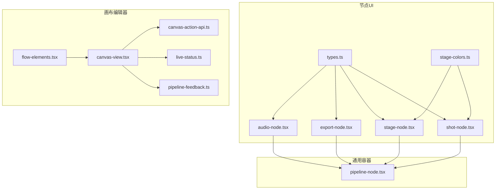
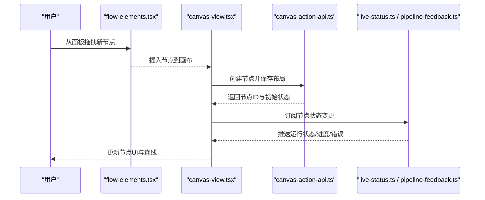
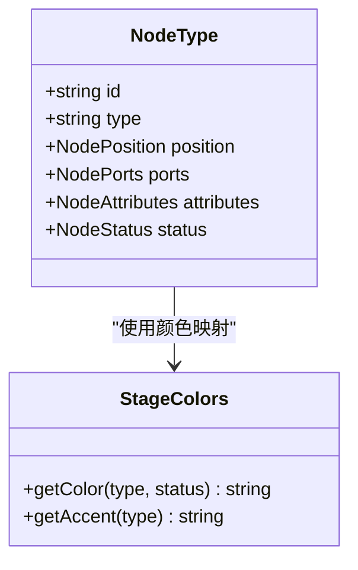
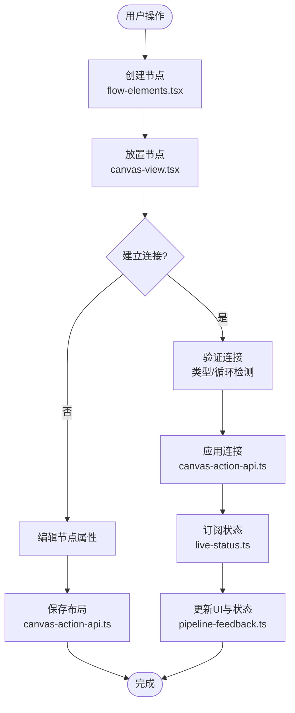
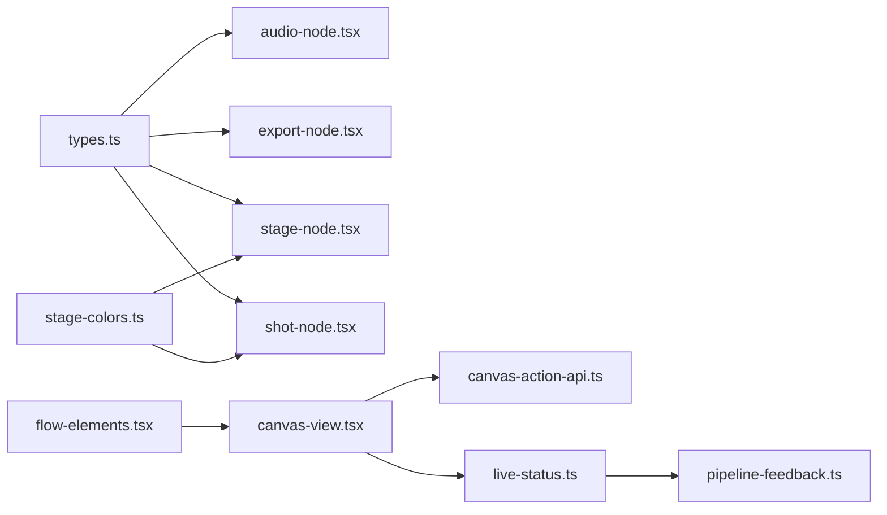

# 节点组件系统

<cite>
**本文引用的文件**   
- [src/components/ui/node/audio-node.tsx](file://src/components/ui/node/audio-node.tsx)
- [src/components/ui/node/export-node.tsx](file://src/components/ui/node/export-node.tsx)
- [src/components/ui/node/shot-node.tsx](file://src/components/ui/node/shot-node.tsx)
- [src/components/ui/node/stage-node.tsx](file://src/components/ui/node/stage-node.tsx)
- [src/components/ui/node/types.ts](file://src/components/ui/node/types.ts)
- [src/components/ui/node/stage-colors.ts](file://src/components/ui/node/stage-colors.ts)
- [src/features/canvas/types.ts](file://src/features/canvas/types.ts)
- [src/features/canvas/status.ts](file://src/features/canvas/status.ts)
- [src/features/canvas/layout.ts](file://src/features/canvas/layout.ts)
- [src/app/products/(app)/canvas/[projectId]/flow-elements.tsx](file://src/app/products/(app)/canvas/[projectId]/flow-elements.tsx)
- [src/app/products/(app)/canvas/[projectId]/canvas-view.tsx](file://src/app/products/(app)/canvas/[projectId]/canvas-view.tsx)
- [src/app/products/(app)/canvas/[projectId]/canvas-action-api.ts](file://src/app/products/(app)/canvas/[projectId]/canvas-action-api.ts)
- [src/app/products/(app)/canvas/[projectId]/live-status.ts](file://src/app/products/(app)/canvas/[projectId]/live-status.ts)
- [src/app/products/(app)/canvas/[projectId]/pipeline-feedback.ts](file://src/app/products/(app)/canvas/[projectId]/pipeline-feedback.ts)
- [src/components/ui/pipeline-node.tsx](file://src/components/ui/pipeline-node.tsx)
</cite>

## 目录
1. [简介](#简介)
2. [项目结构](#项目结构)
3. [核心组件](#核心组件)
4. [架构总览](#架构总览)
5. [详细组件分析](#详细组件分析)
6. [依赖关系分析](#依赖关系分析)
7. [性能考量](#性能考量)
8. [故障排查指南](#故障排查指南)
9. [结论](#结论)
10. [附录](#附录)

## 简介
本文件面向 PurpleInk 的可视化工作流“节点组件系统”，聚焦音频节点、阶段节点、导出节点等可视化节点的架构设计与交互模式。文档将系统性阐述：
- 节点的状态管理、连接逻辑与拖拽操作
- 颜色编码系统、图标表示与标签显示
- 节点与画布编辑器的集成方式与数据同步机制
- 节点扩展开发指南、自定义节点实现与性能优化策略
- 节点调试工具与错误处理方法

目标读者包括前端开发者、产品工程师与希望扩展节点能力的贡献者。

## 项目结构
PurpleInk 的前端采用 Next.js + React，节点相关 UI 集中在 components/ui/node 目录，画布编辑器位于 app/products/(app)/canvas 下，类型与状态定义在 features/canvas。整体组织遵循“功能域 + 组件”的分层：
- 节点 UI 组件：audio-node、export-node、stage-node、shot-node 等
- 节点类型与颜色：types.ts、stage-colors.ts
- 画布运行时：flow-elements.tsx、canvas-view.tsx、canvas-action-api.ts、live-status.ts、pipeline-feedback.ts
- 通用节点容器：pipeline-node.tsx（用于渲染管线中的节点）

图表来源 
- [src/components/ui/node/audio-node.tsx](file://src/components/ui/node/audio-node.tsx)
- [src/components/ui/node/export-node.tsx](file://src/components/ui/node/export-node.tsx)
- [src/components/ui/node/stage-node.tsx](file://src/components/ui/node/stage-node.tsx)
- [src/components/ui/node/shot-node.tsx](file://src/components/ui/node/shot-node.tsx)
- [src/components/ui/node/types.ts](file://src/components/ui/node/types.ts)
- [src/components/ui/node/stage-colors.ts](file://src/components/ui/node/stage-colors.ts)
- [src/app/products/(app)/canvas/[projectId]/flow-elements.tsx](file://src/app/products/(app)/canvas/[projectId]/flow-elements.tsx)
- [src/app/products/(app)/canvas/[projectId]/canvas-view.tsx](file://src/app/products/(app)/canvas/[projectId]/canvas-view.tsx)
- [src/app/products/(app)/canvas/[projectId]/canvas-action-api.ts](file://src/app/products/(app)/canvas/[projectId]/canvas-action-api.ts)
- [src/app/products/(app)/canvas/[projectId]/live-status.ts](file://src/app/products/(app)/canvas/[projectId]/live-status.ts)
- [src/app/products/(app)/canvas/[projectId]/pipeline-feedback.ts](file://src/app/products/(app)/canvas/[projectId]/pipeline-feedback.ts)
- [src/components/ui/pipeline-node.tsx](file://src/components/ui/pipeline-node.tsx)

章节来源
- [src/components/ui/node/types.ts](file://src/components/ui/node/types.ts)
- [src/components/ui/node/stage-colors.ts](file://src/components/ui/node/stage-colors.ts)
- [src/app/products/(app)/canvas/[projectId]/flow-elements.tsx](file://src/app/products/(app)/canvas/[projectId]/flow-elements.tsx)
- [src/app/products/(app)/canvas/[projectId]/canvas-view.tsx](file://src/app/products/(app)/canvas/[projectId]/canvas-view.tsx)

## 核心组件
- 音频节点（Audio Node）：负责展示音频输入/输出、时长、波形或元数据，支持参数配置与播放预览。
- 阶段节点（Stage Node）：代表工作流中的一个处理阶段（如转码、合成、AI 生成），包含运行状态、进度与结果摘要。
- 导出节点（Export Node）：负责最终产物导出，展示导出格式、质量设置与导出任务状态。
- 镜头节点（Shot Node）：与分镜/镜头相关的节点，通常与阶段节点配合使用，承载镜头级上下文。
- 通用容器（Pipeline Node）：为上述节点提供统一的边框、标题栏、端口（入/出）、状态指示与交互外壳。

这些组件通过 types.ts 定义的节点类型进行区分，并通过 stage-colors.ts 的颜色映射统一视觉风格。

章节来源
- [src/components/ui/node/audio-node.tsx](file://src/components/ui/node/audio-node.tsx)
- [src/components/ui/node/export-node.tsx](file://src/components/ui/node/export-node.tsx)
- [src/components/ui/node/stage-node.tsx](file://src/components/ui/node/stage-node.tsx)
- [src/components/ui/node/shot-node.tsx](file://src/components/ui/node/shot-node.tsx)
- [src/components/ui/node/types.ts](file://src/components/ui/node/types.ts)
- [src/components/ui/node/stage-colors.ts](file://src/components/ui/node/stage-colors.ts)
- [src/components/ui/pipeline-node.tsx](file://src/components/ui/pipeline-node.tsx)

## 架构总览
节点系统与画布编辑器的交互遵循“声明式节点模型 + 运行时状态驱动”的模式：
- 节点模型：由 types.ts 定义，包含节点 ID、类型、位置、端口、属性与状态字段。
- 画布视图：canvas-view.tsx 负责渲染节点集合与连线，flow-elements.tsx 提供节点列表与拖拽创建。
- 动作 API：canvas-action-api.ts 暴露增删改查、连接建立与批量操作的接口。
- 实时状态：live-status.ts 与 pipeline-feedback.ts 订阅后端事件，更新节点运行状态与反馈。

图表来源 
- [src/app/products/(app)/canvas/[projectId]/flow-elements.tsx](file://src/app/products/(app)/canvas/[projectId]/flow-elements.tsx)
- [src/app/products/(app)/canvas/[projectId]/canvas-view.tsx](file://src/app/products/(app)/canvas/[projectId]/canvas-view.tsx)
- [src/app/products/(app)/canvas/[projectId]/canvas-action-api.ts](file://src/app/products/(app)/canvas/[projectId]/canvas-action-api.ts)
- [src/app/products/(app)/canvas/[projectId]/live-status.ts](file://src/app/products/(app)/canvas/[projectId]/live-status.ts)
- [src/app/products/(app)/canvas/[projectId]/pipeline-feedback.ts](file://src/app/products/(app)/canvas/[projectId]/pipeline-feedback.ts)

## 详细组件分析

### 节点类型与颜色系统
- 节点类型：通过 types.ts 定义枚举与数据结构，区分 audio、stage、export、shot 等节点，并约定端口命名规范（如 input/output）。
- 颜色映射：stage-colors.ts 提供阶段颜色表，按阶段类型或状态映射到主题色，确保一致的视觉语义。

图表来源 
- [src/components/ui/node/types.ts](file://src/components/ui/node/types.ts)
- [src/components/ui/node/stage-colors.ts](file://src/components/ui/node/stage-colors.ts)

章节来源
- [src/components/ui/node/types.ts](file://src/components/ui/node/types.ts)
- [src/components/ui/node/stage-colors.ts](file://src/components/ui/node/stage-colors.ts)

### 音频节点（Audio Node）
- 职责：展示音频资源信息（时长、采样率、路径）、参数配置（音量、淡入淡出）、播放控制与波形预览。
- 状态：加载、就绪、播放中、错误；与画布状态联动，当上游节点产出变化时自动刷新。
- 交互：点击播放/暂停、拖动调整参数、右键菜单（复制/删除/查看元数据）。

章节来源
- [src/components/ui/node/audio-node.tsx](file://src/components/ui/node/audio-node.tsx)

### 阶段节点（Stage Node）
- 职责：封装一个处理阶段（如转码、AI 生成、合成），显示阶段名称、进度条、日志摘要与错误提示。
- 状态：待执行、运行中、成功、失败、取消；颜色随状态切换，便于快速识别。
- 交互：点击查看详情、重试、中止；与 pipeline-feedback.ts 对接实时更新。

章节来源
- [src/components/ui/node/stage-node.tsx](file://src/components/ui/node/stage-node.tsx)
- [src/app/products/(app)/canvas/[projectId]/pipeline-feedback.ts](file://src/app/products/(app)/canvas/[projectId]/pipeline-feedback.ts)

### 导出节点（Export Node）
- 职责：配置导出格式、分辨率、码率等参数，发起导出任务并跟踪任务状态。
- 状态：未开始、排队中、进行中、完成、失败；完成后提供下载入口。
- 交互：参数校验、一键导出、查看导出日志。

章节来源
- [src/components/ui/node/export-node.tsx](file://src/components/ui/node/export-node.tsx)

### 镜头节点（Shot Node）
- 职责：承载镜头级上下文（场景描述、镜头时长、关键帧），与阶段节点协作完成镜头制作。
- 状态：草稿、审核中、已定稿；与阶段节点共享颜色与状态语义。

章节来源
- [src/components/ui/node/shot-node.tsx](file://src/components/ui/node/shot-node.tsx)

### 通用容器（Pipeline Node）
- 职责：提供统一的外壳（边框、标题栏、端口锚点、状态指示灯），所有具体节点均基于此容器扩展。
- 交互：拖拽移动、缩放、选择高亮、右键菜单、键盘快捷键（Delete、Ctrl+C/V）。

章节来源
- [src/components/ui/pipeline-node.tsx](file://src/components/ui/pipeline-node.tsx)

### 画布编辑器集成与数据同步
- 节点创建与布局：flow-elements.tsx 提供节点面板与拖拽创建；canvas-view.tsx 维护节点坐标与层级。
- 连接逻辑：连线通过端口锚点建立，validateConnection 检查类型兼容性与循环依赖。
- 状态同步：live-status.ts 订阅后端事件流，pipeline-feedback.ts 解析并分发到对应节点。
- 持久化：canvas-action-api.ts 提供 saveLayout、updateNode、createEdge 等方法，确保画布状态与后端一致。

图表来源 
- [src/app/products/(app)/canvas/[projectId]/flow-elements.tsx](file://src/app/products/(app)/canvas/[projectId]/flow-elements.tsx)
- [src/app/products/(app)/canvas/[projectId]/canvas-view.tsx](file://src/app/products/(app)/canvas/[projectId]/canvas-view.tsx)
- [src/app/products/(app)/canvas/[projectId]/canvas-action-api.ts](file://src/app/products/(app)/canvas/[projectId]/canvas-action-api.ts)
- [src/app/products/(app)/canvas/[projectId]/live-status.ts](file://src/app/products/(app)/canvas/[projectId]/live-status.ts)
- [src/app/products/(app)/canvas/[projectId]/pipeline-feedback.ts](file://src/app/products/(app)/canvas/[projectId]/pipeline-feedback.ts)

章节来源
- [src/app/products/(app)/canvas/[projectId]/flow-elements.tsx](file://src/app/products/(app)/canvas/[projectId]/flow-elements.tsx)
- [src/app/products/(app)/canvas/[projectId]/canvas-view.tsx](file://src/app/products/(app)/canvas/[projectId]/canvas-view.tsx)
- [src/app/products/(app)/canvas/[projectId]/canvas-action-api.ts](file://src/app/products/(app)/canvas/[projectId]/canvas-action-api.ts)
- [src/app/products/(app)/canvas/[projectId]/live-status.ts](file://src/app/products/(app)/canvas/[projectId]/live-status.ts)
- [src/app/products/(app)/canvas/[projectId]/pipeline-feedback.ts](file://src/app/products/(app)/canvas/[projectId]/pipeline-feedback.ts)

## 依赖关系分析
- 组件内聚：各节点组件仅依赖 types.ts 与 stage-colors.ts，保持低耦合。
- 画布依赖：canvas-view.tsx 依赖 flow-elements.tsx（节点源）、canvas-action-api.ts（动作）、live-status.ts（状态订阅）。
- 外部服务：pipeline-feedback.ts 可能订阅 WebSocket/SSE 事件，将后端运行状态推送到前端节点。

图表来源 
- [src/components/ui/node/types.ts](file://src/components/ui/node/types.ts)
- [src/components/ui/node/stage-colors.ts](file://src/components/ui/node/stage-colors.ts)
- [src/components/ui/node/audio-node.tsx](file://src/components/ui/node/audio-node.tsx)
- [src/components/ui/node/export-node.tsx](file://src/components/ui/node/export-node.tsx)
- [src/components/ui/node/stage-node.tsx](file://src/components/ui/node/stage-node.tsx)
- [src/components/ui/node/shot-node.tsx](file://src/components/ui/node/shot-node.tsx)
- [src/app/products/(app)/canvas/[projectId]/flow-elements.tsx](file://src/app/products/(app)/canvas/[projectId]/flow-elements.tsx)
- [src/app/products/(app)/canvas/[projectId]/canvas-view.tsx](file://src/app/products/(app)/canvas/[projectId]/canvas-view.tsx)
- [src/app/products/(app)/canvas/[projectId]/canvas-action-api.ts](file://src/app/products/(app)/canvas/[projectId]/canvas-action-api.ts)
- [src/app/products/(app)/canvas/[projectId]/live-status.ts](file://src/app/products/(app)/canvas/[projectId]/live-status.ts)
- [src/app/products/(app)/canvas/[projectId]/pipeline-feedback.ts](file://src/app/products/(app)/canvas/[projectId]/pipeline-feedback.ts)

章节来源
- [src/components/ui/node/types.ts](file://src/components/ui/node/types.ts)
- [src/components/ui/node/stage-colors.ts](file://src/components/ui/node/stage-colors.ts)
- [src/app/products/(app)/canvas/[projectId]/flow-elements.tsx](file://src/app/products/(app)/canvas/[projectId]/flow-elements.tsx)
- [src/app/products/(app)/canvas/[projectId]/canvas-view.tsx](file://src/app/products/(app)/canvas/[projectId]/canvas-view.tsx)
- [src/app/products/(app)/canvas/[projectId]/canvas-action-api.ts](file://src/app/products/(app)/canvas/[projectId]/canvas-action-api.ts)
- [src/app/products/(app)/canvas/[projectId]/live-status.ts](file://src/app/products/(app)/canvas/[projectId]/live-status.ts)
- [src/app/products/(app)/canvas/[projectId]/pipeline-feedback.ts](file://src/app/products/(app)/canvas/[projectId]/pipeline-feedback.ts)

## 性能考量
- 渲染优化：节点列表虚拟化（长列表滚动）、按需加载节点详情、避免不必要的重渲染。
- 状态更新：事件去抖与合并（如频繁进度更新），减少 DOM 操作频率。
- 连接计算：增量计算连线与碰撞检测，避免全量重排。
- 内存管理：及时释放音频资源与订阅事件，防止泄漏。
- 网络请求：批量保存布局、缓存只读数据、断线重连与幂等提交。

[本节为通用指导，不直接分析具体文件]

## 故障排查指南
- 节点状态异常：检查 live-status.ts 的事件订阅是否生效，确认 pipeline-feedback.ts 是否正确解析后端消息。
- 连接失败：验证 types.ts 的端口类型兼容性，检查 canvas-action-api.ts 的连接校验逻辑。
- 拖拽问题：确认 flow-elements.tsx 的拖拽事件绑定与 canvas-view.tsx 的坐标转换。
- 颜色与图标：核对 stage-colors.ts 的映射表与节点类型枚举的一致性。
- 调试建议：打开浏览器控制台，监听节点状态变更事件；使用 React DevTools 检查组件 props/state。

章节来源
- [src/app/products/(app)/canvas/[projectId]/live-status.ts](file://src/app/products/(app)/canvas/[projectId]/live-status.ts)
- [src/app/products/(app)/canvas/[projectId]/pipeline-feedback.ts](file://src/app/products/(app)/canvas/[projectId]/pipeline-feedback.ts)
- [src/components/ui/node/types.ts](file://src/components/ui/node/types.ts)
- [src/app/products/(app)/canvas/[projectId]/canvas-action-api.ts](file://src/app/products/(app)/canvas/[projectId]/canvas-action-api.ts)
- [src/app/products/(app)/canvas/[projectId]/flow-elements.tsx](file://src/app/products/(app)/canvas/[projectId]/flow-elements.tsx)
- [src/app/products/(app)/canvas/[projectId]/canvas-view.tsx](file://src/app/products/(app)/canvas/[projectId]/canvas-view.tsx)
- [src/components/ui/node/stage-colors.ts](file://src/components/ui/node/stage-colors.ts)

## 结论
PurpleInk 的节点组件系统以清晰的类型定义与颜色映射为基础，结合画布编辑器的拖拽、连接与状态同步能力，提供了可扩展、可维护的可视化工作流体验。通过统一的容器与模块化的节点实现，开发者可以快速扩展新的节点类型，同时保证一致的交互与视觉风格。

[本节为总结性内容，不直接分析具体文件]

## 附录
- 扩展节点开发步骤：
  - 在 types.ts 中新增节点类型与端口定义
  - 在 stage-colors.ts 中补充颜色映射
  - 新建节点组件（参考 audio-node.tsx/stage-node.tsx）
  - 在 flow-elements.tsx 中添加节点面板项与拖拽逻辑
  - 在 canvas-action-api.ts 中实现必要的动作方法
  - 在 live-status.ts/pipeline-feedback.ts 中接入状态推送
- 最佳实践：
  - 保持节点组件无副作用，状态由画布统一管理
  - 使用受控组件与最小化 state
  - 对耗时操作进行异步与取消处理
  - 提供完善的错误边界与用户提示

[本节为概念性内容，不直接分析具体文件]