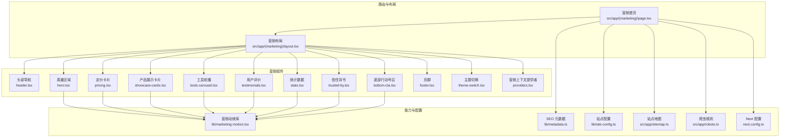
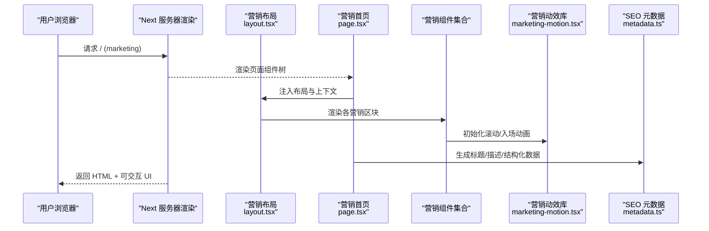
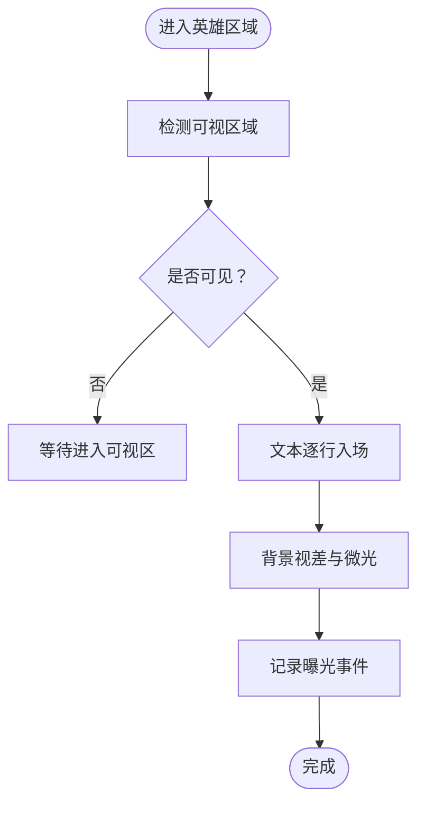
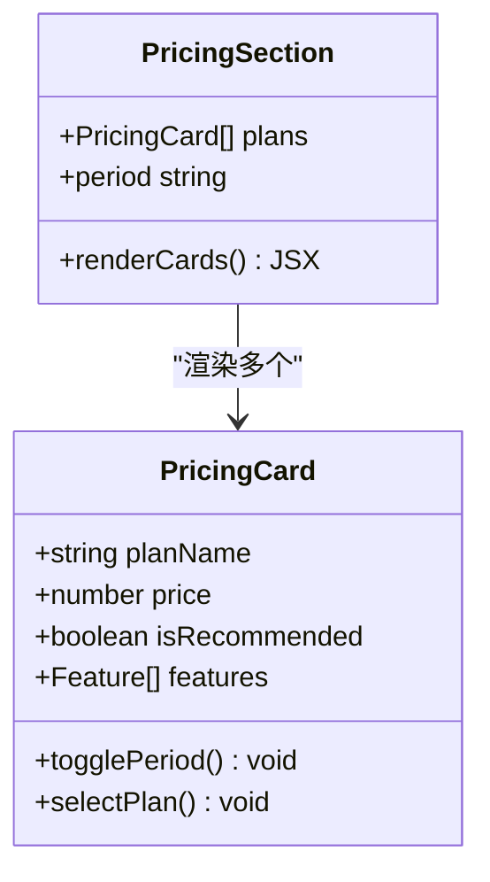
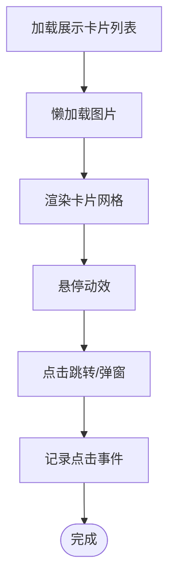
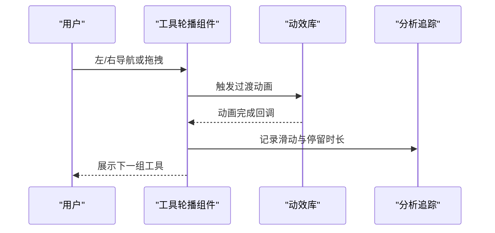
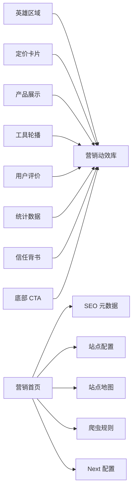

# 营销页面组件

<cite>
**本文引用的文件**   
- [src/app/(marketing)/page.tsx](file://src/app/(marketing)/page.tsx)
- [src/app/(marketing)/layout.tsx](file://src/app/(marketing)/layout.tsx)
- [src/components/marketing/hero.tsx](file://src/components/marketing/hero.tsx)
- [src/components/marketing/pricing.tsx](file://src/components/marketing/pricing.tsx)
- [src/components/marketing/showcase-cards.tsx](file://src/components/marketing/showcase-cards.tsx)
- [src/components/marketing/tools-carousel.tsx](file://src/components/marketing/tools-carousel.tsx)
- [src/components/marketing/testimonials.tsx](file://src/components/marketing/testimonials.tsx)
- [src/components/marketing/stats.tsx](file://src/components/marketing/stats.tsx)
- [src/components/marketing/trusted-by.tsx](file://src/components/marketing/trusted-by.tsx)
- [src/components/marketing/bottom-cta.tsx](file://src/components/marketing/bottom-cta.tsx)
- [src/components/marketing/footer.tsx](file://src/components/marketing/footer.tsx)
- [src/components/marketing/header.tsx](file://src/components/marketing/header.tsx)
- [src/components/marketing/theme-switch.tsx](file://src/components/marketing/theme-switch.tsx)
- [src/components/marketing/providers.tsx](file://src/components/marketing/providers.tsx)
- [src/lib/marketing-motion.tsx](file://src/lib/marketing-motion.tsx)
- [src/lib/metadata.ts](file://src/lib/metadata.ts)
- [src/lib/site-config.ts](file://src/lib/site-config.ts)
- [src/app/sitemap.ts](file://src/app/sitemap.ts)
- [src/app/robots.ts](file://src/app/robots.ts)
- [next.config.ts](file://next.config.ts)
</cite>

## 目录
1. [简介](#简介)
2. [项目结构](#项目结构)
3. [核心组件](#核心组件)
4. [架构总览](#架构总览)
5. [详细组件分析](#详细组件分析)
6. [依赖关系分析](#依赖关系分析)
7. [性能考量](#性能考量)
8. [故障排查指南](#故障排查指南)
9. [结论](#结论)
10. [附录](#附录)

## 简介
本文件面向 PurpleInk 的营销页面组件，系统性阐述英雄区域、定价卡片、产品展示等营销专用组件的设计理念与视觉效果，并深入说明动画效果、交互体验与响应式适配的实现技术。同时覆盖内容管理、SEO 优化、性能调优策略，以及与品牌设计系统的集成和主题定制方式。文档还包含 A/B 测试支持、分析追踪与转化优化的实践建议，以及营销内容的更新流程与发布策略。

## 项目结构
营销页面采用 Next.js App Router 组织：
- 路由层：(marketing) 分组承载营销页入口与布局
- 组件层：components/marketing 下按功能拆分独立组件（英雄区、定价、展示、轮播、评价、统计、信任背书、底部 CTA、页脚、头部、主题切换）
- 能力层：lib/marketing-motion.tsx 提供统一的动画与滚动触发能力；lib/metadata.ts 与 lib/site-config.ts 集中 SEO 与站点配置；sitemap/robots 负责搜索引擎友好性
- 构建与运行时：next.config.ts 控制资源加载、图片优化与缓存策略

**图表来源** 
- [src/app/(marketing)/page.tsx](file://src/app/(marketing)/page.tsx)
- [src/app/(marketing)/layout.tsx](file://src/app/(marketing)/layout.tsx)
- [src/components/marketing/header.tsx](file://src/components/marketing/header.tsx)
- [src/components/marketing/hero.tsx](file://src/components/marketing/hero.tsx)
- [src/components/marketing/pricing.tsx](file://src/components/marketing/pricing.tsx)
- [src/components/marketing/showcase-cards.tsx](file://src/components/marketing/showcase-cards.tsx)
- [src/components/marketing/tools-carousel.tsx](file://src/components/marketing/tools-carousel.tsx)
- [src/components/marketing/testimonials.tsx](file://src/components/marketing/testimonials.tsx)
- [src/components/marketing/stats.tsx](file://src/components/marketing/stats.tsx)
- [src/components/marketing/trusted-by.tsx](file://src/components/marketing/trusted-by.tsx)
- [src/components/marketing/bottom-cta.tsx](file://src/components/marketing/bottom-cta.tsx)
- [src/components/marketing/footer.tsx](file://src/components/marketing/footer.tsx)
- [src/components/marketing/theme-switch.tsx](file://src/components/marketing/theme-switch.tsx)
- [src/components/marketing/providers.tsx](file://src/components/marketing/providers.tsx)
- [src/lib/marketing-motion.tsx](file://src/lib/marketing-motion.tsx)
- [src/lib/metadata.ts](file://src/lib/metadata.ts)
- [src/lib/site-config.ts](file://src/lib/site-config.ts)
- [src/app/sitemap.ts](file://src/app/sitemap.ts)
- [src/app/robots.ts](file://src/app/robots.ts)
- [next.config.ts](file://next.config.ts)

**章节来源**
- [src/app/(marketing)/page.tsx](file://src/app/(marketing)/page.tsx)
- [src/app/(marketing)/layout.tsx](file://src/app/(marketing)/layout.tsx)
- [src/lib/marketing-motion.tsx](file://src/lib/marketing-motion.tsx)
- [src/lib/metadata.ts](file://src/lib/metadata.ts)
- [src/lib/site-config.ts](file://src/lib/site-config.ts)
- [src/app/sitemap.ts](file://src/app/sitemap.ts)
- [src/app/robots.ts](file://src/app/robots.ts)
- [next.config.ts](file://next.config.ts)

## 核心组件
- 英雄区域（Hero）：首屏视觉焦点，强调价值主张与主行动按钮，配合入场动画与滚动视差提升吸引力
- 定价卡片（Pricing）：多档方案对比，突出推荐档位与限时优惠，支持切换周期与功能清单
- 产品展示（Showcase Cards）：网格化产品亮点展示，支持悬停动效与懒加载
- 工具轮播（Tools Carousel）：横向滑动展示工具生态，支持触摸拖拽与自动播放
- 用户评价（Testimonials）：真实反馈卡片，支持头像、评分与引用样式
- 统计数据（Stats）：关键指标数字展示，支持计数动画
- 信任背书（Trusted By）：合作品牌 Logo 墙，支持灰度与高亮切换
- 底部行动号召（Bottom CTA）：引导注册或试用，强化转化路径
- 头部与页脚（Header/Footer）：全局导航与链接聚合，支持暗色模式与无障碍跳转
- 主题切换（Theme Switch）：明暗主题切换，联动 CSS 变量与 Tailwind 主题
- 营销上下文（Providers）：为营销组件提供统一状态与事件总线（如埋点、A/B 实验）

**章节来源**
- [src/components/marketing/hero.tsx](file://src/components/marketing/hero.tsx)
- [src/components/marketing/pricing.tsx](file://src/components/marketing/pricing.tsx)
- [src/components/marketing/showcase-cards.tsx](file://src/components/marketing/showcase-cards.tsx)
- [src/components/marketing/tools-carousel.tsx](file://src/components/marketing/tools-carousel.tsx)
- [src/components/marketing/testimonials.tsx](file://src/components/marketing/testimonials.tsx)
- [src/components/marketing/stats.tsx](file://src/components/marketing/stats.tsx)
- [src/components/marketing/trusted-by.tsx](file://src/components/marketing/trusted-by.tsx)
- [src/components/marketing/bottom-cta.tsx](file://src/components/marketing/bottom-cta.tsx)
- [src/components/marketing/header.tsx](file://src/components/marketing/header.tsx)
- [src/components/marketing/footer.tsx](file://src/components/marketing/footer.tsx)
- [src/components/marketing/theme-switch.tsx](file://src/components/marketing/theme-switch.tsx)
- [src/components/marketing/providers.tsx](file://src/components/marketing/providers.tsx)

## 架构总览
营销页面以“路由-布局-组件”三层解耦，结合“能力层”提供动画、SEO、站点配置与构建优化。组件之间通过 props 与上下文通信，避免强耦合；动画与滚动触发集中在 marketing-motion 中统一管理，便于复用与性能优化。

**图表来源** 
- [src/app/(marketing)/page.tsx](file://src/app/(marketing)/page.tsx)
- [src/app/(marketing)/layout.tsx](file://src/app/(marketing)/layout.tsx)
- [src/lib/marketing-motion.tsx](file://src/lib/marketing-motion.tsx)
- [src/lib/metadata.ts](file://src/lib/metadata.ts)

## 详细组件分析

### 英雄区域（Hero）
- 设计理念：以大图/视频背景与简洁文案传达核心价值，主按钮引导注册或试用
- 视觉效果：入场渐显、文字逐行出现、背景视差与微光动效
- 交互体验：鼠标移动产生轻微视差，移动端自动降级为静态背景
- 响应式适配：大屏使用宽幅背景，小屏聚焦标题与 CTA，字体与间距自适应
- 动画实现：基于 IntersectionObserver 触发入场，GSAP 或原生 Web Animations API 驱动过渡
- 性能要点：背景图懒加载与压缩，减少首屏重绘，避免阻塞渲染

**图表来源** 
- [src/components/marketing/hero.tsx](file://src/components/marketing/hero.tsx)
- [src/lib/marketing-motion.tsx](file://src/lib/marketing-motion.tsx)

**章节来源**
- [src/components/marketing/hero.tsx](file://src/components/marketing/hero.tsx)
- [src/lib/marketing-motion.tsx](file://src/lib/marketing-motion.tsx)

### 定价卡片（Pricing）
- 设计理念：清晰呈现三档方案，突出推荐档位与限时折扣，帮助用户快速决策
- 视觉效果：卡片阴影、边框高亮、悬停放大与选中态标记
- 交互体验：周期切换（月/年）、功能清单展开/收起、点击跳转购买或试用
- 响应式适配：桌面端三列并排，平板双列，手机单列堆叠
- 动画实现：切换周期时价格数字滚动变化，新增标签闪烁提示
- 性能要点：按需加载功能清单详情，避免一次性渲染大量 DOM

**图表来源** 
- [src/components/marketing/pricing.tsx](file://src/components/marketing/pricing.tsx)

**章节来源**
- [src/components/marketing/pricing.tsx](file://src/components/marketing/pricing.tsx)

### 产品展示（Showcase Cards）
- 设计理念：以网格形式展示产品亮点，每张卡片包含标题、摘要与缩略图
- 视觉效果：卡片悬停上浮、图片缩放、标签角标
- 交互体验：点击打开详情弹窗或跳转到对应页面
- 响应式适配：根据屏幕宽度动态调整列数与图片比例
- 动画实现：滚动进入视口时依次淡入，图片懒加载与占位骨架屏
- 性能要点：图片使用现代格式（WebP/AVIF），启用预加载与缓存

**图表来源** 
- [src/components/marketing/showcase-cards.tsx](file://src/components/marketing/showcase-cards.tsx)
- [src/lib/marketing-motion.tsx](file://src/lib/marketing-motion.tsx)

**章节来源**
- [src/components/marketing/showcase-cards.tsx](file://src/components/marketing/showcase-cards.tsx)
- [src/lib/marketing-motion.tsx](file://src/lib/marketing-motion.tsx)

### 工具轮播（Tools Carousel）
- 设计理念：横向滑动展示工具生态，强调多样性与易用性
- 视觉效果：圆角卡片、图标与简短描述，自动播放与进度指示器
- 交互体验：左右箭头导航、触摸拖拽、键盘方向键支持
- 响应式适配：移动端显示较少项，增加滑动灵敏度
- 动画实现：平滑过渡与惯性滚动，暂停于悬停
- 性能要点：虚拟滚动与去抖滚动事件，避免频繁重排

**图表来源** 
- [src/components/marketing/tools-carousel.tsx](file://src/components/marketing/tools-carousel.tsx)
- [src/lib/marketing-motion.tsx](file://src/lib/marketing-motion.tsx)

**章节来源**
- [src/components/marketing/tools-carousel.tsx](file://src/components/marketing/tools-carousel.tsx)
- [src/lib/marketing-motion.tsx](file://src/lib/marketing-motion.tsx)

### 用户评价（Testimonials）
- 设计理念：真实用户反馈增强信任感，包含头像、姓名、职位与评分
- 视觉效果：引用样式、星级评分与头像圆形裁剪
- 交互体验：分页或轮播切换，支持展开更多评论
- 响应式适配：小屏单列展示，大屏多列并排
- 动画实现：进入视口时淡入与轻微上移
- 性能要点：头像与背景图懒加载，避免首屏阻塞

**章节来源**
- [src/components/marketing/testimonials.tsx](file://src/components/marketing/testimonials.tsx)

### 统计数据（Stats）
- 设计理念：用关键数字展示产品实力，如用户数、处理量、满意度
- 视觉效果：大号数字、单位与增长趋势线
- 交互体验：数字滚动计数动画，鼠标悬停显示详情
- 响应式适配：数字字号与间距随屏幕调整
- 动画实现：IntersectionObserver 触发计数动画，缓动函数自然过渡
- 性能要点：防抖与节流，避免重复计算

**章节来源**
- [src/components/marketing/stats.tsx](file://src/components/marketing/stats.tsx)

### 信任背书（Trusted By）
- 设计理念：展示合作品牌 Logo 墙，提升可信度
- 视觉效果：灰度 Logo 在悬停时恢复彩色，统一尺寸与对齐
- 交互体验：无复杂交互，重点在于视觉一致性
- 响应式适配：Logo 数量与排列随屏幕宽度调整
- 动画实现：CSS 过渡与滤镜切换
- 性能要点：SVG 内联或 Sprite 合并，减少请求次数

**章节来源**
- [src/components/marketing/trusted-by.tsx](file://src/components/marketing/trusted-by.tsx)

### 底部行动号召（Bottom CTA）
- 设计理念：页面末尾强化转化，引导注册或试用
- 视觉效果：高对比背景、醒目按钮与倒计时/限时提示
- 交互体验：点击跳转注册页，支持复制链接分享
- 响应式适配：按钮全宽显示，文案换行优化
- 动画实现：脉冲动画吸引注意力
- 性能要点：避免阻塞渲染，异步加载第三方脚本

**章节来源**
- [src/components/marketing/bottom-cta.tsx](file://src/components/marketing/bottom-cta.tsx)

### 头部与页脚（Header/Footer）
- 设计理念：全局导航与链接聚合，确保可访问性与一致性
- 视觉效果：透明背景滚动后变为不透明，暗色模式切换
- 交互体验：移动端汉堡菜单、锚点平滑滚动
- 响应式适配：导航折叠与展开，链接分类展示
- 动画实现：滚动监听背景渐变与菜单滑入
- 性能要点：减少重绘，使用 will-change 优化

**章节来源**
- [src/components/marketing/header.tsx](file://src/components/marketing/header.tsx)
- [src/components/marketing/footer.tsx](file://src/components/marketing/footer.tsx)

### 主题切换（Theme Switch）
- 设计理念：支持明暗主题，符合用户偏好与系统设置
- 视觉效果：图标切换与颜色过渡
- 交互体验：点击切换，持久化到本地存储
- 响应式适配：跟随系统主题默认值
- 动画实现：CSS 变量与 Tailwind 主题类切换
- 性能要点：避免强制同步布局，批量更新样式

**章节来源**
- [src/components/marketing/theme-switch.tsx](file://src/components/marketing/theme-switch.tsx)

### 营销上下文（Providers）
- 设计理念：为营销组件提供统一状态与事件总线，如埋点、A/B 实验、主题与语言
- 交互体验：组件通过上下文消费状态，无需层层传递 props
- 性能要点：惰性初始化与选择性订阅，避免不必要重渲染

**章节来源**
- [src/components/marketing/providers.tsx](file://src/components/marketing/providers.tsx)

## 依赖关系分析
营销组件依赖能力层提供的动画、SEO 与站点配置，同时受 Next 构建配置影响。组件间松耦合，通过 props 与上下文通信，降低维护成本。

**图表来源** 
- [src/components/marketing/hero.tsx](file://src/components/marketing/hero.tsx)
- [src/components/marketing/pricing.tsx](file://src/components/marketing/pricing.tsx)
- [src/components/marketing/showcase-cards.tsx](file://src/components/marketing/showcase-cards.tsx)
- [src/components/marketing/tools-carousel.tsx](file://src/components/marketing/tools-carousel.tsx)
- [src/components/marketing/testimonials.tsx](file://src/components/marketing/testimonials.tsx)
- [src/components/marketing/stats.tsx](file://src/components/marketing/stats.tsx)
- [src/components/marketing/trusted-by.tsx](file://src/components/marketing/trusted-by.tsx)
- [src/components/marketing/bottom-cta.tsx](file://src/components/marketing/bottom-cta.tsx)
- [src/lib/marketing-motion.tsx](file://src/lib/marketing-motion.tsx)
- [src/lib/metadata.ts](file://src/lib/metadata.ts)
- [src/lib/site-config.ts](file://src/lib/site-config.ts)
- [src/app/sitemap.ts](file://src/app/sitemap.ts)
- [src/app/robots.ts](file://src/app/robots.ts)
- [next.config.ts](file://next.config.ts)

**章节来源**
- [src/lib/marketing-motion.tsx](file://src/lib/marketing-motion.tsx)
- [src/lib/metadata.ts](file://src/lib/metadata.ts)
- [src/lib/site-config.ts](file://src/lib/site-config.ts)
- [src/app/sitemap.ts](file://src/app/sitemap.ts)
- [src/app/robots.ts](file://src/app/robots.ts)
- [next.config.ts](file://next.config.ts)

## 性能考量
- 首屏优化：关键 CSS 内联，非关键 JS 延迟加载，图片懒加载与 WebP/AVIF 格式
- 动画性能：使用 requestAnimationFrame 与 GPU 加速属性，避免布局抖动
- 资源缓存：CDN 缓存与版本化文件名，利用浏览器缓存策略
- 构建优化：代码分割与 Tree Shaking，按需引入组件与库
- 监控与度量：接入性能监控与错误上报，定位瓶颈与异常

[本节为通用指导，不直接分析具体文件]

## 故障排查指南
- 动画不触发：检查 IntersectionObserver 配置与元素可视性，确认未阻塞渲染
- 图片加载失败：验证资源路径与 CDN 配置，启用占位符与重试机制
- 主题切换无效：确认 CSS 变量与 Tailwind 类名正确应用，检查本地存储读写权限
- 埋点丢失：验证事件总线初始化与权限，确认网络请求未被拦截
- SEO 不生效：检查 meta 标签与结构化数据，确认 sitemap 与 robots 配置正确

**章节来源**
- [src/lib/marketing-motion.tsx](file://src/lib/marketing-motion.tsx)
- [src/lib/metadata.ts](file://src/lib/metadata.ts)
- [src/components/marketing/theme-switch.tsx](file://src/components/marketing/theme-switch.tsx)
- [src/components/marketing/providers.tsx](file://src/components/marketing/providers.tsx)

## 结论
PurpleInk 营销页面组件以清晰的层次结构与模块化设计，实现了高性能、可维护且易于定制的营销界面。通过统一的动画库、SEO 与站点配置，以及完善的响应式与主题支持，团队可以快速迭代营销内容并优化转化效果。建议在后续开发中持续完善 A/B 测试与分析追踪，建立内容更新与发布流程，确保营销页面的质量与效率。

[本节为总结，不直接分析具体文件]

## 附录
- 内容管理：建议使用 CMS 或配置文件集中管理文案与媒体资源，支持预览与回滚
- SEO 优化：完善标题、描述、Open Graph 与 Twitter Card，提交 sitemap 至搜索引擎
- 性能调优：使用 Lighthouse 与 Web Vitals 监控，定期审计与优化
- 品牌集成：遵循设计令牌与组件规范，保持视觉一致性
- A/B 测试：通过实验平台分流流量，评估不同文案与布局的转化效果
- 分析追踪：接入 GA/PostHog 等工具，记录关键事件与漏斗转化
- 更新流程：内容变更走 PR 评审，自动化测试与构建，灰度发布与回滚策略

[本节为通用指导，不直接分析具体文件]