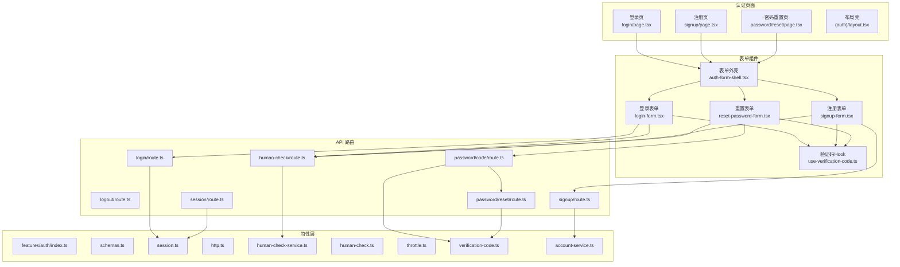
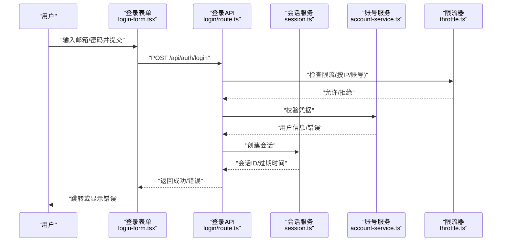
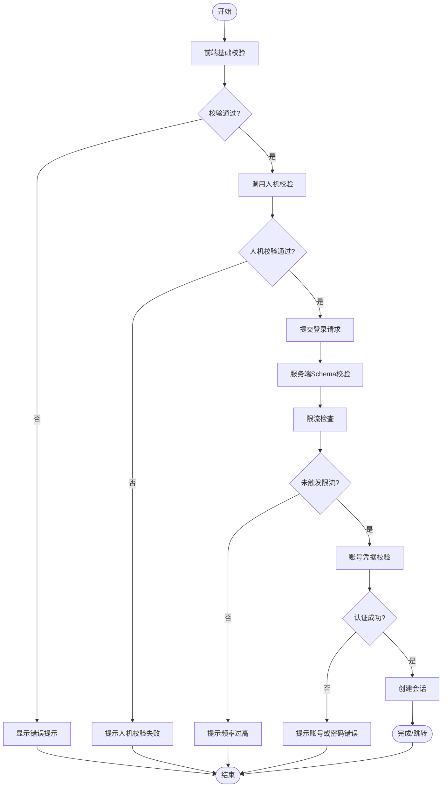
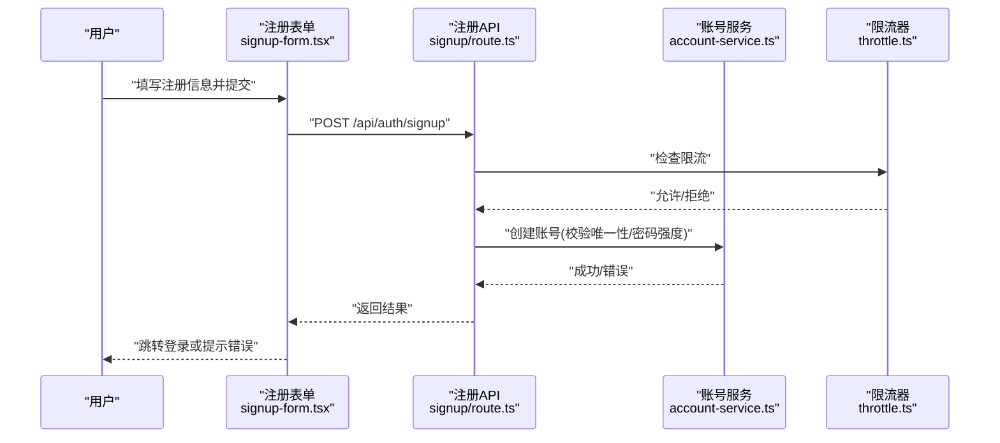
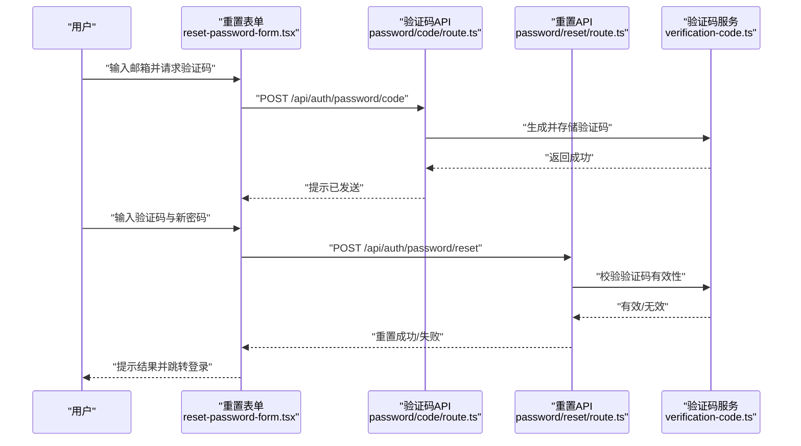
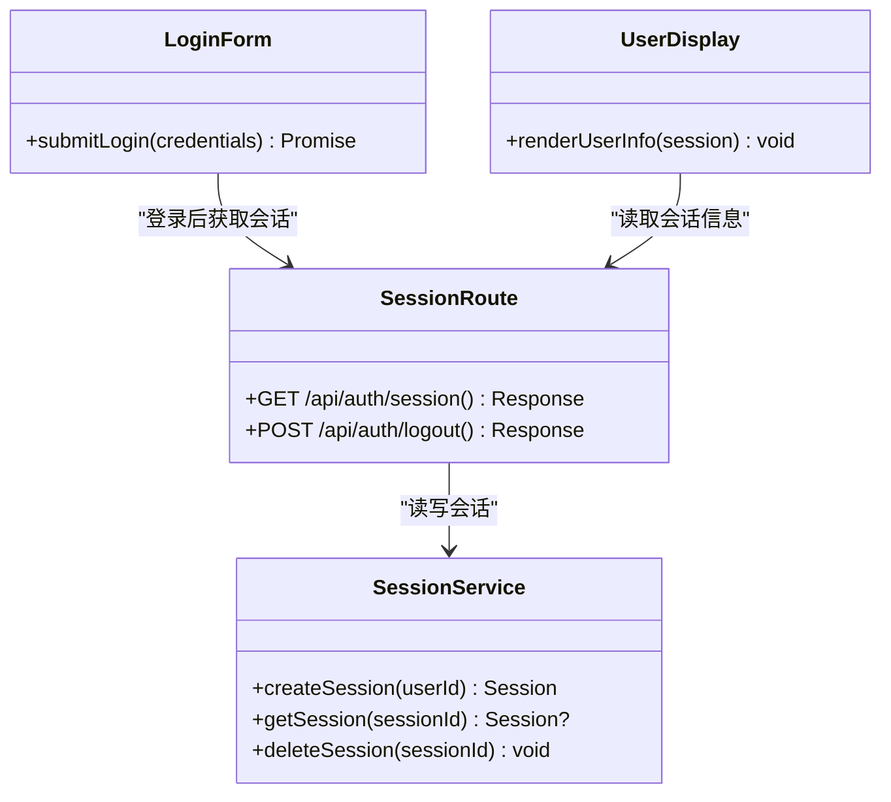
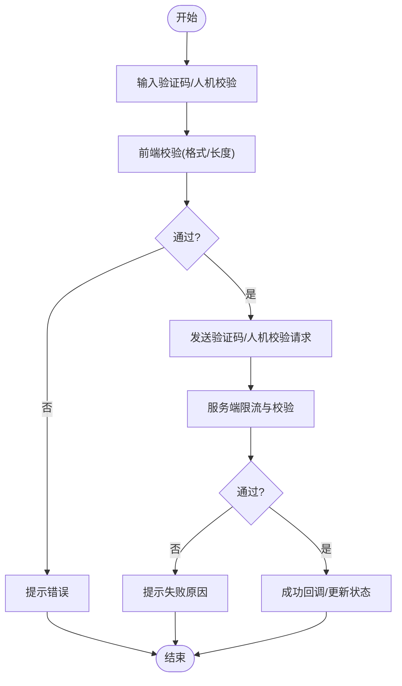
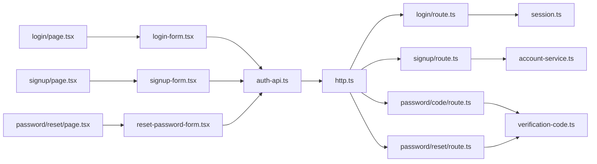

# 认证界面

<cite>
**本文引用的文件**   
- [src/app/(auth)/layout.tsx](file://src/app/(auth)/layout.tsx)
- [src/app/(auth)/login/page.tsx](file://src/app/(auth)/login/page.tsx)
- [src/app/(auth)/signup/page.tsx](file://src/app/(auth)/signup/page.tsx)
- [src/app/(auth)/password/reset/page.tsx](file://src/app/(auth)/password/reset/page.tsx)
- [src/app/(auth)/_components/auth-form-shell.tsx](file://src/app/(auth)/_components/auth-form-shell.tsx)
- [src/app/(auth)/_components/login-form.tsx](file://src/app/(auth)/_components/login-form.tsx)
- [src/app/(auth)/_components/signup-form.tsx](file://src/app/(auth)/_components/signup-form.tsx)
- [src/app/(auth)/_components/reset-password-form.tsx](file://src/app/(auth)/_components/reset-password-form.tsx)
- [src/app/(auth)/_components/auth-api.ts](file://src/app/(auth)/_components/auth-api.ts)
- [src/app/(auth)/_components/use-verification-code.ts](file://src/app/(auth)/_components/use-verification-code.ts)
- [src/app/api/auth/human-check/route.ts](file://src/app/api/auth/human-check/route.ts)
- [src/app/api/auth/login/route.ts](file://src/app/api/auth/login/route.ts)
- [src/app/api/auth/logout/route.ts](file://src/app/api/auth/logout/route.ts)
- [src/app/api/auth/session/route.ts](file://src/app/api/auth/session/route.ts)
- [src/app/api/auth/signup/route.ts](file://src/app/api/auth/signup/route.ts)
- [src/app/api/auth/password/code/route.ts](file://src/app/api/auth/password/code/route.ts)
- [src/app/api/auth/password/reset/route.ts](file://src/app/api/auth/password/reset/route.ts)
- [src/features/auth/index.ts](file://src/features/auth/index.ts)
- [src/features/auth/schemas.ts](file://src/features/auth/schemas.ts)
- [src/features/auth/session.ts](file://src/features/auth/session.ts)
- [src/features/auth/http.ts](file://src/features/auth/http.ts)
- [src/features/auth/human-check-service.ts](file://src/features/auth/human-check-service.ts)
- [src/features/auth/human-check.ts](file://src/features/auth/human-check.ts)
- [src/features/auth/throttle.ts](file://src/features/auth/throttle.ts)
- [src/features/auth/verification-code.ts](file://src/features/auth/verification-code.ts)
- [src/features/auth/account-service.ts](file://src/features/auth/account-service.ts)
- [src/components/ui/human-check-field.tsx](file://src/components/ui/human-check-field.tsx)
- [src/components/ui/verification-code-field.demo.tsx](file://src/components/ui/verification-code-field.demo.tsx)
- [scripts/verify/auth-flow-smoke.mjs](file://scripts/verify/auth-flow-smoke.mjs)
- [scripts/verify/auth-pages-shot.mjs](file://scripts/verify/auth-pages-shot.mjs)
</cite>

## 更新摘要
**变更内容**   
- 移除了登录页面的演示账户弹窗通知功能，包括删除 demo-account-dialog.tsx 组件和 demo-account.ts 功能模块
- 简化了登录流程，但保留了账户创建机制
- 更新了相关流程图和组件依赖关系

## 目录
1. [简介](#简介)
2. [项目结构](#项目结构)
3. [核心组件](#核心组件)
4. [架构总览](#架构总览)
5. [详细组件分析](#详细组件分析)
6. [依赖关系分析](#依赖关系分析)
7. [性能与可用性考虑](#性能与可用性考虑)
8. [故障排查指南](#故障排查指南)
9. [结论](#结论)
10. [附录：测试与调试策略](#附录测试与调试策略)

## 简介
本文件聚焦于认证相关的前端界面与后端接口，覆盖登录、注册、密码重置等页面实现；阐述表单验证策略（前端校验、服务端校验、实时反馈）；说明会话管理界面的用户信息展示、权限指示与安全设置；描述验证码集成、人机验证与防刷机制的UI与后端配合；并给出错误处理、加载状态、无障碍访问等用户体验优化建议，以及认证流程的测试策略与调试方法。

**更新** 登录页面已移除演示账户弹窗通知功能，简化了用户交互流程，使登录过程更加直接和高效。

## 项目结构
认证功能采用"页面 + 组件 + API 路由"的分层组织方式：
- 页面层：位于 src/app/(auth) 下的 login、signup、password/reset 三个页面，统一由 (auth) layout 包裹。
- 组件层：通用表单外壳 auth-form-shell，以及各业务表单 login-form、signup-form、reset-password-form；验证码 Hook use-verification-code 提供统一的验证码交互能力。
- API 层：Next.js App Router 的 /api/auth/* 路由，包含 human-check、login、logout、session、signup、password/code、password/reset 等。
- 特性层：src/features/auth 提供领域服务（账号、会话、验证码、人机校验、限流、HTTP 封装、Schema 校验等）。
- UI 组件：human-check-field 用于人机验证输入，verification-code-field.demo 演示验证码字段交互。

**图示来源** 
- [src/app/(auth)/layout.tsx](file://src/app/(auth)/layout.tsx)
- [src/app/(auth)/login/page.tsx](file://src/app/(auth)/login/page.tsx)
- [src/app/(auth)/signup/page.tsx](file://src/app/(auth)/signup/page.tsx)
- [src/app/(auth)/password/reset/page.tsx](file://src/app/(auth)/password/reset/page.tsx)
- [src/app/(auth)/_components/auth-form-shell.tsx](file://src/app/(auth)/_components/auth-form-shell.tsx)
- [src/app/(auth)/_components/login-form.tsx](file://src/app/(auth)/_components/login-form.tsx)
- [src/app/(auth)/_components/signup-form.tsx](file://src/app/(auth)/signup-form.tsx)
- [src/app/(auth)/_components/reset-password-form.tsx](file://src/app/(auth)/_components/reset-password-form.tsx)
- [src/app/(auth)/_components/use-verification-code.ts](file://src/app/(auth)/_components/use-verification-code.ts)
- [src/app/api/auth/human-check/route.ts](file://src/app/api/auth/human-check/route.ts)
- [src/app/api/auth/login/route.ts](file://src/app/api/auth/login/route.ts)
- [src/app/api/auth/logout/route.ts](file://src/app/api/auth/logout/route.ts)
- [src/app/api/auth/session/route.ts](file://src/app/api/auth/session/route.ts)
- [src/app/api/auth/signup/route.ts](file://src/app/api/auth/signup/route.ts)
- [src/app/api/auth/password/code/route.ts](file://src/app/api/auth/password/code/route.ts)
- [src/app/api/auth/password/reset/route.ts](file://src/app/api/auth/password/reset/route.ts)
- [src/features/auth/index.ts](file://src/features/auth/index.ts)
- [src/features/auth/schemas.ts](file://src/features/auth/schemas.ts)
- [src/features/auth/session.ts](file://src/features/auth/session.ts)
- [src/features/auth/http.ts](file://src/features/auth/http.ts)
- [src/features/auth/human-check-service.ts](file://src/features/auth/human-check-service.ts)
- [src/features/auth/human-check.ts](file://src/features/auth/human-check.ts)
- [src/features/auth/throttle.ts](file://src/features/auth/throttle.ts)
- [src/features/auth/verification-code.ts](file://src/features/auth/verification-code.ts)
- [src/features/auth/account-service.ts](file://src/features/auth/account-service.ts)

**章节来源**
- [src/app/(auth)/layout.tsx](file://src/app/(auth)/layout.tsx)
- [src/app/(auth)/login/page.tsx](file://src/app/(auth)/login/page.tsx)
- [src/app/(auth)/signup/page.tsx](file://src/app/(auth)/signup/page.tsx)
- [src/app/(auth)/password/reset/page.tsx](file://src/app/(auth)/password/reset/page.tsx)
- [src/app/(auth)/_components/auth-form-shell.tsx](file://src/app/(auth)/_components/auth-form-shell.tsx)
- [src/app/(auth)/_components/login-form.tsx](file://src/app/(auth)/_components/login-form.tsx)
- [src/app/(auth)/_components/signup-form.tsx](file://src/app/(auth)/_components/signup-form.tsx)
- [src/app/(auth)/_components/reset-password-form.tsx](file://src/app/(auth)/_components/reset-password-form.tsx)
- [src/app/(auth)/_components/use-verification-code.ts](file://src/app/(auth)/_components/use-verification-code.ts)

## 核心组件
- 表单外壳 auth-form-shell：统一承载标题、副标题、错误提示区域、加载态、提交按钮禁用逻辑，确保各认证表单一致的视觉与交互体验。
- 登录表单 login-form：负责邮箱/用户名与密码收集、前端基础校验、调用登录 API、处理成功跳转与失败提示。**更新** 已移除演示账户弹窗通知功能，简化了用户交互流程。
- 注册表单 signup-form：收集注册所需字段（如邮箱、密码、确认密码等），执行前后端一致性校验，支持验证码与人机校验。
- 重置密码表单 reset-password-form：引导用户输入邮箱获取验证码，随后进入新密码设置流程。
- 验证码 Hook use-verification-code：封装验证码发送、倒计时、重试限制、错误重试等通用逻辑，供多个表单复用。
- 人机校验 human-check-field：提供人机验证输入控件，与后端 human-check 接口协作，防止自动化滥用。

**章节来源**
- [src/app/(auth)/_components/auth-form-shell.tsx](file://src/app/(auth)/_components/auth-form-shell.tsx)
- [src/app/(auth)/_components/login-form.tsx](file://src/app/(auth)/_components/login-form.tsx)
- [src/app/(auth)/_components/signup-form.tsx](file://src/app/(auth)/_components/signup-form.tsx)
- [src/app/(auth)/_components/reset-password-form.tsx](file://src/app/(auth)/_components/reset-password-form.tsx)
- [src/app/(auth)/_components/use-verification-code.ts](file://src/app/(auth)/_components/use-verification-code.ts)
- [src/components/ui/human-check-field.tsx](file://src/components/ui/human-check-field.tsx)

## 架构总览
认证流程遵循"前端表单 → API 路由 → 特性服务 → 数据/外部服务"的清晰分层：
- 前端表单通过 auth-api.ts 发起请求，使用 http.ts 进行统一封装（含鉴权头、错误转换、重试策略等）。
- API 路由对入参进行 Schema 校验（schemas.ts），调用对应服务（account-service、session、verification-code、human-check-service）。
- 服务层负责业务规则（如密码强度、验证码生命周期、限流计数）、与存储或第三方服务交互。
- 会话管理通过 session.ts 维护用户会话状态，并在 session/route 暴露查询接口。

**图示来源** 
- [src/app/(auth)/_components/login-form.tsx](file://src/app/(auth)/_components/login-form.tsx)
- [src/app/api/auth/login/route.ts](file://src/app/api/auth/login/route.ts)
- [src/features/auth/session.ts](file://src/features/auth/session.ts)
- [src/features/auth/account-service.ts](file://src/features/auth/account-service.ts)
- [src/features/auth/throttle.ts](file://src/features/auth/throttle.ts)

## 详细组件分析

### 登录流程
- 前端校验：邮箱格式、必填项、密码长度等基础校验，避免无效请求。
- 人机校验：在提交前调用 human-check 接口，通过后才能继续。
- 后端校验：使用 schemas 对请求体进行严格校验，结合 throttle 进行防刷。
- 会话建立：成功后创建会话，前端根据响应进行导航或提示。

**更新** 登录流程已移除演示账户弹窗通知功能，用户现在可以直接进行标准登录操作，无需额外的演示账户提示。

**图示来源** 
- [src/app/(auth)/_components/login-form.tsx](file://src/app/(auth)/_components/login-form.tsx)
- [src/app/api/auth/login/route.ts](file://src/app/api/auth/login/route.ts)
- [src/features/auth/schemas.ts](file://src/features/auth/schemas.ts)
- [src/features/auth/throttle.ts](file://src/features/auth/throttle.ts)
- [src/features/auth/account-service.ts](file://src/features/auth/account-service.ts)
- [src/features/auth/session.ts](file://src/features/auth/session.ts)

**章节来源**
- [src/app/(auth)/_components/login-form.tsx](file://src/app/(auth)/_components/login-form.tsx)
- [src/app/api/auth/login/route.ts](file://src/app/api/auth/login/route.ts)
- [src/features/auth/schemas.ts](file://src/features/auth/schemas.ts)
- [src/features/auth/throttle.ts](file://src/features/auth/throttle.ts)
- [src/features/auth/account-service.ts](file://src/features/auth/account-service.ts)
- [src/features/auth/session.ts](file://src/features/auth/session.ts)

### 注册流程
- 前端校验：邮箱唯一性提示、密码强度、确认密码一致性。
- 人机校验：同登录流程，防止批量注册。
- 后端校验：Schema 校验 + 账号唯一性检查 + 限流。
- 结果处理：注册成功引导登录或自动登录；失败返回具体原因。

**图示来源** 
- [src/app/(auth)/_components/signup-form.tsx](file://src/app/(auth)/_components/signup-form.tsx)
- [src/app/api/auth/signup/route.ts](file://src/app/api/auth/signup/route.ts)
- [src/features/auth/account-service.ts](file://src/features/auth/account-service.ts)
- [src/features/auth/throttle.ts](file://src/features/auth/throttle.ts)

**章节来源**
- [src/app/(auth)/_components/signup-form.tsx](file://src/app/(auth)/_components/signup-form.tsx)
- [src/app/api/auth/signup/route.ts](file://src/app/api/auth/signup/route.ts)
- [src/features/auth/account-service.ts](file://src/features/auth/account-service.ts)
- [src/features/auth/throttle.ts](file://src/features/auth/throttle.ts)

### 密码重置流程
- 步骤一：输入邮箱，发送验证码（受限流保护）。
- 步骤二：输入验证码，设置新密码（前后端双重校验）。
- 安全策略：验证码有效期、失败次数限制、人机校验。

**图示来源** 
- [src/app/(auth)/_components/reset-password-form.tsx](file://src/app/(auth)/_components/reset-password-form.tsx)
- [src/app/api/auth/password/code/route.ts](file://src/app/api/auth/password/code/route.ts)
- [src/app/api/auth/password/reset/route.ts](file://src/app/api/auth/password/reset/route.ts)
- [src/features/auth/verification-code.ts](file://src/features/auth/verification-code.ts)

**章节来源**
- [src/app/(auth)/_components/reset-password-form.tsx](file://src/app/(auth)/_components/reset-password-form.tsx)
- [src/app/api/auth/password/code/route.ts](file://src/app/api/auth/password/code/route.ts)
- [src/app/api/auth/password/reset/route.ts](file://src/app/api/auth/password/reset/route.ts)
- [src/features/auth/verification-code.ts](file://src/features/auth/verification-code.ts)

### 会话管理与用户信息展示
- 会话查询：/api/auth/session 暴露当前会话信息，供页面渲染用户头像、昵称、权限标识等。
- 会话创建：登录成功后由后端创建，前端通过 Cookie/Token 维持。
- 登出：/api/auth/logout 清除会话，前端清理本地状态并跳转。

**图示来源** 
- [src/app/api/auth/session/route.ts](file://src/app/api/auth/session/route.ts)
- [src/app/api/auth/logout/route.ts](file://src/app/api/auth/logout/route.ts)
- [src/features/auth/session.ts](file://src/features/auth/session.ts)
- [src/app/(auth)/_components/login-form.tsx](file://src/app/(auth)/_components/login-form.tsx)

**章节来源**
- [src/app/api/auth/session/route.ts](file://src/app/api/auth/session/route.ts)
- [src/app/api/auth/logout/route.ts](file://src/app/api/auth/logout/route.ts)
- [src/features/auth/session.ts](file://src/features/auth/session.ts)

### 验证码与人机验证
- 验证码字段：verification-code-field.demo 展示验证码输入交互；use-verification-code 提供发送、倒计时、重试控制。
- 人机校验：human-check-field 与 human-check/route 协作，human-check-service 与 human-check 工具函数共同实现。
- 防刷机制：throttle 对关键操作（登录、注册、验证码发送）进行限流，降低暴力破解与滥用风险。

**图示来源** 
- [src/components/ui/verification-code-field.demo.tsx](file://src/components/ui/verification-code-field.demo.tsx)
- [src/app/(auth)/_components/use-verification-code.ts](file://src/app/(auth)/_components/use-verification-code.ts)
- [src/components/ui/human-check-field.tsx](file://src/components/ui/human-check-field.tsx)
- [src/app/api/auth/human-check/route.ts](file://src/app/api/auth/human-check/route.ts)
- [src/features/auth/human-check-service.ts](file://src/features/auth/human-check-service.ts)
- [src/features/auth/human-check.ts](file://src/features/auth/human-check.ts)
- [src/features/auth/throttle.ts](file://src/features/auth/throttle.ts)

**章节来源**
- [src/components/ui/verification-code-field.demo.tsx](file://src/components/ui/verification-code-field.demo.tsx)
- [src/app/(auth)/_components/use-verification-code.ts](file://src/app/(auth)/_components/use-verification-code.ts)
- [src/components/ui/human-check-field.tsx](file://src/components/ui/human-check-field.tsx)
- [src/app/api/auth/human-check/route.ts](file://src/app/api/auth/human-check/route.ts)
- [src/features/auth/human-check-service.ts](file://src/features/auth/human-check-service.ts)
- [src/features/auth/human-check.ts](file://src/features/auth/human-check.ts)
- [src/features/auth/throttle.ts](file://src/features/auth/throttle.ts)

## 依赖关系分析
- 页面与组件：login/signup/reset 页面分别依赖对应的表单组件与 auth-form-shell。
- 表单与API：表单通过 auth-api.ts 调用 /api/auth/* 路由。
- API 与服务：路由依赖 features/auth 中的服务模块（account、session、verification-code、human-check）。
- 共享能力：http.ts 提供统一 HTTP 封装；schemas.ts 提供统一校验；throttle.ts 提供限流。

**更新** 登录流程的依赖关系已简化，移除了演示账户相关的组件依赖。

**图示来源** 
- [src/app/(auth)/login/page.tsx](file://src/app/(auth)/login/page.tsx)
- [src/app/(auth)/signup/page.tsx](file://src/app/(auth)/signup/page.tsx)
- [src/app/(auth)/password/reset/page.tsx](file://src/app/(auth)/password/reset/page.tsx)
- [src/app/(auth)/_components/auth-api.ts](file://src/app/(auth)/_components/auth-api.ts)
- [src/features/auth/http.ts](file://src/features/auth/http.ts)
- [src/app/api/auth/login/route.ts](file://src/app/api/auth/login/route.ts)
- [src/app/api/auth/signup/route.ts](file://src/app/api/auth/signup/route.ts)
- [src/app/api/auth/password/code/route.ts](file://src/app/api/auth/password/code/route.ts)
- [src/app/api/auth/password/reset/route.ts](file://src/app/api/auth/password/reset/route.ts)
- [src/features/auth/session.ts](file://src/features/auth/session.ts)
- [src/features/auth/account-service.ts](file://src/features/auth/account-service.ts)
- [src/features/auth/verification-code.ts](file://src/features/auth/verification-code.ts)

**章节来源**
- [src/app/(auth)/login/page.tsx](file://src/app/(auth)/login/page.tsx)
- [src/app/(auth)/signup/page.tsx](file://src/app/(auth)/signup/page.tsx)
- [src/app/(auth)/password/reset/page.tsx](file://src/app/(auth)/password/reset/page.tsx)
- [src/app/(auth)/_components/auth-api.ts](file://src/app/(auth)/_components/auth-api.ts)
- [src/features/auth/http.ts](file://src/features/auth/http.ts)
- [src/app/api/auth/login/route.ts](file://src/app/api/auth/login/route.ts)
- [src/app/api/auth/signup/route.ts](file://src/app/api/auth/signup/route.ts)
- [src/app/api/auth/password/code/route.ts](file://src/app/api/auth/password/code/route.ts)
- [src/app/api/auth/password/reset/route.ts](file://src/app/api/auth/password/reset/route.ts)
- [src/features/auth/session.ts](file://src/features/auth/session.ts)
- [src/features/auth/account-service.ts](file://src/features/auth/account-service.ts)
- [src/features/auth/verification-code.ts](file://src/features/auth/verification-code.ts)

## 性能与可用性考虑
- 表单验证策略
  - 前端：即时校验（失焦/输入时）减少无效请求，提升用户体验。
  - 后端：严格的 Schema 校验与业务规则校验，保证数据安全。
  - 实时反馈：错误消息就近提示，避免弹窗打断。
- 加载状态
  - 提交按钮禁用与进度指示，避免重复提交。
  - 长耗时操作（如验证码发送）提供明确状态。
- 无障碍访问
  - 为输入框添加 aria-label/aria-describedby，错误信息与输入关联。
  - 键盘可操作，焦点顺序合理。
- 安全与防刷
  - 人机校验前置，验证码有效期与失败次数限制。
  - 限流器按 IP/账号维度限制请求频率。
- 性能优化
  - 合并请求与去抖（如验证码倒计时内禁止重发）。
  - 错误快速失败，避免不必要的网络往返。

**更新** 移除演示账户弹窗后，减少了不必要的弹窗交互，提升了整体性能和用户体验。

[本节为通用指导，不直接分析具体文件]

## 故障排查指南
- 常见问题定位
  - 登录失败：检查前端校验、人机校验是否通过；查看后端日志与限流计数。
  - 验证码问题：确认验证码服务可用、有效期与重试策略；检查前端倒计时与重试限制。
  - 会话异常：检查 session/route 返回、Cookie/Token 是否正确传递。
- 调试方法
  - 使用浏览器开发者工具观察网络请求与响应。
  - 在服务端打印关键参数与错误堆栈。
  - 使用脚本进行冒烟测试与页面截图对比。

**更新** 由于移除了演示账户弹窗功能，不再需要排查相关的弹窗显示问题。

**章节来源**
- [src/app/api/auth/login/route.ts](file://src/app/api/auth/login/route.ts)
- [src/app/api/auth/human-check/route.ts](file://src/app/api/auth/human-check/route.ts)
- [src/app/api/auth/password/code/route.ts](file://src/app/api/auth/password/code/route.ts)
- [src/app/api/auth/session/route.ts](file://src/app/api/auth/session/route.ts)

## 结论
认证界面通过清晰的页面-组件-API-服务分层，实现了登录、注册、密码重置等核心流程；结合前端与后端双重校验、人机验证与限流机制，兼顾了安全性与用户体验；会话管理提供稳定的用户状态维护；同时，错误处理、加载状态与无障碍访问优化提升了整体可用性。

**更新** 最新变更移除了演示账户弹窗通知功能，简化了登录流程，使用户能够更直接地进行标准登录操作，进一步提升了用户体验和操作效率。建议在后续迭代中持续完善错误提示文案、增强监控与审计能力，并扩展多因素认证以进一步提升安全性。

[本节为总结，不直接分析具体文件]

## 附录：测试与调试策略
- 端到端冒烟测试
  - 使用 scripts/verify/auth-flow-smoke.mjs 验证登录、注册、重置等关键路径。
  - 使用 scripts/verify/auth-pages-shot.mjs 进行页面截图基线对比，确保 UI 稳定性。
- 单元测试与集成测试
  - 针对 schemas.ts 的校验用例，确保输入合法性。
  - 针对 throttle.ts 的限流逻辑，验证不同维度的限流行为。
  - 针对 verification-code.ts 的生命周期，验证有效期与失败次数限制。
- 调试技巧
  - 在 API 路由中添加结构化日志，记录请求参数与错误上下文。
  - 使用浏览器控制台与网络面板定位前端问题。
  - 通过环境变量切换测试数据与模拟服务。

**更新** 测试策略无需调整，因为移除演示账户弹窗功能不影响现有的测试用例和调试流程。

**章节来源**
- [scripts/verify/auth-flow-smoke.mjs](file://scripts/verify/auth-flow-smoke.mjs)
- [scripts/verify/auth-pages-shot.mjs](file://scripts/verify/auth-pages-shot.mjs)
- [src/features/auth/schemas.ts](file://src/features/auth/schemas.ts)
- [src/features/auth/throttle.ts](file://src/features/auth/throttle.ts)
- [src/features/auth/verification-code.ts](file://src/features/auth/verification-code.ts)