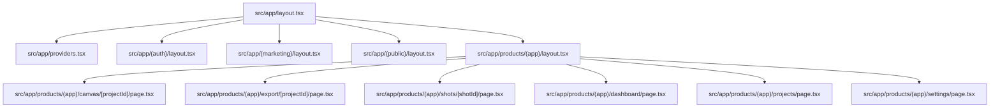
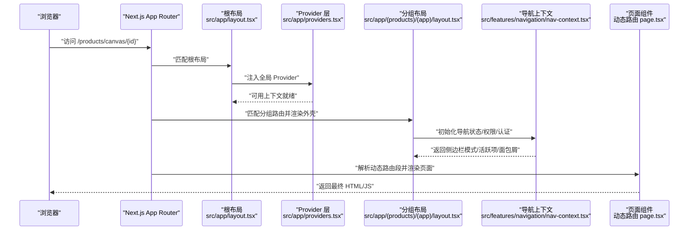
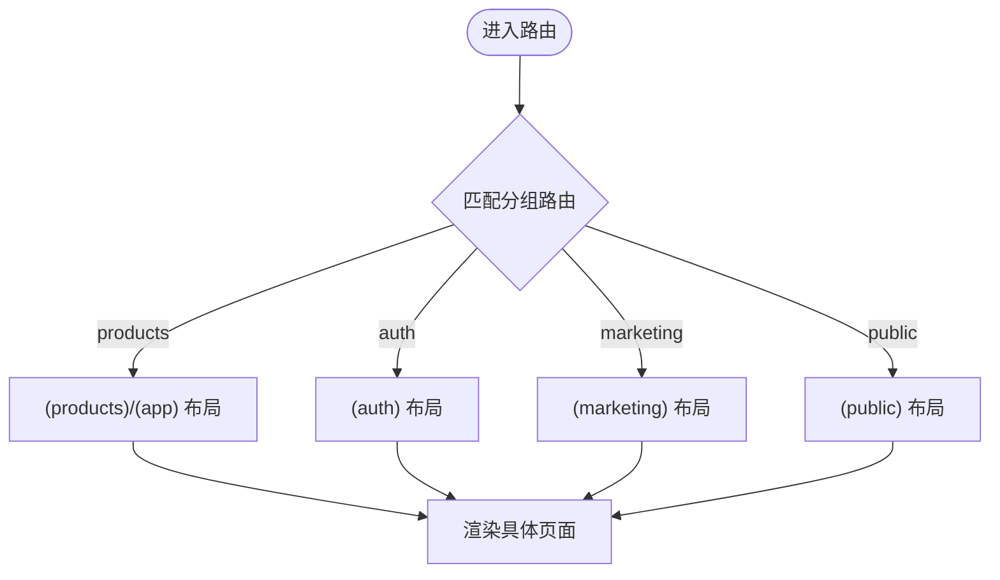
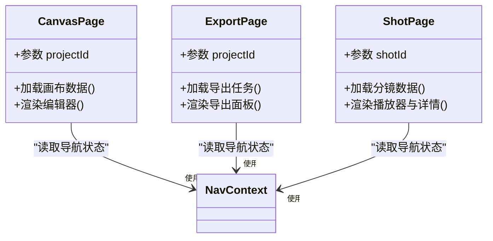
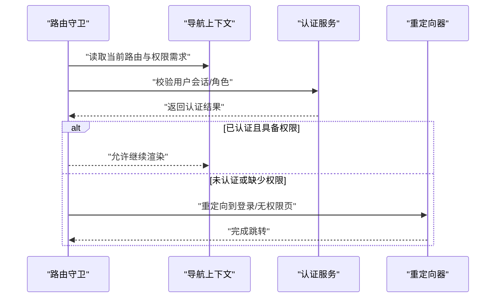
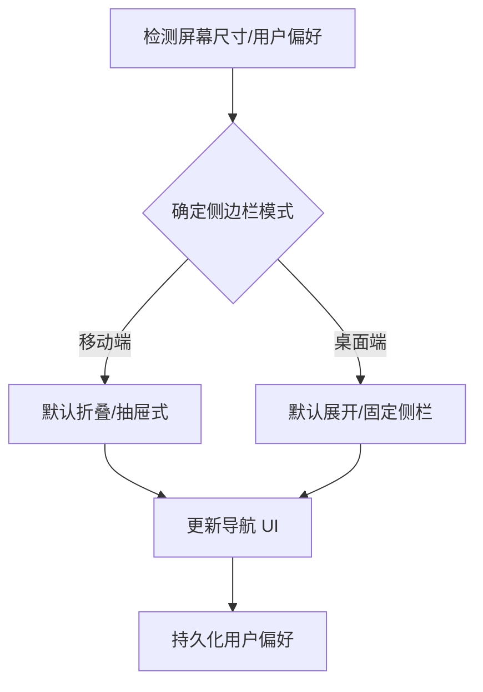
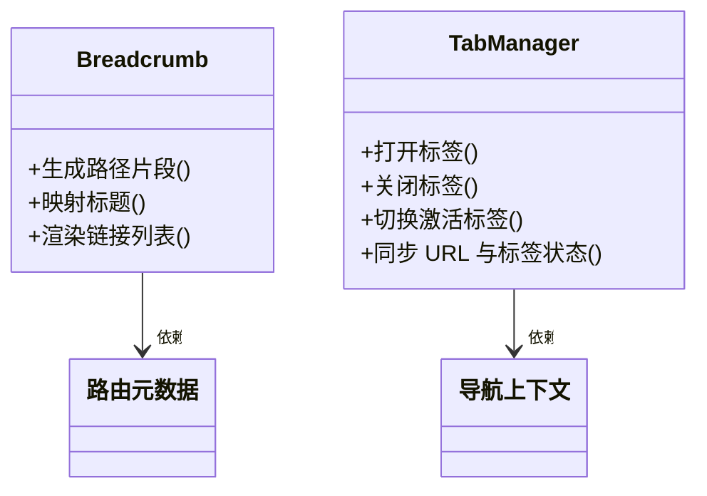
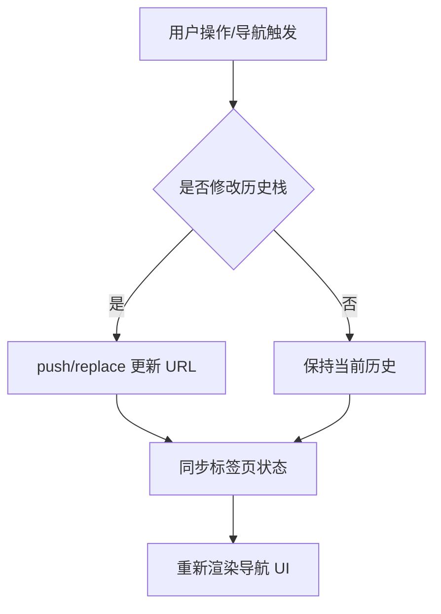
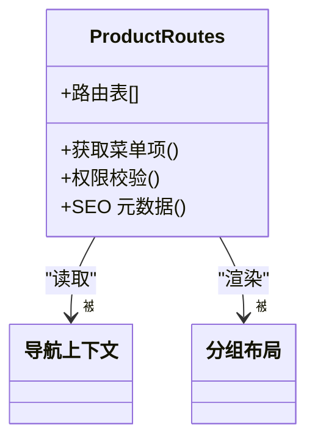
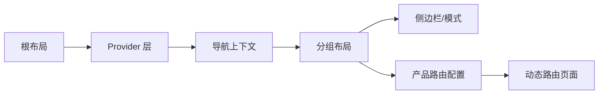

# 路由与导航

<cite>
**本文引用的文件**   
- [src/app/layout.tsx](file://src/app/layout.tsx)
- [src/app/providers.tsx](file://src/app/providers.tsx)
- [src/app/(auth)/layout.tsx](file://src/app/(auth)/layout.tsx)
- [src/app/(marketing)/layout.tsx](file://src/app/(marketing)/layout.tsx)
- [src/app/(public)/layout.tsx](file://src/app/(public)/layout.tsx)
- [src/app/(products)/(app)/layout.tsx](file://src/app/products/(app)/layout.tsx)
- [src/app/(products)/(app)/loading.tsx](file://src/app/products/(app)/loading.tsx)
- [src/app/(products)/(app)/not-found.tsx](file://src/app/products/(app)/not-found.tsx)
- [src/app/(products)/(app)/error.tsx](file://src/app/products/(app)/error.tsx)
- [src/app/(products)/(app)/template.tsx](file://src/app/products/(app)/template.tsx)
- [src/app/(products)/(app)/canvas/[projectId]/page.tsx](file://src/app/products/(app)/canvas/[projectId]/page.tsx)
- [src/app/(products)/(app)/export/[projectId]/page.tsx](file://src/app/products/(app)/export/[projectId]/page.tsx)
- [src/app/(products)/(app)/shots/[shotId]/page.tsx](file://src/app/products/(app)/shots/[shotId]/page.tsx)
- [src/features/navigation/nav-context.tsx](file://src/features/navigation/nav-context.tsx)
- [src/features/navigation/app-shell.tsx](file://src/features/navigation/app-shell.tsx)
- [src/features/navigation/app-sidebar-shell.tsx](file://src/features/navigation/app-sidebar-shell.tsx)
- [src/features/navigation/app-sidebar.tsx](file://src/features/navigation/app-sidebar.tsx)
- [src/features/navigation/products-routes.ts](file://src/features/navigation/products-routes.ts)
- [src/features/navigation/sidebar-mode.ts](file://src/features/navigation/sidebar-mode.ts)
- [src/lib/site-config.ts](file://src/lib/site-config.ts)
- [src/app/sitemap.ts](file://src/app/sitemap.ts)
- [src/app/robots.ts](file://src/app/robots.ts)
- [src/app/global-error.tsx](file://src/app/global-error.tsx)
- [src/app/not-found.tsx](file://src/app/not-found.tsx)
</cite>

## 目录
1. [简介](#简介)
2. [项目结构](#项目结构)
3. [核心组件](#核心组件)
4. [架构总览](#架构总览)
5. [详细组件分析](#详细组件分析)
6. [依赖分析](#依赖分析)
7. [性能考虑](#性能考虑)
8. [故障排查指南](#故障排查指南)
9. [结论](#结论)
10. [附录](#附录)

## 简介
本文件系统化阐述 PurpleInk 基于 Next.js App Router 的路由与导航体系，覆盖分组路由、动态路由、嵌套布局、导航上下文管理（含路由守卫、权限控制与认证流程）、移动端与桌面端响应式导航、面包屑导航、标签页管理与历史记录处理。同时给出路由优化策略、懒加载实现与 SEO 最佳实践，帮助读者从整体到细节全面理解并高效扩展该系统的导航能力。

## 项目结构
PurpleInk 采用 Next.js App Router 的目录即路由约定：
- 顶层布局 src/app/layout.tsx 提供全局外壳与 Provider 注入。
- 功能域通过 (auth)、(marketing)、(public)、(products) 等分组路由隔离不同业务域的外壳与布局。
- 产品应用位于 src/app/products/(app)，内部包含 canvas、export、shots、dashboard、projects、settings 等页面与动态路由段。
- 导航上下文与 UI Shell 集中在 features/navigation 中，统一管理侧边栏、模式切换、路由元数据与面包屑。

图表来源
- [src/app/layout.tsx](file://src/app/layout.tsx)
- [src/app/providers.tsx](file://src/app/providers.tsx)
- [src/app/(auth)/layout.tsx](file://src/app/(auth)/layout.tsx)
- [src/app/(marketing)/layout.tsx](file://src/app/(marketing)/layout.tsx)
- [src/app/(public)/layout.tsx](file://src/app/(public)/layout.tsx)
- [src/app/products/(app)/layout.tsx](file://src/app/products/(app)/layout.tsx)
- [src/app/products/(app)/canvas/[projectId]/page.tsx](file://src/app/products/(app)/canvas/[projectId]/page.tsx)
- [src/app/products/(app)/export/[projectId]/page.tsx](file://src/app/products/(app)/export/[projectId]/page.tsx)
- [src/app/products/(app)/shots/[shotId]/page.tsx](file://src/app/products/(app)/shots/[shotId]/page.tsx)

章节来源
- [src/app/layout.tsx](file://src/app/layout.tsx)
- [src/app/providers.tsx](file://src/app/providers.tsx)
- [src/app/(auth)/layout.tsx](file://src/app/(auth)/layout.tsx)
- [src/app/(marketing)/layout.tsx](file://src/app/(marketing)/layout.tsx)
- [src/app/(public)/layout.tsx](file://src/app/(public)/layout.tsx)
- [src/app/products/(app)/layout.tsx](file://src/app/products/(app)/layout.tsx)

## 核心组件
- 应用外壳与 Provider：在根 layout 中挂载全局样式、主题、国际化与导航上下文，确保所有页面共享一致的导航状态与行为。
- 分组路由布局：(auth)、(marketing)、(public)、(products) 各自定义独立布局，用于承载登录/注册、营销页、公开信息与产品应用的不同外壳。
- 产品应用外壳：(products)/(app) 提供统一的侧边栏、顶部工具栏、错误与加载态、模板化渲染与面包屑生成。
- 导航上下文：集中管理当前路由、活跃项、侧边栏模式、用户权限与认证状态，驱动 UI 与路由守卫逻辑。
- 动态路由：canvas/[projectId]、export/[projectId]、shots/[shotId] 等以路径参数驱动页面渲染与数据加载。

章节来源
- [src/app/layout.tsx](file://src/app/layout.tsx)
- [src/app/providers.tsx](file://src/app/providers.tsx)
- [src/app/(auth)/layout.tsx](file://src/app/(auth)/layout.tsx)
- [src/app/(marketing)/layout.tsx](file://src/app/(marketing)/layout.tsx)
- [src/app/(public)/layout.tsx](file://src/app/(public)/layout.tsx)
- [src/app/products/(app)/layout.tsx](file://src/app/products/(app)/layout.tsx)
- [src/features/navigation/nav-context.tsx](file://src/features/navigation/nav-context.tsx)
- [src/features/navigation/app-shell.tsx](file://src/features/navigation/app-shell.tsx)
- [src/features/navigation/app-sidebar-shell.tsx](file://src/features/navigation/app-sidebar-shell.tsx)
- [src/features/navigation/app-sidebar.tsx](file://src/features/navigation/app-sidebar.tsx)
- [src/app/products/(app)/canvas/[projectId]/page.tsx](file://src/app/products/(app)/canvas/[projectId]/page.tsx)
- [src/app/products/(app)/export/[projectId]/page.tsx](file://src/app/products/(app)/export/[projectId]/page.tsx)
- [src/app/products/(app)/shots/[shotId]/page.tsx](file://src/app/products/(app)/shots/[shotId]/page.tsx)

## 架构总览
下图展示了从浏览器请求到页面渲染的关键路径，包括分组路由选择、应用外壳装配、导航上下文初始化与动态路由解析。

图表来源
- [src/app/layout.tsx](file://src/app/layout.tsx)
- [src/app/providers.tsx](file://src/app/providers.tsx)
- [src/app/products/(app)/layout.tsx](file://src/app/products/(app)/layout.tsx)
- [src/features/navigation/nav-context.tsx](file://src/features/navigation/nav-context.tsx)
- [src/app/products/(app)/canvas/[projectId]/page.tsx](file://src/app/products/(app)/canvas/[projectId]/page.tsx)

## 详细组件分析

### 分组路由与嵌套布局
- 分组路由 (auth)、(marketing)、(public)、(products) 将不同业务域的外壳与布局解耦，便于独立维护与权限控制。
- 每个分组内的 layout.tsx 负责渲染该域的通用 UI 与导航容器，子页面仅关注内容。
- 产品应用 (products)/(app) 进一步封装了侧边栏、顶部栏、错误与加载态、模板化渲染与面包屑。

图表来源
- [src/app/(auth)/layout.tsx](file://src/app/(auth)/layout.tsx)
- [src/app/(marketing)/layout.tsx](file://src/app/(marketing)/layout.tsx)
- [src/app/(public)/layout.tsx](file://src/app/(public)/layout.tsx)
- [src/app/products/(app)/layout.tsx](file://src/app/products/(app)/layout.tsx)

章节来源
- [src/app/(auth)/layout.tsx](file://src/app/(auth)/layout.tsx)
- [src/app/(marketing)/layout.tsx](file://src/app/(marketing)/layout.tsx)
- [src/app/(public)/layout.tsx](file://src/app/(public)/layout.tsx)
- [src/app/products/(app)/layout.tsx](file://src/app/products/(app)/layout.tsx)

### 动态路由与参数处理
- 动态路由段如 [projectId]、[shotId] 用于标识资源实例，页面根据参数加载对应数据与渲染视图。
- 建议在页面组件内对参数进行校验与默认值处理，避免空值导致的渲染异常。
- 结合 loading.tsx 与 not-found.tsx 提升用户体验与可发现性。

图表来源
- [src/app/products/(app)/canvas/[projectId]/page.tsx](file://src/app/products/(app)/canvas/[projectId]/page.tsx)
- [src/app/products/(app)/export/[projectId]/page.tsx](file://src/app/products/(app)/export/[projectId]/page.tsx)
- [src/app/products/(app)/shots/[shotId]/page.tsx](file://src/app/products/(app)/shots/[shotId]/page.tsx)
- [src/features/navigation/nav-context.tsx](file://src/features/navigation/nav-context.tsx)

章节来源
- [src/app/products/(app)/canvas/[projectId]/page.tsx](file://src/app/products/(app)/canvas/[projectId]/page.tsx)
- [src/app/products/(app)/export/[projectId]/page.tsx](file://src/app/products/(app)/export/[projectId]/page.tsx)
- [src/app/products/(app)/shots/[shotId]/page.tsx](file://src/app/products/(app)/shots/[shotId]/page.tsx)

### 导航上下文与路由守卫
- 导航上下文集中管理当前路由、活跃项、侧边栏模式、用户权限与认证状态，为 UI 与路由守卫提供统一数据源。
- 路由守卫可在分组布局或页面入口处检查认证与权限，未授权时重定向至登录或无权限页。
- 建议将权限判断与认证流程抽象为可复用的守卫函数，并在不同分组路由中按需组合。

图表来源
- [src/features/navigation/nav-context.tsx](file://src/features/navigation/nav-context.tsx)
- [src/app/(auth)/layout.tsx](file://src/app/(auth)/layout.tsx)
- [src/app/products/(app)/layout.tsx](file://src/app/products/(app)/layout.tsx)

章节来源
- [src/features/navigation/nav-context.tsx](file://src/features/navigation/nav-context.tsx)
- [src/app/(auth)/layout.tsx](file://src/app/(auth)/layout.tsx)
- [src/app/products/(app)/layout.tsx](file://src/app/products/(app)/layout.tsx)

### 移动端与桌面端的响应式导航
- 侧边栏在不同屏幕尺寸下自动切换显示模式（折叠/展开），保证移动端友好交互。
- app-sidebar-shell 与 app-sidebar 协同工作，根据设备宽度与用户偏好调整布局与行为。
- 建议在导航上下文中暴露“侧边栏模式”状态，供 UI 组件订阅并响应变化。

图表来源
- [src/features/navigation/app-sidebar-shell.tsx](file://src/features/navigation/app-sidebar-shell.tsx)
- [src/features/navigation/app-sidebar.tsx](file://src/features/navigation/app-sidebar.tsx)
- [src/features/navigation/sidebar-mode.ts](file://src/features/navigation/sidebar-mode.ts)

章节来源
- [src/features/navigation/app-sidebar-shell.tsx](file://src/features/navigation/app-sidebar-shell.tsx)
- [src/features/navigation/app-sidebar.tsx](file://src/features/navigation/app-sidebar.tsx)
- [src/features/navigation/sidebar-mode.ts](file://src/features/navigation/sidebar-mode.ts)

### 面包屑导航与标签页管理
- 面包屑基于当前路由层级自动生成，支持自定义标题与链接映射，提升用户定位能力。
- 标签页管理可通过导航上下文维护打开的标签集合与激活状态，支持新增、关闭与顺序调整。
- 建议在 products 应用中使用 template.tsx 或 layout.tsx 统一注入面包屑与标签页容器。

图表来源
- [src/app/products/(app)/template.tsx](file://src/app/products/(app)/template.tsx)
- [src/features/navigation/nav-context.tsx](file://src/features/navigation/nav-context.tsx)

章节来源
- [src/app/products/(app)/template.tsx](file://src/app/products/(app)/template.tsx)
- [src/features/navigation/nav-context.tsx](file://src/features/navigation/nav-context.tsx)

### 历史记录处理
- 利用浏览器 History API 与 Next.js 客户端导航，实现前进/后退与 URL 同步。
- 在复杂应用中，建议将历史栈与标签页状态解耦，避免相互干扰。
- 对于需要精确控制的场景，可在导航上下文中封装 push/replace/go 等方法，统一入口。

图表来源
- [src/features/navigation/nav-context.tsx](file://src/features/navigation/nav-context.tsx)

章节来源
- [src/features/navigation/nav-context.tsx](file://src/features/navigation/nav-context.tsx)

### 产品路由配置与元数据
- products-routes.ts 集中定义产品模块的路由表、菜单项与权限标记，便于统一维护与扩展。
- 建议为每个路由段补充 SEO 元数据（标题、描述、图标）与导航元数据（面包屑、标签页）。

图表来源
- [src/features/navigation/products-routes.ts](file://src/features/navigation/products-routes.ts)
- [src/app/products/(app)/layout.tsx](file://src/app/products/(app)/layout.tsx)

章节来源
- [src/features/navigation/products-routes.ts](file://src/features/navigation/products-routes.ts)
- [src/app/products/(app)/layout.tsx](file://src/app/products/(app)/layout.tsx)

## 依赖分析
- 根布局依赖 providers 层注入全局上下文（主题、导航、国际化等）。
- 分组布局依赖导航上下文与产品路由配置，决定外壳与导航行为。
- 动态路由页面依赖导航上下文与产品路由元数据，驱动页面内容与交互。
- 侧边栏与模式切换依赖设备检测与用户偏好，影响导航 UI 呈现。

图表来源
- [src/app/layout.tsx](file://src/app/layout.tsx)
- [src/app/providers.tsx](file://src/app/providers.tsx)
- [src/features/navigation/nav-context.tsx](file://src/features/navigation/nav-context.tsx)
- [src/app/products/(app)/layout.tsx](file://src/app/products/(app)/layout.tsx)
- [src/features/navigation/products-routes.ts](file://src/features/navigation/products-routes.ts)

章节来源
- [src/app/layout.tsx](file://src/app/layout.tsx)
- [src/app/providers.tsx](file://src/app/providers.tsx)
- [src/features/navigation/nav-context.tsx](file://src/features/navigation/nav-context.tsx)
- [src/app/products/(app)/layout.tsx](file://src/app/products/(app)/layout.tsx)
- [src/features/navigation/products-routes.ts](file://src/features/navigation/products-routes.ts)

## 性能考虑
- 路由级代码分割：利用 Next.js 的自动代码分割与 Suspense，减少首屏体积。
- 懒加载大组件：对编辑器、播放器、导出面板等重型组件实施按需加载。
- 预取与缓存：对常用路由进行预取与数据缓存，提升二次访问速度。
- SEO 优化：在 sitemap.ts 与 robots.ts 中声明可抓取页面，配合 metadata 提升搜索引擎可见性。

章节来源
- [src/app/sitemap.ts](file://src/app/sitemap.ts)
- [src/app/robots.ts](file://src/app/robots.ts)

## 故障排查指南
- 全局错误处理：global-error.tsx 捕获未处理的渲染错误，提供降级 UI 与上报。
- 未找到页面：not-found.tsx 与分组中的 not-found.tsx 处理无效路由，引导用户回到有效路径。
- 加载态与错误态：loading.tsx 与 error.tsx 在分组布局中统一展示，避免闪烁与空白。

章节来源
- [src/app/global-error.tsx](file://src/app/global-error.tsx)
- [src/app/not-found.tsx](file://src/app/not-found.tsx)
- [src/app/products/(app)/loading.tsx](file://src/app/products/(app)/loading.tsx)
- [src/app/products/(app)/not-found.tsx](file://src/app/products/(app)/not-found.tsx)
- [src/app/products/(app)/error.tsx](file://src/app/products/(app)/error.tsx)

## 结论
PurpleInk 的路由与导航系统以 Next.js App Router 为核心，通过分组路由与嵌套布局实现清晰的领域边界，借助导航上下文统一管理状态与权限，支撑复杂的动态路由与响应式交互。结合面包屑、标签页与历史记录管理，提供了良好的用户体验；通过代码分割、懒加载与 SEO 配置，兼顾性能与可发现性。建议在此基础上持续完善路由守卫与权限模型，进一步提升安全性与可维护性。

## 附录
- 站点配置：site-config.ts 可用于集中管理站点元数据与导航常量。
- 设计系统：通过 providers.tsx 注入主题与设计系统，确保导航 UI 一致性。

章节来源
- [src/lib/site-config.ts](file://src/lib/site-config.ts)
- [src/app/providers.tsx](file://src/app/providers.tsx)