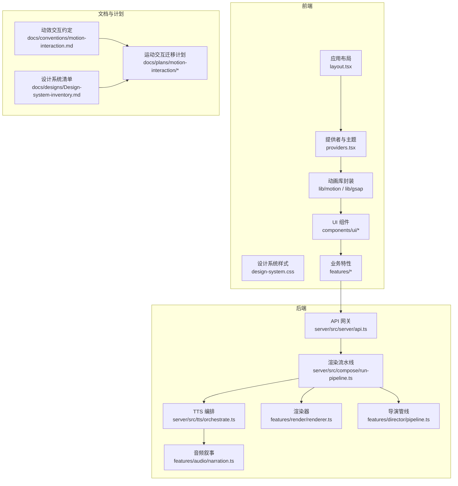
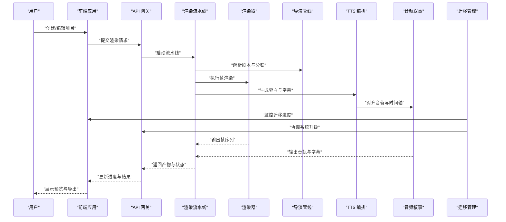
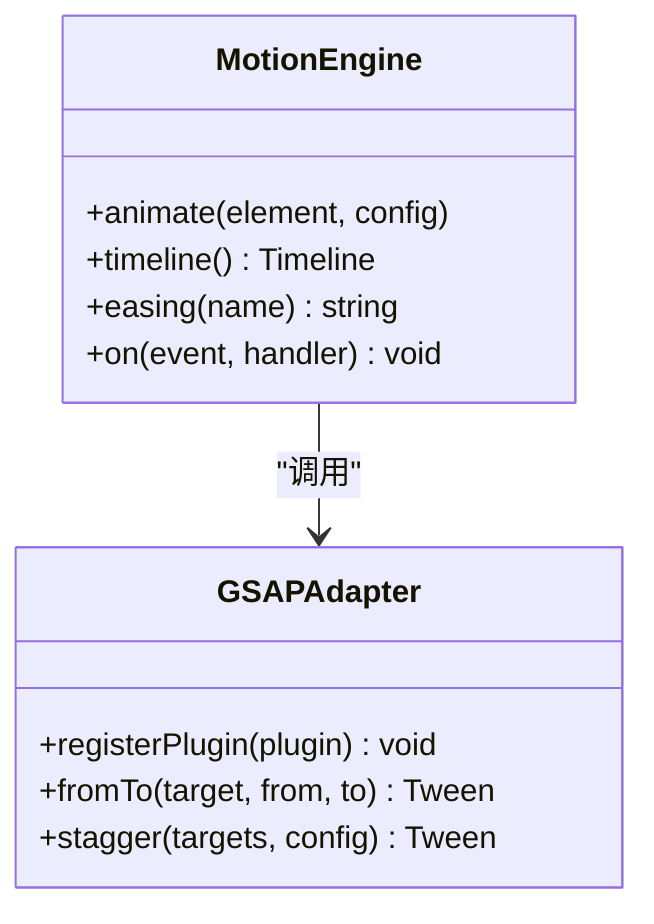
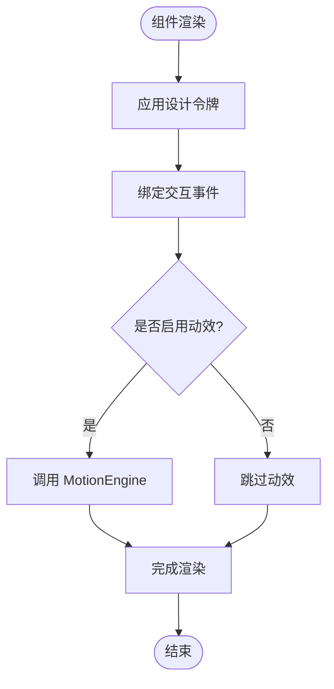
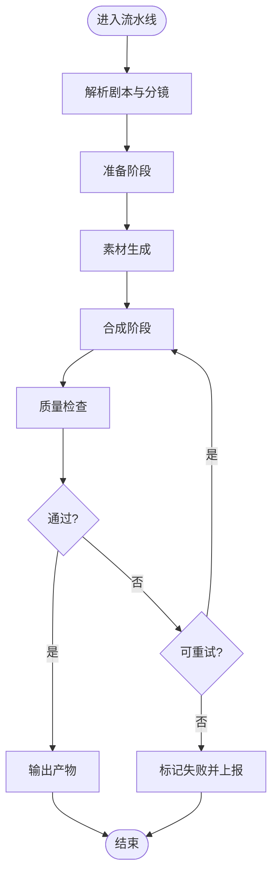
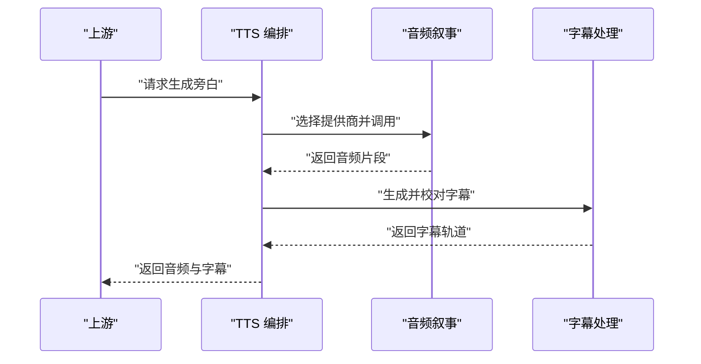
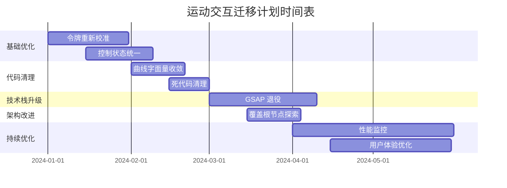
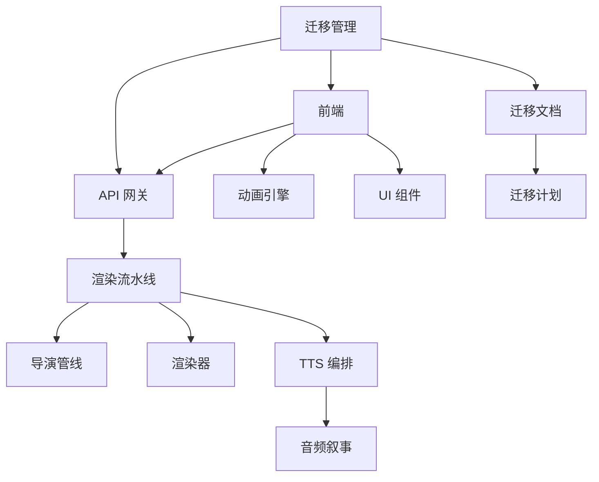

# 运动设计系统

<cite>
**本文档引用的文件**   
- [package.json](file://package.json)
- [next.config.ts](file://next.config.ts)
- [tsconfig.json](file://tsconfig.json)
- [src/app/layout.tsx](file://src/app/layout.tsx)
- [src/app/providers.tsx](file://src/app/providers.tsx)
- [src/app/design-system.css](file://src/app/design-system.css)
- [src/lib/motion/index.ts](file://src/lib/motion/index.ts)
- [src/lib/gsap/index.ts](file://src/lib/gsap/index.ts)
- [src/components/ui/button.tsx](file://src/components/ui/button.tsx)
- [src/components/ui/card.tsx](file://src/components/ui/card.tsx)
- [src/features/canvas/types.ts](file://src/features/canvas/types.ts)
- [src/features/director/pipeline.ts](file://src/features/director/pipeline.ts)
- [src/features/render/renderer.ts](file://src/features/render/renderer.ts)
- [src/features/audio/narration.ts](file://src/features/audio/narration.ts)
- [server/src/compose/run-pipeline.ts](file://server/src/compose/run-pipeline.ts)
- [server/src/server/api.ts](file://server/src/server/api.ts)
- [server/src/tts/orchestrate.ts](file://server/src/tts/orchestrate.ts)
- [docs/conventions/motion-interaction.md](file://docs/conventions/motion-interaction.md)
- [docs/designs/Design-system-inventory.md](file://docs/designs/Design-system-inventory.md)
- [docs/plans/motion-interaction/00-README.md](file://docs/plans/motion-interaction/00-README.md)
- [docs/plans/motion-interaction/01-token-recalibration.md](file://docs/plans/motion-interaction/01-token-recalibration.md)
- [docs/plans/motion-interaction/03-control-state-unification.md](file://docs/plans/motion-interaction/03-control-state统一.md)
- [docs/plans/motion-interaction/04-curve-literal-convergence.md](file://docs/plans/motion-interaction/04-curve-literal-convergence.md)
- [docs/plans/motion-interaction/05-dead-code-cleanup.md](file://docs/plans/motion-interaction/05-dead-code-cleanup.md)
- [docs/plans/motion-interaction/06-gsap-retirement.md](file://docs/plans/motion-interaction/06-gsap-retirement.md)
- [docs/plans/motion-interaction/08-overlay-root-spike.md](file://docs/plans/motion-interaction/08-overlay-root-spike.md)
</cite>

## 更新摘要
**所做更改**   
- 添加了完整的运动交互迁移计划文档章节，包含九个可执行批次的详细规划
- 更新了项目结构部分以反映新的迁移计划文档组织
- 新增了迁移路线图和批次执行策略的详细说明
- 增强了依赖关系分析以包含迁移相关的组件

## 目录
1. [简介](#简介)
2. [项目结构](#项目结构)
3. [核心组件](#核心组件)
4. [架构总览](#架构总览)
5. [详细组件分析](#详细组件分析)
6. [运动交互迁移计划](#运动交互迁移计划)
7. [依赖关系分析](#依赖关系分析)
8. [性能考量](#性能考量)
9. [故障排查指南](#故障排查指南)
10. [结论](#结论)
11. [附录](#附录)

## 简介
本文件面向"运动设计系统"的文档目标，围绕前端动画与交互、渲染管线、音频叙事以及服务端编排等关键领域进行系统化说明。内容涵盖系统架构、组件关系、数据流、处理逻辑、集成点与错误处理，并提供可视化图示与可操作的排障建议，帮助读者快速理解并高效使用该系统。

**新增** 本版本特别强调了运动交互系统的迁移计划和实施策略，为系统的渐进式改进提供了清晰的路线图。

## 项目结构
本项目采用前后端分离的组织方式：
- 前端（Next.js）负责页面、组件、动画库封装、状态与路由；
- 后端（Node/TS）提供 API、渲染流水线、TTS 编排与媒体处理；
- 文档与约定位于 docs 目录，指导设计与实现规范；
- 脚本与部署配置位于 scripts 与 deploy 目录；
- **新增** 运动交互迁移计划位于 docs/plans/motion-interaction/ 目录，包含九个可执行的迁移批次。

**图表来源**
- [src/app/layout.tsx](file://src/app/layout.tsx)
- [src/app/providers.tsx](file://src/app/providers.tsx)
- [src/app/design-system.css](file://src/app/design-system.css)
- [src/lib/motion/index.ts](file://src/lib/motion/index.ts)
- [src/lib/gsap/index.ts](file://src/lib/gsap/index.ts)
- [src/components/ui/button.tsx](file://src/components/ui/button.tsx)
- [src/components/ui/card.tsx](file://src/components/ui/card.tsx)
- [server/src/server/api.ts](file://server/src/server/api.ts)
- [server/src/compose/run-pipeline.ts](file://server/src/compose/run-pipeline.ts)
- [server/src/tts/orchestrate.ts](file://server/src/tts/orchestrate.ts)
- [src/features/render/renderer.ts](file://src/features/render/renderer.ts)
- [src/features/director/pipeline.ts](file://src/features/director/pipeline.ts)
- [src/features/audio/narration.ts](file://src/features/audio/narration.ts)
- [docs/conventions/motion-interaction.md](file://docs/conventions/motion-interaction.md)
- [docs/designs/Design-system-inventory.md](file://docs/designs/Design-system-inventory.md)
- [docs/plans/motion-interaction/00-README.md](file://docs/plans/motion-interaction/00-README.md)

**章节来源**
- [package.json](file://package.json)
- [next.config.ts](file://next.config.ts)
- [tsconfig.json](file://tsconfig.json)

## 核心组件
- 动画与交互层：封装 GSAP 与自定义 motion 能力，统一缓动、时序与事件绑定，确保跨组件一致的动效体验。
- UI 组件层：按钮、卡片等基础组件内置微动效与无障碍支持，遵循设计系统约束。
- 渲染与导演层：将剧本、分镜与素材组装为可渲染序列，驱动帧捕获与合成。
- 音频叙事层：文本转语音、字幕生成与音轨对齐，保证音视频同步。
- 服务编排层：API 网关接收请求，调度渲染与 TTS 任务，管理队列与状态。
- **新增** 迁移管理层：协调各个迁移批次的执行，确保系统演进的有序性和稳定性。

**章节来源**
- [src/lib/motion/index.ts](file://src/lib/motion/index.ts)
- [src/lib/gsap/index.ts](file://src/lib/gsap/index.ts)
- [src/components/ui/button.tsx](file://src/components/ui/button.tsx)
- [src/components/ui/card.tsx](file://src/components/ui/card.tsx)
- [src/features/director/pipeline.ts](file://src/features/director/pipeline.ts)
- [src/features/render/renderer.ts](file://src/features/render/renderer.ts)
- [src/features/audio/narration.ts](file://src/features/audio/narration.ts)
- [server/src/server/api.ts](file://server/src/server/api.ts)
- [server/src/compose/run-pipeline.ts](file://server/src/compose/run-pipeline.ts)
- [server/src/tts/orchestrate.ts](file://server/src/tts/orchestrate.ts)

## 架构总览
系统以"导演-渲染-音频"为主线，结合前端动画与 UI 组件，形成端到端的创作与输出流程。

**图表来源**
- [server/src/server/api.ts](file://server/src/server/api.ts)
- [server/src/compose/run-pipeline.ts](file://server/src/compose/run-pipeline.ts)
- [src/features/director/pipeline.ts](file://src/features/director/pipeline.ts)
- [src/features/render/renderer.ts](file://src/features/render/renderer.ts)
- [server/src/tts/orchestrate.ts](file://server/src/tts/orchestrate.ts)
- [src/features/audio/narration.ts](file://src/features/audio/narration.ts)
- [docs/plans/motion-interaction/00-README.md](file://docs/plans/motion-interaction/00-README.md)

## 详细组件分析

### 动画与交互层
- 职责：统一封装 GSAP 与 motion 工具，提供声明式动画接口、缓动曲线、时序控制与事件回调。
- 关键点：
  - 动画生命周期管理，避免内存泄漏与重复触发；
  - 与 UI 组件解耦，通过 props 注入动效参数；
  - 响应式适配，根据设备与性能降级策略调整复杂度。

**图表来源**
- [src/lib/motion/index.ts](file://src/lib/motion/index.ts)
- [src/lib/gsap/index.ts](file://src/lib/gsap/index.ts)

**章节来源**
- [src/lib/motion/index.ts](file://src/lib/motion/index.ts)
- [src/lib/gsap/index.ts](file://src/lib/gsap/index.ts)

### UI 组件层
- 职责：提供可复用的基础控件，内置微动效、键盘导航与屏幕阅读器支持。
- 关键点：
  - 按钮与卡片等组件遵循设计令牌（颜色、间距、圆角）；
  - 动效作为可选增强，不影响功能可用性；
  - 测试覆盖交互边界与可访问性场景。

**图表来源**
- [src/components/ui/button.tsx](file://src/components/ui/button.tsx)
- [src/components/ui/card.tsx](file://src/components/ui/card.tsx)
- [src/lib/motion/index.ts](file://src/lib/motion/index.ts)

**章节来源**
- [src/components/ui/button.tsx](file://src/components/ui/button.tsx)
- [src/components/ui/card.tsx](file://src/components/ui/card.tsx)

### 导演与渲染管线
- 职责：将剧本、分镜与素材组织为可执行的渲染任务，协调帧捕获与合成。
- 关键点：
  - 阶段化执行（准备、生成、合成、校验）；
  - 失败重试与回退策略；
  - 资源管理与缓存命中优化。

**图表来源**
- [src/features/director/pipeline.ts](file://src/features/director/pipeline.ts)
- [src/features/render/renderer.ts](file://src/features/render/renderer.ts)
- [server/src/compose/run-pipeline.ts](file://server/src/compose/run-pipeline.ts)

**章节来源**
- [src/features/director/pipeline.ts](file://src/features/director/pipeline.ts)
- [src/features/render/renderer.ts](file://src/features/render/renderer.ts)
- [server/src/compose/run-pipeline.ts](file://server/src/compose/run-pipeline.ts)

### 音频叙事与字幕
- 职责：将文本转换为语音，生成字幕并与时间轴对齐，确保音画同步。
- 关键点：
  - 多提供商适配与容错切换；
  - 字幕格式转换与校验；
  - 音频切片与拼接策略。

**图表来源**
- [server/src/tts/orchestrate.ts](file://server/src/tts/orchestrate.ts)
- [src/features/audio/narration.ts](file://src/features/audio/narration.ts)

**章节来源**
- [server/src/tts/orchestrate.ts](file://server/src/tts/orchestrate.ts)
- [src/features/audio/narration.ts](file://src/features/audio/narration.ts)

### 概念总览
以下流程图展示了从创意到产物的端到端路径，强调各阶段的输入输出与协作关系。

[本图为概念性流程，不直接映射具体源码文件]

## 运动交互迁移计划

### 迁移概述
运动交互迁移计划是一个系统性的演进方案，旨在逐步改进和优化现有的动画与交互系统。该计划包含九个可执行的迁移批次，每个批次都有明确的目标、范围和验收标准。

### 迁移批次概览

**图表来源**
- [docs/plans/motion-interaction/00-README.md](file://docs/plans/motion-interaction/00-README.md)

### 详细迁移批次

#### 批次一：令牌重新校准
- **目标**：统一和标准化动画令牌系统
- **范围**：颜色、间距、圆角、阴影等设计令牌
- **交付物**：标准化的令牌定义和使用规范

#### 批次二：控制状态统一
- **目标**：统一动画控制器的状态管理
- **范围**：动画生命周期、状态同步、错误处理
- **交付物**：统一的控制器接口和状态管理方案

#### 批次三：曲线字面量收敛
- **目标**：简化动画曲线定义
- **范围**：贝塞尔曲线、缓动函数的标准化
- **交付物**：简化的曲线配置和默认值体系

#### 批次四：死代码清理
- **目标**：移除未使用的动画代码和依赖
- **范围**：废弃的动画函数、未引用的组件
- **交付物**：精简的代码库和更新的依赖关系

#### 批次五：GSAP 退役
- **目标**：逐步替换 GSAP 动画库
- **范围**：动画引擎迁移、兼容性处理
- **交付物**：原生动画实现和过渡策略

#### 批次六：覆盖根节点探索
- **目标**：优化覆盖层的渲染架构
- **范围**：模态框、提示框、悬浮层等覆盖组件
- **交付物**：高效的覆盖层管理系统

#### 批次七至九：持续优化
- **目标**：性能监控、用户体验优化、文档完善
- **范围**：监控系统、用户反馈收集、最佳实践文档
- **交付物**：完整的监控体系和优化指南

**章节来源**
- [docs/plans/motion-interaction/00-README.md](file://docs/plans/motion-interaction/00-README.md)
- [docs/plans/motion-interaction/01-token-recalibration.md](file://docs/plans/motion-interaction/01-token-recalibration.md)
- [docs/plans/motion-interaction/03-control-state-unification.md](file://docs/plans/motion-interaction/03-control-state-unification.md)
- [docs/plans/motion-interaction/04-curve-literal-convergence.md](file://docs/plans/motion-interaction/04-curve-literal-convergence.md)
- [docs/plans/motion-interaction/05-dead-code-cleanup.md](file://docs/plans/motion-interaction/05-dead-code-cleanup.md)
- [docs/plans/motion-interaction/06-gsap-retirement.md](file://docs/plans/motion-interaction/06-gsap-retirement.md)
- [docs/plans/motion-interaction/08-overlay-root-spike.md](file://docs/plans/motion-interaction/08-overlay-root-spike.md)

## 依赖关系分析
- 前端依赖动画库与 UI 组件，通过 providers 注入全局上下文；
- 后端 API 作为入口，调度渲染与 TTS 子任务；
- 导演与渲染模块强耦合于素材与分镜数据结构；
- 音频叙事与字幕处理依赖外部 TTS 提供商与格式化工具；
- **新增** 迁移计划依赖现有系统状态，需要向后兼容和渐进式升级策略。

**图表来源**
- [src/app/layout.tsx](file://src/app/layout.tsx)
- [src/app/providers.tsx](file://src/app/providers.tsx)
- [src/lib/motion/index.ts](file://src/lib/motion/index.ts)
- [src/components/ui/button.tsx](file://src/components/ui/button.tsx)
- [server/src/server/api.ts](file://server/src/server/api.ts)
- [server/src/compose/run-pipeline.ts](file://server/src/compose/run-pipeline.ts)
- [src/features/director/pipeline.ts](file://src/features/director/pipeline.ts)
- [src/features/render/renderer.ts](file://src/features/render/renderer.ts)
- [server/src/tts/orchestrate.ts](file://server/src/tts/orchestrate.ts)
- [src/features/audio/narration.ts](file://src/features/audio/narration.ts)
- [docs/plans/motion-interaction/00-README.md](file://docs/plans/motion-interaction/00-README.md)

**章节来源**
- [src/app/layout.tsx](file://src/app/layout.tsx)
- [src/app/providers.tsx](file://src/app/providers.tsx)
- [src/lib/motion/index.ts](file://src/lib/motion/index.ts)
- [src/components/ui/button.tsx](file://src/components/ui/button.tsx)
- [server/src/server/api.ts](file://server/src/server/api.ts)
- [server/src/compose/run-pipeline.ts](file://server/src/compose/run-pipeline.ts)
- [src/features/director/pipeline.ts](file://src/features/director/pipeline.ts)
- [src/features/render/renderer.ts](file://src/features/render/renderer.ts)
- [server/src/tts/orchestrate.ts](file://server/src/tts/orchestrate.ts)
- [src/features/audio/narration.ts](file://src/features/audio/narration.ts)

## 性能考量
- 动画性能：限制同时运行的动画数量，按需加载 GSAP 插件，使用 requestAnimationFrame 与节流策略；
- 渲染性能：并行处理独立阶段，利用缓存减少重复计算，分块渲染大场景；
- 音频处理：流式生成与缓冲，避免一次性加载大文件；
- 网络与存储：压缩传输，合理设置 CDN 与缓存策略；
- **新增** 迁移性能：渐进式升级，零停机部署，性能监控和回滚机制。

[本节为通用指导，无需特定文件引用]

## 故障排查指南
- 常见问题：
  - 动画卡顿或内存泄漏：检查动画清理与事件监听释放；
  - 渲染失败：查看流水线日志与阶段状态，确认素材完整性；
  - TTS 超时或失败：切换提供商或降级策略，核对凭证与配额；
  - 音画不同步：校准时间轴与采样率，检查字幕偏移；
  - **新增** 迁移问题：检查迁移状态、依赖冲突、兼容性验证。
- 定位方法：
  - 启用调试日志与追踪 ID；
  - 使用最小用例复现问题；
  - 分段隔离验证（前端/后端/第三方）；
  - **新增** 迁移回滚：保存迁移前状态，支持快速回滚。

**章节来源**
- [docs/conventions/motion-interaction.md](file://docs/conventions/motion-interaction.md)
- [docs/designs/Design-system-inventory.md](file://docs/designs/Design-system-inventory.md)
- [docs/plans/motion-interaction/00-README.md](file://docs/plans/motion-interaction/00-README.md)

## 结论
本系统通过统一的动画与交互层、稳健的渲染与导演管线、可靠的音频叙事与服务编排，构建了完整的运动设计工作流。**新增** 的运动交互迁移计划为系统的持续演进提供了明确的路线图和执行策略。建议在开发中严格遵循约定与最佳实践，按照迁移计划逐步推进系统优化，持续提升性能与稳定性，改善用户体验与交付效率。

[本节为总结性内容，无需特定文件引用]

## 附录
- 设计系统与约定参考：
  - 动效交互约定：[docs/conventions/motion-interaction.md](file://docs/conventions/motion-interaction.md)
  - 设计系统清单：[docs/designs/Design-system-inventory.md](file://docs/designs/Design-system-inventory.md)
- 类型与契约：
  - 画布类型定义：[src/features/canvas/types.ts](file://src/features/canvas/types.ts)
- **新增** 迁移计划文档：
  - 迁移计划概览：[docs/plans/motion-interaction/00-README.md](file://docs/plans/motion-interaction/00-README.md)
  - 令牌重新校准：[docs/plans/motion-interaction/01-token-recalibration.md](file://docs/plans/motion-interaction/01-token-recalibration.md)
  - 控制状态统一：[docs/plans/motion-interaction/03-control-state-unification.md](file://docs/plans/motion-interaction/03-control-state-unification.md)
  - 曲线字面量收敛：[docs/plans/motion-interaction/04-curve-literal-convergence.md](file://docs/plans/motion-interaction/04-curve-literal-convergence.md)
  - 死代码清理：[docs/plans/motion-interaction/05-dead-code-cleanup.md](file://docs/plans/motion-interaction/05-dead-code-cleanup.md)
  - GSAP 退役：[docs/plans/motion-interaction/06-gsap-retirement.md](file://docs/plans/motion-interaction/06-gsap-retirement.md)
  - 覆盖根节点探索：[docs/plans/motion-interaction/08-overlay-root-spike.md](file://docs/plans/motion-interaction/08-overlay-root-spike.md)

**章节来源**
- [docs/conventions/motion-interaction.md](file://docs/conventions/motion-interaction.md)
- [docs/designs/Design-system-inventory.md](file://docs/designs/Design-system-inventory.md)
- [src/features/canvas/types.ts](file://src/features/canvas/types.ts)
- [docs/plans/motion-interaction/00-README.md](file://docs/plans/motion-interaction/00-README.md)
- [docs/plans/motion-interaction/01-token-recalibration.md](file://docs/plans/motion-interaction/01-token-recalibration.md)
- [docs/plans/motion-interaction/03-control-state-unification.md](file://docs/plans/motion-interaction/03-control-state-unification.md)
- [docs/plans/motion-interaction/04-curve-literal-convergence.md](file://docs/plans/motion-interaction/04-curve-literal-convergence.md)
- [docs/plans/motion-interaction/05-dead-code-cleanup.md](file://docs/plans/motion-interaction/05-dead-code-cleanup.md)
- [docs/plans/motion-interaction/06-gsap-retirement.md](file://docs/plans/motion-interaction/06-gsap-retirement.md)
- [docs/plans/motion-interaction/08-overlay-root-spike.md](file://docs/plans/motion-interaction/08-overlay-root-spike.md)