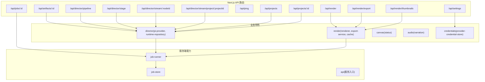
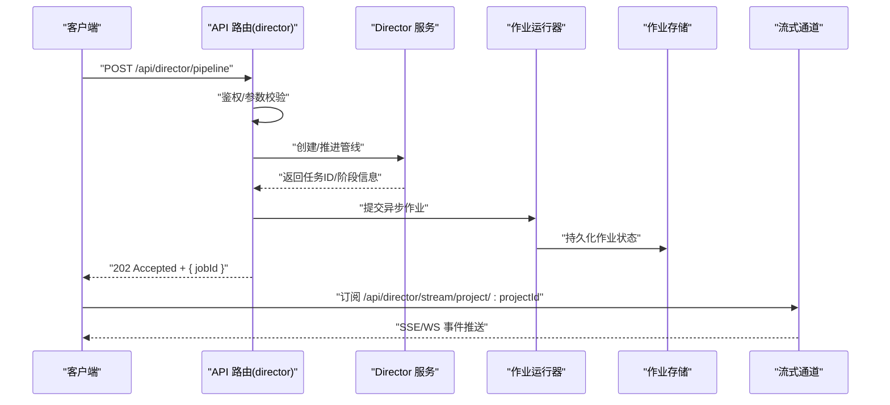
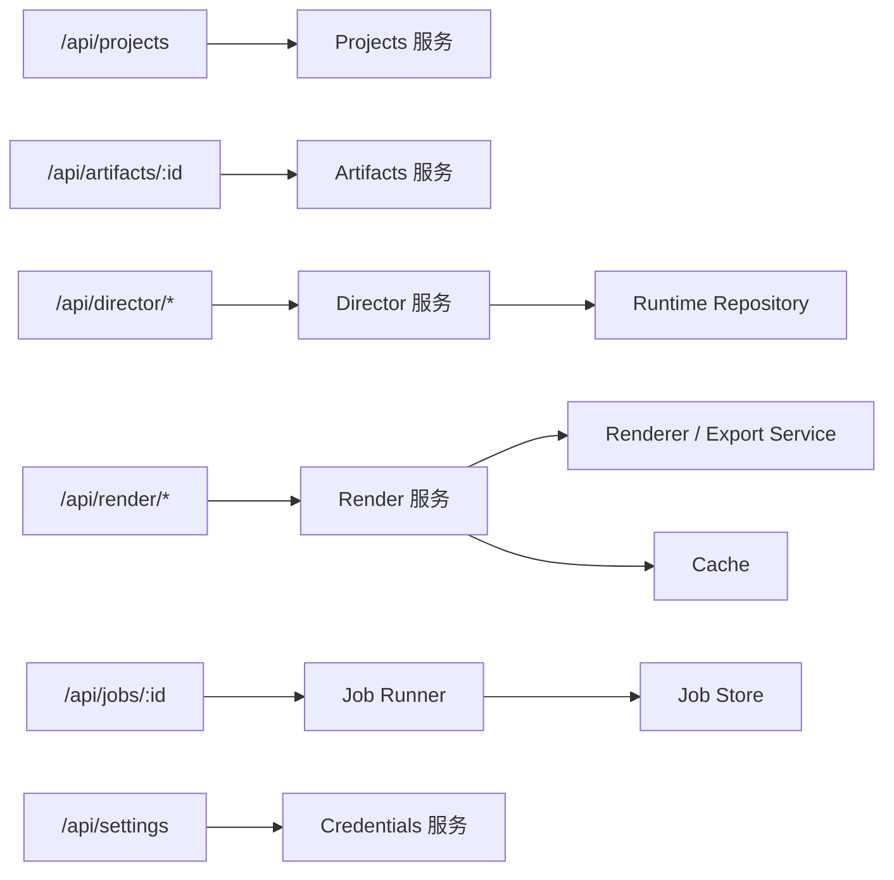
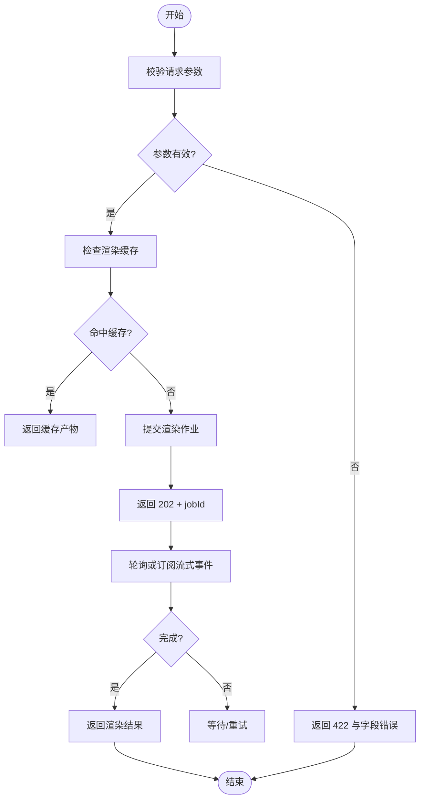

# API 设计原则

<cite>
**本文引用的文件**   
- [src/app/api/artifacts/[id]/route.ts](file://src/app/api/artifacts/%5Bid%5D/route.ts)
- [src/app/api/director/pipeline/route.ts](file://src/app/api/director/pipeline/route.ts)
- [src/app/api/director/stage/route.ts](file://src/app/api/director/stage/route.ts)
- [src/app/api/director/stream/[nodeId]/route.ts](file://src/app/api/director/stream/%5BnodeId%5D/route.ts)
- [src/app/api/director/stream/project/[projectId]/route.ts](file://src/app/api/director/stream/project/%5BprojectId%5D/route.ts)
- [src/app/api/jobs/[id]/route.ts](file://src/app/api/jobs/%5Bid%5D/route.ts)
- [src/app/api/ping/route.ts](file://src/app/api/ping/route.ts)
- [src/app/api/projects/route.ts](file://src/app/api/projects/route.ts)
- [src/app/api/projects/[id]/route.ts](file://src/app/api/projects/%5Bid%5D/route.ts)
- [src/app/api/render/route.ts](file://src/app/api/render/route.ts)
- [src/app/api/render/export/route.ts](file://src/app/api/render/export/route.ts)
- [src/app/api/render/thumbnails/route.ts](file://src/app/api/render/thumbnails/route.ts)
- [src/app/api/settings/route.ts](file://src/app/api/settings/route.ts)
- [server/src/server/api.ts](file://server/src/server/api.ts)
- [server/src/server/job-runner.ts](file://server/src/server/job-runner.ts)
- [server/src/server/job-store.ts](file://server/src/server/job-store.ts)
- [src/lib/queue/index.ts](file://src/lib/queue/index.ts)
- [src/features/director/pi-provider.ts](file://src/features/director/pi-provider.ts)
- [src/features/director/runtime-repository.ts](file://src/features/director/runtime-repository.ts)
- [src/features/render/renderer.ts](file://src/features/render/renderer.ts)
- [src/features/render/export-service.ts](file://src/features/render/export-service.ts)
- [src/features/render/cache.ts](file://src/features/render/cache.ts)
- [src/features/canvas/status.ts](file://src/features/canvas/status.ts)
- [src/features/audio/narration.ts](file://src/features/audio/narration.ts)
- [src/features/credentials/provider-credential-store.ts](file://src/features/credentials/provider-credential-store.ts)
- [src/instrumentation.ts](file://src/instrumentation.ts)
</cite>

## 目录
1. [简介](#简介)
2. [项目结构](#项目结构)
3. [核心组件](#核心组件)
4. [架构总览](#架构总览)
5. [详细组件分析](#详细组件分析)
6. [依赖关系分析](#依赖关系分析)
7. [性能考虑](#性能考虑)
8. [故障排查指南](#故障排查指南)
9. [结论](#结论)
10. [附录](#附录)

## 简介
本文件为 PurpleInk 的 RESTful API 设计提供系统化、可落地的架构文档。内容覆盖：
- REST 设计原则与 URL 命名规范
- HTTP 方法与状态码约定
- 请求/响应格式标准
- 错误处理模式与异常分类
- API 版本管理策略与向后兼容保证
- 废弃接口迁移方案
- 安全考量、认证授权与权限控制
- API 文档生成、测试策略与性能监控

该文档面向产品、前端、后端与运维读者，力求以循序渐进的方式呈现从概念到实现的全景视图。

## 项目结构
PurpleInk 采用 Next.js App Router 组织 API 路由，服务端能力通过 server 子工程暴露作业运行与持久化能力，业务逻辑集中在 src/features 下，通用库在 src/lib。API 路由按资源域划分，便于职责清晰与独立演进。

图表来源
- [src/app/api/artifacts/[id]/route.ts](file://src/app/api/artifacts/%5Bid%5D/route.ts)
- [src/app/api/director/pipeline/route.ts](file://src/app/api/director/pipeline/route.ts)
- [src/app/api/director/stage/route.ts](file://src/app/api/director/stage/route.ts)
- [src/app/api/director/stream/[nodeId]/route.ts](file://src/app/api/director/stream/%5BnodeId%5D/route.ts)
- [src/app/api/director/stream/project/[projectId]/route.ts](file://src/app/api/director/stream/project/%5BprojectId%5D/route.ts)
- [src/app/api/jobs/[id]/route.ts](file://src/app/api/jobs/%5Bid%5D/route.ts)
- [src/app/api/ping/route.ts](file://src/app/api/ping/route.ts)
- [src/app/api/projects/route.ts](file://src/app/api/projects/route.ts)
- [src/app/api/projects/[id]/route.ts](file://src/app/api/projects/%5Bid%5D/route.ts)
- [src/app/api/render/route.ts](file://src/app/api/render/route.ts)
- [src/app/api/render/export/route.ts](file://src/app/api/render/export/route.ts)
- [src/app/api/render/thumbnails/route.ts](file://src/app/api/render/thumbnails/route.ts)
- [src/app/api/settings/route.ts](file://src/app/api/settings/route.ts)
- [server/src/server/job-runner.ts](file://server/src/server/job-runner.ts)
- [server/src/server/job-store.ts](file://server/src/server/job-store.ts)
- [server/src/server/api.ts](file://server/src/server/api.ts)
- [src/features/director/pi-provider.ts](file://src/features/director/pi-provider.ts)
- [src/features/director/runtime-repository.ts](file://src/features/director/runtime-repository.ts)
- [src/features/render/renderer.ts](file://src/features/render/renderer.ts)
- [src/features/render/export-service.ts](file://src/features/render/export-service.ts)
- [src/features/render/cache.ts](file://src/features/render/cache.ts)
- [src/features/canvas/status.ts](file://src/features/canvas/status.ts)
- [src/features/audio/narration.ts](file://src/features/audio/narration.ts)
- [src/features/credentials/provider-credential-store.ts](file://src/features/credentials/provider-credential-store.ts)

章节来源
- [src/app/api/artifacts/[id]/route.ts](file://src/app/api/artifacts/%5Bid%5D/route.ts)
- [src/app/api/director/pipeline/route.ts](file://src/app/api/director/pipeline/route.ts)
- [src/app/api/director/stage/route.ts](file://src/app/api/director/stage/route.ts)
- [src/app/api/director/stream/[nodeId]/route.ts](file://src/app/api/director/stream/%5BnodeId%5D/route.ts)
- [src/app/api/director/stream/project/[projectId]/route.ts](file://src/app/api/director/stream/project/%5BprojectId%5D/route.ts)
- [src/app/api/jobs/[id]/route.ts](file://src/app/api/jobs/%5Bid%5D/route.ts)
- [src/app/api/ping/route.ts](file://src/app/api/ping/route.ts)
- [src/app/api/projects/route.ts](file://src/app/api/projects/route.ts)
- [src/app/api/projects/[id]/route.ts](file://src/app/api/projects/%5Bid%5D/route.ts)
- [src/app/api/render/route.ts](file://src/app/api/render/route.ts)
- [src/app/api/render/export/rote.ts](file://src/app/api/render/export/route.ts)
- [src/app/api/render/thumbnails/route.ts](file://src/app/api/render/thumbnails/route.ts)
- [src/app/api/settings/route.ts](file://src/app/api/settings/route.ts)
- [server/src/server/job-runner.ts](file://server/src/server/job-runner.ts)
- [server/src/server/job-store.ts](file://server/src/server/job-store.ts)
- [server/src/server/api.ts](file://server/src/server/api.ts)

## 核心组件
- API 路由层（Next.js App Router）
  - 负责 HTTP 协议解析、参数校验、鉴权前置、调用业务服务、统一响应封装与错误归一化。
  - 关键路由包括 artifacts、director、jobs、projects、render、settings、ping 等。
- 作业运行器（Job Runner）
  - 接收任务、调度执行、持久化状态、支持重试与幂等。
- 存储与仓库（Job Store / Runtime Repository）
  - 抽象数据访问，屏蔽数据库差异，提供事务与一致性保障。
- 渲染与导出（Renderer / Export Service）
  - 编排渲染管线、缓存命中、分片与合并、产物落地。
- 画布状态与音频（Canvas Status / Narration）
  - 维护画布状态机、音频合成与字幕对齐。
- 凭证管理（Provider Credential Store）
  - 集中管理第三方凭据，加密存储与最小权限访问。

章节来源
- [src/app/api/artifacts/[id]/route.ts](file://src/app/api/artifacts/%5Bid%5D/route.ts)
- [src/app/api/director/pipeline/route.ts](file://src/app/api/director/pipeline/route.ts)
- [src/app/api/director/stage/route.ts](file://src/app/api/director/stage/route.ts)
- [src/app/api/director/stream/[nodeId]/route.ts](file://src/app/api/director/stream/%5BnodeId%5D/route.ts)
- [src/app/api/director/stream/project/[projectId]/route.ts](file://src/app/api/director/stream/project/%5BprojectId%5D/route.ts)
- [src/app/api/jobs/[id]/route.ts](file://src/app/api/jobs/%5Bid%5D/route.ts)
- [src/app/api/projects/route.ts](file://src/app/api/projects/route.ts)
- [src/app/api/projects/[id]/route.ts](file://src/app/api/projects/%5Bid%5D/route.ts)
- [src/app/api/render/route.ts](file://src/app/api/render/route.ts)
- [src/app/api/render/export/route.ts](file://src/app/api/render/export/route.ts)
- [src/app/api/render/thumbnails/route.ts](file://src/app/api/render/thumbnails/route.ts)
- [src/app/api/settings/route.ts](file://src/app/api/settings/route.ts)
- [server/src/server/job-runner.ts](file://server/src/server/job-runner.ts)
- [server/src/server/job-store.ts](file://server/src/server/job-store.ts)
- [src/features/director/pi-provider.ts](file://src/features/director/pi-provider.ts)
- [src/features/director/runtime-repository.ts](file://src/features/director/runtime-repository.ts)
- [src/features/render/renderer.ts](file://src/features/render/renderer.ts)
- [src/features/render/export-service.ts](file://src/features/render/export-service.ts)
- [src/features/render/cache.ts](file://src/features/render/cache.ts)
- [src/features/canvas/status.ts](file://src/features/canvas/status.ts)
- [src/features/audio/narration.ts](file://src/features/audio/narration.ts)
- [src/features/credentials/provider-credential-store.ts](file://src/features/credentials/provider-credential-store.ts)

## 架构总览
下图展示一次“导演管线”请求的典型调用链：客户端发起创建或推进管线请求，API 路由进行鉴权与参数校验后，调用 director 服务；若涉及异步执行，则提交至 job-runner，并通过流式通道回传进度。

图表来源
- [src/app/api/director/pipeline/route.ts](file://src/app/api/director/pipeline/route.ts)
- [src/app/api/director/stream/project/[projectId]/route.ts](file://src/app/api/director/stream/project/%5BprojectId%5D/route.ts)
- [server/src/server/job-runner.ts](file://server/src/server/job-runner.ts)
- [server/src/server/job-store.ts](file://server/src/server/job-store.ts)
- [src/features/director/pi-provider.ts](file://src/features/director/pi-provider.ts)

章节来源
- [src/app/api/director/pipeline/route.ts](file://src/app/api/director/pipeline/route.ts)
- [src/app/api/director/stream/project/[projectId]/route.ts](file://src/app/api/director/stream/project/%5BprojectId%5D/route.ts)
- [server/src/server/job-runner.ts](file://server/src/server/job-runner.ts)
- [server/src/server/job-store.ts](file://server/src/server/job-store.ts)
- [src/features/director/pi-provider.ts](file://src/features/director/pi-provider.ts)

## 详细组件分析

### REST 设计原则与 URL 命名规范
- 资源导向：URL 表示名词资源，使用复数形式，如 /api/projects、/api/artifacts、/api/render。
- 层级与关联：通过路径表达资源关系，如 /api/projects/:id、/api/render/export。
- 动词语义：HTTP 方法表达操作意图，GET 查询、POST 创建、PUT/PATCH 更新、DELETE 删除。
- 查询参数：过滤、排序、分页使用 query string，如 ?page=1&limit=20&sort=-createdAt。
- 幂等性：GET、PUT、DELETE 应幂等；POST 非幂等但需支持去重键（如 idempotency-key）。
- 版本化：建议通过 URL 前缀或 Accept-Version 头进行版本控制，例如 /api/v1/...。

章节来源
- [src/app/api/projects/route.ts](file://src/app/api/projects/route.ts)
- [src/app/api/projects/[id]/route.ts](file://src/app/api/projects/%5Bid%5D/route.ts)
- [src/app/api/artifacts/[id]/route.ts](file://src/app/api/artifacts/%5Bid%5D/route.ts)
- [src/app/api/render/route.ts](file://src/app/api/render/route.ts)
- [src/app/api/render/export/route.ts](file://src/app/api/render/export/route.ts)

### HTTP 方法与状态码约定
- GET：读取资源，成功 200，未找到 404，权限不足 403。
- POST：创建资源，成功 201，参数错误 422，冲突 409。
- PUT/PATCH：更新资源，成功 200/204，参数错误 422，未找到 404。
- DELETE：删除资源，成功 204，未找到 404。
- 异步任务：接受 202 并返回任务 ID，配合轮询或 SSE 获取结果。
- 错误体：统一包含 code、message、details、requestId 字段。

章节来源
- [src/app/api/jobs/[id]/route.ts](file://src/app/api/jobs/%5Bid%5D/route.ts)
- [src/app/api/ping/route.ts](file://src/app/api/ping/route.ts)

### 请求/响应格式标准
- Content-Type：JSON 使用 application/json；文件上传使用 multipart/form-data。
- 统一响应包装：{ status, data, error?, requestId? }，其中 error 包含 code/message/details。
- 分页：{ items, total, page, limit, hasMore }。
- 时间戳：ISO 8601 字符串，时区 UTC。
- 错误码：领域细分，如 RENDER_FAILED、JOB_NOT_FOUND、CREDENTIAL_INVALID。

章节来源
- [src/app/api/render/route.ts](file://src/app/api/render/route.ts)
- [src/app/api/render/export/route.ts](file://src/app/api/render/export/route.ts)
- [src/app/api/jobs/[id]/route.ts](file://src/app/api/jobs/%5Bid%5D/route.ts)

### 错误处理模式
- 输入校验失败：返回 422，附带字段级错误详情。
- 业务异常：返回 4xx/5xx 与领域错误码，记录结构化日志。
- 外部依赖失败：超时与降级策略，返回 502/504 并提供重试建议。
- 统一中间件：捕获未处理异常，输出标准化错误体与请求追踪 ID。

章节来源
- [src/app/api/settings/route.ts](file://src/app/api/settings/route.ts)
- [src/app/api/render/route.ts](file://src/app/api/render/route.ts)

### API 版本管理与向后兼容
- 版本策略：优先使用 URL 前缀 /api/v1/...，必要时结合 Accept-Version。
- 兼容性：新增字段保持可选，移除字段需弃用周期；禁止破坏性变更。
- 弃用流程：提前公告、软弃用（警告）、硬弃用（410 Gone），提供迁移指南。

章节来源
- [src/app/api/projects/route.ts](file://src/app/api/projects/route.ts)
- [src/app/api/render/route.ts](file://src/app/api/render/route.ts)

### 安全考量、认证授权与权限控制
- 认证：JWT 或会话 Cookie，敏感操作要求强认证。
- 授权：基于角色的访问控制（RBAC）或基于资源的细粒度权限。
- 传输安全：强制 HTTPS，启用 HSTS，限制 CORS 白名单。
- 输入校验：严格 schema 校验，防注入与越权。
- 凭据管理：集中存储、加密、最小权限访问与审计。

章节来源
- [src/app/api/settings/route.ts](file://src/app/api/settings/route.ts)
- [src/features/credentials/provider-credential-store.ts](file://src/features/credentials/provider-credential-store.ts)

### 文档生成、测试策略与性能监控
- 文档生成：OpenAPI/Swagger 自动生成，结合路由注解与类型定义。
- 测试策略：单元测试（业务逻辑）、契约测试（API 行为）、集成测试（端到端）、回归测试（基线对比）。
- 性能监控：指标采集（QPS、延迟、错误率）、链路追踪（traceId）、告警阈值与容量规划。

章节来源
- [src/instrumentation.ts](file://src/instrumentation.ts)
- [src/app/api/ping/route.ts](file://src/app/api/ping/route.ts)

## 依赖关系分析
API 路由与业务模块之间的依赖如下所示，体现高内聚低耦合的设计目标。

图表来源
- [src/app/api/projects/route.ts](file://src/app/api/projects/route.ts)
- [src/app/api/artifacts/[id]/route.ts](file://src/app/api/artifacts/%5Bid%5D/route.ts)
- [src/app/api/director/pipeline/route.ts](file://src/app/api/director/pipeline/route.ts)
- [src/app/api/render/route.ts](file://src/app/api/render/route.ts)
- [src/app/api/jobs/[id]/route.ts](file://src/app/api/jobs/%5Bid%5D/route.ts)
- [src/app/api/settings/route.ts](file://src/app/api/settings/route.ts)
- [src/features/director/runtime-repository.ts](file://src/features/director/runtime-repository.ts)
- [src/features/render/renderer.ts](file://src/features/render/renderer.ts)
- [src/features/render/export-service.ts](file://src/features/render/export-service.ts)
- [src/features/render/cache.ts](file://src/features/render/cache.ts)
- [server/src/server/job-runner.ts](file://server/src/server/job-runner.ts)
- [server/src/server/job-store.ts](file://server/src/server/job-store.ts)

章节来源
- [src/app/api/projects/route.ts](file://src/app/api/projects/route.ts)
- [src/app/api/artifacts/[id]/route.ts](file://src/app/api/artifacts/%5Bid%5D/route.ts)
- [src/app/api/director/pipeline/route.ts](file://src/app/api/director/pipeline/route.ts)
- [src/app/api/render/route.ts](file://src/app/api/render/route.ts)
- [src/app/api/jobs/[id]/route.ts](file://src/app/api/jobs/%5Bid%5D/route.ts)
- [src/app/api/settings/route.ts](file://src/app/api/settings/route.ts)
- [src/features/director/runtime-repository.ts](file://src/features/director/runtime-repository.ts)
- [src/features/render/renderer.ts](file://src/features/render/renderer.ts)
- [src/features/render/export-service.ts](file://src/features/render/export-service.ts)
- [src/features/render/cache.ts](file://src/features/render/cache.ts)
- [server/src/server/job-runner.ts](file://server/src/server/job-runner.ts)
- [server/src/server/job-store.ts](file://server/src/server/job-store.ts)

## 性能考虑
- 缓存策略：对读多写少的资源启用多级缓存（内存/Redis），设置合理的 TTL 与失效策略。
- 异步处理：耗时任务入队执行，避免阻塞请求线程，提升吞吐。
- 流式输出：大文件或长任务采用 SSE/WS 流式推送，降低首屏等待。
- 连接池与限流：数据库与外部依赖使用连接池，API 层实施速率限制与熔断。
- 监控与调优：采集关键指标，定位热点与瓶颈，持续优化。

章节来源
- [src/features/render/cache.ts](file://src/features/render/cache.ts)
- [server/src/server/job-runner.ts](file://server/src/server/job-runner.ts)
- [src/app/api/director/stream/project/[projectId]/route.ts](file://src/app/api/director/stream/project/%5BprojectId%5D/route.ts)

## 故障排查指南
- 快速健康检查：/api/ping 用于存活探针与基础连通性验证。
- 作业诊断：通过 /api/jobs/:id 查询作业状态与错误堆栈，结合 traceId 定位问题。
- 渲染问题：检查渲染缓存命中率、队列积压与外部依赖可用性。
- 凭据错误：核对 provider-credential-store 中的密钥配置与权限范围。
- 日志与指标：查看结构化日志与仪表板，关注错误率、延迟与资源使用。

章节来源
- [src/app/api/ping/route.ts](file://src/app/api/ping/route.ts)
- [src/app/api/jobs/[id]/route.ts](file://src/app/api/jobs/%5Bid%5D/route.ts)
- [src/features/render/cache.ts](file://src/features/render/cache.ts)
- [src/features/credentials/provider-credential-store.ts](file://src/features/credentials/provider-credential-store.ts)
- [src/instrumentation.ts](file://src/instrumentation.ts)

## 结论
PurpleInk 的 API 设计遵循 REST 原则与清晰的资源分层，结合异步作业与流式输出满足复杂生产场景。通过统一的错误模型、严格的鉴权与完善的监控体系，确保稳定性与可观测性。建议在后续迭代中持续推进版本治理、性能优化与安全加固，以提升整体质量与用户体验。

## 附录

### 典型 API 工作流（渲染导出）

图表来源
- [src/app/api/render/route.ts](file://src/app/api/render/route.ts)
- [src/app/api/render/export/route.ts](file://src/app/api/render/export/route.ts)
- [src/features/render/renderer.ts](file://src/features/render/renderer.ts)
- [src/features/render/export-service.ts](file://src/features/render/export-service.ts)
- [src/features/render/cache.ts](file://src/features/render/cache.ts)