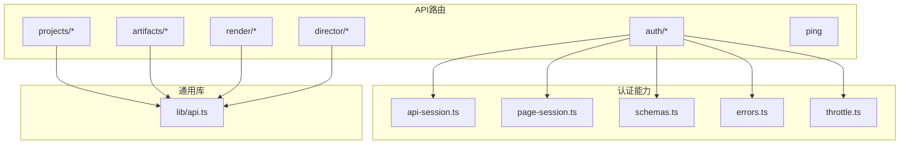
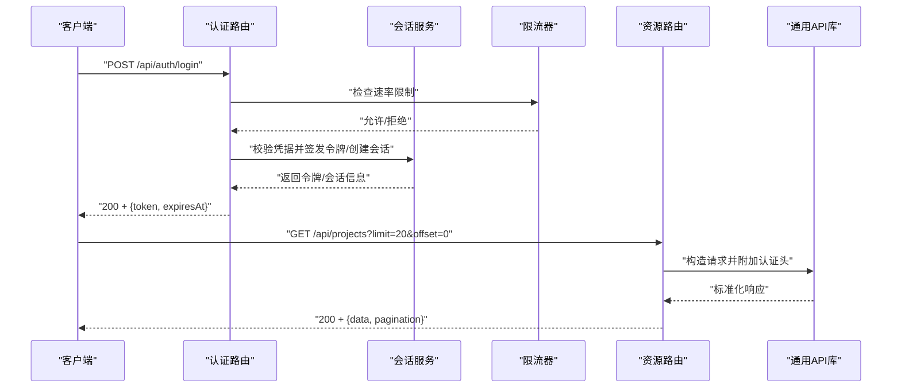
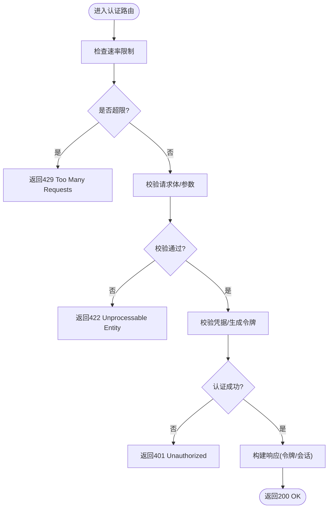
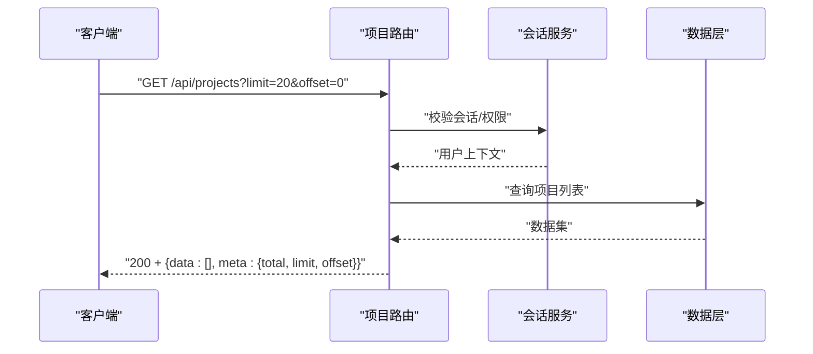
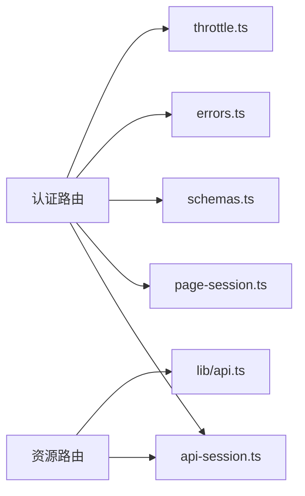

# API设计

<cite>
**本文引用的文件**   
- [src/app/api/auth/login/route.ts](file://src/app/api/auth/login/route.ts)
- [src/app/api/auth/logout/route.ts](file://src/app/api/auth/logout/route.ts)
- [src/app/api/auth/signup/route.ts](file://src/app/api/auth/signup/route.ts)
- [src/app/api/auth/session/route.ts](file://src/app/api/auth/session/route.ts)
- [src/app/api/auth/human-check/route.ts](file://src/app/api/auth/human-check/route.ts)
- [src/features/auth/api-session.ts](file://src/features/auth/api-session.ts)
- [src/features/auth/page-session.ts](file://src/features/auth/page-session.ts)
- [src/features/auth/schemas.ts](file://src/features/auth/schemas.ts)
- [src/features/auth/errors.ts](file://src/features/auth/errors.ts)
- [src/features/auth/throttle.ts](file://src/features/auth/throttle.ts)
- [src/app/api/projects/route.ts](file://src/app/api/projects/route.ts)
- [src/app/api/artifacts/[id]/route.ts](file://src/app/api/artifacts/[id]/route.ts)
- [src/app/api/render/route.ts](file://src/app/api/render/route.ts)
- [src/app/api/director/pipeline/route.ts](file://src/app/api/director/pipeline/route.ts)
- [src/lib/api.ts](file://src/lib/api.ts)
</cite>

## 目录
1. [简介](#简介)
2. [项目结构](#项目结构)
3. [核心组件](#核心组件)
4. [架构总览](#架构总览)
5. [详细组件分析](#详细组件分析)
6. [依赖分析](#依赖分析)
7. [性能考虑](#性能考虑)
8. [故障排查指南](#故障排查指南)
9. [结论](#结论)
10. [附录](#附录)

## 简介
本文件面向PurpleInk的RESTful API设计与实现，聚焦以下目标：
- RESTful API设计原则与命名规范（URL模式、HTTP方法、状态码）
- 认证机制（JWT令牌管理、会话处理、权限验证）
- 请求/响应格式标准（数据序列化、错误响应结构、分页机制）
- API版本控制策略与向后兼容性保证
- 具体端点示例与调用方式
- 常见错误处理与调试技巧

## 项目结构
本项目采用Next.js App Router组织API路由，按功能域划分目录。认证相关接口集中在 src/app/api/auth/*，业务资源如项目、制品、渲染、导演管线等分别位于对应路径下。通用库与工具位于 src/lib 与 src/features。

图表来源
- [src/app/api/auth/login/route.ts](file://src/app/api/auth/login/route.ts)
- [src/app/api/auth/logout/route.ts](file://src/app/api/auth/logout/route.ts)
- [src/app/api/auth/signup/route.ts](file://src/app/api/auth/signup/route.ts)
- [src/app/api/auth/session/route.ts](file://src/app/api/auth/session/route.ts)
- [src/app/api/auth/human-check/route.ts](file://src/app/api/auth/human-check/route.ts)
- [src/features/auth/api-session.ts](file://src/features/auth/api-session.ts)
- [src/features/auth/page-session.ts](file://src/features/auth/page-session.ts)
- [src/features/auth/schemas.ts](file://src/features/auth/schemas.ts)
- [src/features/auth/errors.ts](file://src/features/auth/errors.ts)
- [src/features/auth/throttle.ts](file://src/features/auth/throttle.ts)
- [src/lib/api.ts](file://src/lib/api.ts)

章节来源
- [src/app/api/auth/login/route.ts](file://src/app/api/auth/login/route.ts)
- [src/app/api/auth/logout/route.ts](file://src/app/api/auth/logout/route.ts)
- [src/app/api/auth/signup/route.ts](file://src/app/api/auth/signup/route.ts)
- [src/app/api/auth/session/route.ts](file://src/app/api/auth/session/route.ts)
- [src/app/api/auth/human-check/route.ts](file://src/app/api/auth/human-check/route.ts)
- [src/features/auth/api-session.ts](file://src/features/auth/api-session.ts)
- [src/features/auth/page-session.ts](file://src/features/auth/page-session.ts)
- [src/features/auth/schemas.ts](file://src/features/auth/schemas.ts)
- [src/features/auth/errors.ts](file://src/features/auth/errors.ts)
- [src/features/auth/throttle.ts](file://src/features/auth/throttle.ts)
- [src/lib/api.ts](file://src/lib/api.ts)

## 核心组件
- 认证与会话
  - API会话封装：用于在API路由中解析、校验并注入当前用户上下文，支持JWT或基于Cookie的会话。
  - 页面会话封装：用于服务端渲染场景下的会话读取与鉴权。
  - 输入校验：使用统一Schema定义登录、注册、密码重置等请求体与查询参数。
  - 错误模型：统一的错误类型与消息映射，便于前端一致化处理。
  - 限流：对敏感接口（如验证码、登录）进行速率限制，防止滥用。
- 通用API库
  - 提供统一的请求构造、响应包装、错误标准化与重试策略。

章节来源
- [src/features/auth/api-session.ts](file://src/features/auth/api-session.ts)
- [src/features/auth/page-session.ts](file://src/features/auth/page-session.ts)
- [src/features/auth/schemas.ts](file://src/features/auth/schemas.ts)
- [src/features/auth/errors.ts](file://src/features/auth/errors.ts)
- [src/features/auth/throttle.ts](file://src/features/auth/throttle.ts)
- [src/lib/api.ts](file://src/lib/api.ts)

## 架构总览
下图展示认证流程与受保护资源的访问链路，体现JWT/会话、限流、错误标准化与资源路由的关系。

图表来源
- [src/app/api/auth/login/route.ts](file://src/app/api/auth/login/route.ts)
- [src/app/api/auth/session/route.ts](file://src/app/api/auth/session/route.ts)
- [src/features/auth/api-session.ts](file://src/features/auth/api-session.ts)
- [src/features/auth/throttle.ts](file://src/features/auth/throttle.ts)
- [src/lib/api.ts](file://src/lib/api.ts)
- [src/app/api/projects/route.ts](file://src/app/api/projects/route.ts)

## 详细组件分析

### 认证与授权
- 设计要点
  - 使用JWT或基于Cookie的会话进行身份认证；推荐将令牌置于安全HttpOnly Cookie中，避免XSS风险。
  - 所有受保护接口需校验会话/令牌有效性，失败返回401；权限不足返回403。
  - 对登录、注册、验证码等敏感接口实施限流，防止暴力破解与滥用。
- 关键端点
  - POST /api/auth/login：登录，返回令牌或会话信息。
  - POST /api/auth/logout：登出，清除本地会话/令牌。
  - GET /api/auth/session：获取当前会话信息，用于前端初始化鉴权状态。
  - POST /api/auth/signup：注册新用户。
  - POST /api/auth/human-check：人机校验，降低机器人攻击风险。
- 错误与限流
  - 统一错误结构，包含code、message、details等字段。
  - 限流失败返回429，提示重试间隔。

图表来源
- [src/app/api/auth/login/route.ts](file://src/app/api/auth/login/route.ts)
- [src/app/api/auth/human-check/route.ts](file://src/app/api/auth/human-check/route.ts)
- [src/features/auth/throttle.ts](file://src/features/auth/throttle.ts)
- [src/features/auth/schemas.ts](file://src/features/auth/schemas.ts)
- [src/features/auth/errors.ts](file://src/features/auth/errors.ts)

章节来源
- [src/app/api/auth/login/route.ts](file://src/app/api/auth/login/route.ts)
- [src/app/api/auth/logout/route.ts](file://src/app/api/auth/logout/route.ts)
- [src/app/api/auth/signup/route.ts](file://src/app/api/auth/signup/route.ts)
- [src/app/api/auth/session/route.ts](file://src/app/api/auth/session/route.ts)
- [src/app/api/auth/human-check/route.ts](file://src/app/api/auth/human-check/route.ts)
- [src/features/auth/api-session.ts](file://src/features/auth/api-session.ts)
- [src/features/auth/page-session.ts](file://src/features/auth/page-session.ts)
- [src/features/auth/schemas.ts](file://src/features/auth/schemas.ts)
- [src/features/auth/errors.ts](file://src/features/auth/errors.ts)
- [src/features/auth/throttle.ts](file://src/features/auth/throttle.ts)

### 项目资源API
- URL模式
  - 集合：/api/projects
  - 单项：/api/projects/:id
- HTTP方法与语义
  - GET /api/projects：列出项目，支持分页与过滤。
  - POST /api/projects：创建项目。
  - GET /api/projects/:id：获取项目详情。
  - PATCH /api/projects/:id：更新项目。
  - DELETE /api/projects/:id：删除项目。
- 分页机制
  - 查询参数：limit、offset（或cursor），建议优先使用cursor-based分页以提升稳定性。
- 响应结构
  - 成功：{ data, meta }，meta包含分页信息。
  - 错误：{ error: { code, message, details } }。

图表来源
- [src/app/api/projects/route.ts](file://src/app/api/projects/route.ts)
- [src/features/auth/api-session.ts](file://src/features/auth/api-session.ts)

章节来源
- [src/app/api/projects/route.ts](file://src/app/api/projects/route.ts)

### 制品与渲染API
- 制品
  - GET /api/artifacts/:id：获取制品元数据或内容。
- 渲染
  - POST /api/render：提交渲染任务，返回任务ID与状态轮询端点。
  - GET /api/render/export：导出渲染结果（异步任务完成后下载）。
- 响应与状态
  - 任务型接口返回202 Accepted，并在响应体中包含任务跟踪信息。
  - 长耗时操作建议使用异步任务+轮询或WebSocket推送（若启用）。

章节来源
- [src/app/api/artifacts/[id]/route.ts](file://src/app/api/artifacts/[id]/route.ts)
- [src/app/api/render/route.ts](file://src/app/api/render/route.ts)

### 导演管线API
- 端点
  - POST /api/director/pipeline：启动导演管线，编排多阶段任务。
  - GET /api/director/stage：查询某阶段状态。
  - GET /api/director/stream/[nodeId]：节点级实时输出流。
- 设计要点
  - 幂等性：重复提交应返回相同任务ID或幂等结果。
  - 进度反馈：通过状态枚举与事件流推进。

章节来源
- [src/app/api/director/pipeline/route.ts](file://src/app/api/director/pipeline/route.ts)

## 依赖分析
- 模块耦合
  - 认证路由依赖会话服务、限流器与输入校验Schema。
  - 资源路由依赖会话服务与通用API库，确保统一鉴权与响应格式。
- 外部依赖
  - 数据库访问、对象存储、第三方AI服务等通过适配器或仓库层隔离，便于替换与测试。

图表来源
- [src/app/api/auth/login/route.ts](file://src/app/api/auth/login/route.ts)
- [src/app/api/projects/route.ts](file://src/app/api/projects/route.ts)
- [src/features/auth/api-session.ts](file://src/features/auth/api-session.ts)
- [src/features/auth/page-session.ts](file://src/features/auth/page-session.ts)
- [src/features/auth/schemas.ts](file://src/features/auth/schemas.ts)
- [src/features/auth/errors.ts](file://src/features/auth/errors.ts)
- [src/features/auth/throttle.ts](file://src/features/auth/throttle.ts)
- [src/lib/api.ts](file://src/lib/api.ts)

章节来源
- [src/features/auth/api-session.ts](file://src/features/auth/api-session.ts)
- [src/features/auth/page-session.ts](file://src/features/auth/page-session.ts)
- [src/features/auth/schemas.ts](file://src/features/auth/schemas.ts)
- [src/features/auth/errors.ts](file://src/features/auth/errors.ts)
- [src/features/auth/throttle.ts](file://src/features/auth/throttle.ts)
- [src/lib/api.ts](file://src/lib/api.ts)

## 性能考虑
- 认证优化
  - JWT签名验证尽量无状态化，必要时引入缓存减少密钥加载开销。
  - 会话存储选择内存或Redis，注意过期清理策略。
- 分页与查询
  - 优先使用cursor-based分页，避免深翻页导致的性能问题。
  - 为常用查询字段建立索引，减少全表扫描。
- 并发与限流
  - 对写接口与敏感接口设置合理的并发上限与限流阈值。
  - 长耗时任务放入队列，避免阻塞请求线程。
- 缓存策略
  - 静态资源与只读数据使用CDN与浏览器缓存。
  - 热点数据采用短期缓存，配合失效策略。

[本节为通用指导，不直接分析具体文件]

## 故障排查指南
- 常见问题
  - 401未认证：检查令牌是否过期、是否正确携带；确认会话有效期与刷新逻辑。
  - 403权限不足：确认用户角色与资源访问策略；检查中间件是否生效。
  - 422参数错误：核对请求体结构与必填字段；查看Schema校验错误详情。
  - 429限流触发：降低请求频率或申请更高配额；检查限流键（IP/用户ID）。
- 调试技巧
  - 开启请求日志，记录入参、出参与耗时。
  - 使用健康检查端点（如 /api/ping）验证服务可用性。
  - 对认证链路增加断点与追踪ID，便于跨服务定位问题。

章节来源
- [src/features/auth/errors.ts](file://src/features/auth/errors.ts)
- [src/features/auth/throttle.ts](file://src/features/auth/throttle.ts)
- [src/lib/api.ts](file://src/lib/api.ts)

## 结论
PurpleInk的API设计遵循RESTful原则，采用清晰的URL模式与HTTP语义，结合JWT/会话认证、统一错误模型与限流策略，保障安全性与可维护性。通过分页、异步任务与缓存等手段提升性能与用户体验。建议在后续迭代中持续完善版本控制与向后兼容策略，并加强监控与可观测性。

[本节为总结性内容，不直接分析具体文件]

## 附录

### RESTful设计规范
- URL模式
  - 使用名词复数表示资源集合，例如 /api/projects、/api/artifacts。
  - 子资源通过路径嵌套表达关系，例如 /api/projects/:id/artifacts。
- HTTP方法
  - GET：读取资源；POST：创建资源；PUT/PATCH：更新资源；DELETE：删除资源。
- 状态码
  - 2xx成功，3xx重定向，4xx客户端错误，5xx服务器错误。
  - 401未认证，403权限不足，422参数校验失败，429限流。
- 分页
  - 推荐使用cursor-based分页；若使用offset/limit，需限制最大页大小。
- 排序与过滤
  - 使用查询参数，如 sort、filter、fields，保持语义清晰。

### 认证机制
- JWT
  - 短生命周期访问令牌+刷新令牌；安全存储于HttpOnly Cookie。
  - 服务端验证签名与过期时间，支持黑名单或撤销机制。
- 会话
  - 服务端会话存储（内存/Redis），设置合理过期与清理策略。
- 权限
  - 基于角色的访问控制（RBAC）或基于属性的访问控制（ABAC）。
  - 资源级权限校验在路由或服务层执行。

### 请求/响应格式
- 成功响应
  - { data, meta }，meta包含分页、统计等信息。
- 错误响应
  - { error: { code, message, details } }，code为机器可读的错误码。
- 序列化
  - JSON为主，必要时使用表单或多部分上传；统一日期与时区格式。

### API版本控制
- 策略
  - URL前缀版本化（/api/v1/...）或Header版本控制（Accept-Version）。
- 向后兼容
  - 新增字段非破坏性；废弃字段保留一段时间并提供迁移指南。
  - 变更通过弃用警告与文档更新通知消费者。

### 端点示例与调用方式
- 登录
  - POST /api/auth/login，请求体包含邮箱与密码；成功后返回令牌与过期时间。
- 获取会话
  - GET /api/auth/session，返回当前用户信息与权限范围。
- 列出项目
  - GET /api/projects?limit=20&offset=0，返回项目列表与分页元信息。
- 创建渲染任务
  - POST /api/render，提交渲染参数，返回任务ID与状态查询端点。

章节来源
- [src/app/api/auth/login/route.ts](file://src/app/api/auth/login/route.ts)
- [src/app/api/auth/session/route.ts](file://src/app/api/auth/session/route.ts)
- [src/app/api/projects/route.ts](file://src/app/api/projects/route.ts)
- [src/app/api/render/route.ts](file://src/app/api/render/route.ts)