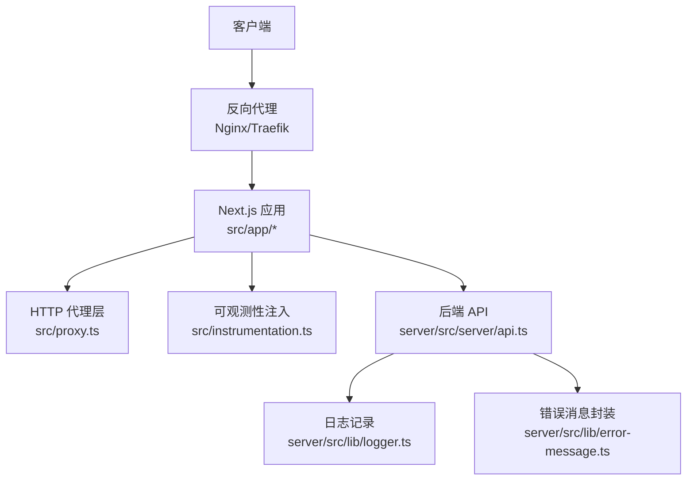
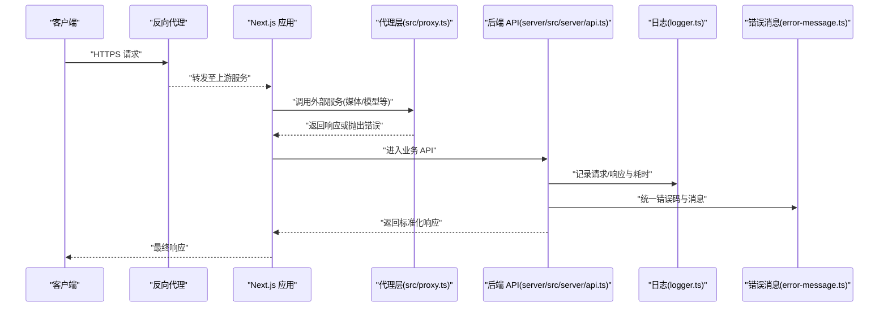
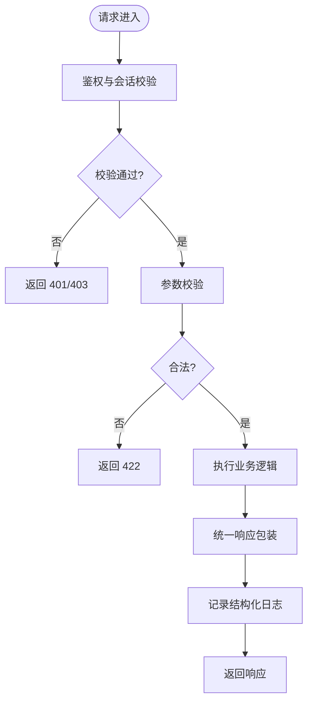
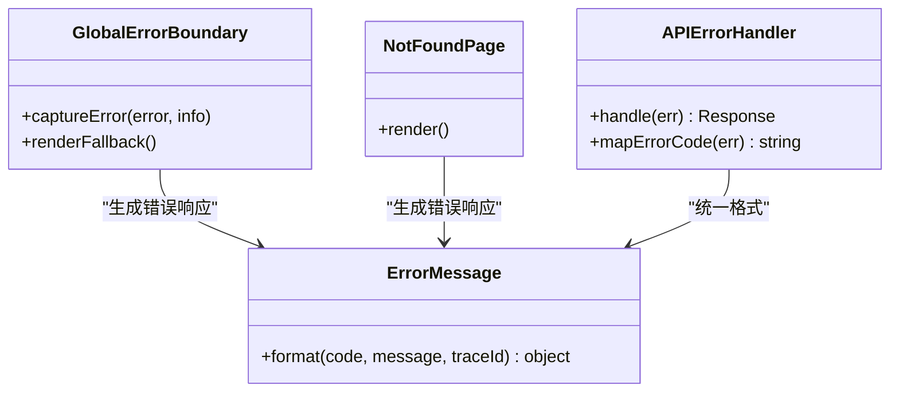
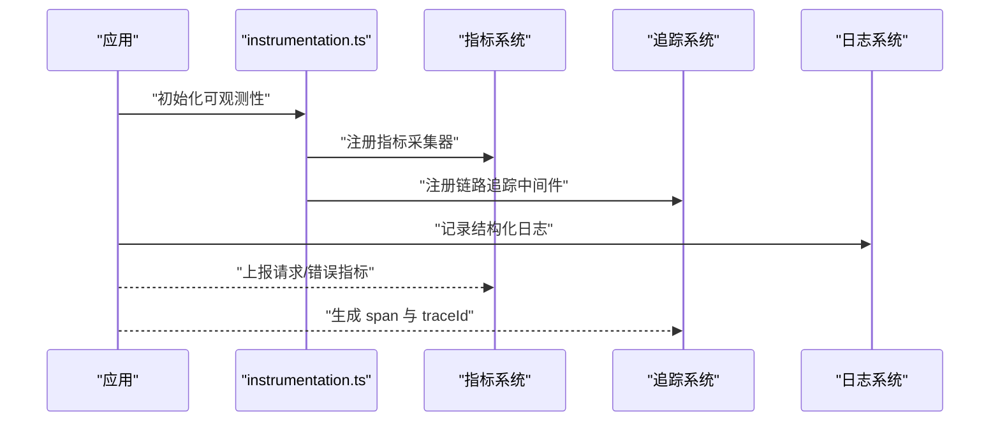
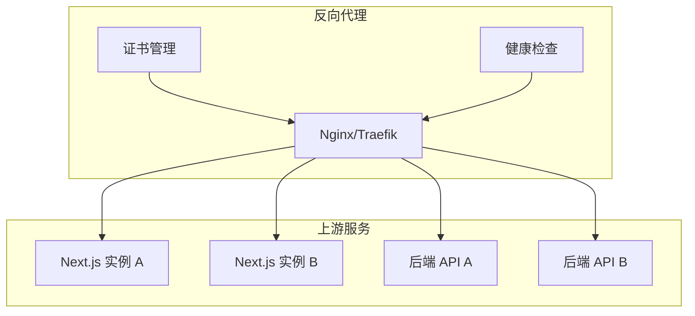
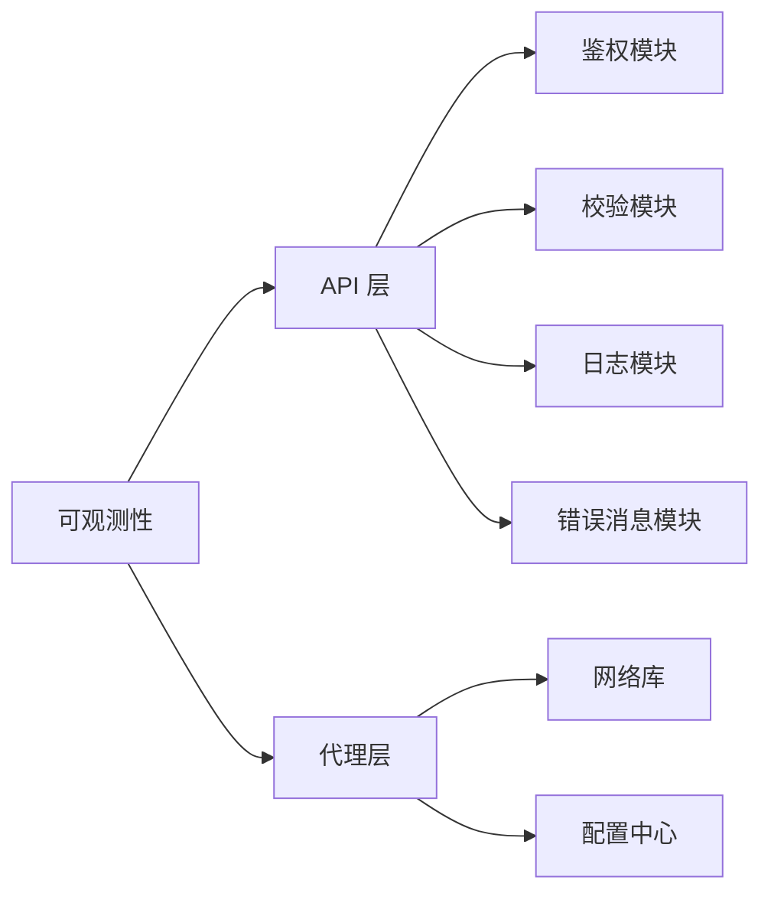

# 中间件与错误处理

<cite>
**本文档引用的文件**   
- [src/proxy.ts](file://src/proxy.ts)
- [src/instrumentation.ts](file://src/instrumentation.ts)
- [server/src/index.ts](file://server/src/index.ts)
- [server/src/server/api.ts](file://server/src/server/api.ts)
- [server/src/lib/logger.ts](file://server/src/lib/logger.ts)
- [server/src/lib/error-message.ts](file://server/src/lib/error-message.ts)
- [src/app/global-error.tsx](file://src/app/global-error.tsx)
- [src/app/not-found.tsx](file://src/app/not-found.tsx)
- [src/features/auth/errors.ts](file://src/features/auth/errors.ts)
- [src/features/canvas/workflow-error.ts](file://src/features/canvas/workflow-error.ts)
- [deploy/reverse-proxy/Dockerfile](file://deploy/reverse-proxy/Dockerfile)
- [deploy/reverse-proxy/entrypoint.sh](file://deploy/reverse-proxy/entrypoint.sh)
</cite>

## 目录
1. [简介](#简介)
2. [项目结构](#项目结构)
3. [核心组件](#核心组件)
4. [架构总览](#架构总览)
5. [详细组件分析](#详细组件分析)
6. [依赖关系分析](#依赖关系分析)
7. [性能考量](#性能考量)
8. [故障排查指南](#故障排查指南)
9. [结论](#结论)
10. [附录](#附录)

## 简介
本文件系统性梳理 PurpleInk 的中间件与错误处理机制，覆盖以下方面：
- 中间件链设计与组织方式（请求拦截、响应处理、日志记录）
- 全局错误处理策略（错误分类、异常捕获、错误响应格式化）
- 监控与诊断工具集成（性能监控、错误追踪、日志聚合）
- 代理与反向代理配置（请求转发、负载均衡、SSL 终止）
- 具体错误处理示例与调试技巧

## 项目结构
PurpleInk 采用前后端分离与多服务协作模式：
- 前端 Next.js 应用提供页面、API 路由与全局错误边界
- 服务端 Node.js 进程承载业务 API、作业调度与渲染管线
- 反向代理容器负责外部入口、TLS 终止与流量分发
- 可观测性通过 instrumentation 与日志库统一接入

**图示来源**
- [src/proxy.ts](file://src/proxy.ts)
- [src/instrumentation.ts](file://src/instrumentation.ts)
- [server/src/server/api.ts](file://server/src/server/api.ts)
- [server/src/lib/logger.ts](file://server/src/lib/logger.ts)
- [server/src/lib/error-message.ts](file://server/src/lib/error-message.ts)

**章节来源**
- [src/proxy.ts](file://src/proxy.ts)
- [src/instrumentation.ts](file://src/instrumentation.ts)
- [server/src/server/api.ts](file://server/src/server/api.ts)
- [server/src/lib/logger.ts](file://server/src/lib/logger.ts)
- [server/src/lib/error-message.ts](file://server/src/lib/error-message.ts)

## 核心组件
- HTTP 代理层：集中管理对外部服务的请求转发、超时、重试与错误映射
- 可观测性注入：在应用启动时注册指标采集、链路追踪与结构化日志
- 后端 API：统一入口，结合中间件完成鉴权、限流、校验与错误归一化
- 日志与错误消息：标准化输出与错误码映射，便于聚合与分析
- 前端全局错误边界：捕获渲染期与异步错误，返回友好 UI

**章节来源**
- [src/proxy.ts](file://src/proxy.ts)
- [src/instrumentation.ts](file://src/instrumentation.ts)
- [server/src/server/api.ts](file://server/src/server/api.ts)
- [server/src/lib/logger.ts](file://server/src/lib/logger.ts)
- [server/src/lib/error-message.ts](file://server/src/lib/error-message.ts)
- [src/app/global-error.tsx](file://src/app/global-error.tsx)

## 架构总览
下图展示从外部请求到内部处理的完整路径，包括中间件链、错误处理与可观测性注入点。

**图示来源**
- [src/proxy.ts](file://src/proxy.ts)
- [server/src/server/api.ts](file://server/src/server/api.ts)
- [server/src/lib/logger.ts](file://server/src/lib/logger.ts)
- [server/src/lib/error-message.ts](file://server/src/lib/error-message.ts)

## 详细组件分析

### 中间件链设计（请求拦截、响应处理、日志记录）
- 请求拦截
  - 鉴权与会话校验：在 API 路由入口处验证会话令牌与权限
  - 输入校验：对请求体进行 schema 校验，失败即返回 422
  - 限流与防抖：基于 IP/用户维度限制高频请求
- 响应处理
  - 统一包装：将成功响应包裹为统一结构，包含数据、元信息与追踪 ID
  - 缓存控制：根据资源类型设置合适的 Cache-Control
- 日志记录
  - 结构化日志：记录请求 ID、方法、路径、状态码、耗时、用户标识
  - 敏感信息脱敏：避免泄露密钥、密码等

**图示来源**
- [server/src/server/api.ts](file://server/src/server/api.ts)
- [server/src/lib/logger.ts](file://server/src/lib/logger.ts)

**章节来源**
- [server/src/server/api.ts](file://server/src/server/api.ts)
- [server/src/lib/logger.ts](file://server/src/lib/logger.ts)

### 全局错误处理策略（错误分类、异常捕获、错误响应格式化）
- 错误分类
  - 客户端错误：参数错误、未授权、资源不存在（4xx）
  - 服务端错误：业务异常、第三方调用失败（5xx）
  - 网络错误：超时、连接失败、DNS 解析失败
- 异常捕获
  - 前端：使用 global-error 与 not-found 边界捕获渲染期与路由级错误
  - 后端：在 API 入口捕获未处理异常并转换为标准错误响应
- 错误响应格式化
  - 统一字段：code、message、traceId、details
  - 安全提示：不暴露堆栈细节，仅在生产环境隐藏技术细节

**图示来源**
- [src/app/global-error.tsx](file://src/app/global-error.tsx)
- [src/app/not-found.tsx](file://src/app/not-found.tsx)
- [server/src/lib/error-message.ts](file://server/src/lib/error-message.ts)

**章节来源**
- [src/app/global-error.tsx](file://src/app/global-error.tsx)
- [src/app/not-found.tsx](file://src/app/not-found.tsx)
- [server/src/lib/error-message.ts](file://server/src/lib/error-message.ts)

### 监控与诊断工具集成（性能监控、错误追踪、日志聚合）
- 性能监控
  - 指标采集：请求数、延迟分位、错误率、队列长度
  - 自定义指标：关键步骤耗时（如渲染、转码、AI 调用）
- 错误追踪
  - 链路追踪：跨服务传递 traceId，关联上下游日志
  - 异常上报：捕获未处理异常并上报至 APM 平台
- 日志聚合
  - 结构化输出：JSON 格式，包含上下文与标签
  - 分级输出：DEBUG/INFO/WARN/ERROR，便于过滤与分析

**图示来源**
- [src/instrumentation.ts](file://src/instrumentation.ts)

**章节来源**
- [src/instrumentation.ts](file://src/instrumentation.ts)

### 代理与反向代理配置（请求转发、负载均衡、SSL 终止）
- 请求转发
  - 按路径或域名路由至不同上游服务
  - 支持 WebSocket 与 SSE 长连接
- 负载均衡
  - 轮询/最少连接/一致性哈希策略
  - 健康检查与自动摘流
- SSL 终止
  - 证书管理与自动续期
  - HSTS 与安全头配置

**图示来源**
- [deploy/reverse-proxy/Dockerfile](file://deploy/reverse-proxy/Dockerfile)
- [deploy/reverse-proxy/entrypoint.sh](file://deploy/reverse-proxy/entrypoint.sh)

**章节来源**
- [deploy/reverse-proxy/Dockerfile](file://deploy/reverse-proxy/Dockerfile)
- [deploy/reverse-proxy/entrypoint.sh](file://deploy/reverse-proxy/entrypoint.sh)

### 具体错误处理示例与调试技巧
- 认证错误
  - 场景：令牌过期、权限不足
  - 处理：返回 401/403，附带重定向建议
  - 参考：[src/features/auth/errors.ts](file://src/features/auth/errors.ts)
- 工作流错误
  - 场景：节点执行失败、依赖缺失
  - 处理：记录上下文、返回可恢复错误码
  - 参考：[src/features/canvas/workflow-error.ts](file://src/features/canvas/workflow-error.ts)
- 调试技巧
  - 启用 DEBUG 级别日志，过滤特定模块
  - 使用 traceId 串联请求链路
  - 本地模拟上游失败（超时、5xx）验证降级逻辑

**章节来源**
- [src/features/auth/errors.ts](file://src/features/auth/errors.ts)
- [src/features/canvas/workflow-error.ts](file://src/features/canvas/workflow-error.ts)

## 依赖关系分析
中间件与错误处理涉及多层依赖，需确保低耦合与高内聚：
- 代理层依赖网络库与配置中心
- API 层依赖鉴权、校验、日志与错误消息模块
- 可观测性模块被各层引用，提供统一能力

**图示来源**
- [src/proxy.ts](file://src/proxy.ts)
- [server/src/server/api.ts](file://server/src/server/api.ts)
- [server/src/lib/logger.ts](file://server/src/lib/logger.ts)
- [server/src/lib/error-message.ts](file://server/src/lib/error-message.ts)
- [src/instrumentation.ts](file://src/instrumentation.ts)

**章节来源**
- [src/proxy.ts](file://src/proxy.ts)
- [server/src/server/api.ts](file://server/src/server/api.ts)
- [server/src/lib/logger.ts](file://server/src/lib/logger.ts)
- [server/src/lib/error-message.ts](file://server/src/lib/error-message.ts)
- [src/instrumentation.ts](file://src/instrumentation.ts)

## 性能考量
- 中间件开销
  - 避免在热路径中进行阻塞 I/O
  - 使用异步与非阻塞操作
- 错误处理成本
  - 减少不必要的堆栈收集
  - 生产环境关闭详细错误信息
- 代理层优化
  - 连接池与复用
  - 合理设置超时与重试次数
- 可观测性影响
  - 采样与降采样策略
  - 异步上报指标与日志

## 故障排查指南
- 常见问题定位
  - 查看结构化日志中的 traceId 与错误码
  - 检查上游服务健康状态与证书有效性
- 调试步骤
  - 本地复现：模拟上游失败与网络异常
  - 逐步禁用中间件：定位问题所在环节
  - 对比生产与开发环境差异
- 恢复策略
  - 快速回滚与灰度发布
  - 熔断与降级开关

**章节来源**
- [server/src/lib/logger.ts](file://server/src/lib/logger.ts)
- [server/src/lib/error-message.ts](file://server/src/lib/error-message.ts)

## 结论
PurpleInk 的中间件与错误处理机制以分层解耦、统一规范为核心，结合可观测性与反向代理，构建了稳定可靠的请求处理流水线。通过标准化的错误分类、响应格式与日志聚合，显著提升了问题定位效率与系统可维护性。

## 附录
- 最佳实践
  - 始终使用结构化日志
  - 为所有外部调用设置超时与重试
  - 在生产环境启用最小化错误信息
- 相关文档
  - 部署手册与运行手册
  - 配置项说明与环境变量清单