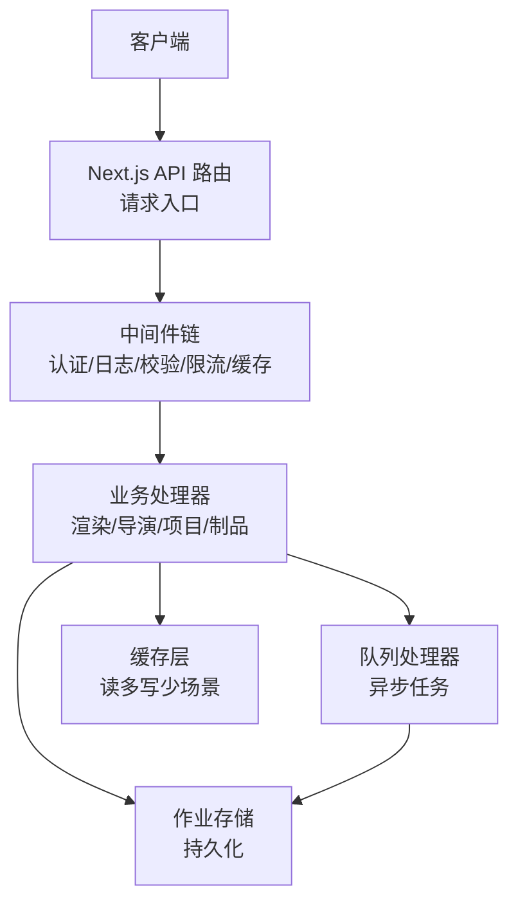
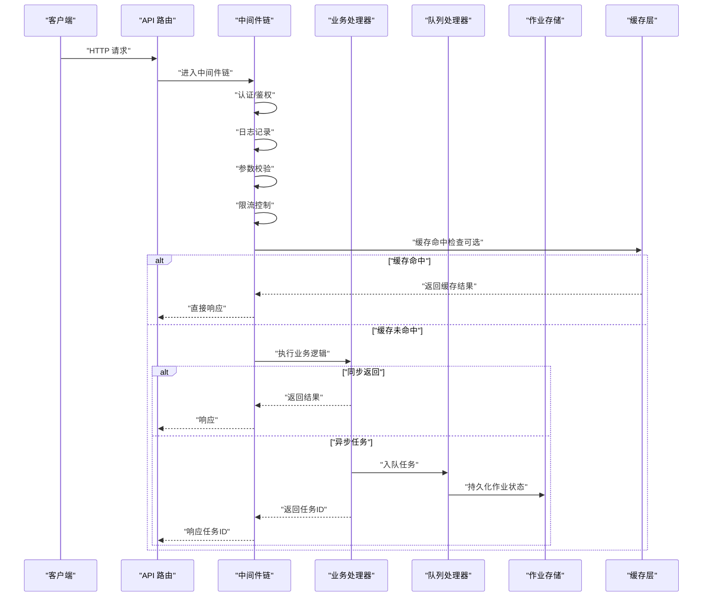
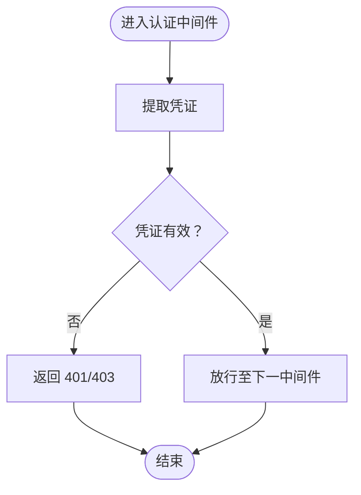
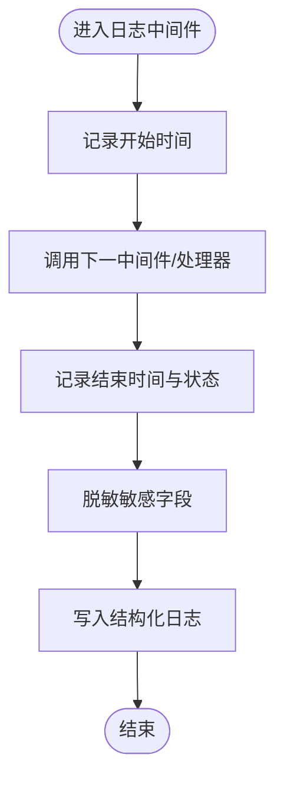
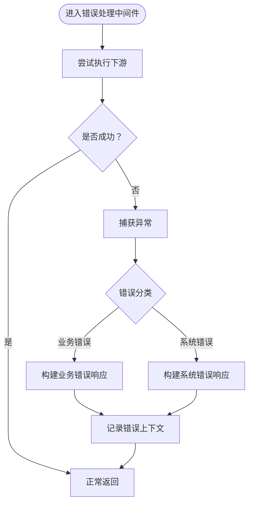
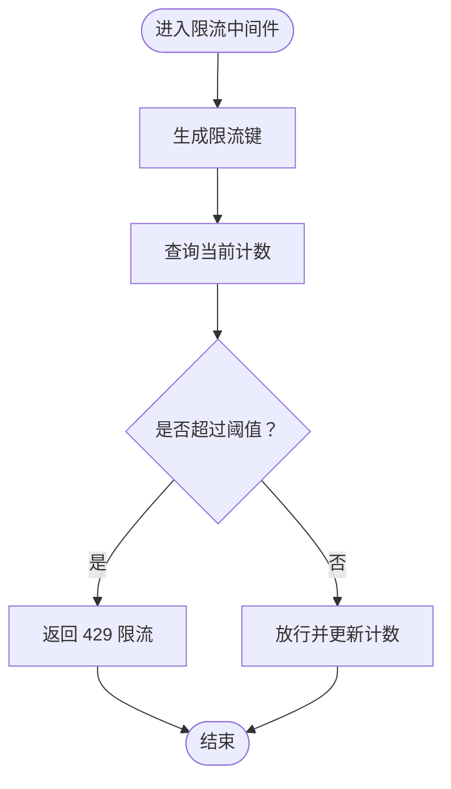
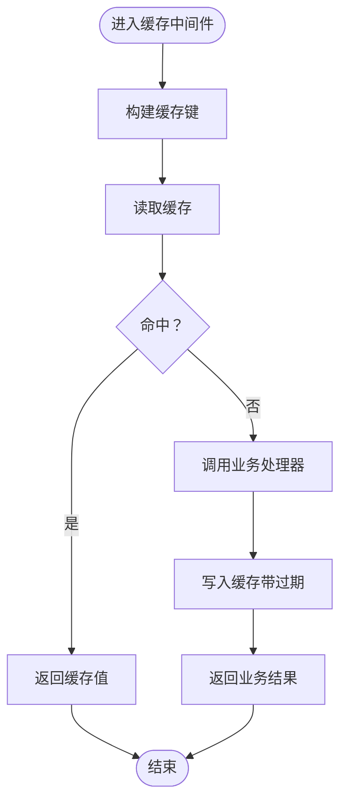
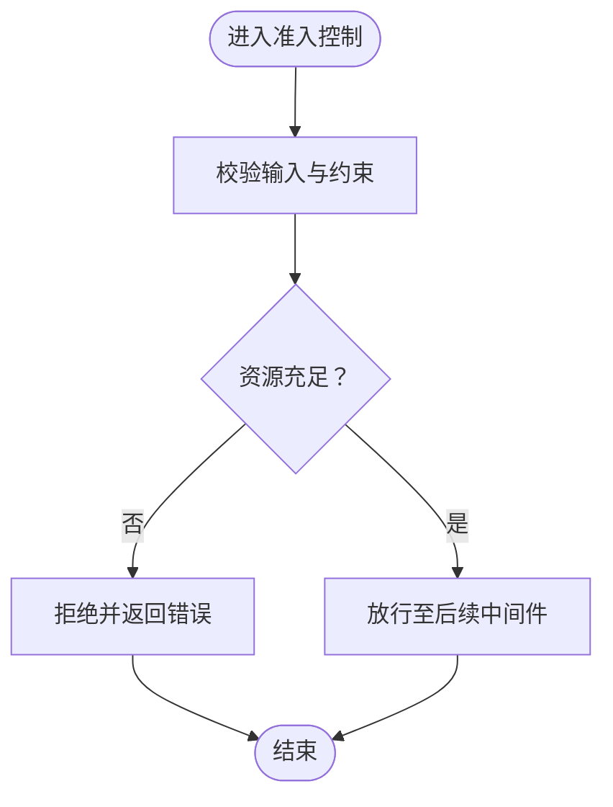
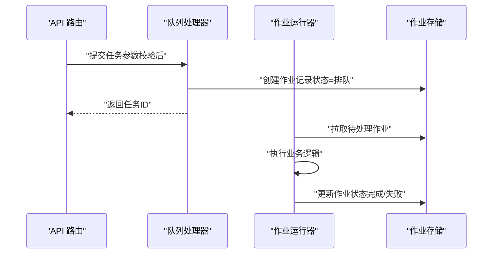
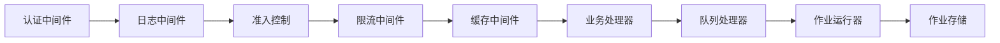

# 中间件系统

<cite>
**本文引用的文件**   
- [src/app/api/director/pipeline/route.ts](file://src/app/api/director/pipeline/route.ts)
- [src/app/api/director/stage/route.ts](file://src/app/api/director/stage/route.ts)
- [src/app/api/render/route.ts](file://src/app/api/render/route.ts)
- [src/app/api/projects/route.ts](file://src/app/api/projects/route.ts)
- [src/app/api/artifacts/[id]/route.ts](file://src/app/api/artifacts/[id]/route.ts)
- [src/lib/api.ts](file://src/lib/api.ts)
- [src/features/render/cache.ts](file://src/features/render/cache.ts)
- [src/features/render/admission.ts](file://src/features/render/admission.ts)
- [src/features/render/queue-handler.ts](file://src/features/render/queue-handler.ts)
- [server/src/server/job-runner.ts](file://server/src/server/job-runner.ts)
- [server/src/server/job-store.ts](file://server/src/server/job-store.ts)
- [server/src/server/api.ts](file://server/src/server/api.ts)
- [server/src/lib/logger.ts](file://server/src/lib/logger.ts)
- [server/src/lib/error-message.ts](file://server/src/lib/error-message.ts)
- [server/src/lib/load-env.ts](file://server/src/lib/load-env.ts)
</cite>

## 目录
1. [简介](#简介)
2. [项目结构](#项目结构)
3. [核心组件](#核心组件)
4. [架构总览](#架构总览)
5. [详细组件分析](#详细组件分析)
6. [依赖关系分析](#依赖关系分析)
7. [性能考量](#性能考量)
8. [故障排查指南](#故障排查指南)
9. [结论](#结论)
10. [附录](#附录)

## 简介
本技术文档面向 PurpleInK 的中间件系统，聚焦于请求处理管道、响应拦截机制与可扩展的中间件开发模式。文档覆盖认证、日志记录、错误处理等通用中间件的实现思路；并给出性能监控、限流、缓存等高级中间件的设计模式与实践建议。同时提供调试技巧与性能优化策略，帮助开发者快速定位问题并提升系统吞吐与稳定性。

## 项目结构
PurpleInK 采用 Next.js App Router 组织 API 路由，结合 server 子工程中的作业运行器与存储组件，形成“HTTP 入口 → 业务路由 → 领域服务 → 队列/持久化”的分层架构。中间件以“函数式包装”的方式嵌入到各 API 路由中，通过统一的参数校验、鉴权、日志与错误处理流程，保证一致性与可观测性。

**图示来源** 
- [src/app/api/director/pipeline/route.ts](file://src/app/api/director/pipeline/route.ts)
- [src/app/api/render/route.ts](file://src/app/api/render/route.ts)
- [server/src/server/job-runner.ts](file://server/src/server/job-runner.ts)
- [server/src/server/job-store.ts](file://server/src/server/job-store.ts)
- [src/features/render/cache.ts](file://src/features/render/cache.ts)

**章节来源**
- [src/app/api/director/pipeline/route.ts](file://src/app/api/director/pipeline/route.ts)
- [src/app/api/render/route.ts](file://src/app/api/render/route.ts)
- [server/src/server/job-runner.ts](file://server/src/server/job-runner.ts)
- [server/src/server/job-store.ts](file://server/src/server/job-store.ts)
- [src/features/render/cache.ts](file://src/features/render/cache.ts)

## 核心组件
- 请求入口与路由：Next.js API Route 作为 HTTP 入口，负责解析请求、调用业务逻辑并返回响应。
- 中间件链：在路由内部或统一封装处串联认证、日志、参数校验、限流、缓存等横切关注点。
- 业务处理器：按领域划分（渲染、导演、项目、制品），承载具体业务逻辑。
- 队列与存储：将耗时操作异步化，使用作业运行器与存储组件保障可靠性与幂等性。
- 缓存层：对读多写少的数据提供快速访问能力，降低后端压力。

**章节来源**
- [src/lib/api.ts](file://src/lib/api.ts)
- [src/app/api/projects/route.ts](file://src/app/api/projects/route.ts)
- [src/app/api/artifacts/[id]/route.ts](file://src/app/api/artifacts/[id]/route.ts)
- [src/features/render/admission.ts](file://src/features/render/admission.ts)
- [src/features/render/queue-handler.ts](file://src/features/render/queue-handler.ts)
- [src/features/render/cache.ts](file://src/features/render/cache.ts)

## 架构总览
下图展示了从 HTTP 请求进入，到中间件链执行、业务处理、以及可能的异步队列与缓存交互的整体流程。

**图示来源** 
- [src/app/api/render/route.ts](file://src/app/api/render/route.ts)
- [src/app/api/director/pipeline/route.ts](file://src/app/api/director/pipeline/route.ts)
- [src/features/render/queue-handler.ts](file://src/features/render/queue-handler.ts)
- [server/src/server/job-runner.ts](file://server/src/server/job-runner.ts)
- [server/src/server/job-store.ts](file://server/src/server/job-store.ts)
- [src/features/render/cache.ts](file://src/features/render/cache.ts)

## 详细组件分析

### 认证中间件
- 职责：验证请求身份与权限，拒绝非法访问。
- 实现要点：
  - 从请求头或会话中提取凭证（如 Token）。
  - 校验签名、有效期与权限范围。
  - 失败时返回标准错误码与消息。
- 集成位置：通常在中间件链最前，确保后续步骤无需重复鉴权。

**图示来源** 
- [src/lib/api.ts](file://src/lib/api.ts)
- [src/app/api/projects/route.ts](file://src/app/api/projects/route.ts)

**章节来源**
- [src/lib/api.ts](file://src/lib/api.ts)
- [src/app/api/projects/route.ts](file://src/app/api/projects/route.ts)

### 日志记录中间件
- 职责：记录请求上下文、耗时、关键事件与异常堆栈。
- 实现要点：
  - 统一日志格式（时间戳、请求ID、方法、路径、状态码、耗时）。
  - 敏感信息脱敏（如密码、Token）。
  - 结构化输出便于检索与分析。
- 集成位置：包裹整个请求生命周期，确保捕获所有分支。

**图示来源** 
- [server/src/lib/logger.ts](file://server/src/lib/logger.ts)
- [src/app/api/render/route.ts](file://src/app/api/render/route.ts)

**章节来源**
- [server/src/lib/logger.ts](file://server/src/lib/logger.ts)
- [src/app/api/render/route.ts](file://src/app/api/render/route.ts)

### 错误处理中间件
- 职责：统一捕获异常、标准化错误响应、避免泄露内部细节。
- 实现要点：
  - 区分业务错误与系统错误。
  - 返回一致的 JSON 结构与状态码。
  - 记录必要上下文以便排障。
- 集成位置：中间件链末尾，确保所有上游异常被兜底。

**图示来源** 
- [server/src/lib/error-message.ts](file://server/src/lib/error-message.ts)
- [src/app/api/artifacts/[id]/route.ts](file://src/app/api/artifacts/[id]/route.ts)

**章节来源**
- [server/src/lib/error-message.ts](file://server/src/lib/error-message.ts)
- [src/app/api/artifacts/[id]/route.ts](file://src/app/api/artifacts/[id]/route.ts)

### 限流中间件
- 职责：限制单位时间内请求数量，防止滥用与过载。
- 实现要点：
  - 基于 IP、用户 ID 或 API Key 进行计数。
  - 支持滑动窗口或令牌桶算法。
  - 超限返回 429 并附带重试提示。
- 集成位置：认证之后、业务之前，避免对未认证流量造成误伤。

**图示来源** 
- [src/lib/api.ts](file://src/lib/api.ts)
- [src/app/api/render/route.ts](file://src/app/api/render/route.ts)

**章节来源**
- [src/lib/api.ts](file://src/lib/api.ts)
- [src/app/api/render/route.ts](file://src/app/api/render/route.ts)

### 缓存中间件
- 职责：对读多写少的接口提供缓存加速，减少后端压力。
- 实现要点：
  - 基于请求特征生成缓存键（方法、路径、查询参数）。
  - 设置合理的过期时间与失效策略。
  - 支持读写穿透与回源保护。
- 集成位置：认证与限流之后，业务之前。

**图示来源** 
- [src/features/render/cache.ts](file://src/features/render/cache.ts)
- [src/app/api/render/route.ts](file://src/app/api/render/route.ts)

**章节来源**
- [src/features/render/cache.ts](file://src/features/render/cache.ts)
- [src/app/api/render/route.ts](file://src/app/api/render/route.ts)

### 准入控制中间件（Admission）
- 职责：在进入核心处理前进行资源与配额检查，避免无效负载进入系统。
- 实现要点：
  - 校验输入合法性与大小限制。
  - 检查可用资源（并发度、队列长度、存储空间）。
  - 不满足条件时快速失败，释放资源。
- 集成位置：认证与日志之后，限流与缓存之前。

**图示来源** 
- [src/features/render/admission.ts](file://src/features/render/admission.ts)

**章节来源**
- [src/features/render/admission.ts](file://src/features/render/admission.ts)

### 队列与作业处理（异步中间件）
- 职责：将耗时任务放入队列，由作业运行器消费执行，提高吞吐与弹性。
- 实现要点：
  - 路由层仅做轻量校验与入队，立即返回任务 ID。
  - 作业运行器拉取任务、执行并持久化状态。
  - 支持重试、幂等与进度回调。
- 集成位置：业务处理器内部根据场景选择同步或异步。

**图示来源** 
- [src/features/render/queue-handler.ts](file://src/features/render/queue-handler.ts)
- [server/src/server/job-runner.ts](file://server/src/server/job-runner.ts)
- [server/src/server/job-store.ts](file://server/src/server/job-store.ts)

**章节来源**
- [src/features/render/queue-handler.ts](file://src/features/render/queue-handler.ts)
- [server/src/server/job-runner.ts](file://server/src/server/job-runner.ts)
- [server/src/server/job-store.ts](file://server/src/server/job-store.ts)

### 配置与环境加载
- 职责：集中管理环境变量与运行时配置，确保中间件行为可配置。
- 实现要点：
  - 统一加载 .env 与默认值。
  - 暴露配置项给中间件（如限流阈值、缓存 TTL、日志级别）。
  - 启动时校验必填项并提供友好错误提示。

**章节来源**
- [server/src/lib/load-env.ts](file://server/src/lib/load-env.ts)

## 依赖关系分析
中间件之间遵循低耦合、高内聚原则，通过函数式组合串联。典型依赖如下：
- 认证中间件依赖安全库与配置。
- 日志中间件依赖日志框架与脱敏工具。
- 错误处理中间件依赖错误分类与格式化模块。
- 限流中间件依赖计数器或外部存储（内存/Redis）。
- 缓存中间件依赖缓存存储（内存/Redis/DB）。
- 准入控制依赖业务规则与资源监控。
- 队列处理器依赖作业运行器与存储。

**图示来源** 
- [src/lib/api.ts](file://src/lib/api.ts)
- [server/src/lib/logger.ts](file://server/src/lib/logger.ts)
- [src/features/render/admission.ts](file://src/features/render/admission.ts)
- [src/features/render/cache.ts](file://src/features/render/cache.ts)
- [src/features/render/queue-handler.ts](file://src/features/render/queue-handler.ts)
- [server/src/server/job-runner.ts](file://server/src/server/job-runner.ts)
- [server/src/server/job-store.ts](file://server/src/server/job-store.ts)

**章节来源**
- [src/lib/api.ts](file://src/lib/api.ts)
- [server/src/lib/logger.ts](file://server/src/lib/logger.ts)
- [src/features/render/admission.ts](file://src/features/render/admission.ts)
- [src/features/render/cache.ts](file://src/features/render/cache.ts)
- [src/features/render/queue-handler.ts](file://src/features/render/queue-handler.ts)
- [server/src/server/job-runner.ts](file://server/src/server/job-runner.ts)
- [server/src/server/job-store.ts](file://server/src/server/job-store.ts)

## 性能考量
- 中间件顺序优化：将快速失败的中间件（认证、限流、准入）前置，减少不必要的计算。
- 缓存命中率：合理设计缓存键与 TTL，避免热点键失效风暴。
- 异步化：将耗时操作放入队列，缩短请求响应时间。
- 日志采样：在高并发下对日志进行采样或降级，避免 I/O 瓶颈。
- 资源隔离：为不同租户或 API 版本设置独立限流与配额。
- 监控指标：暴露关键指标（QPS、延迟分布、错误率、缓存命中率、队列积压）。

[本节为通用指导，不直接分析具体文件]

## 故障排查指南
- 常见问题定位：
  - 认证失败：检查凭证格式、签名校验与权限范围。
  - 限流触发：查看限流键与阈值配置，确认是否存在异常流量。
  - 缓存不一致：核对缓存键生成逻辑与失效策略。
  - 队列堆积：检查作业运行器并发度与消费者健康状态。
- 调试技巧：
  - 开启详细日志并关联请求 ID。
  - 使用模拟请求与最小复现用例。
  - 逐步禁用中间件定位问题所在。
- 恢复策略：
  - 快速扩容与降级开关。
  - 重试与熔断机制。
  - 数据补偿与幂等处理。

**章节来源**
- [server/src/lib/error-message.ts](file://server/src/lib/error-message.ts)
- [server/src/lib/logger.ts](file://server/src/lib/logger.ts)
- [src/features/render/queue-handler.ts](file://src/features/render/queue-handler.ts)

## 结论
PurpleInK 的中间件系统通过清晰的层次与可扩展的函数式组合，实现了认证、日志、错误处理、限流、缓存与准入控制等横切关注点的统一管理。借助队列与作业运行器，系统将耗时操作异步化，提升了整体吞吐与稳定性。开发者可依据本文档的模式与最佳实践，快速扩展自定义中间件并优化系统性能。

[本节为总结，不直接分析具体文件]

## 附录
- 自定义中间件开发指南：
  - 定义中间件函数签名（接收上下文与下一步回调）。
  - 明确职责边界，避免跨域副作用。
  - 提供配置项与默认值，便于环境差异。
  - 编写单元测试覆盖正常与异常路径。
- 参数配置建议：
  - 限流阈值按租户与 API 维度配置。
  - 缓存 TTL 按数据新鲜度要求设定。
  - 日志级别按环境动态调整。
- 错误处理策略：
  - 统一错误码与消息模板。
  - 区分可恢复与不可恢复错误。
  - 对外只暴露必要信息，内部记录完整上下文。

[本节为补充说明，不直接分析具体文件]