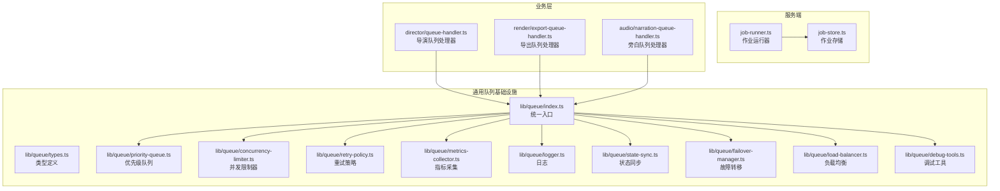
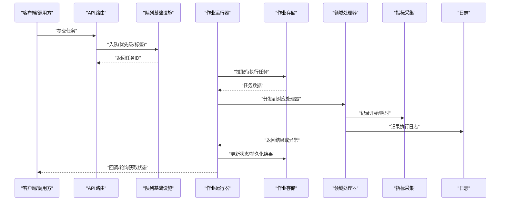
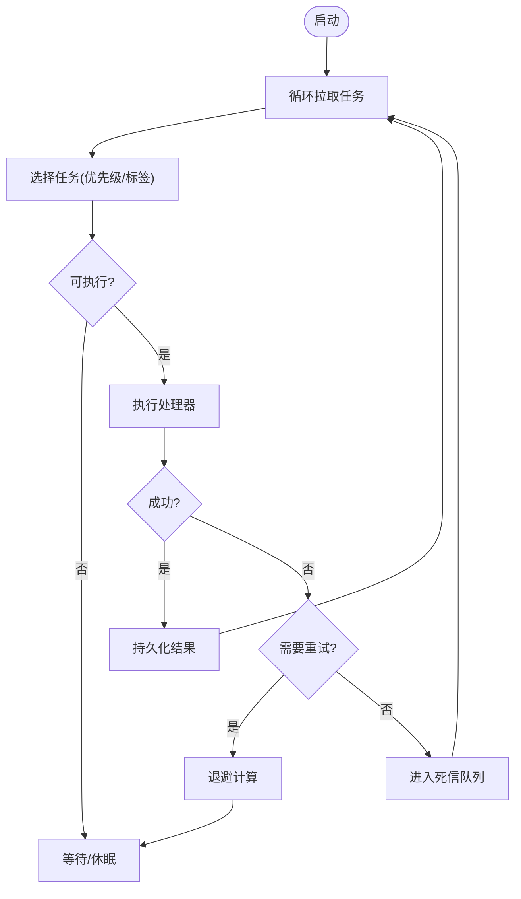
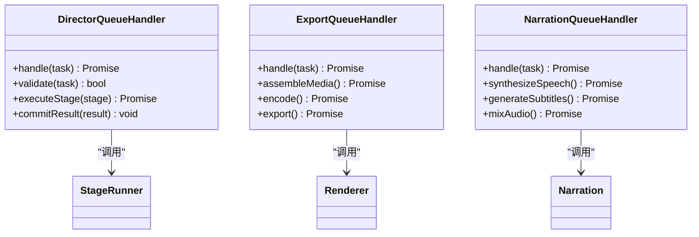
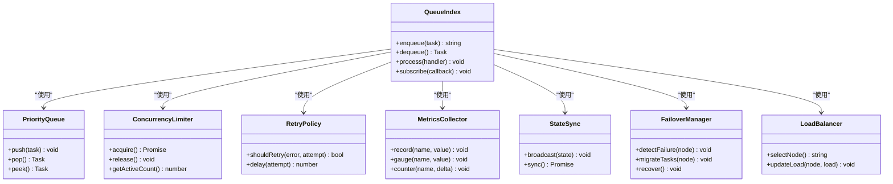
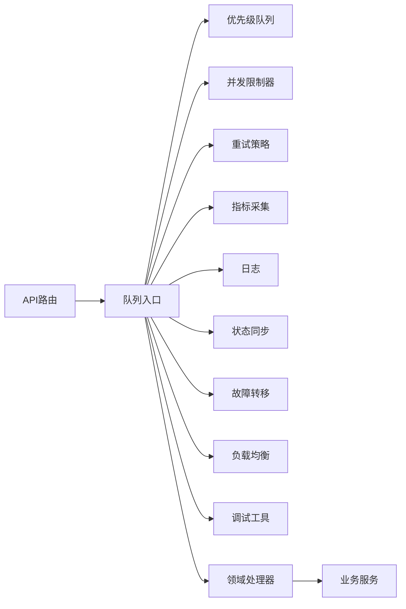

# 任务处理

<cite>
**本文引用的文件**   
- [server/src/server/job-runner.ts](file://server/src/server/job-runner.ts)
- [server/src/server/job-store.ts](file://server/src/server/job-store.ts)
- [src/features/director/queue-handler.ts](file://src/features/director/queue-handler.ts)
- [src/features/render/export-queue-handler.ts](file://src/features/render/export-queue-handler.ts)
- [src/features/audio/narration-queue-handler.ts](file://src/features/audio/narration-queue-handler.ts)
- [src/lib/queue/index.ts](file://src/lib/queue/index.ts)
- [src/lib/queue/types.ts](file://src/lib/queue/types.ts)
- [src/lib/queue/priority-queue.ts](file://src/lib/queue/priority-queue.ts)
- [src/lib/queue/concurrency-limiter.ts](file://src/lib/queue/concurrency-limiter.ts)
- [src/lib/queue/retry-policy.ts](file://src/lib/queue/retry-policy.ts)
- [src/lib/queue/metrics-collector.ts](file://src/lib/queue/metrics-collector.ts)
- [src/lib/queue/logger.ts](file://src/lib/queue/logger.ts)
- [src/lib/queue/state-sync.ts](file://src/lib/queue/state-sync.ts)
- [src/lib/queue/failover-manager.ts](file://src/lib/queue/failover-manager.ts)
- [src/lib/queue/load-balancer.ts](file://src/lib/queue/load-balancer.ts)
- [src/lib/queue/debug-tools.ts](file://src/lib/queue/debug-tools.ts)
- [src/features/director/advance.ts](file://src/features/director/advance.ts)
- [src/features/director/stage-runner.ts](file://src/features/director/stage-runner.ts)
- [src/features/render/renderer.ts](file://src/features/render/renderer.ts)
- [src/features/audio/narration.ts](file://src/features/audio/narration.ts)
</cite>

## 目录
1. [简介](#简介)
2. [项目结构](#项目结构)
3. [核心组件](#核心组件)
4. [架构总览](#架构总览)
5. [详细组件分析](#详细组件分析)
6. [依赖关系分析](#依赖关系分析)
7. [性能考虑](#性能考虑)
8. [故障排查指南](#故障排查指南)
9. [结论](#结论)
10. [附录](#附录)

## 简介
本文件为 PurpleInk 任务处理系统的全面技术文档，聚焦于异步任务架构设计、作业队列模型、任务调度算法与并发控制机制。文档覆盖任务生命周期管理（创建、排队、执行、重试、失败处理）、分布式任务处理（负载均衡、故障转移、状态同步）、监控与日志记录（指标收集、错误追踪、调试工具），并提供具体任务类型示例与自定义任务开发指南，帮助读者快速理解并扩展系统能力。

## 项目结构
PurpleInk 的任务处理由“服务端作业运行器”和“前端/业务层队列处理器”共同组成：
- 服务端作业运行器负责持久化存储、作业调度与执行编排。
- 业务层队列处理器按领域划分（导演、渲染、音频等），实现具体的任务逻辑与策略。
- 通用队列基础设施提供优先级队列、并发限制、重试策略、指标采集、日志、状态同步、故障转移与负载均衡等能力。

**图表来源** 
- [server/src/server/job-runner.ts](file://server/src/server/job-runner.ts)
- [server/src/server/job-store.ts](file://server/src/server/job-store.ts)
- [src/lib/queue/index.ts](file://src/lib/queue/index.ts)
- [src/lib/queue/types.ts](file://src/lib/queue/types.ts)
- [src/lib/queue/priority-queue.ts](file://src/lib/queue/priority-queue.ts)
- [src/lib/queue/concurrency-limiter.ts](file://src/lib/queue/concurrency-limiter.ts)
- [src/lib/queue/retry-policy.ts](file://src/lib/queue/retry-policy.ts)
- [src/lib/queue/metrics-collector.ts](file://src/lib/queue/metrics-collector.ts)
- [src/lib/queue/logger.ts](file://src/lib/queue/logger.ts)
- [src/lib/queue/state-sync.ts](file://src/lib/queue/state-sync.ts)
- [src/lib/queue/failover-manager.ts](file://src/lib/queue/failover-manager.ts)
- [src/lib/queue/load-balancer.ts](file://src/lib/queue/load-balancer.ts)
- [src/lib/queue/debug-tools.ts](file://src/lib/queue/debug-tools.ts)

**章节来源**
- [server/src/server/job-runner.ts](file://server/src/server/job-runner.ts)
- [server/src/server/job-store.ts](file://server/src/server/job-store.ts)
- [src/lib/queue/index.ts](file://src/lib/queue/index.ts)

## 核心组件
- 作业运行器（Job Runner）：负责任务的拉取、调度、执行与结果回写，协调存储与运行时上下文。
- 作业存储（Job Store）：提供任务的持久化、状态查询与事务性更新。
- 领域队列处理器：各业务域（导演、渲染、音频）的任务处理器，封装具体执行逻辑与策略。
- 通用队列基础设施：优先级队列、并发限制、重试策略、指标采集、日志、状态同步、故障转移、负载均衡、调试工具。

**章节来源**
- [server/src/server/job-runner.ts](file://server/src/server/job-runner.ts)
- [server/src/server/job-store.ts](file://server/src/server/job-store.ts)
- [src/features/director/queue-handler.ts](file://src/features/director/queue-handler.ts)
- [src/features/render/export-queue-handler.ts](file://src/features/render/export-queue-handler.ts)
- [src/features/audio/narration-queue-handler.ts](file://src/features/audio/narration-queue-handler.ts)
- [src/lib/queue/index.ts](file://src/lib/queue/index.ts)

## 架构总览
下图展示任务从创建到执行的端到端流程，以及分布式场景下的关键交互。

**图表来源** 
- [server/src/server/job-runner.ts](file://server/src/server/job-runner.ts)
- [server/src/server/job-store.ts](file://server/src/server/job-store.ts)
- [src/lib/queue/index.ts](file://src/lib/queue/index.ts)
- [src/lib/queue/metrics-collector.ts](file://src/lib/queue/metrics-collector.ts)
- [src/lib/queue/logger.ts](file://src/lib/queue/logger.ts)

## 详细组件分析

### 作业运行器（Job Runner）
- 职责：周期性拉取任务、分配给处理器、管理执行上下文、处理重试与失败、更新状态。
- 关键点：
  - 拉取策略：基于优先级与标签选择任务，避免饥饿。
  - 执行编排：串行/并行执行，结合并发限制器控制资源使用。
  - 失败处理：根据重试策略进行指数退避或立即重试，最终进入死信队列。
  - 状态同步：与存储层保持强一致性，确保跨实例可见性。

**图表来源** 
- [server/src/server/job-runner.ts](file://server/src/server/job-runner.ts)
- [server/src/server/job-store.ts](file://server/src/server/job-store.ts)
- [src/lib/queue/retry-policy.ts](file://src/lib/queue/retry-policy.ts)

**章节来源**
- [server/src/server/job-runner.ts](file://server/src/server/job-runner.ts)
- [server/src/server/job-store.ts](file://server/src/server/job-store.ts)
- [src/lib/queue/retry-policy.ts](file://src/lib/queue/retry-policy.ts)

### 作业存储（Job Store）
- 职责：任务持久化、状态查询、事务性更新、索引优化。
- 关键点：
  - 状态机：待执行、执行中、成功、失败、重试中、死信。
  - 原子操作：通过数据库事务保证状态变更的一致性。
  - 查询优化：按优先级、标签、创建时间等维度建立索引。

**章节来源**
- [server/src/server/job-store.ts](file://server/src/server/job-store.ts)

### 领域队列处理器
- 导演队列处理器：编排分镜、提示词生成、阶段推进与产物写入。
- 导出队列处理器：媒体组装、编码、导出与缩略图生成。
- 旁白队列处理器：文本转语音、字幕生成、音频合成与质量检查。

**图表来源** 
- [src/features/director/queue-handler.ts](file://src/features/director/queue-handler.ts)
- [src/features/render/export-queue-handler.ts](file://src/features/render/export-queue-handler.ts)
- [src/features/audio/narration-queue-handler.ts](file://src/features/audio/narration-queue-handler.ts)
- [src/features/director/stage-runner.ts](file://src/features/director/stage-runner.ts)
- [src/features/render/renderer.ts](file://src/features/render/renderer.ts)
- [src/features/audio/narration.ts](file://src/features/audio/narration.ts)

**章节来源**
- [src/features/director/queue-handler.ts](file://src/features/director/queue-handler.ts)
- [src/features/render/export-queue-handler.ts](file://src/features/render/export-queue-handler.ts)
- [src/features/audio/narration-queue-handler.ts](file://src/features/audio/narration-queue-handler.ts)

### 通用队列基础设施
- 统一入口（index.ts）：对外暴露 enqueue、dequeue、process、subscribe 等接口。
- 类型定义（types.ts）：任务结构、状态枚举、策略配置。
- 优先级队列（priority-queue.ts）：支持多级优先级与公平调度。
- 并发限制器（concurrency-limiter.ts）：按资源维度限制并发度。
- 重试策略（retry-policy.ts）：支持固定间隔、指数退避、抖动与最大重试次数。
- 指标采集（metrics-collector.ts）：吞吐、延迟、错误率、队列长度等。
- 日志（logger.ts）：结构化日志、分级输出、上下文注入。
- 状态同步（state-sync.ts）：跨实例状态广播与一致性校验。
- 故障转移（failover-manager.ts）：节点宕机检测、任务迁移与恢复。
- 负载均衡（load-balancer.ts）：按负载、地域、资源占用分配任务。
- 调试工具（debug-tools.ts）：快照、回放、慢查询分析。

**图表来源** 
- [src/lib/queue/index.ts](file://src/lib/queue/index.ts)
- [src/lib/queue/types.ts](file://src/lib/queue/types.ts)
- [src/lib/queue/priority-queue.ts](file://src/lib/queue/priority-queue.ts)
- [src/lib/queue/concurrency-limiter.ts](file://src/lib/queue/concurrency-limiter.ts)
- [src/lib/queue/retry-policy.ts](file://src/lib/queue/retry-policy.ts)
- [src/lib/queue/metrics-collector.ts](file://src/lib/queue/metrics-collector.ts)
- [src/lib/queue/state-sync.ts](file://src/lib/queue/state-sync.ts)
- [src/lib/queue/failover-manager.ts](file://src/lib/queue/failover-manager.ts)
- [src/lib/queue/load-balancer.ts](file://src/lib/queue/load-balancer.ts)

**章节来源**
- [src/lib/queue/index.ts](file://src/lib/queue/index.ts)
- [src/lib/queue/types.ts](file://src/lib/queue/types.ts)
- [src/lib/queue/priority-queue.ts](file://src/lib/queue/priority-queue.ts)
- [src/lib/queue/concurrency-limiter.ts](file://src/lib/queue/concurrency-limiter.ts)
- [src/lib/queue/retry-policy.ts](file://src/lib/queue/retry-policy.ts)
- [src/lib/queue/metrics-collector.ts](file://src/lib/queue/metrics-collector.ts)
- [src/lib/queue/logger.ts](file://src/lib/queue/logger.ts)
- [src/lib/queue/state-sync.ts](file://src/lib/queue/state-sync.ts)
- [src/lib/queue/failover-manager.ts](file://src/lib/queue/failover-manager.ts)
- [src/lib/queue/load-balancer.ts](file://src/lib/queue/load-balancer.ts)
- [src/lib/queue/debug-tools.ts](file://src/lib/queue/debug-tools.ts)

## 依赖关系分析
- 低耦合：业务处理器仅依赖队列基础设施接口，不关心底层实现。
- 高内聚：每个处理器封装自身领域的完整执行逻辑。
- 可扩展：新增任务类型只需实现处理器并注册到队列入口。
- 可观测：指标与日志贯穿全链路，便于问题定位与性能调优。

**图表来源** 
- [src/lib/queue/index.ts](file://src/lib/queue/index.ts)
- [src/lib/queue/priority-queue.ts](file://src/lib/queue/priority-queue.ts)
- [src/lib/queue/concurrency-limiter.ts](file://src/lib/queue/concurrency-limiter.ts)
- [src/lib/queue/retry-policy.ts](file://src/lib/queue/retry-policy.ts)
- [src/lib/queue/metrics-collector.ts](file://src/lib/queue/metrics-collector.ts)
- [src/lib/queue/logger.ts](file://src/lib/queue/logger.ts)
- [src/lib/queue/state-sync.ts](file://src/lib/queue/state-sync.ts)
- [src/lib/queue/failover-manager.ts](file://src/lib/queue/failover-manager.ts)
- [src/lib/queue/load-balancer.ts](file://src/lib/queue/load-balancer.ts)
- [src/lib/queue/debug-tools.ts](file://src/lib/queue/debug-tools.ts)

**章节来源**
- [src/lib/queue/index.ts](file://src/lib/queue/index.ts)

## 性能考虑
- 优先级与公平调度：避免长尾任务饿死，合理设置权重与超时。
- 并发控制：按 CPU、内存、IO 维度限制并发，防止资源争用。
- 重试策略：指数退避+抖动降低雪崩风险，设置最大重试次数。
- 批处理：合并小任务，减少锁竞争与序列化开销。
- 缓存与幂等：对重复请求去重，利用缓存加速热点路径。
- 监控告警：关键指标阈值告警，提前发现瓶颈。

[本节为通用指导，无需特定文件引用]

## 故障排查指南
- 常见问题：
  - 任务堆积：检查并发限制、处理器性能、下游依赖可用性。
  - 频繁重试：查看重试策略配置、错误类型分类、外部服务限流。
  - 状态不一致：确认事务边界、状态同步机制、网络分区处理。
- 调试工具：
  - 快照与回放：捕获任务输入与中间状态，复现问题。
  - 慢查询分析：识别耗时步骤，优化 SQL 或外部调用。
  - 指标看板：观察吞吐、延迟、错误率趋势。

**章节来源**
- [src/lib/queue/debug-tools.ts](file://src/lib/queue/debug-tools.ts)
- [src/lib/queue/metrics-collector.ts](file://src/lib/queue/metrics-collector.ts)
- [src/lib/queue/logger.ts](file://src/lib/queue/logger.ts)

## 结论
PurpleInk 任务处理系统通过清晰的分层设计与完善的队列基础设施，实现了高可靠、可扩展、可观测的异步任务处理能力。业务处理器与基础设施解耦，便于独立演进；分布式特性保障系统在复杂环境下的稳定性与弹性。建议在生产环境中充分启用监控与调试工具，持续优化性能与可靠性。

[本节为总结性内容，无需特定文件引用]

## 附录
- 自定义任务开发指南：
  - 定义任务类型与数据结构。
  - 实现处理器类，封装执行逻辑与错误处理。
  - 注册到队列入口，配置优先级与重试策略。
  - 添加指标与日志，便于监控与排查。
- 最佳实践：
  - 任务幂等设计，避免重复执行副作用。
  - 合理拆分任务粒度，平衡吞吐与延迟。
  - 使用标签与优先级区分任务类型与紧急程度。
  - 定期清理死信队列，分析失败模式。

[本节为补充说明，无需特定文件引用]