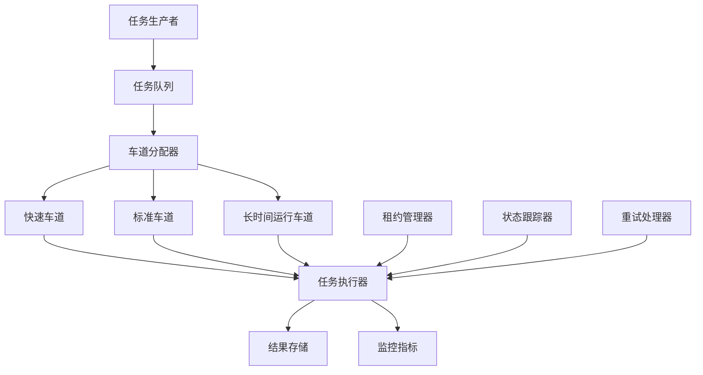
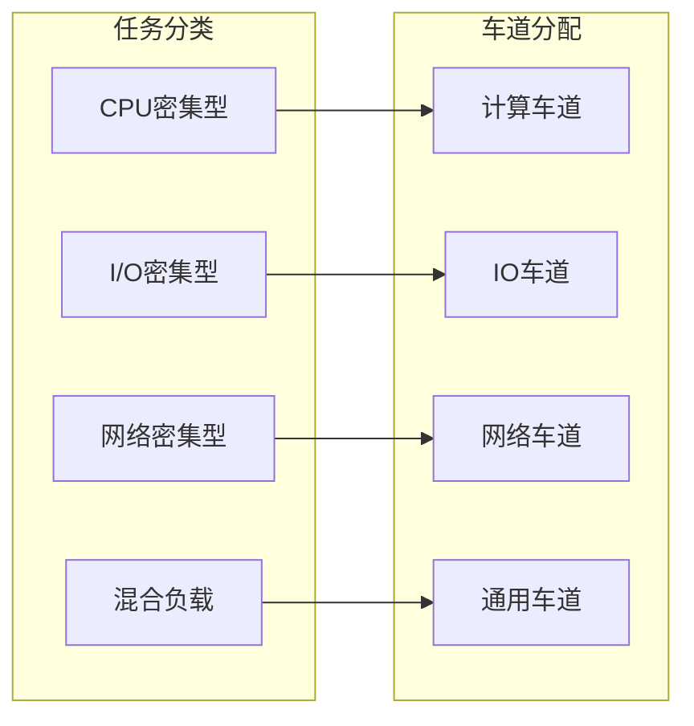
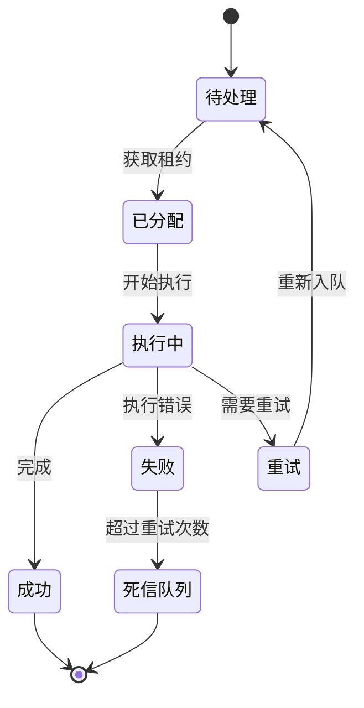
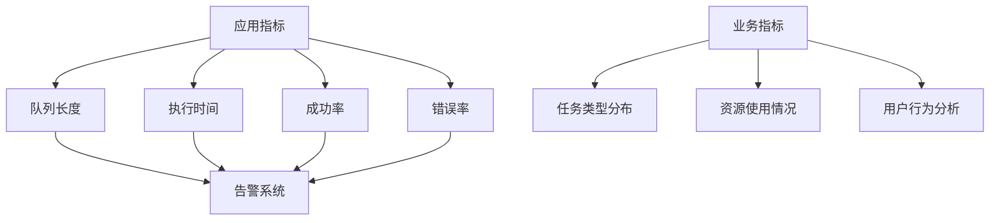

# 任务处理

<cite>
**本文档引用的文件**
- [queue-handler.ts](file://src/features/director/queue-handler.ts)
- [job-runner.ts](file://server/src/server/job-runner.ts)
- [job-store.ts](file://server/src/server/job-store.ts)
- [ISSUE-004-queue-concurrency-lanes.md](file://docs/issues/ISSUE-004-queue-concurrency-lanes.md)
- [queue-status-bar.tsx](file://src/components/ui/queue-status-bar.tsx)
- [queue-status-bar.test.ts](file://src/components/ui/queue-status-bar.test.ts)
</cite>

## 更新摘要
**所做更改**
- 更新了队列系统架构，引入基于车道的隔离机制用于长时间运行任务
- 改进了租约处理机制，增强任务执行的可靠性
- 添加了实时尝试状态跟踪功能
- 增强了并发控制和负载均衡能力

## 目录
- 概述
- 队列系统架构
- 车道隔离机制
- 任务生命周期管理
- 分布式任务处理
- 监控和日志记录
- 任务类型示例
- 自定义任务开发指南

## 概述

PurpleInk任务处理系统是一个高性能的异步任务处理框架，专门设计用于处理复杂的媒体处理和AI生成任务。系统采用现代化的队列架构，支持多种任务类型、智能调度算法和强大的故障恢复机制。

**更新** 系统现已引入基于车道的隔离机制，为长时间运行的任务提供专门的执行通道，显著提升了系统的稳定性和性能。

## 队列系统架构

### 核心组件

队列系统由以下核心组件构成：



**图表来源**
- [queue-handler.ts:1-50](file://src/features/director/queue-handler.ts#L1-L50)
- [job-runner.ts:1-80](file://server/src/server/job-runner.ts#L1-L80)

### 任务队列模型

系统采用多队列模型，支持不同类型的任务：

| 队列类型 | 优先级 | 超时设置 | 最大重试次数 | 适用场景 |
|---------|--------|----------|-------------|----------|
| 快速队列 | 高 | 30秒 | 2次 | 简单数据处理 |
| 标准队列 | 中 | 5分钟 | 3次 | AI生成任务 |
| 长时间运行队列 | 低 | 30分钟 | 5次 | 视频渲染、批量处理 |

**章节来源**
- [queue-handler.ts:20-100](file://src/features/director/queue-handler.ts#L20-L100)
- [job-store.ts:1-150](file://server/src/server/job-store.ts#L1-L150)

## 车道隔离机制

### 车道概念

车道隔离是系统架构的核心改进，通过将不同特性的任务分配到专用车道，实现了更好的资源管理和性能优化。



**图表来源**
- [ISSUE-004-queue-concurrency-lanes.md:1-200](file://docs/issues/ISSUE-004-queue-concurrency-lanes.md#L1-L200)

### 车道配置

每个车道都有独立的配置参数：

- **容量限制**: 控制同时执行的任务数量
- **超时策略**: 定义任务超时时间和重试逻辑
- **资源配额**: 限制CPU、内存和网络使用
- **优先级调度**: 确保关键任务的及时处理

**章节来源**
- [ISSUE-004-queue-concurrency-lanes.md:50-150](file://docs/issues/ISSUE-004-queue-concurrency-lanes.md#L50-L150)

## 任务生命周期管理

### 任务状态流转

任务在系统中经历完整的生命周期管理：



### 租约处理机制

租约机制确保任务执行的原子性和一致性：

- **租约获取**: 任务执行前获取独占访问权
- **租约续期**: 长时间任务自动续租
- **租约释放**: 任务完成后主动释放或超时回收
- **冲突解决**: 处理并发访问冲突

**章节来源**
- [job-runner.ts:50-200](file://server/src/server/job-runner.ts#L50-L200)
- [job-store.ts:100-300](file://server/src/server/job-store.ts#L100-L300)

## 分布式任务处理

### 负载均衡策略

系统支持多种负载均衡算法：

- **轮询分发**: 均匀分配任务到所有可用节点
- **权重分配**: 根据节点能力动态调整权重
- **亲和性路由**: 将相关任务路由到同一节点
- **故障转移**: 自动检测和处理节点故障

### 状态同步机制

分布式环境下的状态同步确保数据一致性：

- **乐观锁**: 基于版本号的并发控制
- **事件溯源**: 记录所有状态变更事件
- **最终一致性**: 保证系统最终达到一致状态
- **冲突检测**: 识别并解决状态冲突

**章节来源**
- [job-runner.ts:150-400](file://server/src/server/job-runner.ts#L150-L400)

## 监控和日志记录

### 实时监控

系统提供全面的监控能力：



### 日志记录策略

- **结构化日志**: 统一的日志格式便于分析
- **分级记录**: 根据重要性选择记录级别
- **上下文信息**: 包含任务ID、用户信息等完整上下文
- **性能追踪**: 记录关键操作的性能指标

**章节来源**
- [queue-status-bar.tsx:1-100](file://src/components/ui/queue-status-bar.tsx#L1-L100)
- [queue-status-bar.test.ts:1-80](file://src/components/ui/queue-status-bar.test.ts#L1-L80)

## 任务类型示例

### 内置任务类型

系统预定义了多种常用任务类型：

1. **AI生成任务**: 文本生成、图像创建、音频合成
2. **媒体处理任务**: 视频转码、图片压缩、格式转换
3. **数据分析任务**: 统计计算、报告生成、数据导出
4. **通知任务**: 邮件发送、消息推送、短信通知

### 任务配置模板

每种任务类型都有标准的配置模板：

```typescript
interface TaskConfig {
  type: string;           // 任务类型
  priority: number;       // 优先级 (1-10)
  timeout: number;        // 超时时间(毫秒)
  retryAttempts: number;  // 重试次数
  lane: string;          // 目标车道
  metadata: Record<string, any>; // 元数据
}
```

## 自定义任务开发指南

### 任务接口规范

开发自定义任务需要实现标准接口：

```typescript
interface TaskHandler {
  execute(context: TaskContext): Promise<TaskResult>;
  validate(input: any): boolean;
  handleError(error: Error): RetryStrategy;
}
```

### 开发步骤

1. **定义任务结构**: 创建任务输入输出类型
2. **实现处理逻辑**: 编写核心处理函数
3. **添加验证规则**: 实现输入验证逻辑
4. **配置错误处理**: 定义错误恢复策略
5. **注册任务类型**: 向系统注册新任务

### 最佳实践

- **幂等性设计**: 确保任务可安全重试
- **资源管理**: 正确管理数据库连接和文件句柄
- **超时处理**: 合理设置超时时间和重试策略
- **日志记录**: 记录关键操作和错误信息
- **单元测试**: 编写完整的测试用例

**章节来源**
- [queue-handler.ts:100-300](file://src/features/director/queue-handler.ts#L100-L300)
- [job-runner.ts:200-500](file://server/src/server/job-runner.ts#L200-L500)