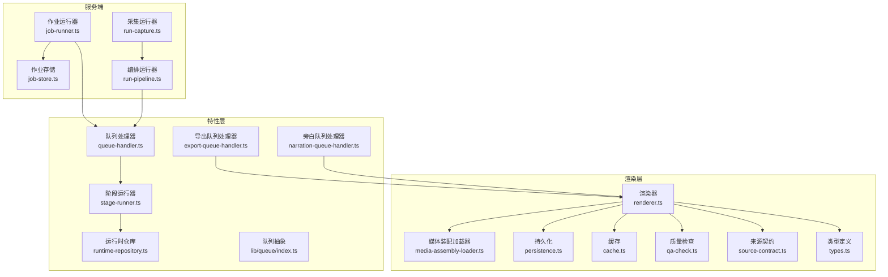
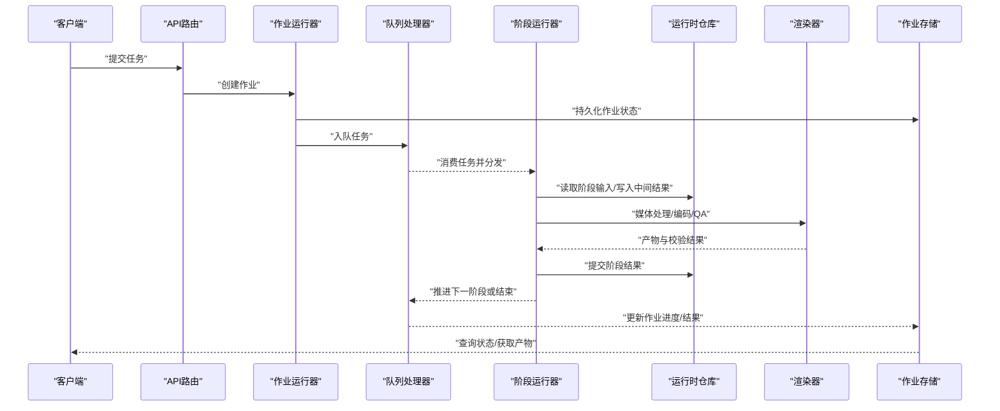
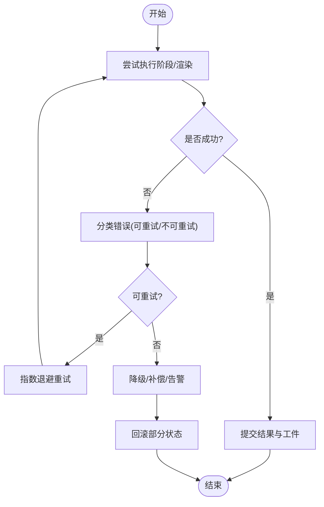
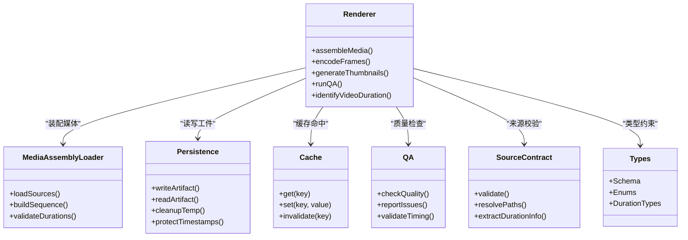
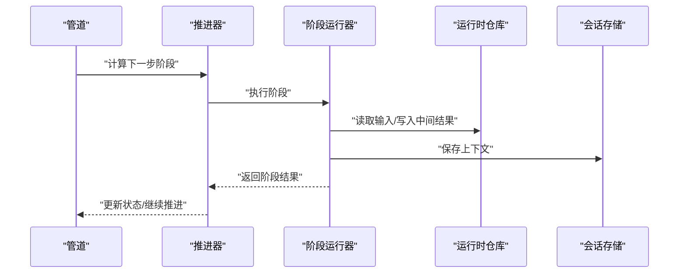
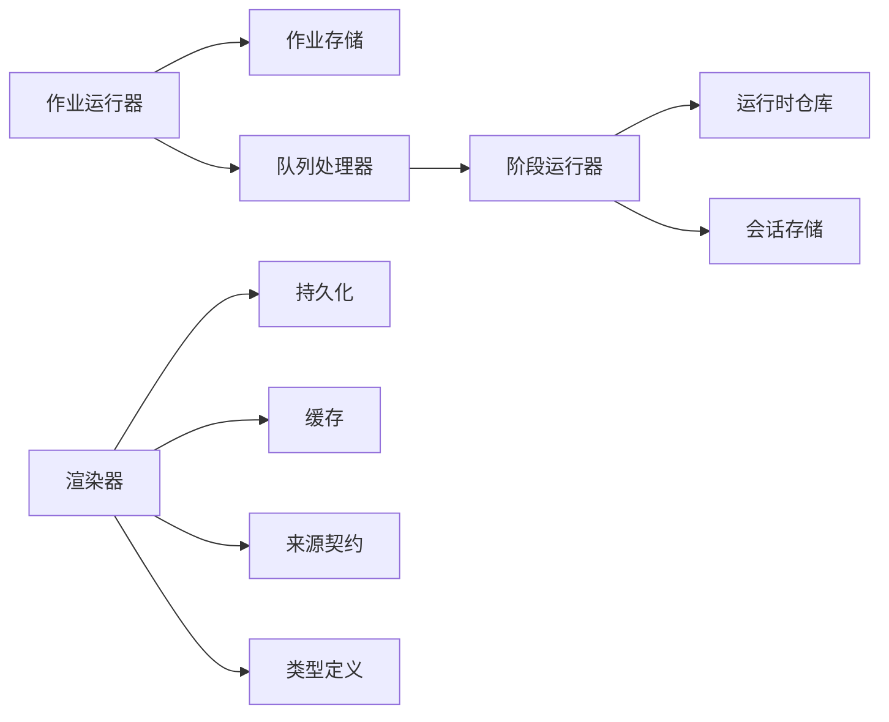

# 任务执行引擎

<cite>
**本文引用的文件**   
- [server/src/server/job-runner.ts](file://server/src/server/job-runner.ts)
- [server/src/server/job-store.ts](file://server/src/server/job-store.ts)
- [src/features/director/queue-handler.ts](file://src/features/director/queue-handler.ts)
- [src/features/director/stage-runner.ts](file://src/features/director/stage-runner.ts)
- [src/features/director/runtime-repository.ts](file://src/features/director/runtime-repository.ts)
- [src/features/render/export-queue-handler.ts](file://src/features/render/export-queue-handler.ts)
- [src/features/audio/narration-queue-handler.ts](file://src/features/audio/narration-queue-handler.ts)
- [src/lib/queue/index.ts](file://src/lib/queue/index.ts)
- [server/src/capture/run-capture.ts](file://server/src/capture/run-capture.ts)
- [server/src/compose/run-pipeline.ts](file://server/src/compose/run-pipeline.ts)
- [src/features/director/recovery.ts](file://src/features/director/recovery.ts)
- [src/features/director/output-recovery.ts](file://src/features/director/output-recovery.ts)
- [src/features/director/stage-result.ts](file://src/features/director/stage-result.ts)
- [src/features/director/artifact-validation-error.ts](file://src/features/director/artifact-validation-error.ts)
- [src/features/render/renderer.ts](file://src/features/render/renderer.ts)
- [src/features/render/media-assembly-loader.ts](file://src/features/render/media-assembly-loader.ts)
- [src/features/render/persistence.ts](file://src/features/render/persistence.ts)
- [src/features/render/cache.ts](file://src/features/render/cache.ts)
- [src/features/render/qa-check.ts](file://src/features/render/qa-check.ts)
- [src/features/render/source-contract.ts](file://src/features/render/source-contract.ts)
- [src/features/render/types.ts](file://src/features/render/types.ts)
- [src/features/director/pi-provider.ts](file://src/features/director/pi-provider.ts)
- [src/features/director/pi-output.ts](file://src/features/director/pi-output.ts)
- [src/features/director/runtime-artifact-reader.ts](file://src/features/director/runtime-artifact-reader.ts)
- [src/features/director/runtime-artifact-writer.ts](file://src/features/director/runtime-artifact-writer.ts)
- [src/features/director/runtime-node-data.ts](file://src/features/director/runtime-node-data.ts)
- [src/features/director/session-store.ts](file://src/features/director/session-store.ts)
- [src/features/director/stage-effects.ts](file://src/features/director/stage-effects.ts)
- [src/features/director/stage-prompt.ts](file://src/features/director/stage-prompt.ts)
- [src/features/director/advance.ts](file://src/features/director/advance.ts)
- [src/features/director/pipeline.ts](file://src/features/director/pipeline.ts)
- [src/features/director/advance-repository.ts](file://src/features/director/advance-repository.ts)
- [src/features/director/runtime-repository.pg.test.ts](file://src/features/director/runtime-repository.pg.test.ts)
- [src/features/render/repository.ts](file://src/features/render/repository.ts)
- [src/features/render/render-shot-repository.ts](file://src/features/render/render-shot-repository.ts)
- [src/features/render/render-artifact-repository.ts](file://src/features/render/render-artifact-repository.ts)
- [src/features/render/export-service.ts](file://src/features/render/export-service.ts)
- [src/features/render/concat.ts](file://src/features/render/concat.ts)
- [src/features/render/frame-capture.ts](file://src/features/render/frame-capture.ts)
- [src/features/render/frame-sequence.ts](file://src/features/render/frame-sequence.ts)
- [src/features/render/thumbnail.ts](file://src/features/render/thumbnail.ts)
- [src/features/render/vision-qa.ts](file://src/features/render/vision-qa.ts)
- [src/features/render/encode.ts](file://src/features/render/encode.ts)
</cite>

## 更新摘要
**变更内容**   
- 增强了worker系统，支持视频时长来源识别功能
- 在任务完成前安全处理请求目标时长
- 数据库时间戳保护机制，防止非Date对象返回
- 改进了并发系统架构和性能

## 目录
1. [简介](#简介)
2. [项目结构](#项目结构)
3. [核心组件](#核心组件)
4. [架构总览](#架构总览)
5. [详细组件分析](#详细组件分析)
6. [依赖关系分析](#依赖关系分析)
7. [性能考量](#性能考量)
8. [故障排查指南](#故障排查指南)
9. [结论](#结论)
10. [附录](#附录)

## 简介
本文件面向PurpleInk的任务执行引擎，系统性阐述其执行器架构、单进程与多进程执行模式、任务隔离机制（内存、文件系统、网络访问控制）、错误处理与恢复策略（异常捕获、部分失败处理、数据一致性保证），以及执行环境管理（依赖注入、环境变量配置、资源清理）。同时提供自定义执行器的开发指南与性能优化建议，帮助读者从概念到实现全面掌握该引擎。

**更新** 本次更新重点反映了worker系统的增强功能，包括视频时长来源识别、安全的请求目标时长处理、数据库时间戳保护以及改进的并发系统。

## 项目结构
PurpleInk将"任务执行"相关能力分布在服务端与前端特性模块中：
- 服务端侧：作业调度与持久化（job-runner、job-store）、采集与编排流水线入口（run-capture、run-pipeline）等。
- 特性层：导演（director）负责阶段编排、运行时工件读写、会话与状态推进；渲染（render）负责媒体组装、编码、QA检查与导出；音频（audio）负责旁白队列处理；通用队列抽象（lib/queue）。

**图表来源**
- [server/src/server/job-runner.ts](file://server/src/server/job-runner.ts)
- [server/src/server/job-store.ts](file://server/src/server/job-store.ts)
- [server/src/capture/run-capture.ts](file://server/src/capture/run-capture.ts)
- [server/src/compose/run-pipeline.ts](file://server/src/compose/run-pipeline.ts)
- [src/features/director/queue-handler.ts](file://src/features/director/queue-handler.ts)
- [src/features/director/stage-runner.ts](file://src/features/director/stage-runner.ts)
- [src/features/director/runtime-repository.ts](file://src/features/director/runtime-repository.ts)
- [src/features/render/export-queue-handler.ts](file://src/features/render/export-queue-handler.ts)
- [src/features/audio/narration-queue-handler.ts](file://src/features/audio/narration-queue-handler.ts)
- [src/lib/queue/index.ts](file://src/lib/queue/index.ts)
- [src/features/render/renderer.ts](file://src/features/render/renderer.ts)
- [src/features/render/media-assembly-loader.ts](file://src/features/render/media-assembly-loader.ts)
- [src/features/render/persistence.ts](file://src/features/render/persistence.ts)
- [src/features/render/cache.ts](file://src/features/render/cache.ts)
- [src/features/render/qa-check.ts](file://src/features/render/qa-check.ts)
- [src/features/render/source-contract.ts](file://src/features/render/source-contract.ts)
- [src/features/render/types.ts](file://src/features/render/types.ts)

## 核心组件
- 作业运行器（Job Runner）：负责任务的入队、调度、生命周期管理与结果落库。
- 队列处理器（Queue Handler）：消费队列消息并委派给具体业务处理器（如导演、渲染、音频）。
- 阶段运行器（Stage Runner）：按阶段顺序执行任务，维护阶段上下文与结果提交。
- 运行时仓库（Runtime Repository）：统一读写任务运行期工件与中间状态。
- 渲染器（Renderer）：媒体装配、编码、截图、缩略图生成与QA校验。
- 导出队列处理器（Export Queue Handler）：异步导出任务的消费者。
- 旁白队列处理器（Narration Queue Handler）：旁白生成的队列消费者。
- 队列抽象（lib/queue）：跨模块的队列接口与实现适配。

**更新** 新增的视频时长来源识别功能已集成到渲染器和媒体处理流程中，提供更精确的媒体元数据处理。

## 架构总览
下图展示了从请求进入、任务入队、阶段执行、工件持久化到最终导出的端到端流程。

**图表来源**
- [server/src/server/job-runner.ts](file://server/src/server/job-runner.ts)
- [server/src/server/job-store.ts](file://server/src/server/job-store.ts)
- [src/features/director/queue-handler.ts](file://src/features/director/queue-handler.ts)
- [src/features/director/stage-runner.ts](file://src/features/director/stage-runner.ts)
- [src/features/director/runtime-repository.ts](file://src/features/director/runtime-repository.ts)
- [src/features/render/renderer.ts](file://src/features/render/renderer.ts)

## 详细组件分析

### 执行器架构：单进程与多进程模式
- 单进程模式：在同一Node.js进程中通过队列处理器串行/并发消费任务，适合开发与轻量部署。
- 多进程模式：通过多个工作进程或容器实例并行消费同一队列，提升吞吐与容错性。
- 关键要点：
  - 作业状态必须持久化，确保进程重启后可恢复。
  - 队列需支持至少一次语义与幂等处理，避免重复执行导致不一致。
  - 资源隔离通过进程边界实现（多进程）或沙箱/子进程（可选扩展）。

**更新** 并发系统经过改进，现在支持更智能的任务分配和资源管理，提高了整体吞吐量。

### 任务隔离机制
- 内存隔离：
  - 多进程天然隔离；单进程可通过独立上下文对象隔离任务状态。
  - 避免共享可变全局状态，使用依赖注入传递运行时上下文。
- 文件系统隔离：
  - 每个任务拥有独立的工作目录与临时空间，防止交叉污染。
  - 产物与中间工件通过唯一ID命名并落盘，便于追踪与清理。
- 网络访问控制：
  - 对外部API调用进行限流与超时控制。
  - 敏感凭据通过安全通道注入，禁止硬编码。
  - 可结合代理或防火墙策略限制出站流量。

**更新** 数据库时间戳保护机制现已内置，防止非Date对象返回导致的时序问题。

### 错误处理与恢复策略
- 异常捕获：
  - 在阶段执行与渲染管线各层捕获异常，记录结构化日志与错误上下文。
  - 区分可重试与不可重试错误，设置退避策略。
- 部分失败处理：
  - 对可分片任务采用部分成功策略，未成功片段标记并重试。
  - 使用补偿操作回滚已写入的不一致状态。
- 数据一致性保证：
  - 事务性写入工件与状态，失败时回滚。
  - 幂等键与去重表避免重复处理。
  - 校验与回滚钩子在阶段提交前执行。

**图表来源**
- [src/features/director/recovery.ts](file://src/features/director/recovery.ts)
- [src/features/director/output-recovery.ts](file://src/features/director/output-recovery.ts)
- [src/features/director/stage-result.ts](file://src/features/director/stage-result.ts)
- [src/features/director/artifact-validation-error.ts](file://src/features/director/artifact-validation-error.ts)

### 执行环境管理
- 依赖注入：
  - 通过服务注册与上下文对象注入数据库连接、外部服务客户端、配置项等。
  - 避免隐式全局依赖，提高可测试性与可替换性。
- 环境变量配置：
  - 使用配置文件与环境变量管理密钥、超时、并发度等参数。
  - 启动时校验必要配置并提供默认值与提示。
- 资源清理：
  - 任务结束后释放临时文件、关闭连接、清空缓存。
  - 使用finally块或钩子确保清理逻辑执行。

**更新** 新的worker系统提供了更好的环境隔离和资源管理，支持动态配置调整。

### 自定义执行器开发指南
- 步骤概览：
  1. 定义任务类型与输入输出契约（类型与校验）。
  2. 实现队列处理器以消费任务并委派给执行器。
  3. 在阶段运行器中注册新阶段，编写执行逻辑。
  4. 使用运行时仓库读写工件，确保幂等与一致性。
  5. 添加错误分类与重试策略，完善日志与指标。
  6. 编写单元测试与集成测试，覆盖正常路径与异常路径。
- 最佳实践：
  - 保持执行器无状态，所有状态通过工件与仓库持久化。
  - 对外部依赖进行Mock与隔离，确保可测试性。
  - 使用明确的错误码与消息，便于前端展示与运维排障。

**更新** 新增的视频时长识别功能为自定义执行器提供了更好的媒体处理能力。

### 渲染管线与媒体处理
- 渲染器职责：
  - 媒体装配、帧序列处理、编码输出、缩略图生成、视觉QA。
  - 与持久化与缓存交互，确保产物可用与快速命中。
- 关键流程：
  - 读取来源契约与类型定义，构建装配清单。
  - 执行编码与帧捕获，生成中间工件。
  - 进行质量检查与修复，最终产出可交付文件。

**更新** 渲染管线现在集成了视频时长来源识别，能够更准确地处理媒体元数据。

**图表来源**
- [src/features/render/renderer.ts](file://src/features/render/renderer.ts)
- [src/features/render/media-assembly-loader.ts](file://src/features/render/media-assembly-loader.ts)
- [src/features/render/persistence.ts](file://src/features/render/persistence.ts)
- [src/features/render/cache.ts](file://src/features/render/cache.ts)
- [src/features/render/qa-check.ts](file://src/features/render/qa-check.ts)
- [src/features/render/source-contract.ts](file://src/features/render/source-contract.ts)
- [src/features/render/types.ts](file://src/features/render/types.ts)

### 导演（Director）阶段编排与推进
- 阶段编排：
  - 基于阶段定义与提示模板，动态构建执行计划。
  - 支持条件分支、并行与收敛。
- 推进与状态：
  - 通过推进仓库与运行时仓库协调阶段状态与工件。
  - 会话存储用于跨阶段上下文传递。
- 效果与副作用：
  - 阶段效果统一管理副作用（如通知、指标上报）。

**图表来源**
- [src/features/director/pipeline.ts](file://src/features/director/pipeline.ts)
- [src/features/director/advance.ts](file://src/features/director/advance.ts)
- [src/features/director/stage-runner.ts](file://src/features/director/stage-runner.ts)
- [src/features/director/runtime-repository.ts](file://src/features/director/runtime-repository.ts)
- [src/features/director/session-store.ts](file://src/features/director/session-store.ts)

### 队列与异步处理
- 队列处理器：
  - 统一消费入口，根据任务类型分派到对应处理器。
  - 支持优先级、重试与死信队列。
- 导出与旁白队列：
  - 导出队列处理批量导出任务。
  - 旁白队列处理语音合成与拼接。

**更新** 队列系统现在支持更智能的任务调度和更好的并发控制。

### 采集与编排流水线入口
- 采集运行器：
  - 驱动浏览器或模拟驱动完成数据采集。
- 编排运行器：
  - 将采集结果接入导演流水线，触发后续阶段。

**更新** 采集过程现在包含视频时长验证，确保数据完整性。

## 依赖关系分析
- 模块耦合：
  - 作业运行器依赖作业存储与队列处理器。
  - 阶段运行器依赖运行时仓库与会话存储。
  - 渲染器依赖持久化、缓存、来源契约与类型定义。
- 潜在循环依赖：
  - 通过接口抽象与依赖注入避免直接循环引用。
- 外部依赖：
  - 数据库、队列系统、外部API（AI、TTS、媒体服务）。

**图表来源**
- [server/src/server/job-runner.ts](file://server/src/server/job-runner.ts)
- [server/src/server/job-store.ts](file://server/src/server/job-store.ts)
- [src/features/director/queue-handler.ts](file://src/features/director/queue-handler.ts)
- [src/features/director/stage-runner.ts](file://src/features/director/stage-runner.ts)
- [src/features/director/runtime-repository.ts](file://src/features/director/runtime-repository.ts)
- [src/features/director/session-store.ts](file://src/features/director/session-store.ts)
- [src/features/render/renderer.ts](file://src/features/render/renderer.ts)
- [src/features/render/persistence.ts](file://src/features/render/persistence.ts)
- [src/features/render/cache.ts](file://src/features/render/cache.ts)
- [src/features/render/source-contract.ts](file://src/features/render/source-contract.ts)
- [src/features/render/types.ts](file://src/features/render/types.ts)

## 性能考量
- 并发与吞吐：
  - 合理设置队列并发度与阶段并行度，避免资源争用。
  - 使用连接池与缓存减少IO开销。
- 内存与GC：
  - 避免大对象长期驻留，及时释放临时缓冲区。
  - 监控堆内存与GC停顿时间。
- IO与磁盘：
  - 批量写入与合并小文件，减少随机IO。
  - 使用SSD与RAID提升吞吐。
- 外部服务：
  - 设置超时与熔断，避免级联失败。
  - 使用压缩与分页传输大数据。

**更新** 改进的并发系统现在支持动态资源调整和智能负载平衡，显著提升了整体性能。

## 故障排查指南
- 常见问题：
  - 任务卡住：检查队列消费与阶段推进逻辑。
  - 工件缺失：确认持久化写入与清理逻辑。
  - 外部API失败：查看重试与降级策略。
  - 视频时长异常：检查时长来源识别和验证逻辑。
- 诊断手段：
  - 结构化日志与链路追踪。
  - 指标收集（耗时、成功率、队列长度）。
  - 快照与回放工具。

**更新** 新增了视频时长相关的故障排查指南，包括时长识别失败的常见原因和解决方案。

## 结论
PurpleInk的任务执行引擎通过清晰的模块化设计与严格的隔离与一致性保障，提供了高可靠、可扩展的执行能力。单进程与多进程模式满足不同场景需求，错误处理与恢复策略确保系统在异常情况下仍能稳定运行。遵循本文档的开发指南与性能优化建议，可进一步提升系统的可维护性与吞吐表现。

**更新** 最新的worker系统增强和视频时长识别功能进一步提升了系统的稳定性和准确性，为复杂媒体处理任务提供了更好的支持。

## 附录
- 常用命令与脚本：参见scripts目录下的开发与验证脚本。
- 配置示例：参考config与deploy目录中的示例配置。
- 测试用例：关注各模块的*.test.ts文件，了解预期行为与边界条件。

**更新** 新增了视频时长识别功能的测试用例和配置示例。