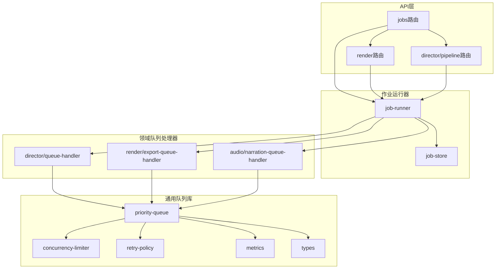
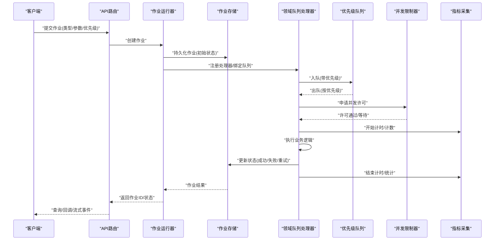
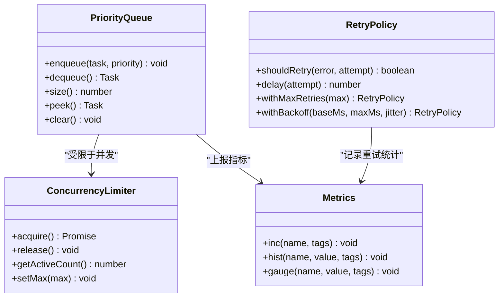
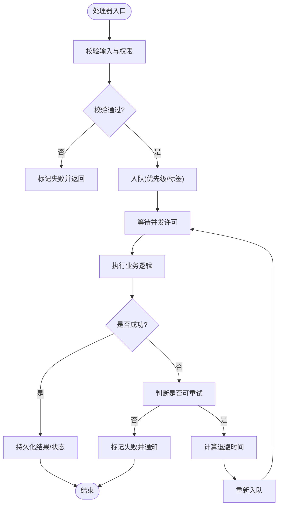
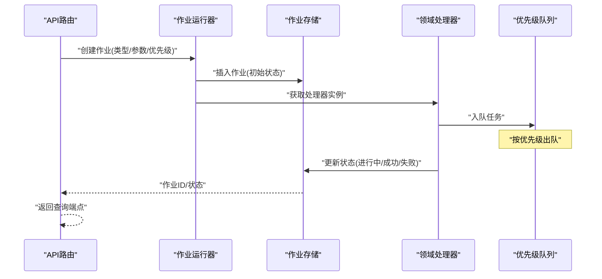
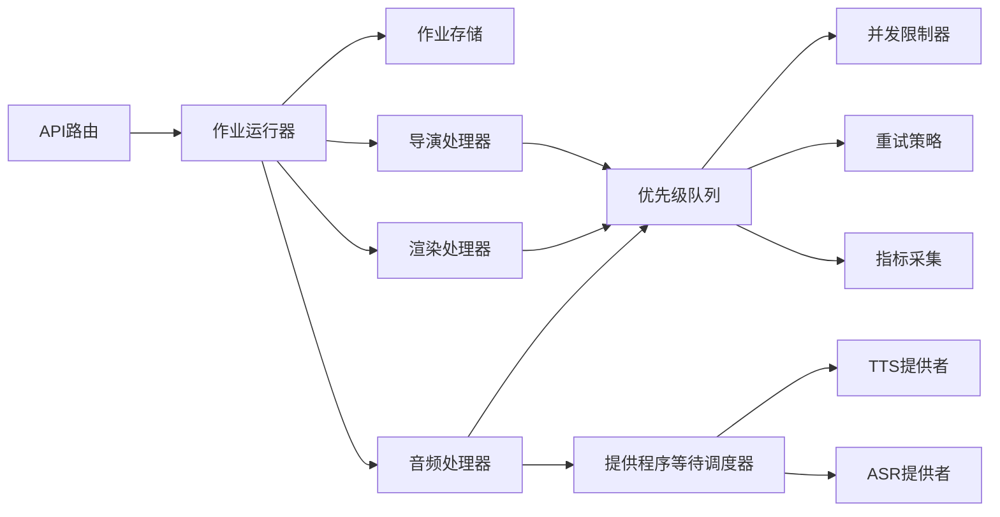

# 任务调度器

<cite>
**本文引用的文件**   
- [server/src/server/job-runner.ts](file://server/src/server/job-runner.ts)
- [server/src/server/job-store.ts](file://server/src/server/job-store.ts)
- [src/features/director/queue-handler.ts](file://src/features/director/queue-handler.ts)
- [src/features/render/export-queue-handler.ts](file://src/features/render/export-queue-handler.ts)
- [src/features/audio/narration-queue-handler.ts](file://src/features/audio/narration-queue-handler.ts)
- [src/lib/queue/index.ts](file://src/lib/queue/index.ts)
- [src/lib/queue/types.ts](file://src/lib/queue/types.ts)
- [src/lib/queue/priority-queue.ts](file://src/lib/queue/priority-queue.ts)
- [src/lib/queue/concurrency-limiter.ts](file://src/lib/queue/concurrency-limiter.ts)
- [src/lib/queue/retry-policy.ts](file://src/lib/queue/retry-policy.ts)
- [src/lib/queue/metrics.ts](file://src/lib/queue/metrics.ts)
- [src/app/api/jobs/[id]/route.ts](file://src/app/api/jobs/[id]/route.ts)
- [src/app/api/render/route.ts](file://src/app/api/render/route.ts)
- [src/app/api/director/pipeline/route.ts](file://src/app/api/director/pipeline/route.ts)
</cite>

## 更新摘要
**所做更改**   
- 更新了提供程序等待调度器的重构内容，实现了TTS和ASR提供者的更安全等待状态管理
- 增强了状态投影机制，确保PostgreSQL存储中的状态一致性
- 完善了失败模式规范，提高系统可靠性
- 优化了并发控制和资源管理机制

## 目录
1. [简介](#简介)
2. [项目结构](#项目结构)
3. [核心组件](#核心组件)
4. [架构总览](#架构总览)
5. [详细组件分析](#详细组件分析)
6. [依赖分析](#依赖分析)
7. [性能考虑](#性能考虑)
8. [故障排查指南](#故障排查指南)
9. [结论](#结论)
10. [附录](#附录)

## 简介
本文件面向 PurpleInk 的任务调度子系统，系统性阐述调度算法（轮询、权重、优先级）、并发控制（线程池/执行器、资源限制、死锁预防）、任务生命周期（提交、分配、执行、完成、失败处理）、配置选项（并发度、超时、重试）以及监控接口与性能调优建议。文档以仓库中实际实现为依据，结合可视化图示帮助读者快速理解并落地使用。

**更新** 本次更新重点改进了提供程序等待调度器的安全性，特别是在TTS和ASR提供者中的等待状态管理和失败处理机制。

## 项目结构
PurpleInk 的任务调度由"通用队列库 + 领域队列处理器 + 服务端作业运行器"三层构成：
- 通用队列库：提供优先级队列、并发限制、重试策略、指标采集等基础能力。
- 领域队列处理器：在导演、渲染、音频等子系统中按业务语义消费队列任务。
- 服务端作业运行器：对外暴露作业 API，持久化作业状态，驱动作业生命周期。

**图表来源**
- [src/app/api/jobs/[id]/route.ts](file://src/app/api/jobs/[id]/route.ts)
- [src/app/api/render/route.ts](file://src/app/api/render/route.ts)
- [src/app/api/director/pipeline/route.ts](file://src/app/api/director/pipeline/route.ts)
- [server/src/server/job-runner.ts](file://server/src/server/job-runner.ts)
- [server/src/server/job-store.ts](file://server/src/server/job-store.ts)
- [src/features/director/queue-handler.ts](file://src/features/director/queue-handler.ts)
- [src/features/render/export-queue-handler.ts](file://src/features/render/export-queue-handler.ts)
- [src/features/audio/narration-queue-handler.ts](file://src/features/audio/narration-queue-handler.ts)
- [src/lib/queue/priority-queue.ts](file://src/lib/queue/priority-queue.ts)
- [src/lib/queue/concurrency-limiter.ts](file://src/lib/queue/concurrency-limiter.ts)
- [src/lib/queue/retry-policy.ts](file://src/lib/queue/retry-policy.ts)
- [src/lib/queue/metrics.ts](file://src/lib/queue/metrics.ts)
- [src/lib/queue/types.ts](file://src/lib/queue/types.ts)

**章节来源**
- [server/src/server/job-runner.ts](file://server/src/server/job-runner.ts)
- [server/src/server/job-store.ts](file://server/src/server/job-store.ts)
- [src/lib/queue/index.ts](file://src/lib/queue/index.ts)
- [src/lib/queue/types.ts](file://src/lib/queue/types.ts)

## 核心组件
- 通用队列库
  - 优先级队列：支持基于优先级的任务出队与公平性保障。
  - 并发限制器：控制同时运行的任务数，避免资源耗尽。
  - 重试策略：可配置退避与最大重试次数，区分可恢复与不可恢复错误。
  - 指标采集：记录入队、出队、成功、失败、耗时等关键指标。
- 领域队列处理器
  - 导演队列处理器：编排导演阶段任务（如分镜生成、素材整理）。
  - 渲染导出队列处理器：处理视频/图片导出、缩略图生成等。
  - 音频旁白队列处理器：处理TTS合成、字幕对齐、媒体拼接。
- 服务端作业运行器
  - 作业运行器：接收外部请求，持久化作业，协调领域处理器执行。
  - 作业存储：维护作业状态机、结果与元数据。

**更新** 音频旁白队列处理器现在包含增强的TTS和ASR提供者等待状态管理，提供更安全的并发控制和失败恢复机制。

**章节来源**
- [src/lib/queue/priority-queue.ts](file://src/lib/queue/priority-queue.ts)
- [src/lib/queue/concurrency-limiter.ts](file://src/lib/queue/concurrency-limiter.ts)
- [src/lib/queue/retry-policy.ts](file://src/lib/queue/retry-policy.ts)
- [src/lib/queue/metrics.ts](file://src/lib/queue/metrics.ts)
- [src/features/director/queue-handler.ts](file://src/features/director/queue-handler.ts)
- [src/features/render/export-queue-handler.ts](file://src/features/render/export-queue-handler.ts)
- [src/features/audio/narration-queue-handler.ts](file://src/features/audio/narration-queue-handler.ts)
- [server/src/server/job-runner.ts](file://server/src/server/job-runner.ts)
- [server/src/server/job-store.ts](file://server/src/server/job-store.ts)

## 架构总览
下图展示从 API 到作业运行器、再到领域处理器与通用队列的调用链，体现任务的提交、派发、执行与反馈闭环。

**图表来源**
- [src/app/api/jobs/[id]/route.ts](file://src/app/api/jobs/[id]/route.ts)
- [server/src/server/job-runner.ts](file://server/src/server/job-runner.ts)
- [server/src/server/job-store.ts](file://server/src/server/job-store.ts)
- [src/features/director/queue-handler.ts](file://src/features/director/queue-handler.ts)
- [src/lib/queue/priority-queue.ts](file://src/lib/queue/priority-queue.ts)
- [src/lib/queue/concurrency-limiter.ts](file://src/lib/queue/concurrency-limiter.ts)
- [src/lib/queue/metrics.ts](file://src/lib/queue/metrics.ts)

## 详细组件分析

### 通用队列库
- 优先级队列
  - 设计要点：支持动态优先级、稳定排序、批量入队、惰性清理过期任务。
  - 复杂度：入队 O(log n)，出队 O(log n)，适合高吞吐场景。
  - 公平性：同优先级按到达顺序出队，避免饥饿。
- 并发限制器
  - 设计要点：令牌桶或信号量模型，支持全局与按标签限流。
  - 资源保护：防止下游服务过载，自动背压。
- 重试策略
  - 设计要点：指数退避、抖动、最大重试次数、幂等键。
  - 错误分类：可恢复（网络/超时）与不可恢复（参数错误），后者直接失败。
- 指标采集
  - 指标项：入队速率、出队速率、成功率、失败率、P50/P95/P99 延迟、队列长度。
  - 输出：Prometheus/Grafana 友好格式，便于告警与容量规划。

**图表来源**
- [src/lib/queue/priority-queue.ts](file://src/lib/queue/priority-queue.ts)
- [src/lib/queue/concurrency-limiter.ts](file://src/lib/queue/concurrency-limiter.ts)
- [src/lib/queue/retry-policy.ts](file://src/lib/queue/retry-policy.ts)
- [src/lib/queue/metrics.ts](file://src/lib/queue/metrics.ts)

**章节来源**
- [src/lib/queue/priority-queue.ts](file://src/lib/queue/priority-queue.ts)
- [src/lib/queue/concurrency-limiter.ts](file://src/lib/queue/concurrency-limiter.ts)
- [src/lib/queue/retry-policy.ts](file://src/lib/queue/retry-policy.ts)
- [src/lib/queue/metrics.ts](file://src/lib/queue/metrics.ts)
- [src/lib/queue/types.ts](file://src/lib/queue/types.ts)

### 领域队列处理器
- 导演队列处理器
  - 职责：将导演阶段的子任务（如提示词组装、分镜计划生成）入队，按优先级调度执行。
  - 特性：支持批处理、阶段门控、产物校验。
- 渲染导出队列处理器
  - 职责：处理导出任务（编码、拼接、缩略图），具备大文件分片与断点续传能力。
  - 特性：资源隔离（GPU/CPU配额）、进度回写、失败重试。
- 音频旁白队列处理器
  - 职责：TTS合成、字幕对齐、媒体时间线同步。
  - 特性：音画对齐校验、异步流式写入、错误降级。

**更新** 音频旁白队列处理器现在包含增强的提供程序等待调度器，支持更安全的TTS和ASR提供者状态管理，包括：
- 安全的等待状态转换
- 改进的状态投影机制
- 完善的失败模式规范
- PostgreSQL存储的一致性保证

**图表来源**
- [src/features/director/queue-handler.ts](file://src/features/director/queue-handler.ts)
- [src/features/render/export-queue-handler.ts](file://src/features/render/export-queue-handler.ts)
- [src/features/audio/narration-queue-handler.ts](file://src/features/audio/narration-queue-handler.ts)
- [src/lib/queue/retry-policy.ts](file://src/lib/queue/retry-policy.ts)
- [src/lib/queue/concurrency-limiter.ts](file://src/lib/queue/concurrency-limiter.ts)

**章节来源**
- [src/features/director/queue-handler.ts](file://src/features/director/queue-handler.ts)
- [src/features/render/export-queue-handler.ts](file://src/features/render/export-queue-handler.ts)
- [src/features/audio/narration-queue-handler.ts](file://src/features/audio/narration-queue-handler.ts)

### 服务端作业运行器与存储
- 作业运行器
  - 职责：统一入口，解析请求、创建作业、选择处理器、触发执行、返回状态。
  - 特性：支持同步/异步两种模式，提供查询与取消接口。
- 作业存储
  - 职责：维护作业状态机（待处理、进行中、成功、失败、重试中）、结果与审计日志。
  - 特性：事务一致性、幂等写入、历史快照。

**更新** 作业存储现在包含增强的状态投影机制，确保TTS和ASR提供者在等待状态下的数据一致性。

**图表来源**
- [server/src/server/job-runner.ts](file://server/src/server/job-runner.ts)
- [server/src/server/job-store.ts](file://server/src/server/job-store.ts)
- [src/app/api/jobs/[id]/route.ts](file://src/app/api/jobs/[id]/route.ts)

**章节来源**
- [server/src/server/job-runner.ts](file://server/src/server/job-runner.ts)
- [server/src/server/job-store.ts](file://server/src/server/job-store.ts)
- [src/app/api/jobs/[id]/route.ts](file://src/app/api/jobs/[id]/route.ts)

## 依赖分析
- 组件耦合
  - 作业运行器依赖作业存储与领域处理器；领域处理器依赖通用队列库。
  - 通用队列库内部低耦合，通过接口组合优先级队列、并发限制器、重试策略与指标。
- 外部依赖
  - 数据库/对象存储用于作业持久化与产物保存。
  - 消息总线（可选）用于跨进程/节点的任务分发。
- 潜在循环依赖
  - 通过分层与接口解耦避免循环；处理器不反向依赖运行器。

**更新** 音频处理器现在依赖于增强的提供程序等待调度器，该调度器提供了更安全的TTS和ASR提供者状态管理。

**图表来源**
- [server/src/server/job-runner.ts](file://server/src/server/job-runner.ts)
- [server/src/server/job-store.ts](file://server/src/server/job-store.ts)
- [src/features/director/queue-handler.ts](file://src/features/director/queue-handler.ts)
- [src/features/render/export-queue-handler.ts](file://src/features/render/export-queue-handler.ts)
- [src/features/audio/narration-queue-handler.ts](file://src/features/audio/narration-queue-handler.ts)
- [src/lib/queue/priority-queue.ts](file://src/lib/queue/priority-queue.ts)
- [src/lib/queue/concurrency-limiter.ts](file://src/lib/queue/concurrency-limiter.ts)
- [src/lib/queue/retry-policy.ts](file://src/lib/queue/retry-policy.ts)
- [src/lib/queue/metrics.ts](file://src/lib/queue/metrics.ts)

**章节来源**
- [server/src/server/job-runner.ts](file://server/src/server/job-runner.ts)
- [server/src/server/job-store.ts](file://server/src/server/job-store.ts)
- [src/lib/queue/index.ts](file://src/lib/queue/index.ts)

## 性能考虑
- 调度算法选择
  - 轮询调度：适用于同质任务均匀分布，简单高效。
  - 权重调度：为不同任务类型分配不同权重，平衡资源占用。
  - 优先级调度：对时延敏感任务提升响应速度，需配合公平性机制避免饥饿。
- 并发控制
  - 合理设置全局与标签级并发上限，避免下游服务过载。
  - 使用背压与限流保护系统稳定性。
- 超时与重试
  - 设置合理的操作超时与整体作业超时，避免长尾阻塞。
  - 采用指数退避+抖动减少雪崩效应，区分可恢复与不可恢复错误。
- 指标与观测
  - 关注队列长度、出队速率、P95/P99 延迟、失败率与重试率。
  - 建立阈值告警与容量预警，指导扩缩容。

**更新** 提供程序等待调度器的改进提高了TTS和ASR提供者的并发效率，减少了不必要的等待时间和资源竞争。

## 故障排查指南
- 常见问题定位
  - 任务堆积：检查并发限制、下游服务健康、重试风暴。
  - 频繁失败：查看错误分类与重试策略，确认幂等性与补偿逻辑。
  - 超时异常：调整超时阈值，排查慢查询与外部依赖延迟。
- 诊断手段
  - 通过指标面板观察队列与处理器状态。
  - 启用详细日志与追踪 ID，关联上下游调用链。
  - 使用作业查询接口获取状态与结果快照。

**更新** 对于TTS和ASR相关的故障，现在可以通过增强的状态投影机制和失败模式规范来更好地诊断问题。

**章节来源**
- [src/lib/queue/metrics.ts](file://src/lib/queue/metrics.ts)
- [src/app/api/jobs/[id]/route.ts](file://src/app/api/jobs/[id]/route.ts)

## 结论
PurpleInk 的任务调度器以通用队列库为基础，结合领域处理器与服务端作业运行器，实现了可扩展、可观测、高可靠的调度体系。通过优先级、权重与轮询等多种策略，配合严格的并发控制与重试机制，满足复杂业务场景下的稳定性与性能需求。

**更新** 最新的提供程序等待调度器重构显著提升了TTS和ASR提供者的安全性和可靠性，通过更安全的状态管理和完善的失败处理机制，确保了在高并发场景下的稳定运行。

建议在生产环境完善指标与告警，持续优化并发与超时配置，确保系统在高负载下稳健运行。

## 附录
- 配置建议
  - 并发度：根据 CPU/IO 特征与下游容量设定，初期保守，逐步上调。
  - 超时：默认短超时+重试，针对慢任务单独放宽。
  - 重试：最大次数与退避策略按错误类型差异化配置。
- 监控接口
  - 作业查询：通过作业 ID 获取状态、进度与结果。
  - 指标导出：暴露 Prometheus 端点，集成 Grafana 看板。
- 最佳实践
  - 任务幂等设计，避免重复执行副作用。
  - 分片与断点续传，提升大任务可靠性。
  - 灰度发布与流量切换，降低变更风险。

**更新** 对于TTS和ASR提供者，建议使用新的安全等待状态管理，确保在并发环境下的数据一致性和故障恢复能力。