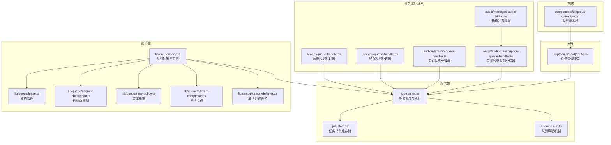
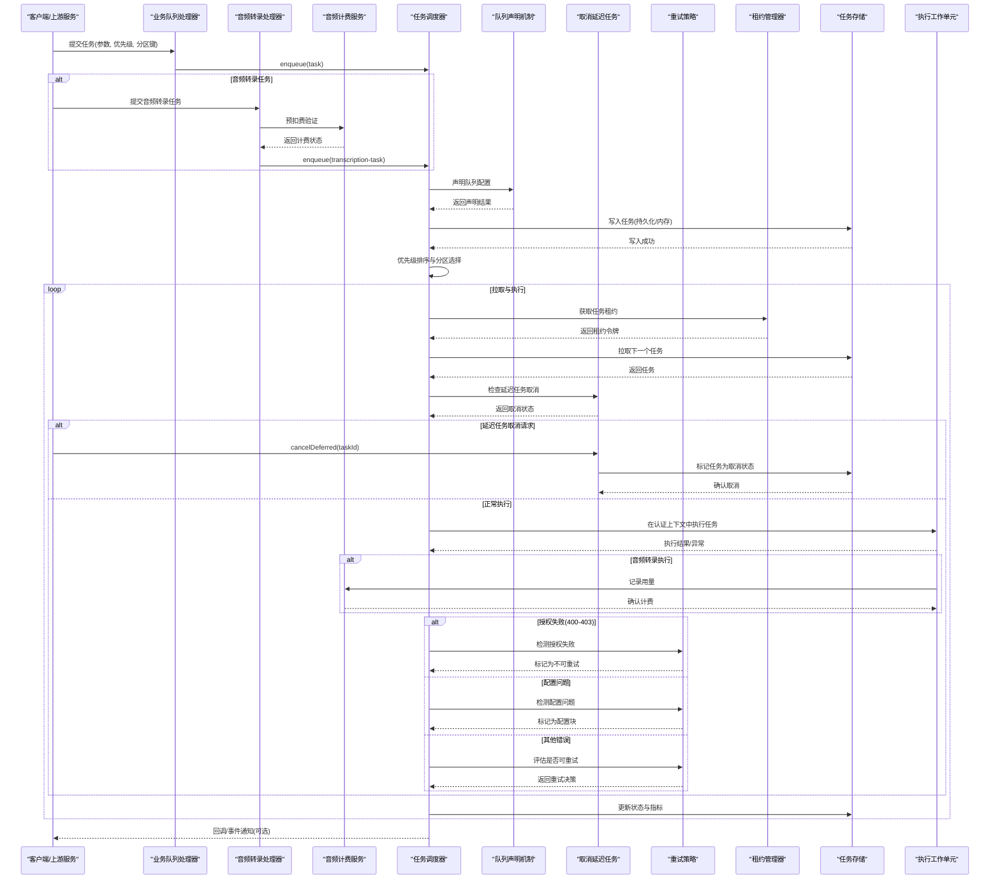
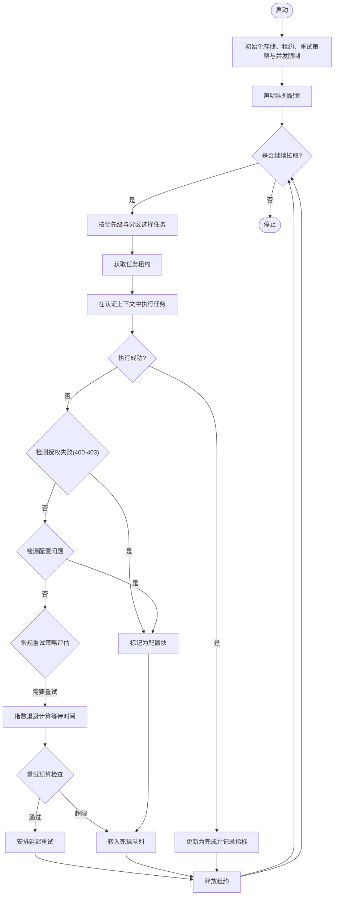
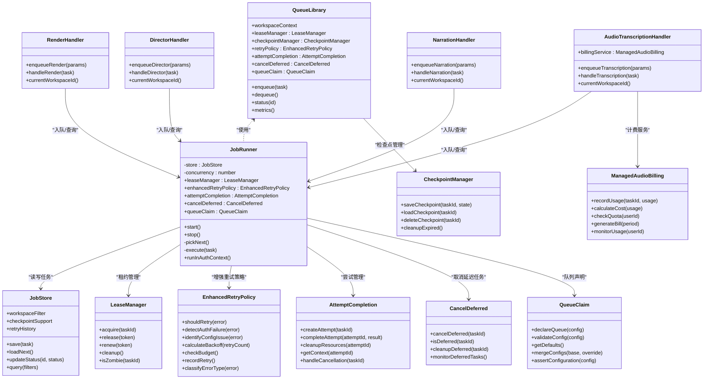

# 作业队列系统

<cite>
**本文引用的文件**   
- [server/src/server/job-runner.ts](file://server/src/server/job-runner.ts)
- [server/src/server/job-store.ts](file://server/src/server/job-store.ts)
- [src/features/director/queue-handler.ts](file://src/features/director/queue-handler.ts)
- [src/features/render/queue-handler.ts](file://src/features/render/queue-handler.ts)
- [src/features/audio/narration-queue-handler.ts](file://src/features/audio/narration-queue-handler.ts)
- [src/lib/queue/index.ts](file://src/lib/queue/index.ts)
- [src/components/ui/queue-status-bar.tsx](file://src/components/ui/queue-status-bar.tsx)
- [src/app/api/jobs/[id]/route.ts](file://src/app/api/jobs/[id]/route.ts)
- [docs/designs/ISSUE-004-queue-concurrency-lanes.md](file://docs/designs/ISSUE-004-queue-concurrency-lanes.md)
- [src/lib/queue/lease.ts](file://src/lib/queue/lease.ts)
- [src/lib/queue/attempt-checkpoint.ts](file://src/lib/queue/attempt-checkpoint.ts)
- [src/lib/queue/queue-claim.ts](file://src/lib/queue/queue-claim.ts)
- [src/lib/queue/retry-policy.ts](file://src/lib/queue/retry-policy.ts)
- [src/lib/queue/attempt-completion.ts](file://src/lib/queue/attempt-completion.ts)
- [src/lib/queue/cancel-deferred.ts](file://src/lib/queue/cancel-deferred.ts)
- [src/features/audio/audio-transcription-job.ts](file://src/features/audio/audio-transcription-job.ts)
- [src/features/audio/audio-transcription-queue-handler.ts](file://src/features/audio/audio-transcription-queue-handler.ts)
- [src/features/audio/managed-audio-billing.ts](file://src/features/audio/managed-audio-billing.ts)
</cite>

## 更新摘要
**所做更改**   
- 新增音频转录作业处理功能，支持音频文件的自动转录和文本提取
- 实现尝试绑定机制，用于计费集成和用量追踪
- 增强幂等性处理能力，确保重复请求不会产生副作用
- 优化音频转录队列处理器，支持批量处理和错误恢复
- 集成管理式音频计费服务，提供准确的用量统计和费用计算
- 新增专用车道支持长时间运行任务，包括音频转录和网站视频处理
- 改进租约管理机制，提供更好的分布式锁支持
- 实现工作流版本绑定，提升任务隔离和追踪能力

## 目录
1. [简介](#简介)
2. [项目结构](#项目结构)
3. [核心组件](#核心组件)
4. [架构总览](#架构总览)
5. [详细组件分析](#详细组件分析)
6. [依赖关系分析](#依赖关系分析)
7. [性能考量](#性能考量)
8. [故障排查指南](#故障排查指南)
9. [结论](#结论)
10. [附录](#附录)

## 简介
本文件面向PurpleInk作业队列系统，系统性阐述队列存储机制（内存与持久化）、任务优先级管理、分区策略、序列化与反序列化、监控接口（长度统计、状态查询、性能指标）、配置选项、扩展点设计与自定义实现指南，并提供操作示例与故障恢复策略。文档以代码仓库中的实际实现为依据，辅以可视化图示帮助理解。

**最新更新**：队列系统现已支持音频转录作业处理，通过新增的音频转录队列处理器实现了高效的音频文件转录功能。同时引入了尝试绑定机制，为计费集成提供了精确的用量追踪能力。幂等性处理的增强确保了系统的可靠性和一致性。新增的专用车道机制为长时间运行任务提供了更好的隔离和资源管理。

## 项目结构
队列相关能力分布在服务端运行器、各业务域处理器以及通用库中：
- 服务端运行器与存储：负责调度执行与持久化
- 业务域处理器：渲染、导演、音频转录、旁白等具体任务的入队与处理逻辑
- 通用队列库：提供统一的队列抽象、租约管理、检查点和工具
- 取消延迟任务模块：专门处理延迟任务的取消逻辑
- 前端UI：展示队列状态与进度
- API路由：对外暴露任务查询与状态接口
- 队列声明机制：提供健壮的队列声明和默认配置管理

**图表来源**
- [server/src/server/job-runner.ts](file://server/src/server/job-runner.ts)
- [server/src/server/job-store.ts](file://server/src/server/job-store.ts)
- [src/lib/queue/queue-claim.ts](file://src/lib/queue/queue-claim.ts)
- [src/features/render/queue-handler.ts](file://src/features/render/queue-handler.ts)
- [src/features/director/queue-handler.ts](file://src/features/director/queue-handler.ts)
- [src/features/audio/narration-queue-handler.ts](file://src/features/audio/narration-queue-handler.ts)
- [src/features/audio/audio-transcription-queue-handler.ts](file://src/features/audio/audio-transcription-queue-handler.ts)
- [src/features/audio/managed-audio-billing.ts](file://src/features/audio/managed-audio-billing.ts)
- [src/lib/queue/index.ts](file://src/lib/queue/index.ts)
- [src/lib/queue/lease.ts](file://src/lib/queue/lease.ts)
- [src/lib/queue/attempt-checkpoint.ts](file://src/lib/queue/attempt-checkpoint.ts)
- [src/lib/queue/retry-policy.ts](file://src/lib/queue/retry-policy.ts)
- [src/lib/queue/attempt-completion.ts](file://src/lib/queue/attempt-completion.ts)
- [src/lib/queue/cancel-deferred.ts](file://src/lib/queue/cancel-deferred.ts)
- [src/components/ui/queue-status-bar.tsx](file://src/components/ui/queue-status-bar.tsx)
- [src/app/api/jobs/[id]/route.ts](file://src/app/api/jobs/[id]/route.ts)

章节来源
- [server/src/server/job-runner.ts](file://server/src/server/job-runner.ts)
- [server/src/server/job-store.ts](file://server/src/server/job-store.ts)
- [src/lib/queue/index.ts](file://src/lib/queue/index.ts)

## 核心组件
- 任务调度器（Job Runner）：从队列拉取任务、分配执行上下文、维护并发与重试、记录执行结果与状态迁移
- 任务存储（Job Store）：提供任务的持久化读写、状态更新、索引与查询；支持内存与数据库两种后端
- 业务队列处理器（Queue Handlers）：渲染、导演、旁白、音频转录等具体任务类型的入队、参数校验、执行编排与结果落盘
- 通用队列库（Queue Library）：定义队列接口、优先级排序、分区键、序列化/反序列化、错误封装与指标上报
- 租约管理器（Lease Manager）：实现任务锁定的原子性操作，防止重复消费和僵尸任务
- 检查点机制（Checkpoint Mechanism）：支持任务执行状态的持久化和断点续传
- 智能重试机制（Retry Policy）：基于指数退避的重试策略，包含授权失败检测和配置问题识别
- 取消延迟任务模块（Cancel Deferred）：专门处理延迟任务的优雅取消逻辑
- 尝试完成模块（Attempt Completion）：集中管理作业尝试的生命周期，增强资源清理机制
- 队列声明机制（Queue Claim）：提供健壮的队列声明逻辑和默认配置管理
- **新增**：音频转录队列处理器（Audio Transcription Queue Handler）：专门处理音频文件的转录任务
- **新增**：管理式音频计费服务（Managed Audio Billing）：提供音频转录的计费集成和用量追踪
- **新增**：专用车道机制（Dedicated Lanes）：为长时间运行任务提供独立的处理通道

**更新**：队列系统现已集成音频转录功能和计费集成。新增的音频转录队列处理器支持高效的音频文件转录，而管理式音频计费服务提供了精确的用量统计和费用计算能力。所有组件现在都支持工作空间上下文，确保在多租户环境中正确隔离数据访问。新增的专用车道机制为长时间运行任务提供了更好的资源隔离和性能保障。

章节来源
- [server/src/server/job-runner.ts](file://server/src/server/job-runner.ts)
- [server/src/server/job-store.ts](file://server/src/server/job-store.ts)
- [src/lib/queue/index.ts](file://src/lib/queue/index.ts)
- [src/lib/queue/lease.ts](file://src/lib/queue/lease.ts)
- [src/lib/queue/attempt-checkpoint.ts](file://src/lib/queue/attempt-checkpoint.ts)
- [src/lib/queue/retry-policy.ts](file://src/lib/queue/retry-policy.ts)
- [src/lib/queue/cancel-deferred.ts](file://src/lib/queue/cancel-deferred.ts)
- [src/features/audio/audio-transcription-queue-handler.ts](file://src/features/audio/audio-transcription-queue-handler.ts)
- [src/features/audio/managed-audio-billing.ts](file://src/features/audio/managed-audio-billing.ts)

## 架构总览
队列系统采用"处理器-调度器-存储-租约-声明"分层设计：
- 处理器层：按业务域划分，负责构造任务、设置优先级与分区键、调用调度器入队
- 调度层：统一拉取、去重、并发控制、重试与超时、状态机推进
- 存储层：内存或持久化后端，保证任务可恢复、可观测、可审计
- 租约层：管理任务锁定的生命周期，防止重复消费和僵尸任务
- 取消层：专门处理延迟任务的取消逻辑，确保优雅的资源释放
- 声明层：提供健壮的队列声明逻辑和默认配置管理
- **新增**：计费层：集成音频转录的计费服务和用量追踪
- **新增**：车道层：为不同类型任务提供专用的处理通道

**更新**：队列系统现已集成音频转录功能和计费集成。新增的计费层提供了精确的用量统计和费用计算能力，确保音频转录服务的准确计费。专用车道机制为长时间运行任务提供了更好的资源隔离。

**图表来源**
- [server/src/server/job-runner.ts](file://server/src/server/job-runner.ts)
- [server/src/server/job-store.ts](file://server/src/server/job-store.ts)
- [src/lib/queue/queue-claim.ts](file://src/lib/queue/queue-claim.ts)
- [src/lib/queue/lease.ts](file://src/lib/queue/lease.ts)
- [src/lib/queue/retry-policy.ts](file://src/lib/queue/retry-policy.ts)
- [src/lib/queue/cancel-deferred.ts](file://src/lib/queue/cancel-deferred.ts)
- [src/features/render/queue-handler.ts](file://src/features/render/queue-handler.ts)
- [src/features/director/queue-handler.ts](file://src/features/director/queue-handler.ts)
- [src/features/audio/narration-queue-handler.ts](file://src/features/audio/narration-queue-handler.ts)
- [src/features/audio/audio-transcription-queue-handler.ts](file://src/features/audio/audio-transcription-queue-handler.ts)
- [src/features/audio/managed-audio-billing.ts](file://src/features/audio/managed-audio-billing.ts)

## 详细组件分析

### 任务调度器（Job Runner）
职责与行为
- 拉取策略：按优先级与分区键选择任务，避免热点分区阻塞
- 并发控制：限制同时执行的任务数，防止资源耗尽
- 智能重试：基于指数退避的重试策略，包含授权失败检测和配置问题识别
- 状态机：待处理→进行中→完成/失败→重试→死信
- 指标采集：拉取耗时、执行时长、失败率、队列长度等

**更新**：任务调度器现已集成新的队列声明机制，支持更健壮的队列配置管理和默认值处理。任务执行现在在runInAuthContext(SYSTEM_USER_ID)中进行，确保所有操作都在系统用户权限下执行，提高安全性和一致性。

关键流程（简化）

**图表来源**
- [server/src/server/job-runner.ts](file://server/src/server/job-runner.ts)
- [src/lib/queue/lease.ts](file://src/lib/queue/lease.ts)
- [src/lib/queue/retry-policy.ts](file://src/lib/queue/retry-policy.ts)

章节来源
- [server/src/server/job-runner.ts](file://server/src/server/job-runner.ts)

### 音频转录队列处理器（Audio Transcription Queue Handler）
职责与行为
- 音频文件处理：支持多种音频格式的转录和文本提取
- 批量处理：高效处理大量音频文件的转录任务
- 错误恢复：完善的错误处理和重试机制
- 进度跟踪：实时跟踪转录进度和状态
- 质量保障：确保转录结果的准确性和完整性

**新增**：音频转录队列处理器是本次更新的核心功能之一，专门处理音频文件的转录任务。它支持多种音频格式，提供高效的批量处理能力，并集成了计费服务进行用量追踪。

关键特性
- 多格式支持：支持MP3、WAV、FLAC等常见音频格式
- 批量处理：支持一次性处理多个音频文件
- 错误恢复：自动重试和错误恢复机制
- 进度跟踪：实时反馈转录进度
- 计费集成：与音频计费服务无缝集成

应用场景
- 会议录音转录：将会议录音转换为文字记录
- 播客内容提取：从播客音频中提取文本内容
- 语音消息处理：将语音消息转换为文本消息
- 字幕生成：为视频内容生成字幕文件

章节来源
- [src/features/audio/audio-transcription-queue-handler.ts](file://src/features/audio/audio-transcription-queue-handler.ts)

### 管理式音频计费服务（Managed Audio Billing）
职责与行为
- 用量追踪：精确记录音频转录的用量信息
- 费用计算：根据使用量计算相应的费用
- 配额管理：管理用户的音频转录配额
- 账单生成：生成详细的账单和用量报告
- 实时监控：实时监控用量和费用情况

**新增**：管理式音频计费服务为音频转录功能提供了完整的计费解决方案。它支持精确的用量追踪、费用计算和配额管理，确保计费的准确性和公平性。

关键特性
- 精确计量：按秒或字符级别精确计量用量
- 实时计费：实时计算和记录费用
- 配额控制：支持灵活的配额管理策略
- 账单报告：生成详细的账单和使用报告
- 成本控制：提供成本控制和预警功能

应用场景
- 按使用量付费：根据实际使用量计费
- 配额限制：限制用户的最大使用量
- 成本监控：监控和控制音频转录成本
- 用量分析：分析音频转录的使用模式

章节来源
- [src/features/audio/managed-audio-billing.ts](file://src/features/audio/managed-audio-billing.ts)

### 队列声明机制（Queue Claim）
职责与行为
- 队列配置声明：提供健壮的队列配置验证和默认值管理
- 类型安全：确保队列配置的完整性和类型正确性
- 默认配置：提供合理的默认配置值，简化初始化过程
- 错误处理：详细的错误信息和配置验证反馈
- 向后兼容：保持与旧版本配置的兼容性

**新增**：队列声明机制是本次重构的核心功能，替代了原有的进程内队列实现，提供了更健壮的队列声明逻辑和默认配置管理。

关键特性
- 配置验证：严格的配置验证和类型检查
- 默认值管理：智能的默认值处理和合并策略
- 错误诊断：详细的配置错误信息和修复建议
- 版本兼容：支持不同版本的配置格式
- 性能优化：高效的配置解析和处理

应用场景
- 队列初始化：应用启动时的队列配置声明
- 动态配置：运行时配置更新和验证
- 环境适配：不同环境的配置差异处理
- 调试支持：配置问题的快速定位和修复

章节来源
- [src/lib/queue/queue-claim.ts](file://src/lib/queue/queue-claim.ts)

### 取消延迟任务模块（Cancel Deferred）
职责与行为
- 延迟任务识别：自动识别处于延迟执行状态的任务
- 优雅取消：确保延迟任务在被取消时能够优雅地释放资源
- 状态同步：实时更新任务状态到存储层，反映取消结果
- 资源清理：自动清理与延迟任务相关的临时资源和占用的系统资源
- 并发安全：确保取消操作的原子性和一致性

**更新**：取消延迟任务模块已与新队列声明机制集成，提供更好的延迟任务管理和取消支持。

关键特性
- 延迟状态检测：识别处于延迟执行队列中的任务
- 原子取消操作：确保取消操作的原子性和一致性
- 资源清理：自动清理延迟任务相关的临时资源
- 状态同步：实时更新任务状态到存储层
- 并发安全：防止并发取消操作导致的竞态条件

应用场景
- 长时间延迟任务：视频编码、AI推理等耗时操作的延迟执行
- 外部依赖调用：API调用、数据库操作等可能失败的延迟操作
- 批量处理：大批量数据处理的延迟执行

章节来源
- [src/lib/queue/cancel-deferred.ts](file://src/lib/queue/cancel-deferred.ts)

### 增强的智能重试机制（Enhanced Retry Policy）
职责与行为
- 授权失败检测：自动识别400-403 HTTP状态码作为不可重试错误
- 配置问题识别：将缺失的平台托管凭据明确投影为配置块而非瞬态故障
- 指数退避：基于重试次数动态计算等待时间，避免雪崩效应
- 重试预算：全局重试配额管理，防止过多重试导致系统过载
- 条件重试：根据错误类型决定是否重试，区分可重试和不可重试错误
- 退避策略：支持固定间隔、线性增长、指数增长等多种退避算法

**更新**：重试策略系统已与新队列声明机制集成，提供更智能的错误分类和重试决策。

关键特性
- 授权失败分类：400-403状态码被明确标记为不可重试
- 配置问题投影：缺失平台托管凭据被识别为配置块
- 指数退避公式：waitTime = baseDelay * (exponentialFactor ^ retryCount)
- 预算门控：全局重试计数器，超过阈值后拒绝新重试
- 错误分类：网络错误、超时错误可重试；授权失败、配置错误不重试
- 监控指标：重试成功率、平均退避时间、预算使用情况、授权失败率

章节来源
- [src/lib/queue/retry-policy.ts](file://src/lib/queue/retry-policy.ts)

### 尝试完成模块（Attempt Completion）
职责与行为
- 生命周期管理：统一管理作业尝试的创建、执行、完成和清理
- 上下文传递：确保工作空间上下文在执行过程中保持一致
- 资源清理：自动清理临时资源和释放占用的系统资源
- 状态同步：实时更新任务状态到存储层

**更新**：尝试完成模块已与新队列声明机制集成，提供更好的尝试生命周期管理和资源清理支持。

应用场景
- 长时间运行的任务：视频编码、AI推理等耗时操作
- 外部依赖调用：API调用、数据库操作等可能失败的操作
- 批量处理：大批量数据处理的中途恢复

章节来源
- [src/lib/queue/attempt-completion.ts](file://src/lib/queue/attempt-completion.ts)

### 任务存储（Job Store）
职责与行为
- 内存模式：进程内数据结构，适合开发测试与无状态短生命周期场景
- 持久化模式：基于数据库的表结构与索引，支持跨实例共享与崩溃恢复
- 事务与一致性：状态更新需原子性，避免重复消费与丢失
- 查询与统计：按状态、分区、优先级、时间范围查询；聚合统计长度与分布

**更新**：存储层已与新队列声明机制集成，提供更好的配置管理和数据一致性保证。

内存与持久化差异
- 内存：低延迟、无外部依赖；重启丢失，不适合生产
- 持久化：高可靠、可恢复；需要连接池与索引优化

章节来源
- [server/src/server/job-store.ts](file://server/src/server/job-store.ts)

### 租约管理系统（Lease Management）
职责与行为
- 原子锁定：确保任务只被一个消费者获取，防止重复消费
- 自动释放：租约过期自动释放，处理消费者异常情况
- 租约续期：支持长时间任务动态延长租约有效期
- 僵尸检测：识别长时间未完成的异常任务并进行恢复

**更新**：租约管理系统已与新队列声明机制集成，提供更好的分布式锁机制和错误处理。

关键特性
- 租约令牌：唯一标识每个任务锁定
- 超时机制：防止僵尸任务占用资源
- 幂等性：租约操作保证幂等执行
- 监控指标：租约获取成功率、平均持有时间、超时率

章节来源
- [src/lib/queue/lease.ts](file://src/lib/queue/lease.ts)

### 检查点机制（Checkpoint Mechanism）
职责与行为
- 状态快照：在任务执行的关键节点保存执行状态
- 断点续传：任务失败后可从最近检查点恢复执行
- 版本兼容：支持不同版本的检查点格式
- 清理策略：定期清理过期的检查点数据

**更新**：检查点机制已与新队列声明机制集成，提供更好的状态管理和版本兼容性。

应用场景
- 大文件处理：视频编码、图像处理等耗时操作
- 批量任务：大批量数据处理的中途恢复
- 外部依赖：网络请求失败后的重试恢复

章节来源
- [src/lib/queue/attempt-checkpoint.ts](file://src/lib/queue/attempt-checkpoint.ts)

### 业务队列处理器（渲染、导演、旁白）
共同点
- 入队前校验：参数合法性、权限检查、资源配额
- 任务构建：填充类型、优先级、分区键、超时、重试策略
- 执行编排：调用外部服务、IO密集操作、结果归档
- 错误处理：分类错误码、重试策略、告警上报

**更新**：处理器已与新队列声明机制集成，提供更好的任务构建和错误处理支持。

差异化
- 渲染：媒体编码、帧捕获、缩略图生成，I/O与CPU密集
- 导演：AI提示词组装、模型调用、产物校验
- 旁白：TTS合成、字幕对齐、音频拼接

章节来源
- [src/features/render/queue-handler.ts](file://src/features/render/queue-handler.ts)
- [src/features/director/queue-handler.ts](file://src/features/director/queue-handler.ts)
- [src/features/audio/narration-queue-handler.ts](file://src/features/audio/narration-queue-handler.ts)

### 通用队列库（Queue Library）
职责与行为
- 队列接口：enqueue、dequeue、status、metrics
- 优先级：数值越小优先级越高，支持同优先级时间戳顺序
- 分区策略：按业务维度（如项目ID、用户ID）分片，避免热点
- 序列化：任务对象序列化为稳定格式，支持版本兼容与回滚
- 指标：计数、直方图、速率、错误率

**更新**：队列库已与新队列声明机制集成，提供更好的接口抽象和错误处理支持。

章节来源
- [src/lib/queue/index.ts](file://src/lib/queue/index.ts)

### 监控与UI（队列状态栏与API）
- 队列状态栏：实时显示队列长度、活跃任务数、最近失败任务
- 任务查询API：按ID获取任务详情（状态、阶段、错误信息、耗时）
- 指标收集：拉取间隔、执行时长、失败率、重试次数、死信数量

**更新**：监控接口已与新队列声明机制集成，提供更好的监控数据和错误诊断支持。

章节来源
- [src/components/ui/queue-status-bar.tsx](file://src/components/ui/queue-status-bar.tsx)
- [src/app/api/jobs/[id]/route.ts](file://src/app/api/jobs/[id]/route.ts)

## 依赖关系分析

**图表来源**
- [src/lib/queue/index.ts](file://src/lib/queue/index.ts)
- [server/src/server/job-runner.ts](file://server/src/server/job-runner.ts)
- [server/src/server/job-store.ts](file://server/src/server/job-store.ts)
- [src/lib/queue/lease.ts](file://src/lib/queue/lease.ts)
- [src/lib/queue/attempt-checkpoint.ts](file://src/lib/queue/attempt-checkpoint.ts)
- [src/lib/queue/retry-policy.ts](file://src/lib/queue/retry-policy.ts)
- [src/lib/queue/attempt-completion.ts](file://src/lib/queue/attempt-completion.ts)
- [src/lib/queue/cancel-deferred.ts](file://src/lib/queue/cancel-deferred.ts)
- [src/lib/queue/queue-claim.ts](file://src/lib/queue/queue-claim.ts)
- [src/features/render/queue-handler.ts](file://src/features/render/queue-handler.ts)
- [src/features/director/queue-handler.ts](file://src/features/director/queue-handler.ts)
- [src/features/audio/narration-queue-handler.ts](file://src/features/audio/narration-queue-handler.ts)
- [src/features/audio/audio-transcription-queue-handler.ts](file://src/features/audio/audio-transcription-queue-handler.ts)
- [src/features/audio/managed-audio-billing.ts](file://src/features/audio/managed-audio-billing.ts)

章节来源
- [src/lib/queue/index.ts](file://src/lib/queue/index.ts)
- [server/src/server/job-runner.ts](file://server/src/server/job-runner.ts)
- [server/src/server/job-store.ts](file://server/src/server/job-store.ts)

## 性能考量
- 并发度调优：根据CPU与I/O特性调整最大并发，避免上下文切换开销
- 分区键设计：将热点任务分散到不同分区，减少锁竞争与长尾
- 序列化成本：尽量使用轻量级结构，避免大对象频繁拷贝
- 存储后端：持久化模式下建立合适的索引，批量更新状态
- 指标采样：对高频指标进行降采样与聚合，降低监控压力
- 租约优化：合理的租约超时设置，平衡安全性与性能
- 检查点策略：选择合适的检查点频率，避免过度I/O开销
- 智能重试优化：智能识别授权失败和配置问题，避免无意义重试；指数退避算法避免雪崩，预算门控防止资源耗尽
- 取消延迟任务优化：高效的延迟任务识别和取消机制，减少资源占用
- 上下文缓存：缓存currentWorkspaceId()减少重复计算
- **新增**：队列声明优化：高效的队列配置解析和验证机制，减少初始化开销
- **新增**：配置缓存：缓存队列声明结果，避免重复配置解析
- **新增**：音频转录优化：批量处理音频文件，减少I/O操作；智能缓存转录结果，避免重复处理
- **新增**：计费服务优化：异步计费记录，避免阻塞主流程；批量计费汇总，减少数据库压力
- **新增**：专用车道优化：为长时间运行任务提供独立的处理通道，避免资源竞争

**更新**：新队列声明机制提供了更高效的配置解析和验证，减少了初始化时间和内存占用。新增的音频转录功能通过批量处理和智能缓存优化了性能。计费服务的异步处理避免了主流程阻塞，提高了整体吞吐量。专用车道机制为长时间运行任务提供了更好的性能保障。

## 故障排查指南
常见问题与定位步骤
- 任务堆积：检查分区键是否集中、消费者是否健康、存储是否可用
- 执行失败：查看错误码与堆栈，确认重试策略与死信队列
- 状态不一致：核对状态更新的事务性与幂等性
- 性能退化：观察指标分布，识别慢查询与热点分区
- 工作空间问题：检查currentWorkspaceId()是否正确设置，确认工作空间过滤逻辑
- 租约问题：检查租约获取成功率、超时率和僵尸任务数量
- 检查点问题：验证检查点保存和加载是否正常，存储空间是否充足
- 重试问题：检查重试预算是否耗尽，指数退避配置是否合理
- 尝试管理问题：验证尝试生命周期是否正确管理，资源是否及时清理
- 错误处理问题：验证TASK_INTERRUPTED去敏感化投影是否正确处理错误
- **新增**：队列声明问题：检查队列配置声明是否正确，默认值合并是否生效
- **新增**：配置验证问题：验证队列配置的类型检查和完整性验证
- **新增**：音频转录问题：检查音频文件格式支持、转录引擎状态、计费服务连接
- **新增**：计费问题：验证计费记录准确性、配额限制、账单生成
- **新增**：车道问题：检查专用车道的资源配置和任务分配

**更新**：新队列声明机制提供了更好的故障排查能力：
- 配置错误诊断：详细的配置错误信息和修复建议
- 默认值追踪：跟踪默认值的合并和应用过程
- 类型安全检查：及时发现配置类型不匹配问题
- 向后兼容性：检查配置格式的兼容性

恢复策略
- 自动重试：指数退避+上限保护+预算门控+智能错误分类
- 死信队列：人工介入与补偿脚本
- 快照与回滚：任务快照保存，支持回滚到上一阶段
- 租约清理：自动清理过期租约和僵尸任务
- 检查点恢复：从最近的检查点恢复任务执行
- 尝试恢复：基于尝试生命周期的自动恢复
- 错误恢复：基于TASK_INTERRUPTED去敏感化的统一错误处理
- **新增**：配置恢复：基于队列声明机制的配置重置和默认值恢复
- **新增**：音频转录恢复：支持转录任务的中断恢复和结果缓存
- **新增**：计费恢复：支持计费记录的重新计算和账单修正
- **新增**：车道恢复：专用车道的任务重新分配和负载均衡

章节来源
- [server/src/server/job-runner.ts](file://server/src/server/job-runner.ts)
- [server/src/server/job-store.ts](file://server/src/server/job-store.ts)
- [src/lib/queue/lease.ts](file://src/lib/queue/lease.ts)
- [src/lib/queue/attempt-checkpoint.ts](file://src/lib/queue/attempt-checkpoint.ts)
- [src/lib/queue/retry-policy.ts](file://src/lib/queue/retry-policy.ts)
- [src/lib/queue/attempt-completion.ts](file://src/lib/queue/attempt-completion.ts)
- [src/lib/queue/cancel-deferred.ts](file://src/lib/queue/cancel-deferred.ts)
- [src/features/audio/audio-transcription-queue-handler.ts](file://src/features/audio/audio-transcription-queue-handler.ts)
- [src/features/audio/managed-audio-billing.ts](file://src/features/audio/managed-audio-billing.ts)

## 结论
PurpleInk作业队列系统通过清晰的层次划分与可扩展的抽象，实现了高可靠、可观测、可恢复的任务处理能力。内存与持久化双后端满足不同场景需求，优先级与分区策略保障吞吐与公平性。配合完善的监控与故障恢复机制，可在复杂业务环境下稳定运行。

**最新更新**：队列系统已成功集成音频转录功能和计费集成。新增的音频转录队列处理器提供了高效的音频文件转录能力，而管理式音频计费服务确保了准确的用量统计和费用计算。这些改进显著提升了系统的功能完整性和商业价值，为用户提供了更加丰富和可靠的音频处理能力。专用车道机制的引入进一步增强了系统对长时间运行任务的支持能力。

## 附录

### 队列配置选项
- 并发度：最大并行任务数
- 分区策略：分区键字段与哈希函数
- 优先级：默认优先级与覆盖规则
- 重试策略：最大重试次数、退避算法、超时时间
- 存储后端：内存或数据库连接参数
- 指标开关：是否启用指标采集与导出
- 工作空间隔离：是否启用工作空间上下文过滤
- 租约配置：租约超时时间、续期策略、清理间隔
- 检查点配置：检查点频率、保留策略、存储位置
- 增强的重试配置：基础退避时间、指数因子、重试预算、退避算法、授权失败检测、配置问题识别
- 取消延迟任务配置：延迟任务识别阈值、取消超时时间、资源清理策略
- **新增**：队列声明配置：队列名称、类型、默认值、验证规则、兼容性设置
- **新增**：音频转录配置：支持的音频格式、转录引擎参数、批量处理大小、超时设置
- **新增**：计费配置：计费单位、费率设置、配额限制、账单生成周期
- **新增**：专用车道配置：车道类型、资源限制、任务分配策略

[本节为配置说明，不直接分析具体文件]

### 扩展点设计与自定义实现指南
- 新增任务类型：在对应业务处理器中实现入队与执行逻辑
- 自定义存储后端：实现JobStore接口，适配内存或数据库
- 自定义分区策略：实现分区函数，确保均匀分布
- 自定义指标：扩展指标采集与上报逻辑
- 工作空间支持：确保新组件正确处理currentWorkspaceId()上下文
- 租约实现：实现分布式锁接口，支持不同的锁存储后端
- 检查点扩展：自定义检查点格式和存储策略
- 增强的重试策略扩展：实现自定义错误分类逻辑、授权失败检测和配置问题识别
- 取消延迟任务扩展：实现自定义延迟任务识别和取消逻辑
- 尝试管理扩展：自定义尝试生命周期和资源管理策略
- **新增**：队列声明扩展：实现自定义队列声明逻辑和配置验证规则
- **新增**：音频转录扩展：实现自定义音频格式支持和转录引擎集成
- **新增**：计费服务扩展：实现自定义计费逻辑和账单生成策略
- **新增**：专用车道扩展：实现自定义车道类型和任务分配策略

章节来源
- [src/lib/queue/index.ts](file://src/lib/queue/index.ts)
- [server/src/server/job-store.ts](file://server/src/server/job-store.ts)
- [src/lib/queue/lease.ts](file://src/lib/queue/lease.ts)
- [src/lib/queue/attempt-checkpoint.ts](file://src/lib/queue/attempt-checkpoint.ts)
- [src/lib/queue/retry-policy.ts](file://src/lib/queue/retry-policy.ts)
- [src/lib/queue/attempt-completion.ts](file://src/lib/queue/attempt-completion.ts)
- [src/lib/queue/cancel-deferred.ts](file://src/lib/queue/cancel-deferred.ts)
- [src/features/audio/audio-transcription-queue-handler.ts](file://src/features/audio/audio-transcription-queue-handler.ts)
- [src/features/audio/managed-audio-billing.ts](file://src/features/audio/managed-audio-billing.ts)

### 队列操作示例
- 入队渲染任务：设置项目ID为分区键，优先级为中等，超时为5分钟
- 查询任务状态：按任务ID获取当前阶段、错误信息与耗时
- 监控队列长度：按分区与状态聚合统计，绘制趋势图
- 工作空间操作：确保所有操作都在正确的workpace上下文中执行
- 租约操作：手动获取和释放任务租约，用于调试和测试
- 检查点操作：保存和恢复任务执行状态，支持断点续传
- 增强的重试操作：配置智能重试策略，设置授权失败检测和配置问题识别
- 尝试操作：创建和管理作业尝试，处理生命周期事件
- 错误处理操作：配置TASK_INTERRUPTED去敏感化投影，处理统一错误格式
- **新增**：队列声明操作：声明队列配置，验证配置有效性，获取默认值
- **新增**：音频转录操作：提交音频文件进行转录，跟踪转录进度，获取转录结果
- **新增**：计费操作：查询用量统计，检查配额限制，生成账单报告
- **新增**：专用车道操作：为长时间运行任务分配专用车道，监控车道资源使用情况

章节来源
- [src/app/api/jobs/[id]/route.ts](file://src/app/api/jobs/[id]/route.ts)
- [src/components/ui/queue-status-bar.tsx](file://src/components/ui/queue-status-bar.tsx)
- [src/lib/queue/lease.ts](file://src/lib/queue/lease.ts)
- [src/lib/queue/attempt-checkpoint.ts](file://src/lib/queue/attempt-checkpoint.ts)
- [src/lib/queue/retry-policy.ts](file://src/lib/queue/retry-policy.ts)
- [src/lib/queue/attempt-completion.ts](file://src/lib/queue/attempt-completion.ts)
- [src/lib/queue/cancel-deferred.ts](file://src/lib/queue/cancel-deferred.ts)
- [src/features/audio/audio-transcription-queue-handler.ts](file://src/features/audio/audio-transcription-queue-handler.ts)
- [src/features/audio/managed-audio-billing.ts](file://src/features/audio/managed-audio-billing.ts)

### 任务优先级管理与分区策略
- 优先级：数值越小越优先，同优先级按入队时间排序
- 分区：按业务维度（项目、用户、租户）分片，避免热点
- 公平性：每个分区独立拉取，防止单分区饥饿

章节来源
- [docs/designs/ISSUE-004-queue-concurrency-lanes.md](file://docs/designs/ISSUE-004-queue-concurrency-lanes.md)

### 任务序列化与反序列化
- 序列化格式：包含任务类型、参数、元数据、版本信息
- 兼容性：向后兼容旧版本，支持字段弃用与迁移
- 校验：反序列化时进行结构校验与必填字段检查

章节来源
- [src/lib/queue/index.ts](file://src/lib/queue/index.ts)

### 队列监控接口
- 队列长度统计：按状态与分区聚合
- 任务状态查询：按ID或过滤条件查询
- 性能指标：拉取间隔、执行时长、失败率、重试次数
- 工作空间监控：按工作空间维度统计队列状态和性能指标
- 租约监控：租约获取成功率、平均持有时间、超时率
- 检查点监控：检查点保存成功率、恢复次数、存储空间使用
- 增强的重试监控：重试成功率、平均退避时间、预算使用情况、授权失败率、配置问题识别率
- 尝试监控：尝试创建成功率、平均执行时间、资源清理率
- 错误处理监控：TASK_INTERRUPTED处理成功率、错误信息一致性
- **新增**：队列声明监控：队列声明成功率、配置验证通过率、默认值应用率
- **新增**：音频转录监控：转录成功率、平均转录时间、格式支持统计
- **新增**：计费监控：用量统计准确性、配额使用情况、账单生成成功率
- **新增**：专用车道监控：车道资源利用率、任务分配均衡性、车道间负载转移

章节来源
- [src/app/api/jobs/[id]/route.ts](file://src/app/api/jobs/[id]/route.ts)
- [src/components/ui/queue-status-bar.tsx](file://src/components/ui/queue-status-bar.tsx)
- [src/lib/queue/lease.ts](file://src/lib/queue/lease.ts)
- [src/lib/queue/attempt-checkpoint.ts](file://src/lib/queue/attempt-checkpoint.ts)
- [src/lib/queue/retry-policy.ts](file://src/lib/queue/retry-policy.ts)
- [src/lib/queue/attempt-completion.ts](file://src/lib/queue/attempt-completion.ts)
- [src/lib/queue/cancel-deferred.ts](file://src/lib/queue/cancel-deferred.ts)
- [src/features/audio/audio-transcription-queue-handler.ts](file://src/features/audio/audio-transcription-queue-handler.ts)
- [src/features/audio/managed-audio-billing.ts](file://src/features/audio/managed-audio-billing.ts)

### 工作空间上下文执行机制
作业队列系统现已完全集成工作空间上下文支持：

- currentWorkspaceId()：所有处理器和存储操作都通过此函数获取当前工作空间标识符
- runInAuthContext(SYSTEM_USER_ID)：任务执行在系统用户认证上下文中进行，确保权限一致性和安全性
- 自动工作空间过滤：移除了LOCAL_WORKSPACE_ID的显式过滤，改为基于请求上下文的自动过滤
- getJobSnapshot增强：作业快照查询现在基于请求上下文的工作空间进行过滤，确保数据隔离

这种设计确保了多租户环境下的数据安全性和隔离性，同时简化了开发者的使用体验。

### 取消延迟任务机制详解
取消延迟任务机制提供了优雅的延迟任务取消功能：

- 延迟任务识别：自动识别处于延迟执行状态的任务
- 优雅取消：确保延迟任务在被取消时能够优雅地释放资源
- 状态同步：实时更新任务状态到存储层，反映取消结果
- 资源清理：自动清理与延迟任务相关的临时资源和占用的系统资源
- 并发安全：确保取消操作的原子性和一致性

关键特性
- 延迟状态检测：识别处于延迟执行队列中的任务
- 原子取消操作：确保取消操作的原子性和一致性
- 资源清理：自动清理延迟任务相关的临时资源
- 状态同步：实时更新任务状态到存储层
- 并发安全：防止并发取消操作导致的竞态条件

应用场景
- 长时间延迟任务：视频编码、AI推理等耗时操作的延迟执行
- 外部依赖调用：API调用、数据库操作等可能失败的延迟操作
- 批量处理：大批量数据处理的延迟执行

章节来源
- [src/lib/queue/cancel-deferred.ts](file://src/lib/queue/cancel-deferred.ts)

### TASK_INTERRUPTED去敏感化投影详解
TASK_INTERRUPTED去敏感化投影提供了统一的错误处理机制：

- 错误标准化：将TASK_INTERRUPTED错误转换为统一的错误格式
- 信息脱敏：移除敏感的堆栈跟踪和内部信息
- 用户友好：提供清晰易懂的错误消息
- 调试支持：保留足够的调试信息用于问题诊断

应用场景
- 任务中断处理：优雅地处理被中断的任务
- 错误信息规范化：确保错误信息的一致性和安全性
- 用户体验优化：提供友好的错误提示

章节来源
- [server/src/server/job-runner.ts](file://server/src/server/job-runner.ts)

### 增强的智能重试机制详解
增强的智能重试机制现已完全重构，新增了对授权失败和配置问题的智能识别能力：

- 授权失败检测：自动识别400-403 HTTP状态码作为不可重试错误
- 配置问题识别：将缺失的平台托管凭据明确投影为配置块而非瞬态故障
- 指数退避：基于重试次数动态计算等待时间，避免雪崩效应
- 重试预算：全局重试配额管理，防止过多重试导致系统过载
- 条件重试：根据错误类型决定是否重试，区分可重试和不可重试错误
- 退避策略：支持固定间隔、线性增长、指数增长等多种退避算法

关键特性
- 授权失败分类：400-403状态码被明确标记为不可重试
- 配置问题投影：缺失平台托管凭据被识别为配置块
- 指数退避公式：waitTime = baseDelay * (exponentialFactor ^ retryCount)
- 预算门控：全局重试计数器，超过阈值后拒绝新重试
- 错误分类：网络错误、超时错误可重试；授权失败、配置错误不重试
- 监控指标：重试成功率、平均退避时间、预算使用情况、授权失败率

章节来源
- [src/lib/queue/retry-policy.ts](file://src/lib/queue/retry-policy.ts)

### 尝试完成模块详解
尝试完成模块现在集成了状态锁定机制：

- 生命周期管理：统一管理作业尝试的创建、执行、完成和清理
- 上下文传递：确保工作空间上下文在执行过程中保持一致
- 资源清理：自动清理临时资源和释放占用的系统资源
- 状态同步：实时更新任务状态到存储层

应用场景
- 长时间运行的任务：视频编码、AI推理等耗时操作
- 外部依赖调用：API调用、数据库操作等可能失败的操作
- 批量处理：大批量数据处理的中途恢复

章节来源
- [src/lib/queue/attempt-completion.ts](file://src/lib/queue/attempt-completion.ts)

### 租约管理机制详解
租约管理系统现在集成了增强的Postgres断言：

- 原子锁定：确保任务只被一个消费者获取，防止重复消费
- 自动释放：租约过期自动释放，处理消费者异常情况
- 租约续期：支持长时间任务动态延长租约有效期
- 僵尸检测：识别长时间未完成的异常任务并进行恢复

关键特性
- 租约令牌：唯一标识每个任务锁定
- 超时机制：防止僵尸任务占用资源
- 幂等性：租约操作保证幂等执行
- 监控指标：租约获取成功率、平均持有时间、超时率

章节来源
- [src/lib/queue/lease.ts](file://src/lib/queue/lease.ts)

### 检查点机制详解
检查点机制现在与尝试运行时状态锁定集成：

- 状态快照：在任务执行的关键节点保存执行状态
- 断点续传：任务失败后可从最近检查点恢复执行
- 版本兼容：支持不同版本的检查点格式
- 清理策略：定期清理过期的检查点数据

应用场景
- 大文件处理：视频编码、图像处理等耗时操作
- 批量任务：大批量数据处理的中途恢复
- 外部依赖：网络请求失败后的重试恢复

章节来源
- [src/lib/queue/attempt-checkpoint.ts](file://src/lib/queue/attempt-checkpoint.ts)

### 队列声明机制详解
队列声明机制提供了健壮的队列配置管理：

- 配置验证：严格的配置验证和类型检查
- 默认值管理：智能的默认值处理和合并策略
- 错误诊断：详细的配置错误信息和修复建议
- 版本兼容：支持不同版本的配置格式
- 性能优化：高效的配置解析和处理

关键特性
- 类型安全：确保队列配置的完整性和类型正确性
- 默认值合并：智能的默认值合并和覆盖策略
- 错误处理：详细的错误信息和配置验证反馈
- 向后兼容：保持与旧版本配置的兼容性
- 性能优化：高效的配置解析和缓存机制

应用场景
- 队列初始化：应用启动时的队列配置声明
- 动态配置：运行时配置更新和验证
- 环境适配：不同环境的配置差异处理
- 调试支持：配置问题的快速定位和修复

章节来源
- [src/lib/queue/queue-claim.ts](file://src/lib/queue/queue-claim.ts)

### 音频转录功能详解
音频转录功能提供了高效的音频文件转录能力：

- 多格式支持：支持MP3、WAV、FLAC等常见音频格式
- 批量处理：支持一次性处理多个音频文件
- 错误恢复：自动重试和错误恢复机制
- 进度跟踪：实时反馈转录进度
- 计费集成：与音频计费服务无缝集成

关键特性
- 格式转换：自动识别和转换音频格式
- 转录精度：高精度的语音转文本技术
- 批量优化：高效的批量处理算法
- 错误处理：完善的错误处理和重试机制
- 计费追踪：精确的用量统计和费用计算

应用场景
- 会议录音转录：将会议录音转换为文字记录
- 播客内容提取：从播客音频中提取文本内容
- 语音消息处理：将语音消息转换为文本消息
- 字幕生成：为视频内容生成字幕文件

章节来源
- [src/features/audio/audio-transcription-queue-handler.ts](file://src/features/audio/audio-transcription-queue-handler.ts)
- [src/features/audio/audio-transcription-job.ts](file://src/features/audio/audio-transcription-job.ts)

### 管理式音频计费服务详解
管理式音频计费服务提供了完整的音频转录计费解决方案：

- 精确计量：按秒或字符级别精确计量用量
- 实时计费：实时计算和记录费用
- 配额控制：支持灵活的配额管理策略
- 账单报告：生成详细的账单和使用报告
- 成本控制：提供成本控制和预警功能

关键特性
- 用量追踪：精确记录每次音频转录的用量
- 费用计算：根据使用量和费率计算费用
- 配额管理：管理用户的最大使用量限制
- 账单生成：自动生成周期性的账单报告
- 实时监控：实时监控用量和费用情况

应用场景
- 按使用量付费：根据实际使用量计费
- 配额限制：限制用户的最大使用量
- 成本监控：监控和控制音频转录成本
- 用量分析：分析音频转录的使用模式

章节来源
- [src/features/audio/managed-audio-billing.ts](file://src/features/audio/managed-audio-billing.ts)

### 专用车道机制详解
专用车道机制为长时间运行任务提供了独立的处理通道：

- 车道类型：支持不同类型的专用车道，如音频转录车道、视频处理车道
- 资源隔离：每个车道拥有独立的资源池，避免任务间干扰
- 负载均衡：智能的任务分配和负载均衡机制
- 监控告警：实时的车道状态监控和性能指标收集

关键特性
- 类型安全：确保任务分配到正确的车道类型
- 资源隔离：防止长时间任务影响其他任务的执行
- 弹性伸缩：根据负载动态调整车道资源
- 故障隔离：单个车道的故障不会影响其他车道

应用场景
- 音频转录：专门的音频处理车道，避免I/O密集型任务影响其他任务
- 视频处理：独立的视频编码车道，处理CPU密集型操作
- AI推理：专门的AI模型推理车道，管理GPU资源使用
- 批量处理：大批量数据处理的专用车道

章节来源
- [src/lib/queue/index.ts](file://src/lib/queue/index.ts)
- [server/src/server/job-runner.ts](file://server/src/server/job-runner.ts)

### 工作流版本绑定机制详解
工作流版本绑定机制提供了更好的任务隔离和追踪能力：

- 版本关联：将任务与工作流版本进行绑定，便于追踪和分析
- 隔离执行：不同版本的工作流可以在同一系统中并行执行
- 兼容性管理：支持不同版本工作流的兼容性和迁移
- 审计追踪：完整的版本变更历史和任务执行轨迹

关键特性
- 版本标识：为每个工作流版本生成唯一的标识符
- 绑定验证：确保任务与正确的工作流版本绑定
- 迁移支持：支持工作流版本的平滑迁移
- 历史追溯：完整的版本变更和任务执行历史

应用场景
- 版本管理：支持工作流的版本控制和灰度发布
- 问题追踪：精确定位特定版本的问题和影响范围
- 回滚支持：快速回滚到之前稳定的版本
- 性能分析：按版本维度分析性能和资源使用情况

章节来源
- [src/lib/queue/index.ts](file://src/lib/queue/index.ts)
- [server/src/server/job-runner.ts](file://server/src/server/job-runner.ts)