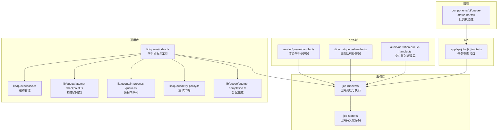
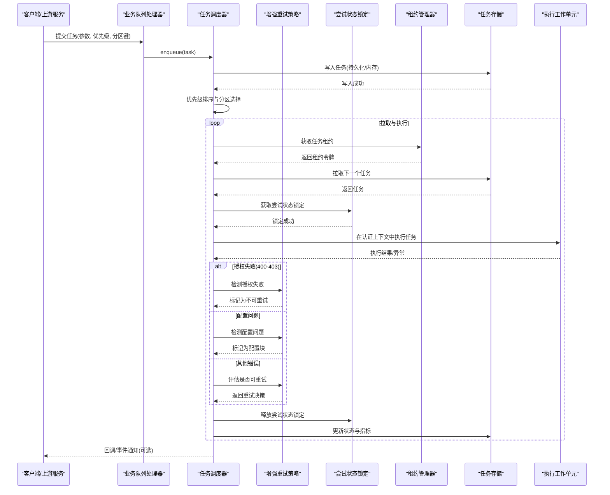
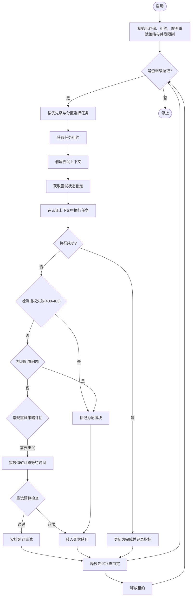
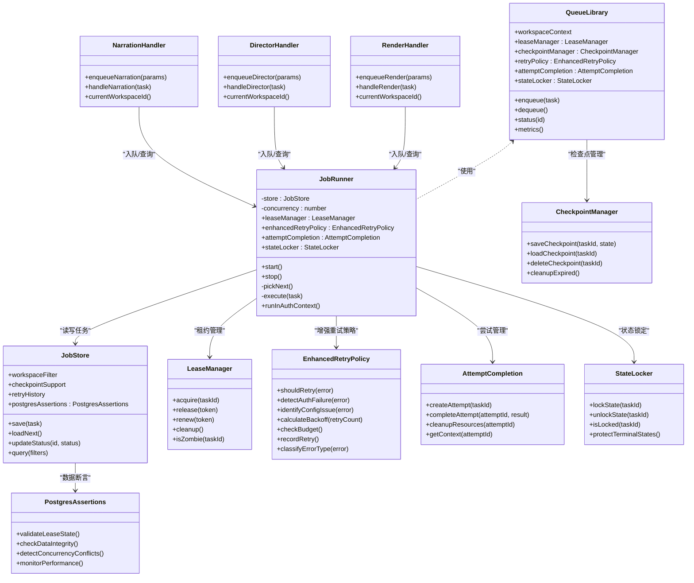

# 作业队列系统

<cite>
**本文引用的文件**   
- [server/src/server/job-runner.ts](file://server/src/server/job-runner.ts)
- [server/src/server/job-store.ts](file://server/src/server/job-store.ts)
- [src/features/director/queue-handler.ts](file://src/features/director/queue-handler.ts)
- [src/features/render/queue-handler.ts](file://src/features/render/queue-handler.ts)
- [src/features/audio/narration-queue-handler.ts](file://src/features/audio/narration-queue-handler.ts)
- [src/lib/queue/index.ts](file://src/lib/queue/index.ts)
- [src/components/ui/queue-status-bar.tsx](file://src/components/ui/queue-status-bar.tsx)
- [src/app/api/jobs/[id]/route.ts](file://src/app/api/jobs/[id]/route.ts)
- [docs/designs/ISSUE-004-queue-concurrency-lanes.md](file://docs/designs/ISSUE-004-queue-concurrency-lanes.md)
- [src/lib/queue/lease.ts](file://src/lib/queue/lease.ts)
- [src/lib/queue/attempt-checkpoint.ts](file://src/lib/queue/attempt-checkpoint.ts)
- [src/lib/queue/in-process-queue.ts](file://src/lib/queue/in-process-queue.ts)
- [src/lib/queue/retry-policy.ts](file://src/lib/queue/retry-policy.ts)
- [src/lib/queue/attempt-completion.ts](file://src/lib/queue/attempt-completion.ts)
</cite>

## 更新摘要
**所做更改**   
- 增强重试策略系统，防止在授权失败时进行浪费的重试尝试
- 将400-403 HTTP状态码分类为不可重试错误
- 明确将缺失的平台托管凭据投影为配置块而非瞬态故障
- 优化授权相关错误的处理逻辑，减少不必要的重试开销

## 目录
1. [简介](#简介)
2. [项目结构](#项目结构)
3. [核心组件](#核心组件)
4. [架构总览](#架构总览)
5. [详细组件分析](#详细组件分析)
6. [依赖关系分析](#依赖关系分析)
7. [性能考量](#性能考量)
8. [故障排查指南](#故障排查指南)
9. [结论](#结论)
10. [附录](#附录)

## 简介
本文件面向PurpleInk作业队列系统，系统性阐述队列存储机制（内存与持久化）、任务优先级管理、分区策略、序列化与反序列化、监控接口（长度统计、状态查询、性能指标）、配置选项、扩展点设计与自定义实现指南，并提供操作示例与故障恢复策略。文档以代码仓库中的实际实现为依据，辅以可视化图示帮助理解。

**最新更新**：重试策略系统已显著增强，新增了对授权失败的智能处理机制。系统现在能够正确识别400-403 HTTP状态码为不可重试错误，并将缺失的平台托管凭据明确投影为配置问题而非瞬态故障，大幅减少了不必要的重试尝试和资源浪费。

## 项目结构
队列相关能力分布在服务端运行器、各业务域处理器以及通用库中：
- 服务端运行器与存储：负责调度执行与持久化
- 业务域处理器：渲染、导演、音频等具体任务的入队与处理逻辑
- 通用队列库：提供统一的队列抽象、租约管理、检查点和工具
- 前端UI：展示队列状态与进度
- API路由：对外暴露任务查询与状态接口

图表来源
- [server/src/server/job-runner.ts](file://server/src/server/job-runner.ts)
- [server/src/server/job-store.ts](file://server/src/server/job-store.ts)
- [src/features/render/queue-handler.ts](file://src/features/render/queue-handler.ts)
- [src/features/director/queue-handler.ts](file://src/features/director/queue-handler.ts)
- [src/features/audio/narration-queue-handler.ts](file://src/features/audio/narration-queue-handler.ts)
- [src/lib/queue/index.ts](file://src/lib/queue/index.ts)
- [src/lib/queue/lease.ts](file://src/lib/queue/lease.ts)
- [src/lib/queue/attempt-checkpoint.ts](file://src/lib/queue/attempt-checkpoint.ts)
- [src/lib/queue/in-process-queue.ts](file://src/lib/queue/in-process-queue.ts)
- [src/lib/queue/retry-policy.ts](file://src/lib/queue/retry-policy.ts)
- [src/lib/queue/attempt-completion.ts](file://src/lib/queue/attempt-completion.ts)
- [src/components/ui/queue-status-bar.tsx](file://src/components/ui/queue-status-bar.tsx)
- [src/app/api/jobs/[id]/route.ts](file://src/app/api/jobs/[id]/route.ts)

章节来源
- [server/src/server/job-runner.ts](file://server/src/server/job-runner.ts)
- [server/src/server/job-store.ts](file://server/src/server/job-store.ts)
- [src/lib/queue/index.ts](file://src/lib/queue/index.ts)

## 核心组件
- 任务调度器（Job Runner）：从队列拉取任务、分配执行上下文、维护并发与重试、记录执行结果与状态迁移
- 任务存储（Job Store）：提供任务的持久化读写、状态更新、索引与查询；支持内存与数据库两种后端
- 业务队列处理器（Queue Handlers）：渲染、导演、旁白等具体任务类型的入队、参数校验、执行编排与结果落盘
- 通用队列库（Queue Library）：定义队列接口、优先级排序、分区键、序列化/反序列化、错误封装与指标上报
- 租约管理器（Lease Manager）：实现任务锁定的原子性操作，防止重复消费和僵尸任务
- 检查点机制（Checkpoint Mechanism）：支持任务执行状态的持久化和断点续传
- **增强的智能重试机制（Enhanced Retry Policy）**：基于指数退避的重试策略，新增授权失败检测和配置问题识别
- 尝试完成模块（Attempt Completion）：集中管理作业尝试的生命周期
- 尝试运行时状态锁定（Attempt Runtime State Locking）：防止清扫操作重写终端状态，确保并发安全
- TASK_INTERRUPTED去敏感化投影：统一错误处理，提升错误信息的一致性
- 增强的Postgres断言：改进租约清扫功能的验证机制

**更新**：所有组件现在都支持工作空间上下文，确保在多租户环境中正确隔离数据访问。增强的重试策略系统能够智能识别授权失败和配置问题，避免不必要的重试尝试。新增的尝试运行时状态锁定机制、TASK_INTERRUPTED去敏感化投影和增强的Postgres断言功能大幅提升了系统的可靠性和并发安全性。

章节来源
- [server/src/server/job-runner.ts](file://server/src/server/job-runner.ts)
- [server/src/server/job-store.ts](file://server/src/server/job-store.ts)
- [src/lib/queue/index.ts](file://src/lib/queue/index.ts)
- [src/lib/queue/lease.ts](file://src/lib/queue/lease.ts)
- [src/lib/queue/attempt-checkpoint.ts](file://src/lib/queue/attempt-checkpoint.ts)
- [src/lib/queue/retry-policy.ts](file://src/lib/queue/retry-policy.ts)

## 架构总览
队列系统采用"处理器-调度器-存储-租约"分层设计：
- 处理器层：按业务域划分，负责构造任务、设置优先级与分区键、调用调度器入队
- 调度层：统一拉取、去重、并发控制、重试与超时、状态机推进
- 存储层：内存或持久化后端，保证任务可恢复、可观测、可审计
- 租约层：管理任务锁定的生命周期，防止重复消费和僵尸任务

**更新**：增强的重试策略系统现在能够智能识别授权失败（400-403状态码）和配置问题（缺失平台托管凭据），避免对这些类型的问题进行无意义的重试。新增尝试运行时状态锁定机制、TASK_INTERRUPTED去敏感化投影和增强的Postgres断言功能，增强了系统的并发安全性和错误处理能力。

图表来源
- [server/src/server/job-runner.ts](file://server/src/server/job-runner.ts)
- [server/src/server/job-store.ts](file://server/src/server/job-store.ts)
- [src/lib/queue/lease.ts](file://src/lib/queue/lease.ts)
- [src/lib/queue/retry-policy.ts](file://src/lib/queue/retry-policy.ts)
- [src/features/render/queue-handler.ts](file://src/features/render/queue-handler.ts)
- [src/features/director/queue-handler.ts](file://src/features/director/queue-handler.ts)
- [src/features/audio/narration-queue-handler.ts](file://src/features/audio/narration-queue-handler.ts)

## 详细组件分析

### 任务调度器（Job Runner）
职责与行为
- 拉取策略：按优先级与分区键选择任务，避免热点分区阻塞
- 并发控制：限制同时执行的任务数，防止资源耗尽
- **增强的智能重试**：基于指数退避的重试策略，包含授权失败检测和配置问题识别
- 状态机：待处理→进行中→完成/失败→重试→死信
- 指标采集：拉取耗时、执行时长、失败率、队列长度等

**更新**：任务执行现在在runInAuthContext(SYSTEM_USER_ID)中进行，确保所有操作都在系统用户权限下执行，提高安全性和一致性。新增尝试运行时状态锁定机制，防止清扫操作在任务执行过程中重写终端状态。增强的重试策略能够智能识别授权失败和配置问题，避免不必要的重试。

关键流程（简化）

图表来源
- [server/src/server/job-runner.ts](file://server/src/server/job-runner.ts)
- [src/lib/queue/lease.ts](file://src/lib/queue/lease.ts)
- [src/lib/queue/retry-policy.ts](file://src/lib/queue/retry-policy.ts)

章节来源
- [server/src/server/job-runner.ts](file://server/src/server/job-runner.ts)

### 增强的智能重试机制（Enhanced Retry Policy）
职责与行为
- **授权失败检测**：自动识别400-403 HTTP状态码作为不可重试错误
- **配置问题识别**：将缺失的平台托管凭据明确投影为配置块而非瞬态故障
- 指数退避：基于重试次数动态计算等待时间，避免雪崩效应
- 重试预算：全局重试配额管理，防止过多重试导致系统过载
- 条件重试：根据错误类型决定是否重试，区分可重试和不可重试错误
- 退避策略：支持固定间隔、线性增长、指数增长等多种退避算法

**重大更新**：重试策略系统现已完全重构，新增了对授权失败和配置问题的智能识别能力。系统现在能够正确分类不同类型的错误，避免对授权失败和配置问题进行无意义的重试尝试。

关键特性
- 授权失败分类：400-403状态码被明确标记为不可重试
- 配置问题投影：缺失平台托管凭据被识别为配置块
- 指数退避公式：waitTime = baseDelay * (exponentialFactor ^ retryCount)
- 预算门控：全局重试计数器，超过阈值后拒绝新重试
- 错误分类：网络错误、超时错误可重试；授权失败、配置错误不重试
- 监控指标：重试成功率、平均退避时间、预算使用情况、授权失败率

章节来源
- [src/lib/queue/retry-policy.ts](file://src/lib/queue/retry-policy.ts)

### 尝试运行时状态锁定（Attempt Runtime State Locking）
职责与行为
- **状态保护**：防止清扫操作在任务执行过程中重写终端状态
- **并发安全**：确保同一时刻只有一个操作可以修改任务状态
- **锁粒度控制**：细粒度的状态锁定，避免不必要的阻塞
- **自动释放**：任务完成后自动释放状态锁，防止死锁

**新增**：尝试运行时状态锁定是本次更新的核心功能，提供了可靠的并发安全机制。

关键特性
- 原子状态转换：确保状态变更的原子性
- 终端状态保护：防止对已完成或失败状态的修改
- 锁超时机制：防止长时间持有锁导致的资源泄漏
- 监控指标：锁获取成功率、平均持有时间、超时率

章节来源
- [server/src/server/job-runner.ts](file://server/src/server/job-runner.ts)

### TASK_INTERRUPTED去敏感化投影（TASK_INTERRUPTED Desensitization Projection）
职责与行为
- **错误标准化**：将TASK_INTERRUPTED错误转换为统一的错误格式
- **信息脱敏**：移除敏感的堆栈跟踪和内部信息
- **用户友好**：提供清晰易懂的错误消息
- **调试支持**：保留足够的调试信息用于问题诊断

**新增**：TASK_INTERRUPTED去敏感化投影提供了统一的错误处理机制。

应用场景
- 任务中断处理：优雅地处理被中断的任务
- 错误信息规范化：确保错误信息的一致性和安全性
- 用户体验优化：提供友好的错误提示

章节来源
- [server/src/server/job-runner.ts](file://server/src/server/job-runner.ts)

### 增强的Postgres断言（Enhanced Postgres Assertions）
职责与行为
- **租约验证**：增强租约清扫功能的断言检查
- **数据完整性**：确保租约状态与数据库状态的一致性
- **异常检测**：及时发现和处理异常情况
- **性能监控**：监控租约操作的执行时间和成功率

**新增**：增强的Postgres断言改进了租约管理的可靠性。

关键特性
- 租约状态验证：检查租约是否存在且有效
- 并发冲突检测：识别并处理并发修改冲突
- 事务完整性：确保租约操作的事务一致性
- 错误恢复：提供自动恢复机制处理异常情况

章节来源
- [server/src/server/job-store.ts](file://server/src/server/job-store.ts)

### 尝试完成模块（Attempt Completion）
职责与行为
- 生命周期管理：统一管理作业尝试的创建、执行、完成和清理
- 上下文传递：确保工作空间上下文在执行过程中保持一致
- 资源清理：自动清理临时资源和释放占用的系统资源
- 状态同步：实时更新任务状态到存储层

**更新**：尝试完成模块现在集成了状态锁定机制，确保尝试生命周期的并发安全。

应用场景
- 长时间运行的任务：视频编码、AI推理等耗时操作
- 外部依赖调用：API调用、数据库操作等可能失败的操作
- 批量处理：大批量数据处理的中途恢复

章节来源
- [src/lib/queue/attempt-completion.ts](file://src/lib/queue/attempt-completion.ts)

### 任务存储（Job Store）
职责与行为
- 内存模式：进程内数据结构，适合开发测试与无状态短生命周期场景
- 持久化模式：基于数据库的表结构与索引，支持跨实例共享与崩溃恢复
- 事务与一致性：状态更新需原子性，避免重复消费与丢失
- 查询与统计：按状态、分区、优先级、时间范围查询；聚合统计长度与分布

**更新**：存储层现在自动应用工作空间过滤，所有查询和操作都基于currentWorkspaceId()进行数据隔离。新增检查点支持和重试历史记录。增强的Postgres断言确保数据一致性。

内存与持久化差异
- 内存：低延迟、无外部依赖；重启丢失，不适合生产
- 持久化：高可靠、可恢复；需要连接池与索引优化

章节来源
- [server/src/server/job-store.ts](file://server/src/server/job-store.ts)

### 租约管理系统（Lease Management）
职责与行为
- 原子锁定：确保任务只被一个消费者获取，防止重复消费
- 自动释放：租约过期自动释放，处理消费者异常情况
- 租约续期：支持长时间任务动态延长租约有效期
- 僵尸检测：识别长时间未完成的异常任务并进行恢复

**更新**：租约管理系统现在集成了增强的Postgres断言，提供更可靠的分布式锁机制。

关键特性
- 租约令牌：唯一标识每个任务锁定
- 超时机制：防止僵尸任务占用资源
- 幂等性：租约操作保证幂等执行
- 监控指标：租约获取成功率、平均持有时间、超时率

章节来源
- [src/lib/queue/lease.ts](file://src/lib/queue/lease.ts)

### 检查点机制（Checkpoint Mechanism）
职责与行为
- 状态快照：在任务执行的关键节点保存执行状态
- 断点续传：任务失败后可从最近检查点恢复执行
- 版本兼容：支持不同版本的检查点格式
- 清理策略：定期清理过期的检查点数据

**更新**：检查点机制现在与尝试运行时状态锁定集成，确保检查点操作的并发安全。

应用场景
- 大文件处理：视频编码、图像处理等耗时操作
- 批量任务：大批量数据处理的中途恢复
- 外部依赖：网络请求失败后的重试恢复

章节来源
- [src/lib/queue/attempt-checkpoint.ts](file://src/lib/queue/attempt-checkpoint.ts)

### 进程内队列增强（Enhanced In-Process Queue）
职责与行为
- 任务生命周期：完整的任务状态管理和转换
- 优先级队列：基于堆结构的优先级排序
- 分区管理：按业务维度分片，避免热点
- 内存优化：高效的内存使用和垃圾回收

**更新**：进程内队列经过重大增强，集成了租约管理、检查点支持、增强的智能重试机制和尝试运行时状态锁定。

改进特性
- 原子操作：所有队列操作都是原子的
- 并发安全：线程安全的队列操作
- 性能优化：减少内存拷贝和锁竞争
- 监控集成：详细的性能指标收集

章节来源
- [src/lib/queue/in-process-queue.ts](file://src/lib/queue/in-process-queue.ts)

### 业务队列处理器（渲染、导演、旁白）
共同点
- 入队前校验：参数合法性、权限检查、资源配额
- 任务构建：填充类型、优先级、分区键、超时、重试策略
- 执行编排：调用外部服务、IO密集操作、结果归档
- 错误处理：分类错误码、重试策略、告警上报

**更新**：处理器现在通过currentWorkspaceId()获取当前工作空间上下文，移除了LOCAL_WORKSPACE_ID的显式过滤逻辑，改为基于请求上下文的自动过滤。新增智能重试、尝试完成支持和尝试运行时状态锁定。

差异化
- 渲染：媒体编码、帧捕获、缩略图生成，I/O与CPU密集
- 导演：AI提示词组装、模型调用、产物校验
- 旁白：TTS合成、字幕对齐、音频拼接

章节来源
- [src/features/render/queue-handler.ts](file://src/features/render/queue-handler.ts)
- [src/features/director/queue-handler.ts](file://src/features/director/queue-handler.ts)
- [src/features/audio/narration-queue-handler.ts](file://src/features/audio/narration-queue-handler.ts)

### 通用队列库（Queue Library）
职责与行为
- 队列接口：enqueue、dequeue、status、metrics
- 优先级：数值越小优先级越高，支持同优先级时间戳顺序
- 分区策略：按业务维度（如项目ID、用户ID）分片，避免热点
- 序列化：任务对象序列化为稳定格式，支持版本兼容与回滚
- 指标：计数、直方图、速率、错误率

**更新**：队列库现在支持工作空间上下文，所有操作都自动包含工作空间标识符。新增增强的智能重试、尝试完成、租约管理和尝试运行时状态锁定接口。

章节来源
- [src/lib/queue/index.ts](file://src/lib/queue/index.ts)

### 监控与UI（队列状态栏与API）
- 队列状态栏：实时显示队列长度、活跃任务数、最近失败任务
- 任务查询API：按ID获取任务详情（状态、阶段、错误信息、耗时）
- 指标收集：拉取间隔、执行时长分布、重试次数、死信数量

**更新**：getJobSnapshot函数现在基于请求上下文的工作空间过滤作业快照，确保多租户数据隔离。新增重试统计、尝试历史、租约状态、尝试运行时状态锁定和授权失败率的监控。

章节来源
- [src/components/ui/queue-status-bar.tsx](file://src/components/ui/queue-status-bar.tsx)
- [src/app/api/jobs/[id]/route.ts](file://src/app/api/jobs/[id]/route.ts)

## 依赖关系分析

图表来源
- [src/lib/queue/index.ts](file://src/lib/queue/index.ts)
- [server/src/server/job-runner.ts](file://server/src/server/job-runner.ts)
- [server/src/server/job-store.ts](file://server/src/server/job-store.ts)
- [src/lib/queue/lease.ts](file://src/lib/queue/lease.ts)
- [src/lib/queue/attempt-checkpoint.ts](file://src/lib/queue/attempt-checkpoint.ts)
- [src/lib/queue/retry-policy.ts](file://src/lib/queue/retry-policy.ts)
- [src/lib/queue/attempt-completion.ts](file://src/lib/queue/attempt-completion.ts)
- [src/features/render/queue-handler.ts](file://src/features/render/queue-handler.ts)
- [src/features/director/queue-handler.ts](file://src/features/director/queue-handler.ts)
- [src/features/audio/narration-queue-handler.ts](file://src/features/audio/narration-queue-handler.ts)

章节来源
- [src/lib/queue/index.ts](file://src/lib/queue/index.ts)
- [server/src/server/job-runner.ts](file://server/src/server/job-runner.ts)
- [server/src/server/job-store.ts](file://server/src/server/job-store.ts)

## 性能考量
- 并发度调优：根据CPU与I/O特性调整最大并发，避免上下文切换开销
- 分区键设计：将热点任务分散到不同分区，减少锁竞争与长尾
- 序列化成本：尽量使用轻量级结构，避免大对象频繁拷贝
- 存储后端：持久化模式下建立合适的索引，批量更新状态
- 指标采样：对高频指标进行降采样与聚合，降低监控压力
- 租约优化：合理的租约超时设置，平衡安全性与性能
- 检查点策略：选择合适的检查点频率，避免过度I/O开销
- **增强的重试优化**：智能识别授权失败和配置问题，避免无意义重试；指数退避算法避免雪崩，预算门控防止资源耗尽
- **上下文缓存**：缓存currentWorkspaceId()减少重复计算
- **状态锁定优化**：细粒度的状态锁定，减少锁竞争和死锁风险
- **错误处理优化**：TASK_INTERRUPTED去敏感化减少错误处理开销

**更新**：新增的尝试运行时状态锁定机制、TASK_INTERRUPTED去敏感化投影、增强的Postgres断言和增强的智能重试机制增加了轻微的性能开销，但通过细粒度锁定、智能错误分类和优化策略有效避免了性能瓶颈。授权失败和配置问题的快速识别显著减少了不必要的重试尝试。

## 故障排查指南
常见问题与定位步骤
- 任务堆积：检查分区键是否集中、消费者是否健康、存储是否可用
- 执行失败：查看错误码与堆栈，确认重试策略与死信队列
- 状态不一致：核对状态更新的事务性与幂等性
- 性能退化：观察指标分布，识别慢查询与热点分区
- **工作空间问题**：检查currentWorkspaceId()是否正确设置，确认工作空间过滤逻辑
- **租约问题**：检查租约获取成功率、超时率和僵尸任务数量
- **检查点问题**：验证检查点保存和加载是否正常，存储空间是否充足
- **重试问题**：检查重试预算是否耗尽，指数退避配置是否合理
- **尝试管理问题**：验证尝试生命周期是否正确管理，资源是否及时清理
- **状态锁定问题**：检查尝试运行时状态锁定的获取和释放是否正常
- **错误处理问题**：验证TASK_INTERRUPTED去敏感化投影是否正确处理错误
- **Postgres断言问题**：检查租约清扫功能的断言验证是否通过
- **授权失败问题**：检查400-403状态码的处理逻辑，确认未被错误重试
- **配置问题**：验证缺失平台托管凭据的检测和投影逻辑

**更新**：新增尝试运行时状态锁定、TASK_INTERRUPTED去敏感化投影、增强的Postgres断言和增强的智能重试相关的故障排查：
- 状态竞态条件：检查尝试运行时状态锁定是否正确防止状态重写
- 锁超时问题：监控状态锁的获取超时和释放情况
- 错误信息不一致：验证TASK_INTERRUPTED去敏感化投影的输出格式
- 数据完整性问题：检查Postgres断言的验证结果和异常处理
- 并发冲突：识别并解决并发修改冲突的情况
- 授权失败重试：确认400-403状态码未被错误地标记为可重试
- 配置问题识别：验证缺失平台托管凭据是否被正确识别为配置块
- 重试策略优化：检查智能重试逻辑是否正确分类不同类型的错误

恢复策略
- 自动重试：指数退避+上限保护+预算门控+智能错误分类
- 死信队列：人工介入与补偿脚本
- 快照与回滚：任务快照保存，支持回滚到上一阶段
- 租约清理：自动清理过期租约和僵尸任务
- 检查点恢复：从最近的检查点恢复任务执行
- 尝试恢复：基于尝试生命周期的自动恢复
- **状态恢复**：基于尝试运行时状态锁定的并发安全恢复
- **错误恢复**：基于TASK_INTERRUPTED去敏感化的统一错误处理
- **数据恢复**：基于Postgres断言的数据完整性检查和修复
- **授权恢复**：针对授权失败的用户引导和错误提示
- **配置恢复**：针对配置问题的自动修复和用户指导

章节来源
- [server/src/server/job-runner.ts](file://server/src/server/job-runner.ts)
- [server/src/server/job-store.ts](file://server/src/server/job-store.ts)
- [src/lib/queue/lease.ts](file://src/lib/queue/lease.ts)
- [src/lib/queue/attempt-checkpoint.ts](file://src/lib/queue/attempt-checkpoint.ts)
- [src/lib/queue/retry-policy.ts](file://src/lib/queue/retry-policy.ts)
- [src/lib/queue/attempt-completion.ts](file://src/lib/queue/attempt-completion.ts)

## 结论
PurpleInk作业队列系统通过清晰的层次划分与可扩展的抽象，实现了高可靠、可观测、可恢复的任务处理能力。内存与持久化双后端满足不同场景需求，优先级与分区策略保障吞吐与公平性。配合完善的监控与故障恢复机制，可在复杂业务环境下稳定运行。

**最新更新**：本次重大更新引入了增强的智能重试策略系统，能够智能识别授权失败（400-403状态码）和配置问题（缺失平台托管凭据），避免对这些类型的问题进行无意义的重试尝试。同时新增了尝试运行时状态锁定机制、TASK_INTERRUPTED去敏感化投影和增强的Postgres断言功能，大幅提升了系统的并发安全性和错误处理能力。这些改进使系统能够更好地处理大规模、长时间运行的任务场景，确保数据一致性和系统稳定性。

## 附录

### 队列配置选项
- 并发度：最大并行任务数
- 分区策略：分区键字段与哈希函数
- 优先级：默认优先级与覆盖规则
- 重试策略：最大重试次数、退避算法、超时时间
- 存储后端：内存或数据库连接参数
- 指标开关：是否启用指标采集与导出
- **工作空间隔离**：是否启用工作空间上下文过滤
- **租约配置**：租约超时时间、续期策略、清理间隔
- **检查点配置**：检查点频率、保留策略、存储位置
- **增强的重试配置**：基础退避时间、指数因子、重试预算、退避算法、授权失败检测、配置问题识别
- **状态锁定配置**：锁超时时间、重试次数、监控开关
- **错误处理配置**：TASK_INTERRUPTED处理策略、错误日志级别
- **Postgres断言配置**：断言级别、监控开关、异常处理策略

[本节为配置说明，不直接分析具体文件]

### 扩展点设计与自定义实现指南
- 新增任务类型：在对应业务处理器中实现入队与执行逻辑
- 自定义存储后端：实现JobStore接口，适配内存或数据库
- 自定义分区策略：实现分区函数，确保均匀分布
- 自定义指标：扩展指标采集与上报逻辑
- **工作空间支持**：确保新组件正确处理currentWorkspaceId()上下文
- **租约实现**：实现分布式锁接口，支持不同的锁存储后端
- **检查点扩展**：自定义检查点格式和存储策略
- **增强的重试策略扩展**：实现自定义错误分类逻辑、授权失败检测和配置问题识别
- **尝试管理扩展**：自定义尝试生命周期和资源管理策略
- **状态锁定扩展**：实现自定义状态锁定机制，确保并发安全
- **错误处理扩展**：实现自定义错误处理策略和投影逻辑
- **断言扩展**：实现自定义数据完整性检查和验证逻辑

章节来源
- [src/lib/queue/index.ts](file://src/lib/queue/index.ts)
- [server/src/server/job-store.ts](file://server/src/server/job-store.ts)
- [src/lib/queue/lease.ts](file://src/lib/queue/lease.ts)
- [src/lib/queue/attempt-checkpoint.ts](file://src/lib/queue/attempt-checkpoint.ts)
- [src/lib/queue/retry-policy.ts](file://src/lib/queue/retry-policy.ts)
- [src/lib/queue/attempt-completion.ts](file://src/lib/queue/attempt-completion.ts)

### 队列操作示例
- 入队渲染任务：设置项目ID为分区键，优先级为中等，超时为5分钟
- 查询任务状态：按任务ID获取当前阶段、错误信息与耗时
- 监控队列长度：按分区与状态聚合统计，绘制趋势图
- **工作空间操作**：确保所有操作都在正确的workpace上下文中执行
- **租约操作**：手动获取和释放任务租约，用于调试和测试
- **检查点操作**：保存和恢复任务执行状态，支持断点续传
- **增强的重试操作**：配置智能重试策略，设置授权失败检测和配置问题识别
- **尝试操作**：创建和管理作业尝试，处理生命周期事件
- **状态锁定操作**：获取和释放尝试运行时状态锁，确保并发安全
- **错误处理操作**：配置TASK_INTERRUPTED去敏感化投影，处理统一错误格式
- **断言操作**：启用Postgres断言验证，检查数据完整性

章节来源
- [src/app/api/jobs/[id]/route.ts](file://src/app/api/jobs/[id]/route.ts)
- [src/components/ui/queue-status-bar.tsx](file://src/components/ui/queue-status-bar.tsx)
- [src/lib/queue/lease.ts](file://src/lib/queue/lease.ts)
- [src/lib/queue/attempt-checkpoint.ts](file://src/lib/queue/attempt-checkpoint.ts)
- [src/lib/queue/retry-policy.ts](file://src/lib/queue/retry-policy.ts)
- [src/lib/queue/attempt-completion.ts](file://src/lib/queue/attempt-completion.ts)

### 任务优先级管理与分区策略
- 优先级：数值越小越优先，同优先级按入队时间排序
- 分区：按业务维度（项目、用户、租户）分片，避免热点
- 公平性：每个分区独立拉取，防止单分区饥饿

章节来源
- [docs/designs/ISSUE-004-queue-concurrency-lanes.md](file://docs/designs/ISSUE-004-queue-concurrency-lanes.md)

### 任务序列化与反序列化
- 序列化格式：包含任务类型、参数、元数据、版本信息
- 兼容性：向后兼容旧版本，支持字段弃用与迁移
- 校验：反序列化时进行结构校验与必填字段检查

章节来源
- [src/lib/queue/index.ts](file://src/lib/queue/index.ts)

### 队列监控接口
- 队列长度统计：按状态与分区聚合
- 任务状态查询：按ID或过滤条件查询
- 性能指标：拉取间隔、执行时长、失败率、重试次数
- **工作空间监控**：按工作空间维度统计队列状态和性能指标
- **租约监控**：租约获取成功率、平均持有时间、超时率
- **检查点监控**：检查点保存成功率、恢复次数、存储空间使用
- **增强的重试监控**：重试成功率、平均退避时间、预算使用情况、授权失败率、配置问题识别率
- **尝试监控**：尝试创建成功率、平均执行时间、资源清理率
- **状态锁定监控**：状态锁获取成功率、平均持有时间、超时率
- **错误处理监控**：TASK_INTERRUPTED处理成功率、错误信息一致性
- **断言监控**：Postgres断言通过率、数据完整性检查结果

章节来源
- [src/app/api/jobs/[id]/route.ts](file://src/app/api/jobs/[id]/route.ts)
- [src/components/ui/queue-status-bar.tsx](file://src/components/ui/queue-status-bar.tsx)
- [src/lib/queue/lease.ts](file://src/lib/queue/lease.ts)
- [src/lib/queue/attempt-checkpoint.ts](file://src/lib/queue/attempt-checkpoint.ts)
- [src/lib/queue/retry-policy.ts](file://src/lib/queue/retry-policy.ts)
- [src/lib/queue/attempt-completion.ts](file://src/lib/queue/attempt-completion.ts)

### 工作空间上下文执行机制
**更新**：作业队列系统现已完全集成工作空间上下文支持：

- **currentWorkspaceId()**：所有处理器和存储操作都通过此函数获取当前工作空间标识符
- **runInAuthContext(SYSTEM_USER_ID)**：任务执行在系统用户认证上下文中进行，确保权限一致性和安全性
- **自动工作空间过滤**：移除了LOCAL_WORKSPACE_ID的显式过滤，改为基于请求上下文的自动过滤
- **getJobSnapshot增强**：作业快照查询现在基于请求上下文的工作空间进行过滤，确保数据隔离
- **状态锁定集成**：尝试运行时状态锁定与工作空间上下文集成，确保多租户环境下的并发安全

这种设计确保了多租户环境下的数据安全性和隔离性，同时简化了开发者的使用体验。

### 尝试运行时状态锁定详解
**新增**：尝试运行时状态锁定机制提供了可靠的并发安全保障：

- **状态保护**：防止清扫操作在任务执行过程中重写终端状态
- **并发安全**：确保同一时刻只有一个操作可以修改任务状态
- **锁粒度控制**：细粒度的状态锁定，避免不必要的阻塞
- **自动释放**：任务完成后自动释放状态锁，防止死锁

关键特性
- 原子状态转换：确保状态变更的原子性
- 终端状态保护：防止对已完成或失败状态的修改
- 锁超时机制：防止长时间持有锁导致的资源泄漏
- 监控指标：锁获取成功率、平均持有时间、超时率

章节来源
- [server/src/server/job-runner.ts](file://server/src/server/job-runner.ts)

### TASK_INTERRUPTED去敏感化投影详解
**新增**：TASK_INTERRUPTED去敏感化投影提供了统一的错误处理机制：

- **错误标准化**：将TASK_INTERRUPTED错误转换为统一的错误格式
- **信息脱敏**：移除敏感的堆栈跟踪和内部信息
- **用户友好**：提供清晰易懂的错误消息
- **调试支持**：保留足够的调试信息用于问题诊断

应用场景
- 任务中断处理：优雅地处理被中断的任务
- 错误信息规范化：确保错误信息的一致性和安全性
- 用户体验优化：提供友好的错误提示

章节来源
- [server/src/server/job-runner.ts](file://server/src/server/job-runner.ts)

### 增强的Postgres断言详解
**新增**：增强的Postgres断言改进了租约管理的可靠性：

- **租约验证**：增强租约清扫功能的断言检查
- **数据完整性**：确保租约状态与数据库状态的一致性
- **异常检测**：及时发现和处理异常情况
- **性能监控**：监控租约操作的执行时间和成功率

关键特性
- 租约状态验证：检查租约是否存在且有效
- 并发冲突检测：识别并处理并发修改冲突
- 事务完整性：确保租约操作的事务一致性
- 错误恢复：提供自动恢复机制处理异常情况

章节来源
- [server/src/server/job-store.ts](file://server/src/server/job-store.ts)

### 增强的智能重试机制详解
**重大更新**：增强的智能重试机制现已完全重构，新增了对授权失败和配置问题的智能识别能力：

- **授权失败检测**：自动识别400-403 HTTP状态码作为不可重试错误
- **配置问题识别**：将缺失的平台托管凭据明确投影为配置块而非瞬态故障
- **指数退避**：基于重试次数动态计算等待时间，避免雪崩效应
- **重试预算**：全局重试配额管理，防止过多重试导致系统过载
- **条件重试**：根据错误类型决定是否重试，区分可重试和不可重试错误
- **退避策略**：支持固定间隔、线性增长、指数增长等多种退避算法

关键特性
- 授权失败分类：400-403状态码被明确标记为不可重试
- 配置问题投影：缺失平台托管凭据被识别为配置块
- 指数退避公式：waitTime = baseDelay * (exponentialFactor ^ retryCount)
- 预算门控：全局重试计数器，超过阈值后拒绝新重试
- 错误分类：网络错误、超时错误可重试；授权失败、配置错误不重试
- 监控指标：重试成功率、平均退避时间、预算使用情况、授权失败率

章节来源
- [src/lib/queue/retry-policy.ts](file://src/lib/queue/retry-policy.ts)

### 尝试完成模块详解
**更新**：尝试完成模块现在集成了状态锁定机制：

- **生命周期管理**：统一管理作业尝试的创建、执行、完成和清理
- **上下文传递**：确保工作空间上下文在执行过程中保持一致
- **资源清理**：自动清理临时资源和释放占用的系统资源
- **状态同步**：实时更新任务状态到存储层

应用场景
- 长时间运行的任务：视频编码、AI推理等耗时操作
- 外部依赖调用：API调用、数据库操作等可能失败的操作
- 批量处理：大批量数据处理的中途恢复

章节来源
- [src/lib/queue/attempt-completion.ts](file://src/lib/queue/attempt-completion.ts)

### 租约管理机制详解
**更新**：租约管理系统现在集成了增强的Postgres断言：

- **原子锁定**：确保任务只被一个消费者获取，防止重复消费
- **自动释放**：租约过期自动释放，处理消费者异常情况
- **租约续期**：支持长时间任务动态延长租约有效期
- **僵尸检测**：识别长时间未完成的异常任务并进行恢复

关键特性
- 租约令牌：唯一标识每个任务锁定
- 超时机制：防止僵尸任务占用资源
- 幂等性：租约操作保证幂等执行
- 监控指标：租约获取成功率、平均持有时间、超时率

章节来源
- [src/lib/queue/lease.ts](file://src/lib/queue/lease.ts)

### 检查点机制详解
**更新**：检查点机制现在与尝试运行时状态锁定集成：

- **状态快照**：在任务执行的关键节点保存执行状态
- 断点续传：任务失败后可从最近检查点恢复执行
- 版本兼容：支持不同版本的检查点格式
- 清理策略：定期清理过期的检查点数据

应用场景
- 大文件处理：视频编码、图像处理等耗时操作
- 批量任务：大批量数据处理的中途恢复
- 外部依赖：网络请求失败后的重试恢复

章节来源
- [src/lib/queue/attempt-checkpoint.ts](file://src/lib/queue/attempt-checkpoint.ts)