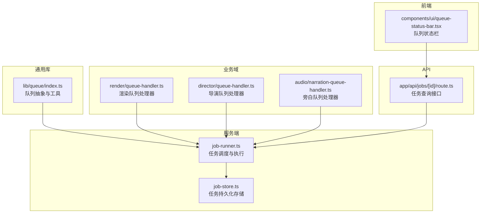
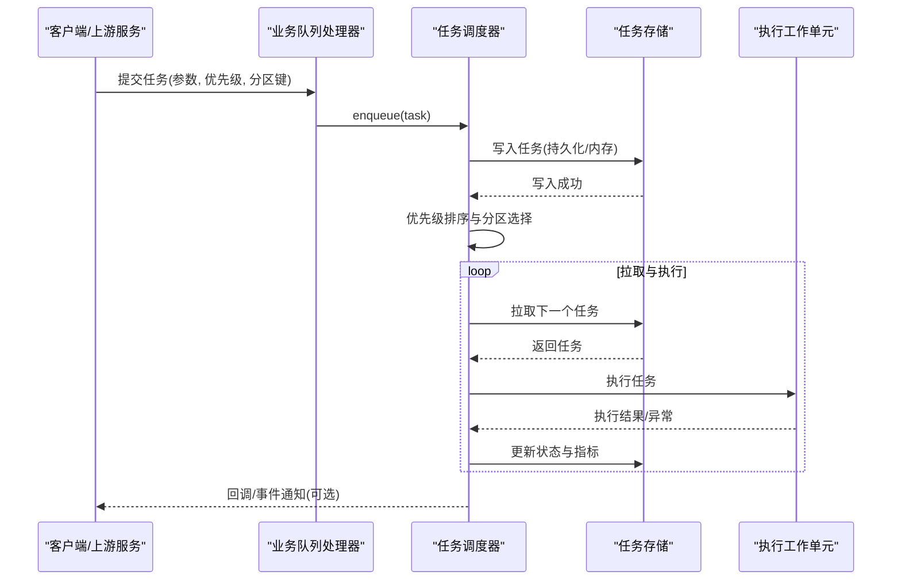
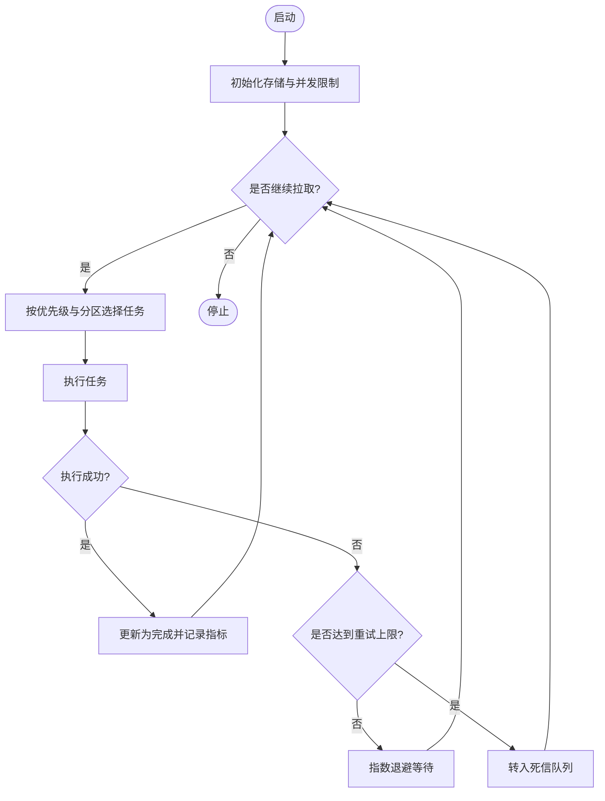
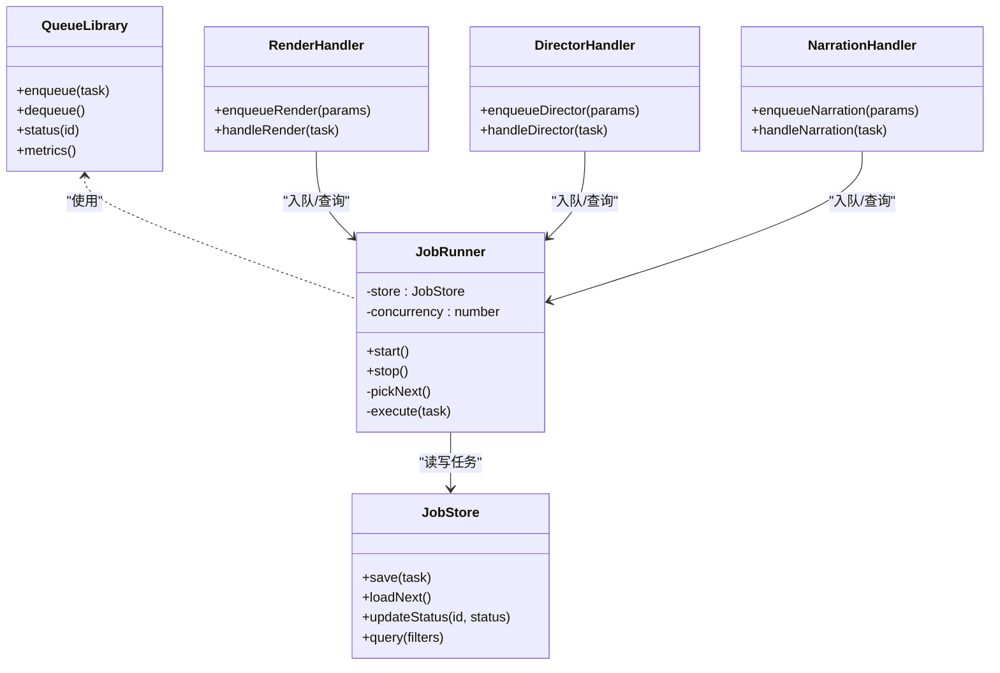

# 作业队列系统

<cite>
**本文引用的文件**   
- [server/src/server/job-runner.ts](file://server/src/server/job-runner.ts)
- [server/src/server/job-store.ts](file://server/src/server/job-store.ts)
- [src/features/director/queue-handler.ts](file://src/features/director/queue-handler.ts)
- [src/features/render/queue-handler.ts](file://src/features/render/queue-handler.ts)
- [src/features/audio/narration-queue-handler.ts](file://src/features/audio/narration-queue-handler.ts)
- [src/lib/queue/index.ts](file://src/lib/queue/index.ts)
- [src/components/ui/queue-status-bar.tsx](file://src/components/ui/queue-status-bar.tsx)
- [src/app/api/jobs/[id]/route.ts](file://src/app/api/jobs/[id]/route.ts)
- [docs/designs/ISSUE-004-queue-concurrency-lanes.md](file://docs/designs/ISSUE-004-queue-concurrency-lanes.md)
</cite>

## 目录
1. [简介](#简介)
2. [项目结构](#项目结构)
3. [核心组件](#核心组件)
4. [架构总览](#架构总览)
5. [详细组件分析](#详细组件分析)
6. [依赖关系分析](#依赖关系分析)
7. [性能考量](#性能考量)
8. [故障排查指南](#故障排查指南)
9. [结论](#结论)
10. [附录](#附录)

## 简介
本文件面向PurpleInk作业队列系统，系统性阐述队列存储机制（内存与持久化）、任务优先级管理、分区策略、序列化与反序列化、监控接口（长度统计、状态查询、性能指标）、配置选项、扩展点设计与自定义实现指南，并提供操作示例与故障恢复策略。文档以代码仓库中的实际实现为依据，辅以可视化图示帮助理解。

## 项目结构
队列相关能力分布在服务端运行器、各业务域处理器以及通用库中：
- 服务端运行器与存储：负责调度执行与持久化
- 业务域处理器：渲染、导演、音频等具体任务的入队与处理逻辑
- 通用队列库：提供统一的队列抽象与工具
- 前端UI：展示队列状态与进度
- API路由：对外暴露任务查询与状态接口

图表来源
- [server/src/server/job-runner.ts](file://server/src/server/job-runner.ts)
- [server/src/server/job-store.ts](file://server/src/server/job-store.ts)
- [src/features/render/queue-handler.ts](file://src/features/render/queue-handler.ts)
- [src/features/director/queue-handler.ts](file://src/features/director/queue-handler.ts)
- [src/features/audio/narration-queue-handler.ts](file://src/features/audio/narration-queue-handler.ts)
- [src/lib/queue/index.ts](file://src/lib/queue/index.ts)
- [src/components/ui/queue-status-bar.tsx](file://src/components/ui/queue-status-bar.tsx)
- [src/app/api/jobs/[id]/route.ts](file://src/app/api/jobs/[id]/route.ts)

章节来源
- [server/src/server/job-runner.ts](file://server/src/server/job-runner.ts)
- [server/src/server/job-store.ts](file://server/src/server/job-store.ts)
- [src/lib/queue/index.ts](file://src/lib/queue/index.ts)

## 核心组件
- 任务调度器（Job Runner）：从队列拉取任务、分配执行上下文、维护并发与重试、记录执行结果与状态迁移
- 任务存储（Job Store）：提供任务的持久化读写、状态更新、索引与查询；支持内存与数据库两种后端
- 业务队列处理器（Queue Handlers）：渲染、导演、旁白等具体任务类型的入队、参数校验、执行编排与结果落盘
- 通用队列库（Queue Library）：定义队列接口、优先级排序、分区键、序列化/反序列化、错误封装与指标上报
- 监控与UI：队列长度统计、任务状态查询、性能指标收集与前端状态展示

章节来源
- [server/src/server/job-runner.ts](file://server/src/server/job-runner.ts)
- [server/src/server/job-store.ts](file://server/src/server/job-store.ts)
- [src/lib/queue/index.ts](file://src/lib/queue/index.ts)

## 架构总览
队列系统采用“处理器-调度器-存储”分层设计：
- 处理器层：按业务域划分，负责构造任务、设置优先级与分区键、调用调度器入队
- 调度层：统一拉取、去重、并发控制、重试与超时、状态机推进
- 存储层：内存或持久化后端，保证任务可恢复、可观测、可审计

图表来源
- [server/src/server/job-runner.ts](file://server/src/server/job-runner.ts)
- [server/src/server/job-store.ts](file://server/src/server/job-store.ts)
- [src/features/render/queue-handler.ts](file://src/features/render/queue-handler.ts)
- [src/features/director/queue-handler.ts](file://src/features/director/queue-handler.ts)
- [src/features/audio/narration-queue-handler.ts](file://src/features/audio/narration-queue-handler.ts)

## 详细组件分析

### 任务调度器（Job Runner）
职责与行为
- 拉取策略：按优先级与分区键选择任务，避免热点分区阻塞
- 并发控制：限制同时执行的任务数，防止资源耗尽
- 重试与退避：对失败任务进行指数退避重试，达到上限后进入死信队列
- 状态机：待处理→进行中→完成/失败→重试→死信
- 指标采集：拉取耗时、执行时长、失败率、队列长度等

关键流程（简化）

图表来源
- [server/src/server/job-runner.ts](file://server/src/server/job-runner.ts)

章节来源
- [server/src/server/job-runner.ts](file://server/src/server/job-runner.ts)

### 任务存储（Job Store）
职责与行为
- 内存模式：进程内数据结构，适合开发测试与无状态短生命周期场景
- 持久化模式：基于数据库的表结构与索引，支持跨实例共享与崩溃恢复
- 事务与一致性：状态更新需原子性，避免重复消费与丢失
- 查询与统计：按状态、分区、优先级、时间范围查询；聚合统计长度与分布

内存与持久化差异
- 内存：低延迟、无外部依赖；重启丢失，不适合生产
- 持久化：高可靠、可恢复；需要连接池与索引优化

章节来源
- [server/src/server/job-store.ts](file://server/src/server/job-store.ts)

### 业务队列处理器（渲染、导演、旁白）
共同点
- 入队前校验：参数合法性、权限检查、资源配额
- 任务构建：填充类型、优先级、分区键、超时、重试策略
- 执行编排：调用外部服务、IO密集操作、结果归档
- 错误处理：分类错误码、重试策略、告警上报

差异化
- 渲染：媒体编码、帧捕获、缩略图生成，I/O与CPU密集
- 导演：AI提示词组装、模型调用、产物校验
- 旁白：TTS合成、字幕对齐、音频拼接

章节来源
- [src/features/render/queue-handler.ts](file://src/features/render/queue-handler.ts)
- [src/features/director/queue-handler.ts](file://src/features/director/queue-handler.ts)
- [src/features/audio/narration-queue-handler.ts](file://src/features/audio/narration-queue-handler.ts)

### 通用队列库（Queue Library）
职责与行为
- 队列接口：enqueue、dequeue、status、metrics
- 优先级：数值越小优先级越高，支持同优先级时间戳顺序
- 分区策略：按业务维度（如项目ID、用户ID）分片，避免热点
- 序列化：任务对象序列化为稳定格式，支持版本兼容与回滚
- 指标：计数、直方图、速率、错误率

章节来源
- [src/lib/queue/index.ts](file://src/lib/queue/index.ts)

### 监控与UI（队列状态栏与API）
- 队列状态栏：实时显示队列长度、活跃任务数、最近失败任务
- 任务查询API：按ID获取任务详情（状态、阶段、错误信息、耗时）
- 指标收集：拉取间隔、执行时长分布、重试次数、死信数量

章节来源
- [src/components/ui/queue-status-bar.tsx](file://src/components/ui/queue-status-bar.tsx)
- [src/app/api/jobs/[id]/route.ts](file://src/app/api/jobs/[id]/route.ts)

## 依赖关系分析

图表来源
- [src/lib/queue/index.ts](file://src/lib/queue/index.ts)
- [server/src/server/job-runner.ts](file://server/src/server/job-runner.ts)
- [server/src/server/job-store.ts](file://server/src/server/job-store.ts)
- [src/features/render/queue-handler.ts](file://src/features/render/queue-handler.ts)
- [src/features/director/queue-handler.ts](file://src/features/director/queue-handler.ts)
- [src/features/audio/narration-queue-handler.ts](file://src/features/audio/narration-queue-handler.ts)

章节来源
- [src/lib/queue/index.ts](file://src/lib/queue/index.ts)
- [server/src/server/job-runner.ts](file://server/src/server/job-runner.ts)
- [server/src/server/job-store.ts](file://server/src/server/job-store.ts)

## 性能考量
- 并发度调优：根据CPU与I/O特性调整最大并发，避免上下文切换开销
- 分区键设计：将热点任务分散到不同分区，减少锁竞争与长尾
- 序列化成本：尽量使用轻量级结构，避免大对象频繁拷贝
- 存储后端：持久化模式下建立合适的索引，批量更新状态
- 指标采样：对高频指标进行降采样与聚合，降低监控压力

[本节为通用指导，不直接分析具体文件]

## 故障排查指南
常见问题与定位步骤
- 任务堆积：检查分区键是否集中、消费者是否健康、存储是否可用
- 执行失败：查看错误码与堆栈，确认重试策略与死信队列
- 状态不一致：核对状态更新的事务性与幂等性
- 性能退化：观察指标分布，识别慢查询与热点分区

恢复策略
- 自动重试：指数退避+上限保护
- 死信队列：人工介入与补偿脚本
- 快照与回滚：任务快照保存，支持回滚到上一阶段

章节来源
- [server/src/server/job-runner.ts](file://server/src/server/job-runner.ts)
- [server/src/server/job-store.ts](file://server/src/server/job-store.ts)

## 结论
PurpleInk作业队列系统通过清晰的层次划分与可扩展的抽象，实现了高可靠、可观测、可恢复的任务处理能力。内存与持久化双后端满足不同场景需求，优先级与分区策略保障吞吐与公平性。配合完善的监控与故障恢复机制，可在复杂业务环境下稳定运行。

[本节为总结性内容，不直接分析具体文件]

## 附录

### 队列配置选项
- 并发度：最大并行任务数
- 分区策略：分区键字段与哈希函数
- 优先级：默认优先级与覆盖规则
- 重试策略：最大重试次数、退避算法、超时时间
- 存储后端：内存或数据库连接参数
- 指标开关：是否启用指标采集与导出

[本节为配置说明，不直接分析具体文件]

### 扩展点设计与自定义实现指南
- 新增任务类型：在对应业务处理器中实现入队与执行逻辑
- 自定义存储后端：实现JobStore接口，适配内存或数据库
- 自定义分区策略：实现分区函数，确保均匀分布
- 自定义指标：扩展指标采集与上报逻辑

章节来源
- [src/lib/queue/index.ts](file://src/lib/queue/index.ts)
- [server/src/server/job-store.ts](file://server/src/server/job-store.ts)

### 队列操作示例
- 入队渲染任务：设置项目ID为分区键，优先级为中等，超时为5分钟
- 查询任务状态：按任务ID获取当前阶段、错误信息与耗时
- 监控队列长度：按分区与状态聚合统计，绘制趋势图

章节来源
- [src/app/api/jobs/[id]/route.ts](file://src/app/api/jobs/[id]/route.ts)
- [src/components/ui/queue-status-bar.tsx](file://src/components/ui/queue-status-bar.tsx)

### 任务优先级管理与分区策略
- 优先级：数值越小越优先，同优先级按入队时间排序
- 分区：按业务维度（项目、用户、租户）分片，避免热点
- 公平性：每个分区独立拉取，防止单分区饥饿

章节来源
- [docs/designs/ISSUE-004-queue-concurrency-lanes.md](file://docs/designs/ISSUE-004-queue-concurrency-lanes.md)

### 任务序列化与反序列化
- 序列化格式：包含任务类型、参数、元数据、版本信息
- 兼容性：向后兼容旧版本，支持字段弃用与迁移
- 校验：反序列化时进行结构校验与必填字段检查

章节来源
- [src/lib/queue/index.ts](file://src/lib/queue/index.ts)

### 队列监控接口
- 队列长度统计：按状态与分区聚合
- 任务状态查询：按ID或过滤条件查询
- 性能指标：拉取间隔、执行时长、失败率、重试次数

章节来源
- [src/app/api/jobs/[id]/route.ts](file://src/app/api/jobs/[id]/route.ts)
- [src/components/ui/queue-status-bar.tsx](file://src/components/ui/queue-status-bar.tsx)