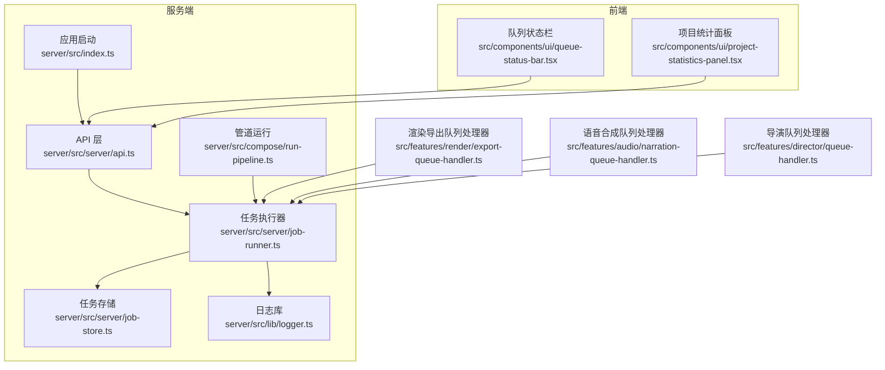
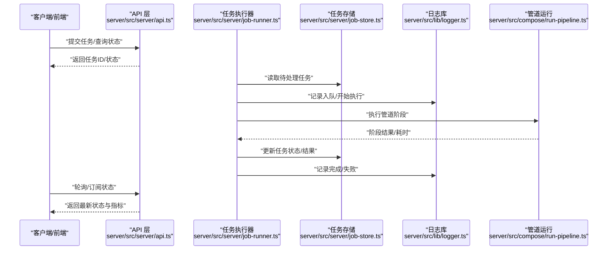
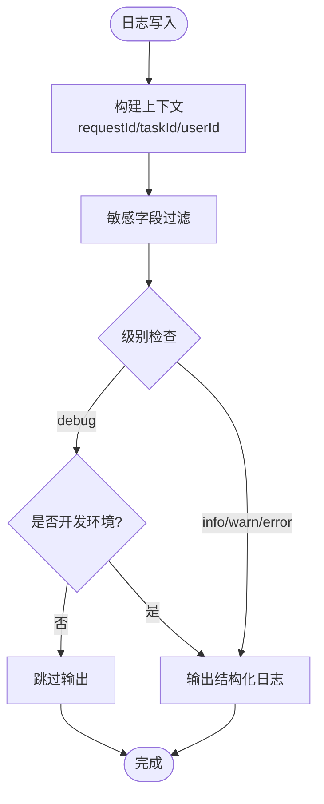
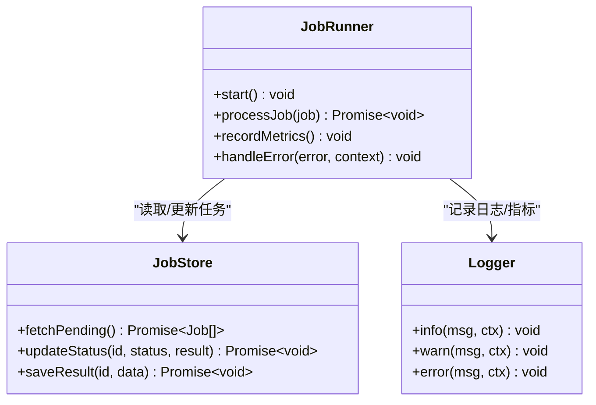
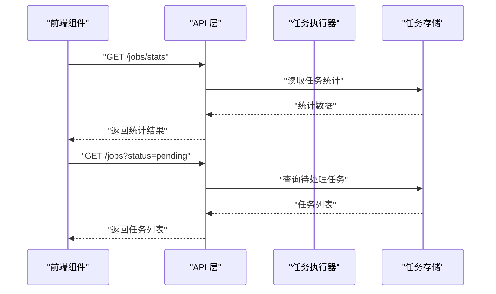
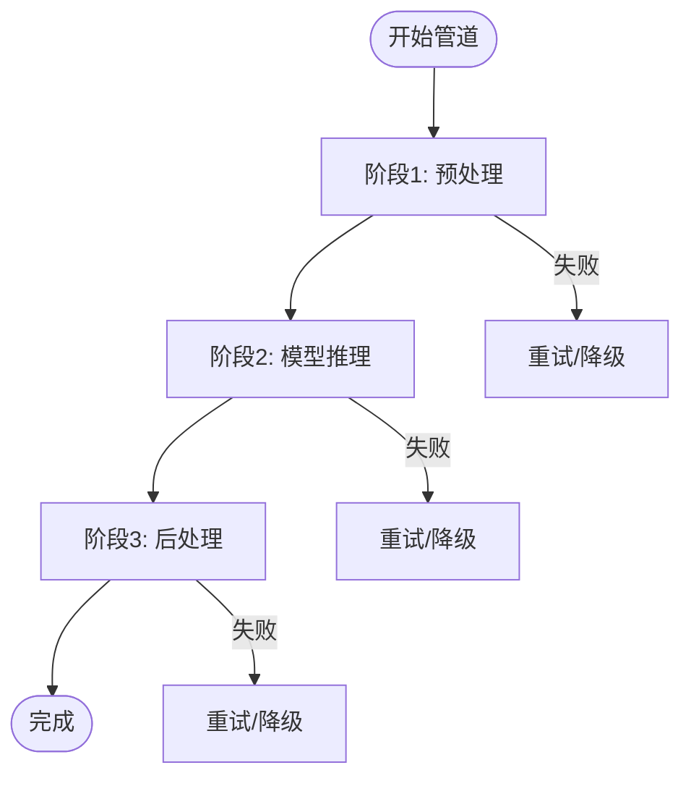
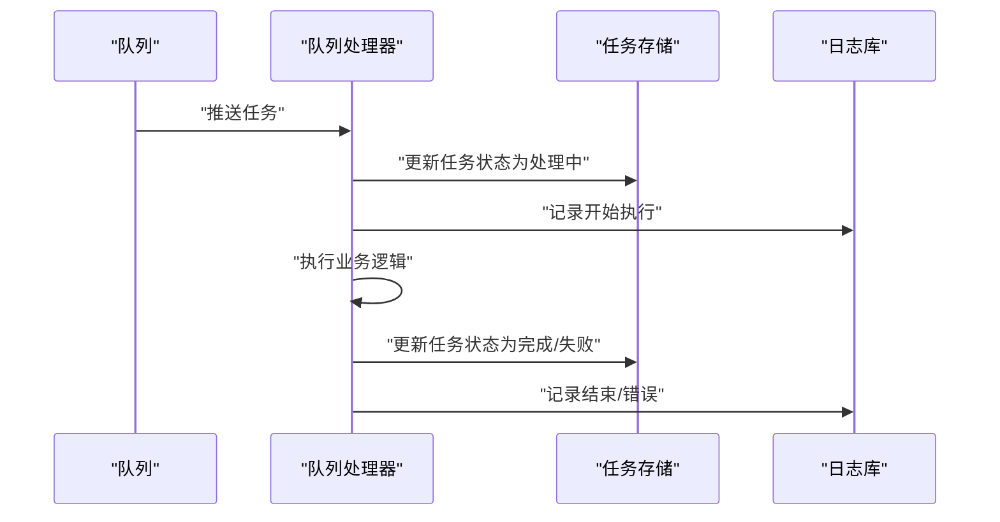
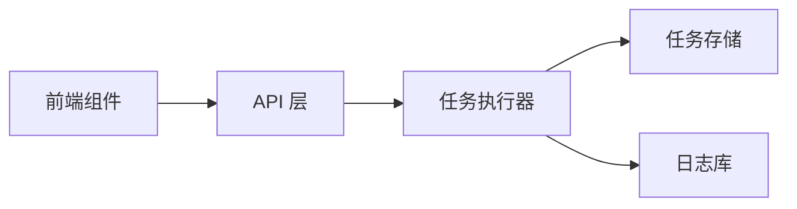

# 监控与日志

<cite>
**本文引用的文件**   
- [logger.ts](file://server/src/lib/logger.ts)
- [job-runner.ts](file://server/src/server/job-runner.ts)
- [job-store.ts](file://server/src/server/job-store.ts)
- [api.ts](file://server/src/server/api.ts)
- [index.ts](file://server/src/index.ts)
- [queue-status-bar.tsx](file://src/components/ui/queue-status-bar.tsx)
- [project-statistics-panel.tsx](file://src/components/ui/project-statistics-panel.tsx)
- [run-pipeline.ts](file://server/src/compose/run-pipeline.ts)
- [export-queue-handler.ts](file://src/features/render/export-queue-handler.ts)
- [narration-queue-handler.ts](file://src/features/audio/narration-queue-handler.ts)
- [queue-handler.ts](file://src/features/director/queue-handler.ts)
</cite>

## 目录
1. [简介](#简介)
2. [项目结构](#项目结构)
3. [核心组件](#核心组件)
4. [架构总览](#架构总览)
5. [详细组件分析](#详细组件分析)
6. [依赖关系分析](#依赖关系分析)
7. [性能考量](#性能考量)
8. [故障排查指南](#故障排查指南)
9. [结论](#结论)
10. [附录](#附录)

## 简介
本文件面向 PurpleInk 任务处理系统的“监控与日志”能力，覆盖以下目标：
- 日志记录策略：结构化日志、分级记录、敏感信息过滤、可观测性字段。
- 监控指标收集：CPU 使用率、内存占用、队列长度、任务耗时等关键指标。
- 告警机制：阈值配置、通知渠道、告警规则与联动。
- 调试工具：日志查询、性能分析、问题诊断方法。
- 监控面板配置与自定义监控指标开发指南。

## 项目结构
PurpleInk 的监控与日志相关代码主要分布在服务端与前端两部分：
- 服务端（Node.js）
  - 日志库与基础能力：server/src/lib/logger.ts
  - 任务执行器与持久化：server/src/server/job-runner.ts、server/src/server/job-store.ts
  - API 入口与路由：server/src/server/api.ts
  - 应用启动与初始化：server/src/index.ts
  - 管道编排与运行：server/src/compose/run-pipeline.ts
- 前端（Next.js）
  - 队列状态展示：src/components/ui/queue-status-bar.tsx
  - 项目统计面板：src/components/ui/project-statistics-panel.tsx
- 业务队列处理器
  - 渲染导出队列：src/features/render/export-queue-handler.ts
  - 语音合成队列：src/features/audio/narration-queue-handler.ts
  - 导演队列：src/features/director/queue-handler.ts

**图表来源** 
- [api.ts](file://server/src/server/api.ts)
- [job-runner.ts](file://server/src/server/job-runner.ts)
- [job-store.ts](file://server/src/server/job-store.ts)
- [logger.ts](file://server/src/lib/logger.ts)
- [index.ts](file://server/src/index.ts)
- [run-pipeline.ts](file://server/src/compose/run-pipeline.ts)
- [queue-status-bar.tsx](file://src/components/ui/queue-status-bar.tsx)
- [project-statistics-panel.tsx](file://src/components/ui/project-statistics-panel.tsx)
- [export-queue-handler.ts](file://src/features/render/export-queue-handler.ts)
- [narration-queue-handler.ts](file://src/features/audio/narration-queue-handler.ts)
- [queue-handler.ts](file://src/features/director/queue-handler.ts)

**章节来源**
- [logger.ts](file://server/src/lib/logger.ts)
- [job-runner.ts](file://server/src/server/job-runner.ts)
- [job-store.ts](file://server/src/server/job-store.ts)
- [api.ts](file://server/src/server/api.ts)
- [index.ts](file://server/src/index.ts)
- [run-pipeline.ts](file://server/src/compose/run-pipeline.ts)
- [queue-status-bar.tsx](file://src/components/ui/queue-status-bar.tsx)
- [project-statistics-panel.tsx](file://src/components/ui/project-statistics-panel.tsx)
- [export-queue-handler.ts](file://src/features/render/export-queue-handler.ts)
- [narration-queue-handler.ts](file://src/features/audio/narration-queue-handler.ts)
- [queue-handler.ts](file://src/features/director/queue-handler.ts)

## 核心组件
- 日志库（logger.ts）
  - 提供结构化日志输出、分级记录（如 info/warn/error）、上下文注入（请求ID、任务ID、用户ID等）。
  - 支持敏感字段过滤（如密钥、令牌、密码），避免泄露到日志中。
- 任务执行器（job-runner.ts）
  - 负责从队列拉取任务、调度执行、记录生命周期事件、上报指标。
  - 与 job-store 交互以持久化任务状态与结果。
- 任务存储（job-store.ts）
  - 抽象任务数据的读写接口，便于切换底层存储（内存/数据库）。
- API 层（api.ts）
  - 暴露任务查询、提交、状态获取等接口，供前端与外部系统调用。
- 应用启动（index.ts）
  - 初始化日志、连接存储、启动任务执行器与 HTTP 服务。
- 管道运行（run-pipeline.ts）
  - 编排多阶段任务，记录阶段耗时与错误，支撑端到端追踪。
- 前端监控组件
  - 队列状态栏：实时显示队列长度、吞吐、失败率等。
  - 项目统计面板：聚合项目维度的任务成功率、平均耗时等。

**章节来源**
- [logger.ts](file://server/src/lib/logger.ts)
- [job-runner.ts](file://server/src/server/job-runner.ts)
- [job-store.ts](file://server/src/server/job-store.ts)
- [api.ts](file://server/src/server/api.ts)
- [index.ts](file://server/src/index.ts)
- [run-pipeline.ts](file://server/src/compose/run-pipeline.ts)
- [queue-status-bar.tsx](file://src/components/ui/queue-status-bar.tsx)
- [project-statistics-panel.tsx](file://src/components/ui/project-statistics-panel.tsx)

## 架构总览
下图展示了 PurpleInk 任务处理的监控与日志整体架构：客户端通过 API 提交或查询任务；任务执行器从队列消费并执行，期间通过日志库记录结构化日志，并通过存储持久化状态；前端组件通过 API 获取队列与统计信息，形成可视化监控。

**图表来源** 
- [api.ts](file://server/src/server/api.ts)
- [job-runner.ts](file://server/src/server/job-runner.ts)
- [job-store.ts](file://server/src/server/job-store.ts)
- [logger.ts](file://server/src/lib/logger.ts)
- [run-pipeline.ts](file://server/src/compose/run-pipeline.ts)

## 详细组件分析

### 日志记录策略（logger.ts）
- 结构化日志
  - 每条日志包含统一字段：时间戳、级别、模块、消息、上下文键值对（如 requestId、taskId、userId、projectId）。
  - 建议将业务关键路径（入队、出队、开始、结束、失败）均输出结构化日志，便于检索与聚合。
- 分级记录
  - debug：仅开发环境启用，用于详细跟踪。
  - info：正常业务流程事件。
  - warn：潜在风险或降级行为。
  - error：异常与失败，附带堆栈与上下文。
- 敏感信息过滤
  - 在日志输出前对已知敏感字段进行脱敏或移除（如 token、password、secret、apiKey）。
  - 建议在 logger 中集中实现过滤逻辑，避免在各处重复处理。
- 可观测性字段
  - 为每个任务生成唯一 taskId，贯穿整个生命周期。
  - 为每次请求生成 requestId，便于跨服务链路追踪。
  - 记录资源指标快照（如内存、CPU）在关键节点，辅助性能分析。

**图表来源** 
- [logger.ts](file://server/src/lib/logger.ts)

**章节来源**
- [logger.ts](file://server/src/lib/logger.ts)

### 任务执行与指标采集（job-runner.ts）
- 任务生命周期
  - 入队：记录入队时间与队列长度。
  - 出队：记录出队时间、并发度。
  - 执行：记录阶段开始/结束、耗时、错误。
  - 完成：记录最终状态、总耗时、重试次数。
- 指标采集
  - 队列长度：当前待处理任务数。
  - 吞吐：单位时间内处理的任务数。
  - 延迟：入队到开始执行的时延。
  - 成功率/失败率：按任务类型或项目维度统计。
  - 资源使用：CPU、内存、I/O 等待（可在关键节点采样）。
- 错误处理
  - 捕获异常并记录错误日志，附带堆栈与上下文。
  - 支持重试策略与退避，避免雪崩。

**图表来源** 
- [job-runner.ts](file://server/src/server/job-runner.ts)
- [job-store.ts](file://server/src/server/job-store.ts)
- [logger.ts](file://server/src/lib/logger.ts)

**章节来源**
- [job-runner.ts](file://server/src/server/job-runner.ts)
- [job-store.ts](file://server/src/server/job-store.ts)
- [logger.ts](file://server/src/lib/logger.ts)

### API 与前端监控（api.ts、queue-status-bar.tsx、project-statistics-panel.tsx）
- API 层
  - 提供任务提交、状态查询、统计聚合接口。
  - 对请求进行鉴权与限流，记录访问日志。
- 前端组件
  - 队列状态栏：展示队列长度、吞吐、失败率，支持刷新与筛选。
  - 项目统计面板：展示项目维度的成功率、平均耗时、峰值负载。
- 数据流
  - 前端定时轮询或 WebSocket 订阅，获取后端指标并渲染。

**图表来源** 
- [api.ts](file://server/src/server/api.ts)
- [queue-status-bar.tsx](file://src/components/ui/queue-status-bar.tsx)
- [project-statistics-panel.tsx](file://src/components/ui/project-statistics-panel.tsx)
- [job-store.ts](file://server/src/server/job-store.ts)

**章节来源**
- [api.ts](file://server/src/server/api.ts)
- [queue-status-bar.tsx](file://src/components/ui/queue-status-bar.tsx)
- [project-statistics-panel.tsx](file://src/components/ui/project-statistics-panel.tsx)

### 管道运行与阶段指标（run-pipeline.ts）
- 阶段编排
  - 定义阶段顺序、依赖、重试策略。
  - 记录每阶段的输入/输出摘要与耗时。
- 指标与日志
  - 阶段成功/失败计数。
  - 阶段耗时分布（P50/P95/P99）。
  - 错误分类与归因（网络、超时、参数校验等）。

**图表来源** 
- [run-pipeline.ts](file://server/src/compose/run-pipeline.ts)

**章节来源**
- [run-pipeline.ts](file://server/src/compose/run-pipeline.ts)

### 队列处理器（export-queue-handler.ts、narration-queue-handler.ts、queue-handler.ts）
- 通用模式
  - 接收任务载荷，校验参数，执行业务逻辑。
  - 记录入队/出队/开始/结束/失败日志。
  - 上报队列长度、处理时长、错误率等指标。
- 差异化
  - 渲染导出：涉及媒体编码、I/O 密集，需关注磁盘与 CPU。
  - 语音合成：依赖外部 TTS 服务，需关注网络延迟与配额。
  - 导演队列：复杂编排，需关注阶段间数据一致性。

**图表来源** 
- [export-queue-handler.ts](file://src/features/render/export-queue-handler.ts)
- [narration-queue-handler.ts](file://src/features/audio/narration-queue-handler.ts)
- [queue-handler.ts](file://src/features/director/queue-handler.ts)
- [job-store.ts](file://server/src/server/job-store.ts)
- [logger.ts](file://server/src/lib/logger.ts)

**章节来源**
- [export-queue-handler.ts](file://src/features/render/export-queue-handler.ts)
- [narration-queue-handler.ts](file://src/features/audio/narration-queue-handler.ts)
- [queue-handler.ts](file://src/features/director/queue-handler.ts)
- [job-store.ts](file://server/src/server/job-store.ts)
- [logger.ts](file://server/src/lib/logger.ts)

## 依赖关系分析
- 组件耦合
  - job-runner 依赖 job-store 与 logger，职责清晰，低耦合。
  - api.ts 作为入口，依赖 runner 与 store，便于扩展新接口。
  - 前端组件仅依赖 API，不直接访问存储。
- 外部依赖
  - 存储抽象（job-store）可替换为内存、SQLite、PostgreSQL 等。
  - 日志可对接外部系统（如 ELK、Sentry、Prometheus）。
- 潜在循环依赖
  - 确保 runner 不反向依赖 api，避免循环。

**图表来源** 
- [api.ts](file://server/src/server/api.ts)
- [job-runner.ts](file://server/src/server/job-runner.ts)
- [job-store.ts](file://server/src/server/job-store.ts)
- [logger.ts](file://server/src/lib/logger.ts)
- [queue-status-bar.tsx](file://src/components/ui/queue-status-bar.tsx)
- [project-statistics-panel.tsx](file://src/components/ui/project-statistics-panel.tsx)

**章节来源**
- [api.ts](file://server/src/server/api.ts)
- [job-runner.ts](file://server/src/server/job-runner.ts)
- [job-store.ts](file://server/src/server/job-store.ts)
- [logger.ts](file://server/src/lib/logger.ts)
- [queue-status-bar.tsx](file://src/components/ui/queue-status-bar.tsx)
- [project-statistics-panel.tsx](file://src/components/ui/project-statistics-panel.tsx)

## 性能考量
- 日志开销
  - 避免在高吞吐路径上频繁序列化大对象。
  - 使用异步日志与批量写入，降低阻塞。
- 指标采集
  - 采样而非全量记录，减少存储压力。
  - 使用计数器与直方图，提升聚合效率。
- 队列优化
  - 动态调整并发度，避免过载。
  - 设置超时与重试上限，防止任务堆积。
- 资源监控
  - 定期采集 CPU、内存、I/O 指标，识别瓶颈。
  - 结合分布式追踪，定位慢调用链。

[本节为通用指导，无需特定文件引用]

## 故障排查指南
- 日志查询
  - 使用 requestId 与 taskId 关联上下游日志。
  - 按级别筛选 error/warn，快速定位异常。
  - 过滤敏感字段，确保合规。
- 性能分析
  - 查看任务耗时分布，识别长尾任务。
  - 检查队列长度与吞吐，判断是否拥塞。
  - 分析阶段耗时，定位具体瓶颈。
- 问题诊断
  - 检查重试与退避策略是否合理。
  - 验证外部依赖（存储、TTS、模型服务）可用性。
  - 使用健康检查接口确认服务状态。

**章节来源**
- [logger.ts](file://server/src/lib/logger.ts)
- [job-runner.ts](file://server/src/server/job-runner.ts)
- [job-store.ts](file://server/src/server/job-store.ts)
- [api.ts](file://server/src/server/api.ts)

## 结论
PurpleInk 的监控与日志体系围绕结构化日志、任务执行指标、前端可视化与管道编排展开。通过统一的日志库与任务执行器，实现了高内聚、低耦合的可观测性能力。建议在生产环境中进一步集成外部监控系统（如 Prometheus/Grafana/Sentry），完善告警与面板，提升运维效率与问题定位速度。

[本节为总结，无需特定文件引用]

## 附录
- 监控面板配置建议
  - 核心指标：队列长度、吞吐、延迟、成功率、失败率、CPU、内存。
  - 维度：任务类型、项目、阶段、错误码。
  - 视图：趋势图、热力图、TopN 慢任务。
- 自定义监控指标开发指南
  - 在 logger 中增加指标埋点，统一命名规范。
  - 在 job-runner 中采集阶段耗时与错误分类。
  - 在前端组件中展示聚合后的指标，支持筛选与下钻。

[本节为补充说明，无需特定文件引用]