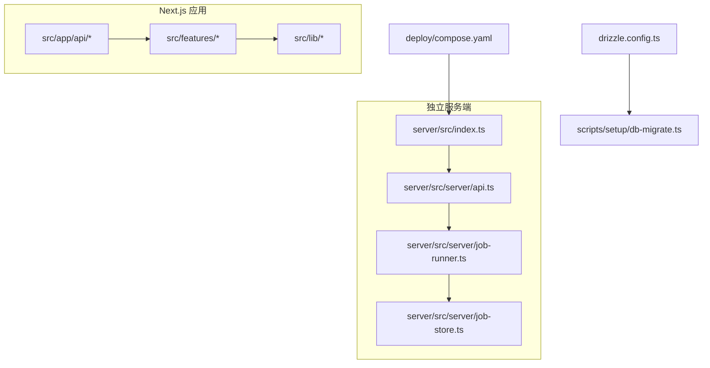
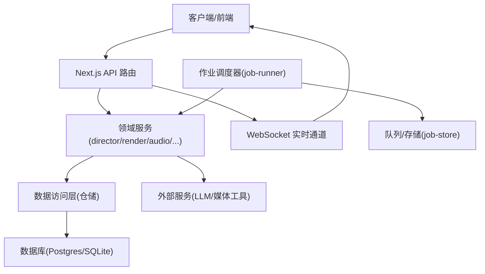
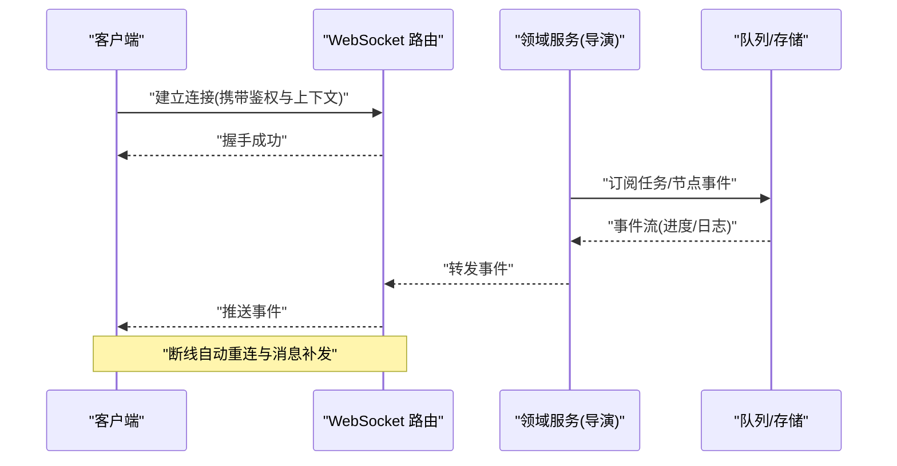
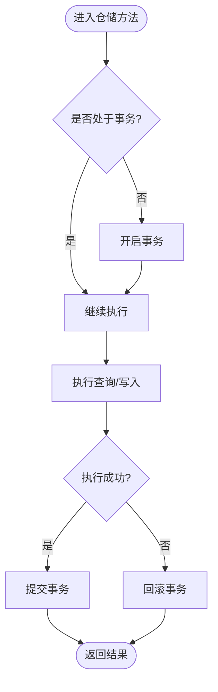
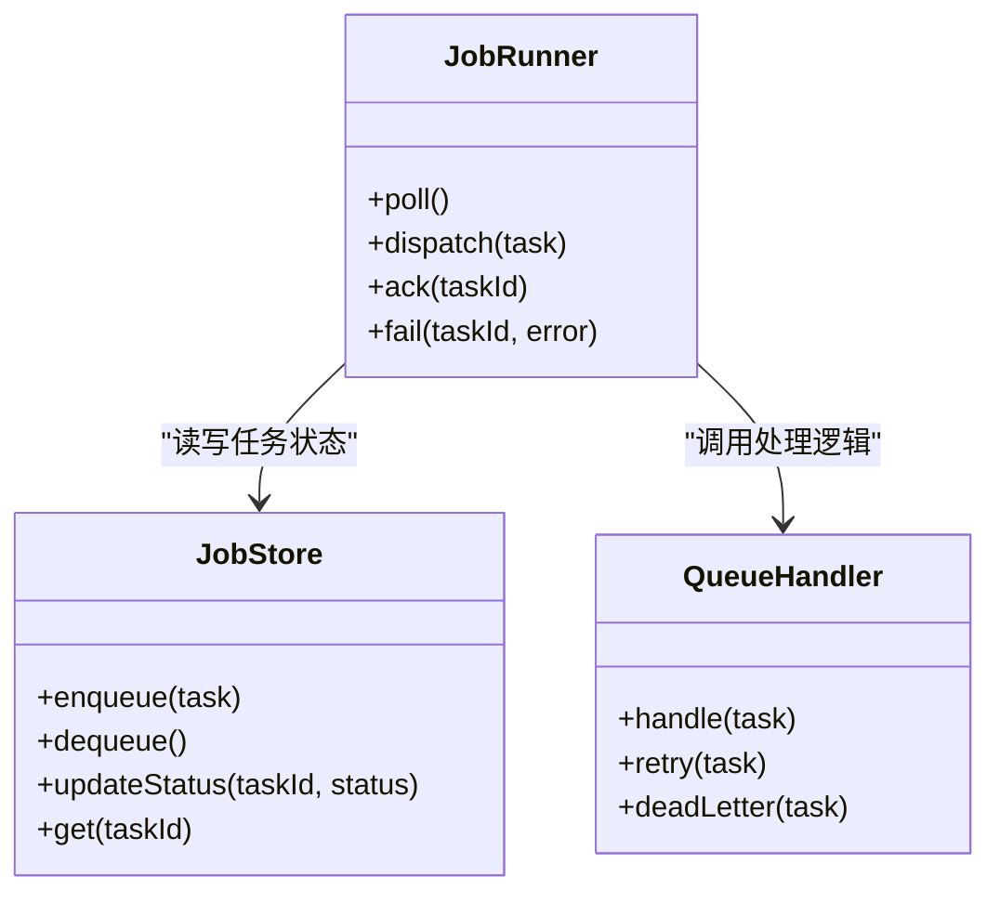
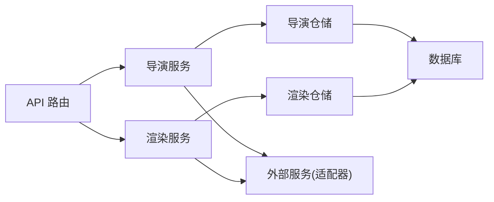

# 后端架构

<cite>
**本文引用的文件**   
- [server/src/index.ts](file://server/src/index.ts)
- [server/src/server/api.ts](file://server/src/server/api.ts)
- [server/src/server/job-runner.ts](file://server/src/server/job-runner.ts)
- [server/src/server/job-store.ts](file://server/src/server/job-store.ts)
- [src/app/api/artifacts/[id]/route.ts](file://src/app/api/artifacts/[id]/route.ts)
- [src/app/api/director/pipeline/route.ts](file://src/app/api/director/pipeline/route.ts)
- [src/app/api/director/stage/route.ts](file://src/app/api/director/stage/route.ts)
- [src/app/api/director/stream/[nodeId]/route.ts](file://src/app/api/director/stream/[nodeId]/route.ts)
- [src/app/api/director/stream/project/[projectId]/route.ts](file://src/app/api/director/stream/project/[projectId]/route.ts)
- [src/app/api/jobs/[id]/route.ts](file://src/app/api/jobs/[id]/route.ts)
- [src/app/api/projects/route.ts](file://src/app/api/projects/route.ts)
- [src/app/api/projects/[id]/route.ts](file://src/app/api/projects/[id]/route.ts)
- [src/app/api/render/route.ts](file://src/app/api/render/route.ts)
- [src/app/api/render/export/route.ts](file://src/app/api/render/export/route.ts)
- [src/app/api/settings/route.ts](file://src/app/api/settings/route.ts)
- [src/features/director/queue-handler.ts](file://src/features/director/queue-handler.ts)
- [src/features/director/runtime-repository.ts](file://src/features/director/runtime-repository.ts)
- [src/features/render/queue-handler.ts](file://src/features/render/queue-handler.ts)
- [src/features/render/repository.ts](file://src/features/render/repository.ts)
- [drizzle.config.ts](file://drizzle.config.ts)
- [scripts/setup/db-migrate.ts](file://scripts/setup/db-migrate.ts)
- [deploy/compose.yaml](file://deploy/compose.yaml)
</cite>

## 目录
1. [简介](#简介)
2. [项目结构](#项目结构)
3. [核心组件](#核心组件)
4. [架构总览](#架构总览)
5. [详细组件分析](#详细组件分析)
6. [依赖关系分析](#依赖关系分析)
7. [性能考量](#性能考量)
8. [故障排查指南](#故障排查指南)
9. [结论](#结论)
10. [附录](#附录)

## 简介
本文件为 PurpleInk 后端系统的全面架构文档，面向开发者与运维人员。内容覆盖 API 设计原则、RESTful 接口规范、WebSocket 实时通信机制、服务层架构、业务逻辑封装、数据访问层抽象、数据库 ORM 使用模式、查询优化策略与事务管理、认证授权系统、中间件设计、错误处理策略、缓存策略、队列系统与异步任务处理、API 版本管理、安全考虑与性能监控方案等。

## 项目结构
PurpleInk 采用 Next.js App Router 作为 HTTP/WebSocket 入口，结合 server 子工程承载独立运行时（如渲染/采集/编排）。关键目录说明：
- src/app/api：Next.js 路由处理器，按功能域组织 REST API。
- src/features：按领域划分的业务特性模块（导演、渲染、音频、凭证、路由等），实现服务层与仓储层。
- server/src：独立服务端代码，包含 API 聚合、作业调度器与持久化存储。
- scripts：迁移、初始化与验证脚本。
- deploy：容器编排与环境配置。

**图表来源** 
- [server/src/index.ts](file://server/src/index.ts)
- [server/src/server/api.ts](file://server/src/server/api.ts)
- [server/src/server/job-runner.ts](file://server/src/server/job-runner.ts)
- [server/src/server/job-store.ts](file://server/src/server/job-store.ts)
- [drizzle.config.ts](file://drizzle.config.ts)
- [scripts/setup/db-migrate.ts](file://scripts/setup/db-migrate.ts)
- [deploy/compose.yaml](file://deploy/compose.yaml)

**章节来源**
- [server/src/index.ts](file://server/src/index.ts)
- [server/src/server/api.ts](file://server/src/server/api.ts)
- [drizzle.config.ts](file://drizzle.config.ts)
- [scripts/setup/db-migrate.ts](file://scripts/setup/db-migrate.ts)
- [deploy/compose.yaml](file://deploy/compose.yaml)

## 核心组件
- API 网关与路由聚合：Next.js App Router 暴露 REST 端点；server 侧提供统一 API 聚合与作业调度。
- 作业调度与执行：job-runner 负责拉取、分发与执行任务；job-store 负责任务状态持久化。
- 领域服务：director（导演/编排）、render（渲染/导出）、audio（音频）、credentials（凭证）等。
- 数据访问层：基于 Drizzle ORM 的仓储实现，提供类型安全的查询与事务支持。
- 实时通信：WebSocket 流式推送节点级进度与日志。

**章节来源**
- [server/src/server/job-runner.ts](file://server/src/server/job-runner.ts)
- [server/src/server/job-store.ts](file://server/src/server/job-store.ts)
- [src/features/director/queue-handler.ts](file://src/features/director/queue-handler.ts)
- [src/features/render/queue-handler.ts](file://src/features/render/queue-handler.ts)
- [src/features/director/runtime-repository.ts](file://src/features/director/runtime-repository.ts)
- [src/features/render/repository.ts](file://src/features/render/repository.ts)

## 架构总览
系统由“Web/API 层 + 领域服务层 + 数据访问层 + 外部依赖”构成。Next.js 处理 HTTP 请求与 WebSocket 连接，调用领域服务完成业务编排；作业调度器在后台消费队列并驱动渲染/采集流水线；Drizzle ORM 与数据库交互；外部 LLM/AI 服务通过适配器接入。

**图表来源** 
- [src/app/api/director/pipeline/route.ts](file://src/app/api/director/pipeline/route.ts)
- [src/app/api/render/route.ts](file://src/app/api/render/route.ts)
- [server/src/server/job-runner.ts](file://server/src/server/job-runner.ts)
- [server/src/server/job-store.ts](file://server/src/server/job-store.ts)
- [src/features/director/runtime-repository.ts](file://src/features/director/runtime-repository.ts)
- [src/features/render/repository.ts](file://src/features/render/repository.ts)

## 详细组件分析

### API 设计与 RESTful 规范
- 资源命名：以名词复数形式定义资源路径，如 /api/projects、/api/artifacts/[id]、/api/render。
- 方法语义：GET 读取、POST 创建、PUT/PATCH 更新、DELETE 删除；幂等性遵循 HTTP 标准。
- 版本控制：建议通过 URL 前缀或请求头进行版本管理（例如 /api/v1/...），保持向后兼容。
- 错误响应：统一错误体结构，包含 code、message、details；区分客户端错误与服务端错误。
- 分页与过滤：列表接口支持 limit/offset 或 cursor 分页，以及常用过滤参数。
- 鉴权：敏感接口需携带认证令牌，服务端校验权限后再执行业务逻辑。

示例端点（路径引用）：
- 项目 CRUD：[projects/route.ts](file://src/app/api/projects/route.ts)、[projects/[id]/route.ts](file://src/app/api/projects/[id]/route.ts)
- 制品查询：[artifacts/[id]/route.ts](file://src/app/api/artifacts/[id]/route.ts)
- 渲染与导出：[render/route.ts](file://src/app/api/render/route.ts)、[render/export/route.ts](file://src/app/api/render/export/route.ts)
- 设置：[settings/route.ts](file://src/app/api/settings/route.ts)

**章节来源**
- [src/app/api/projects/route.ts](file://src/app/api/projects/route.ts)
- [src/app/api/projects/[id]/route.ts](file://src/app/api/projects/[id]/route.ts)
- [src/app/api/artifacts/[id]/route.ts](file://src/app/api/artifacts/[id]/route.ts)
- [src/app/api/render/route.ts](file://src/app/api/render/route.ts)
- [src/app/api/render/export/route.ts](file://src/app/api/render/export/route.ts)
- [src/app/api/settings/route.ts](file://src/app/api/settings/route.ts)

### WebSocket 实时通信机制
- 用途：向客户端推送导演流程中各节点的运行状态、日志与结果。
- 设计要点：
  - 连接建立：客户端通过 ws:// 或 wss:// 连接特定端点，携带项目/节点标识。
  - 消息协议：定义事件类型（开始、进度、日志、完成、失败），包含时间戳与上下文。
  - 可靠性：断线重连、消息去重、背压控制。
  - 安全性：鉴权校验、速率限制、输入校验。
- 参考实现：
  - 节点级流：[stream/[nodeId]/route.ts](file://src/app/api/director/stream/[nodeId]/route.ts)
  - 项目级流：[stream/project/[projectId]/route.ts](file://src/app/api/director/stream/project/[projectId]/route.ts)

**图表来源** 
- [src/app/api/director/stream/[nodeId]/route.ts](file://src/app/api/director/stream/[nodeId]/route.ts)
- [src/app/api/director/stream/project/[projectId]/route.ts](file://src/app/api/director/stream/project/[projectId]/route.ts)

**章节来源**
- [src/app/api/director/stream/[nodeId]/route.ts](file://src/app/api/director/stream/[nodeId]/route.ts)
- [src/app/api/director/stream/project/[projectId]/route.ts](file://src/app/api/director/stream/project/[projectId]/route.ts)

### 服务层架构与业务逻辑封装
- 分层原则：API 路由仅做请求解析与响应格式化；业务逻辑下沉至 features 下的服务模块。
- 职责划分：
  - director：编排导演流程、阶段推进、提示词组装、工具适配。
  - render：渲染管线、帧捕获、编码、缩略图生成、导出队列。
  - audio：音频测量、字幕、音效、TTS 集成。
  - credentials：凭证信封与提供者存储。
- 可测试性：服务层函数无副作用或隔离外部依赖，便于单元测试与集成测试。

**章节来源**
- [src/features/director/queue-handler.ts](file://src/features/director/queue-handler.ts)
- [src/features/render/queue-handler.ts](file://src/features/render/queue-handler.ts)
- [src/features/director/runtime-repository.ts](file://src/features/director/runtime-repository.ts)
- [src/features/render/repository.ts](file://src/features/render/repository.ts)

### 数据访问层与 ORM 使用模式
- ORM：使用 Drizzle ORM，提供类型安全 SQL 构建与迁移能力。
- 仓储模式：每个领域提供 repository，封装增删改查与复杂查询。
- 事务管理：对写操作使用事务保证一致性，避免部分成功导致的脏数据。
- 查询优化：
  - 索引设计：针对高频查询字段建立索引。
  - 批量操作：减少往返次数，提升吞吐。
  - 分页与投影：只返回必要字段，降低内存占用。
- 迁移与初始化：通过脚本集中管理 schema 变更。

**图表来源** 
- [drizzle.config.ts](file://drizzle.config.ts)
- [scripts/setup/db-migrate.ts](file://scripts/setup/db-migrate.ts)

**章节来源**
- [drizzle.config.ts](file://drizzle.config.ts)
- [scripts/setup/db-migrate.ts](file://scripts/setup/db-migrate.ts)
- [src/features/director/runtime-repository.ts](file://src/features/director/runtime-repository.ts)
- [src/features/render/repository.ts](file://src/features/render/repository.ts)

### 认证授权系统与中间件设计
- 认证：建议使用 JWT 或会话 Cookie，服务端校验签名与有效期。
- 授权：基于角色/资源的访问控制，细粒度到端点或资源 ID。
- 中间件：统一鉴权、限流、日志、跨域、请求体大小限制。
- 安全最佳实践：
  - 最小权限原则。
  - 敏感信息加密存储（如凭证信封）。
  - 输入校验与输出编码，防止注入与 XSS。

**章节来源**
- [src/features/credentials/provider-credential-store.ts](file://src/features/credentials/provider-credential-store.ts)
- [src/app/api/settings/route.ts](file://src/app/api/settings/route.ts)

### 错误处理策略
- 统一错误模型：code、message、details、traceId。
- 分类处理：客户端错误（4xx）与服务端错误（5xx）分别处理。
- 重试与降级：对外部依赖失败实施指数退避重试与降级策略。
- 可观测性：记录结构化日志与指标，便于定位问题。

**章节来源**
- [src/app/api/render/route.ts](file://src/app/api/render/route.ts)
- [src/app/api/director/pipeline/route.ts](file://src/app/api/director/pipeline/route.ts)

### 缓存策略
- 多级缓存：浏览器缓存、CDN、服务端内存缓存（LRU）、分布式缓存（Redis）。
- 缓存键设计：稳定且唯一，包含版本与上下文。
- 失效策略：TTL、事件驱动失效、版本号递增。
- 热点保护：防击穿、防雪崩、限流与熔断。

**章节来源**
- [src/features/render/cache.ts](file://src/features/render/cache.ts)

### 队列系统与异步任务处理
- 队列模型：任务入队、分片、重试、死信队列。
- 消费者：job-runner 拉取任务并执行，持久化状态至 job-store。
- 幂等性：任务具备幂等键，避免重复执行导致副作用。
- 监控：队列长度、消费延迟、失败率告警。

**图表来源** 
- [server/src/server/job-runner.ts](file://server/src/server/job-runner.ts)
- [server/src/server/job-store.ts](file://server/src/server/job-store.ts)
- [src/features/director/queue-handler.ts](file://src/features/director/queue-handler.ts)
- [src/features/render/queue-handler.ts](file://src/features/render/queue-handler.ts)

**章节来源**
- [server/src/server/job-runner.ts](file://server/src/server/job-runner.ts)
- [server/src/server/job-store.ts](file://server/src/server/job-store.ts)
- [src/features/director/queue-handler.ts](file://src/features/director/queue-handler.ts)
- [src/features/render/queue-handler.ts](file://src/features/render/queue-handler.ts)

### API 版本管理与兼容性
- 版本策略：URL 前缀（/api/v1/...）或请求头（X-API-Version）。
- 兼容性：新增字段非破坏性，废弃字段保留一段时间并提供迁移指引。
- 契约测试：维护 API 契约与快照，确保前后端协同演进。

**章节来源**
- [src/app/api/render/route.ts](file://src/app/api/render/route.ts)
- [src/app/api/director/pipeline/route.ts](file://src/app/api/director/pipeline/route.ts)

### 安全考虑
- 传输安全：强制 HTTPS/WSS，启用 HSTS。
- 身份与权限：强密码策略、多因素认证、细粒度授权。
- 数据安全：敏感字段加密、脱敏日志、最小化收集。
- 输入校验：严格白名单校验，防止注入与越权。
- 外部依赖：沙箱执行、超时与熔断、依赖审计。

**章节来源**
- [src/app/api/settings/route.ts](file://src/app/api/settings/route.ts)
- [src/features/credentials/provider-credential-store.ts](file://src/features/credentials/provider-credential-store.ts)

### 性能监控与可观测性
- 指标：QPS、延迟分布、错误率、队列深度、CPU/内存。
- 追踪：端到端 traceId，关联请求与任务。
- 日志：结构化日志，分级输出，集中采集。
- 告警：阈值告警与自愈策略。

**章节来源**
- [server/src/server/job-runner.ts](file://server/src/server/job-runner.ts)
- [src/app/api/director/stream/[nodeId]/route.ts](file://src/app/api/director/stream/[nodeId]/route.ts)

## 依赖关系分析
- 耦合度：API 路由低耦合于领域服务；服务层通过仓储接口与数据层解耦。
- 外部依赖：LLM/媒体工具通过适配器接入，便于替换与扩展。
- 循环依赖：通过接口与依赖注入避免循环引用。

**图表来源** 
- [src/app/api/director/pipeline/route.ts](file://src/app/api/director/pipeline/route.ts)
- [src/app/api/render/route.ts](file://src/app/api/render/route.ts)
- [src/features/director/runtime-repository.ts](file://src/features/director/runtime-repository.ts)
- [src/features/render/repository.ts](file://src/features/render/repository.ts)

**章节来源**
- [src/app/api/director/pipeline/route.ts](file://src/app/api/director/pipeline/route.ts)
- [src/app/api/render/route.ts](file://src/app/api/render/route.ts)
- [src/features/director/runtime-repository.ts](file://src/features/director/runtime-repository.ts)
- [src/features/render/repository.ts](file://src/features/render/repository.ts)

## 性能考量
- 并发与限流：合理设置并发度与限流阈值，避免过载。
- 批处理与合并：批量写入、合并请求，减少 IO 开销。
- 缓存命中：提高缓存命中率，降低数据库压力。
- 连接池：数据库与外部服务连接池复用，减少握手成本。
- 资源清理：及时释放临时文件与内存，避免泄漏。

## 故障排查指南
- 常见问题：
  - 队列堆积：检查消费者健康与下游依赖可用性。
  - 数据库锁竞争：优化事务范围与索引。
  - 外部服务超时：调整超时与重试策略。
- 诊断步骤：
  - 查看 traceId 与结构化日志。
  - 检查队列状态与任务详情。
  - 复核鉴权与权限配置。
- 恢复策略：
  - 重启消费者、扩容实例。
  - 回滚有问题的变更。
  - 启用降级与熔断。

**章节来源**
- [server/src/server/job-runner.ts](file://server/src/server/job-runner.ts)
- [src/app/api/render/route.ts](file://src/app/api/render/route.ts)

## 结论
PurpleInk 后端采用清晰的层次化架构与领域驱动设计，结合 Next.js 的 API 路由与 WebSocket 能力，实现了高内聚、低耦合的服务体系。通过 Drizzle ORM 与仓储模式保障数据一致性与可维护性；队列与作业调度支撑异步与长耗时任务；完善的鉴权、错误处理与可观测性为系统稳定性提供保障。建议在后续迭代中持续完善缓存、监控与自动化测试，进一步提升性能与可靠性。

## 附录
- 部署与配置：参考 compose 与环境变量模板，确保数据库、缓存与外部服务连通。
- 迁移与初始化：使用脚本进行 schema 迁移与种子数据初始化。
- 测试与验证：编写单元与集成测试，覆盖关键路径与异常分支。

**章节来源**
- [deploy/compose.yaml](file://deploy/compose.yaml)
- [scripts/setup/db-migrate.ts](file://scripts/setup/db-migrate.ts)