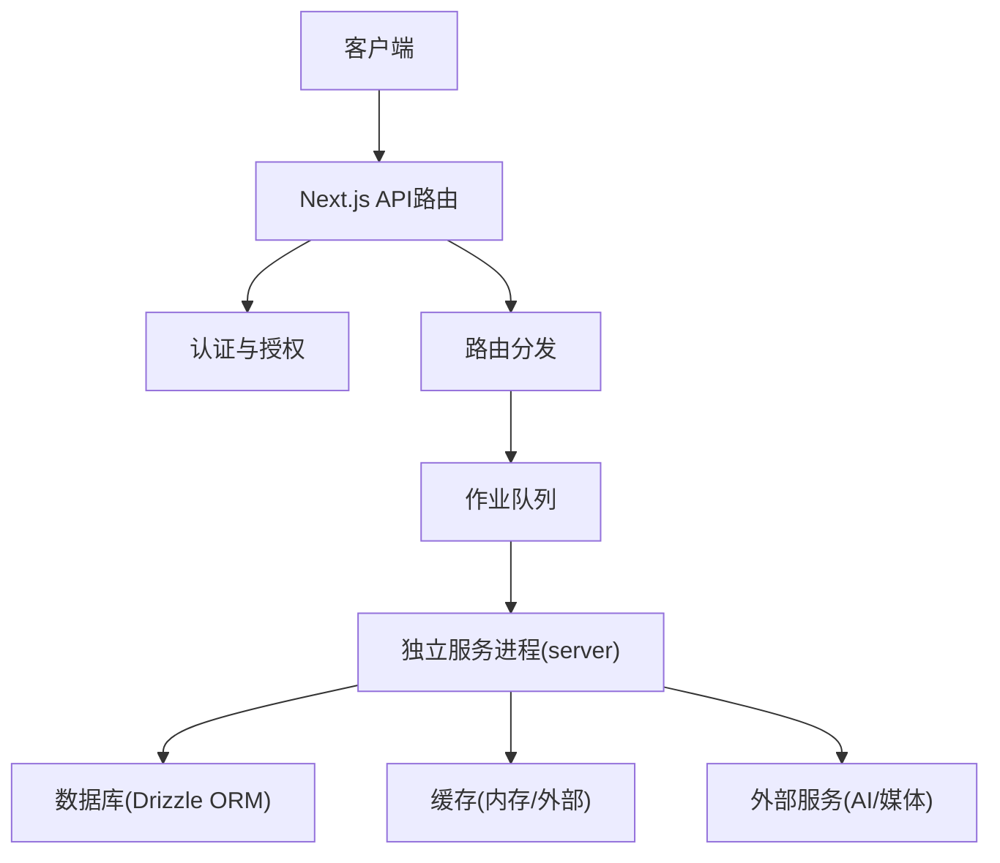
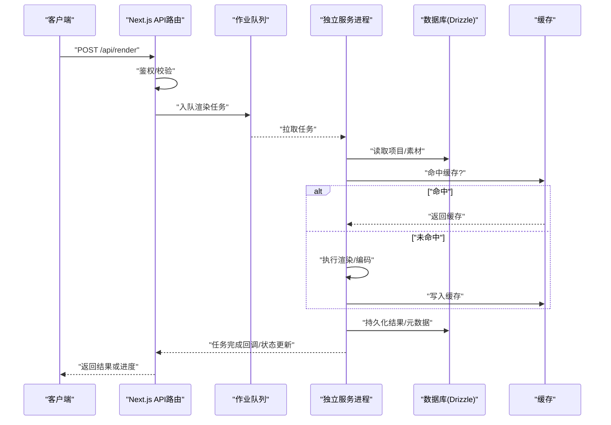
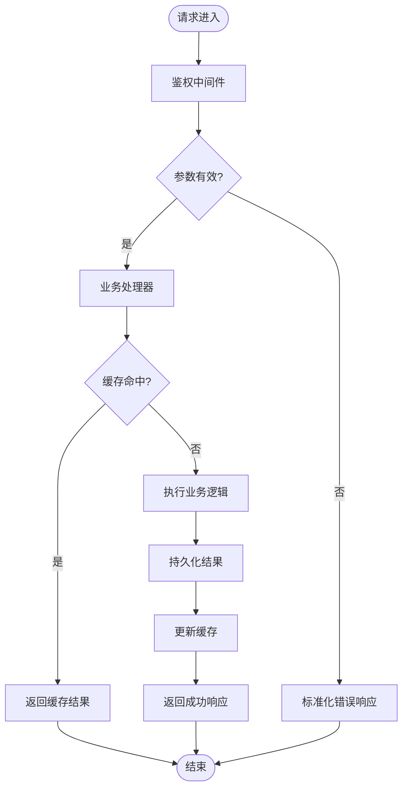
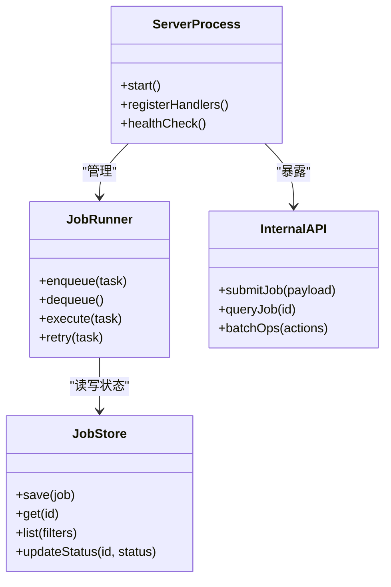
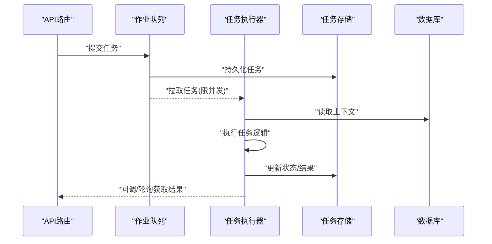
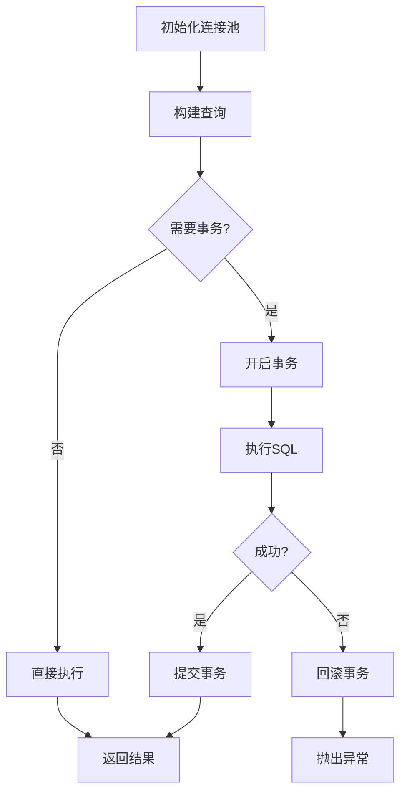
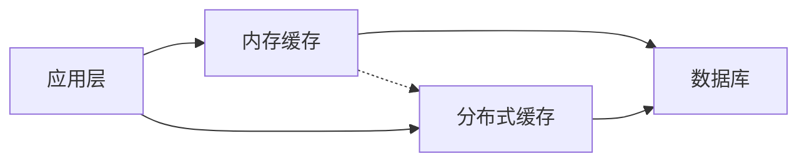
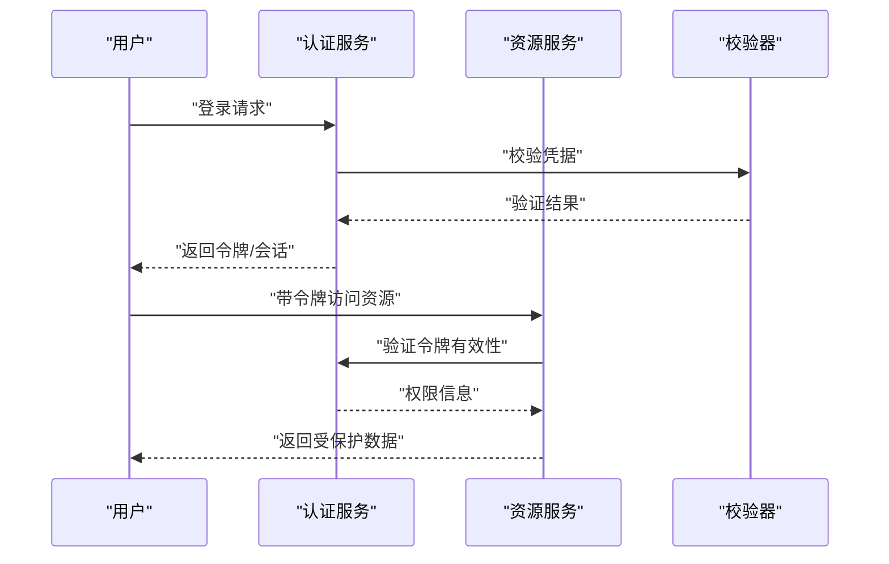
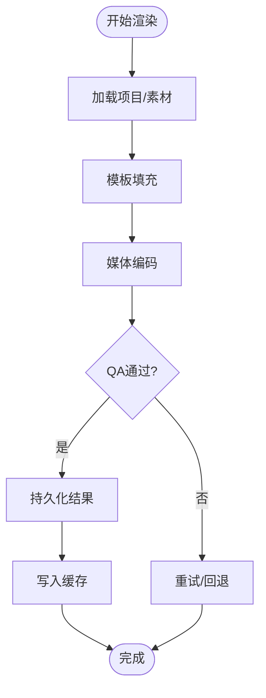
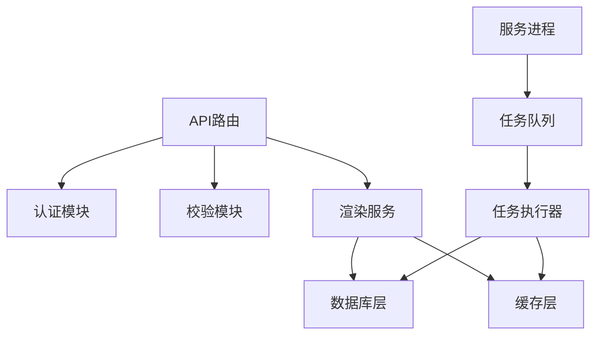

# 后端架构

<cite>
**本文引用的文件**   
- [server/src/index.ts](file://server/src/index.ts)
- [server/src/server/api.ts](file://server/src/server/api.ts)
- [server/src/server/job-runner.ts](file://server/src/server/job-runner.ts)
- [server/src/server/job-store.ts](file://server/src/server/job-store.ts)
- [src/app/api/ping/route.ts](file://src/app/api/ping/route.ts)
- [src/app/api/auth/login/route.ts](file://src/app/api/auth/login/route.ts)
- [src/app/api/auth/logout/route.ts](file://src/app/api/auth/logout/route.ts)
- [src/app/api/auth/session/route.ts](file://src/app/api/auth/session/route.ts)
- [src/app/api/auth/signup/route.ts](file://src/app/api/auth/signup/route.ts)
- [src/app/api/jobs/[id]/route.ts](file://src/app/api/jobs/[id]/route.ts)
- [src/app/api/projects/route.ts](file://src/app/api/projects/route.ts)
- [src/app/api/render/route.ts](file://src/app/api/render/route.ts)
- [src/features/auth/session.ts](file://src/features/auth/session.ts)
- [src/features/auth/api-session.ts](file://src/features/auth/api-session.ts)
- [src/features/auth/schemas.ts](file://src/features/auth/schemas.ts)
- [src/lib/db/index.ts](file://src/lib/db/index.ts)
- [drizzle.config.ts](file://drizzle.config.ts)
- [src/features/render/cache.ts](file://src/features/render/cache.ts)
- [src/features/render/export-service.ts](file://src/features/render/export-service.ts)
- [src/features/director/queue-handler.ts](file://src/features/director/queue-handler.ts)
- [src/features/audio/narration-queue-handler.ts](file://src/features/audio/narration-queue-handler.ts)
- [scripts/setup/db-migrate.ts](file://scripts/setup/db-migrate.ts)
</cite>

## 目录
1. [简介](#简介)
2. [项目结构](#项目结构)
3. [核心组件](#核心组件)
4. [架构总览](#架构总览)
5. [详细组件分析](#详细组件分析)
6. [依赖关系分析](#依赖关系分析)
7. [性能考量](#性能考量)
8. [故障排查指南](#故障排查指南)
9. [结论](#结论)
10. [附录](#附录)

## 简介
本文件面向PurpleInk后端，系统性阐述独立服务器进程的设计与实现，覆盖API路由组织、中间件链、错误处理机制；异步任务处理（作业队列、调度、并发控制）；数据库访问层（ORM、连接池、事务）；缓存策略（内存与分布式选择与场景）；安全机制（认证授权、输入校验、安全防护）；以及性能优化与监控告警。文档力求在技术深度与可读性之间取得平衡，帮助不同背景的读者快速理解并高效使用系统。

## 项目结构
后端采用“Next.js API Routes + 独立服务进程”的混合形态：
- Next.js应用提供HTTP入口（API路由），负责鉴权、参数校验、编排调用等。
- server进程作为独立服务，承载重任务执行（渲染、导出、AI管线等），通过内部API或消息通道与Next.js协作。
- 数据层基于Drizzle ORM，配合迁移脚本进行数据库初始化与版本管理。
- 缓存层包含内存缓存与可选的外部缓存（如Redis），按功能域配置。

**图表来源** 
- [server/src/index.ts](file://server/src/index.ts)
- [src/app/api/ping/route.ts](file://src/app/api/ping/route.ts)
- [src/app/api/auth/login/route.ts](file://src/app/api/auth/login/route.ts)
- [src/app/api/jobs/[id]/route.ts](file://src/app/api/jobs/[id]/route.ts)
- [src/lib/db/index.ts](file://src/lib/db/index.ts)
- [src/features/render/cache.ts](file://src/features/render/cache.ts)

**章节来源**
- [server/src/index.ts](file://server/src/index.ts)
- [src/app/api/ping/route.ts](file://src/app/api/ping/route.ts)
- [drizzle.config.ts](file://drizzle.config.ts)

## 核心组件
- API路由层：以Next.js API Routes组织，按功能域划分（auth、projects、render、jobs等）。每个路由负责请求解析、鉴权、参数校验、业务编排与响应封装。
- 独立服务进程：server进程启动后注册内部API与任务处理器，承担耗时任务（渲染、导出、AI生成、媒体处理）。
- 作业队列与调度：统一的任务入队、出队、重试、幂等与状态跟踪，支持并发控制与分片。
- 数据访问层：Drizzle ORM抽象数据库操作，集中管理连接池、事务与查询构建。
- 缓存层：内存缓存用于热点数据与中间结果，分布式缓存用于跨实例共享与持久化。
- 安全层：会话管理、令牌签发与验证、输入校验、速率限制、人机校验等。

**章节来源**
- [src/app/api/auth/login/route.ts](file://src/app/api/auth/login/route.ts)
- [src/app/api/auth/session/route.ts](file://src/app/api/auth/session/route.ts)
- [src/app/api/projects/route.ts](file://src/app/api/projects/route.ts)
- [src/app/api/render/route.ts](file://src/app/api/render/route.ts)
- [src/app/api/jobs/[id]/route.ts](file://src/app/api/jobs/[id]/route.ts)
- [server/src/server/api.ts](file://server/src/server/api.ts)
- [server/src/server/job-runner.ts](file://server/src/server/job-runner.ts)
- [server/src/server/job-store.ts](file://server/src/server/job-store.ts)
- [src/lib/db/index.ts](file://src/lib/db/index.ts)
- [src/features/render/cache.ts](file://src/features/render/cache.ts)

## 架构总览
整体架构遵循“请求-编排-执行-存储”的分层模式：
- 请求进入Next.js API路由，完成鉴权与参数校验。
- 路由将任务入队或直接调用服务进程接口。
- 服务进程根据任务类型调度到具体处理器，必要时并发执行。
- 数据读写通过Drizzle ORM，结合连接池与事务保证一致性与性能。
- 缓存贯穿热点读取与中间结果复用，降低延迟与负载。

**图表来源** 
- [src/app/api/render/route.ts](file://src/app/api/render/route.ts)
- [src/app/api/jobs/[id]/route.ts](file://src/app/api/jobs/[id]/route.ts)
- [server/src/server/job-runner.ts](file://server/src/server/job-runner.ts)
- [server/src/server/job-store.ts](file://server/src/server/job-store.ts)
- [src/lib/db/index.ts](file://src/lib/db/index.ts)
- [src/features/render/cache.ts](file://src/features/render/cache.ts)

## 详细组件分析

### API路由组织与中间件链
- 路由组织：按领域划分目录（auth、projects、render、jobs等），每个路由文件对应一个端点，职责单一。
- 中间件链：鉴权中间件统一处理会话校验与权限检查；参数校验中间件基于schema定义进行严格校验；日志与错误捕获中间件统一记录异常并返回标准错误格式。
- 错误处理：全局错误边界捕获未处理异常，转换为HTTP状态码与结构化错误体，便于前端展示与监控采集。

**图表来源** 
- [src/app/api/auth/login/route.ts](file://src/app/api/auth/login/route.ts)
- [src/app/api/auth/session/route.ts](file://src/app/api/auth/session/route.ts)
- [src/app/api/projects/route.ts](file://src/app/api/projects/route.ts)
- [src/app/api/render/route.ts](file://src/app/api/render/route.ts)
- [src/app/api/jobs/[id]/route.ts](file://src/app/api/jobs/[id]/route.ts)
- [src/features/auth/schemas.ts](file://src/features/auth/schemas.ts)

**章节来源**
- [src/app/api/auth/login/route.ts](file://src/app/api/auth/login/route.ts)
- [src/app/api/auth/logout/route.ts](file://src/app/api/auth/logout/route.ts)
- [src/app/api/auth/session/route.ts](file://src/app/api/auth/session/route.ts)
- [src/app/api/auth/signup/route.ts](file://src/app/api/auth/signup/route.ts)
- [src/app/api/projects/route.ts](file://src/app/api/projects/route.ts)
- [src/app/api/render/route.ts](file://src/app/api/render/route.ts)
- [src/app/api/jobs/[id]/route.ts](file://src/app/api/jobs/[id]/route.ts)
- [src/features/auth/schemas.ts](file://src/features/auth/schemas.ts)

### 独立服务进程设计
- 进程启动：加载配置、初始化日志、连接数据库与缓存、注册内部API与任务处理器。
- 内部API：提供任务提交、状态查询、批量操作等接口，供Next.js路由调用。
- 任务处理器：按任务类型分发到具体执行器（渲染、导出、AI生成、媒体处理），支持重试与超时控制。
- 资源隔离：通过进程内线程或子进程隔离重型任务，避免阻塞主循环。

**图表来源** 
- [server/src/index.ts](file://server/src/index.ts)
- [server/src/server/api.ts](file://server/src/server/api.ts)
- [server/src/server/job-runner.ts](file://server/src/server/job-runner.ts)
- [server/src/server/job-store.ts](file://server/src/server/job-store.ts)

**章节来源**
- [server/src/index.ts](file://server/src/index.ts)
- [server/src/server/api.ts](file://server/src/server/api.ts)
- [server/src/server/job-runner.ts](file://server/src/server/job-runner.ts)
- [server/src/server/job-store.ts](file://server/src/server/job-store.ts)

### 异步任务处理架构
- 作业队列：统一的任务模型（类型、参数、优先级、重试次数、过期时间），支持持久化与去重。
- 任务调度：消费者从队列拉取任务，按并发度限制执行；失败自动重试，指数退避。
- 并发控制：按任务类型或资源组设置并发上限，防止资源争用；支持分片与负载均衡。
- 状态跟踪：任务生命周期（排队、运行、成功、失败、取消）可观测，提供进度查询与回调。

**图表来源** 
- [src/app/api/jobs/[id]/route.ts](file://src/app/api/jobs/[id]/route.ts)
- [server/src/server/job-runner.ts](file://server/src/server/job-runner.ts)
- [server/src/server/job-store.ts](file://server/src/server/job-store.ts)
- [src/features/director/queue-handler.ts](file://src/features/director/queue-handler.ts)
- [src/features/audio/narration-queue-handler.ts](file://src/features/audio/narration-queue-handler.ts)

**章节来源**
- [src/app/api/jobs/[id]/route.ts](file://src/app/api/jobs/[id]/route.ts)
- [server/src/server/job-runner.ts](file://server/src/server/job-runner.ts)
- [server/src/server/job-store.ts](file://server/src/server/job-store.ts)
- [src/features/director/queue-handler.ts](file://src/features/director/queue-handler.ts)
- [src/features/audio/narration-queue-handler.ts](file://src/features/audio/narration-queue-handler.ts)

### 数据库访问层设计
- ORM使用：Drizzle ORM提供类型安全的查询构建与迁移工具，统一数据模型定义。
- 连接池管理：集中配置最大连接数、空闲超时、重试策略，避免连接泄漏。
- 事务处理：关键业务（如渲染产物落库、状态变更）使用事务保证一致性；支持嵌套事务与回滚。
- 迁移与初始化：通过脚本进行数据库初始化、版本升级与数据修复。

**图表来源** 
- [src/lib/db/index.ts](file://src/lib/db/index.ts)
- [drizzle.config.ts](file://drizzle.config.ts)
- [scripts/setup/db-migrate.ts](file://scripts/setup/db-migrate.ts)

**章节来源**
- [src/lib/db/index.ts](file://src/lib/db/index.ts)
- [drizzle.config.ts](file://drizzle.config.ts)
- [scripts/setup/db-migrate.ts](file://scripts/setup/db-migrate.ts)

### 缓存策略实现
- 内存缓存：用于热点数据（如用户会话、项目元数据）、中间结果（如渲染帧缓存），具备TTL与LRU淘汰。
- 分布式缓存：跨实例共享状态（如任务锁、全局配置），提高水平扩展能力。
- 缓存一致性：写穿或写回策略，失效广播与版本号校验，避免脏读。
- 降级与熔断：缓存不可用时回退到数据库直连，保护主链路稳定性。

**图表来源** 
- [src/features/render/cache.ts](file://src/features/render/cache.ts)

**章节来源**
- [src/features/render/cache.ts](file://src/features/render/cache.ts)

### 安全机制
- 认证授权：基于会话与令牌的双因子校验，区分用户角色与资源权限。
- 输入验证：所有外部输入经schema严格校验，拒绝非法载荷。
- 防护策略：速率限制、人机校验、敏感信息脱敏、SQL注入与XSS防护。
- 审计与追踪：关键操作记录审计日志，便于问题定位与合规审查。

**图表来源** 
- [src/app/api/auth/login/route.ts](file://src/app/api/auth/login/route.ts)
- [src/app/api/auth/session/route.ts](file://src/app/api/auth/session/route.ts)
- [src/features/auth/session.ts](file://src/features/auth/session.ts)
- [src/features/auth/api-session.ts](file://src/features/auth/api-session.ts)
- [src/features/auth/schemas.ts](file://src/features/auth/schemas.ts)

**章节来源**
- [src/app/api/auth/login/route.ts](file://src/app/api/auth/login/route.ts)
- [src/app/api/auth/session/route.ts](file://src/app/api/auth/session/route.ts)
- [src/features/auth/session.ts](file://src/features/auth/session.ts)
- [src/features/auth/api-session.ts](file://src/features/auth/api-session.ts)
- [src/features/auth/schemas.ts](file://src/features/auth/schemas.ts)

### 渲染与导出服务
- 渲染流水线：读取项目与素材，执行模板填充、媒体编码、合成输出。
- 导出服务：封装导出任务的生命周期管理，包括入队、执行、结果持久化与缓存。
- 质量检查：对输出进行QA检测（分辨率、时长、音画同步），失败自动重试或回退。

**图表来源** 
- [src/app/api/render/route.ts](file://src/app/api/render/route.ts)
- [src/features/render/export-service.ts](file://src/features/render/export-service.ts)
- [src/features/render/cache.ts](file://src/features/render/cache.ts)

**章节来源**
- [src/app/api/render/route.ts](file://src/app/api/render/route.ts)
- [src/features/render/export-service.ts](file://src/features/render/export-service.ts)
- [src/features/render/cache.ts](file://src/features/render/cache.ts)

## 依赖关系分析
- 模块耦合：API路由依赖认证与校验模块；服务进程依赖任务调度与数据访问层；缓存与数据库为横向支撑。
- 外部依赖：AI提供商、媒体处理库、邮件服务等通过适配器解耦，便于替换与扩展。
- 潜在风险：避免循环依赖；确保任务处理器幂等；数据库连接池配置合理。

**图表来源** 
- [src/app/api/render/route.ts](file://src/app/api/render/route.ts)
- [src/app/api/jobs/[id]/route.ts](file://src/app/api/jobs/[id]/route.ts)
- [server/src/server/job-runner.ts](file://server/src/server/job-runner.ts)
- [src/lib/db/index.ts](file://src/lib/db/index.ts)
- [src/features/render/cache.ts](file://src/features/render/cache.ts)

**章节来源**
- [src/app/api/render/route.ts](file://src/app/api/render/route.ts)
- [src/app/api/jobs/[id]/route.ts](file://src/app/api/jobs/[id]/route.ts)
- [server/src/server/job-runner.ts](file://server/src/server/job-runner.ts)
- [src/lib/db/index.ts](file://src/lib/db/index.ts)
- [src/features/render/cache.ts](file://src/features/render/cache.ts)

## 性能考量
- 连接池调优：根据CPU与IO特性调整最大连接数与超时，避免连接风暴。
- 缓存命中率：热点数据优先缓存，合理设置TTL与失效策略。
- 并发控制：按任务类型限制并发，防止资源争用与雪崩。
- 异步处理：长耗时任务入队，缩短请求响应时间。
- 监控指标：收集QPS、延迟、错误率、队列长度、缓存命中率等关键指标。

[本节为通用指导，不直接分析具体文件]

## 故障排查指南
- 常见问题：
  - 认证失败：检查会话令牌有效期与签名密钥配置。
  - 任务卡住：查看队列消费日志与任务状态，确认是否死锁或资源不足。
  - 数据库连接失败：检查连接池配置与网络连通性。
  - 缓存不一致：核对失效策略与版本号校验逻辑。
- 诊断步骤：
  - 启用详细日志与追踪ID，定位请求链路。
  - 检查健康检查端点与指标面板。
  - 复现问题并抓取快照（数据库状态、缓存内容、任务上下文）。

**章节来源**
- [src/app/api/auth/session/route.ts](file://src/app/api/auth/session/route.ts)
- [src/app/api/jobs/[id]/route.ts](file://src/app/api/jobs/[id]/route.ts)
- [src/lib/db/index.ts](file://src/lib/db/index.ts)
- [src/features/render/cache.ts](file://src/features/render/cache.ts)

## 结论
PurpleInk后端通过清晰的层次划分与模块化设计，实现了高可用、可扩展与易维护的系统架构。API路由与独立服务进程协同工作，作业队列保障异步任务的稳定执行，数据库与缓存层提供高性能数据访问。安全机制贯穿全链路，性能优化与监控告警确保生产环境稳定运行。建议持续完善指标采集与自动化运维，进一步提升系统韧性与可观测性。

[本节为总结性内容，不直接分析具体文件]

## 附录
- 配置示例：环境变量与密钥管理参考部署文档。
- 迁移脚本：数据库初始化与版本升级脚本位于scripts目录。
- 测试用例：各模块单元测试与集成测试覆盖核心路径。

[本节为补充信息，不直接分析具体文件]