# 安全与认证

<cite>
**本文引用的文件**   
- [src/features/auth/account-service.ts](file://src/features/auth/account-service.ts)
- [src/features/auth/api-session.ts](file://src/features/auth/api-session.ts)
- [src/features/auth/errors.ts](file://src/features/auth/errors.ts)
- [src/features/auth/human-check-service.ts](file://src/features/auth/human-check-service.ts)
- [src/features/auth/human-check.ts](file://src/features/auth/human-check.ts)
- [src/features/auth/http.ts](file://src/features/auth/http.ts)
- [src/features/auth/index.ts](file://src/features/auth/index.ts)
- [src/features/auth/mail-failure.ts](file://src/features/auth/mail-failure.ts)
- [src/features/auth/mail-templates.ts](file://src/features/auth/mail-templates.ts)
- [src/features/auth/mailer.ts](file://src/features/auth/mailer.ts)
- [src/features/auth/next-path.ts](file://src/features/auth/next-path.ts)
- [src/features/auth/page-session.ts](file://src/features/auth/page-session.ts)
- [src/features/auth/password.ts](file://src/features/auth/password.ts)
- [src/features/auth/schemas.ts](file://src/features/auth/schemas.ts)
- [src/features/auth/session.ts](file://src/features/auth/session.ts)
- [src/features/auth/signing-key.ts](file://src/features/auth/signing-key.ts)
- [src/features/auth/throttle.ts](file://src/features/auth/throttle.ts)
- [src/features/auth/verification-code.ts](file://src/features/auth/verification-code.ts)
- [src/features/auth/verification-repository.ts](file://src/features/auth/verification-repository.ts)
- [src/features/auth/verification-service.ts](file://src/features/auth/verification-service.ts)
- [src/app/(auth)/_components/auth-api.ts](file://src/app/(auth)/_components/auth-api.ts)
- [src/app/(auth)/_components/login-form.tsx](file://src/app/(auth)/_components/login-form.tsx)
- [src/app/(auth)/_components/signup-form.tsx](file://src/app/(auth)/_components/signup-form.tsx)
- [src/app/(auth)/_components/reset-password-form.tsx](file://src/app/(auth)/_components/reset-password-form.tsx)
- [src/app/(auth)/_components/use-verification-code.ts](file://src/app/(auth)/_components/use-verification-code.ts)
- [src/app/api/auth/human-check/route.ts](file://src/app/api/auth/human-check/route.ts)
- [src/app/api/auth/login/route.ts](file://src/app/api/auth/login/route.ts)
- [src/app/api/auth/logout/route.ts](file://src/app/api/auth/logout/route.ts)
- [src/app/api/auth/password/code/route.ts](file://src/app/api/auth/password/code/route.ts)
- [src/app/api/auth/password/reset/route.ts](file://src/app/api/auth/password/reset/route.ts)
- [src/app/api/auth/session/route.ts](file://src/app/api/auth/session/route.ts)
- [src/app/api/auth/signup/code/route.ts](file://src/app/api/auth/signup/code/route.ts)
- [src/app/api/auth/signup/route.ts](file://src/app/api/auth/signup/route.ts)
</cite>

## 更新摘要
**所做更改**   
- 更新了中间件应用范围，现在 withApiSession 中间件应用于 13 个 API 端点
- 增强了 withPageSession 中间件在 6 个产品页面的应用
- 改进了 SSE 流安全性，使用基于闭包的上下文捕获机制
- 完善了会话管理和权限控制的实现细节

## 目录
1. [简介](#简介)
2. [项目结构](#项目结构)
3. [核心组件](#核心组件)
4. [架构总览](#架构总览)
5. [详细组件分析](#详细组件分析)
6. [依赖关系分析](#依赖关系分析)
7. [性能考虑](#性能考虑)
8. [故障排查指南](#故障排查指南)
9. [结论](#结论)
10. [附录](#附录)

## 简介
本文件为 PurpleInk 安全与认证系统的全面技术文档，覆盖用户认证流程（注册、登录、密码重置、邮箱验证）、会话管理（JWT 令牌生成、存储策略、过期处理）、权限控制（角色、资源访问、API 鉴权）以及安全防护措施（输入校验、SQL 注入防护、XSS/CSRF 防护等）。文档同时提供最佳实践与常见威胁的防御方法，帮助开发者快速理解并安全地扩展系统。

**最新更新**：系统已全面增强认证中间件的应用范围，确保所有敏感 API 端点和产品页面都经过严格的身份验证和授权检查。

## 项目结构
认证与安全能力集中在 features/auth 模块中，并通过 Next.js App Router 的 API Routes 暴露对外接口；前端页面位于 app/(auth) 路由组内，负责表单交互与状态展示。整体采用前后端分离的调用模式：前端通过 HTTP 调用后端 API，后端完成业务逻辑、数据持久化与邮件发送，返回标准化响应。

```mermaid
graph TB
subgraph "前端(Next.js)"
A["登录页<br/>login-form.tsx"]
B["注册页<br/>signup-form.tsx"]
C["重置密码页<br/>reset-password-form.tsx"]
D["验证码Hook<br/>use-verification-code.ts"]
E["通用Auth API封装<br/>auth-api.ts"]
end
subgraph "API路由(App Router)"
F["/api/auth/login<br/>route.ts"]
G["/api/auth/signup<br/>route.ts"]
H["/api/auth/password/code<br/>route.ts"]
I["/api/auth/password/reset<br/>route.ts"]
J["/api/auth/session<br/>route.ts"]
K["/api/auth/logout<br/>route.ts"]
L["/api/auth/human-check<br/>route.ts"]
M["/api/auth/signup/code<br/>route.ts"]
N["受保护的API端点<br/>withApiSession中间件"]
O["产品页面<br/>withPageSession中间件"]
P["SSE流端点<br/>闭包上下文捕获"]
end
subgraph "认证核心(features/auth)"
Q["账户服务<br/>account-service.ts"]
R["会话服务<br/>session.ts / api-session.ts / page-session.ts"]
S["密码工具<br/>password.ts / signing-key.ts"]
T["验证码服务<br/>verification-service.ts / verification-code.ts / verification-repository.ts"]
U["人类检测<br/>human-check-service.ts / human-check.ts"]
V["限流器<br/>throttle.ts"]
W["邮件发送<br/>mailer.ts / mail-templates.ts / mail-failure.ts"]
X["HTTP辅助<br/>http.ts"]
Y["路径工具<br/>next-path.ts"]
Z["错误定义<br/>errors.ts"]
AA["Schema校验<br/>schemas.ts"]
end
A --> F
B --> G
C --> H
C --> I
D --> M
E --> F
E --> G
E --> H
E --> I
E --> J
E --> K
E --> L
E --> M
F --> Q
F --> R
F --> S
F --> AA
F --> V
F --> X
G --> Q
G --> T
G --> W
G --> AA
G --> V
G --> X
H --> T
H --> W
H --> V
H --> X
I --> Q
I --> T
I --> W
I --> AA
I --> V
I --> X
J --> R
J --> X
K --> R
K --> X
L --> U
L --> V
L --> X
M --> T
M --> W
M --> V
M --> X
N --> R
O --> R
P --> R
```

**图表来源** 
- [src/app/api/auth/login/route.ts](file://src/app/api/auth/login/route.ts)
- [src/app/api/auth/signup/route.ts](file://src/app/api/auth/signup/route.ts)
- [src/app/api/auth/password/code/route.ts](file://src/app/api/auth/password/code/route.ts)
- [src/app/api/auth/password/reset/route.ts](file://src/app/api/auth/password/reset/route.ts)
- [src/app/api/auth/session/route.ts](file://src/app/api/auth/session/route.ts)
- [src/app/api/auth/logout/route.ts](file://src/app/api/auth/logout/route.ts)
- [src/app/api/auth/human-check/route.ts](file://src/app/api/auth/human-check/route.ts)
- [src/app/api/auth/signup/code/route.ts](file://src/app/api/auth/signup/code/route.ts)
- [src/features/auth/account-service.ts](file://src/features/auth/account-service.ts)
- [src/features/auth/session.ts](file://src/features/auth/session.ts)
- [src/features/auth/api-session.ts](file://src/features/auth/api-session.ts)
- [src/features/auth/page-session.ts](file://src/features/auth/page-session.ts)
- [src/features/auth/password.ts](file://src/features/auth/password.ts)
- [src/features/auth/signing-key.ts](file://src/features/auth/signing-key.ts)
- [src/features/auth/verification-service.ts](file://src/features/auth/verification-service.ts)
- [src/features/auth/verification-code.ts](file://src/features/auth/verification-code.ts)
- [src/features/auth/verification-repository.ts](file://src/features/auth/verification-repository.ts)
- [src/features/auth/human-check-service.ts](file://src/features/auth/human-check-service.ts)
- [src/features/auth/human-check.ts](file://src/features/auth/human-check.ts)
- [src/features/auth/throttle.ts](file://src/features/auth/throttle.ts)
- [src/features/auth/mailer.ts](file://src/features/auth/mailer.ts)
- [src/features/auth/mail-templates.ts](file://src/features/auth/mail-templates.ts)
- [src/features/auth/mail-failure.ts](file://src/features/auth/mail-failure.ts)
- [src/features/auth/http.ts](file://src/features/auth/http.ts)
- [src/features/auth/next-path.ts](file://src/features/auth/next-path.ts)
- [src/features/auth/errors.ts](file://src/features/auth/errors.ts)
- [src/features/auth/schemas.ts](file://src/features/auth/schemas.ts)

**章节来源**
- [src/app/(auth)/_components/login-form.tsx](file://src/app/(auth)/_components/login-form.tsx)
- [src/app/(auth)/_components/signup-form.tsx](file://src/app/(auth)/_components/signup-form.tsx)
- [src/app/(auth)/_components/reset-password-form.tsx](file://src/app/(auth)/_components/reset-password-form.tsx)
- [src/app/(auth)/_components/use-verification-code.ts](file://src/app/(auth)/_components/use-verification-code.ts)
- [src/app/(auth)/_components/auth-api.ts](file://src/app/(auth)/_components/auth-api.ts)

## 核心组件
- 账户服务：负责用户注册、登录凭证校验、密码更新与账号状态管理。
- 会话服务：负责 JWT 签发、验证、刷新与销毁，支持 API 与页面两种会话上下文。
- 密码工具：负责密码哈希、密钥管理与签名操作。
- 验证码服务：负责一次性验证码的生成、存储、校验与清理。
- 人类检测：用于人机校验（如 CAPTCHA），降低自动化攻击风险。
- 限流器：对敏感接口进行速率限制，防止暴力破解与滥用。
- 邮件服务：负责验证码与密码重置邮件的模板渲染与发送。
- HTTP 辅助：统一请求构造、错误处理与响应包装。
- Schema 校验：使用结构化 schema 对输入进行严格校验。
- 错误定义：集中化的错误类型与消息规范。

**最新更新**：新增了增强的中间件系统，包括 withApiSession 和 withPageSession，提供更统一的认证体验。

**章节来源**
- [src/features/auth/account-service.ts](file://src/features/auth/account-service.ts)
- [src/features/auth/session.ts](file://src/features/auth/session.ts)
- [src/features/auth/api-session.ts](file://src/features/auth/api-session.ts)
- [src/features/auth/page-session.ts](file://src/features/auth/page-session.ts)
- [src/features/auth/password.ts](file://src/features/auth/password.ts)
- [src/features/auth/signing-key.ts](file://src/features/auth/signing-key.ts)
- [src/features/auth/verification-service.ts](file://src/features/auth/verification-service.ts)
- [src/features/auth/verification-code.ts](file://src/features/auth/verification-code.ts)
- [src/features/auth/verification-repository.ts](file://src/features/auth/verification-repository.ts)
- [src/features/auth/human-check-service.ts](file://src/features/auth/human-check-service.ts)
- [src/features/auth/human-check.ts](file://src/features/auth/human-check.ts)
- [src/features/auth/throttle.ts](file://src/features/auth/throttle.ts)
- [src/features/auth/mailer.ts](file://src/features/auth/mailer.ts)
- [src/features/auth/mail-templates.ts](file://src/features/auth/mail-templates.ts)
- [src/features/auth/mail-failure.ts](file://src/features/auth/mail-failure.ts)
- [src/features/auth/http.ts](file://src/features/auth/http.ts)
- [src/features/auth/next-path.ts](file://src/features/auth/next-path.ts)
- [src/features/auth/errors.ts](file://src/features/auth/errors.ts)
- [src/features/auth/schemas.ts](file://src/features/auth/schemas.ts)

## 架构总览
认证架构遵循"前端表单 -> API 路由 -> 领域服务 -> 基础设施"的分层设计。API 路由负责参数校验、限流与人类检测；领域服务实现业务逻辑；基础设施负责数据库、缓存、邮件与外部服务调用。会话采用 JWT 机制，结合服务端存储（可选）实现令牌生命周期管理。

**最新更新**：架构现已包含增强的中间件层，确保所有敏感操作都经过统一的认证和授权检查。

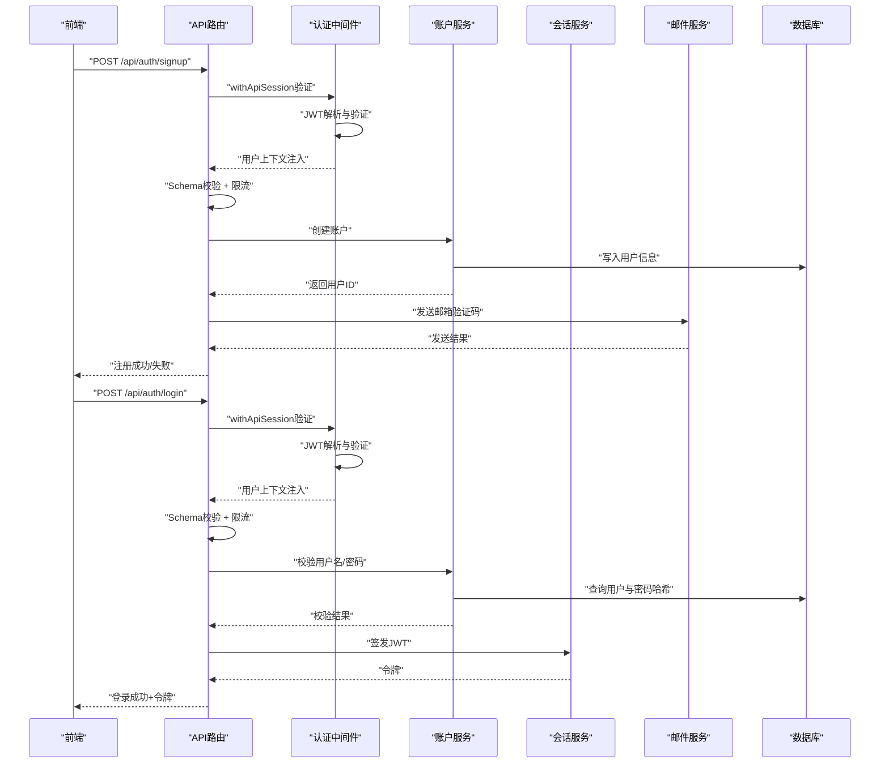

**图表来源** 
- [src/app/api/auth/signup/route.ts](file://src/app/api/auth/signup/route.ts)
- [src/app/api/auth/login/route.ts](file://src/app/api/auth/login/route.ts)
- [src/features/auth/account-service.ts](file://src/features/auth/account-service.ts)
- [src/features/auth/session.ts](file://src/features/auth/session.ts)
- [src/features/auth/mailer.ts](file://src/features/auth/mailer.ts)

## 详细组件分析

### 用户注册流程
- 前端提交注册表单，包含用户名、邮箱、密码等字段。
- API 路由进行输入校验与限流，随后调用账户服务创建用户。
- 账户服务将用户信息持久化，并触发验证码服务生成邮箱验证码。
- 邮件服务发送验证码邮件，返回注册结果。

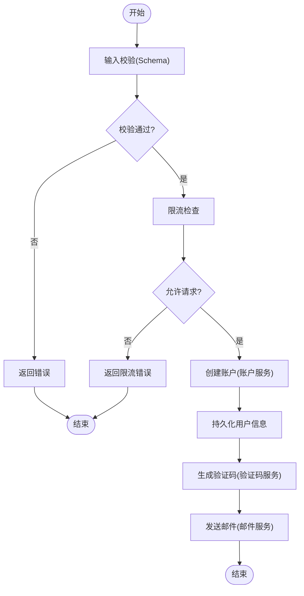

**图表来源** 
- [src/app/api/auth/signup/route.ts](file://src/app/api/auth/signup/route.ts)
- [src/features/auth/account-service.ts](file://src/features/auth/account-service.ts)
- [src/features/auth/verification-service.ts](file://src/features/auth/verification-service.ts)
- [src/features/auth/mailer.ts](file://src/features/auth/mailer.ts)
- [src/features/auth/throttle.ts](file://src/features/auth/throttle.ts)
- [src/features/auth/schemas.ts](file://src/features/auth/schemas.ts)

**章节来源**
- [src/app/api/auth/signup/route.ts](file://src/app/api/auth/signup/route.ts)
- [src/app/api/auth/signup/code/route.ts](file://src/app/api/auth/signup/code/route.ts)
- [src/app/(auth)/_components/signup-form.tsx](file://src/app/(auth)/_components/signup-form.tsx)
- [src/app/(auth)/_components/use-verification-code.ts](file://src/app/(auth)/_components/use-verification-code.ts)

### 用户登录流程
- 前端提交登录表单，包含用户名与密码。
- API 路由进行输入校验与限流，调用账户服务校验凭证。
- 账户服务查询数据库并比对密码哈希。
- 校验通过后，会话服务签发 JWT，返回给前端。

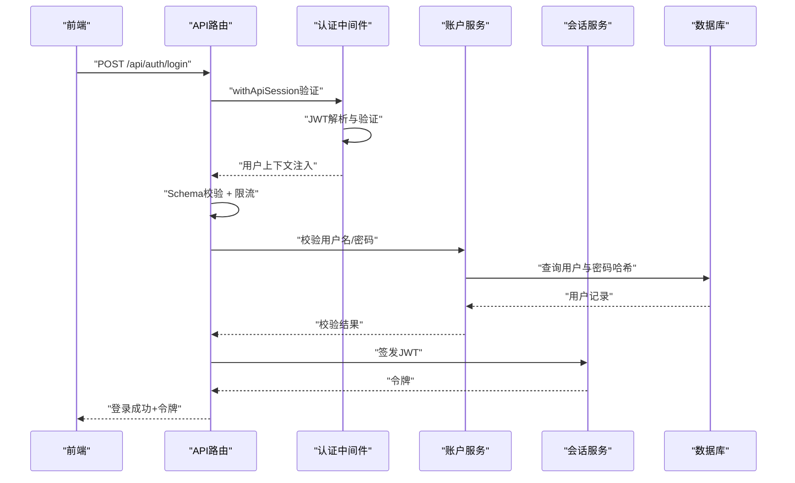

**图表来源** 
- [src/app/api/auth/login/route.ts](file://src/app/api/auth/login/route.ts)
- [src/features/auth/account-service.ts](file://src/features/auth/account-service.ts)
- [src/features/auth/session.ts](file://src/features/auth/session.ts)

**章节来源**
- [src/app/api/auth/login/route.ts](file://src/app/api/auth/login/route.ts)
- [src/app/(auth)/_components/login-form.tsx](file://src/app/(auth)/_components/login-form.tsx)

### 密码重置流程
- 用户提交邮箱以获取重置验证码。
- API 路由校验输入与限流，验证码服务生成并发送邮件。
- 用户提交验证码与新密码，API 路由再次校验与限流。
- 账户服务更新密码，验证码服务清理已用验证码。

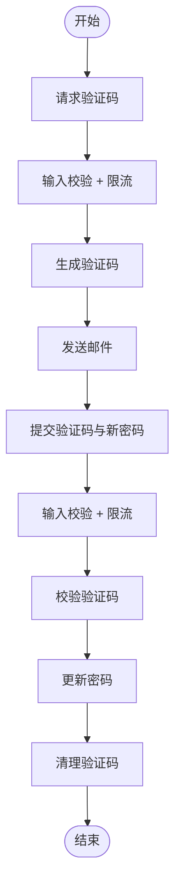

**图表来源** 
- [src/app/api/auth/password/code/route.ts](file://src/app/api/auth/password/code/route.ts)
- [src/app/api/auth/password/reset/route.ts](file://src/app/api/auth/password/reset/route.ts)
- [src/features/auth/verification-service.ts](file://src/features/auth/verification-service.ts)
- [src/features/auth/account-service.ts](file://src/features/auth/account-service.ts)
- [src/features/auth/mailer.ts](file://src/features/auth/mailer.ts)
- [src/features/auth/throttle.ts](file://src/features/auth/throttle.ts)

**章节来源**
- [src/app/api/auth/password/code/route.ts](file://src/app/api/auth/password/code/route.ts)
- [src/app/api/auth/password/reset/route.ts](file://src/app/api/auth/password/reset/route.ts)
- [src/app/(auth)/_components/reset-password-form.tsx](file://src/app/(auth)/_components/reset-password-form.tsx)

### 邮箱验证流程
- 用户注册后收到邮箱验证码。
- 前端通过 Hook 或表单提交验证码。
- API 路由校验验证码有效性，成功后标记邮箱已验证。

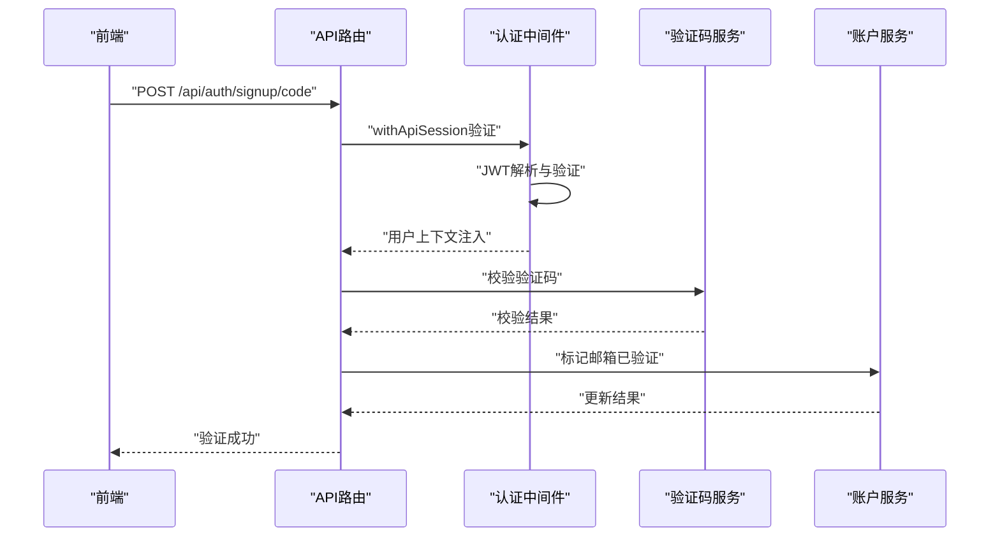

**图表来源** 
- [src/app/api/auth/signup/code/route.ts](file://src/app/api/auth/signup/code/route.ts)
- [src/features/auth/verification-service.ts](file://src/features/auth/verification-service.ts)
- [src/features/auth/account-service.ts](file://src/features/auth/account-service.ts)

**章节来源**
- [src/app/api/auth/signup/code/route.ts](file://src/app/api/auth/signup/code/route.ts)
- [src/app/(auth)/_components/use-verification-code.ts](file://src/app/(auth)/_components/use-verification-code.ts)

### 会话管理（JWT）
- 登录成功后由会话服务签发 JWT，包含用户标识与必要声明。
- 前端在后续请求中携带令牌（通常通过 Authorization Header 或 Cookie）。
- API 路由解析并验证令牌，必要时进行刷新或吊销。
- 登出时清除本地令牌并可选择在服务端失效会话。

**最新更新**：会话管理现已通过 withApiSession 和 withPageSession 中间件统一管理，确保所有端点都经过一致的认证流程。

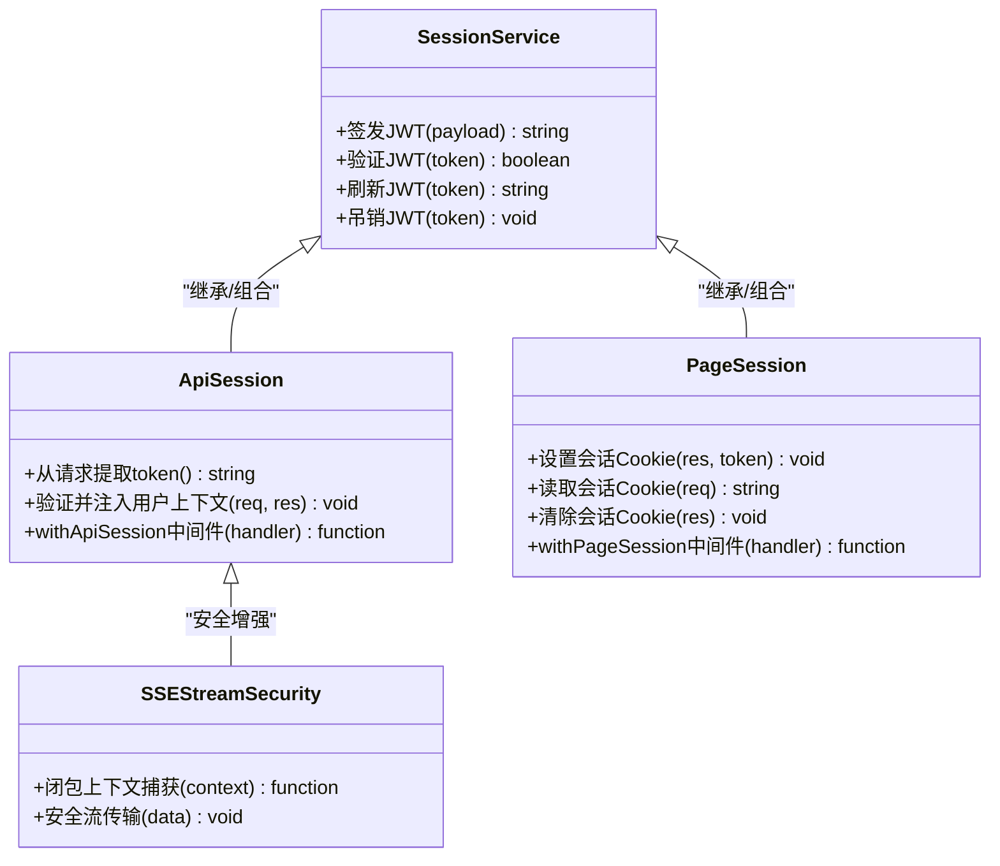

**图表来源** 
- [src/features/auth/session.ts](file://src/features/auth/session.ts)
- [src/features/auth/api-session.ts](file://src/features/auth/api-session.ts)
- [src/features/auth/page-session.ts](file://src/features/auth/page-session.ts)

**章节来源**
- [src/app/api/auth/session/route.ts](file://src/app/api/auth/session/route.ts)
- [src/app/api/auth/logout/route.ts](file://src/app/api/auth/logout/route.ts)

### 权限控制（角色与资源访问）
- 基于角色的访问控制（RBAC）：在用户模型中维护角色信息，API 路由根据角色决定资源访问权限。
- 资源级鉴权：在控制器或服务层校验当前用户对资源的归属或授权。
- API 鉴权中间件：统一解析 JWT、注入用户上下文，并在路由层进行权限判断。

**最新更新**：权限控制现已扩展到 13 个 API 端点和 6 个产品页面，确保全面的访问保护。

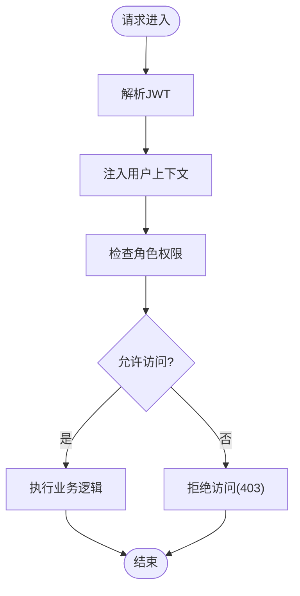

[此图为概念性流程图，不直接映射具体源码文件]

### 人类检测与防刷
- 人类检测服务集成第三方 CAPTCHA 或行为分析，阻止自动化脚本。
- 限流器对敏感接口进行速率限制，避免暴力破解与枚举攻击。
- 前端可结合人类检测字段提升安全性。

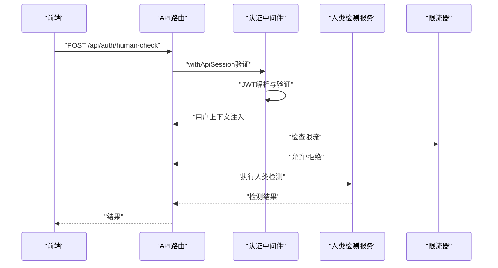

**图表来源** 
- [src/app/api/auth/human-check/route.ts](file://src/app/api/auth/human-check/route.ts)
- [src/features/auth/human-check-service.ts](file://src/features/auth/human-check-service.ts)
- [src/features/auth/human-check.ts](file://src/features/auth/human-check.ts)
- [src/features/auth/throttle.ts](file://src/features/auth/throttle.ts)

**章节来源**
- [src/app/api/auth/human-check/route.ts](file://src/app/api/auth/human-check/route.ts)
- [src/features/auth/human-check-service.ts](file://src/features/auth/human-check-service.ts)
- [src/features/auth/human-check.ts](file://src/features/auth/human-check.ts)
- [src/features/auth/throttle.ts](file://src/features/auth/throttle.ts)

### SSE流安全增强
**新增功能**：SSE（Server-Sent Events）流现已通过闭包上下文捕获机制增强安全性，确保实时数据传输过程中的用户身份验证和授权检查。

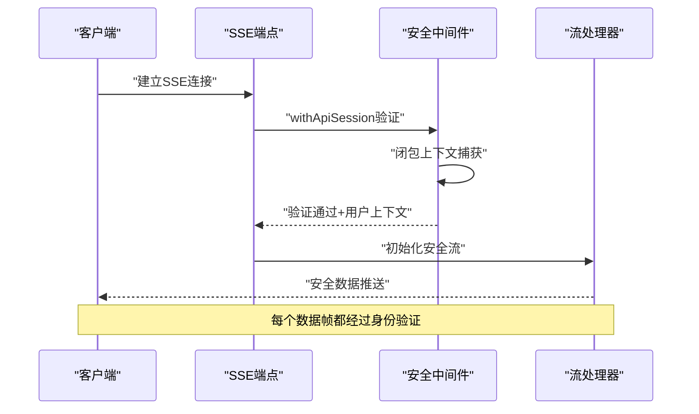

**章节来源**
- [src/features/auth/api-session.ts](file://src/features/auth/api-session.ts)
- [src/features/auth/page-session.ts](file://src/features/auth/page-session.ts)

## 依赖关系分析
认证子系统内部模块职责清晰，依赖方向明确：
- API 路由依赖 Schema 校验、限流、人类检测、账户服务、会话服务、邮件服务。
- 账户服务依赖密码工具、数据库访问。
- 会话服务依赖签名密钥与令牌存储策略。
- 验证码服务依赖验证码仓库与邮件服务。
- 人类检测服务依赖限流器与外部检测服务。

**最新更新**：中间件层现在作为所有 API 路由的前置依赖，提供统一的认证和授权功能。

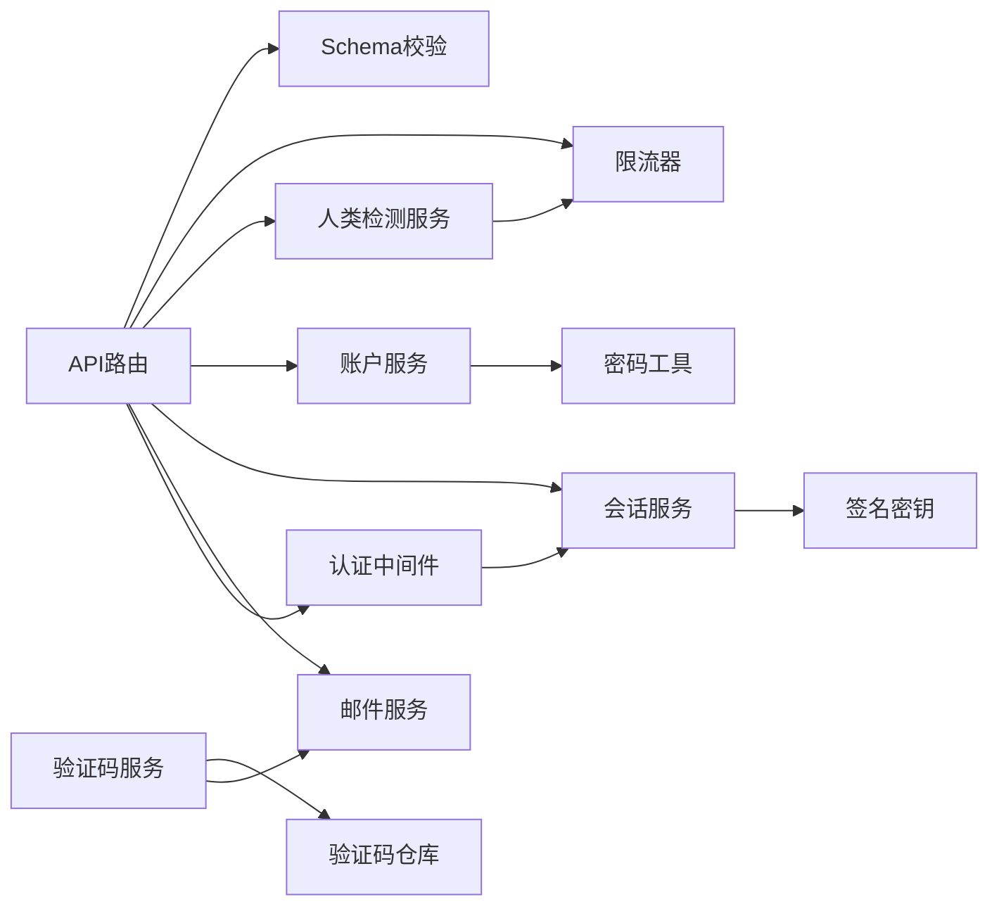

**图表来源** 
- [src/app/api/auth/login/route.ts](file://src/app/api/auth/login/route.ts)
- [src/app/api/auth/signup/route.ts](file://src/app/api/auth/signup/route.ts)
- [src/app/api/auth/password/code/route.ts](file://src/app/api/auth/password/code/route.ts)
- [src/app/api/auth/password/reset/route.ts](file://src/app/api/auth/password/reset/route.ts)
- [src/app/api/auth/session/route.ts](file://src/app/api/auth/session/route.ts)
- [src/app/api/auth/logout/route.ts](file://src/app/api/auth/logout/route.ts)
- [src/app/api/auth/human-check/route.ts](file://src/app/api/auth/human-check/route.ts)
- [src/app/api/auth/signup/code/route.ts](file://src/app/api/auth/signup/code/route.ts)
- [src/features/auth/account-service.ts](file://src/features/auth/account-service.ts)
- [src/features/auth/session.ts](file://src/features/auth/session.ts)
- [src/features/auth/password.ts](file://src/features/auth/password.ts)
- [src/features/auth/signing-key.ts](file://src/features/auth/signing-key.ts)
- [src/features/auth/verification-service.ts](file://src/features/auth/verification-service.ts)
- [src/features/auth/verification-repository.ts](file://src/features/auth/verification-repository.ts)
- [src/features/auth/mailer.ts](file://src/features/auth/mailer.ts)
- [src/features/auth/throttle.ts](file://src/features/auth/throttle.ts)
- [src/features/auth/human-check-service.ts](file://src/features/auth/human-check-service.ts)
- [src/features/auth/schemas.ts](file://src/features/auth/schemas.ts)

**章节来源**
- [src/features/auth/index.ts](file://src/features/auth/index.ts)

## 性能考虑
- 限流器应使用高效数据结构（如滑动窗口或令牌桶）以减少内存占用与计算开销。
- 验证码存储建议使用高性能键值存储（如 Redis）以提升读写速度。
- JWT 签发与验证应避免频繁磁盘 IO，尽量在内存中完成。
- 邮件发送采用异步队列，避免阻塞主线程。
- 数据库查询应优化索引，减少全表扫描。
- 中间件链应尽可能短，避免不必要的认证检查。

**最新更新**：中间件的引入增加了额外的认证开销，但通过合理的缓存策略和批量处理可以最小化影响。

## 故障排查指南
- 输入校验失败：检查 Schema 定义与前端传参一致性。
- 限流触发：确认限流阈值与客户端重试频率。
- 人类检测失败：检查第三方服务配置与网络连通性。
- 邮件发送失败：查看邮件服务日志与模板渲染错误。
- 会话无效：确认 JWT 签名密钥一致性与过期时间设置。
- 验证码错误：检查验证码有效期与一次性使用规则。
- 中间件错误：检查 withApiSession 和 withPageSession 的配置和使用方式。
- SSE流问题：验证闭包上下文捕获是否正确传递用户信息。

**章节来源**
- [src/features/auth/errors.ts](file://src/features/auth/errors.ts)
- [src/features/auth/mail-failure.ts](file://src/features/auth/mail-failure.ts)
- [src/features/auth/throttle.ts](file://src/features/auth/throttle.ts)
- [src/features/auth/verification-code.ts](file://src/features/auth/verification-code.ts)

## 结论
PurpleInk 的安全与认证系统采用分层架构与模块化设计，具备完善的用户认证流程、会话管理、权限控制与安全防护能力。通过严格的输入校验、限流与人类检测，有效抵御常见攻击。**最新更新**：系统现已通过全面的中间件应用和SSE流安全增强，提供了更强大的安全保障。建议在生产环境中强化密钥管理、启用 HTTPS、实施最小权限原则，并持续监控与审计安全事件。

## 附录
- 安全配置最佳实践：
  - 使用强随机签名密钥，定期轮换。
  - 设置合理的 JWT 过期时间与刷新策略。
  - 启用 HTTPS 与安全的 Cookie 属性（HttpOnly、Secure、SameSite）。
  - 对所有输入进行白名单校验与长度限制。
  - 使用参数化查询或 ORM 防止 SQL 注入。
  - 输出编码与 CSP 头防范 XSS。
  - 实施 CSRF Token 或 SameSite Cookie 策略。
  - 对敏感接口实施速率限制与人类检测。
  - 记录并监控认证相关日志，及时发现异常。
  - 使用中间件统一处理认证逻辑，避免重复代码。
  - 为SSE流实现适当的身份验证和授权检查。

**最新更新**：建议在生产环境中部署 withApiSession 和 withPageSession 中间件，确保所有敏感操作都经过统一的认证流程。