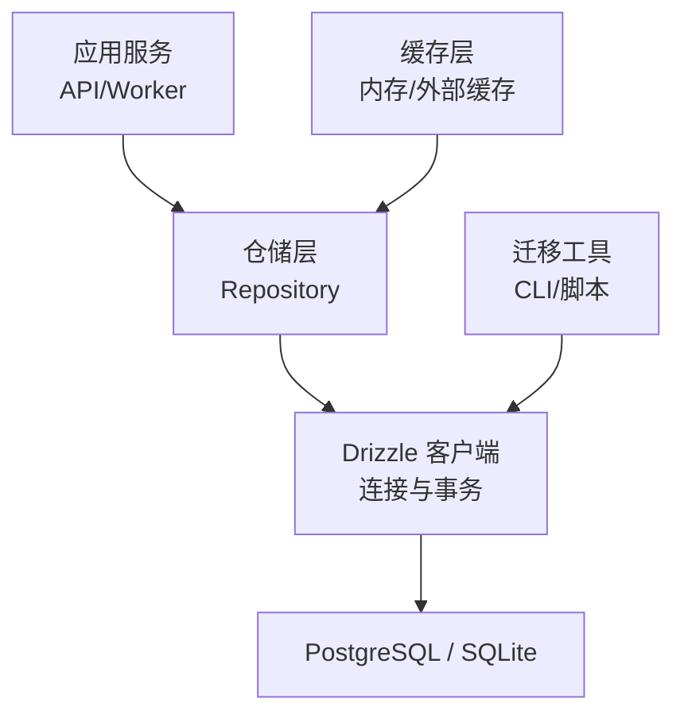
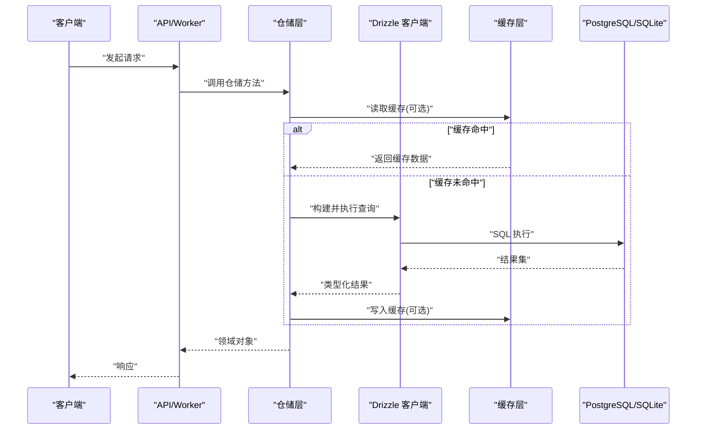
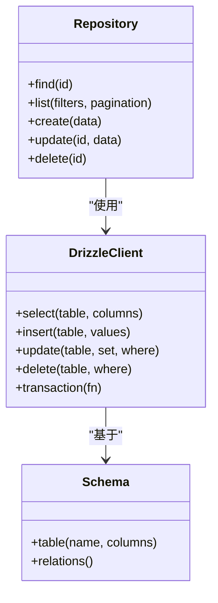
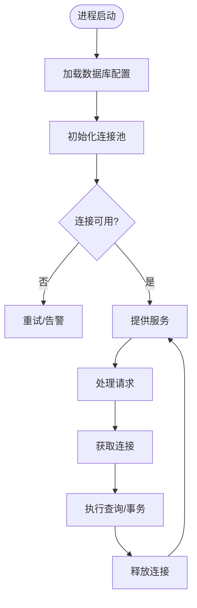
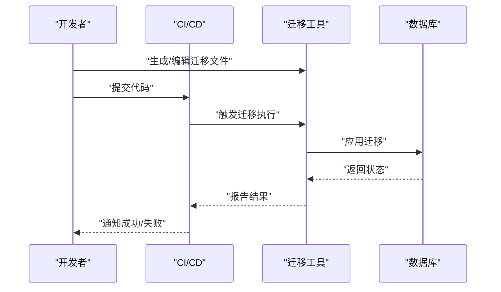
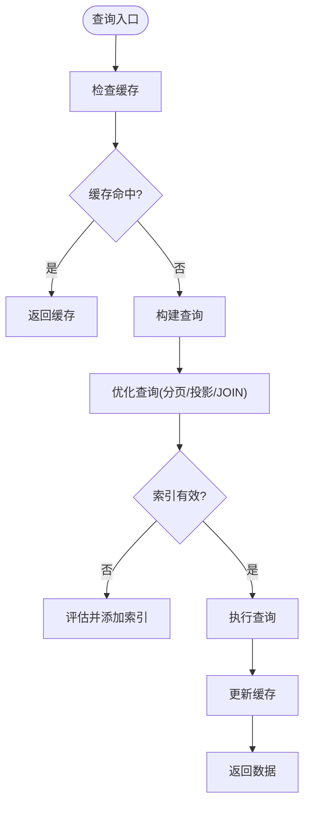
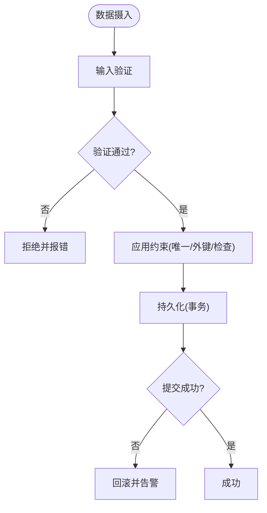
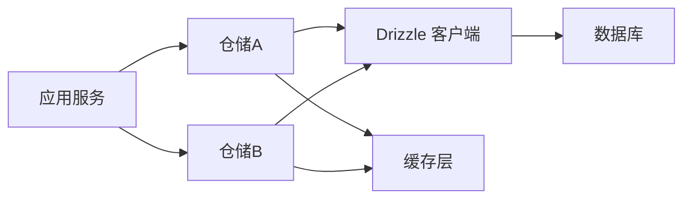

# 数据访问层

<cite>
**本文引用的文件**   
- [drizzle.config.ts](file://drizzle.config.ts)
- [db-migrate.ts](file://scripts/setup/db-migrate.ts)
- [postgres-init.sql](file://scripts/setup/postgres-init.sql)
- [export-sqlite.ts](file://scripts/migration/export-sqlite.ts)
- [import-postgres.ts](file://scripts/migration/import-postgres.ts)
- [reconcile-postgres.ts](file://scripts/migration/reconcile-postgres.ts)
- [sqlite-backup.ts](file://scripts/migration/sqlite-backup.ts)
- [provision-master-key.ts](file://scripts/migration/provision-master-key.ts)
- [runtime-repository.pg.test.ts](file://src/features/audio/runtime-repository.pg.test.ts)
- [provider-credential-store.pg.test.ts](file://src/features/credentials/provider-credential-store.pg.test.ts)
- [repository.pg.test.ts](file://src/features/render/repository.pg.test.ts)
- [cache.pg.test.ts](file://src/features/render/cache.pg.test.ts)
- [media-route-repository.pg.test.ts](file://src/features/routing/media-route-repository.pg.test.ts)
- [model-route-repository.pg.test.ts](file://src/features/routing/model-route-repository.pg.test.ts)
- [vitest.pg.config.ts](file://vitest.pg.config.ts)
</cite>

## 目录
1. [简介](#简介)
2. [项目结构](#项目结构)
3. [核心组件](#核心组件)
4. [架构总览](#架构总览)
5. [详细组件分析](#详细组件分析)
6. [依赖关系分析](#依赖关系分析)
7. [性能考量](#性能考量)
8. [故障排查指南](#故障排查指南)
9. [结论](#结论)
10. [附录](#附录)

## 简介
本技术文档聚焦 PurpleInk 的数据访问层，围绕 Drizzle ORM 的使用模式、查询构建器与类型安全特性展开，系统阐述数据库连接管理、连接池配置与性能优化策略；说明数据迁移机制、版本管理与回滚策略；并提供查询优化技巧、索引设计与缓存策略；最后给出数据验证、约束定义与数据完整性保证方案。文档面向不同技术背景的读者，既提供高层概览，也包含代码级分析与图示。

## 项目结构
数据访问相关的关键位置与职责如下：
- 根级 Drizzle 配置：集中管理数据库连接、驱动与迁移路径等。
- 迁移脚本：封装迁移执行、初始化与跨库迁移工具。
- PostgreSQL 测试适配：通过专用配置文件与 .pg.test.ts 后缀的测试用例，确保在真实 PG 环境下验证数据访问逻辑。
- 业务仓储与缓存：各功能域（音频、渲染、路由等）通过仓储层访问数据库，并在热点路径引入缓存。

[本图为概念性结构图，不直接映射具体源码文件]

## 核心组件
- Drizzle 配置与客户端
  - 通过根级配置文件统一声明数据库驱动、连接字符串、迁移目录与生成产物路径，确保多环境一致性与可重复部署。
  - 客户端负责连接生命周期管理、连接池参数与事务边界控制。
- 迁移与版本管理
  - 使用迁移脚本驱动 schema 演进，支持本地开发、CI 集成与生产发布流程。
  - 提供导出/导入/对齐脚本，便于跨库迁移与一致性校验。
- 仓储与领域模型
  - 仓储封装领域数据的增删改查，屏蔽底层 SQL 细节，向上暴露类型安全的接口。
  - 结合 Drizzle 的类型推断，实现端到端类型安全。
- 缓存与查询优化
  - 对读多写少的热点数据采用缓存层，降低数据库压力并提升响应时延。
  - 配合索引与查询重写，避免全表扫描与 N+1 问题。

**章节来源**
- [drizzle.config.ts](file://drizzle.config.ts)
- [db-migrate.ts](file://scripts/setup/db-migrate.ts)
- [postgres-init.sql](file://scripts/setup/postgres-init.sql)

## 架构总览
下图展示了从 API/Worker 到数据库的完整调用链，以及迁移工具与缓存层的交互关系。

**图表来源**
- [drizzle.config.ts](file://drizzle.config.ts)
- [db-migrate.ts](file://scripts/setup/db-migrate.ts)
- [postgres-init.sql](file://scripts/setup/postgres-init.sql)

**章节来源**
- [drizzle.config.ts](file://drizzle.config.ts)
- [db-migrate.ts](file://scripts/setup/db-migrate.ts)

## 详细组件分析

### Drizzle ORM 使用模式与类型安全
- 模式要点
  - 以“表定义 + 关系”为核心，利用 Drizzle 的类型推导能力，使查询结果与 TS 类型保持一致。
  - 通过仓储层抽象业务语义，避免在业务代码中散落 SQL。
- 类型安全实践
  - 使用 select/infer 将数据库列类型映射为 TS 类型，减少运行时错误。
  - 在仓储接口中明确输入输出类型，形成契约式开发。
- 常见查询构建
  - 条件过滤、排序分页、聚合统计、关联查询等，均通过 Drizzle 构建器完成，保持可读性与可维护性。

[本图为概念性类图，用于说明仓储与 Drizzle 的关系]

**章节来源**
- [runtime-repository.pg.test.ts](file://src/features/audio/runtime-repository.pg.test.ts)
- [repository.pg.test.ts](file://src/features/render/repository.pg.test.ts)
- [media-route-repository.pg.test.ts](file://src/features/routing/media-route-repository.pg.test.ts)
- [model-route-repository.pg.test.ts](file://src/features/routing/model-route-repository.pg.test.ts)

### 数据库连接管理与连接池配置
- 连接管理
  - 通过配置文件集中管理连接串与驱动选择，确保在不同环境（开发/测试/生产）下行为一致。
  - 客户端负责连接的建立、复用与释放，避免连接泄漏。
- 连接池参数
  - 根据并发量与数据库资源合理设置最大连接数、空闲超时与获取超时，平衡吞吐与资源占用。
  - 在高并发场景下，建议启用连接池监控与告警。
- 事务与隔离级别
  - 对写操作或复合读写使用事务包裹，确保一致性。
  - 根据业务需求选择合适的隔离级别，避免脏读/不可重复读等问题。

**章节来源**
- [drizzle.config.ts](file://drizzle.config.ts)
- [vitest.pg.config.ts](file://vitest.pg.config.ts)

### 数据迁移机制、版本管理与回滚策略
- 迁移执行
  - 通过迁移脚本驱动 schema 变更，支持增量更新与幂等执行。
  - 在 CI 流水线中自动执行迁移，确保部署前后数据库状态一致。
- 版本管理
  - 每个迁移对应一个版本号，记录变更内容与依赖关系。
  - 提供导出/导入/对齐脚本，便于跨环境同步与审计。
- 回滚策略
  - 针对关键变更保留回滚脚本，确保失败时可快速恢复。
  - 在生产环境执行迁移前进行预演与备份，降低风险。

**图表来源**
- [db-migrate.ts](file://scripts/setup/db-migrate.ts)
- [postgres-init.sql](file://scripts/setup/postgres-init.sql)

**章节来源**
- [db-migrate.ts](file://scripts/setup/db-migrate.ts)
- [postgres-init.sql](file://scripts/setup/postgres-init.sql)
- [export-sqlite.ts](file://scripts/migration/export-sqlite.ts)
- [import-postgres.ts](file://scripts/migration/import-postgres.ts)
- [reconcile-postgres.ts](file://scripts/migration/reconcile-postgres.ts)
- [sqlite-backup.ts](file://scripts/migration/sqlite-backup.ts)
- [provision-master-key.ts](file://scripts/migration/provision-master-key.ts)

### 查询优化技巧、索引设计与缓存策略
- 查询优化
  - 避免 N+1 查询，使用批量查询或 JOIN 合并。
  - 限制返回字段，仅选择必要列，减少网络与序列化开销。
  - 合理使用分页与游标，避免大结果集一次性加载。
- 索引设计
  - 为高频过滤与排序字段创建索引，关注选择性高的列。
  - 覆盖索引用于加速特定查询，但需权衡写入成本。
  - 定期分析慢查询日志，调整索引与查询计划。
- 缓存策略
  - 对热点读数据采用内存缓存或外部缓存，设置合理的过期时间。
  - 使用缓存失效与更新策略，保证数据一致性。
  - 缓存穿透与雪崩防护，增加空值缓存与随机过期。

[本图为概念性流程图，用于说明查询与缓存协作]

**章节来源**
- [cache.pg.test.ts](file://src/features/render/cache.pg.test.ts)
- [repository.pg.test.ts](file://src/features/render/repository.pg.test.ts)

### 数据验证、约束定义与数据完整性保证
- 数据验证
  - 在入库前进行输入校验，包括必填、格式、范围与业务规则。
  - 使用类型系统与 DTO 校验，确保前端与后端一致性。
- 约束定义
  - 在数据库层面定义主键、唯一键、外键与检查约束，防止非法数据进入。
  - 对敏感字段进行加密或脱敏存储。
- 完整性保证
  - 通过事务与原子操作保证复合写入的一致性。
  - 使用幂等键与去重逻辑，避免重复写入。

[本图为概念性流程图，用于说明验证与约束流程]

**章节来源**
- [provider-credential-store.pg.test.ts](file://src/features/credentials/provider-credential-store.pg.test.ts)
- [runtime-repository.pg.test.ts](file://src/features/audio/runtime-repository.pg.test.ts)

## 依赖关系分析
- 模块耦合
  - 仓储层依赖 Drizzle 客户端与 Schema 定义，向上暴露领域接口。
  - 缓存层与仓储层解耦，通过可选注入方式接入。
- 外部依赖
  - 数据库驱动（PostgreSQL/SQLite）由配置文件统一管理。
  - 迁移工具与 CI 流水线集成，确保自动化执行。
- 潜在循环依赖
  - 仓储与领域服务之间应保持单向依赖，避免循环引用。
  - 通过接口抽象与依赖注入降低耦合度。

[本图为概念性依赖图，用于说明模块间关系]

**章节来源**
- [drizzle.config.ts](file://drizzle.config.ts)
- [vitest.pg.config.ts](file://vitest.pg.config.ts)

## 性能考量
- 连接池调优
  - 根据 CPU 核数与数据库容量设置合适的最大连接数。
  - 监控连接等待时间与超时率，动态调整参数。
- 查询性能
  - 使用 EXPLAIN 分析执行计划，识别全表扫描与低效 JOIN。
  - 拆分复杂查询为多个简单查询，必要时引入物化视图。
- 缓存命中率
  - 监控缓存命中率与延迟，优化过期策略与预热机制。
  - 对热点数据进行分片缓存，避免单点瓶颈。
- 资源隔离
  - 读写分离与只读副本，分担主库压力。
  - 任务队列异步化，避免阻塞主流程。

[本节为通用性能指导，不直接分析具体文件]

## 故障排查指南
- 常见问题
  - 连接池耗尽：检查连接泄漏与超时设置，监控活跃连接数。
  - 慢查询：定位长耗时 SQL，优化索引与查询结构。
  - 迁移失败：核对迁移脚本幂等性与依赖顺序，查看错误日志。
- 诊断步骤
  - 启用详细日志与追踪 ID，定位请求链路。
  - 使用数据库监控工具观察锁竞争与死锁。
  - 回放失败场景，复现并修复问题。

**章节来源**
- [db-migrate.ts](file://scripts/setup/db-migrate.ts)
- [postgres-init.sql](file://scripts/setup/postgres-init.sql)

## 结论
PurpleInk 的数据访问层以 Drizzle ORM 为核心，结合仓储抽象、迁移工具与缓存策略，构建了类型安全、可维护且高性能的数据访问体系。通过规范的连接管理、索引设计与事务控制，保障了数据一致性与系统稳定性。未来可进一步引入读写分离、分布式缓存与更细粒度的权限控制，持续提升系统能力。

[本节为总结性内容，不直接分析具体文件]

## 附录
- 参考配置与脚本
  - Drizzle 配置：[drizzle.config.ts](file://drizzle.config.ts)
  - 迁移执行：[db-migrate.ts](file://scripts/setup/db-migrate.ts)
  - 数据库初始化：[postgres-init.sql](file://scripts/setup/postgres-init.sql)
  - 跨库迁移工具：[export-sqlite.ts](file://scripts/migration/export-sqlite.ts)、[import-postgres.ts](file://scripts/migration/import-postgres.ts)、[reconcile-postgres.ts](file://scripts/migration/reconcile-postgres.ts)、[sqlite-backup.ts](file://scripts/migration/sqlite-backup.ts)、[provision-master-key.ts](file://scripts/migration/provision-master-key.ts)
- 测试与验证
  - PostgreSQL 测试配置：[vitest.pg.config.ts](file://vitest.pg.config.ts)
  - 仓储与缓存测试：[runtime-repository.pg.test.ts](file://src/features/audio/runtime-repository.pg.test.ts)、[repository.pg.test.ts](file://src/features/render/repository.pg.test.ts)、[cache.pg.test.ts](file://src/features/render/cache.pg.test.ts)、[media-route-repository.pg.test.ts](file://src/features/routing/media-route-repository.pg.test.ts)、[model-route-repository.pg.test.ts](file://src/features/routing/model-route-repository.pg.test.ts)、[provider-credential-store.pg.test.ts](file://src/features/credentials/provider-credential-store.pg.test.ts)