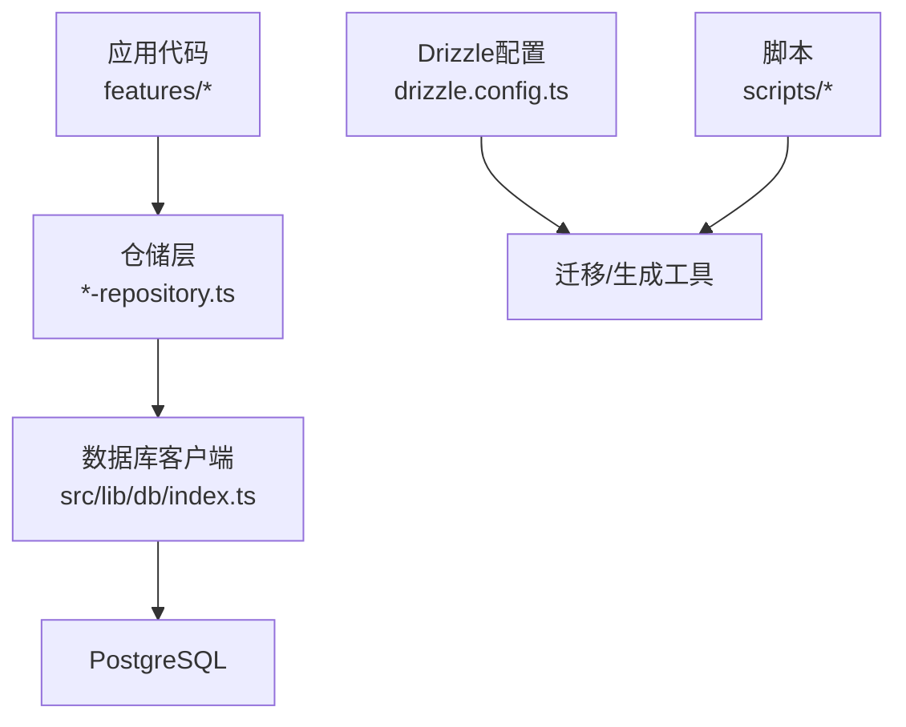
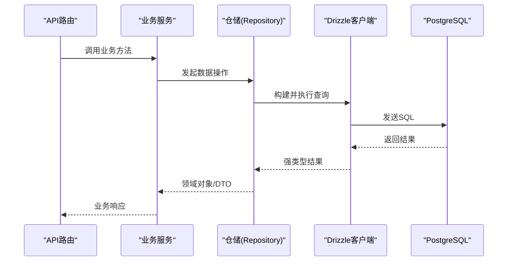
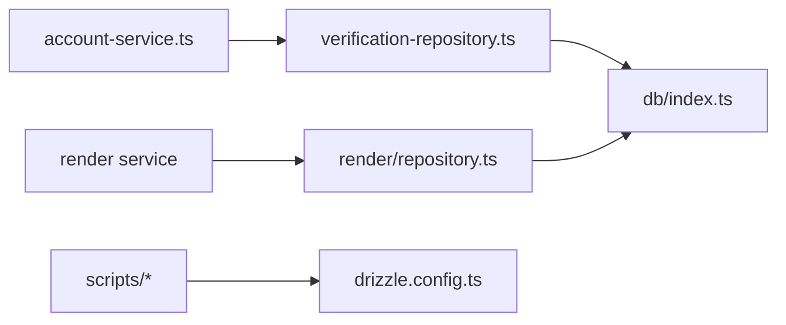

# Drizzle ORM使用指南

<cite>
**本文引用的文件**   
- [drizzle.config.ts](file://drizzle.config.ts)
- [lib/db/index.ts](file://src/lib/db/index.ts)
- [features/auth/account-service.pg.test.ts](file://src/features/auth/account-service.pg.test.ts)
- [features/auth/account-service.ts](file://src/features/auth/account-service.ts)
- [features/auth/verification-repository.ts](file://src/features/auth/verification-repository.ts)
- [features/render/repository.ts](file://src/features/render/repository.ts)
- [features/render/cache.ts](file://src/features/render/cache.ts)
- [features/director/runtime-repository.ts](file://src/features/director/runtime-repository.ts)
- [features/routing/media-route-repository.ts](file://src/features/routing/media-route-repository.ts)
- [scripts/migration/export-sqlite.ts](file://scripts/migration/export-sqlite.ts)
- [scripts/migration/import-postgres.ts](file://scripts/migration/import-postgres.ts)
- [scripts/setup/db-migrate.ts](file://scripts/setup/db-migrate.ts)
</cite>

## 目录
1. [简介](#简介)
2. [项目结构](#项目结构)
3. [核心组件](#核心组件)
4. [架构总览](#架构总览)
5. [详细组件分析](#详细组件分析)
6. [依赖关系分析](#依赖关系分析)
7. [性能考虑](#性能考虑)
8. [故障排查指南](#故障排查指南)
9. [结论](#结论)
10. [附录](#附录)

## 简介
本指南面向PurpleInk项目中Drizzle ORM的使用，聚焦以下目标：
- 模型定义最佳实践：表结构、字段类型映射、约束与索引
- 查询构建器用法：基础查询、条件过滤、关联查询、聚合查询
- 事务处理机制：事务边界、嵌套事务、错误回滚策略
- TypeScript集成：类型推断、接口定义、编译时检查
- 实战示例与性能优化技巧

本项目采用“配置集中 + 仓库模式”的数据库访问层设计，通过Drizzle Config管理迁移与生成，服务层封装业务逻辑，仓储层统一数据访问。

## 项目结构
- 配置与初始化
  - drizzle.config.ts：驱动、连接、迁移与生成配置
  - src/lib/db/index.ts：数据库连接与客户端实例化（PostgreSQL）
- 仓储与服务
  - features/* 下的 repository.ts / *-repository.ts：按领域划分的数据访问实现
  - features/* 下的 *-service.ts：业务编排与事务边界
- 迁移与脚本
  - scripts/migration/*：SQLite导出/导入、Postgres同步等
  - scripts/setup/db-migrate.ts：启动或执行迁移

图表来源
- [drizzle.config.ts](file://drizzle.config.ts)
- [src/lib/db/index.ts](file://src/lib/db/index.ts)

章节来源
- [drizzle.config.ts](file://drizzle.config.ts)
- [src/lib/db/index.ts](file://src/lib/db/index.ts)

## 核心组件
- 数据库客户端与连接池
  - 在src/lib/db/index.ts中创建并导出Drizzle PostgreSQL客户端，供仓储层复用
- 仓储层（Repository）
  - 将Drizzle查询封装为领域方法，屏蔽SQL细节，便于测试与替换
- 服务层（Service）
  - 编排多个仓储调用，定义事务边界与错误处理策略
- 迁移与生成
  - 通过drizzle.config.ts驱动迁移与类型生成，保证Schema与TS类型一致

章节来源
- [src/lib/db/index.ts](file://src/lib/db/index.ts)
- [drizzle.config.ts](file://drizzle.config.ts)

## 架构总览
下图展示了从API到数据库的调用路径，以及Drizzle在其中的角色。

图表来源
- [src/lib/db/index.ts](file://src/lib/db/index.ts)
- [features/auth/account-service.ts](file://src/features/auth/account-service.ts)
- [features/auth/account-service.pg.test.ts](file://src/features/auth/account-service.pg.test.ts)

## 详细组件分析

### 数据库客户端与连接
- 职责
  - 建立与PostgreSQL的连接，暴露Drizzle客户端给仓储层
- 关键点
  - 连接参数来自环境变量
  - 连接池大小与超时需结合部署环境调优
- 建议
  - 单例复用客户端，避免重复连接
  - 在测试环境使用内存或临时数据库

章节来源
- [src/lib/db/index.ts](file://src/lib/db/index.ts)

### 仓储层（Repository）
- 典型实现
  - features/auth/verification-repository.ts：验证相关表的CRUD
  - features/render/repository.ts：渲染任务与产物持久化
  - features/director/runtime-repository.ts：运行时状态读写
  - features/routing/media-route-repository.ts：媒体路由记录
- 设计要点
  - 每个仓储对应一个或一组紧密相关的表
  - 对外暴露领域语义的方法，如createVerification、getRenderJobById
  - 内部使用Drizzle查询构建器构造SQL，保持可读性与可维护性

章节来源
- [features/auth/verification-repository.ts](file://src/features/auth/verification-repository.ts)
- [features/render/repository.ts](file://src/features/render/repository.ts)
- [features/director/runtime-repository.ts](file://src/features/director/runtime-repository.ts)
- [features/routing/media-route-repository.ts](file://src/features/routing/media-route-repository.ts)

### 服务层（Service）与事务
- 职责
  - 编排多个仓储调用，确保一致性
  - 定义事务边界，捕获异常并回滚
- 常见模式
  - 单一事务包裹一次请求的所有写操作
  - 对只读操作不纳入事务，减少锁竞争
  - 对关键路径使用重试与幂等键

章节来源
- [features/auth/account-service.ts](file://src/features/auth/account-service.ts)
- [features/auth/account-service.pg.test.ts](file://src/features/auth/account-service.pg.test.ts)

### 迁移与类型生成
- 配置
  - drizzle.config.ts定义驱动、连接、schema位置、输出目录
- 常用命令
  - 生成迁移：根据schema变更生成SQL
  - 执行迁移：应用到数据库
  - 生成TS类型：保证查询结果与TS类型一致
- 脚本参考
  - scripts/setup/db-migrate.ts：迁移执行入口
  - scripts/migration/export-sqlite.ts / import-postgres.ts：跨库迁移辅助

章节来源
- [drizzle.config.ts](file://drizzle.config.ts)
- [scripts/setup/db-migrate.ts](file://scripts/setup/db-migrate.ts)
- [scripts/migration/export-sqlite.ts](file://scripts/migration/export-sqlite.ts)
- [scripts/migration/import-postgres.ts](file://scripts/migration/import-postgres.ts)

### 缓存与查询优化
- 场景
  - 热点数据（如配置、字典）适合缓存
- 实现
  - features/render/cache.ts提供缓存读写能力
- 建议
  - 设置合理的TTL与失效策略
  - 缓存未命中时再查库，避免雪崩

章节来源
- [features/render/cache.ts](file://src/features/render/cache.ts)

## 依赖关系分析
仓储层依赖数据库客户端；服务层依赖仓储层；迁移与脚本依赖drizzle配置。

图表来源
- [features/auth/account-service.ts](file://src/features/auth/account-service.ts)
- [features/auth/verification-repository.ts](file://src/features/auth/verification-repository.ts)
- [features/render/repository.ts](file://src/features/render/repository.ts)
- [src/lib/db/index.ts](file://src/lib/db/index.ts)
- [drizzle.config.ts](file://drizzle.config.ts)

章节来源
- [features/auth/account-service.ts](file://src/features/auth/account-service.ts)
- [features/auth/verification-repository.ts](file://src/features/auth/verification-repository.ts)
- [features/render/repository.ts](file://src/features/render/repository.ts)
- [src/lib/db/index.ts](file://src/lib/db/index.ts)
- [drizzle.config.ts](file://drizzle.config.ts)

## 性能考虑
- 索引与查询计划
  - 为高频过滤与排序列添加索引
  - 使用EXPLAIN分析慢查询
- 连接池与并发
  - 合理设置maxConnections、idleTimeoutMs
  - 控制并发度，避免打满数据库
- 批量操作
  - 使用批量插入/更新减少往返
- 缓存
  - 热点数据加缓存，降低DB压力
- 分页与投影
  - 仅选择必要字段，限制返回行数

[本节为通用指导，不直接分析具体文件]

## 故障排查指南
- 常见问题
  - 连接失败：检查环境变量与网络连通性
  - 迁移冲突：核对本地schema与数据库版本
  - 事务回滚：确认异常是否抛出且未被吞掉
- 定位手段
  - 启用SQL日志观察实际语句
  - 使用单元测试复现问题
  - 查看错误堆栈与事务状态

章节来源
- [features/auth/account-service.pg.test.ts](file://src/features/auth/account-service.pg.test.ts)
- [scripts/setup/db-migrate.ts](file://scripts/setup/db-migrate.ts)

## 结论
通过“配置集中 + 仓储模式”，PurpleInk在Drizzle ORM上实现了清晰的数据库访问分层。遵循本文的最佳实践，可在保证类型安全与可维护性的同时，获得良好的性能与可扩展性。

[本节为总结，不直接分析具体文件]

## 附录

### 模型定义最佳实践
- 表结构
  - 明确主键、唯一键、外键与默认值
  - 使用合适的字段类型（如UUID、JSON、TIMESTAMPTZ）
- 约束与索引
  - 为外键与频繁过滤列建索引
  - 使用CHECK约束表达业务规则
- 命名规范
  - 表名复数、字段名小写下划线
  - 时间戳统一created_at/updated_at

[本节为通用指导，不直接分析具体文件]

### 查询构建器使用方法
- 基础查询
  - select/from/where/orderBy/limit
- 条件过滤
  - and/or/in/not等组合
- 关联查询
  - joins与selectRelations（视Drizzle版本）
- 聚合查询
  - count/sum/avg/max/min与groupBy/having

[本节为通用指导，不直接分析具体文件]

### 事务处理机制
- 事务边界
  - 以请求为单位，包含所有写操作
- 嵌套事务
  - 使用保存点模拟嵌套，或在仓储层拆分调用
- 错误回滚
  - 捕获异常后显式回滚，确保一致性

[本节为通用指导，不直接分析具体文件]

### TypeScript集成
- 类型推断
  - 基于schema生成类型，查询结果自动强类型
- 接口定义
  - 在服务层定义输入输出接口，仓储层实现
- 编译时检查
  - 开启严格模式，利用类型系统提前发现问题

[本节为通用指导，不直接分析具体文件]