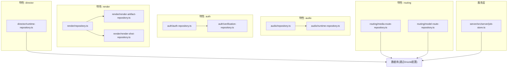
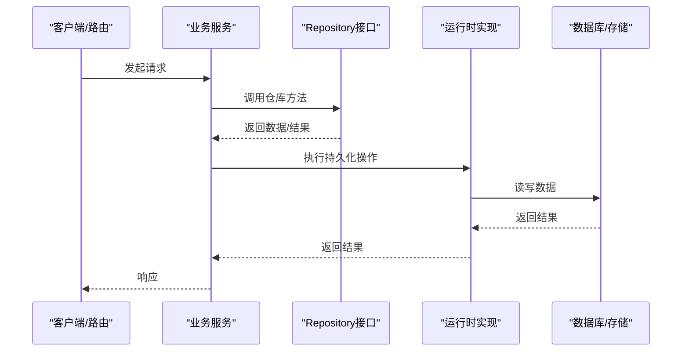
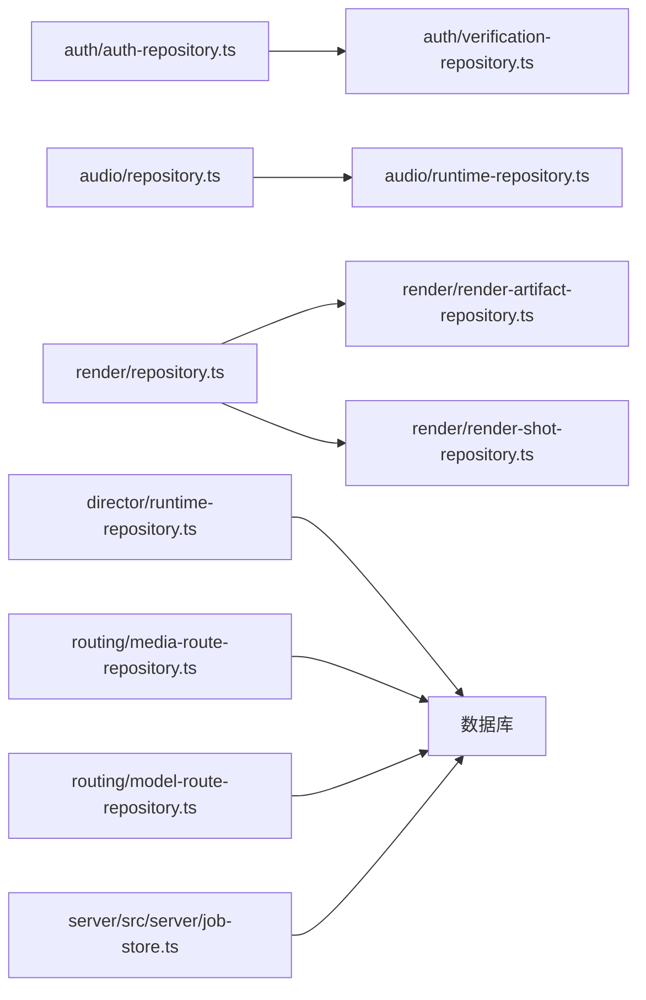

# Repository模式实现

<cite>
**本文引用的文件**   
- [src/features/audio/repository.ts](file://src/features/audio/repository.ts)
- [src/features/audio/runtime-repository.ts](file://src/features/audio/runtime-repository.ts)
- [src/features/auth/auth-repository.ts](file://src/features/auth/auth-repository.ts)
- [src/features/auth/verification-repository.ts](file://src/features/auth/verification-repository.ts)
- [src/features/render/repository.ts](file://src/features/render/repository.ts)
- [src/features/render/render-artifact-repository.ts](file://src/features/render/render-artifact-repository.ts)
- [src/features/render/render-shot-repository.ts](file://src/features/render/render-shot-repository.ts)
- [src/features/director/runtime-repository.ts](file://src/features/director/runtime-repository.ts)
- [src/features/routing/media-route-repository.ts](file://src/features/routing/media-route-repository.ts)
- [src/features/routing/model-route-repository.ts](file://src/features/routing/model-route-repository.ts)
- [server/src/server/job-store.ts](file://server/src/server/job-store.ts)
- [drizzle.config.ts](file://drizzle.config.ts)
</cite>

## 目录
1. [简介](#简介)
2. [项目结构](#项目结构)
3. [核心组件](#核心组件)
4. [架构总览](#架构总览)
5. [详细组件分析](#详细组件分析)
6. [依赖分析](#依赖分析)
7. [性能考量](#性能考量)
8. [故障排查指南](#故障排查指南)
9. [结论](#结论)
10. [附录](#附录)

## 简介
本文件系统性梳理 PurpleInK 项目中 Repository 模式的实现与使用，覆盖接口设计规范、抽象层设计、方法签名约定、错误处理策略，以及认证、音频、渲染等关键业务模块的仓库实现。同时总结数据访问封装策略（查询优化、批量操作、缓存集成），并给出测试策略（Mock、单元测试、集成测试）与使用模式示例路径，帮助读者快速理解与扩展仓库层。

## 项目结构
仓库层按“领域特性”组织，每个特性目录内包含：
- repository.ts：定义该领域的仓储接口与通用实现
- runtime-repository.ts：运行时持久化实现（通常基于数据库或外部存储）
- *.test.ts / *.pg.test.ts：单元与集成测试
- 其他辅助类型与工具

图表来源
- [src/features/audio/repository.ts](file://src/features/audio/repository.ts)
- [src/features/audio/runtime-repository.ts](file://src/features/audio/runtime-repository.ts)
- [src/features/auth/auth-repository.ts](file://src/features/auth/auth-repository.ts)
- [src/features/auth/verification-repository.ts](file://src/features/auth/verification-repository.ts)
- [src/features/render/repository.ts](file://src/features/render/repository.ts)
- [src/features/render/render-artifact-repository.ts](file://src/features/render/render-artifact-repository.ts)
- [src/features/render/render-shot-repository.ts](file://src/features/render/render-shot-repository.ts)
- [src/features/director/runtime-repository.ts](file://src/features/director/runtime-repository.ts)
- [src/features/routing/media-route-repository.ts](file://src/features/routing/media-route-repository.ts)
- [src/features/routing/model-route-repository.ts](file://src/features/routing/model-route-repository.ts)
- [server/src/server/job-store.ts](file://server/src/server/job-store.ts)
- [drizzle.config.ts](file://drizzle.config.ts)

章节来源
- [drizzle.config.ts](file://drizzle.config.ts)

## 核心组件
- 接口设计规范
  - 以领域为边界定义接口，命名统一为 XxxRepository，方法名采用动词+名词形式（如 create、get、update、delete、list、batchXxx）。
  - 参数与返回值使用强类型约束，避免 any；对可选字段使用联合类型或可选属性。
  - 错误处理：优先抛出领域异常或标准化错误对象，调用方根据错误码/类型分支处理。
  - 事务支持：写操作提供事务回调或返回事务上下文，保证一致性。
- 抽象层设计
  - 将“能力契约”与“具体实现”解耦，便于替换（内存、SQLite、PostgreSQL、远程存储）。
  - 公共逻辑下沉到基类或组合函数，减少重复。
- 方法签名约定
  - 查询方法：find/get/list 返回 Promise<T | T[]>，失败抛错或返回空集合。
  - 写入方法：create/update/delete/batch 返回影响计数或结果对象。
  - 分页/过滤：统一使用 queryOptions 对象传递条件、排序、分页。
- 错误处理
  - 区分“未找到”、“冲突”、“权限不足”、“资源不可用”等错误类别。
  - 对外暴露稳定错误码，内部堆栈仅用于调试。

章节来源
- [src/features/audio/repository.ts](file://src/features/audio/repository.ts)
- [src/features/auth/auth-repository.ts](file://src/features/auth/auth-repository.ts)
- [src/features/render/repository.ts](file://src/features/render/repository.ts)

## 架构总览
仓库层位于应用与服务之间，屏蔽底层存储差异，向上提供稳定的领域数据访问能力。典型调用链：API/页面 -> 业务服务 -> Repository -> 持久化实现（DB/对象存储/队列）。

图表来源
- [src/features/audio/runtime-repository.ts](file://src/features/audio/runtime-repository.ts)
- [src/features/auth/auth-repository.ts](file://src/features/auth/auth-repository.ts)
- [src/features/render/render-artifact-repository.ts](file://src/features/render/render-artifact-repository.ts)
- [server/src/server/job-store.ts](file://server/src/server/job-store.ts)

## 详细组件分析

### 认证仓库（Auth Repository）
- 职责
  - 账户信息存取、会话状态管理、验证码与重置密码流程的数据访问。
- 接口要点
  - 账户：创建、查询、更新、删除、按邮箱/用户名查找。
  - 会话：创建、读取、刷新、销毁。
  - 验证码：生成、校验、过期清理。
- 错误处理
  - 未找到用户、重复注册、验证码无效/过期、会话失效等。
- 使用模式
  - 登录流程：验证凭据 -> 获取用户 -> 创建会话 -> 返回令牌。
  - 密码重置：生成验证码 -> 发送通知 -> 校验验证码 -> 更新密码。

章节来源
- [src/features/auth/auth-repository.ts](file://src/features/auth/auth-repository.ts)
- [src/features/auth/verification-repository.ts](file://src/features/auth/verification-repository.ts)

### 音频仓库（Audio Repository）
- 职责
  - 音频元数据、片段、字幕、评分、合成任务等数据的持久化与查询。
- 接口要点
  - 媒体：上传、下载、删除、列表、按项目/时间范围查询。
  - 叙事：文本转语音任务提交、状态查询、结果拉取。
  - 字幕：ASS/SRT 生成与关联。
  - 评分：质量分、时长测量、格式校验。
- 查询优化
  - 常用查询建立索引（项目ID、时间戳、状态）。
  - 分页与投影：只返回必要字段，减少网络与序列化开销。
- 批量操作
  - 批量导入/导出、批量状态更新、批量删除。
- 缓存集成
  - 热点元数据（如项目概览）可结合内存缓存或Redis。

章节来源
- [src/features/audio/repository.ts](file://src/features/audio/repository.ts)
- [src/features/audio/runtime-repository.ts](file://src/features/audio/runtime-repository.ts)

### 渲染仓库（Render Repository）
- 职责
  - 渲染任务、镜头、制品（截图/视频/缩略图）的CRUD与状态流转。
- 接口要点
  - 任务：创建、查询、取消、重试、统计。
  - 镜头：规格、素材、输出路径、进度。
  - 制品：生成、校验、归档、清理。
- 批处理与并发
  - 批量生成缩略图、并发编码、失败重试。
- 缓存
  - 预览图、统计指标可短期缓存。

章节来源
- [src/features/render/repository.ts](file://src/features/render/repository.ts)
- [src/features/render/render-artifact-repository.ts](file://src/features/render/render-artifact-repository.ts)
- [src/features/render/render-shot-repository.ts](file://src/features/render/render-shot-repository.ts)

### 导演运行时仓库（Director Runtime Repository）
- 职责
  - 导演工作流中间态、阶段产物、节点数据的持久化与恢复。
- 接口要点
  - 会话：创建、续期、快照、恢复。
  - 阶段：推进、回滚、检查点。
  - 产物：写入、读取、版本化。
- 一致性
  - 使用事务确保阶段推进原子性。

章节来源
- [src/features/director/runtime-repository.ts](file://src/features/director/runtime-repository.ts)

### 路由仓库（Routing Repository）
- 职责
  - 媒体路由与模型路由规则的管理与匹配。
- 接口要点
  - 媒体路由：按域名/路径映射到后端服务或存储。
  - 模型路由：按模型名称/版本选择适配器。
- 性能
  - 路由表热加载、LRU缓存命中。

章节来源
- [src/features/routing/media-route-repository.ts](file://src/features/routing/media-route-repository.ts)
- [src/features/routing/model-route-repository.ts](file://src/features/routing/model-route-repository.ts)

### 作业存储（Job Store）
- 职责
  - 后台作业队列的持久化、调度、重试、幂等控制。
- 接口要点
  - 入队、出队、状态更新、失败重试、统计。
- 可靠性
  - 至少一次投递、去重键、超时回收。

章节来源
- [server/src/server/job-store.ts](file://server/src/server/job-store.ts)

## 依赖分析
仓库层依赖关系清晰，按领域隔离，避免跨域耦合。

图表来源
- [src/features/auth/auth-repository.ts](file://src/features/auth/auth-repository.ts)
- [src/features/auth/verification-repository.ts](file://src/features/auth/verification-repository.ts)
- [src/features/audio/repository.ts](file://src/features/audio/repository.ts)
- [src/features/audio/runtime-repository.ts](file://src/features/audio/runtime-repository.ts)
- [src/features/render/repository.ts](file://src/features/render/repository.ts)
- [src/features/render/render-artifact-repository.ts](file://src/features/render/render-artifact-repository.ts)
- [src/features/render/render-shot-repository.ts](file://src/features/render/render-shot-repository.ts)
- [src/features/director/runtime-repository.ts](file://src/features/director/runtime-repository.ts)
- [src/features/routing/media-route-repository.ts](file://src/features/routing/media-route-repository.ts)
- [src/features/routing/model-route-repository.ts](file://src/features/routing/model-route-repository.ts)
- [server/src/server/job-store.ts](file://server/src/server/job-store.ts)

章节来源
- [drizzle.config.ts](file://drizzle.config.ts)

## 性能考量
- 查询优化
  - 合理索引：外键、筛选字段、排序字段。
  - 投影与分页：按需返回字段，避免大对象传输。
  - 连接池与超时：数据库连接复用，设置合理的超时与重试。
- 批量操作
  - 合并写入：批量插入/更新，减少往返次数。
  - 分批处理：大数据集分片处理，避免内存溢出。
- 缓存集成
  - 热点读：短TTL缓存（内存/Redis），配合版本号或ETag。
  - 写穿透：先写库再更新缓存，或使用延迟双删。
- 并发与一致性
  - 乐观锁/版本号防止覆盖写。
  - 分布式锁保护临界区（如唯一性校验）。

[本节为通用指导，不直接分析具体文件]

## 故障排查指南
- 常见问题
  - 连接失败：检查数据库配置、网络连通、权限。
  - 死锁/超时：定位长事务与大查询，优化SQL与索引。
  - 数据不一致：核对事务边界与重试策略。
  - 缓存污染：核对缓存键与失效策略。
- 诊断手段
  - 启用慢查询日志与审计日志。
  - 增加结构化日志与追踪ID。
  - 使用健康检查端点与指标监控。

[本节为通用指导，不直接分析具体文件]

## 结论
PurpleInK 的 Repository 模式以领域为边界，提供一致的数据访问契约，屏蔽底层实现差异。通过统一的接口规范、错误处理与事务语义，提升了可测试性与可维护性。在音频、渲染、认证、导演、路由等模块中，仓库层有效支撑了复杂业务流程，并为后续扩展（多存储、多租户、灰度发布）奠定基础。

[本节为总结性内容，不直接分析具体文件]

## 附录
- 使用模式示例（路径参考）
  - 认证登录：[src/features/auth/auth-repository.ts](file://src/features/auth/auth-repository.ts)
  - 验证码流程：[src/features/auth/verification-repository.ts](file://src/features/auth/verification-repository.ts)
  - 音频上传与查询：[src/features/audio/repository.ts](file://src/features/audio/repository.ts), [src/features/audio/runtime-repository.ts](file://src/features/audio/runtime-repository.ts)
  - 渲染任务与制品：[src/features/render/repository.ts](file://src/features/render/repository.ts), [src/features/render/render-artifact-repository.ts](file://src/features/render/render-artifact-repository.ts), [src/features/render/render-shot-repository.ts](file://src/features/render/render-shot-repository.ts)
  - 导演工作流状态：[src/features/director/runtime-repository.ts](file://src/features/director/runtime-repository.ts)
  - 路由规则管理：[src/features/routing/media-route-repository.ts](file://src/features/routing/media-route-repository.ts), [src/features/routing/model-route-repository.ts](file://src/features/routing/model-route-repository.ts)
  - 作业队列持久化：[server/src/server/job-store.ts](file://server/src/server/job-store.ts)
- 测试策略（路径参考）
  - 单元测试：各仓库目录下 *.test.ts
  - 集成测试（PostgreSQL）：*.pg.test.ts
  - Mock 建议：使用内存实现或轻量模拟对象，隔离外部依赖

[本节为补充说明，不直接分析具体文件]