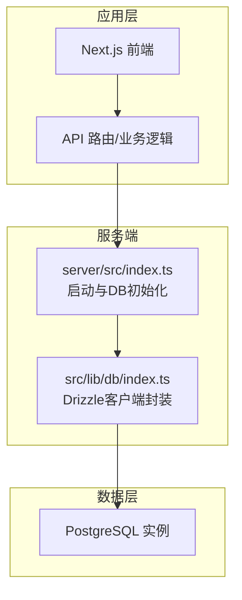
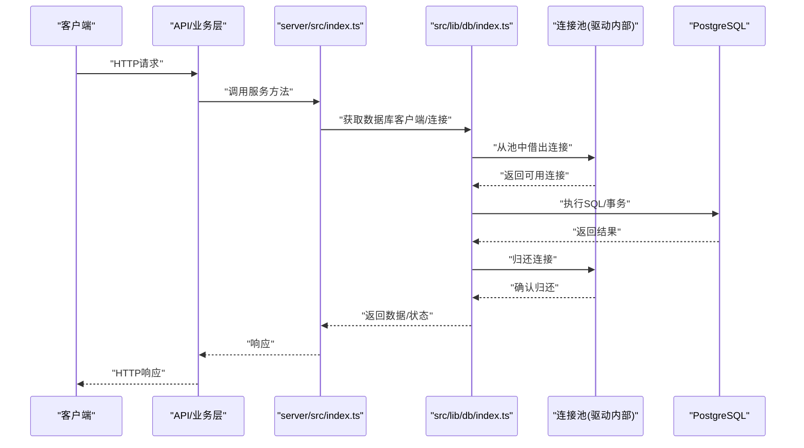
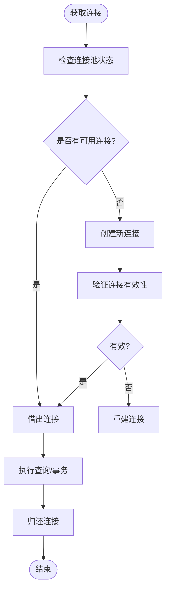
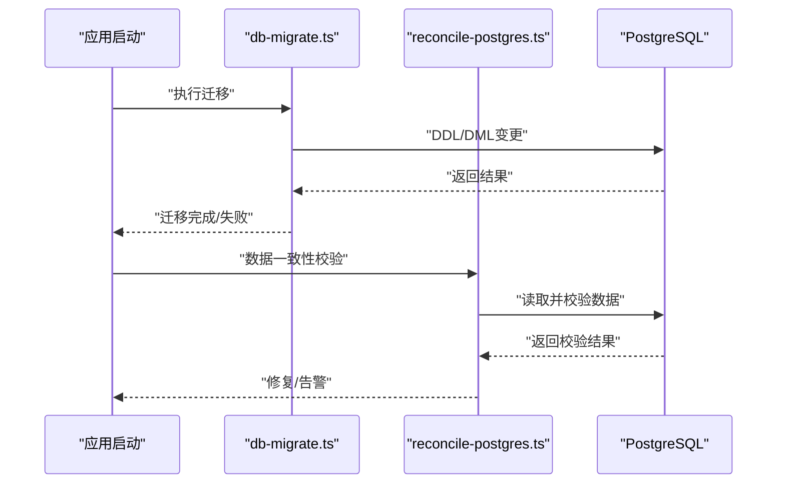
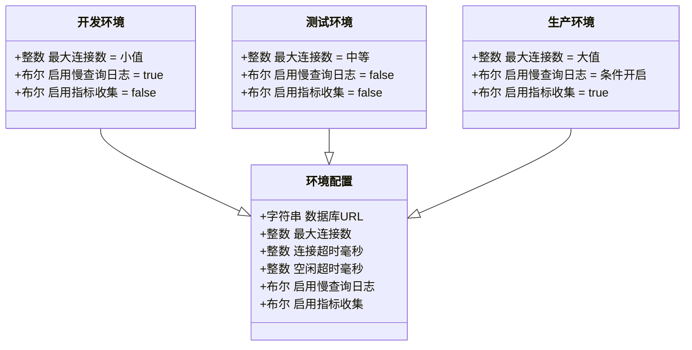
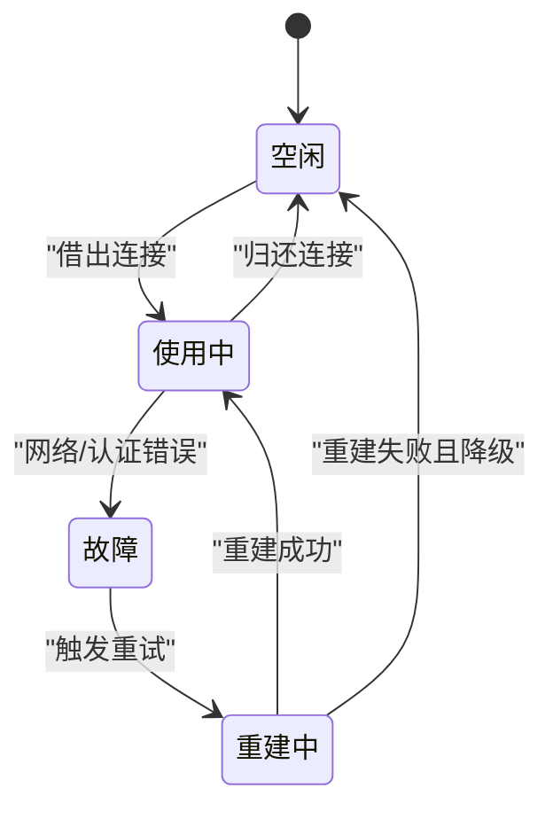
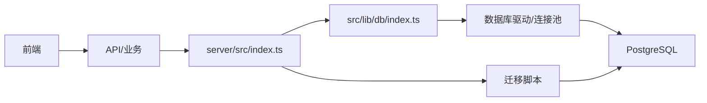

# 数据库连接管理

<cite>
**本文引用的文件**   
- [docker-compose.dev.yml](file://docker-compose.dev.yml)
- [docker-compose.prod.yml](file://docker-compose.prod.yml)
- [drizzle.config.ts](file://drizzle.config.ts)
- [scripts/setup/db-migrate.ts](file://scripts/setup/db-migrate.ts)
- [scripts/migration/reconcile-postgres.ts](file://scripts/migration/reconcile-postgres.ts)
- [server/src/index.ts](file://server/src/index.ts)
- [src/lib/db/index.ts](file://src/lib/db/index.ts)
- [src/features/audio/runtime-repository.pg.test.ts](file://src/features/audio/runtime-repository.pg.test.ts)
- [src/features/auth/account-service.pg.test.ts](file://src/features/auth/account-service.pg.test.ts)
- [src/features/render/cache.pg.test.ts](file://src/features/render/cache.pg.test.ts)
- [src/features/director/runtime-repository.pg.test.ts](file://src/features/director/runtime-repository.pg.test.ts)
- [src/features/routing/media-route-repository.pg.test.ts](file://src/features/routing/media-route-repository.pg.test.ts)
- [src/features/credentials/provider-credential-store.pg.test.ts](file://src/features/credentials/provider-credential-store.pg.test.ts)
</cite>

## 目录
1. [简介](#简介)
2. [项目结构](#项目结构)
3. [核心组件](#核心组件)
4. [架构总览](#架构总览)
5. [详细组件分析](#详细组件分析)
6. [依赖关系分析](#依赖关系分析)
7. [性能考虑](#性能考虑)
8. [故障排除指南](#故障排除指南)
9. [结论](#结论)
10. [附录](#附录)

## 简介
本文件聚焦于项目中 PostgreSQL 数据库连接管理的实现与最佳实践，涵盖连接池配置、连接生命周期管理、环境差异化配置、监控与诊断方法，以及常见问题的排查与优化建议。文档面向不同技术背景的读者，力求以循序渐进的方式解释关键概念与实践要点。

## 项目结构
本项目采用前后端分离的架构：前端基于 Next.js，后端服务位于 server 目录；数据库相关能力通过 Drizzle ORM 进行访问，并通过 Docker Compose 管理开发/生产环境的 Postgres 实例。连接相关的代码主要分布在以下位置：
- 数据库驱动与连接初始化：server/src/index.ts
- 数据库客户端封装与导出：src/lib/db/index.ts
- Drizzle 配置与迁移脚本：drizzle.config.ts、scripts/setup/db-migrate.ts、scripts/migration/reconcile-postgres.ts
- 环境编排与变量注入：docker-compose.dev.yml、docker-compose.prod.yml
- 使用数据库的领域模块（示例）：src/features/* 下的 *.pg.test.ts 等文件

图表来源
- [server/src/index.ts](file://server/src/index.ts)
- [src/lib/db/index.ts](file://src/lib/db/index.ts)

章节来源
- [server/src/index.ts](file://server/src/index.ts)
- [src/lib/db/index.ts](file://src/lib/db/index.ts)
- [drizzle.config.ts](file://drizzle.config.ts)
- [docker-compose.dev.yml](file://docker-compose.dev.yml)
- [docker-compose.prod.yml](file://docker-compose.prod.yml)

## 核心组件
- 数据库客户端封装：提供统一的连接获取、事务支持、查询执行与错误处理入口。
- 连接池管理：由底层驱动负责，受环境变量控制，包括最大连接数、超时、空闲回收等。
- 迁移与初始化：在应用启动或部署时执行表结构变更与数据校验。
- 环境配置：通过环境变量区分开发、测试、生产环境，确保连接参数与行为差异可控。

章节来源
- [src/lib/db/index.ts](file://src/lib/db/index.ts)
- [drizzle.config.ts](file://drizzle.config.ts)
- [scripts/setup/db-migrate.ts](file://scripts/setup/db-migrate.ts)
- [scripts/migration/reconcile-postgres.ts](file://scripts/migration/reconcile-postgres.ts)

## 架构总览
下图展示了从请求进入应用到数据库连接的完整链路，重点标注了连接池与生命周期关键点。

图表来源
- [server/src/index.ts](file://server/src/index.ts)
- [src/lib/db/index.ts](file://src/lib/db/index.ts)

## 详细组件分析

### 数据库客户端与连接池封装
- 职责：统一暴露连接获取、事务边界、查询执行与错误包装；屏蔽底层驱动细节。
- 连接池参数：通常由环境变量注入，如最大连接数、连接超时、空闲超时、存活时间等。
- 生命周期：
  - 建立：首次访问或池耗尽时创建新连接。
  - 复用：同一进程内多次查询复用已建立连接。
  - 释放：每次操作完成后归还到池，供后续请求复用。
  - 故障恢复：连接断开或超时后自动重试或重建连接。

章节来源
- [src/lib/db/index.ts](file://src/lib/db/index.ts)

### 迁移与初始化流程
- 启动阶段：应用启动时执行迁移脚本，确保表结构与版本一致。
- 数据校验：可选的数据一致性校验与修复步骤。
- 失败回滚：迁移失败时应具备回滚或中止策略，避免部分成功导致的不一致。

图表来源
- [scripts/setup/db-migrate.ts](file://scripts/setup/db-migrate.ts)
- [scripts/migration/reconcile-postgres.ts](file://scripts/migration/reconcile-postgres.ts)

章节来源
- [scripts/setup/db-migrate.ts](file://scripts/setup/db-migrate.ts)
- [scripts/migration/reconcile-postgres.ts](file://scripts/migration/reconcile-postgres.ts)

### 环境配置管理（开发/测试/生产）
- 开发环境：连接数较小、日志级别较高、启用慢查询日志便于调试。
- 测试环境：隔离数据库实例、快速失败、禁用不必要的重试。
- 生产环境：连接池较大、严格超时、启用指标收集与告警、谨慎开启慢查询日志。

章节来源
- [docker-compose.dev.yml](file://docker-compose.dev.yml)
- [docker-compose.prod.yml](file://docker-compose.prod.yml)
- [drizzle.config.ts](file://drizzle.config.ts)

### 连接监控与诊断
- 慢查询日志：记录执行时间超过阈值的查询，用于定位热点与瓶颈。
- 连接状态监控：统计活跃连接、等待队列、连接创建/销毁速率。
- 性能指标：QPS、延迟分布、错误率、连接池利用率。
- 诊断方法：结合数据库系统视图与应用日志，定位连接泄漏、锁竞争、长事务等问题。

章节来源
- [src/lib/db/index.ts](file://src/lib/db/index.ts)
- [server/src/index.ts](file://server/src/index.ts)

### 连接生命周期管理（建立、复用、释放、故障恢复）
- 建立：按需创建，避免启动时全量预热导致资源浪费。
- 复用：短事务优先，减少连接切换开销。
- 释放：确保每个请求/事务结束后归还连接，防止泄漏。
- 故障恢复：对网络抖动、瞬时不可用进行指数退避重试；对致命错误快速失败。

章节来源
- [src/lib/db/index.ts](file://src/lib/db/index.ts)

### 典型使用场景与示例
- 音频运行时仓库：演示在测试环境中如何连接数据库并进行读写操作。
- 账户服务：展示用户数据的持久化与事务边界。
- 渲染缓存：说明缓存写入与失效时的连接使用模式。
- 导演运行时：体现复杂工作流中的多步事务与错误回滚。
- 媒体路由与凭证存储：展示高并发读与写场景的连接池调优。

章节来源
- [src/features/audio/runtime-repository.pg.test.ts](file://src/features/audio/runtime-repository.pg.test.ts)
- [src/features/auth/account-service.pg.test.ts](file://src/features/auth/account-service.pg.test.ts)
- [src/features/render/cache.pg.test.ts](file://src/features/render/cache.pg.test.ts)
- [src/features/director/runtime-repository.pg.test.ts](file://src/features/director/runtime-repository.pg.test.ts)
- [src/features/routing/media-route-repository.pg.test.ts](file://src/features/routing/media-route-repository.pg.test.ts)
- [src/features/credentials/provider-credential-store.pg.test.ts](file://src/features/credentials/provider-credential-store.pg.test.ts)

## 依赖关系分析
- 应用层依赖服务端启动与数据库初始化。
- 服务端依赖数据库客户端封装，后者再依赖底层驱动与连接池。
- 迁移脚本与编排文件为外部依赖，影响运行环境与数据一致性。

图表来源
- [server/src/index.ts](file://server/src/index.ts)
- [src/lib/db/index.ts](file://src/lib/db/index.ts)
- [scripts/setup/db-migrate.ts](file://scripts/setup/db-migrate.ts)

章节来源
- [server/src/index.ts](file://server/src/index.ts)
- [src/lib/db/index.ts](file://src/lib/db/index.ts)
- [scripts/setup/db-migrate.ts](file://scripts/setup/db-migrate.ts)

## 性能考虑
- 连接池大小：根据CPU核数、I/O特性与负载峰值估算，避免过大导致上下文切换与内存压力。
- 超时设置：合理设置连接超时、查询超时，防止雪崩效应。
- 慢查询优化：识别并优化热点查询，必要时引入索引或改写SQL。
- 事务粒度：尽量缩短事务范围，减少锁持有时间。
- 指标采集：持续监控连接池利用率、延迟分布与错误率，动态调整配置。

[本节为通用指导，不直接分析具体文件]

## 故障排除指南
- 连接数耗尽：检查连接泄漏、长事务、未正确归还连接；适当增大最大连接数或优化查询。
- 连接超时：检查网络连通性、数据库负载、防火墙规则；调整超时阈值与重试策略。
- 认证失败：核对用户名、密码、权限与SSL配置；确保环境变量正确注入。
- 慢查询：启用慢查询日志，定位耗时SQL；添加索引或优化查询计划。
- 迁移失败：查看迁移日志，回滚到上一版本；修复脚本后重新执行。

章节来源
- [scripts/setup/db-migrate.ts](file://scripts/setup/db-migrate.ts)
- [scripts/migration/reconcile-postgres.ts](file://scripts/migration/reconcile-postgres.ts)
- [server/src/index.ts](file://server/src/index.ts)
- [src/lib/db/index.ts](file://src/lib/db/index.ts)

## 结论
通过统一的数据库客户端封装与环境化配置，项目实现了可观测、可扩展且稳健的 PostgreSQL 连接管理。合理的连接池参数、严格的超时与重试策略、完善的监控与诊断手段，是保障系统在开发与生产环境下稳定运行的关键。

[本节为总结性内容，不直接分析具体文件]

## 附录
- 常用环境变量（示例）：
  - DATABASE_URL：数据库连接串
  - DB_MAX_CONNECTIONS：最大连接数
  - DB_CONNECTION_TIMEOUT_MS：连接超时毫秒
  - DB_IDLE_TIMEOUT_MS：空闲超时毫秒
  - DB_ENABLE_SLOW_QUERY_LOG：是否启用慢查询日志
  - DB_ENABLE_METRICS：是否启用指标收集

章节来源
- [docker-compose.dev.yml](file://docker-compose.dev.yml)
- [docker-compose.prod.yml](file://docker-compose.prod.yml)
- [drizzle.config.ts](file://drizzle.config.ts)