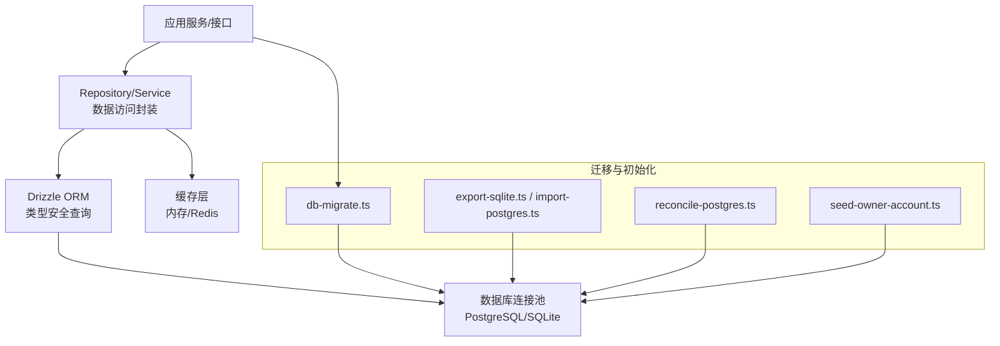
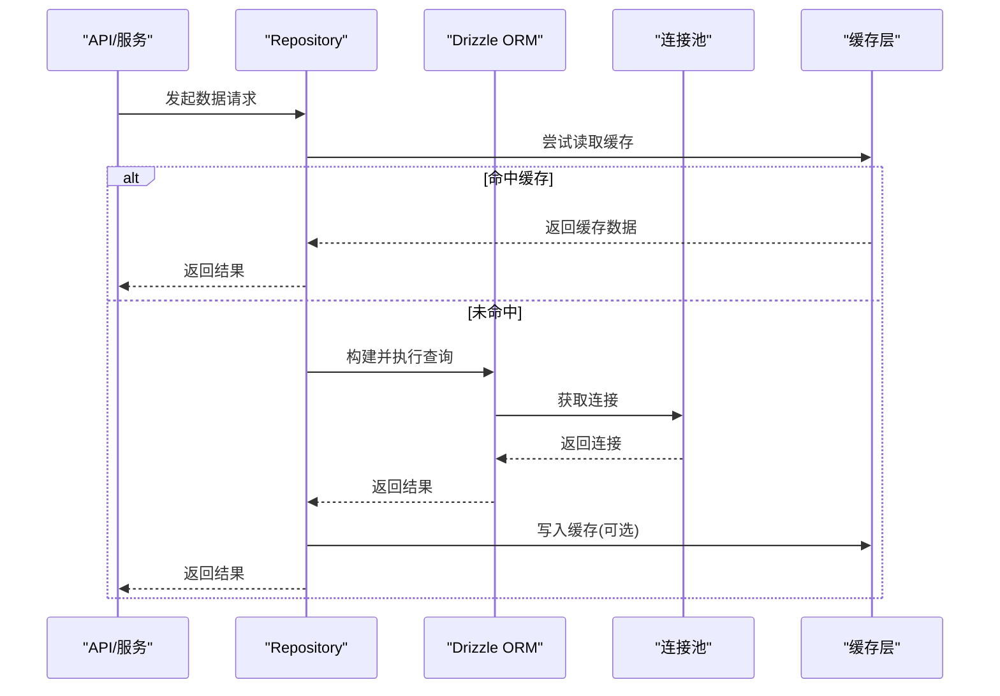
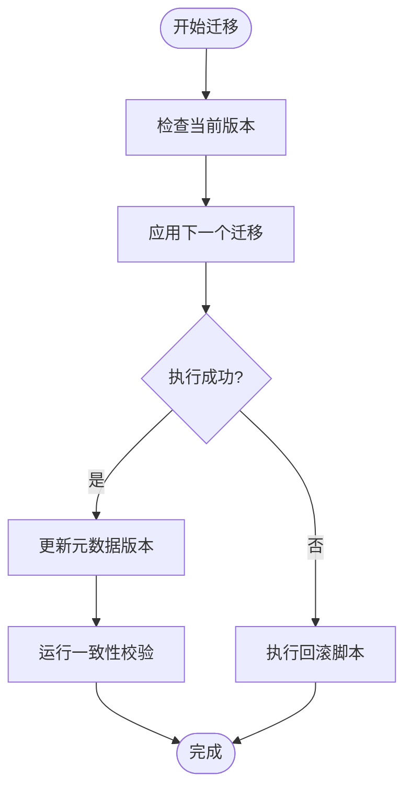
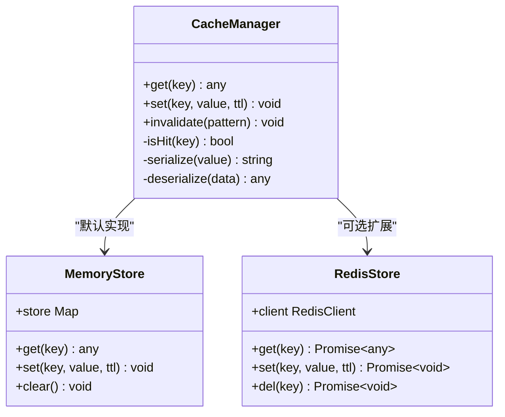
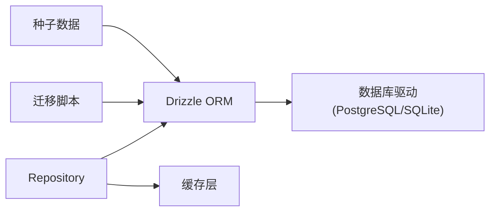

# 数据访问层

<cite>
**本文引用的文件**   
- [drizzle.config.ts](file://drizzle.config.ts)
- [db-migrate.ts](file://scripts/setup/db-migrate.ts)
- [export-sqlite.ts](file://scripts/migration/export-sqlite.ts)
- [import-postgres.ts](file://scripts/migration/import-postgres.ts)
- [reconcile-postgres.ts](file://scripts/migration/reconcile-postgres.ts)
- [seed-owner-account.ts](file://scripts/setup/seed-owner-account.ts)
- [runtime-repository.pg.test.ts](file://src/features/audio/runtime-repository.pg.test.ts)
- [repository.pg.test.ts](file://src/features/render/repository.pg.test.ts)
- [cache.ts](file://src/features/render/cache.ts)
- [persistence.ts](file://src/features/render/persistence.ts)
- [media-route-repository.pg.test.ts](file://src/features/routing/media-route-repository.pg.test.ts)
- [model-route-repository.pg.test.ts](file://src/features/routing/model-route-repository.pg.test.ts)
</cite>

## 目录
1. [简介](#简介)
2. [项目结构](#项目结构)
3. [核心组件](#核心组件)
4. [架构总览](#架构总览)
5. [详细组件分析](#详细组件分析)
6. [依赖关系分析](#依赖关系分析)
7. [性能考量](#性能考量)
8. [故障排查指南](#故障排查指南)
9. [结论](#结论)
10. [附录](#附录)

## 简介
本文件面向PurpleInk的数据访问层，聚焦Drizzle ORM的使用模式与最佳实践，涵盖模型定义、查询构建、事务处理；数据库连接池管理（配置、调优、故障恢复）；数据迁移策略（版本管理、回滚、一致性保证）；缓存策略（内存缓存、Redis集成、失效策略）；以及查询优化技巧与性能监控方法。文档以仓库中的实际实现为依据，辅以可视化图示帮助理解。

## 项目结构
数据访问相关代码主要分布在以下位置：
- Drizzle配置与迁移脚本：根目录的配置文件与scripts下的迁移、初始化脚本
- 功能模块中的数据访问：features下各业务域通过repository或service访问数据
- 渲染与持久化：render特性包含缓存与持久化逻辑
- 路由与媒体：routing特性包含媒体与模型路由的数据访问

图表来源
- [drizzle.config.ts](file://drizzle.config.ts)
- [db-migrate.ts](file://scripts/setup/db-migrate.ts)
- [export-sqlite.ts](file://scripts/migration/export-sqlite.ts)
- [import-postgres.ts](file://scripts/migration/import-postgres.ts)
- [reconcile-postgres.ts](file://scripts/migration/reconcile-postgres.ts)
- [seed-owner-account.ts](file://scripts/setup/seed-owner-account.ts)

章节来源
- [drizzle.config.ts](file://drizzle.config.ts)
- [db-migrate.ts](file://scripts/setup/db-migrate.ts)

## 核心组件
- Drizzle ORM配置与驱动：通过配置文件集中管理数据库连接参数、驱动选择与迁移路径
- Repository模式：在各业务域中封装CRUD与复杂查询，统一事务边界与错误处理
- 迁移工具链：提供迁移执行、数据导出导入、一致性校验与种子数据注入
- 缓存与持久化：在渲染等重I/O场景使用内存缓存与持久化存储，降低数据库压力

章节来源
- [drizzle.config.ts](file://drizzle.config.ts)
- [db-migrate.ts](file://scripts/setup/db-migrate.ts)
- [repository.pg.test.ts](file://src/features/render/repository.pg.test.ts)
- [runtime-repository.pg.test.ts](file://src/features/audio/runtime-repository.pg.test.ts)

## 架构总览
数据访问层采用“Repository + Drizzle ORM”的分层设计：上层服务调用Repository，Repository基于Drizzle进行类型安全的SQL构建与执行；连接池由ORM驱动统一管理；迁移与初始化通过独立脚本完成；缓存层作为可选加速通道。

图表来源
- [cache.ts](file://src/features/render/cache.ts)
- [repository.pg.test.ts](file://src/features/render/repository.pg.test.ts)
- [runtime-repository.pg.test.ts](file://src/features/audio/runtime-repository.pg.test.ts)

## 详细组件分析

### Drizzle ORM使用模式与最佳实践
- 模型定义：通过schema定义表结构与字段类型，确保类型安全与约束一致
- 查询构建：优先使用Drizzle的查询构建器，避免手写SQL；复杂条件使用组合表达式
- 事务处理：在Repository层统一开启事务，保证多步操作的原子性；失败时回滚并抛出明确错误
- 分页与排序：对大数据集使用分页与索引友好的排序键，减少全表扫描
- 批量操作：使用批量插入/更新提升吞吐，注意事务大小与锁竞争

章节来源
- [repository.pg.test.ts](file://src/features/render/repository.pg.test.ts)
- [runtime-repository.pg.test.ts](file://src/features/audio/runtime-repository.pg.test.ts)

### 数据库连接池管理
- 连接配置：通过配置文件指定驱动、主机、端口、用户名、密码、数据库名与SSL选项
- 性能调优：合理设置最大连接数、空闲超时、连接回收策略；在高并发场景下评估连接池上限
- 故障恢复：实现重试与退避策略，捕获连接异常并记录日志；支持优雅关闭与资源释放
- 健康检查：定期检测连接可用性，提前发现潜在问题

章节来源
- [drizzle.config.ts](file://drizzle.config.ts)

### 数据迁移策略
- 版本管理：迁移脚本按版本顺序执行，确保幂等性与可重复性
- 回滚机制：为关键迁移编写反向脚本，支持在失败或回滚时恢复状态
- 数据一致性：迁移过程中使用事务包裹DDL/DML，保证一致性；对大表变更采用增量方式
- 工具链：提供导出/导入与一致性校验脚本，便于跨环境同步与验证

图表来源
- [db-migrate.ts](file://scripts/setup/db-migrate.ts)
- [export-sqlite.ts](file://scripts/migration/export-sqlite.ts)
- [import-postgres.ts](file://scripts/migration/import-postgres.ts)
- [reconcile-postgres.ts](file://scripts/migration/reconcile-postgres.ts)

章节来源
- [db-migrate.ts](file://scripts/setup/db-migrate.ts)
- [export-sqlite.ts](file://scripts/migration/export-sqlite.ts)
- [import-postgres.ts](file://scripts/migration/import-postgres.ts)
- [reconcile-postgres.ts](file://scripts/migration/reconcile-postgres.ts)

### 缓存策略实现
- 内存缓存：在进程内维护热点数据的LRU缓存，减少数据库访问频率
- Redis集成：在多实例部署时使用Redis共享缓存，保证一致性
- 失效策略：基于TTL与事件驱动的失效；对写操作主动清除相关缓存
- 缓存穿透保护：对空结果进行短TTL缓存，防止恶意探测

图表来源
- [cache.ts](file://src/features/render/cache.ts)

章节来源
- [cache.ts](file://src/features/render/cache.ts)

### 持久化与渲染数据访问
- 渲染产物持久化：将渲染中间结果与最终产物落盘，支持断点续传与恢复
- 查询优化：针对渲染任务的状态机与时间线字段建立索引，提升查询效率
- 事务边界：在提交渲染结果时开启事务，确保状态一致

章节来源
- [persistence.ts](file://src/features/render/persistence.ts)
- [repository.pg.test.ts](file://src/features/render/repository.pg.test.ts)

### 路由与媒体数据访问
- 媒体路由：维护媒体文件的映射与访问路径，支持动态生成与缓存
- 模型路由：管理AI模型的路由信息与配置，支持多提供者切换
- 一致性校验：在迁移后校验路由表完整性，防止脏数据

章节来源
- [media-route-repository.pg.test.ts](file://src/features/routing/media-route-repository.pg.test.ts)
- [model-route-repository.pg.test.ts](file://src/features/routing/model-route-repository.pg.test.ts)

## 依赖关系分析
数据访问层依赖Drizzle ORM与数据库驱动，同时与缓存层、迁移脚本紧密耦合。Repository作为抽象层隔离具体实现，便于替换与测试。

图表来源
- [drizzle.config.ts](file://drizzle.config.ts)
- [db-migrate.ts](file://scripts/setup/db-migrate.ts)
- [cache.ts](file://src/features/render/cache.ts)

章节来源
- [drizzle.config.ts](file://drizzle.config.ts)
- [db-migrate.ts](file://scripts/setup/db-migrate.ts)
- [cache.ts](file://src/features/render/cache.ts)

## 性能考量
- 查询优化：使用EXPLAIN分析慢查询，添加合适索引；避免N+1查询，使用JOIN或批量加载
- 连接池调优：根据CPU核数与IO特性调整最大连接数；监控连接等待与超时
- 缓存命中率：监控缓存命中率与TTL设置，平衡一致性与性能
- 批处理与异步：对高吞吐场景使用批处理与异步队列，降低峰值压力
- 监控指标：采集QPS、延迟分布、错误率、连接池使用率等关键指标

[本节为通用指导，不直接分析具体文件]

## 故障排查指南
- 连接失败：检查网络连通性、认证信息、防火墙规则；查看连接池日志
- 迁移失败：核对迁移脚本幂等性；使用回滚脚本恢复；校验数据一致性
- 缓存异常：检查缓存服务状态；清理过期键；验证序列化格式
- 慢查询：定位热点查询；分析执行计划；优化索引与SQL结构

章节来源
- [db-migrate.ts](file://scripts/setup/db-migrate.ts)
- [reconcile-postgres.ts](file://scripts/migration/reconcile-postgres.ts)
- [cache.ts](file://src/features/render/cache.ts)

## 结论
PurpleInk的数据访问层以Drizzle ORM为核心，结合Repository模式与完善的迁移工具链，实现了类型安全、可维护且高性能的数据访问能力。通过合理的连接池配置、缓存策略与查询优化，系统在高并发场景下保持稳定与高效。建议持续监控关键指标，迭代优化迁移与缓存策略，确保数据一致性与性能。

[本节为总结，不直接分析具体文件]

## 附录
- 常用命令：迁移执行、数据导入导出、一致性校验
- 环境变量：数据库连接、缓存配置、日志级别
- 最佳实践清单：模型定义规范、查询构建约定、事务边界划分

[本节为补充信息，不直接分析具体文件]