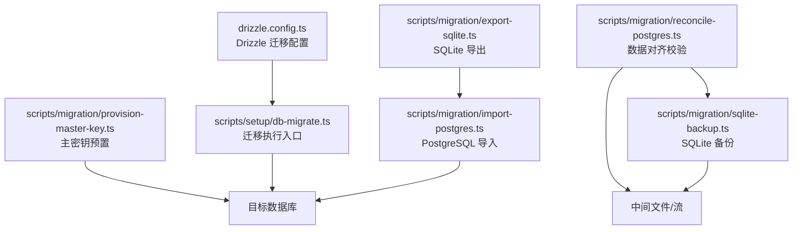
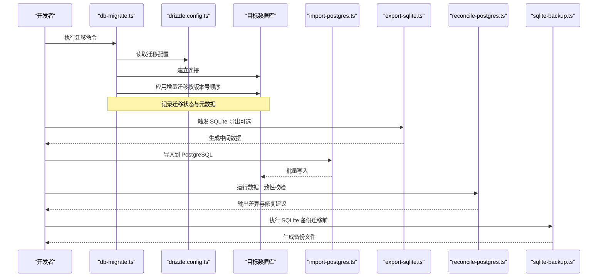
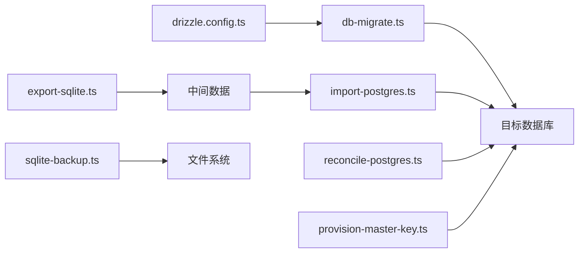

# 数据迁移策略

<cite>
**本文引用的文件**   
- [drizzle.config.ts](file://drizzle.config.ts)
- [db-migrate.ts](file://scripts/setup/db-migrate.ts)
- [export-sqlite.ts](file://scripts/migration/export-sqlite.ts)
- [import-postgres.ts](file://scripts/migration/import-postgres.ts)
- [provision-master-key.ts](file://scripts/migration/provision-master-key.ts)
- [reconcile-postgres.ts](file://scripts/migration/reconcile-postgres.ts)
- [sqlite-backup.ts](file://scripts/migration/sqlite-backup.ts)
</cite>

## 目录
1. [简介](#简介)
2. [项目结构](#项目结构)
3. [核心组件](#核心组件)
4. [架构总览](#架构总览)
5. [详细组件分析](#详细组件分析)
6. [依赖关系分析](#依赖关系分析)
7. [性能考量](#性能考量)
8. [故障排查指南](#故障排查指南)
9. [结论](#结论)
10. [附录](#附录) 

## 简介
本文件面向 PurpleInk 项目的数据迁移策略，围绕版本管理机制、迁移脚本编写规范、回滚策略与数据一致性保障进行系统化说明。结合仓库中的 Drizzle ORM 配置与迁移/导入导出脚本，给出可操作的实践建议与最佳实践示例，帮助团队在演进数据库结构时保持安全、可控与可观测。

## 项目结构
与数据迁移相关的代码主要分布在以下位置：
- 迁移配置：根级 drizzle.config.ts
- 迁移执行入口：scripts/setup/db-migrate.ts
- 数据导入/导出与辅助工具：scripts/migration/*（SQLite 导出、PostgreSQL 导入、主密钥预置、数据对齐校验、SQLite 备份）

图表来源 
- [drizzle.config.ts](file://drizzle.config.ts)
- [db-migrate.ts](file://scripts/setup/db-migrate.ts)
- [export-sqlite.ts](file://scripts/migration/export-sqlite.ts)
- [import-postgres.ts](file://scripts/migration/import-postgres.ts)
- [reconcile-postgres.ts](file://scripts/migration/reconcile-postgres.ts)
- [sqlite-backup.ts](file://scripts/migration/sqlite-backup.ts)
- [provision-master-key.ts](file://scripts/migration/provision-master-key.ts)

章节来源
- [drizzle.config.ts](file://drizzle.config.ts)
- [db-migrate.ts](file://scripts/setup/db-migrate.ts)
- [export-sqlite.ts](file://scripts/migration/export-sqlite.ts)
- [import-postgres.ts](file://scripts/migration/import-postgres.ts)
- [reconcile-postgres.ts](file://scripts/migration/reconcile-postgres.ts)
- [sqlite-backup.ts](file://scripts/migration/sqlite-backup.ts)
- [provision-master-key.ts](file://scripts/migration/provision-master-key.ts)

## 核心组件
- 迁移配置中心（drizzle.config.ts）
  - 定义数据库连接信息、迁移目录、生成器选项等，是迁移执行的“单一事实源”。
- 迁移执行器（db-migrate.ts）
  - 作为迁移的 CLI/程序入口，负责加载配置、建立连接、按序执行迁移并输出结果。
- 数据导入/导出与校验（migration/*）
  - export-sqlite.ts：从 SQLite 导出数据到中间格式或目标库。
  - import-postgres.ts：将数据导入 PostgreSQL，支持批量写入与错误处理。
  - reconcile-postgres.ts：对导入后的数据进行一致性校验与差异修复。
  - sqlite-backup.ts：在执行迁移前对 SQLite 进行快照备份，便于回滚。
  - provision-master-key.ts：为系统提供主密钥（用于加密敏感字段），确保跨环境一致。

章节来源
- [drizzle.config.ts](file://drizzle.config.ts)
- [db-migrate.ts](file://scripts/setup/db-migrate.ts)
- [export-sqlite.ts](file://scripts/migration/export-sqlite.ts)
- [import-postgres.ts](file://scripts/migration/import-postgres.ts)
- [reconcile-postgres.ts](file://scripts/migration/reconcile-postgres.ts)
- [sqlite-backup.ts](file://scripts/migration/sqlite-backup.ts)
- [provision-master-key.ts](file://scripts/migration/provision-master-key.ts)

## 架构总览
下图展示了从配置到迁移执行、再到数据导入/校验的整体流程。

图表来源 
- [db-migrate.ts](file://scripts/setup/db-migrate.ts)
- [drizzle.config.ts](file://drizzle.config.ts)
- [import-postgres.ts](file://scripts/migration/import-postgres.ts)
- [export-sqlite.ts](file://scripts/migration/export-sqlite.ts)
- [reconcile-postgres.ts](file://scripts/migration/reconcile-postgres.ts)
- [sqlite-backup.ts](file://scripts/migration/sqlite-backup.ts)

## 详细组件分析

### 迁移版本管理机制
- 版本号设计
  - 采用递增时间戳或语义化版本号命名迁移文件，保证严格的全局有序性。
  - 每个迁移文件对应一次不可逆的结构变更，避免在同一文件中混合多种不相关变更。
- 依赖关系
  - 通过文件名排序确定执行顺序；若存在跨库/跨模块依赖，应在迁移注释中显式声明，并在执行器中做前置检查。
- 冲突解决
  - 禁止重复版本号；若发生冲突，应创建新的“修复型”迁移，而非修改已应用的迁移。
  - 对并发部署场景，使用幂等性设计与锁机制（如数据库表级锁或分布式锁）避免重复执行。

章节来源
- [drizzle.config.ts](file://drizzle.config.ts)
- [db-migrate.ts](file://scripts/setup/db-migrate.ts)

### 迁移脚本编写规范
- 增量更新
  - 每次仅包含最小必要变更；对大表操作拆分为多步，降低锁持有时间。
- 数据转换
  - 明确输入/输出类型与约束；对历史数据转换增加校验与回退路径。
- 校验逻辑
  - 在每个迁移末尾加入计数/抽样校验，确保行数、唯一性、外键完整性符合预期。
- 幂等性与可重入
  - 使用 IF NOT EXISTS 与条件判断，确保迁移可安全重试。

章节来源
- [db-migrate.ts](file://scripts/setup/db-migrate.ts)
- [import-postgres.ts](file://scripts/migration/import-postgres.ts)
- [export-sqlite.ts](file://scripts/migration/export-sqlite.ts)

### 回滚策略实现
- 自动回滚
  - 当迁移过程中出现异常，执行器应回滚当前事务，恢复至迁移前状态。
- 手动回滚
  - 提供反向迁移脚本，按版本号倒序执行；要求反向脚本具备强幂等性。
- 部分回滚
  - 针对大迁移，分阶段提交；失败时仅回滚最近阶段，减少影响面。
- 备份与快照
  - 在执行关键迁移前，使用 sqlite-backup.ts 生成快照；必要时基于快照快速恢复。

章节来源
- [db-migrate.ts](file://scripts/setup/db-migrate.ts)
- [sqlite-backup.ts](file://scripts/migration/sqlite-backup.ts)

### 数据一致性保证措施
- 事务包裹
  - 所有写操作置于事务内；长事务拆分为短事务，降低死锁风险。
- 校验检查
  - 迁移前后进行关键指标对比（行数、哈希、抽样值），不一致则中止并告警。
- 异常处理
  - 捕获并分类异常（网络、权限、约束冲突），输出结构化日志以便定位。
- 主密钥管理
  - 使用 provision-master-key.ts 统一初始化主密钥，确保加密字段在不同环境一致。

章节来源
- [reconcile-postgres.ts](file://scripts/migration/reconcile-postgres.ts)
- [provision-master-key.ts](file://scripts/migration/provision-master-key.ts)
- [db-migrate.ts](file://scripts/setup/db-migrate.ts)

### 具体迁移场景示例与最佳实践
- 场景一：新增字段与默认值
  - 步骤：添加列 -> 设置默认值 -> 回填历史数据 -> 校验非空约束。
  - 最佳实践：分批更新历史数据，避免长时间锁表。
- 场景二：拆分大表
  - 步骤：创建新表 -> 并行迁移数据 -> 切换读写 -> 删除旧表。
  - 最佳实践：使用双写过渡期，逐步切流，配合校验脚本确认一致性。
- 场景三：跨库迁移（SQLite -> PostgreSQL）
  - 步骤：导出 SQLite -> 转换映射 -> 导入 PostgreSQL -> 一致性校验。
  - 最佳实践：先在小数据集验证映射规则，再全量执行；保留中间文件以便审计。

[本节为概念性说明，不直接分析具体文件]

## 依赖关系分析
迁移子系统的关键依赖如下：
- db-migrate.ts 依赖 drizzle.config.ts 获取连接与迁移目录。
- import-postgres.ts 依赖目标数据库连接与数据映射规则。
- export-sqlite.ts 依赖 SQLite 驱动与导出格式约定。
- reconcile-postgres.ts 依赖数据模型与校验规则。
- sqlite-backup.ts 依赖文件系统与 SQLite 快照能力。
- provision-master-key.ts 依赖环境变量与加密库。

图表来源 
- [drizzle.config.ts](file://drizzle.config.ts)
- [db-migrate.ts](file://scripts/setup/db-migrate.ts)
- [export-sqlite.ts](file://scripts/migration/export-sqlite.ts)
- [import-postgres.ts](file://scripts/migration/import-postgres.ts)
- [reconcile-postgres.ts](file://scripts/migration/reconcile-postgres.ts)
- [sqlite-backup.ts](file://scripts/migration/sqlite-backup.ts)
- [provision-master-key.ts](file://scripts/migration/provision-master-key.ts)

章节来源
- [drizzle.config.ts](file://drizzle.config.ts)
- [db-migrate.ts](file://scripts/setup/db-migrate.ts)
- [export-sqlite.ts](file://scripts/migration/export-sqlite.ts)
- [import-postgres.ts](file://scripts/migration/import-postgres.ts)
- [reconcile-postgres.ts](file://scripts/migration/reconcile-postgres.ts)
- [sqlite-backup.ts](file://scripts/migration/sqlite-backup.ts)
- [provision-master-key.ts](file://scripts/migration/provision-master-key.ts)

## 性能考量
- 批量写入：导入时使用批量插入，减少往返次数。
- 索引策略：迁移期间谨慎重建索引，优先在低峰时段执行。
- 事务粒度：尽量缩短事务，避免长事务导致的锁竞争。
- 资源隔离：导入/导出任务与在线服务分离，避免争用 CPU/IO。
- 监控与限流：对慢查询与高 IO 进行监控，必要时限速保护。

[本节为通用指导，不直接分析具体文件]

## 故障排查指南
- 常见问题
  - 迁移失败：检查连接参数、权限、约束冲突与锁等待。
  - 数据不一致：运行 reconcile-postgres.ts 对比关键指标，定位差异行。
  - 导入缓慢：检查磁盘 IO、网络延迟与批量大小。
- 诊断步骤
  - 查看迁移日志与错误堆栈。
  - 核对版本号与已应用迁移列表。
  - 使用备份文件恢复至稳定点，再逐步复现问题。
- 回滚操作
  - 执行反向迁移脚本，确保幂等与完整覆盖。
  - 若涉及跨库迁移，先回滚导入任务，再恢复备份。

章节来源
- [db-migrate.ts](file://scripts/setup/db-migrate.ts)
- [reconcile-postgres.ts](file://scripts/migration/reconcile-postgres.ts)
- [sqlite-backup.ts](file://scripts/migration/sqlite-backup.ts)

## 结论
通过统一的迁移配置、严格的版本管理与幂等脚本设计，结合导入/导出与一致性校验工具，PurpleInk 的数据迁移体系能够在复杂演进中保持安全与可控。建议在团队内推广增量迁移、分阶段提交与强校验的实践，持续完善回滚与监控能力，以支撑生产环境的稳定迭代。

[本节为总结性内容，不直接分析具体文件]

## 附录
- 术语
  - 迁移：对数据库结构与数据的受控变更。
  - 幂等：多次执行与单次执行结果一致。
  - 一致性校验：比较迁移前后数据状态是否满足业务约束。
- 参考脚本路径
  - 迁移入口：scripts/setup/db-migrate.ts
  - 配置：drizzle.config.ts
  - 导入/导出：scripts/migration/import-postgres.ts、scripts/migration/export-sqlite.ts
  - 校验：scripts/migration/reconcile-postgres.ts
  - 备份：scripts/migration/sqlite-backup.ts
  - 主密钥：scripts/migration/provision-master-key.ts

[本节为补充信息，不直接分析具体文件]