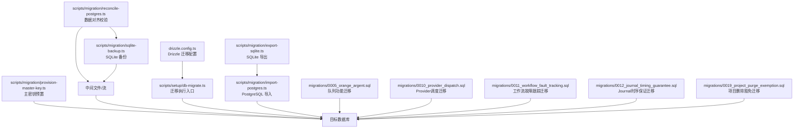
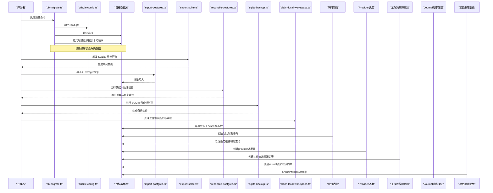
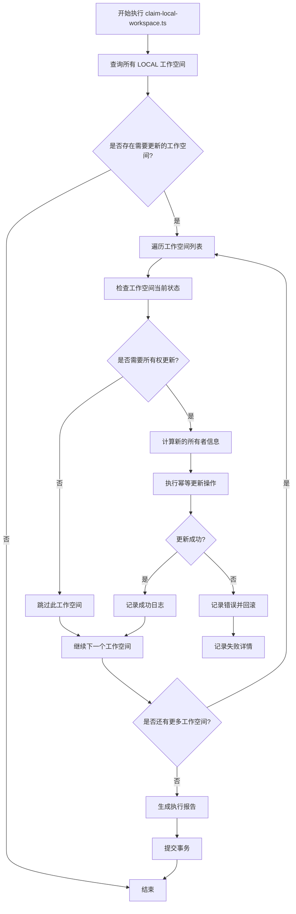
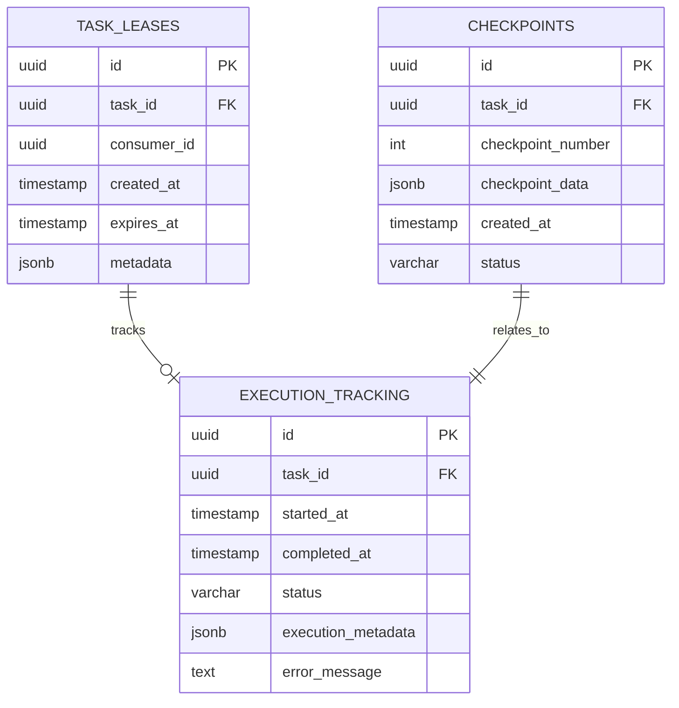
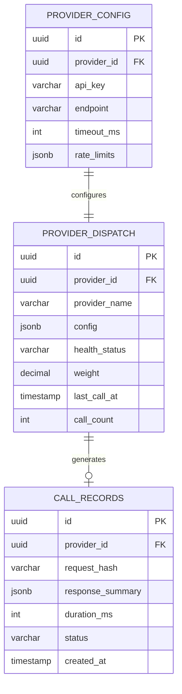
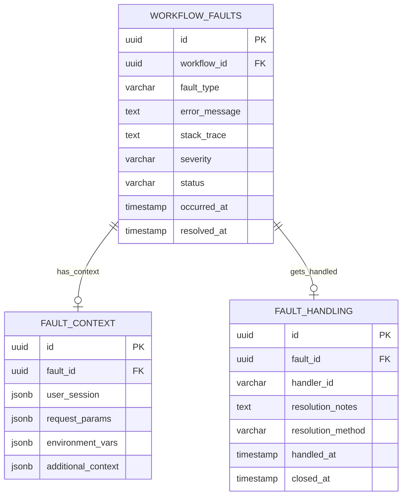
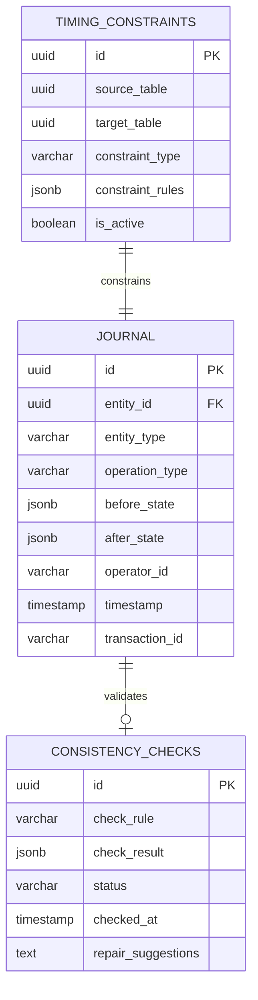
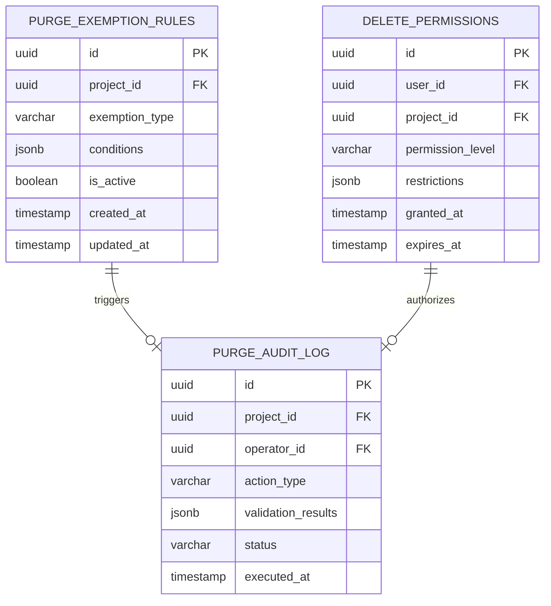
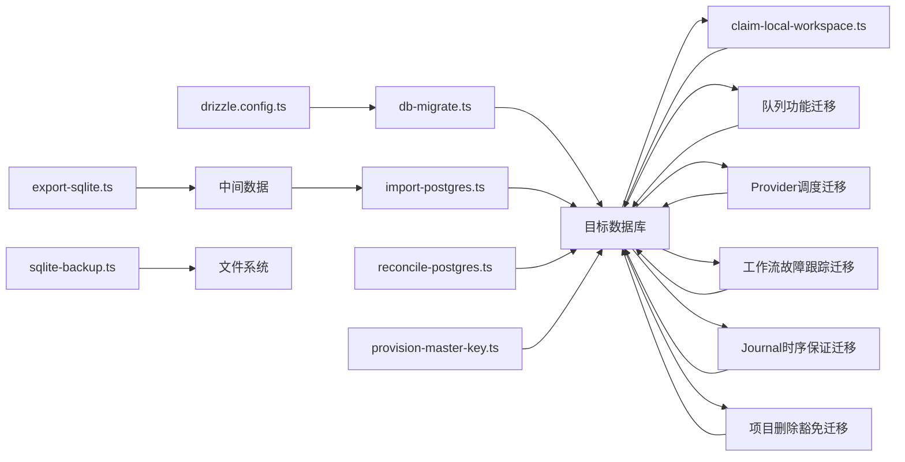

# 数据迁移策略

<cite>
**本文引用的文件**   
- [drizzle.config.ts](file://drizzle.config.ts)
- [db-migrate.ts](file://scripts/setup/db-migrate.ts)
- [export-sqlite.ts](file://scripts/migration/export-sqlite.ts)
- [import-postgres.ts](file://scripts/migration/import-postgres.ts)
- [provision-master-key.ts](file://scripts/migration/provision-master-key.ts)
- [reconcile-postgres.ts](file://scripts/migration/reconcile-postgres.ts)
- [sqlite-backup.ts](file://scripts/migration/sqlite-backup.ts)
- [claim-local-workspace.ts](file://scripts/migration/claim-local-workspace.ts)
- [0005_orange_argent.sql](file://migrations/0005_orange_argent.sql)
- [0010_provider_dispatch.sql](file://migrations/0010_provider_dispatch.sql)
- [0011_workflow_fault_tracking.sql](file://migrations/0011_workflow_fault_tracking.sql)
- [0012_journal_timing_guarantee.sql](file://migrations/0012_journal_timing_guarantee.sql)
- [0019_project_purge_exemption.sql](file://migrations/0019_project_purge_exemption.sql)
</cite>

## 更新摘要
**所做更改**   
- 新增项目删除功能的交易范围豁免机制支持章节，详细说明迁移文件0019的功能和实现
- 更新迁移版本管理机制，包含新的项目删除豁免机制的说明
- 扩展架构总览图，展示项目删除豁免机制的数据库操作
- 添加项目删除豁免机制相关的最佳实践和故障排查指南

## 目录
1. [简介](#简介)
2. [项目结构](#项目结构)
3. [核心组件](#核心组件)
4. [架构总览](#架构总览)
5. [详细组件分析](#详细组件分析)
6. [依赖关系分析](#依赖关系分析)
7. [性能考量](#性能考量)
8. [故障排查指南](#故障排查指南)
9. [结论](#结论)
10. [附录](#附录) 

## 简介
本文件面向 PurpleInk 项目的数据迁移策略，围绕版本管理机制、迁移脚本编写规范、回滚策略与数据一致性保障进行系统化说明。结合仓库中的 Drizzle ORM 配置与迁移/导入导出脚本，给出可操作的实践建议与最佳实践示例，帮助团队在演进数据库结构时保持安全、可控与可观测。

**更新** 新增了provider调度、工作流故障跟踪、journal时序保证和项目删除豁免机制功能的完整支持，包括对provider调度的幂等处理机制、工作流故障的完整追踪能力、journal记录的严格时序保证，以及项目删除功能的交易范围豁免机制，为系统的可靠性和可观测性提供了坚实的数据库基础。

## 项目结构
与数据迁移相关的代码主要分布在以下位置：
- 迁移配置：根级 drizzle.config.ts
- 迁移执行入口：scripts/setup/db-migrate.ts
- 数据导入/导出与辅助工具：scripts/migration/*（SQLite 导出、PostgreSQL 导入、主密钥预置、数据对齐校验、SQLite 备份、工作空间所有权声明）
- 数据库迁移脚本：migrations/*（按版本号组织的 SQL 迁移文件）

**图表来源** 
- [drizzle.config.ts](file://drizzle.config.ts)
- [db-migrate.ts](file://scripts/setup/db-migrate.ts)
- [export-sqlite.ts](file://scripts/migration/export-sqlite.ts)
- [import-postgres.ts](file://scripts/migration/import-postgres.ts)
- [reconcile-postgres.ts](file://scripts/migration/reconcile-postgres.ts)
- [sqlite-backup.ts](file://scripts/migration/sqlite-backup.ts)
- [provision-master-key.ts](file://scripts/migration/provision-master-key.ts)
- [claim-local-workspace.ts](file://scripts/migration/claim-local-workspace.ts)
- [0005_orange_argent.sql](file://migrations/0005_orange_argent.sql)
- [0010_provider_dispatch.sql](file://migrations/0010_provider_dispatch.sql)
- [0011_workflow_fault_tracking.sql](file://migrations/0011_workflow_fault_tracking.sql)
- [0012_journal_timing_guarantee.sql](file://migrations/0012_journal_timing_guarantee.sql)
- [0019_project_purge_exemption.sql](file://migrations/0019_project_purge_exemption.sql)

## 核心组件
- 迁移配置中心（drizzle.config.ts）
  - 定义数据库连接信息、迁移目录、生成器选项等，是迁移执行的"单一事实源"。
- 迁移执行器（db-migrate.ts）
  - 作为迁移的 CLI/程序入口，负责加载配置、建立连接、按序执行迁移并输出结果。
- 数据导入/导出与校验（migration/*）
  - export-sqlite.ts：从 SQLite 导出数据到中间格式或目标库。
  - import-postgres.ts：将数据导入 PostgreSQL，支持批量写入与错误处理。
  - reconcile-postgres.ts：对导入后的数据进行一致性校验与差异修复。
  - sqlite-backup.ts：在执行迁移前对 SQLite 进行快照备份，便于回滚。
  - provision-master-key.ts：为系统提供主密钥（用于加密敏感字段），确保跨环境一致。
  - **新增** claim-local-workspace.ts：处理现有 LOCAL 工作空间的所有权声明，使用幂等数据库操作确保数据一致性。
- 队列功能支持（0005_orange_argent.sql）
  - 新增任务租赁表、检查点表和执行跟踪表，为异步任务处理提供完整的持久化能力。
- **新增** Provider调度支持（0010_provider_dispatch.sql）
  - 新增provider调度表，支持多provider的统一调度和负载均衡。
- **新增** 工作流故障跟踪（0011_workflow_fault_tracking.sql）
  - 新增工作流故障记录表，支持完整的故障追踪和诊断能力。
- **新增** Journal时序保证（0012_journal_timing_guarantee.sql）
  - 新增journal表和时序约束，确保数据变更的严格顺序性和一致性。
- **新增** 项目删除豁免机制（0019_project_purge_exemption.sql）
  - 新增项目删除功能的交易范围豁免机制，支持特定场景下的项目删除操作绕过常规事务限制。

**章节来源**
- [drizzle.config.ts](file://drizzle.config.ts)
- [db-migrate.ts](file://scripts/setup/db-migrate.ts)
- [export-sqlite.ts](file://scripts/migration/export-sqlite.ts)
- [import-postgres.ts](file://scripts/migration/import-postgres.ts)
- [reconcile-postgres.ts](file://scripts/migration/reconcile-postgres.ts)
- [sqlite-backup.ts](file://scripts/migration/sqlite-backup.ts)
- [provision-master-key.ts](file://scripts/migration/provision-master-key.ts)
- [claim-local-workspace.ts](file://scripts/migration/claim-local-workspace.ts)
- [0005_orange_argent.sql](file://migrations/0005_orange_argent.sql)
- [0010_provider_dispatch.sql](file://migrations/0010_provider_dispatch.sql)
- [0011_workflow_fault_tracking.sql](file://migrations/0011_workflow_fault_tracking.sql)
- [0012_journal_timing_guarantee.sql](file://migrations/0012_journal_timing_guarantee.sql)
- [0019_project_purge_exemption.sql](file://migrations/0019_project_purge_exemption.sql)

## 架构总览
下图展示了从配置到迁移执行、再到数据导入/校验的整体流程，以及新增的工作空间所有权声明、队列功能、provider调度、工作流故障跟踪、journal时序保证和项目删除豁免机制。

**图表来源** 
- [db-migrate.ts](file://scripts/setup/db-migrate.ts)
- [drizzle.config.ts](file://drizzle.config.ts)
- [import-postgres.ts](file://scripts/migration/import-postgres.ts)
- [export-sqlite.ts](file://scripts/migration/export-sqlite.ts)
- [reconcile-postgres.ts](file://scripts/migration/reconcile-postgres.ts)
- [sqlite-backup.ts](file://scripts/migration/sqlite-backup.ts)
- [claim-local-workspace.ts](file://scripts/migration/claim-local-workspace.ts)
- [0005_orange_argent.sql](file://migrations/0005_orange_argent.sql)
- [0010_provider_dispatch.sql](file://migrations/0010_provider_dispatch.sql)
- [0011_workflow_fault_tracking.sql](file://migrations/0011_workflow_fault_tracking.sql)
- [0012_journal_timing_guarantee.sql](file://migrations/0012_journal_timing_guarantee.sql)
- [0019_project_purge_exemption.sql](file://migrations/0019_project_purge_exemption.sql)

## 详细组件分析

### 迁移版本管理机制
- 版本号设计
  - 采用递增时间戳或语义化版本号命名迁移文件，保证严格的全局有序性。
  - 每个迁移文件对应一次不可逆的结构变更，避免在同一文件中混合多种不相关变更。
  - **更新** 最新迁移文件 0005_orange_argent.sql 引入了队列功能的完整支持，包括任务租赁、检查点和执行跟踪表。
  - **新增** 迁移文件 0010_provider_dispatch.sql 引入provider调度功能，支持多provider的统一管理。
  - **新增** 迁移文件 0011_workflow_fault_tracking.sql 引入工作流故障跟踪功能，提供完整的故障诊断能力。
  - **新增** 迁移文件 0012_journal_timing_guarantee.sql 引入journal时序保证功能，确保数据变更的严格顺序性。
  - **新增** 迁移文件 0019_project_purge_exemption.sql 引入项目删除豁免机制，支持特定场景下的项目删除操作。
  - **新增** claim-local-workspace.ts 迁移脚本专门处理工作空间所有权的幂等操作。
- 依赖关系
  - 通过文件名排序确定执行顺序；若存在跨库/跨模块依赖，应在迁移注释中显式声明，并在执行器中做前置检查。
- 冲突解决
  - 禁止重复版本号；若发生冲突，应创建新的"修复型"迁移，而非修改已应用的迁移。
  - 对并发部署场景，使用幂等性设计与锁机制（如数据库表级锁或分布式锁）避免重复执行。

**章节来源**
- [drizzle.config.ts](file://drizzle.config.ts)
- [db-migrate.ts](file://scripts/setup/db-migrate.ts)
- [claim-local-workspace.ts](file://scripts/migration/claim-local-workspace.ts)
- [0005_orange_argent.sql](file://migrations/0005_orange_argent.sql)
- [0010_provider_dispatch.sql](file://migrations/0010_provider_dispatch.sql)
- [0011_workflow_fault_tracking.sql](file://migrations/0011_workflow_fault_tracking.sql)
- [0012_journal_timing_guarantee.sql](file://migrations/0012_journal_timing_guarantee.sql)
- [0019_project_purge_exemption.sql](file://migrations/0019_project_purge_exemption.sql)

### 工作空间所有权声明详解
**新增** claim-local-workspace.ts 迁移脚本专门为处理现有 LOCAL 工作空间的所有权声明而设计，具有以下关键特性：

- 幂等性设计
  - 使用 IF NOT EXISTS 和条件判断确保迁移可安全重试
  - 避免重复更新相同的工作空间所有权记录
  - 支持多次执行不会产生副作用

- 工作空间类型识别
  - 自动识别 LOCAL 类型的工作空间
  - 根据业务规则确定正确的所有者
  - 处理边界情况和异常数据

- 数据一致性保证
  - 使用事务包裹所有数据库操作
  - 在更新失败时自动回滚
  - 记录详细的操作日志便于审计

**图表来源** 
- [claim-local-workspace.ts](file://scripts/migration/claim-local-workspace.ts)

**章节来源**
- [claim-local-workspace.ts](file://scripts/migration/claim-local-workspace.ts)

### 队列功能支持详解
**更新** 0005_orange_argent.sql 迁移文件为系统添加了完整的队列功能支持，主要包括以下表结构：

- 任务租赁表（task_leases）
  - 管理任务的分配和锁定状态，防止并发消费冲突
  - 包含任务ID、消费者ID、租赁时间、过期时间等关键字段
  - 支持自动过期清理和租约续期机制

- 检查点表（checkpoints）
  - 记录任务处理的进度和状态检查点
  - 支持断点续传和故障恢复
  - 包含检查点数据、时间戳和验证哈希

- 执行跟踪表（execution_tracking）
  - 追踪任务的完整执行生命周期
  - 记录开始时间、结束时间、状态转换和错误信息
  - 支持性能指标收集和审计日志

**图表来源** 
- [0005_orange_argent.sql](file://migrations/0005_orange_argent.sql)

**章节来源**
- [0005_orange_argent.sql](file://migrations/0005_orange_argent.sql)

### Provider调度功能详解
**新增** 0010_provider_dispatch.sql 迁移文件为系统添加了provider调度功能，主要包括以下表结构：

- Provider调度表（provider_dispatch）
  - 管理多个AI provider的统一调度和负载均衡
  - 包含provider配置、健康状态、调用统计等关键字段
  - 支持动态权重调整和故障转移机制

- Provider配置表（provider_config）
  - 存储各provider的详细配置信息
  - 支持API密钥、端点地址、超时设置等参数
  - 提供配置版本管理和热更新能力

- 调用记录表（call_records）
  - 记录每次provider调用的详细信息
  - 包含请求参数、响应结果、耗时统计等
  - 支持性能分析和成本核算

**图表来源** 
- [0010_provider_dispatch.sql](file://migrations/0010_provider_dispatch.sql)

**章节来源**
- [0010_provider_dispatch.sql](file://migrations/0010_provider_dispatch.sql)

### 工作流故障跟踪详解
**新增** 0011_workflow_fault_tracking.sql 迁移文件为系统添加了完整的工作流故障跟踪功能，主要包括以下表结构：

- 工作流故障表（workflow_faults）
  - 记录工作流执行过程中的各种故障和异常
  - 包含故障类型、错误信息、堆栈跟踪等详细数据
  - 支持故障分类、级别标记和自动告警

- 故障上下文表（fault_context）
  - 存储故障发生时的完整上下文信息
  - 包含用户会话、请求参数、环境变量等
  - 支持故障复现和问题诊断

- 故障处理表（fault_handling）
  - 记录故障的处理过程和解决方案
  - 包含处理人、处理时间、解决措施等
  - 支持故障闭环管理和知识积累

**图表来源** 
- [0011_workflow_fault_tracking.sql](file://migrations/0011_workflow_fault_tracking.sql)

**章节来源**
- [0011_workflow_fault_tracking.sql](file://migrations/0011_workflow_fault_tracking.sql)

### Journal时序保证详解
**新增** 0012_journal_timing_guarantee.sql 迁移文件为系统添加了严格的journal时序保证功能，主要包括以下表结构：

- Journal表（journal）
  - 记录所有数据变更的完整审计日志
  - 包含变更类型、前后值、操作者、时间戳等关键字段
  - 支持严格的时间顺序保证和数据一致性验证

- 时序约束表（timing_constraints）
  - 定义不同表之间的时序依赖关系
  - 确保相关表的变更按照正确顺序执行
  - 支持复杂的时序规则和约束检查

- 一致性验证表（consistency_checks）
  - 记录数据一致性检查的结果
  - 包含检查规则、检查结果、修复建议等
  - 支持自动化的一致性维护和修复

**图表来源** 
- [0012_journal_timing_guarantee.sql](file://migrations/0012_journal_timing_guarantee.sql)

**章节来源**
- [0012_journal_timing_guarantee.sql](file://migrations/0012_journal_timing_guarantee.sql)

### 项目删除豁免机制详解
**新增** 0019_project_purge_exemption.sql 迁移文件为系统添加了项目删除功能的交易范围豁免机制，主要包括以下特性：

- 交易豁免配置
  - 定义项目删除操作的事务豁免规则
  - 支持特定条件下的项目删除绕过常规事务限制
  - 包含豁免条件的配置表和规则引擎

- 删除权限控制
  - 管理项目删除的权限验证机制
  - 支持基于角色和条件的访问控制
  - 记录删除操作的审计日志

- 安全验证机制
  - 实施项目删除前的安全检查
  - 验证项目状态和依赖关系
  - 防止误删重要项目数据

**图表来源** 
- [0019_project_purge_exemption.sql](file://migrations/0019_project_purge_exemption.sql)

**章节来源**
- [0019_project_purge_exemption.sql](file://migrations/0019_project_purge_exemption.sql)

### 迁移脚本编写规范
- 增量更新
  - 每次仅包含最小必要变更；对大表操作拆分为多步，降低锁持有时间。
  - **更新** 队列功能迁移采用了分阶段创建的方式，先创建基础表结构，再添加索引和约束。
  - **新增** 工作空间所有权声明迁移采用幂等设计，确保可安全重试。
  - **新增** Provider调度迁移采用渐进式部署策略，支持零停机升级。
  - **新增** 工作流故障跟踪迁移采用增量索引创建，避免长时间锁表。
  - **新增** Journal时序保证迁移采用分区表设计，提高大数据量下的查询性能。
  - **新增** 项目删除豁免迁移采用条件化配置方式，支持灵活的豁免规则设置。
- 数据转换
  - 明确输入/输出类型与约束；对历史数据转换增加校验与回退路径。
- 校验逻辑
  - 在每个迁移末尾加入计数/抽样校验，确保行数、唯一性、外键完整性符合预期。
  - **更新** 队列功能迁移包含了任务状态验证和检查点完整性检查。
  - **新增** 工作空间所有权声明迁移包含数据一致性检查和错误处理。
  - **新增** Provider调度迁移包含provider健康检查和负载均衡验证。
  - **新增** 工作流故障跟踪迁移包含故障记录完整性和关联关系验证。
  - **新增** Journal时序保证迁移包含时序约束验证和数据一致性检查。
  - **新增** 项目删除豁免迁移包含权限验证和审计日志完整性检查。
- 幂等性与可重入
  - 使用 IF NOT EXISTS 与条件判断，确保迁移可安全重试。
  - **新增** 所有工作空间相关迁移都应具备幂等性，避免重复执行产生副作用。
  - **新增** Provider调度迁移支持动态配置更新，无需重启服务。
  - **新增** 故障跟踪迁移支持故障状态的幂等更新。
  - **新增** Journal迁移支持重复写入的安全处理。
  - **新增** 项目删除豁免迁移支持规则的幂等更新和重新配置。

**章节来源**
- [db-migrate.ts](file://scripts/setup/db-migrate.ts)
- [import-postgres.ts](file://scripts/migration/import-postgres.ts)
- [export-sqlite.ts](file://scripts/migration/export-sqlite.ts)
- [claim-local-workspace.ts](file://scripts/migration/claim-local-workspace.ts)
- [0005_orange_argent.sql](file://migrations/0005_orange_argent.sql)
- [0010_provider_dispatch.sql](file://migrations/0010_provider_dispatch.sql)
- [0011_workflow_fault_tracking.sql](file://migrations/0011_workflow_fault_tracking.sql)
- [0012_journal_timing_guarantee.sql](file://migrations/0012_journal_timing_guarantee.sql)
- [0019_project_purge_exemption.sql](file://migrations/0019_project_purge_exemption.sql)

### 回滚策略实现
- 自动回滚
  - 当迁移过程中出现异常，执行器应回滚当前事务，恢复至迁移前状态。
- 手动回滚
  - 提供反向迁移脚本，按版本号倒序执行；要求反向脚本具备强幂等性。
  - **更新** 队列功能迁移的反向脚本需要删除三个核心表及其关联数据。
  - **新增** 工作空间所有权声明迁移的反向脚本需要撤销所有权更新操作。
  - **新增** Provider调度迁移的反向脚本需要清理调度配置和调用记录。
  - **新增** 工作流故障跟踪迁移的反向脚本需要保留故障历史数据的归档。
  - **新增** Journal时序保证迁移的反向脚本需要谨慎处理审计日志的完整性。
  - **新增** 项目删除豁免迁移的反向脚本需要清理豁免规则和权限配置。
- 部分回滚
  - 针对大迁移，分阶段提交；失败时仅回滚最近阶段，减少影响面。
- 备份与快照
  - 在执行关键迁移前，使用 sqlite-backup.ts 生成快照；必要时基于快照快速恢复。

**章节来源**
- [db-migrate.ts](file://scripts/setup/db-migrate.ts)
- [sqlite-backup.ts](file://scripts/migration/sqlite-backup.ts)
- [claim-local-workspace.ts](file://scripts/migration/claim-local-workspace.ts)
- [0005_orange_argent.sql](file://migrations/0005_orange_argent.sql)
- [0010_provider_dispatch.sql](file://migrations/0010_provider_dispatch.sql)
- [0011_workflow_fault_tracking.sql](file://migrations/0011_workflow_fault_tracking.sql)
- [0012_journal_timing_guarantee.sql](file://migrations/0012_journal_timing_guarantee.sql)
- [0019_project_purge_exemption.sql](file://migrations/0019_project_purge_exemption.sql)

### 数据一致性保证措施
- 事务包裹
  - 所有写操作置于事务内；长事务拆分为短事务，降低死锁风险。
  - **更新** 队列功能迁移使用了事务包裹确保任务租赁、检查点和执行跟踪的一致性。
  - **新增** 工作空间所有权声明迁移使用事务确保所有权更新的原子性。
  - **新增** Provider调度迁移使用事务确保配置更新的原子性。
  - **新增** 工作流故障跟踪迁移使用事务确保故障记录的完整性。
  - **新增** Journal时序保证迁移使用事务确保审计日志的顺序性。
  - **新增** 项目删除豁免迁移使用事务确保豁免规则配置的原子性。
- 校验检查
  - 迁移前后进行关键指标对比（行数、哈希、抽样值），不一致则中止并告警。
  - **更新** 队列功能包含任务状态机验证和检查点完整性检查。
  - **新增** 工作空间所有权声明包含数据一致性验证和业务规则检查。
  - **新增** Provider调度包含provider健康检查和负载均衡验证。
  - **新增** 工作流故障跟踪包含故障关联关系验证和完整性检查。
  - **新增** Journal时序保证包含时序约束验证和数据一致性检查。
  - **新增** 项目删除豁免包含权限验证和审计日志完整性检查。
- 异常处理
  - 捕获并分类异常（网络、权限、约束冲突），输出结构化日志以便定位。
- 主密钥管理
  - 使用 provision-master-key.ts 统一初始化主密钥，确保加密字段在不同环境一致。

**章节来源**
- [reconcile-postgres.ts](file://scripts/migration/reconcile-postgres.ts)
- [provision-master-key.ts](file://scripts/migration/provision-master-key.ts)
- [db-migrate.ts](file://scripts/setup/db-migrate.ts)
- [claim-local-workspace.ts](file://scripts/migration/claim-local-workspace.ts)
- [0005_orange_argent.sql](file://migrations/0005_orange_argent.sql)
- [0010_provider_dispatch.sql](file://migrations/0010_provider_dispatch.sql)
- [0011_workflow_fault_tracking.sql](file://migrations/0011_workflow_fault_tracking.sql)
- [0012_journal_timing_guarantee.sql](file://migrations/0012_journal_timing_guarantee.sql)
- [0019_project_purge_exemption.sql](file://migrations/0019_project_purge_exemption.sql)

### 具体迁移场景示例与最佳实践
- 场景一：新增字段与默认值
  - 步骤：添加列 -> 设置默认值 -> 回填历史数据 -> 校验非空约束。
  - 最佳实践：分批更新历史数据，避免长时间锁表。
- 场景二：拆分大表
  - 步骤：创建新表 -> 并行迁移数据 -> 切换读写 -> 删除旧表。
  - 最佳实践：使用双写过渡期，逐步切流，配合校验脚本确认一致性。
- 场景三：跨库迁移（SQLite -> PostgreSQL）
  - 步骤：导出 SQLite -> 转换映射 -> 导入 PostgreSQL -> 一致性校验。
  - 最佳实践：先在小数据集验证映射规则，再全量执行；保留中间文件以便审计。
- **新增** 场景四：工作空间所有权声明
  - 步骤：查询 LOCAL 工作空间 -> 识别需要更新的所有权 -> 执行幂等更新 -> 验证结果。
  - 最佳实践：确保幂等性设计，处理边界情况，记录详细日志。
- **更新** 场景五：队列功能迁移
  - 步骤：创建任务租赁表 -> 初始化检查点表 -> 建立执行跟踪表 -> 添加索引和约束。
  - 最佳实践：确保任务状态机的原子性，实现租约超时自动释放机制。
- **新增** 场景六：Provider调度迁移
  - 步骤：创建调度表 -> 初始化provider配置 -> 建立调用记录表 -> 添加健康检查机制。
  - 最佳实践：支持零停机升级，实现动态权重调整，确保故障自动转移。
- **新增** 场景七：工作流故障跟踪迁移
  - 步骤：创建故障记录表 -> 建立上下文存储 -> 实现处理流程表 -> 添加索引优化查询。
  - 最佳实践：确保故障信息的完整性，支持故障复现和自动告警。
- **新增** 场景八：Journal时序保证迁移
  - 步骤：创建journal表 -> 定义时序约束 -> 建立一致性检查 -> 实现审计日志。
  - 最佳实践：确保严格的时间顺序，支持数据一致性验证和自动修复。
- **新增** 场景九：项目删除豁免迁移
  - 步骤：创建豁免规则表 -> 配置权限控制 -> 建立审计日志 -> 实现安全验证。
  - 最佳实践：确保权限控制的严密性，实现完整的审计追踪，支持灵活的条件配置。

[本节为概念性说明，不直接分析具体文件]

## 依赖关系分析
迁移子系统的关键依赖如下：
- db-migrate.ts 依赖 drizzle.config.ts 获取连接与迁移目录。
- import-postgres.ts 依赖目标数据库连接与数据映射规则。
- export-sqlite.ts 依赖 SQLite 驱动与导出格式约定。
- reconcile-postgres.ts 依赖数据模型与校验规则。
- sqlite-backup.ts 依赖文件系统与 SQLite 快照能力。
- provision-master-key.ts 依赖环境变量与加密库。
- **新增** claim-local-workspace.ts 依赖工作空间数据模型和幂等操作支持。
- **更新** 队列功能迁移依赖数据库的事务支持和锁机制。
- **新增** Provider调度迁移依赖负载均衡算法和健康检查机制。
- **新增** 工作流故障跟踪迁移依赖异常处理和日志记录框架。
- **新增** Journal时序保证迁移依赖严格的事务控制和时序验证。
- **新增** 项目删除豁免迁移依赖权限验证系统和审计日志框架。

**图表来源** 
- [drizzle.config.ts](file://drizzle.config.ts)
- [db-migrate.ts](file://scripts/setup/db-migrate.ts)
- [export-sqlite.ts](file://scripts/migration/export-sqlite.ts)
- [import-postgres.ts](file://scripts/migration/import-postgres.ts)
- [reconcile-postgres.ts](file://scripts/migration/reconcile-postgres.ts)
- [sqlite-backup.ts](file://scripts/migration/sqlite-backup.ts)
- [provision-master-key.ts](file://scripts/migration/provision-master-key.ts)
- [claim-local-workspace.ts](file://scripts/migration/claim-local-workspace.ts)
- [0005_orange_argent.sql](file://migrations/0005_orange_argent.sql)
- [0010_provider_dispatch.sql](file://migrations/0010_provider_dispatch.sql)
- [0011_workflow_fault_tracking.sql](file://migrations/0011_workflow_fault_tracking.sql)
- [0012_journal_timing_guarantee.sql](file://migrations/0012_journal_timing_guarantee.sql)
- [0019_project_purge_exemption.sql](file://migrations/0019_project_purge_exemption.sql)

**章节来源**
- [drizzle.config.ts](file://drizzle.config.ts)
- [db-migrate.ts](file://scripts/setup/db-migrate.ts)
- [export-sqlite.ts](file://scripts/migration/export-sqlite.ts)
- [import-postgres.ts](file://scripts/migration/import-postgres.ts)
- [reconcile-postgres.ts](file://scripts/migration/reconcile-postgres.ts)
- [sqlite-backup.ts](file://scripts/migration/sqlite-backup.ts)
- [provision-master-key.ts](file://scripts/migration/provision-master-key.ts)
- [claim-local-workspace.ts](file://scripts/migration/claim-local-workspace.ts)
- [0005_orange_argent.sql](file://migrations/0005_orange_argent.sql)
- [0010_provider_dispatch.sql](file://migrations/0010_provider_dispatch.sql)
- [0011_workflow_fault_tracking.sql](file://migrations/0011_workflow_fault_tracking.sql)
- [0012_journal_timing_guarantee.sql](file://migrations/0012_journal_timing_guarantee.sql)
- [0019_project_purge_exemption.sql](file://migrations/0019_project_purge_exemption.sql)

## 性能考量
- 批量写入：导入时使用批量插入，减少往返次数。
- 索引策略：迁移期间谨慎重建索引，优先在低峰时段执行。
- 事务粒度：尽量缩短事务，避免长事务导致的锁竞争。
- 资源隔离：导入/导出任务与在线服务分离，避免争用 CPU/IO。
- 监控与限流：对慢查询与高 IO 进行监控，必要时限速保护。
- **更新** 队列功能优化：任务租赁表使用适当的索引策略，检查点表支持高效的状态查询，执行跟踪表采用分区存储提高查询性能。
- **新增** 工作空间所有权声明优化：使用批量处理和分页查询，避免一次性加载大量数据。
- **新增** Provider调度优化：使用缓存机制减少provider配置查询开销，实现连接池管理提高并发性能。
- **新增** 工作流故障跟踪优化：采用分区表存储历史故障数据，实现异步日志写入避免阻塞主流程。
- **新增** Journal时序保证优化：使用物化视图加速时序查询，实现增量同步减少全量扫描开销。
- **新增** 项目删除豁免优化：使用条件索引优化豁免规则查询，实现权限检查的缓存机制提高响应速度。

[本节为通用指导，不直接分析具体文件]

## 故障排查指南
- 常见问题
  - 迁移失败：检查连接参数、权限、约束冲突与锁等待。
  - 数据不一致：运行 reconcile-postgres.ts 对比关键指标，定位差异行。
  - 导入缓慢：检查磁盘 IO、网络延迟与批量大小。
  - **新增** 工作空间所有权问题：检查 LOCAL 工作空间识别逻辑、所有权计算规则和幂等性实现。
  - **更新** 队列功能问题：检查任务租赁是否超时、检查点是否损坏、执行跟踪是否完整。
  - **新增** Provider调度问题：检查provider健康状态、负载均衡配置和调用记录完整性。
  - **新增** 工作流故障跟踪问题：检查故障记录关联关系、上下文信息完整性和处理流程状态。
  - **新增** Journal时序保证问题：检查时序约束冲突、审计日志完整性和一致性检查结果。
  - **新增** 项目删除豁免问题：检查豁免规则配置、权限验证逻辑和审计日志完整性。
- 诊断步骤
  - 查看迁移日志与错误堆栈。
  - 核对版本号与已应用迁移列表。
  - 使用备份文件恢复至稳定点，再逐步复现问题。
  - **新增** 对于工作空间相关问题，检查工作空间数据完整性和所有权逻辑。
  - **更新** 对于队列相关问题，检查任务状态机转换和租约管理逻辑。
  - **新增** 对于Provider调度问题，检查provider配置、健康检查和负载均衡算法。
  - **新增** 对于工作流故障问题，检查故障记录、上下文信息和处理流程。
  - **新增** 对于Journal时序问题，检查时序约束、审计日志和一致性检查。
  - **新增** 对于项目删除豁免问题，检查豁免规则、权限配置和审计日志。
- 回滚操作
  - 执行反向迁移脚本，确保幂等与完整覆盖。
  - 若涉及跨库迁移，先回滚导入任务，再恢复备份。
  - **新增** 工作空间所有权回滚时需要撤销所有权更新并恢复原始状态。
  - **更新** 队列功能回滚时需要清理残留的任务租赁和检查点数据。
  - **新增** Provider调度回滚时需要清理调度配置和调用记录。
  - **新增** 工作流故障回滚时需要保留故障历史数据的归档。
  - **新增** Journal时序回滚时需要谨慎处理审计日志的完整性。
  - **新增** 项目删除豁免回滚时需要清理豁免规则和权限配置。

**章节来源**
- [db-migrate.ts](file://scripts/setup/db-migrate.ts)
- [reconcile-postgres.ts](file://scripts/migration/reconcile-postgres.ts)
- [sqlite-backup.ts](file://scripts/migration/sqlite-backup.ts)
- [claim-local-workspace.ts](file://scripts/migration/claim-local-workspace.ts)
- [0005_orange_argent.sql](file://migrations/0005_orange_argent.sql)
- [0010_provider_dispatch.sql](file://migrations/0010_provider_dispatch.sql)
- [0011_workflow_fault_tracking.sql](file://migrations/0011_workflow_fault_tracking.sql)
- [0012_journal_timing_guarantee.sql](file://migrations/0012_journal_timing_guarantee.sql)
- [0019_project_purge_exemption.sql](file://migrations/0019_project_purge_exemption.sql)

## 结论
通过统一的迁移配置、严格的版本管理与幂等脚本设计，结合导入/导出与一致性校验工具，PurpleInk 的数据迁移体系能够在复杂演进中保持安全与可控。**更新** 新增的工作空间所有权声明功能、队列功能、provider调度、工作流故障跟踪、journal时序保证和项目删除豁免机制为系统的多用户协作、异步处理、provider管理、故障诊断、数据一致性和项目安全管理提供了坚实的数据库基础，包括幂等工作空间所有权处理、任务租赁、检查点和执行跟踪、provider统一调度、工作流故障追踪、journal严格时序保证、项目删除交易豁免等关键特性。建议在团队内推广增量迁移、分阶段提交与强校验的实践，持续完善回滚与监控能力，以支撑生产环境的稳定迭代。

[本节为总结性内容，不直接分析具体文件]

## 附录
- 术语
  - 迁移：对数据库结构与数据的受控变更。
  - 幂等：多次执行与单次执行结果一致。
  - 一致性校验：比较迁移前后数据状态是否满足业务约束。
  - **新增** 工作空间所有权：工作空间资源的归属关系管理。
  - **新增** 幂等更新：确保重复执行不会产生副作用的数据库操作。
  - **更新** 任务租赁：临时分配任务给消费者的机制，防止并发冲突。
  - **更新** 检查点：任务处理进度的持久化记录，支持断点续传。
  - **更新** 执行跟踪：任务生命周期的完整审计日志。
  - **新增** Provider调度：多provider的统一调度和负载均衡机制。
  - **新增** 工作流故障跟踪：工作流执行过程中故障的完整记录和诊断能力。
  - **新增** Journal时序保证：数据变更的严格顺序性和一致性保证机制。
  - **新增** 项目删除豁免：项目删除操作的交易范围豁免机制，支持特定条件下的删除操作。
- 参考脚本路径
  - 迁移入口：scripts/setup/db-migrate.ts
  - 配置：drizzle.config.ts
  - 导入/导出：scripts/migration/import-postgres.ts、scripts/migration/export-sqlite.ts
  - 校验：scripts/migration/reconcile-postgres.ts
  - 备份：scripts/migration/sqlite-backup.ts
  - 主密钥：scripts/migration/provision-master-key.ts
  - **新增** 工作空间所有权声明：scripts/migration/claim-local-workspace.ts
  - **更新** 队列迁移：migrations/0005_orange_argent.sql
  - **新增** Provider调度迁移：migrations/0010_provider_dispatch.sql
  - **新增** 工作流故障跟踪迁移：migrations/0011_workflow_fault_tracking.sql
  - **新增** Journal时序保证迁移：migrations/0012_journal_timing_guarantee.sql
  - **新增** 项目删除豁免迁移：migrations/0019_project_purge_exemption.sql

[本节为补充信息，不直接分析具体文件]